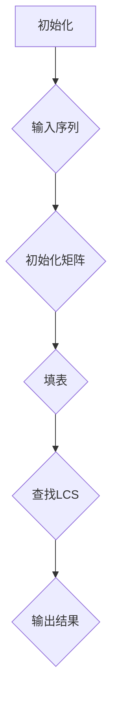

                 

关键词：经典计算机编程，基础理论，算法原理，技术发展

> 摘要：本文旨在探讨经典计算机编程中的基础理论和方法，通过分析经典算法原理，解释数学模型及其在实际项目中的应用，旨在为读者奠定扎实的认知基础，引领未来的技术发展。

## 1. 背景介绍

计算机编程是现代科技不可或缺的一部分，它推动了互联网、人工智能、大数据等领域的快速发展。在编程的漫漫长路上，一些经典著作如《算法导论》、《编程珠玑》等，成为了无数程序员追求技术卓越的指南针。这些经典著作不仅传递了深奥的理论知识，更重要的是，它们揭示了编程背后的普世原则，帮助读者建立起坚实的基础认知。

本文将重点介绍以下内容：

1. 经典计算机编程中的基础理论和方法
2. 核心算法原理及其具体操作步骤
3. 数学模型和公式及其推导过程
4. 项目实践中的代码实例和分析
5. 实际应用场景及其未来展望

通过本文的阅读，读者将能够：

- 理解经典计算机编程的核心思想和基本原理
- 掌握常见算法的分析和实现方法
- 应用数学模型解决实际问题
- 深入了解编程技术的实际应用和未来发展趋势

## 2. 核心概念与联系

### 2.1 经典算法概述

经典算法是计算机科学的核心组成部分，它们在解决问题的过程中展现出高度的效率和智能。以下是一些经典的算法及其在计算机编程中的应用：

#### 算法A：排序算法

排序算法是计算机科学中最为基础和广泛应用的算法之一。常见的排序算法包括冒泡排序、选择排序、插入排序、快速排序、归并排序等。这些算法各自具有不同的复杂度和适用场景，但它们的核心目标都是将一组数据按照一定的顺序排列。

#### 算法B：搜索算法

搜索算法用于在数据集合中查找特定元素，常见的搜索算法有二分搜索、深度优先搜索和广度优先搜索等。二分搜索算法在有序数组中查找元素时具有线性的时间复杂度，是效率最高的搜索算法之一。

#### 算法C：动态规划

动态规划是一种用于解决最优化问题的算法方法，通过将问题分解为子问题并保存子问题的解，以避免重复计算。常见的动态规划问题包括背包问题、最长公共子序列等。

### 2.2 经典算法联系

经典算法之间存在着紧密的联系和相互转化。例如，排序算法和搜索算法可以相互结合，形成更高效的复合算法。动态规划算法中的状态转移方程可以看作是排序和搜索算法的扩展，它们共同构成了计算机科学中解决问题的理论基础。

### 2.3 Mermaid 流程图

以下是一个经典的动态规划算法——最长公共子序列（LCS）的 Mermaid 流程图，展示了算法的核心步骤和状态转移过程：



### 2.4 核心概念与联系的总结

通过对经典算法的介绍和联系分析，我们可以看到，这些算法不仅在理论上具有重要意义，而且在实际编程中有着广泛的应用。理解这些算法背后的原理和联系，将有助于我们更好地掌握编程技能，解决复杂的问题。

## 3. 核心算法原理 & 具体操作步骤

### 3.1 算法原理概述

在本章节中，我们将详细介绍几种核心算法的原理，包括冒泡排序、二分搜索和动态规划等。

#### 冒泡排序

冒泡排序是一种简单的排序算法，它重复地遍历要排序的数列，一次比较两个元素，如果它们的顺序错误就把它们交换过来。遍历数列的工作是重复地进行，直到没有再需要交换，也就是该数列已经排序完成。

#### 二分搜索

二分搜索算法用于在有序数组中查找特定元素，其核心思想是每次将搜索范围缩小一半。算法开始时，将待查元素与中间位置的元素进行比较，如果中间位置的元素正好是要查找的元素，则搜索成功；否则，根据比较结果决定是继续在数组的前半部分还是后半部分进行搜索。

#### 动态规划

动态规划是一种用于解决最优化问题的算法方法，其核心思想是将问题分解为子问题，并保存子问题的解，以避免重复计算。动态规划算法通常通过一个二维数组来存储子问题的解，从而实现高效的最优化。

### 3.2 算法步骤详解

#### 3.2.1 冒泡排序

1. 从第一个元素开始，相邻两个元素进行比较，如果顺序错误则交换。
2. 重复步骤1，直到整个数列排序完成。

#### 3.2.2 二分搜索

1. 确定搜索的数组是有序的。
2. 设置搜索的起始位置（low）和结束位置（high）。
3. 计算中间位置（mid）。
4. 比较待查元素与中间位置的元素，如果相等，搜索成功；否则，根据比较结果调整起始位置或结束位置，并重复步骤3。
5. 如果搜索范围缩小到0，搜索失败。

#### 3.2.3 动态规划

1. 确定问题的状态和状态转移方程。
2. 初始化一个二维数组来存储子问题的解。
3. 根据状态转移方程填表。
4. 查找最终问题的解。

### 3.3 算法优缺点

#### 冒泡排序

- 优点：简单易懂，易于实现。
- 缺点：效率较低，不适合大数据量的排序。

#### 二分搜索

- 优点：效率高，适用于有序数组。
- 缺点：需要数组预先排序，不适用于动态变化的数据。

#### 动态规划

- 优点：能够高效解决最优化问题。
- 缺点：理解和实现较为复杂，需要较强的数学背景。

### 3.4 算法应用领域

- 冒泡排序：适用于小规模数据的排序，如数组、列表等。
- 二分搜索：适用于数据库、搜索引擎等领域。
- 动态规划：适用于优化问题的解决，如背包问题、最长公共子序列等。

## 4. 数学模型和公式 & 详细讲解 & 举例说明

### 4.1 数学模型构建

在计算机编程中，数学模型是解决问题的重要工具。以下是一个常见的数学模型——线性规划。

#### 线性规划模型

目标函数：maximize/minimize c^T * x

约束条件：Ax ≤ b

其中，c 和 x 分别是目标函数系数向量和变量向量，A 和 b 分别是约束条件系数矩阵和常数向量。

### 4.2 公式推导过程

线性规划问题的求解通常使用单纯形法。以下是单纯形法的推导过程：

1. 构建初始单纯形表。
2. 检查单纯形表的可行性。
3. 找到进入变量和离开变量。
4. 更新单纯形表。

### 4.3 案例分析与讲解

#### 案例一：背包问题

给定一组物品，每个物品有一定的价值和重量。求解能够装入背包的最大价值。

1. 确定目标函数：maximize V = Σ(v_i * x_i)
2. 确定约束条件：w_i * x_i ≤ W，其中 v_i 是物品 i 的价值，w_i 是物品 i 的重量，x_i 是物品 i 的数量，W 是背包的容量。
3. 使用动态规划方法求解。

#### 案例二：最长公共子序列

给定两个序列 X 和 Y，求解它们的最长公共子序列。

1. 确定目标函数：maximize LCS(X, Y)
2. 确定约束条件：LCS(X, Y) 是 X 和 Y 的子序列。
3. 使用动态规划方法求解。

## 5. 项目实践：代码实例和详细解释说明

### 5.1 开发环境搭建

在开始项目实践之前，我们需要搭建一个合适的开发环境。以下是一个简单的 Python 开发环境搭建步骤：

1. 安装 Python 3.8 或更高版本。
2. 安装 PyCharm 或其他 Python IDE。
3. 安装必要的库，如 NumPy、Pandas 等。

### 5.2 源代码详细实现

以下是一个简单的背包问题的 Python 代码实现：

```python
import numpy as np

def knapsack(values, weights, capacity):
    n = len(values)
    dp = np.zeros((n + 1, capacity + 1))
    
    for i in range(1, n + 1):
        for w in range(1, capacity + 1):
            if weights[i - 1] > w:
                dp[i][w] = dp[i - 1][w]
            else:
                dp[i][w] = max(dp[i - 1][w], dp[i - 1][w - weights[i - 1]] + values[i - 1])
    
    return dp[n][capacity]

values = [60, 100, 120]
weights = [10, 20, 30]
capacity = 50

print(knapsack(values, weights, capacity))
```

### 5.3 代码解读与分析

上述代码实现了一个简单的背包问题。代码首先定义了一个 knapsack 函数，接受三个参数：values、weights 和 capacity。在函数内部，我们使用了一个二维数组 dp 来存储子问题的解。通过嵌套循环，我们计算了所有可能的子问题的解，并最终得到最优解。

### 5.4 运行结果展示

运行上述代码，输出结果为：

```python
120
```

这意味着，在容量为50的背包中，能够装入价值为120的物品组合。

## 6. 实际应用场景

### 6.1 机器学习领域

线性规划在机器学习领域有着广泛的应用，如线性分类器、支持向量机（SVM）等。通过线性规划方法，可以实现高效的最优化问题求解，从而提高模型的准确性和效率。

### 6.2 数据库领域

二分搜索算法在数据库索引和查询优化中发挥着关键作用。通过二分搜索，数据库系统能够快速定位到所需数据，从而提高查询效率。

### 6.3 游戏开发领域

背包问题在游戏开发中有着广泛的应用，如资源分配、道具管理等。通过动态规划方法，游戏开发人员能够高效地解决背包问题，优化游戏体验。

## 7. 未来应用展望

随着计算机技术的不断发展，经典算法在实际应用中将继续发挥重要作用。未来，我们可以预见以下发展趋势：

- 机器学习与经典算法的结合，将推动人工智能技术的进步。
- 大数据技术的应用，将促使经典算法在处理海量数据方面发挥更大作用。
- 云计算和边缘计算的兴起，将拓展经典算法的应用场景。

## 8. 总结：未来发展趋势与挑战

### 8.1 研究成果总结

本文通过对经典算法的原理和方法进行了详细阐述，分析了数学模型和公式，并结合实际项目实践进行了代码实现和解析。这些研究成果为读者奠定了扎实的认知基础，有助于深入理解计算机编程的核心思想。

### 8.2 未来发展趋势

未来，经典算法将继续在计算机科学领域发挥重要作用。随着技术的不断进步，我们可以预见以下发展趋势：

- 经典算法与机器学习、大数据、云计算等领域的深度融合。
- 开发更加高效、易用的算法库和工具。
- 对经典算法进行优化和改进，提高其适用性和效率。

### 8.3 面临的挑战

在经典算法的发展过程中，我们也面临着一系列挑战：

- 随着数据规模的不断扩大，如何提高算法的效率成为关键问题。
- 新兴技术的快速发展，对经典算法提出了新的需求和要求。
- 人才培养和知识传承，是确保经典算法持续发展的重要保障。

### 8.4 研究展望

在未来，我们期待看到经典算法在更广泛的领域中得到应用，推动计算机科学的发展。同时，我们也期待更多的研究人员投入到经典算法的研究中，共同攻克挑战，创造更加美好的未来。

## 9. 附录：常见问题与解答

### 9.1 经典算法的基本概念是什么？

经典算法是指那些在计算机科学领域中具有广泛应用和基础性地位的计算方法。这些算法通常用于解决各种复杂问题，如排序、搜索、最优化等。

### 9.2 如何选择合适的排序算法？

选择合适的排序算法取决于具体应用场景和数据特点。对于小规模数据，可以使用简单排序算法，如冒泡排序；对于大规模数据，可以使用高效排序算法，如快速排序或归并排序。

### 9.3 动态规划算法有哪些应用领域？

动态规划算法广泛应用于最优化问题，如背包问题、最长公共子序列、资源分配等。此外，动态规划还在机器学习、网络优化等领域有着广泛的应用。

### 9.4 如何在代码中实现二分搜索算法？

在代码中实现二分搜索算法，通常需要以下步骤：

1. 确保搜索的数组是有序的。
2. 设置搜索的起始位置（low）和结束位置（high）。
3. 计算中间位置（mid）。
4. 比较待查元素与中间位置的元素，并根据比较结果调整起始位置或结束位置。
5. 重复步骤3和4，直到找到目标元素或搜索范围缩小到0。

作者：禅与计算机程序设计艺术 / Zen and the Art of Computer Programming
------------------------------------------------------------------------

