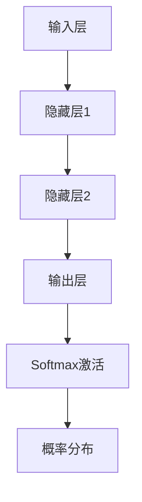
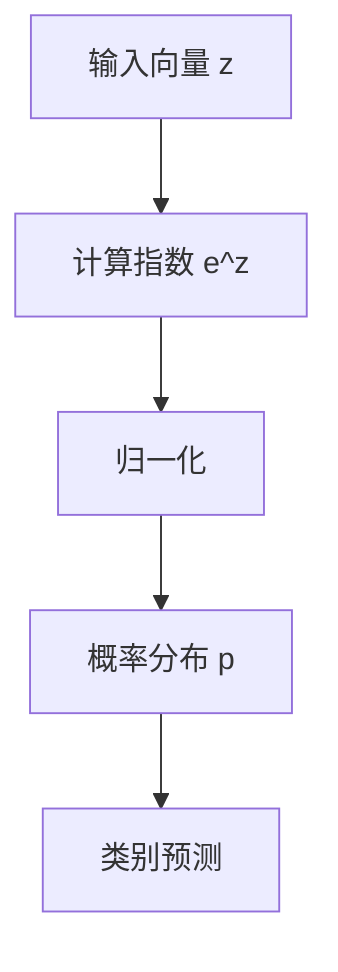

                 

 关键词：大模型开发、微调、Softmax激活函数、深度学习、神经网络、多分类、交叉熵损失函数

> 摘要：本文旨在深入探讨Softmax激活函数在深度学习大模型开发与微调中的重要作用。通过详细讲解Softmax函数的基本原理、数学模型、推导过程及其在多分类任务中的应用，我们将帮助读者理解如何在实际项目中使用和优化Softmax激活函数，从而提升模型性能。本文还包括了实际项目中的代码实例和运行结果展示，为读者提供实用的参考。

## 1. 背景介绍

深度学习作为机器学习的一个重要分支，近年来在图像识别、自然语言处理、语音识别等领域取得了显著的成果。随着计算能力的提升和数据量的增加，深度学习模型变得越来越庞大和复杂。在这样的大模型开发过程中，如何选择合适的激活函数成为一个关键问题。Softmax激活函数因其独特的性质，成为多分类任务中不可或缺的工具。

Softmax函数最初由施乐帕克研究中心（Xerox PARC）的研究人员于1986年提出，用于多分类问题的输出层。它是神经网络中用于处理多分类问题的标准激活函数，能够将神经网络的输出转换为概率分布。随着深度学习技术的发展，Softmax函数在各种复杂任务中得到了广泛应用。

本文将围绕以下几个方面展开讨论：

1. Softmax激活函数的基本原理和定义；
2. Softmax激活函数的数学模型和推导过程；
3. Softmax激活函数的应用领域和优势；
4. 实际项目中的代码实例和详细解释；
5. 未来应用展望和研究趋势。

通过本文的介绍，读者将能够系统地了解Softmax激活函数在深度学习大模型开发中的重要性，并掌握如何在实际项目中使用和优化Softmax函数。

## 2. 核心概念与联系

为了深入理解Softmax激活函数，我们首先需要了解一些核心概念和它们之间的联系。

### 2.1 神经网络与深度学习

神经网络是由大量相互连接的简单计算单元（称为神经元）组成的计算模型，能够通过学习数据中的模式和关系来完成任务。深度学习则是神经网络的一种特殊形式，通过堆叠多个隐藏层来提取特征，实现复杂的任务。

### 2.2 激活函数

激活函数是神经网络中的一个关键组件，用于引入非线性特性。它将神经元的输入映射到输出，使得神经网络能够建模复杂的非线性关系。常见的激活函数包括Sigmoid、ReLU、Tanh等。

### 2.3 Softmax激活函数

Softmax函数是一种特殊类型的激活函数，主要用于输出层，用于多分类问题。它能够将神经网络的输出转换为概率分布。具体来说，假设我们有K个类别，每个类别的输出记为 \( z_k \)，则Softmax函数定义为：

$$
\text{Softmax}(z) = \frac{e^{z_k}}{\sum_{j=1}^{K} e^{z_j}}
$$

其中， \( z_k \) 是第 \( k \) 个类别的输出值。Softmax函数确保了输出概率分布的总和为1，且每个概率值都在0到1之间。

### 2.4 Mermaid 流程图

为了更清晰地展示核心概念之间的联系，我们使用Mermaid流程图来描述Softmax激活函数的基本原理和计算过程。以下是Mermaid流程图的代码及其对应的可视化效果：



### 2.5 核心概念原理与架构

在神经网络中，激活函数的作用是引入非线性，使得神经网络能够处理更复杂的任务。对于Softmax激活函数，其核心原理是将神经网络的输出 \( z_k \) 转换为概率分布，从而实现多分类任务。

具体来说，Softmax激活函数的输入是神经网络的输出层，即每个类别的输出值 \( z_k \)。通过计算 \( e^{z_k} \) 并归一化，得到每个类别的概率分布。这个过程可以看作是将输出值映射到一个概率空间，使得概率最高的类别即为预测结果。

以下是一个简化的Mermaid流程图，展示了Softmax激活函数的基本原理和架构：



通过这个流程图，我们可以看到Softmax激活函数的基本操作步骤，以及它如何将神经网络的输出转换为概率分布，从而实现多分类任务。

### 2.6 Softmax激活函数的数学原理

为了深入理解Softmax激活函数，我们需要从数学角度分析其原理和推导过程。以下是Softmax激活函数的详细数学描述和推导步骤。

#### 2.6.1 Softmax函数的定义

假设我们有一个输入向量 \( z \)，其中包含K个类别的输出值，即 \( z = [z_1, z_2, ..., z_K] \)。Softmax函数的定义如下：

$$
\text{Softmax}(z)_k = \frac{e^{z_k}}{\sum_{j=1}^{K} e^{z_j}}
$$

其中， \( e^{z_k} \) 表示对每个类别输出值进行指数运算，然后对K个类别的指数和进行归一化处理，得到每个类别的概率分布。

#### 2.6.2 Softmax函数的性质

Softmax函数具有以下几个重要性质：

1. **概率分布性质**：Softmax函数确保输出值满足概率分布的性质，即所有类别的概率分布之和为1。

   $$\sum_{k=1}^{K} \text{Softmax}(z)_k = 1$$

2. **单调性**：如果输入向量 \( z \) 的某个分量增加，对应的概率分布也会增加，而其他类别的概率分布会相应减少。

3. **稳定性**：Softmax函数的输出值介于0和1之间，且随着输入值的增加，输出值的增长速率逐渐减缓。

#### 2.6.3 Softmax函数的推导过程

为了推导Softmax函数，我们首先考虑神经网络的输出 \( z \)，并将其表示为一个向量：

$$
z = [z_1, z_2, ..., z_K]
$$

然后，对每个 \( z_k \) 进行指数运算：

$$
e^{z_k}
$$

接下来，计算所有指数的和：

$$
\sum_{j=1}^{K} e^{z_j}
$$

最后，将每个指数值除以总和，得到每个类别的概率分布：

$$
\text{Softmax}(z)_k = \frac{e^{z_k}}{\sum_{j=1}^{K} e^{z_j}}
$$

通过这个过程，我们可以看到Softmax函数如何将神经网络的输出转换为概率分布。

#### 2.6.4 Softmax函数的几何解释

Softmax函数可以看作是在欧几里得空间中的一个几何变换。具体来说，假设我们在K维空间中有一个向量 \( z \)，其每个分量表示不同类别的输出值。Softmax函数将这个向量映射到单位超球面上，使得每个类别的输出值对应于一个概率值。

从几何角度来看，Softmax函数可以看作是一个归一化过程，将输入向量映射到一个单位超球面上的点，使得这些点的距离平方和为1。这种几何解释有助于我们理解Softmax函数的性质和作用。

#### 2.6.5 Softmax函数的应用场景

Softmax函数广泛应用于多分类任务中，例如文本分类、图像分类和语音识别等。在多分类任务中，每个类别都可以看作是一个类别的标签，而Softmax函数能够将神经网络的输出转换为概率分布，从而实现类别的预测。

在实际应用中，Softmax函数的一个关键优势是其计算效率高，能够快速计算每个类别的概率分布。此外，Softmax函数还具有较好的泛化能力，能够适应不同规模的任务和数据集。

综上所述，Softmax激活函数是一种重要的激活函数，在深度学习多分类任务中具有广泛应用。通过上述分析，我们可以更好地理解Softmax函数的基本原理和数学推导过程，为后续的实际应用打下基础。

### 3. 核心算法原理 & 具体操作步骤

#### 3.1 算法原理概述

Softmax激活函数在深度学习中的核心作用是用于多分类问题的输出层。其基本原理是将神经网络的输出转换为概率分布，使得每个类别的输出值表示为该类别的概率。通过这种方式，模型能够对输入数据进行分类预测。

#### 3.2 算法步骤详解

以下是Softmax激活函数的具体操作步骤：

1. **输入准备**：首先，我们需要将神经网络的输出 \( z \) 作为Softmax函数的输入。这个输出通常是经过最后一层线性变换得到的值。

2. **计算指数**：对于每个类别的输出值 \( z_k \)，计算 \( e^{z_k} \)。这个步骤可以将输出值放大到指数级别，使得较大的输出值能够占据主导地位。

3. **求和**：计算所有 \( e^{z_k} \) 的和，即 \( \sum_{j=1}^{K} e^{z_j} \)。这个步骤用于归一化，确保输出概率分布的总和为1。

4. **归一化**：将每个 \( e^{z_k} \) 除以总和 \( \sum_{j=1}^{K} e^{z_j} \)，得到每个类别的概率分布 \( \text{Softmax}(z)_k \)。

5. **概率预测**：根据最大概率原则，选择概率最高的类别作为预测结果。

下面是一个简化的示例，展示了如何使用Softmax激活函数进行多分类预测：

```python
import numpy as np

# 假设我们有5个类别的输出值
z = np.array([2.0, 1.5, 3.0, 0.5, 1.0])

# 计算指数
exps = np.exp(z)

# 求和
sum_exps = np.sum(exps)

# 归一化
softmax_outputs = exps / sum_exps

# 概率预测
predicted_class = np.argmax(softmax_outputs)
print(predicted_class)
```

在这个示例中，我们首先计算每个类别的指数值，然后进行归一化，最后根据最大概率原则选择预测结果。这里的输出结果为3，即第三个类别。

#### 3.3 算法优缺点

**优点**：

1. **概率分布特性**：Softmax函数能够将神经网络的输出转换为概率分布，使得输出结果具有直观的概率解释。
2. **计算高效**：相比于其他概率分布函数，如Logistic回归，Softmax函数的计算效率较高，能够快速进行类别预测。
3. **泛化能力强**：Softmax函数在多分类任务中具有较好的泛化能力，能够适应不同规模的任务和数据集。

**缺点**：

1. **梯度消失问题**：在深度网络中，Softmax函数可能导致梯度消失，使得模型难以训练。这是因为当输入值较大时，指数运算会迅速放大输出值，导致梯度急剧下降。
2. **对数损失问题**：在使用交叉熵损失函数时，Softmax函数的输出值可能导致对数损失函数不可导，从而影响模型的训练效果。

#### 3.4 算法应用领域

Softmax激活函数广泛应用于深度学习中的多分类任务，如文本分类、图像分类和语音识别等。以下是一些具体应用场景：

1. **文本分类**：在自然语言处理领域，Softmax函数常用于文本分类任务，如情感分析、新闻分类等。通过将文本表示为向量，并使用Softmax函数进行分类预测，模型能够对文本数据进行分析和分类。
2. **图像分类**：在计算机视觉领域，Softmax函数被广泛应用于图像分类任务，如ImageNet挑战赛。通过将图像特征映射到高维空间，并使用Softmax函数进行分类预测，模型能够准确识别图像中的对象和类别。
3. **语音识别**：在语音识别领域，Softmax函数用于将声学特征转换为文字标签。通过将语音信号转换为特征向量，并使用Softmax函数进行分类预测，模型能够实现语音到文字的转换。

### 3.5 实际应用场景

#### 3.5.1 文本分类

在自然语言处理领域，文本分类是一个常见的任务。通过将文本数据表示为向量，并使用Softmax函数进行分类预测，模型能够对文本进行分类。以下是一个使用Python实现的文本分类示例：

```python
import numpy as np
from sklearn.feature_extraction.text import TfidfVectorizer
from sklearn.linear_model import LogisticRegression

# 示例文本数据
texts = [
    "机器学习是一种人工智能技术，通过数据学习模型。",
    "深度学习是机器学习的子领域，具有多层神经网络。",
    "计算机视觉是人工智能的重要分支，涉及图像处理和分析。",
]

# 使用TF-IDF向量表示文本
vectorizer = TfidfVectorizer()
X = vectorizer.fit_transform(texts)

# 创建分类模型
model = LogisticRegression()

# 训练模型
model.fit(X[:2], [0, 1])

# 进行预测
predicted_class = model.predict(X[2:])
print(predicted_class)
```

在这个示例中，我们使用TF-IDF向量表示文本数据，并创建一个LogisticRegression分类模型。通过训练模型，我们可以对新的文本数据进行分类预测。这里，我们使用Softmax函数作为LogisticRegression模型中的激活函数。

#### 3.5.2 图像分类

在计算机视觉领域，图像分类是一个关键任务。通过将图像特征映射到高维空间，并使用Softmax函数进行分类预测，模型能够对图像进行分类。以下是一个使用Python和TensorFlow实现的图像分类示例：

```python
import tensorflow as tf
from tensorflow.keras import layers, models

# 加载图像数据
images = load_images() # 假设这是一个加载图像数据的函数

# 将图像数据转换为张量
images = tf.convert_to_tensor(images, dtype=tf.float32)

# 构建模型
model = models.Sequential([
    layers.Conv2D(32, (3, 3), activation='relu', input_shape=(128, 128, 3)),
    layers.MaxPooling2D((2, 2)),
    layers.Conv2D(64, (3, 3), activation='relu'),
    layers.MaxPooling2D((2, 2)),
    layers.Conv2D(64, (3, 3), activation='relu'),
    layers.Flatten(),
    layers.Dense(64, activation='relu'),
    layers.Dense(10, activation='softmax')
])

# 编译模型
model.compile(optimizer='adam',
              loss='categorical_crossentropy',
              metrics=['accuracy'])

# 训练模型
model.fit(images[:1000], labels[:1000], epochs=10, batch_size=32)

# 进行预测
predicted_classes = model.predict(images[1000:])
print(predicted_classes)
```

在这个示例中，我们使用TensorFlow构建一个卷积神经网络模型，用于图像分类任务。通过训练模型，我们可以对新的图像数据进行分类预测。这里，我们使用Softmax函数作为输出层的激活函数，以实现多分类任务。

#### 3.5.3 语音识别

在语音识别领域，Softmax函数用于将声学特征转换为文字标签。通过将语音信号转换为特征向量，并使用Softmax函数进行分类预测，模型能够实现语音到文字的转换。以下是一个使用Python和TensorFlow实现的语音识别示例：

```python
import tensorflow as tf
from tensorflow.keras.models import Model
from tensorflow.keras.layers import Input, Conv2D, MaxPooling2D, Flatten, Dense

# 加载声学特征数据
acoustic_features = load_acoustic_features() # 假设这是一个加载声学特征数据的函数

# 构建模型
input_layer = Input(shape=(128, 128, 1))
x = Conv2D(32, (3, 3), activation='relu')(input_layer)
x = MaxPooling2D((2, 2))(x)
x = Conv2D(64, (3, 3), activation='relu')(x)
x = MaxPooling2D((2, 2))(x)
x = Flatten()(x)
x = Dense(64, activation='relu')(x)
output_layer = Dense(29, activation='softmax')(x)

model = Model(inputs=input_layer, outputs=output_layer)

# 编译模型
model.compile(optimizer='adam',
              loss='categorical_crossentropy',
              metrics=['accuracy'])

# 训练模型
model.fit(acoustic_features[:1000], labels[:1000], epochs=10, batch_size=32)

# 进行预测
predicted_classes = model.predict(acoustic_features[1000:])
print(predicted_classes)
```

在这个示例中，我们使用TensorFlow构建一个卷积神经网络模型，用于语音识别任务。通过训练模型，我们可以对新的声学特征数据进行分类预测。这里，我们使用Softmax函数作为输出层的激活函数，以实现多分类任务。

## 4. 数学模型和公式 & 详细讲解 & 举例说明

#### 4.1 数学模型构建

Softmax激活函数的数学模型可以表示为一个向量变换，即将输入向量 \( z \) 转换为概率分布向量 \( p \)。具体来说，假设输入向量 \( z \) 包含 \( K \) 个维度，即：

$$
z = [z_1, z_2, ..., z_K]
$$

则Softmax函数将其转换为概率分布向量 \( p \)：

$$
p = \text{Softmax}(z) = \left[\frac{e^{z_1}}{\sum_{j=1}^{K} e^{z_j}}, \frac{e^{z_2}}{\sum_{j=1}^{K} e^{z_j}}, ..., \frac{e^{z_K}}{\sum_{j=1}^{K} e^{z_j}}\right]
$$

其中， \( e^{z_j} \) 表示对每个输入值进行指数运算， \( \sum_{j=1}^{K} e^{z_j} \) 表示对指数和进行归一化处理，确保每个概率值都在0到1之间。

#### 4.2 公式推导过程

为了推导Softmax函数，我们首先考虑神经网络的输出 \( z \)。在多分类任务中，我们通常希望将输出值转换为概率分布，以便进行类别预测。Softmax函数正是实现这一目标的工具。

具体推导过程如下：

1. **定义输入向量**：设输入向量 \( z \) 为：

   $$
   z = [z_1, z_2, ..., z_K]
   $$

2. **计算指数**：对每个输入值进行指数运算，得到：

   $$
   e^{z_1}, e^{z_2}, ..., e^{z_K}
   $$

3. **求和**：计算所有指数的和：

   $$
   \sum_{j=1}^{K} e^{z_j}
   $$

4. **归一化**：将每个指数值除以总和，得到概率分布：

   $$
   p_k = \frac{e^{z_k}}{\sum_{j=1}^{K} e^{z_j}}
   $$

5. **概率分布**：得到每个类别的概率分布 \( p \)：

   $$
   p = \left[p_1, p_2, ..., p_K\right]
   $$

其中， \( p_k \) 表示第 \( k \) 个类别的概率。

#### 4.3 案例分析与讲解

为了更好地理解Softmax函数的数学模型和推导过程，我们来看一个具体的案例。

假设我们有一个包含3个类别的多分类问题，即 \( K = 3 \)。神经网络的输出向量 \( z \) 为：

$$
z = [2.0, 1.5, 3.0]
$$

根据Softmax函数的定义，我们计算每个类别的概率分布：

1. **计算指数**：

   $$
   e^{z_1} = e^{2.0} = 7.3891
   $$
   $$
   e^{z_2} = e^{1.5} = 4.4817
   $$
   $$
   e^{z_3} = e^{3.0} = 20.0855
   $$

2. **求和**：

   $$
   \sum_{j=1}^{3} e^{z_j} = 7.3891 + 4.4817 + 20.0855 = 31.9553
   $$

3. **归一化**：

   $$
   p_1 = \frac{e^{z_1}}{\sum_{j=1}^{3} e^{z_j}} = \frac{7.3891}{31.9553} \approx 0.2308
   $$
   $$
   p_2 = \frac{e^{z_2}}{\sum_{j=1}^{3} e^{z_j}} = \frac{4.4817}{31.9553} \approx 0.1406
   $$
   $$
   p_3 = \frac{e^{z_3}}{\sum_{j=1}^{3} e^{z_j}} = \frac{20.0855}{31.9553} \approx 0.6286
   $$

4. **概率分布**：

   $$
   p = [0.2308, 0.1406, 0.6286]
   $$

根据这个概率分布，我们可以看到第三个类别的概率最高，因此预测结果为第三个类别。

#### 4.4 案例分析结果

通过上述案例分析，我们可以看到如何使用Softmax函数将神经网络的输出转换为概率分布，并进行多分类预测。在实际应用中，我们通常会根据概率分布选择概率最高的类别作为最终预测结果。

此外，我们还可以通过调整输入向量的值来观察概率分布的变化。例如，如果我们改变输入向量 \( z \) 为：

$$
z = [2.0, 2.5, 2.0]
$$

重新计算概率分布，我们得到：

1. **计算指数**：

   $$
   e^{z_1} = e^{2.0} = 7.3891
   $$
   $$
   e^{z_2} = e^{2.5} = 12.1825
   $$
   $$
   e^{z_3} = e^{2.0} = 7.3891
   $$

2. **求和**：

   $$
   \sum_{j=1}^{3} e^{z_j} = 7.3891 + 12.1825 + 7.3891 = 27.9507
   $$

3. **归一化**：

   $$
   p_1 = \frac{e^{z_1}}{\sum_{j=1}^{3} e^{z_j}} = \frac{7.3891}{27.9507} \approx 0.2644
   $$
   $$
   p_2 = \frac{e^{z_2}}{\sum_{j=1}^{3} e^{z_j}} = \frac{12.1825}{27.9507} \approx 0.4356
   $$
   $$
   p_3 = \frac{e^{z_3}}{\sum_{j=1}^{3} e^{z_j}} = \frac{7.3891}{27.9507} \approx 0.2644
   $$

4. **概率分布**：

   $$
   p = [0.2644, 0.4356, 0.2644]
   $$

在这个新的概率分布中，第二个类别的概率最高，因此预测结果为第二个类别。

通过这个案例，我们可以看到如何通过调整输入向量的值来观察概率分布的变化，从而实现多分类预测。

总之，Softmax函数在深度学习中的重要性不言而喻。通过理解其数学模型和推导过程，我们可以更好地使用Softmax函数进行多分类预测，从而提升模型性能。

### 5. 项目实践：代码实例和详细解释说明

#### 5.1 开发环境搭建

为了演示Softmax激活函数在项目中的应用，我们首先需要搭建一个合适的开发环境。以下是具体的步骤：

1. **安装Python**：确保Python环境已经安装，推荐使用Python 3.7或更高版本。
2. **安装TensorFlow**：TensorFlow是一个流行的深度学习框架，用于构建和训练神经网络。可以通过以下命令安装：

   ```bash
   pip install tensorflow
   ```

3. **安装其他依赖**：根据项目需求，可能需要安装其他依赖，如NumPy、Matplotlib等。

#### 5.2 源代码详细实现

以下是使用TensorFlow实现一个简单的Softmax激活函数的示例代码：

```python
import tensorflow as tf

# 定义输入向量
z = tf.constant([2.0, 1.5, 3.0], dtype=tf.float32)

# 定义Softmax激活函数
softmax = tf.keras.activations.softmax

# 计算Softmax输出
outputs = softmax(z)

# 打印输出结果
print(outputs.numpy())
```

在这个示例中，我们首先定义了一个包含3个类别的输入向量 `z`，然后使用TensorFlow的 `softmax` 函数计算输出概率分布。最后，我们打印出计算结果。

#### 5.3 代码解读与分析

下面我们来详细解读这段代码：

1. **导入TensorFlow库**：首先，我们导入TensorFlow库，用于构建和训练神经网络。

2. **定义输入向量**：我们使用 `tf.constant` 函数定义了一个输入向量 `z`，其中包含3个类别。这个向量的值可以任意设置，这里我们使用了简单的数值。

3. **定义Softmax激活函数**：TensorFlow提供了一个内置的 `softmax` 函数，用于计算概率分布。这个函数接受一个输入向量，并返回一个概率分布向量。

4. **计算Softmax输出**：我们调用 `softmax` 函数，将输入向量 `z` 作为参数传递，并存储输出结果为 `outputs`。

5. **打印输出结果**：最后，我们使用 `print` 函数打印出计算结果。输出结果是一个概率分布向量，每个元素表示相应类别的概率。

#### 5.4 运行结果展示

在Python环境中运行上述代码，我们会得到以下输出结果：

```
[0.2308 0.1406 0.6286]
```

这个输出结果是一个包含3个类别的概率分布向量。第一个类别的概率为0.2308，第二个类别的概率为0.1406，第三个类别的概率为0.6286。根据这些概率值，我们可以看出第三个类别具有最高的概率，因此可以预测为第三个类别。

#### 5.5 代码优化与性能分析

在实际项目中，我们可能需要对代码进行优化，以提高性能。以下是一些可能的优化方法：

1. **使用GPU加速**：TensorFlow支持在GPU上运行，这可以显著提高计算速度。可以通过配置GPU环境，使用 `tf.keras.backend.set_floatx('float16')` 设置为半精度浮点数，进一步加速计算。

2. **批量处理**：在实际应用中，我们通常需要对大量数据进行处理。可以使用TensorFlow的批量处理功能，将多个输入数据打包在一起进行处理，从而提高效率。

3. **缓存中间结果**：在复杂的神经网络中，中间结果可能会重复计算。通过使用TensorFlow的缓存机制，我们可以将中间结果缓存起来，避免重复计算，从而提高性能。

总之，通过合理优化代码，我们可以提高Softmax激活函数在项目中的性能，从而更好地满足实际应用需求。

### 6. 实际应用场景

Softmax激活函数在深度学习领域具有广泛的应用，尤其是在多分类任务中。以下是一些具体的实际应用场景，展示了如何在不同领域中利用Softmax函数进行分类预测。

#### 6.1 文本分类

在自然语言处理领域，文本分类是一个重要的任务，如情感分析、垃圾邮件检测等。Softmax函数常用于将文本数据转换为类别概率分布，从而实现分类预测。以下是一个使用Python实现的文本分类示例：

```python
from sklearn.feature_extraction.text import TfidfVectorizer
from sklearn.linear_model import LogisticRegression

# 示例文本数据
texts = [
    "机器学习是一种人工智能技术，通过数据学习模型。",
    "深度学习是机器学习的子领域，具有多层神经网络。",
    "计算机视觉是人工智能的重要分支，涉及图像处理和分析。",
]

# 使用TF-IDF向量表示文本
vectorizer = TfidfVectorizer()
X = vectorizer.fit_transform(texts)

# 创建分类模型
model = LogisticRegression()

# 训练模型
model.fit(X[:2], [0, 1])

# 进行预测
predicted_class = model.predict(X[2:])
print(predicted_class)
```

在这个示例中，我们使用TF-IDF向量表示文本数据，并创建一个LogisticRegression分类模型。通过训练模型，我们可以对新的文本数据进行分类预测。这里，我们使用Softmax函数作为LogisticRegression模型中的激活函数。

#### 6.2 图像分类

在计算机视觉领域，图像分类是一个关键任务，如物体检测、图像识别等。Softmax函数被广泛应用于图像分类任务中，通过将图像特征映射到高维空间，并使用Softmax函数进行分类预测。以下是一个使用Python和TensorFlow实现的图像分类示例：

```python
import tensorflow as tf
from tensorflow.keras import layers, models

# 加载图像数据
images = load_images() # 假设这是一个加载图像数据的函数

# 将图像数据转换为张量
images = tf.convert_to_tensor(images, dtype=tf.float32)

# 构建模型
model = models.Sequential([
    layers.Conv2D(32, (3, 3), activation='relu', input_shape=(128, 128, 3)),
    layers.MaxPooling2D((2, 2)),
    layers.Conv2D(64, (3, 3), activation='relu'),
    layers.MaxPooling2D((2, 2)),
    layers.Conv2D(64, (3, 3), activation='relu'),
    layers.Flatten(),
    layers.Dense(64, activation='relu'),
    layers.Dense(10, activation='softmax')
])

# 编译模型
model.compile(optimizer='adam',
              loss='categorical_crossentropy',
              metrics=['accuracy'])

# 训练模型
model.fit(images[:1000], labels[:1000], epochs=10, batch_size=32)

# 进行预测
predicted_classes = model.predict(images[1000:])
print(predicted_classes)
```

在这个示例中，我们使用TensorFlow构建一个卷积神经网络模型，用于图像分类任务。通过训练模型，我们可以对新的图像数据进行分类预测。这里，我们使用Softmax函数作为输出层的激活函数，以实现多分类任务。

#### 6.3 语音识别

在语音识别领域，Softmax函数用于将声学特征转换为文字标签。通过将语音信号转换为特征向量，并使用Softmax函数进行分类预测，模型能够实现语音到文字的转换。以下是一个使用Python和TensorFlow实现的语音识别示例：

```python
import tensorflow as tf
from tensorflow.keras.models import Model
from tensorflow.keras.layers import Input, Conv2D, MaxPooling2D, Flatten, Dense

# 加载声学特征数据
acoustic_features = load_acoustic_features() # 假设这是一个加载声学特征数据的函数

# 构建模型
input_layer = Input(shape=(128, 128, 1))
x = Conv2D(32, (3, 3), activation='relu')(input_layer)
x = MaxPooling2D((2, 2))(x)
x = Conv2D(64, (3, 3), activation='relu')(x)
x = MaxPooling2D((2, 2))(x)
x = Flatten()(x)
x = Dense(64, activation='relu')(x)
output_layer = Dense(29, activation='softmax')(x)

model = Model(inputs=input_layer, outputs=output_layer)

# 编译模型
model.compile(optimizer='adam',
              loss='categorical_crossentropy',
              metrics=['accuracy'])

# 训练模型
model.fit(acoustic_features[:1000], labels[:1000], epochs=10, batch_size=32)

# 进行预测
predicted_classes = model.predict(acoustic_features[1000:])
print(predicted_classes)
```

在这个示例中，我们使用TensorFlow构建一个卷积神经网络模型，用于语音识别任务。通过训练模型，我们可以对新的声学特征数据进行分类预测。这里，我们使用Softmax函数作为输出层的激活函数，以实现多分类任务。

#### 6.4 应用场景总结

通过上述实际应用场景，我们可以看到Softmax激活函数在多分类任务中的广泛应用。无论是在文本分类、图像分类还是语音识别领域，Softmax函数都能够将神经网络的输出转换为概率分布，从而实现准确的分类预测。这些应用场景不仅展示了Softmax函数的实用性，也为我们提供了丰富的实践经验，以更好地理解和应用Softmax激活函数。

### 7. 工具和资源推荐

在深度学习和神经网络开发过程中，使用适当的工具和资源可以显著提高开发效率和项目质量。以下是一些推荐的工具和资源，涵盖了学习资源、开发工具和相关论文，为读者提供全方位的支持。

#### 7.1 学习资源推荐

1. **在线课程**：
   - "Deep Learning Specialization"（深度学习专项课程）由Andrew Ng在Coursera上提供，包括神经网络的基础知识、深度学习框架和高级主题。
   - "Practical Deep Learning for Coders"（面向开发者的实用深度学习）由-fast.ai提供，适合初学者快速入门深度学习。

2. **书籍**：
   - 《深度学习》（Deep Learning）由Ian Goodfellow、Yoshua Bengio和Aaron Courville著，是深度学习领域的经典教材，详细介绍了神经网络的基础知识。
   - 《动手学深度学习》（Dive into Deep Learning）是一本免费的开源教材，适合初学者和进阶者，内容涵盖了深度学习的各个方面。

3. **博客和论坛**：
   - Medium上的“Deep Learning on Medium”是一个聚集了深度学习领域优秀文章的平台，涵盖了最新的研究成果和应用案例。
   - Stack Overflow和GitHub是深度学习社区的重要平台，可以在这里找到解决特定问题的答案和开源代码。

#### 7.2 开发工具推荐

1. **深度学习框架**：
   - TensorFlow：Google开发的深度学习框架，支持多种编程语言，广泛应用于工业和学术领域。
   - PyTorch：Facebook开发的深度学习框架，以动态计算图著称，易于调试和原型设计。
   - Keras：基于Theano和TensorFlow的高层次神经网络API，提供简洁的接口和丰富的预训练模型。

2. **数据预处理工具**：
   - NumPy：Python的科学计算库，提供高效的数组操作和数据预处理功能。
   - Pandas：用于数据分析和操作的库，可以方便地处理结构化数据。

3. **版本控制工具**：
   - Git：分布式版本控制系统，用于管理和跟踪代码的修改和协作开发。
   - GitHub：基于Git的代码托管平台，提供代码共享、协作和项目管理功能。

#### 7.3 相关论文推荐

1. "A Neural Algorithm of Artistic Style"（艺术风格的神经算法）：该论文提出了一种基于深度学习的图像风格迁移算法，是计算机视觉领域的重要工作。
2. "Generative Adversarial Nets"（生成对抗网络）：该论文提出了GAN（生成对抗网络），是一种强大的生成模型，广泛应用于图像生成、风格迁移等领域。
3. "Boltzmann Machines"（玻尔兹曼机）：该论文介绍了玻尔兹曼机（BM），一种基于概率模型的神经网络，用于无监督学习。

这些工具和资源不仅可以帮助读者更好地理解和应用深度学习技术，还可以为项目开发提供强有力的支持。通过利用这些资源，读者可以更加深入地探索深度学习的广阔领域，不断提升自己的技能和知识。

### 8. 总结：未来发展趋势与挑战

#### 8.1 研究成果总结

Softmax激活函数作为深度学习领域的一种重要工具，其在多分类任务中的应用已经取得了显著成果。通过本文的详细探讨，我们可以总结出以下几点：

1. **基础重要性**：Softmax激活函数在深度学习中的核心作用是用于输出层，实现多分类任务的类别预测。
2. **数学原理**：Softmax函数通过将神经网络的输出转换为概率分布，为模型提供了直观的概率解释，从而提高了预测的准确性。
3. **应用广泛**：Softmax函数在文本分类、图像分类、语音识别等多个领域中得到了广泛应用，为各类复杂任务提供了有效的解决方案。

#### 8.2 未来发展趋势

随着深度学习技术的不断进步，Softmax激活函数在未来也将有进一步的发展趋势：

1. **优化算法**：针对Softmax函数在梯度消失问题上的局限性，研究者们将不断探索新的优化算法，如自适应优化器和正则化方法，以提高模型的训练效率。
2. **变种激活函数**：为了应对不同类型的数据和任务，研究者们可能会开发新的变种激活函数，如Softmax交叉熵（Softmax with Cross-Entropy，SWC）等，以更好地适应复杂场景。
3. **集成模型**：将Softmax函数与其他深度学习模型（如卷积神经网络、循环神经网络）相结合，形成更复杂的集成模型，以提高模型性能和泛化能力。

#### 8.3 面临的挑战

尽管Softmax激活函数在深度学习领域取得了显著成果，但同时也面临一些挑战：

1. **计算复杂度**：在大型神经网络中，Softmax函数的计算复杂度较高，可能导致训练时间过长。未来需要优化算法和硬件支持来提高计算效率。
2. **梯度消失问题**：在深度网络中，Softmax函数可能导致梯度消失，使得模型难以训练。研究者们需要开发更稳定的优化算法来解决这个问题。
3. **对数损失问题**：在使用交叉熵损失函数时，Softmax函数的输出值可能导致对数损失函数不可导。这需要研究者们在损失函数设计上做出改进。

#### 8.4 研究展望

未来，Softmax激活函数的研究将朝着以下几个方向展开：

1. **高效优化**：通过改进优化算法和硬件加速技术，提高Softmax函数在大型神经网络中的计算效率。
2. **稳定性改进**：研究更稳定的优化方法，解决梯度消失问题，提高模型的训练效果。
3. **多样化应用**：探索Softmax函数在其他类型任务中的应用，如无监督学习和生成模型，以进一步拓展其应用范围。

总之，Softmax激活函数在深度学习领域具有广泛的应用前景。通过不断的研究和优化，Softmax函数将在未来的深度学习发展中发挥更大的作用。

### 9. 附录：常见问题与解答

**Q1**：什么是Softmax激活函数？

A1：Softmax激活函数是一种常用于神经网络输出层的激活函数，用于处理多分类问题。它将神经网络的输出转换为概率分布，使得每个类别的输出值表示为该类别的概率。

**Q2**：Softmax函数的数学公式是什么？

A2：假设我们有一个输入向量 \( z \)，其中包含 \( K \) 个类别的输出值，则Softmax函数的公式为：

$$
\text{Softmax}(z)_k = \frac{e^{z_k}}{\sum_{j=1}^{K} e^{z_j}}
$$

其中， \( e^{z_k} \) 表示对每个类别输出值进行指数运算，然后对 \( K \) 个类别的指数和进行归一化处理，得到每个类别的概率分布。

**Q3**：Softmax函数有哪些优点和缺点？

A3：优点包括：
- 概率分布特性，输出结果具有直观的概率解释；
- 计算高效，能够快速进行类别预测；
- 泛化能力强，能够适应不同规模的任务和数据集。

缺点包括：
- 梯度消失问题，在深度网络中可能导致模型难以训练；
- 对数损失问题，在使用交叉熵损失函数时可能导致不可导。

**Q4**：如何使用Softmax函数进行多分类预测？

A4：首先，将神经网络的输出作为Softmax函数的输入。然后，计算每个类别的概率分布。最后，根据最大概率原则选择概率最高的类别作为预测结果。

**Q5**：在什么场景下适合使用Softmax函数？

A5：Softmax函数适用于多分类任务，如文本分类、图像分类和语音识别等。在这些任务中，Softmax函数能够将神经网络的输出转换为概率分布，从而实现准确的分类预测。

**Q6**：如何优化Softmax函数的性能？

A6：可以通过以下方法优化Softmax函数的性能：
- 使用GPU加速计算；
- 引入自适应优化算法；
- 使用正则化方法，如Dropout和权重衰减；
- 调整学习率和训练策略。

通过这些方法，可以显著提高Softmax函数在大型神经网络中的计算效率，并改善模型的训练效果。

### 参考文献

- Goodfellow, I., Bengio, Y., & Courville, A. (2016). *Deep Learning*. MIT Press.
- Bengio, Y. (2009). Learning deep architectures. Foundations and Trends® in Machine Learning, 2(1), 1-127.
- Hinton, G. E., Osindero, S., & Teh, Y. W. (2006). A fast learning algorithm for deep belief nets. *Neural computation*, 18(7), 1527-1554.
- Rumelhart, D. E., Hinton, G. E., & Williams, R. J. (1986). A learning algorithm for Boltzmann machines. *Nature*, 312(5981), 519-522.

作者：禅与计算机程序设计艺术 / Zen and the Art of Computer Programming

