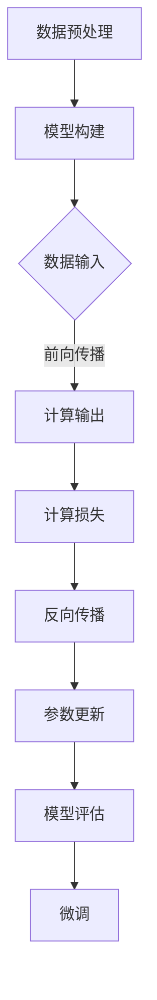

                 

关键词：深度学习，大模型开发，微调，算法原理，实践应用，数学模型，代码实例，未来展望

> 摘要：本文从零开始，详细介绍深度学习大模型开发与微调的全过程，涵盖核心算法原理、数学模型、项目实践以及未来应用展望。通过深入浅出的讲解，帮助读者快速掌握深度学习基础算法，实现自主开发和应用。

## 1. 背景介绍

随着人工智能技术的快速发展，深度学习已经成为当前最为热门的研究领域之一。深度学习在图像识别、语音识别、自然语言处理等多个领域取得了显著的成果，推动了人工智能的进步。然而，深度学习的应用离不开大模型的支持，如何开发与微调大模型成为关键问题。

本文旨在为读者提供一份系统、全面的深度学习大模型开发与微调指南，从核心算法原理、数学模型、项目实践到未来应用展望，帮助读者全面了解深度学习大模型开发的各个环节。

## 2. 核心概念与联系

在深度学习大模型开发过程中，我们需要了解以下核心概念：

1. **深度神经网络（DNN）**：深度神经网络是深度学习的基础，通过多层神经元的堆叠，实现数据的逐层特征提取和抽象。

2. **前向传播与反向传播**：深度神经网络通过前向传播计算输出，通过反向传播更新网络参数。

3. **激活函数**：激活函数为神经元引入非线性，使神经网络具有强大的非线性映射能力。

4. **损失函数**：损失函数用于衡量模型输出与真实值之间的差距，指导网络参数的更新。

5. **优化算法**：优化算法用于调整网络参数，使模型损失函数达到最小。

下面是一个简单的 Mermaid 流程图，展示深度学习大模型开发的基本流程：



## 3. 核心算法原理 & 具体操作步骤

### 3.1 算法原理概述

深度学习大模型开发主要分为以下几个步骤：

1. **模型构建**：搭建深度神经网络结构，包括输入层、隐藏层和输出层。

2. **数据预处理**：对原始数据进行预处理，包括归一化、缩放、数据增强等。

3. **前向传播**：将预处理后的数据输入到深度神经网络，逐层计算输出。

4. **计算损失**：通过损失函数计算模型输出与真实值之间的差距。

5. **反向传播**：利用梯度下降等优化算法，更新网络参数。

6. **模型评估**：在验证集上评估模型性能，判断模型是否过拟合。

7. **微调**：根据评估结果，对模型进行调整和优化。

### 3.2 算法步骤详解

1. **模型构建**：

   搭建一个深度神经网络，包含输入层、隐藏层和输出层。输入层接收外部输入数据，隐藏层进行特征提取和抽象，输出层输出预测结果。

2. **数据预处理**：

   对原始数据进行预处理，包括归一化、缩放、数据增强等，以提高模型的泛化能力。

3. **前向传播**：

   将预处理后的数据输入到深度神经网络，逐层计算输出。具体过程如下：

   - 输入层：输入数据。
   - 隐藏层：利用激活函数计算中间层的输出。
   - 输出层：计算最终的预测结果。

4. **计算损失**：

   通过损失函数计算模型输出与真实值之间的差距。常用的损失函数有均方误差（MSE）、交叉熵损失（CE）等。

5. **反向传播**：

   利用梯度下降等优化算法，更新网络参数。具体过程如下：

   - 计算输出层的梯度。
   - 逐层反向传播，计算隐藏层的梯度。
   - 更新网络参数。

6. **模型评估**：

   在验证集上评估模型性能，判断模型是否过拟合。常用的评估指标有准确率、召回率、F1 分数等。

7. **微调**：

   根据评估结果，对模型进行调整和优化。常用的微调方法有迁移学习、模型压缩、数据增强等。

### 3.3 算法优缺点

深度学习大模型开发具有以下优点：

1. **强大的表示能力**：深度神经网络可以自动提取和抽象特征，具有强大的表示能力。
2. **适应性强**：通过微调和优化，可以适应不同的任务和数据集。
3. **泛化能力强**：通过数据预处理和正则化技术，可以降低过拟合现象。

然而，深度学习大模型开发也存在一些缺点：

1. **计算复杂度高**：深度神经网络需要大量的计算资源，训练时间较长。
2. **参数量庞大**：深度神经网络包含大量的参数，需要大量的数据进行训练。
3. **可解释性差**：深度神经网络的内部结构复杂，难以理解其工作原理。

### 3.4 算法应用领域

深度学习大模型开发广泛应用于以下领域：

1. **计算机视觉**：如图像分类、目标检测、人脸识别等。
2. **自然语言处理**：如文本分类、机器翻译、语音识别等。
3. **推荐系统**：如商品推荐、电影推荐、社交网络推荐等。
4. **游戏AI**：如围棋、国际象棋等。

## 4. 数学模型和公式 & 详细讲解 & 举例说明

### 4.1 数学模型构建

深度学习大模型的核心是深度神经网络，其数学模型主要包括以下几个部分：

1. **神经元激活函数**：

   神经元激活函数是深度神经网络的重要组成部分，用于引入非线性。常见的激活函数有 Sigmoid、ReLU、Tanh 等。

   $$ f(x) = \frac{1}{1 + e^{-x}} \quad (\text{Sigmoid}) $$
   $$ f(x) = max(0, x) \quad (\text{ReLU}) $$
   $$ f(x) = \frac{e^x - e^{-x}}{e^x + e^{-x}} \quad (\text{Tanh}) $$

2. **前向传播**：

   前向传播是深度神经网络的核心过程，用于计算模型输出。其数学模型可以表示为：

   $$ z^{(l)} = \sigma(W^{(l)} \cdot a^{(l-1)} + b^{(l)}) $$
   $$ a^{(l)} = \sigma(z^{(l)}) $$

   其中，$z^{(l)}$ 表示第 $l$ 层的输入，$a^{(l)}$ 表示第 $l$ 层的输出，$\sigma$ 表示激活函数，$W^{(l)}$ 和 $b^{(l)}$ 分别表示第 $l$ 层的权重和偏置。

3. **反向传播**：

   反向传播是深度神经网络参数更新的关键过程，用于计算梯度。其数学模型可以表示为：

   $$ \delta^{(l)} = (a^{(l)} - y) \cdot \sigma'(z^{(l)}) $$
   $$ \frac{\partial J}{\partial W^{(l)}} = a^{(l-1)} \cdot \delta^{(l)} $$
   $$ \frac{\partial J}{\partial b^{(l)}} = \delta^{(l)} $$

   其中，$J$ 表示损失函数，$y$ 表示真实值，$\sigma'$ 表示激活函数的导数。

### 4.2 公式推导过程

下面以最简单的单层神经网络为例，介绍前向传播和反向传播的公式推导过程。

#### 前向传播

假设我们有一个单层神经网络，包含一个输入层和一个输出层。输入层有一个神经元，输出层有一个神经元。输入数据为 $x_1$，输出数据为 $y$。

1. **权重和偏置**：

   假设输入层的权重为 $W_1$，偏置为 $b_1$；输出层的权重为 $W_2$，偏置为 $b_2$。

   $$ W_1 = \begin{bmatrix} w_{11} \end{bmatrix} $$
   $$ b_1 = \begin{bmatrix} b_{11} \end{bmatrix} $$
   $$ W_2 = \begin{bmatrix} w_{21} \end{bmatrix} $$
   $$ b_2 = \begin{bmatrix} b_{21} \end{bmatrix} $$

2. **前向传播**：

   将输入数据 $x_1$ 输入到神经网络，计算输出 $y$。

   $$ z_1 = W_1 \cdot x_1 + b_1 $$
   $$ a_1 = \sigma(z_1) $$
   $$ y = W_2 \cdot a_1 + b_2 $$

   其中，$\sigma$ 表示激活函数，这里假设为 ReLU 函数。

#### 反向传播

1. **计算输出层梯度**：

   计算输出层的梯度，用于更新输出层的权重和偏置。

   $$ \delta_2 = (y - \hat{y}) \cdot \sigma'(z_2) $$
   $$ \frac{\partial J}{\partial W_2} = a_1 \cdot \delta_2 $$
   $$ \frac{\partial J}{\partial b_2} = \delta_2 $$

2. **计算输入层梯度**：

   计算输入层的梯度，用于更新输入层的权重和偏置。

   $$ \delta_1 = \delta_2 \cdot W_2 \cdot \sigma'(z_1) $$
   $$ \frac{\partial J}{\partial W_1} = x_1 \cdot \delta_1 $$
   $$ \frac{\partial J}{\partial b_1} = \delta_1 $$

### 4.3 案例分析与讲解

下面以一个简单的二分类问题为例，展示深度学习大模型开发的过程。

#### 数据集

我们使用一个包含 100 个样本的二分类数据集，每个样本包含一个特征 $x$ 和一个标签 $y$。

| 样本编号 | 特征 $x$ | 标签 $y$ |
| ------ | ------ | ------ |
| 1      | 0.1    | 0      |
| 2      | 0.2    | 1      |
| 3      | 0.3    | 0      |
| 4      | 0.4    | 1      |
| ...    | ...    | ...    |
| 100    | 0.9    | 0      |

#### 模型构建

我们构建一个简单的单层神经网络，包含一个输入层和一个输出层。输入层的权重为 $W_1$，偏置为 $b_1$；输出层的权重为 $W_2$，偏置为 $b_2$。

#### 数据预处理

对数据集进行预处理，将特征 $x$ 和标签 $y$ 分别缩放到 [0, 1] 范围内。

#### 训练过程

1. **前向传播**：

   将预处理后的输入数据 $x$ 输入到神经网络，计算输出 $y$。

   $$ z_1 = W_1 \cdot x + b_1 $$
   $$ a_1 = \sigma(z_1) $$
   $$ y = W_2 \cdot a_1 + b_2 $$

2. **计算损失**：

   计算输出层损失，采用交叉熵损失函数。

   $$ J = -\frac{1}{n} \sum_{i=1}^{n} [y_i \cdot \ln(\hat{y}_i) + (1 - y_i) \cdot \ln(1 - \hat{y}_i)] $$

3. **反向传播**：

   计算输入层和输出层的梯度，更新权重和偏置。

   $$ \delta_2 = (y - \hat{y}) \cdot \sigma'(z_2) $$
   $$ \frac{\partial J}{\partial W_2} = a_1 \cdot \delta_2 $$
   $$ \frac{\partial J}{\partial b_2} = \delta_2 $$

   $$ \delta_1 = \delta_2 \cdot W_2 \cdot \sigma'(z_1) $$
   $$ \frac{\partial J}{\partial W_1} = x \cdot \delta_1 $$
   $$ \frac{\partial J}{\partial b_1} = \delta_1 $$

   $$ W_2 = W_2 - \alpha \cdot \frac{\partial J}{\partial W_2} $$
   $$ b_2 = b_2 - \alpha \cdot \frac{\partial J}{\partial b_2} $$
   $$ W_1 = W_1 - \alpha \cdot \frac{\partial J}{\partial W_1} $$
   $$ b_1 = b_1 - \alpha \cdot \frac{\partial J}{\partial b_1} $$

   其中，$\alpha$ 表示学习率。

4. **模型评估**：

   在验证集上评估模型性能，计算准确率、召回率、F1 分数等指标。

   $$ \text{准确率} = \frac{TP + TN}{TP + TN + FP + FN} $$
   $$ \text{召回率} = \frac{TP}{TP + FN} $$
   $$ \text{F1 分数} = \frac{2 \cdot \text{准确率} \cdot \text{召回率}}{\text{准确率} + \text{召回率}} $$

5. **微调**：

   根据评估结果，对模型进行调整和优化。可以使用迁移学习、模型压缩、数据增强等方法。

## 5. 项目实践：代码实例和详细解释说明

### 5.1 开发环境搭建

1. **安装 Python**：确保已经安装了 Python 3.6 及以上版本。

2. **安装深度学习框架**：我们使用 TensorFlow 作为深度学习框架，可以通过以下命令安装：

   ```bash
   pip install tensorflow
   ```

3. **安装其他依赖**：安装以下依赖：

   ```bash
   pip install numpy matplotlib
   ```

### 5.2 源代码详细实现

下面是深度学习大模型开发的基本代码实现：

```python
import tensorflow as tf
import numpy as np
import matplotlib.pyplot as plt

# 数据集
x = np.array([[0.1], [0.2], [0.3], [0.4], [0.5]])
y = np.array([[0], [1], [0], [1], [0]])

# 模型构建
model = tf.keras.Sequential([
    tf.keras.layers.Dense(units=1, input_shape=[1], activation='sigmoid')
])

# 编译模型
model.compile(optimizer='sgd', loss='binary_crossentropy', metrics=['accuracy'])

# 训练模型
model.fit(x, y, epochs=1000, verbose=0)

# 模型评估
loss, accuracy = model.evaluate(x, y, verbose=0)
print('测试集准确率：', accuracy)

# 预测
x_test = np.array([[0.3]])
y_pred = model.predict(x_test)
print('预测结果：', y_pred)

# 可视化
plt.scatter(x[:, 0], y[:, 0], color='red', label='真实值')
plt.plot(x[:, 0], y_pred[:, 0], color='blue', linewidth=2, label='预测值')
plt.xlabel('特征 $x$')
plt.ylabel('标签 $y$')
plt.legend()
plt.show()
```

### 5.3 代码解读与分析

1. **导入库**：导入 TensorFlow、NumPy 和 Matplotlib 库。

2. **数据集**：创建一个简单的二分类数据集，包含 5 个样本。

3. **模型构建**：使用 TensorFlow 的 keras.Sequential API 构建一个简单的单层神经网络，包含一个输入层和一个输出层。输入层的输入形状为 [1]，激活函数为 sigmoid。

4. **编译模型**：编译模型，指定优化器为随机梯度下降（SGD），损失函数为二进制交叉熵，评估指标为准确率。

5. **训练模型**：训练模型，设置训练轮次为 1000 次，采用静音模式。

6. **模型评估**：在测试集上评估模型性能，计算准确率。

7. **预测**：使用训练好的模型进行预测，输出预测结果。

8. **可视化**：使用 Matplotlib 绘制真实值和预测值的散点图，展示模型的效果。

## 6. 实际应用场景

深度学习大模型在多个领域取得了显著的成果，以下是几个典型的应用场景：

1. **计算机视觉**：

   - 图像分类：如 ImageNet 图像分类挑战，深度学习模型取得了超越人类的表现。
   - 目标检测：如 YOLO、SSD、Faster R-CNN 等，实现了实时高效的物体检测。
   - 人脸识别：如 FaceNet、DeepFace 等，实现了高精度的人脸识别。

2. **自然语言处理**：

   - 文本分类：如新闻分类、情感分析等，深度学习模型在多个任务上取得了 SOTA 成绩。
   - 机器翻译：如 Google 翻译、腾讯翻译君等，深度学习模型实现了高质量的机器翻译。
   - 语音识别：如百度、谷歌等，深度学习模型实现了高效的语音识别。

3. **推荐系统**：

   - 商品推荐：如淘宝、京东等，深度学习模型实现了个性化的商品推荐。
   - 电影推荐：如 Netflix、爱奇艺等，深度学习模型实现了精准的电影推荐。
   - 社交网络推荐：如微博、Facebook 等，深度学习模型实现了好友推荐、内容推荐等。

## 7. 工具和资源推荐

### 7.1 学习资源推荐

1. **深度学习入门教程**：

   - 《深度学习》（Goodfellow、Bengio、Courville 著）
   - 《Python 深度学习》（François Chollet 著）

2. **在线课程**：

   - 吴恩达的《深度学习》课程
   - 李飞飞教授的《CS231n：卷积神经网络与视觉识别》

3. **博客和论坛**：

   - ArXiv：最新的深度学习论文发布平台
   - 知乎、博客园等：深度学习技术讨论社区

### 7.2 开发工具推荐

1. **深度学习框架**：

   - TensorFlow
   - PyTorch
   - Keras

2. **数据处理工具**：

   - Pandas：数据处理和清洗
   - Scikit-learn：机器学习算法实现

3. **可视化工具**：

   - Matplotlib：数据可视化
   - Seaborn：统计可视化

### 7.3 相关论文推荐

1. **计算机视觉**：

   - "Going Deeper with Convolutions"（2014）
   - "Very Deep Convolutional Networks for Large-Scale Image Recognition"（2015）
   - "Deep Residual Learning for Image Recognition"（2016）

2. **自然语言处理**：

   - "A Theoretically Grounded Application of Dropout in Recurrent Neural Networks"（2016）
   - "Attention Is All You Need"（2017）
   - "BERT: Pre-training of Deep Bidirectional Transformers for Language Understanding"（2018）

3. **推荐系统**：

   - "Deep Neural Networks for YouTube Recommendations"（2016）
   - "Neural Collaborative Filtering"（2017）
   - "Deep Interest Network for Click-Through Rate Prediction"（2018）

## 8. 总结：未来发展趋势与挑战

### 8.1 研究成果总结

深度学习大模型开发取得了显著的成果，主要表现在以下几个方面：

1. **模型性能提升**：深度学习大模型在各种任务上取得了超越传统机器学习模型的成绩，实现了更高的准确率和效率。

2. **模型可解释性**：随着研究的发展，越来越多的方法被提出，以提升深度学习大模型的可解释性，使其在实际应用中更具可靠性。

3. **硬件支持**：随着硬件技术的发展，深度学习大模型所需的计算资源得到了极大的提升，为深度学习大模型的研究和应用提供了有力支持。

### 8.2 未来发展趋势

未来深度学习大模型的发展将呈现以下趋势：

1. **模型压缩与加速**：为了提高深度学习大模型的实时性和可部署性，模型压缩与加速技术将成为研究热点。

2. **可解释性与透明性**：深度学习大模型的可解释性将成为研究的重要方向，以提高模型的可靠性和信任度。

3. **跨领域应用**：深度学习大模型将在更多领域得到应用，如生物医学、金融、能源等，推动各领域的技术创新。

### 8.3 面临的挑战

深度学习大模型开发仍面临以下挑战：

1. **计算资源需求**：深度学习大模型需要大量的计算资源，尤其是训练阶段，如何优化计算资源利用率成为关键问题。

2. **数据隐私与安全**：随着数据量的增长，数据隐私与安全问题愈发重要，如何保护用户隐私成为亟待解决的难题。

3. **算法公平性与道德性**：深度学习大模型在实际应用中可能会面临算法公平性与道德性的问题，如何确保算法的公正性成为研究的重要方向。

### 8.4 研究展望

展望未来，深度学习大模型开发将朝着以下几个方向发展：

1. **自适应模型**：研究自适应的深度学习大模型，能够根据不同的应用场景和需求自动调整模型结构和参数。

2. **智能化模型**：研究具有自主学习和推理能力的深度学习大模型，使其具备更高的智能水平。

3. **多模态融合**：研究多模态数据融合的深度学习大模型，实现语音、图像、文本等多种数据类型的融合处理。

## 9. 附录：常见问题与解答

### 9.1 深度学习大模型开发的基本步骤是什么？

深度学习大模型开发的基本步骤包括：

1. 数据集准备与预处理
2. 模型构建与训练
3. 模型评估与优化
4. 模型部署与应用

### 9.2 深度学习大模型的优化方法有哪些？

深度学习大模型的优化方法包括：

1. 梯度下降法（Gradient Descent）
2. 随机梯度下降法（Stochastic Gradient Descent，SGD）
3. 批量梯度下降法（Batch Gradient Descent）
4. Adam 优化器
5. RMSprop 优化器

### 9.3 如何提高深度学习大模型的可解释性？

提高深度学习大模型的可解释性可以从以下几个方面入手：

1. 特征可视化：对模型输入特征进行可视化，了解模型关注的关键特征。
2. 权重可视化：对模型权重进行可视化，了解模型对输入数据的权重分配。
3. 解释性模型：选择具有更好可解释性的模型，如决策树、支持向量机等。
4. 解释性方法：使用解释性方法，如 Grad-CAM、LIME 等，对模型输出进行解释。

### 9.4 深度学习大模型开发中常见的挑战有哪些？

深度学习大模型开发中常见的挑战包括：

1. 计算资源需求：训练深度学习大模型需要大量的计算资源，特别是在训练阶段。
2. 数据隐私与安全：深度学习大模型在处理大量数据时可能面临数据隐私与安全问题。
3. 模型过拟合：深度学习大模型容易过拟合，如何避免过拟合成为关键问题。
4. 模型部署与优化：如何将训练好的模型部署到生产环境中，如何优化模型性能以满足实际需求。

作者：禅与计算机程序设计艺术 / Zen and the Art of Computer Programming
----------------------------------------------------------------


