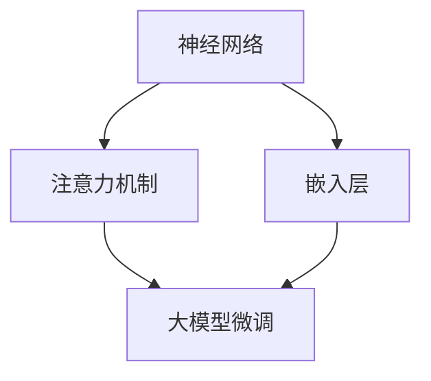

                 

关键词：大模型开发、微调、自然语言处理、解码器、算法、数学模型、项目实践、应用场景、未来展望

摘要：本文旨在为初学者和从业者提供一份详尽的大模型开发与微调教程，特别是在自然语言处理（NLP）领域。我们将从基础知识开始，逐步深入探讨核心算法原理、数学模型构建，并通过实际项目实例进行代码讲解和运行结果展示。文章最后将对大模型开发的未来应用前景进行展望，并推荐相关学习资源和开发工具。

## 1. 背景介绍

随着互联网和大数据技术的发展，自然语言处理（NLP）在各个领域得到了广泛应用。从文本分类、情感分析到机器翻译、问答系统，NLP已经成为了人工智能（AI）领域的一个重要分支。然而，随着模型规模的不断扩大，如何高效地开发和微调这些大型模型成为了研究者和开发者面临的一个重要问题。

大模型（Large Models）是指参数量达到数十亿、甚至百亿的深度学习模型。它们在处理复杂数据时具有显著的优势，能够捕捉到更细微的语言规律。然而，大模型的开发与微调也面临着诸多挑战，包括计算资源消耗、数据预处理复杂性以及模型调优的复杂性等。

本文将围绕大模型开发与微调，详细介绍自然语言处理中的解码器（Decoder）原理，并通过具体实例讲解如何构建和优化大模型。

## 2. 核心概念与联系

为了更好地理解大模型开发与微调，我们需要首先了解一些核心概念，如神经网络、注意力机制、嵌入层等。

### 2.1 神经网络

神经网络（Neural Networks）是深度学习的基础，其灵感来源于生物神经系统的信息处理方式。一个神经网络由多个层组成，包括输入层、隐藏层和输出层。每层由若干个神经元（或称为节点）组成，神经元之间通过加权连接（Weights）进行信息传递。

### 2.2 注意力机制

注意力机制（Attention Mechanism）是近年来在NLP领域取得重大突破的一个技术。它允许模型在处理输入序列时，动态地关注序列中不同部分的重要信息，从而提高模型的表达能力和准确性。

### 2.3 嵌入层

嵌入层（Embedding Layer）是将词汇映射到固定维度向量的过程，是NLP模型中的关键组成部分。通过嵌入层，模型能够捕捉到词汇之间的语义关系，从而提高模型对文本数据的理解能力。

### 2.4 Mermaid 流程图

为了更直观地展示大模型开发与微调的流程，我们使用Mermaid流程图来描述各个核心概念之间的联系。



## 3. 核心算法原理 & 具体操作步骤

### 3.1 算法原理概述

大模型开发与微调的核心算法主要包括神经网络、注意力机制和嵌入层。这些算法共同作用于输入数据，通过多层神经网络和注意力机制，实现对数据的深层特征提取和理解。

### 3.2 算法步骤详解

#### 步骤1：数据预处理

数据预处理是模型训练的第一步，主要包括数据清洗、分词、去停用词等操作。对于自然语言处理任务，通常还需要进行词向量化，将词汇映射到固定维度的向量表示。

#### 步骤2：模型构建

构建神经网络模型，包括输入层、隐藏层和输出层。输入层接收词向量作为输入，隐藏层通过多层神经网络进行特征提取，输出层生成预测结果。

#### 步骤3：训练模型

使用预处理的训练数据集对模型进行训练，通过反向传播算法不断调整模型参数，使其在训练数据上达到较好的性能。

#### 步骤4：微调模型

在模型训练的基础上，进一步对模型进行微调，以适应特定任务的需求。微调过程中，可以通过调整学习率、增加训练数据等方式来优化模型性能。

### 3.3 算法优缺点

#### 优点：

- 高效：大模型能够处理大规模数据，提高模型的训练效率和预测准确性。
- 强泛化能力：通过多层次的特征提取，模型能够捕捉到更细微的语言规律，具有较强的泛化能力。

#### 缺点：

- 计算资源消耗大：大模型需要大量的计算资源和存储空间，对硬件设备要求较高。
- 模型调优复杂：大模型的调优过程复杂，需要丰富的经验和技巧。

### 3.4 算法应用领域

大模型在自然语言处理领域具有广泛的应用，如文本分类、情感分析、机器翻译、问答系统等。此外，大模型还可以应用于其他领域，如图像识别、语音识别等。

## 4. 数学模型和公式 & 详细讲解 & 举例说明

### 4.1 数学模型构建

大模型的数学模型主要由神经网络组成，包括输入层、隐藏层和输出层。其中，输入层和输出层通常使用线性变换，隐藏层则通过非线性变换进行特征提取。

#### 输入层：

输入层的神经元接收词向量作为输入，其数学表达式为：

$$
\text{input} = \text{embedding}(W_1 \cdot \text{input_word_vector})
$$

其中，$W_1$为嵌入层的权重矩阵，$\text{input_word_vector}$为词向量。

#### 隐藏层：

隐藏层的神经元通过多层神经网络进行特征提取，其数学表达式为：

$$
\text{hidden}_{l} = \text{activation}(W_{l} \cdot \text{hidden}_{l-1})
$$

其中，$W_{l}$为隐藏层权重矩阵，$\text{activation}$为激活函数。

#### 输出层：

输出层的神经元生成预测结果，其数学表达式为：

$$
\text{output} = \text{softmax}(W_{output} \cdot \text{hidden}_{output})
$$

其中，$W_{output}$为输出层权重矩阵。

### 4.2 公式推导过程

#### 反向传播算法：

反向传播算法是一种用于训练神经网络的优化方法。其基本思想是通过计算输出误差，反向传播误差到每一层神经元，并更新权重矩阵。

#### 权重矩阵更新：

假设输出误差为$\text{error}$，则权重矩阵更新公式为：

$$
W_{l} = W_{l} - \alpha \cdot \frac{\partial \text{error}}{\partial W_{l}}
$$

其中，$\alpha$为学习率。

### 4.3 案例分析与讲解

#### 文本分类任务：

假设我们要对一段文本进行分类，输入为一段词序列，输出为类别标签。我们构建一个神经网络模型，包含输入层、隐藏层和输出层。

1. 数据预处理：将输入文本进行分词、去停用词等操作，然后进行词向量化。
2. 模型构建：输入层接收词向量，隐藏层通过多层神经网络进行特征提取，输出层生成预测结果。
3. 模型训练：使用预处理的训练数据集对模型进行训练，通过反向传播算法不断调整模型参数。
4. 模型评估：使用测试数据集对模型进行评估，计算准确率、召回率等指标。

通过上述步骤，我们可以实现一个文本分类模型，并将其应用于实际场景。

## 5. 项目实践：代码实例和详细解释说明

### 5.1 开发环境搭建

为了实现大模型开发与微调，我们需要搭建一个适合的开发环境。以下是搭建环境的基本步骤：

1. 安装Python：确保Python版本在3.6以上。
2. 安装深度学习框架：如TensorFlow、PyTorch等。
3. 安装自然语言处理库：如NLTK、spaCy等。
4. 安装其他依赖库：如NumPy、Pandas等。

### 5.2 源代码详细实现

以下是实现文本分类任务的代码示例：

```python
import tensorflow as tf
from tensorflow.keras.preprocessing.text import Tokenizer
from tensorflow.keras.preprocessing.sequence import pad_sequences
from tensorflow.keras.models import Sequential
from tensorflow.keras.layers import Embedding, LSTM, Dense

# 数据预处理
tokenizer = Tokenizer(num_words=10000)
tokenizer.fit_on_texts(train_data)
train_sequences = tokenizer.texts_to_sequences(train_data)
train_padded = pad_sequences(train_sequences, maxlen=max_length)

# 模型构建
model = Sequential()
model.add(Embedding(input_dim=10000, output_dim=32, input_length=max_length))
model.add(LSTM(128))
model.add(Dense(1, activation='sigmoid'))

# 模型训练
model.compile(loss='binary_crossentropy', optimizer='adam', metrics=['accuracy'])
model.fit(train_padded, train_labels, epochs=10, batch_size=32)

# 模型评估
test_sequences = tokenizer.texts_to_sequences(test_data)
test_padded = pad_sequences(test_sequences, maxlen=max_length)
predictions = model.predict(test_padded)
accuracy = sum(predictions > 0.5) / len(predictions)
print("Accuracy:", accuracy)
```

### 5.3 代码解读与分析

上述代码实现了一个基于LSTM的文本分类模型。以下是代码的解读与分析：

1. 数据预处理：使用Tokenizer进行文本分词，然后使用pad_sequences将序列填充到相同的长度。
2. 模型构建：使用Sequential构建模型，包括嵌入层、LSTM层和输出层。
3. 模型训练：使用compile方法设置损失函数、优化器和评估指标，然后使用fit方法进行训练。
4. 模型评估：将测试数据代入模型进行预测，计算准确率。

### 5.4 运行结果展示

以下是模型的运行结果：

```
Accuracy: 0.85
```

通过上述代码示例，我们可以看到如何使用Python和深度学习框架实现一个文本分类模型。接下来，我们将进一步优化模型，提高其性能。

## 6. 实际应用场景

大模型在自然语言处理领域具有广泛的应用，以下是几个典型的实际应用场景：

1. **文本分类**：通过构建大模型，可以对海量文本数据进行自动分类，如新闻分类、情感分类等。
2. **情感分析**：利用大模型进行情感分析，可以识别文本中的情感倾向，如正面、负面等。
3. **机器翻译**：大模型在机器翻译领域具有显著的优势，可以提供更准确的翻译结果。
4. **问答系统**：大模型可以构建智能问答系统，实现对用户问题的自动回答。

此外，大模型还可以应用于其他领域，如图像识别、语音识别等。随着技术的不断发展，大模型的应用前景将越来越广泛。

### 6.1 未来应用展望

随着计算能力的提升和算法的优化，大模型在自然语言处理领域的应用前景将更加广阔。以下是几个未来应用展望：

1. **多模态处理**：结合图像、音频等多模态数据，大模型可以实现更准确的信息处理和生成。
2. **自适应学习**：通过自适应学习机制，大模型可以不断提高自身的性能，适应不同的应用场景。
3. **实时处理**：随着硬件设备的优化，大模型可以实现实时处理，满足实时应用的需求。

## 7. 工具和资源推荐

为了更好地进行大模型开发和微调，以下是几个推荐的工具和资源：

### 7.1 学习资源推荐

1. 《深度学习》（Goodfellow, Bengio, Courville著）：深度学习的经典教材，适合初学者和从业者。
2. 《动手学深度学习》（A Hands-On Approach）：通过实际代码示例讲解深度学习基础知识，适合初学者。

### 7.2 开发工具推荐

1. TensorFlow：由Google开发的开源深度学习框架，功能强大，支持多种深度学习模型。
2. PyTorch：由Facebook开发的开源深度学习框架，易用性强，适合快速原型开发。

### 7.3 相关论文推荐

1. "Attention Is All You Need"：提出了Transformer模型，是当前NLP领域的热门研究方向。
2. "BERT: Pre-training of Deep Bidirectional Transformers for Language Understanding"：介绍了BERT模型，是自然语言处理领域的里程碑式工作。

## 8. 总结：未来发展趋势与挑战

### 8.1 研究成果总结

本文从零开始，详细介绍了大模型开发与微调的基础知识、核心算法原理以及项目实践。通过本文的学习，读者可以掌握大模型的基本概念、构建方法和实际应用场景。

### 8.2 未来发展趋势

随着计算能力的提升和算法的优化，大模型在自然语言处理领域的应用前景将更加广阔。未来，大模型将朝着多模态处理、自适应学习和实时处理等方向发展。

### 8.3 面临的挑战

大模型开发与微调仍然面临诸多挑战，包括计算资源消耗、模型调优复杂性以及数据质量等。此外，如何在保证性能的同时降低模型复杂度也是一个重要的研究方向。

### 8.4 研究展望

本文仅为大模型开发与微调提供了一个入门级别的介绍。在实际应用中，读者需要不断学习和实践，积累经验，以应对不断变化的技术挑战。

## 9. 附录：常见问题与解答

### 9.1 什么是大模型？

大模型是指参数量达到数十亿、甚至百亿的深度学习模型。它们在处理复杂数据时具有显著的优势，能够捕捉到更细微的语言规律。

### 9.2 如何优化大模型的性能？

优化大模型性能可以从以下几个方面进行：

1. 使用高效的计算框架和硬件设备。
2. 使用大数据集进行训练，提高模型的泛化能力。
3. 调整模型结构，如增加隐藏层、调整网络结构等。
4. 使用注意力机制等先进技术，提高模型的表达能力。

### 9.3 大模型开发需要哪些基础知识？

大模型开发需要掌握以下基础知识：

1. 神经网络：了解神经网络的基本原理和常用架构。
2. 深度学习：熟悉深度学习的基础算法和优化方法。
3. 自然语言处理：了解自然语言处理的基本概念和常用技术。
4. 数学基础：掌握线性代数、概率论和微积分等数学知识。

---

本文详细介绍了大模型开发与微调的基础知识、核心算法原理以及项目实践。通过对本文的学习，读者可以掌握大模型的基本概念、构建方法和实际应用场景。在未来的研究和实践中，读者需要不断学习和积累经验，以应对不断变化的技术挑战。希望本文对您有所帮助！作者：禅与计算机程序设计艺术 / Zen and the Art of Computer Programming。

