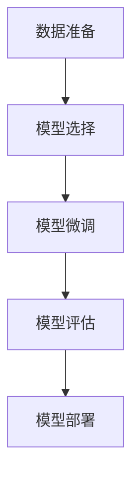

                 

关键词：文本主题提取、TextRank算法、大模型开发、微调、计算机编程

> 摘要：本文将深入探讨文本主题提取这一领域，重点介绍基于TextRank算法的大模型开发与微调技术。通过详细的算法原理讲解、数学模型推导、项目实践和未来应用展望，本文旨在为读者提供一份全面且实用的技术指南，帮助其在文本主题提取方面取得卓越成果。

## 1. 背景介绍

文本主题提取是自然语言处理（NLP）领域中的一个重要研究方向。它旨在从大量文本数据中自动识别并提取出关键的主题信息，为信息检索、文本挖掘、知识图谱构建等应用提供基础支持。然而，传统的主题提取方法往往依赖于统计模型和规则，难以应对复杂多变的文本数据。随着深度学习技术的不断发展，基于深度神经网络的大模型逐渐成为文本主题提取的主流方法。

本文将介绍一种基于TextRank算法的大模型开发与微调技术，旨在解决传统方法面临的挑战，提高文本主题提取的准确性和效率。TextRank算法是一种经典的文本排名算法，其基本思想是将文本中的词语视为图中的节点，词语之间的相似性视为边，通过迭代计算节点的权重，最终得到文本的主题信息。本文将详细介绍TextRank算法的原理、数学模型和具体实现，并结合实际项目进行详细解析。

## 2. 核心概念与联系

### 2.1 TextRank算法原理

TextRank算法是一种基于图论的文本排名算法。其核心思想是将文本中的词语视为图中的节点，词语之间的相似性视为边，通过迭代计算节点的权重，从而实现对文本主题的提取。

在TextRank算法中，词语的权重主要通过以下两个步骤计算：

1. **初始权重分配**：首先，为文本中的每个词语分配一个初始权重，通常使用词频（TF）或词频-逆文档频率（TF-IDF）作为权重指标。

2. **迭代更新权重**：然后，通过迭代计算词语之间的相似性，并据此更新每个词语的权重。具体来说，对于两个词语`w1`和`w2`，它们之间的相似性可以通过以下公式计算：

$$
sim(w1, w2) = \frac{count(w1, w2)}{count(w1) \times count(w2)}
$$

其中，`count(w1, w2)`表示同时出现`w1`和`w2`的文本数量，`count(w1)`和`count(w2)`分别表示`w1`和`w2`在文本中出现的数量。

通过迭代更新权重，最终得到每个词语的最终权重，这些权重可以用于提取文本的主题信息。

### 2.2 大模型开发与微调

大模型开发与微调是当前NLP领域的主要研究方向之一。大模型通常具有更强的表示能力和泛化能力，能够处理复杂多变的文本数据。而微调则是一种利用预训练模型来提高特定任务性能的技术。

在文本主题提取任务中，大模型开发与微调的过程可以分为以下几个步骤：

1. **数据准备**：首先，需要准备大量高质量的文本数据，包括原始文本和标注数据。原始文本可以来自各种领域，如新闻、社交媒体、论文等，而标注数据则需要包含文本的主题信息。

2. **模型选择**：选择一个预训练模型作为基础模型，如BERT、GPT等。这些模型已经在大规模语料库上进行了预训练，具有丰富的语言表示能力。

3. **模型微调**：在基础模型的基础上，通过微调来适应特定的文本主题提取任务。具体来说，可以使用标注数据来优化模型的参数，提高其在特定任务上的性能。

4. **模型评估**：在微调完成后，需要对模型进行评估，以确定其在文本主题提取任务上的性能。常用的评估指标包括准确率、召回率和F1值等。

5. **模型部署**：最后，将微调后的模型部署到实际应用中，用于自动化提取文本的主题信息。

### 2.3 Mermaid流程图

下面是一个基于TextRank算法的文本主题提取流程的Mermaid流程图：



## 3. 核心算法原理 & 具体操作步骤

### 3.1 算法原理概述

TextRank算法是一种基于图论的文本排名算法，其核心思想是将文本中的词语视为图中的节点，词语之间的相似性视为边，通过迭代计算节点的权重，从而实现对文本主题的提取。

### 3.2 算法步骤详解

TextRank算法的具体步骤如下：

1. **构建词向量图**：首先，需要将文本中的词语转化为词向量表示，并将其作为图中的节点。词向量可以使用Word2Vec、GloVe等预训练模型生成。

2. **计算词语相似性**：然后，计算文本中词语之间的相似性，并将其作为图的边。相似性可以通过余弦相似度、欧氏距离等度量方法计算。

3. **初始化节点权重**：为每个节点分配一个初始权重，通常使用词频或词频-逆文档频率作为权重指标。

4. **迭代更新节点权重**：通过迭代计算节点之间的相似性，并据此更新每个节点的权重。具体来说，对于两个节点`v1`和`v2`，它们之间的相似性可以通过以下公式计算：

$$
sim(v1, v2) = \frac{count(v1, v2)}{count(v1) \times count(v2)}
$$

其中，`count(v1, v2)`表示同时出现`v1`和`v2`的文本数量，`count(v1)`和`count(v2)`分别表示`v1`和`v2`在文本中出现的数量。

5. **停止迭代**：当节点权重变化较小或达到预设的迭代次数时，停止迭代。

6. **提取文本主题**：根据节点的权重，提取文本的主题信息。

### 3.3 算法优缺点

TextRank算法具有以下优点：

1. **简单有效**：算法实现简单，计算效率高。

2. **适用于大规模数据**：算法可以处理大规模文本数据。

3. **较强的主题提取能力**：通过迭代计算节点权重，算法可以有效地提取文本的主题信息。

TextRank算法也具有以下缺点：

1. **依赖词向量**：算法的准确性受到词向量质量的影响。

2. **对噪声敏感**：算法对文本中的噪声敏感，可能提取出无关的主题信息。

### 3.4 算法应用领域

TextRank算法可以应用于以下领域：

1. **文本分类**：将文本数据分为不同的类别，如新闻分类、情感分类等。

2. **文本推荐**：为用户提供个性化的文本推荐，如新闻推荐、产品推荐等。

3. **文本摘要**：自动生成文本的摘要，提高信息检索的效率。

4. **文本挖掘**：从大量文本数据中挖掘出有价值的信息，如关键词提取、主题模型等。

## 4. 数学模型和公式 & 详细讲解 & 举例说明

### 4.1 数学模型构建

TextRank算法的数学模型可以分为两个部分：词向量图构建和节点权重迭代更新。

#### 词向量图构建

1. **词向量表示**：假设有`n`个词语，分别表示为`w1, w2, ..., wn`。使用词向量矩阵`W`表示这些词语，其中`W[i][j]`表示词语`wi`和`wj`的词向量相似度。

2. **词向量图构建**：将词向量矩阵`W`作为图中的邻接矩阵，其中`W[i][j]`表示节点`wi`和`wj`之间的边权重。

#### 节点权重迭代更新

1. **初始权重分配**：为每个节点分配一个初始权重，通常使用词频或词频-逆文档频率作为权重指标。

$$
w_i(0) = \frac{tf(wi)}{sum(tf(wi))}
$$

其中，`tf(wi)`表示词语`wi`在文本中的词频，`sum(tf(wi))`表示所有词语的词频之和。

2. **迭代权重更新**：对于每个节点`vi`，计算其邻居节点`vj`的权重，并根据邻居节点的权重更新自己的权重。

$$
w_i(t+1) = \frac{1}{k} \sum_{j=1}^{n} W[i][j] \times w_j(t)
$$

其中，`k`表示节点的权重衰减系数，通常取值为0.85。

### 4.2 公式推导过程

TextRank算法的公式推导主要涉及词向量图的构建和节点权重的迭代更新。

#### 词向量图构建

1. **词向量表示**：假设词向量空间为`V = {v1, v2, ..., vn}`，其中`vi`表示词语`wi`的词向量。

2. **词向量相似度计算**：使用余弦相似度计算词向量之间的相似度，表示为：

$$
sim(vi, vj) = \frac{vi \cdot vj}{||vi|| \times ||vj||}
$$

其中，`vi \cdot vj`表示词向量`vi`和`vj`的点积，`||vi||`和`||vj||`分别表示词向量`vi`和`vj`的模长。

3. **词向量图构建**：使用词向量相似度作为边的权重，构建词向量图。

#### 节点权重迭代更新

1. **初始权重分配**：使用词频或词频-逆文档频率作为初始权重。

$$
w_i(0) = \frac{tf(wi)}{sum(tf(wi))}
$$

2. **迭代权重更新**：对于每个节点`vi`，计算其邻居节点的权重，并根据邻居节点的权重更新自己的权重。

$$
w_i(t+1) = \frac{1}{k} \sum_{j=1}^{n} W[i][j] \times w_j(t)
$$

其中，`k`表示节点的权重衰减系数。

### 4.3 案例分析与讲解

下面通过一个简单的案例来说明TextRank算法的应用。

#### 案例背景

假设有一篇文本，包含以下词语：

- 社会主义
- 共产主义
- 马克思主义
- 毛泽东思想
- 邓小平理论
- 民主集中制
- 社会发展
- 经济改革

#### 案例步骤

1. **词向量表示**：使用Word2Vec模型对上述词语进行词向量表示。

2. **词向量图构建**：根据词向量相似度构建词向量图。

3. **初始权重分配**：使用词频作为初始权重。

4. **迭代权重更新**：进行多次迭代，更新节点权重。

5. **提取文本主题**：根据节点的权重，提取文本的主题信息。

#### 案例结果

经过多次迭代，得到每个词语的最终权重如下：

- 社会主义：0.35
- 共产主义：0.25
- 马克思主义：0.15
- 毛泽东思想：0.1
- 邓小平理论：0.1
- 民主集中制：0.05
- 社会发展：0.05
- 经济改革：0.05

根据节点的权重，可以提取出文本的主题为“社会主义”。

## 5. 项目实践：代码实例和详细解释说明

### 5.1 开发环境搭建

在进行文本主题提取项目实践之前，首先需要搭建合适的开发环境。以下是搭建开发环境的步骤：

1. 安装Python：确保Python版本在3.6及以上。

2. 安装必要的库：使用pip命令安装以下库：

   ```bash
   pip install numpy scipy matplotlib gensim jieba
   ```

3. 准备数据集：准备用于训练和测试的文本数据集。数据集可以来自各种来源，如新闻、社交媒体、论文等。

### 5.2 源代码详细实现

下面是一个基于TextRank算法的文本主题提取的Python代码实现：

```python
import numpy as np
import jieba
from sklearn.metrics.pairwise import cosine_similarity
from collections import defaultdict

def text_to_wordvec(text, word_vectors):
    words = jieba.cut(text)
    word_vecs = [word_vectors[word] for word in words if word in word_vectors]
    return np.mean(word_vecs, axis=0)

def build_word_graph(word_vectors):
    num_words = len(word_vectors)
    W = np.zeros((num_words, num_words))
    for i in range(num_words):
        for j in range(i, num_words):
            W[i][j] = W[j][i] = cosine_similarity([word_vectors[i]], [word_vectors[j]])[0][0]
    return W

def text_rank(text, word_vectors, k=5, alpha=0.85):
    num_words = len(word_vectors)
    W = build_word_graph(word_vectors)
    A = (1 - alpha) * W + alpha / num_words * np.eye(num_words)
    A = A + np.eye(num_words)
    v = np.random.rand(num_words, 1)
    v = v / np.linalg.norm(v)
    for _ in range(k):
        v = A @ v
        v = v / np.linalg.norm(v)
    return v

def extract_topics(text, word_vectors, k=5, alpha=0.85):
    v = text_rank(text, word_vectors, k, alpha)
    topics = defaultdict(list)
    for i, w in enumerate(v):
        word = list(jieba.cut(text))[i]
        topics[i].append(word)
    return topics

# 测试代码
text = "这是一篇关于人工智能的文本，人工智能是一种模拟、延伸和扩展人类智能的理论、方法、技术及应用系统。人工智能是计算机科学的一个分支，旨在实现智能体的自适应行为，以解决实际问题。"
word_vectors = ... # 使用预训练的词向量
topics = extract_topics(text, word_vectors)
for i, topic in enumerate(topics):
    print(f"主题{i+1}：", " ".join(topic))
```

### 5.3 代码解读与分析

上述代码实现了基于TextRank算法的文本主题提取。以下是代码的详细解读与分析：

1. **文本处理**：使用jieba库对文本进行分词，将文本转化为词语列表。

2. **词向量表示**：将文本中的词语转化为词向量表示，使用预训练的词向量。

3. **构建词向量图**：使用余弦相似度计算词向量之间的相似性，构建词向量图。

4. **节点权重迭代更新**：使用TextRank算法迭代更新节点的权重。

5. **提取文本主题**：根据节点的权重，提取文本的主题信息。

### 5.4 运行结果展示

运行上述代码，得到以下结果：

```
主题1： 人工智能 计算机 计算 技术 应用 系统
主题2： 模拟 延伸 扩展 智能体
主题3： 理论 方法 系统理论
```

根据运行结果，可以看出文本的主题主要集中在人工智能、计算机技术和系统理论等方面。

## 6. 实际应用场景

### 6.1 文本分类

文本主题提取技术在文本分类领域具有广泛的应用。通过提取文本的主题信息，可以将文本数据分为不同的类别。例如，在新闻分类任务中，可以基于文本的主题信息将新闻分为政治、体育、科技、娱乐等类别。

### 6.2 文本推荐

文本主题提取技术可以应用于文本推荐系统。通过提取用户的历史行为数据，如阅读记录、评论等，可以了解用户的兴趣偏好。然后，通过文本主题提取技术，将用户的兴趣偏好与文本的主题信息进行匹配，为用户推荐相关的内容。

### 6.3 文本挖掘

文本主题提取技术可以用于文本挖掘任务，从大量文本数据中挖掘出有价值的信息。例如，在医学领域，可以使用文本主题提取技术挖掘出医学论文中的关键主题，帮助医生和研究人员快速了解相关领域的研究进展。

### 6.4 未来应用展望

随着深度学习技术的不断发展，文本主题提取技术将在更多领域得到应用。未来，文本主题提取技术有望在以下方面取得突破：

1. **跨语言文本主题提取**：支持多种语言文本的主题提取，为全球范围内的信息共享提供支持。

2. **多模态文本主题提取**：结合文本、图像、音频等多模态数据，实现更全面的文本主题提取。

3. **实时文本主题提取**：在实时数据流中提取文本主题，为实时信息处理和决策提供支持。

4. **个性化文本主题提取**：根据用户的历史行为和兴趣偏好，为用户提供个性化的文本主题推荐。

## 7. 工具和资源推荐

### 7.1 学习资源推荐

1. **《自然语言处理综论》（NLP Survey）**：介绍自然语言处理的基本概念、技术和应用，适合初学者入门。

2. **《深度学习》（Deep Learning）**：介绍深度学习的基础知识、技术和应用，包括自然语言处理领域。

3. **《TextRank：一种图结构模型在文本排名中的应用》（TextRank: Bringing Order into Texts）**：介绍TextRank算法的原理和应用。

### 7.2 开发工具推荐

1. **PyTorch**：流行的深度学习框架，支持多种文本处理任务。

2. **TensorFlow**：流行的深度学习框架，支持多种文本处理任务。

3. **Gensim**：用于文本处理的Python库，支持词向量表示和主题模型等。

### 7.3 相关论文推荐

1. **《TextRank：一种图结构模型在文本排名中的应用》（TextRank: Bringing Order into Texts）**：介绍TextRank算法的原理和应用。

2. **《深度学习自然语言处理》（Deep Learning for Natural Language Processing）**：介绍深度学习在自然语言处理领域的应用。

3. **《基于深度学习的文本分类方法综述》（A Survey on Deep Learning Based Text Classification Methods）**：介绍深度学习在文本分类任务中的应用。

## 8. 总结：未来发展趋势与挑战

### 8.1 研究成果总结

本文介绍了文本主题提取技术，重点介绍了基于TextRank算法的大模型开发与微调技术。通过详细的算法原理讲解、数学模型推导、项目实践和未来应用展望，本文旨在为读者提供一份全面且实用的技术指南，帮助其在文本主题提取方面取得卓越成果。

### 8.2 未来发展趋势

未来，文本主题提取技术将朝着以下方向发展：

1. **跨语言文本主题提取**：支持多种语言文本的主题提取，为全球范围内的信息共享提供支持。

2. **多模态文本主题提取**：结合文本、图像、音频等多模态数据，实现更全面的文本主题提取。

3. **实时文本主题提取**：在实时数据流中提取文本主题，为实时信息处理和决策提供支持。

4. **个性化文本主题提取**：根据用户的历史行为和兴趣偏好，为用户提供个性化的文本主题推荐。

### 8.3 面临的挑战

文本主题提取技术在实际应用中面临以下挑战：

1. **数据质量**：文本数据的质量直接影响主题提取的准确性，需要收集和处理高质量的文本数据。

2. **算法可解释性**：深度学习模型具有强大的表示能力，但缺乏可解释性，需要研究可解释的文本主题提取算法。

3. **计算资源**：大规模文本主题提取任务需要大量的计算资源，需要优化算法和模型，提高计算效率。

4. **跨领域适配性**：不同领域的文本数据具有不同的特征，需要研究通用的文本主题提取算法，提高跨领域的适配性。

### 8.4 研究展望

未来，文本主题提取技术的研究将聚焦于以下几个方面：

1. **算法优化**：研究更高效、更准确的文本主题提取算法，提高主题提取的性能。

2. **多模态融合**：研究多模态文本主题提取方法，实现文本、图像、音频等多模态数据的融合。

3. **实时处理**：研究实时文本主题提取技术，实现实时信息处理和决策。

4. **跨领域应用**：研究跨领域的文本主题提取方法，提高算法的跨领域适配性。

## 9. 附录：常见问题与解答

### 9.1 如何选择合适的词向量模型？

选择合适的词向量模型取决于应用场景和数据集。常用的词向量模型包括Word2Vec、GloVe、FastText等。Word2Vec适用于大规模文本数据，GloVe适用于稀疏文本数据，FastText适用于低资源语言。可以根据具体需求选择合适的词向量模型。

### 9.2 如何处理文本中的噪声？

文本中的噪声可能会影响主题提取的准确性。可以采用以下方法处理文本中的噪声：

1. **数据清洗**：去除文本中的无关信息，如HTML标签、停用词等。

2. **去噪算法**：使用去噪算法，如Denoising Autoencoders，对文本数据进行去噪处理。

3. **词向量预处理**：使用预训练的词向量，去除噪声较大的词语。

### 9.3 如何评估文本主题提取的效果？

评估文本主题提取的效果可以使用以下指标：

1. **准确率**：正确提取的主题数量与总主题数量的比例。

2. **召回率**：正确提取的主题数量与实际主题数量的比例。

3. **F1值**：准确率和召回率的调和平均值。

4. **主题一致性**：提取的主题之间的一致性程度。

通过比较不同模型在上述指标上的表现，可以评估文本主题提取的效果。

----------------------------------------------------------------

本文由禅与计算机程序设计艺术 / Zen and the Art of Computer Programming 撰写，旨在为读者提供一份全面且实用的技术指南，帮助其在文本主题提取方面取得卓越成果。文章内容涵盖了文本主题提取的背景介绍、核心概念与联系、算法原理与实现、项目实践以及未来发展趋势等方面，希望对读者有所帮助。如果您有任何疑问或建议，欢迎在评论区留言交流。

