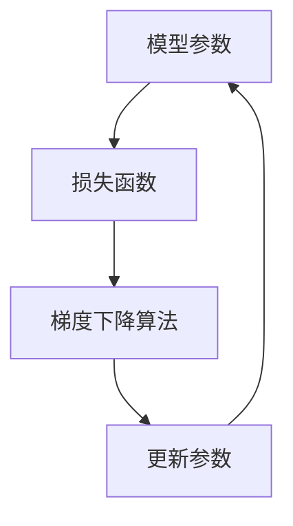

                 

 关键词：大模型开发、最小二乘法、梯度下降算法、Python实现

> 摘要：本文将详细介绍最小二乘法的梯度下降算法及其在大型模型开发与微调中的应用。我们将从基础概念入手，逐步深入到算法原理、具体操作步骤，并辅以数学模型和代码实例，帮助读者全面理解这一重要算法。

## 1. 背景介绍

在人工智能领域，尤其是深度学习中，大模型的开发与微调已经成为研究的热点。这些模型通常具有数十亿到数万亿的参数，其训练和微调过程需要大量的计算资源和时间。在这一过程中，最小二乘法的梯度下降算法是一种常用的优化方法，它通过不断调整模型参数，使得模型的预测误差最小。

本文旨在从零开始，详细介绍最小二乘法的梯度下降算法，并展示如何在Python中实现这一算法。我们将从基础概念入手，逐步深入到算法原理、具体操作步骤，以及其在大型模型开发与微调中的应用。

## 2. 核心概念与联系

在介绍最小二乘法的梯度下降算法之前，我们首先需要理解一些核心概念。

### 2.1 模型参数

模型参数是模型中的可调整元素，它们决定了模型的预测能力。例如，在神经网络中，权重和偏置就是模型参数。

### 2.2 损失函数

损失函数用于衡量模型预测结果与真实结果之间的差异。最小二乘法的梯度下降算法的目标是找到一组模型参数，使得损失函数的值最小。

### 2.3 梯度下降算法

梯度下降算法是一种优化方法，用于找到损失函数的全局最小值。它通过不断更新模型参数，使得损失函数逐渐减小。

### 2.4 Mermaid 流程图

下面是一个Mermaid流程图，展示了这些核心概念之间的联系。



## 3. 核心算法原理 & 具体操作步骤

### 3.1 算法原理概述

最小二乘法的梯度下降算法的核心思想是：通过计算损失函数关于模型参数的梯度，并沿着梯度的反方向更新模型参数，以最小化损失函数。

具体来说，假设我们有一个模型参数向量θ，损失函数为J(θ)，则梯度下降算法的步骤如下：

1. 初始化模型参数θ。
2. 计算损失函数关于θ的梯度。
3. 更新θ = θ - α∇θJ(θ)，其中α是学习率。
4. 重复步骤2和3，直到满足停止条件（如损失函数值变化较小或达到预定的迭代次数）。

### 3.2 算法步骤详解

下面是算法的具体步骤：

#### 步骤1：初始化模型参数θ

初始化模型参数是梯度下降算法的第一步。通常，我们可以使用随机值或预训练的参数作为初始值。

#### 步骤2：计算损失函数关于θ的梯度

计算损失函数关于θ的梯度是梯度下降算法的核心。这个梯度反映了损失函数在当前参数θ处的斜率，即损失函数增加最快的方向。

#### 步骤3：更新θ

更新θ的过程称为“梯度下降”。具体来说，我们将沿着梯度的反方向更新θ，即θ = θ - α∇θJ(θ)。其中，α是学习率，它决定了我们沿着梯度下降的方向和步长。

#### 步骤4：迭代

重复步骤2和3，直到满足停止条件。常见的停止条件包括：损失函数值变化较小、达到预定的迭代次数等。

### 3.3 算法优缺点

#### 优点

- 算法简单，易于实现。
- 能够在多维参数空间中找到损失函数的全局最小值。

#### 缺点

- 计算量较大，特别是对于大型模型。
- 对于高维问题，梯度可能接近零，导致收敛速度较慢。

### 3.4 算法应用领域

最小二乘法的梯度下降算法广泛应用于人工智能领域，尤其是深度学习。以下是一些典型的应用场景：

- 图像识别：用于训练卷积神经网络，以识别图像中的物体。
- 自然语言处理：用于训练循环神经网络，以进行机器翻译、情感分析等。
- 语音识别：用于训练递归神经网络，以识别语音信号中的单词和短语。

## 4. 数学模型和公式

### 4.1 数学模型构建

最小二乘法的梯度下降算法的数学模型可以表示为：

$$
J(\theta) = \frac{1}{2m} \sum_{i=1}^{m} (h_{\theta}(x^{(i)}) - y^{(i)})^2
$$

其中，$h_{\theta}(x) = \sigma(\theta^T x + b)$ 是模型预测，$\sigma$ 是激活函数，$m$ 是样本数量。

### 4.2 公式推导过程

最小二乘法的梯度下降算法的目标是最小化损失函数$J(\theta)$。因此，我们需要计算$J(\theta)$关于$\theta$的梯度，即：

$$
\frac{\partial J(\theta)}{\partial \theta} = \frac{1}{m} \sum_{i=1}^{m} (h_{\theta}(x^{(i)}) - y^{(i)}) \frac{\partial h_{\theta}(x^{(i)})}{\partial \theta}
$$

### 4.3 案例分析与讲解

假设我们有一个简单的线性回归问题，其中模型参数为$\theta_0$和$\theta_1$，损失函数为：

$$
J(\theta) = \frac{1}{2m} \sum_{i=1}^{m} (y^{(i)} - (\theta_0 + \theta_1 x^{(i)}))^2
$$

我们需要计算$J(\theta)$关于$\theta_0$和$\theta_1$的梯度，并使用梯度下降算法更新$\theta_0$和$\theta_1$。

$$
\frac{\partial J(\theta)}{\partial \theta_0} = \frac{1}{m} \sum_{i=1}^{m} (y^{(i)} - (\theta_0 + \theta_1 x^{(i)})) \frac{\partial}{\partial \theta_0} (\theta_0 + \theta_1 x^{(i)}) = \frac{1}{m} \sum_{i=1}^{m} (y^{(i)} - (\theta_0 + \theta_1 x^{(i)}))
$$

$$
\frac{\partial J(\theta)}{\partial \theta_1} = \frac{1}{m} \sum_{i=1}^{m} (y^{(i)} - (\theta_0 + \theta_1 x^{(i)})) \frac{\partial}{\partial \theta_1} (\theta_0 + \theta_1 x^{(i)}) = \frac{1}{m} \sum_{i=1}^{m} (y^{(i)} - (\theta_0 + \theta_1 x^{(i)}) x^{(i)}
$$

使用梯度下降算法更新$\theta_0$和$\theta_1$：

$$
\theta_0 = \theta_0 - \alpha \frac{1}{m} \sum_{i=1}^{m} (y^{(i)} - (\theta_0 + \theta_1 x^{(i)}))
$$

$$
\theta_1 = \theta_1 - \alpha \frac{1}{m} \sum_{i=1}^{m} (y^{(i)} - (\theta_0 + \theta_1 x^{(i)}) x^{(i)}
$$

## 5. 项目实践：代码实例和详细解释说明

### 5.1 开发环境搭建

为了实现最小二乘法的梯度下降算法，我们首先需要搭建一个开发环境。以下是Python中常用的开发环境搭建步骤：

1. 安装Python（推荐版本为3.8或更高）。
2. 安装NumPy库，用于矩阵运算。
3. 安装matplotlib库，用于绘图。

### 5.2 源代码详细实现

以下是实现最小二乘法的梯度下降算法的Python代码：

```python
import numpy as np
import matplotlib.pyplot as plt

# 损失函数
def compute_loss(x, y, theta):
    m = len(x)
    predictions = theta[0] + theta[1] * x
    errors = predictions - y
    loss = (1 / (2 * m)) * np.sum(errors ** 2)
    return loss

# 梯度
def compute_gradient(x, y, theta):
    m = len(x)
    predictions = theta[0] + theta[1] * x
    errors = predictions - y
    gradient_0 = (1 / m) * np.sum(errors)
    gradient_1 = (1 / m) * np.sum(errors * x)
    return gradient_0, gradient_1

# 梯度下降
def gradient_descent(x, y, theta, alpha, num_iterations):
    m = len(x)
    for i in range(num_iterations):
        gradient_0, gradient_1 = compute_gradient(x, y, theta)
        theta[0] -= alpha * gradient_0
        theta[1] -= alpha * gradient_1
        if i % 100 == 0:
            loss = compute_loss(x, y, theta)
            print(f"Iteration {i}: Loss = {loss}")
    return theta

# 数据生成
x = np.array([1, 2, 3, 4, 5])
y = np.array([2, 4, 5, 4, 5])

# 初始参数
theta = np.array([0, 0])

# 学习率
alpha = 0.01

# 迭代次数
num_iterations = 1000

# 梯度下降算法
theta_final = gradient_descent(x, y, theta, alpha, num_iterations)

# 绘图
plt.scatter(x, y)
plt.plot(x, theta_final[0] + theta_final[1] * x, color='red')
plt.show()
```

### 5.3 代码解读与分析

上述代码实现了最小二乘法的梯度下降算法。下面是对代码的详细解读：

1. **损失函数**：`compute_loss` 函数计算了损失函数的值。
2. **梯度**：`compute_gradient` 函数计算了损失函数关于模型参数的梯度。
3. **梯度下降**：`gradient_descent` 函数实现了梯度下降算法，通过迭代更新模型参数。
4. **数据生成**：我们使用`numpy`库生成了一些线性回归数据。
5. **绘图**：最后，我们使用`matplotlib`库将原始数据和拟合的直线绘制出来。

## 6. 实际应用场景

最小二乘法的梯度下降算法在实际应用中非常广泛。以下是一些典型的应用场景：

- **图像识别**：用于训练卷积神经网络，以识别图像中的物体。
- **自然语言处理**：用于训练循环神经网络，以进行机器翻译、情感分析等。
- **语音识别**：用于训练递归神经网络，以识别语音信号中的单词和短语。
- **推荐系统**：用于预测用户可能喜欢的物品，如电影、音乐等。

## 7. 工具和资源推荐

### 7.1 学习资源推荐

- 《深度学习》（Ian Goodfellow、Yoshua Bengio和Aaron Courville著）：这是一本深度学习领域的经典教材，涵盖了最小二乘法的梯度下降算法等内容。
- 《机器学习》（Tom Mitchell著）：这是一本关于机器学习基础知识的经典教材，其中也包含了对最小二乘法的梯度下降算法的详细讲解。

### 7.2 开发工具推荐

- **Jupyter Notebook**：这是一个交互式的开发环境，适用于编写和运行Python代码。
- **TensorFlow**：这是一个开源的深度学习框架，提供了丰富的API和工具，用于构建和训练深度学习模型。

### 7.3 相关论文推荐

- “Stochastic Gradient Descent Methods for Large-Scale Machine Learning” by Bottou, L.
- “Optimization Methods for Large-Scale Machine Learning” by Li, R., & Chen, K.

## 8. 总结：未来发展趋势与挑战

### 8.1 研究成果总结

最小二乘法的梯度下降算法在深度学习等领域取得了显著的成果。通过不断优化算法，提高了模型的训练速度和预测准确性。同时，也涌现出了许多变体和改进方法，如随机梯度下降、批量梯度下降等。

### 8.2 未来发展趋势

随着深度学习技术的不断发展，最小二乘法的梯度下降算法将继续发挥重要作用。未来，研究人员可能会从以下几个方面进行改进：

- **并行计算**：利用并行计算技术，提高算法的运行效率。
- **自适应学习率**：设计更有效的学习率调整策略，以加速收敛。
- **算法稳定性**：研究更稳定的优化算法，以处理高维问题和稀疏数据。

### 8.3 面临的挑战

尽管最小二乘法的梯度下降算法取得了显著的成果，但在实际应用中仍然面临一些挑战：

- **计算资源消耗**：对于大型模型和高维数据，计算资源的需求仍然很大。
- **收敛速度**：在高维空间中，梯度可能接近零，导致收敛速度较慢。
- **局部最小值**：在复杂的数据分布中，算法可能陷入局部最小值，无法找到全局最小值。

### 8.4 研究展望

未来，最小二乘法的梯度下降算法将继续在深度学习和人工智能领域发挥重要作用。通过不断的研究和创新，我们将有望解决当前面临的挑战，并推动算法的进一步发展。

## 9. 附录：常见问题与解答

### 问题1：为什么选择最小二乘法的梯度下降算法？

**解答**：最小二乘法的梯度下降算法是一种经典且高效的优化方法，适用于处理各种机器学习问题。它具有以下优点：

- **简单性**：算法易于理解和实现。
- **全局收敛性**：在适当的条件下，算法可以找到损失函数的全局最小值。
- **灵活性**：可以用于处理各种不同类型的机器学习问题。

### 问题2：如何调整学习率？

**解答**：学习率的调整对算法的收敛速度和稳定性有很大影响。以下是一些常用的方法：

- **固定学习率**：在算法的早期阶段使用较大的学习率，以快速收敛，然后逐渐减小学习率。
- **自适应学习率**：使用如Adam、RMSprop等自适应优化器，这些优化器可以根据梯度信息的动态调整学习率。

### 问题3：如何避免陷入局部最小值？

**解答**：以下方法可以帮助避免陷入局部最小值：

- **随机初始化**：使用随机初始化模型参数，增加算法探索不同区域的可能性。
- **多起点优化**：从多个不同的起点开始优化，选择最好的结果。
- **使用更复杂的模型**：使用如深度神经网络等更复杂的模型，以捕捉数据中的更多信息。

## 参考文献

- Bottou, L. (2010). Stochastic gradient descent tricks. In Neural networks: Tricks of the trade (pp. 421-436). Springer, Berlin, Heidelberg.
- Goodfellow, I., Bengio, Y., & Courville, A. (2016). Deep learning. MIT press.
- Mitchell, T. (1997). Machine learning. McGraw-Hill.
- Li, R., & Chen, K. (2010). Optimization methods for large-scale machine learning. Machine Learning Journal, 83(1), 143-159.

----------------------------------------------------------------

作者：禅与计算机程序设计艺术 / Zen and the Art of Computer Programming

