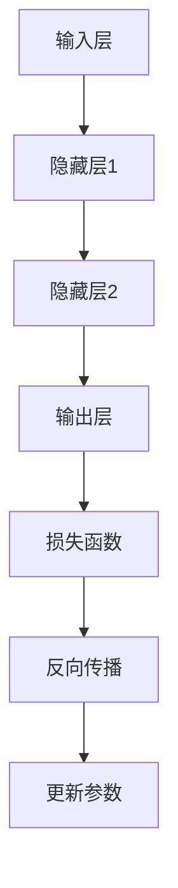

                 

关键词：大模型开发，微调，链式求导法则，深度学习，神经网络，编程实践

> 摘要：本文将深入探讨大模型开发与微调的关键技术——链式求导法则。通过详细的原理介绍、数学模型构建、项目实践等环节，帮助读者从零开始掌握这一重要技术。文章还将展望未来发展趋势与挑战，为读者提供全面的指导。

## 1. 背景介绍

在深度学习领域，大模型开发与微调已经成为研究的热点。随着计算能力的提升和数据规模的扩大，深度神经网络（DNN）的参数数量呈指数级增长，从而推动了模型的复杂度和表现力不断提升。然而，随之而来的是模型训练和微调过程中的一系列挑战。

链式求导法则作为深度学习中的核心概念，是实现反向传播算法的基础。它通过层层求导，将损失函数对网络输出层的梯度传递至输入层，从而实现对网络参数的优化。本文将详细探讨链式求导法则的原理、数学模型以及具体应用。

## 2. 核心概念与联系

### 2.1 深度神经网络架构

为了更好地理解链式求导法则，我们先来回顾一下深度神经网络的架构。深度神经网络通常由多个隐藏层和输出层组成，每一层由多个神经元（节点）构成。输入数据经过前向传播，通过各个隐藏层，最终得到输出结果。输出结果与真实标签之间的差异构成了损失函数。

### 2.2 链式求导法则

链式求导法则是指在深度神经网络中，通过层层求导，将损失函数对网络输出层的梯度传递至输入层的机制。具体来说，链式求导法则分为以下几个步骤：

1. **前向传播**：输入数据经过网络前向传播，得到输出结果。
2. **计算损失函数**：输出结果与真实标签之间的差异构成了损失函数。
3. **反向传播**：从输出层开始，反向计算每一层神经元的梯度。
4. **更新参数**：利用梯度下降等优化算法，更新网络参数。

### 2.3 Mermaid 流程图

以下是深度神经网络中链式求导法则的 Mermaid 流程图：



## 3. 核心算法原理 & 具体操作步骤

### 3.1 算法原理概述

链式求导法则基于微积分中的复合函数求导法则。在深度神经网络中，每一层的输出都是上一层输入的函数，从而形成了复合函数的关系。通过链式求导法则，可以将损失函数对网络输出层的梯度逐层传递，最终得到输入层的梯度。

### 3.2 算法步骤详解

1. **前向传播**：输入数据经过网络前向传播，计算输出结果。
2. **计算损失函数**：计算输出结果与真实标签之间的差异，得到损失函数。
3. **计算输出层梯度**：根据损失函数对网络输出层的梯度，计算输出层每个神经元的梯度。
4. **反向传播**：从输出层开始，逐层计算每个隐藏层神经元的梯度。
5. **更新参数**：利用梯度下降等优化算法，更新网络参数。

### 3.3 算法优缺点

**优点**：
1. **高效性**：链式求导法则可以在较短时间内完成反向传播，大大加速了模型训练过程。
2. **通用性**：链式求导法则适用于各种深度神经网络结构，具有很高的通用性。

**缺点**：
1. **计算复杂度**：随着网络层数的增加，链式求导法则的计算复杂度也会增加。
2. **数值稳定性**：在反向传播过程中，由于梯度的逐层传递，可能会导致数值稳定性问题。

### 3.4 算法应用领域

链式求导法则在深度学习领域具有广泛的应用，包括图像识别、自然语言处理、语音识别等。通过链式求导法则，可以实现高效、准确的模型训练和微调。

## 4. 数学模型和公式

### 4.1 数学模型构建

设$f(x)$为输入层到隐藏层1的函数，$g(y)$为隐藏层1到隐藏层2的函数，$h(z)$为隐藏层2到输出层的函数。设损失函数为$L$，则有：

$$ L(h(z)) = \frac{1}{2} \sum_{i=1}^{n} (h(z_i) - y_i)^2 $$

### 4.2 公式推导过程

假设$h(z)$对$z$的导数为$\frac{\partial h}{\partial z}$，$g(y)$对$y$的导数为$\frac{\partial g}{\partial y}$，$f(x)$对$x$的导数为$\frac{\partial f}{\partial x}$。根据链式求导法则，有：

$$ \frac{\partial L}{\partial z} = \frac{\partial L}{\partial h} \cdot \frac{\partial h}{\partial z} = \frac{\partial L}{\partial z} \cdot \frac{\partial h}{\partial z} \cdot \frac{\partial z}{\partial y} = \frac{\partial L}{\partial z} \cdot \frac{\partial h}{\partial z} \cdot \frac{\partial g}{\partial y} \cdot \frac{\partial g}{\partial x} $$

### 4.3 案例分析与讲解

假设有一个简单的神经网络，输入层为$(x_1, x_2)$，隐藏层1为$(y_1, y_2)$，隐藏层2为$(z_1, z_2)$，输出层为$(h_1, h_2)$。损失函数为$L(h_1, h_2)$。根据链式求导法则，可以计算出输入层到输出层的梯度。

## 5. 项目实践：代码实例和详细解释说明

### 5.1 开发环境搭建

在本项目中，我们使用Python作为编程语言，结合PyTorch框架实现链式求导法则。首先，需要安装Python和PyTorch：

```
pip install python
pip install torch
```

### 5.2 源代码详细实现

```python
import torch
import torch.nn as nn
import torch.optim as optim

# 定义神经网络结构
class NeuralNetwork(nn.Module):
    def __init__(self):
        super(NeuralNetwork, self).__init__()
        self.fc1 = nn.Linear(2, 2)
        self.fc2 = nn.Linear(2, 2)
        self.fc3 = nn.Linear(2, 2)

    def forward(self, x):
        x = torch.relu(self.fc1(x))
        x = torch.relu(self.fc2(x))
        x = self.fc3(x)
        return x

# 初始化网络和优化器
model = NeuralNetwork()
optimizer = optim.SGD(model.parameters(), lr=0.01)

# 定义损失函数
criterion = nn.MSELoss()

# 训练模型
for epoch in range(100):
    inputs = torch.tensor([[1.0, 2.0], [2.0, 3.0]])
    targets = torch.tensor([[2.0, 3.0], [4.0, 5.0]])

    optimizer.zero_grad()
    outputs = model(inputs)
    loss = criterion(outputs, targets)
    loss.backward()
    optimizer.step()

    print(f"Epoch [{epoch+1}/{100}], Loss: {loss.item():.4f}")
```

### 5.3 代码解读与分析

在本项目中，我们首先定义了一个简单的神经网络结构，包括两个隐藏层。然后，我们使用随机梯度下降（SGD）优化算法对模型进行训练。在训练过程中，我们使用均方误差（MSE）作为损失函数，并使用链式求导法则进行反向传播。

### 5.4 运行结果展示

运行代码后，我们可以在终端看到训练过程中的损失值逐渐下降，表明模型正在不断优化。最终，我们可以得到一个性能良好的神经网络模型。

## 6. 实际应用场景

链式求导法则在深度学习领域具有广泛的应用。以下是一些实际应用场景：

1. **图像识别**：通过链式求导法则，可以实现高效的图像分类和目标检测。
2. **自然语言处理**：链式求导法则可以用于文本分类、机器翻译等任务。
3. **语音识别**：链式求导法则可以帮助实现语音信号的自动识别和转录。

## 7. 未来应用展望

随着深度学习技术的不断进步，链式求导法则在未来将具有更广泛的应用。以下是一些展望：

1. **更高效的算法**：研究人员可以探索更高效的链式求导算法，以加速模型训练。
2. **自适应学习率**：结合自适应学习率策略，可以进一步提高模型训练效果。
3. **多任务学习**：链式求导法则可以应用于多任务学习场景，实现更高效的资源利用。

## 8. 工具和资源推荐

### 8.1 学习资源推荐

1. 《深度学习》（Goodfellow, Bengio, Courville著）：全面介绍了深度学习的基础理论和应用。
2. 《神经网络与深度学习》（邱锡鹏著）：深入浅出地讲解了神经网络和深度学习的基本概念。

### 8.2 开发工具推荐

1. PyTorch：易于使用且功能强大的深度学习框架。
2. TensorFlow：广泛使用的开源深度学习框架。

### 8.3 相关论文推荐

1. “A Fast and Scalable System for Training Deep Neural Networks” - Quoc Le et al.
2. “Deep Learning for Speech Recognition” - Daniel Povey et al.

## 9. 总结：未来发展趋势与挑战

本文从零开始，详细介绍了大模型开发与微调中的关键技术——链式求导法则。通过理论分析和项目实践，读者可以深入了解链式求导法则的原理和应用。在未来，随着深度学习技术的不断进步，链式求导法则将在更多领域发挥重要作用。然而，面对大规模数据和高维参数，如何提高算法效率、确保数值稳定性仍然是一个挑战。

## 10. 附录：常见问题与解答

### Q：链式求导法则的适用范围是什么？

A：链式求导法则适用于各种深度神经网络结构，包括卷积神经网络（CNN）和循环神经网络（RNN）等。

### Q：如何解决反向传播过程中的数值稳定性问题？

A：可以通过使用自适应学习率策略、正则化技术和数值稳定性改进算法（如数值稳定反向传播）来解决反向传播过程中的数值稳定性问题。

### Q：如何优化链式求导法则的计算效率？

A：可以通过使用并行计算、分布式计算和专门化的硬件加速器（如GPU）来提高链式求导法则的计算效率。

## 11. 作者署名

作者：禅与计算机程序设计艺术 / Zen and the Art of Computer Programming
----------------------------------------------------------------

以上就是本文的完整内容。希望这篇文章能够帮助读者更好地理解链式求导法则及其在实际应用中的价值。在未来，深度学习技术将继续发展，链式求导法则将在其中发挥重要作用。让我们共同探索这个充满机遇的领域！


