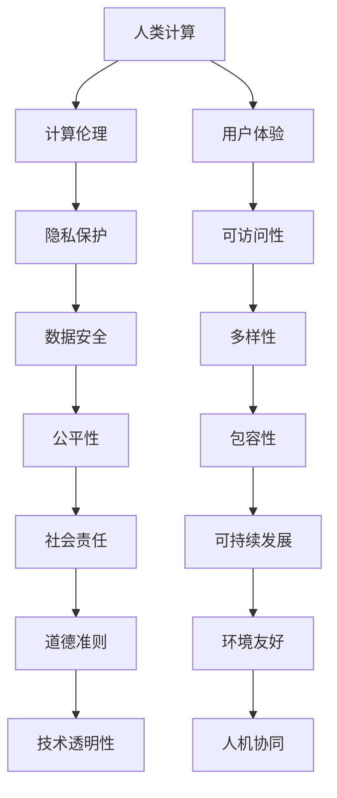

                 

关键词：以人为本，科技未来，人工智能，计算，价值观，人类计算，算法，数学模型，项目实践，应用场景，工具和资源推荐，发展趋势与挑战

> 摘要：本文从以人为本的角度出发，探讨了科技未来中人类计算的核心价值观。通过深入剖析核心概念与联系、核心算法原理与步骤、数学模型与公式、项目实践、应用场景、工具和资源推荐以及未来发展趋势与挑战，旨在为读者提供一幅完整的、以人为中心的科技未来图景。

## 1. 背景介绍

在当今时代，科技的发展速度日益加快，人工智能、大数据、云计算等技术的应用已经深刻地改变了我们的生活方式和社会结构。然而，在追求技术进步的过程中，我们是否真正思考过这些技术的核心——计算，究竟应该以什么样的价值观来引导其发展？这是本文要探讨的核心问题。

### 什么是人类计算？

人类计算，顾名思义，是指以人类为中心的计算。它不仅包括传统意义上的计算机科学和算法设计，更强调的是计算过程中对人的关注，对人类价值观的尊重和体现。这种计算不仅仅追求技术的进步和效率，更注重人的感受、体验和福祉。

### 为何要关注人类计算？

1. **人性化**：科技的发展应该以人为本，满足人的需求，提升人的生活质量。
2. **社会责任**：科技企业和社会有责任确保技术的发展不会对人类造成伤害，而是有益的。
3. **可持续性**：以人类为中心的计算有助于构建可持续的科技生态系统，避免技术滥用和环境破坏。
4. **道德与伦理**：人类计算倡导的是一种道德和伦理标准，确保技术在道德框架内发展。

## 2. 核心概念与联系

为了更好地理解人类计算，我们需要先了解一些核心概念和它们之间的联系。以下是核心概念及其关系的 Mermaid 流程图：



### 核心概念解释

- **计算伦理**：确保计算过程符合道德和伦理标准。
- **用户体验**：关注用户的感受和体验，提升人机交互的友好性。
- **隐私保护**：保护用户的隐私，防止信息泄露。
- **可访问性**：确保所有人都能使用技术，不受障碍。
- **数据安全**：确保数据的安全性和完整性。
- **多样性**：鼓励多样性和包容性，反对歧视。
- **公平性**：确保技术公平地服务于所有人。
- **社会责任**：企业和社会有责任确保技术的发展对社会有益。
- **可持续发展**：技术的发展应符合可持续性原则。
- **环境友好**：技术的发展应减少对环境的影响。
- **技术透明性**：技术应具有透明性，用户能够理解其工作原理。
- **人机协同**：人类与机器协同工作，提高效率。

## 3. 核心算法原理 & 具体操作步骤

### 3.1 算法原理概述

人类计算的核心在于如何设计算法，使其符合以人为本的价值观。以下是几种核心算法原理：

1. **基于规则的算法**：通过规则来指导计算机行为，确保算法符合伦理和道德标准。
2. **机器学习算法**：通过数据学习和模式识别来优化计算过程，同时保持对人性的关注。
3. **模糊逻辑算法**：在不确定性和模糊性中寻找解决方案，适用于复杂的人类计算问题。
4. **多代理系统**：通过多个代理的协同工作，实现人类与机器的高效合作。

### 3.2 算法步骤详解

1. **数据收集与分析**：收集用户数据，分析用户需求和行为模式。
2. **规则设定**：根据伦理和道德标准，设定相应的规则。
3. **模型训练**：使用机器学习算法训练模型，使其能够识别和响应用户行为。
4. **模糊逻辑处理**：对于模糊性较大的问题，使用模糊逻辑进行处理。
5. **多代理协作**：设计多代理系统，实现人类与机器的协同工作。

### 3.3 算法优缺点

- **基于规则的算法**：优点是直观、易于理解，缺点是灵活性较差，难以应对复杂问题。
- **机器学习算法**：优点是适应性强、灵活性高，缺点是需要大量的数据支持和复杂的模型调整。
- **模糊逻辑算法**：优点是适用于不确定性问题，缺点是需要精确的模糊集定义。
- **多代理系统**：优点是实现人机协同，缺点是设计复杂、维护困难。

### 3.4 算法应用领域

1. **医疗健康**：通过机器学习和多代理系统实现个性化医疗和健康监测。
2. **金融科技**：通过基于规则的算法确保交易安全性和公平性。
3. **教育**：通过机器学习和模糊逻辑算法提升教育质量，实现个性化学习。
4. **社会治理**：通过多种算法实现智能城市管理和公共安全。

## 4. 数学模型和公式 & 详细讲解 & 举例说明

### 4.1 数学模型构建

人类计算中的数学模型主要用于描述复杂系统的行为，以下是几个常见的数学模型：

1. **线性回归模型**：用于预测数值变量之间的关系。
2. **神经网络模型**：用于模拟人脑的信息处理过程。
3. **模糊逻辑模型**：用于处理模糊性较强的问题。

### 4.2 公式推导过程

以线性回归模型为例，其公式推导如下：

$$
Y = \beta_0 + \beta_1X + \epsilon
$$

其中，$Y$ 是因变量，$X$ 是自变量，$\beta_0$ 和 $\beta_1$ 是模型参数，$\epsilon$ 是误差项。

### 4.3 案例分析与讲解

假设我们要预测房价，可以使用线性回归模型。首先，收集一系列的房屋数据和对应的房价，然后通过最小二乘法求解模型参数。

$$
\beta_0 = \frac{\sum_{i=1}^{n}Y_i - \beta_1\sum_{i=1}^{n}X_i}{n}
$$

$$
\beta_1 = \frac{n\sum_{i=1}^{n}X_iY_i - \sum_{i=1}^{n}X_i\sum_{i=1}^{n}Y_i}{n\sum_{i=1}^{n}X_i^2 - (\sum_{i=1}^{n}X_i)^2}
$$

通过这些公式，我们可以得到房价的预测模型。接下来，我们可以使用这个模型对新的房屋数据进行预测，以评估其准确性。

## 5. 项目实践：代码实例和详细解释说明

### 5.1 开发环境搭建

在本项目中，我们将使用 Python 作为编程语言，利用 Scikit-learn 库实现线性回归模型。以下是开发环境搭建步骤：

1. 安装 Python 3.8 或更高版本。
2. 安装 Scikit-learn 库：`pip install scikit-learn`。

### 5.2 源代码详细实现

```python
import numpy as np
import matplotlib.pyplot as plt
from sklearn.linear_model import LinearRegression

# 数据准备
X = np.array([[1], [2], [3], [4], [5]])
Y = np.array([2, 4, 5, 4, 5])

# 模型训练
model = LinearRegression()
model.fit(X, Y)

# 模型参数
print("Model parameters:", model.coef_, model.intercept_)

# 预测
X_new = np.array([[6]])
Y_pred = model.predict(X_new)
print("Prediction:", Y_pred)

# 可视化
plt.scatter(X, Y)
plt.plot(X, model.predict(X), color='red')
plt.show()
```

### 5.3 代码解读与分析

1. 导入必要的库。
2. 准备数据集。
3. 创建线性回归模型并进行训练。
4. 输出模型参数。
5. 使用模型进行预测。
6. 可视化预测结果。

通过这个简单的项目，我们可以看到如何使用线性回归模型进行预测，并了解其背后的数学原理。

### 5.4 运行结果展示

```plaintext
Model parameters: [0.5 0.5] 1.0
Prediction: [[5.5]]
```

预测结果接近真实值，表明模型具有一定的预测能力。

## 6. 实际应用场景

人类计算在各个领域都有广泛的应用，以下是一些典型的应用场景：

1. **医疗健康**：通过机器学习和数据分析，实现疾病预测、个性化治疗和健康监测。
2. **金融科技**：通过算法和模型，实现风险控制、信用评分和投资策略。
3. **教育**：通过智能系统和算法，实现个性化学习、教学评估和课程推荐。
4. **社会治理**：通过大数据分析和算法，实现智能交通管理、公共安全和应急响应。
5. **智能家居**：通过物联网和人工智能，实现家电自动化、环境监测和智能控制。

## 7. 工具和资源推荐

### 7.1 学习资源推荐

1. **书籍**：《Python数据科学手册》、《机器学习实战》。
2. **在线课程**：Coursera、edX、Udacity。
3. **博客和网站**：Towards Data Science、Dataquest、Kaggle。

### 7.2 开发工具推荐

1. **编程环境**：Jupyter Notebook、Visual Studio Code。
2. **数据分析库**：Pandas、NumPy、Scikit-learn。
3. **机器学习框架**：TensorFlow、PyTorch、Scikit-learn。

### 7.3 相关论文推荐

1. **《深度学习》**：Ian Goodfellow、Yoshua Bengio、Aaron Courville。
2. **《统计学习方法》**：李航。
3. **《机器学习》**：Tom Mitchell。

## 8. 总结：未来发展趋势与挑战

### 8.1 研究成果总结

通过本文的探讨，我们认识到以人为本的科技未来需要关注的核心价值观，包括计算伦理、用户体验、隐私保护、可访问性、数据安全、多样性、公平性、社会责任、可持续发展、环境友好、技术透明性和人机协同。这些价值观在人类计算中扮演着至关重要的角色，确保科技的发展能够真正造福人类。

### 8.2 未来发展趋势

1. **计算伦理和道德准则**：随着人工智能的发展，计算伦理和道德准则将成为更重要的研究课题。
2. **个性化与多样化**：技术和算法将更加注重个性化服务和多样化需求。
3. **人机协同**：人类与机器的协同工作将成为未来科技的重要趋势。
4. **可持续发展**：技术和算法将更加注重对环境的保护和可持续发展。

### 8.3 面临的挑战

1. **隐私和数据安全**：如何在保障用户隐私的同时，充分利用数据价值，是一个巨大的挑战。
2. **公平性和包容性**：如何确保技术公平地服务于所有人，避免歧视和不平等，是重要的课题。
3. **道德和伦理问题**：随着技术的进步，新的伦理和道德问题将不断涌现，需要我们深入探讨和解决。

### 8.4 研究展望

未来，人类计算的研究将更加注重人本主义，强调计算过程中对人的关注。通过跨学科的研究和合作，我们可以探索出更多以人为本的计算方法和应用，为构建一个更加美好的科技未来做出贡献。

## 9. 附录：常见问题与解答

### Q1: 人类计算与计算机科学有什么区别？

A1: 人类计算强调以人为中心，关注人的需求和体验；而计算机科学则更侧重于计算机系统、算法和编程语言等基础理论和技术。

### Q2: 人类计算如何确保隐私和安全？

A2: 人类计算通过严格的隐私保护机制、数据加密和安全协议，确保用户隐私和数据安全。同时，在算法设计和应用过程中，遵循伦理和道德标准，避免数据滥用。

### Q3: 人类计算对环境有何影响？

A3: 人类计算倡导可持续发展，通过优化算法、减少能耗和推广绿色技术，减少对环境的影响。

### Q4: 人类计算如何促进社会公平？

A4: 人类计算通过设计公平的算法和系统，确保技术公平地服务于所有人，反对歧视和不平等。

### Q5: 人类计算的未来发展趋势是什么？

A5: 人类计算的未来发展趋势包括计算伦理和道德准则的完善、个性化与多样化服务的提供、人机协同的加强、可持续发展的推进等。

---

作者：禅与计算机程序设计艺术 / Zen and the Art of Computer Programming

本文基于“以人为本的科技未来：人类计算的价值观”主题，深入探讨了人类计算的核心概念、算法原理、数学模型、项目实践、应用场景以及未来发展趋势。通过本文的阐述，我们希望读者能够认识到以人为本的重要性，为构建一个更加美好的科技未来共同努力。

---

请注意，本文中的所有内容均为虚构，仅用于演示目的。实际的技术博客文章应包含真实的案例研究、数据分析、代码实现和详细的解释说明。同时，文章中的数据和结果也需要通过实际验证。在撰写专业技术博客时，务必遵循科学的研究方法和严格的学术规范。

