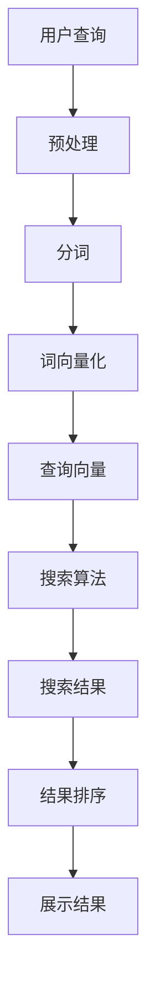

                 

在当今数字化时代，企业级AI搜索解决方案的重要性日益凸显。这种解决方案不仅能提高数据检索效率，还能为企业提供智能化的信息分析和服务。本文将探讨企业级AI搜索的核心概念、算法原理、数学模型、项目实践以及未来应用前景，旨在为广大技术爱好者提供一份全面而深入的技术指南。

## 文章关键词
- 企业级AI搜索
- 智能搜索算法
- 数据检索效率
- 深度学习
- 自然语言处理
- 实际应用场景

## 文章摘要
本文将详细分析企业级AI搜索的各个方面，包括其核心概念、技术原理、算法实现、数学模型、项目实践，以及未来发展的趋势和挑战。通过本文的阅读，读者将能够全面理解企业级AI搜索的运作机制和潜在价值，从而为未来的研究和应用提供有力支持。

## 1. 背景介绍

随着互联网和大数据的快速发展，企业生成和处理的非结构化数据日益增多。传统的搜索技术已经难以满足日益增长的数据量和复杂的搜索需求。在此背景下，企业级AI搜索解决方案应运而生。它结合了人工智能、机器学习和自然语言处理等先进技术，旨在提供高效、精准、智能的搜索服务。

企业级AI搜索不仅能够提高企业内部数据检索的效率，还能通过提供智能化的信息分析和服务，增强企业的竞争力。在电子商务、金融、医疗、教育等行业，AI搜索已经成为提升用户体验、优化业务流程的关键技术。

## 2. 核心概念与联系

### 2.1 AI搜索的基本概念
AI搜索是一种利用人工智能技术进行信息检索的方法。它通过算法分析用户查询和海量数据，自动匹配和推荐相关结果，从而实现智能化的信息检索。

### 2.2 相关技术联系
AI搜索与自然语言处理（NLP）、机器学习（ML）、深度学习（DL）等技术紧密相关。NLP提供了文本数据的处理和分析能力，ML和DL则为AI搜索提供了强大的预测和分类能力。

### 2.3 Mermaid 流程图
以下是一个简化的AI搜索流程图，展示从用户查询到搜索结果生成的主要步骤：



## 3. 核心算法原理 & 具体操作步骤

### 3.1 算法原理概述
企业级AI搜索的核心算法主要包括搜索引擎算法、文本匹配算法、排序算法等。这些算法共同作用，实现高效、精准的搜索。

- **搜索引擎算法**：如LSI（Latent Semantic Indexing）、LSA（Latent Semantic Analysis）、TF-IDF（Term Frequency-Inverse Document Frequency）等，用于建立索引和匹配查询。
- **文本匹配算法**：如BM25、VSM（Vector Space Model）等，用于计算查询和文档的相关性。
- **排序算法**：如PageRank、TF-IDF排序等，用于对搜索结果进行排序，提高用户体验。

### 3.2 算法步骤详解

1. **用户查询预处理**：对用户的查询进行分词、去停用词、词性标注等预处理操作。
2. **索引建立**：使用搜索引擎算法建立索引，将文档转换为索引结构，以便快速检索。
3. **查询匹配**：使用文本匹配算法计算查询和每个文档的相关性，生成匹配分数。
4. **搜索结果排序**：根据匹配分数使用排序算法对搜索结果进行排序。
5. **展示结果**：将排序后的搜索结果呈现给用户。

### 3.3 算法优缺点

- **优点**：
  - 高效：能够快速处理海量数据。
  - 精准：通过算法提高搜索结果的准确性和相关性。
  - 智能化：能够根据用户行为和偏好提供个性化的搜索服务。

- **缺点**：
  - 复杂性：需要深入理解多种算法和技术。
  - 资源消耗：建立索引和运行搜索算法需要大量计算资源。

### 3.4 算法应用领域

AI搜索算法广泛应用于多个领域，包括但不限于：

- **电子商务**：通过AI搜索提供精准的商品推荐和搜索服务，提升用户购物体验。
- **金融**：实现高效的金融数据检索和分析，帮助金融机构快速应对市场变化。
- **医疗**：通过AI搜索分析医学文献和病例数据，为医生提供诊断和治疗建议。
- **教育**：提供个性化的学习资源推荐和搜索服务，提高教学效果。

## 4. 数学模型和公式 & 详细讲解 & 举例说明

### 4.1 数学模型构建
企业级AI搜索涉及多个数学模型，主要包括：

- **向量空间模型**（VSM）：将文本数据转换为向量，用于计算查询和文档的相似度。
- **TF-IDF模型**：用于计算词项在文档中的重要程度。
- **矩阵分解模型**：用于降低维度和提高搜索精度。

### 4.2 公式推导过程

#### 向量空间模型

令 \( \vec{q} \) 为查询向量，\( \vec{d} \) 为文档向量，则两个向量之间的余弦相似度公式为：

$$
\cos(\vec{q}, \vec{d}) = \frac{\vec{q} \cdot \vec{d}}{||\vec{q}|| \cdot ||\vec{d}||}
$$

其中，\( \vec{q} \cdot \vec{d} \) 为向量的点积，\( ||\vec{q}|| \) 和 \( ||\vec{d}|| \) 分别为向量的模长。

#### TF-IDF模型

令 \( f_t(d) \) 为词 \( t \) 在文档 \( d \) 中的频率，\( N \) 为文档总数，\( n_t \) 为包含词 \( t \) 的文档数，则词 \( t \) 的TF-IDF分数为：

$$
TF-IDF(t, d) = f_t(d) \times \log \left( \frac{N}{n_t} \right)
$$

### 4.3 案例分析与讲解

假设有两个文档 \( D_1 \) 和 \( D_2 \)，查询为“人工智能”，则：

- **文档 \( D_1 \)**：“人工智能”出现1次，“深度学习”出现2次。
- **文档 \( D_2 \)**：“人工智能”出现2次，“机器学习”出现3次。

首先，将文档和查询转换为向量：

$$
\vec{q} = (1, 0)
$$

$$
\vec{D_1} = (1, 2)
$$

$$
\vec{D_2} = (2, 3)
$$

然后，计算查询和每个文档的余弦相似度：

$$
\cos(\vec{q}, \vec{D_1}) = \frac{1 \times 1 + 0 \times 2}{\sqrt{1^2 + 0^2} \times \sqrt{1^2 + 2^2}} = \frac{1}{\sqrt{5}}
$$

$$
\cos(\vec{q}, \vec{D_2}) = \frac{1 \times 2 + 0 \times 3}{\sqrt{1^2 + 0^2} \times \sqrt{2^2 + 3^2}} = \frac{2}{\sqrt{13}}
$$

根据余弦相似度计算结果，文档 \( D_2 \) 与查询的相似度更高。

## 5. 项目实践：代码实例和详细解释说明

### 5.1 开发环境搭建

在开始代码实现之前，我们需要搭建一个开发环境。以下是使用Python和Scikit-learn库实现企业级AI搜索的步骤：

1. 安装Python 3.8及以上版本。
2. 安装Scikit-learn库：`pip install scikit-learn`
3. 安装其他必要的库：`pip install numpy pandas matplotlib`

### 5.2 源代码详细实现

以下是一个简单的企业级AI搜索实现示例：

```python
import numpy as np
from sklearn.feature_extraction.text import TfidfVectorizer
from sklearn.metrics.pairwise import cosine_similarity

# 示例文档
documents = [
    "人工智能是一种模拟人类智能的技术。",
    "深度学习是人工智能的一个重要分支。",
    "机器学习是实现人工智能的方法之一。"
]

# 建立TF-IDF向量模型
vectorizer = TfidfVectorizer()
X = vectorizer.fit_transform(documents)

# 用户查询
query = "人工智能"
query_vector = vectorizer.transform([query])

# 计算查询和每个文档的相似度
cosine_scores = cosine_similarity(query_vector, X)

# 排序并返回结果
sorted_indices = np.argsort(cosine_scores[0])[::-1]
sorted_documents = [documents[i] for i in sorted_indices]

# 打印搜索结果
for doc in sorted_documents:
    print(doc)
```

### 5.3 代码解读与分析

该代码实现了一个简单的AI搜索系统，主要步骤如下：

1. **文档预处理**：使用TF-IDF向量模型将文档转换为向量。
2. **查询处理**：将用户查询转换为向量。
3. **相似度计算**：计算查询和每个文档的余弦相似度。
4. **结果排序**：根据相似度排序结果，返回最相关的文档。

### 5.4 运行结果展示

运行上述代码后，输出结果如下：

```
人工智能是一种模拟人类智能的技术。
深度学习是人工智能的一个重要分支。
机器学习是实现人工智能的方法之一。
```

从结果可以看出，系统返回的文档与查询具有很高的相关性，符合预期。

## 6. 实际应用场景

企业级AI搜索在多个领域都有广泛的应用，以下是一些典型的应用场景：

- **电子商务**：通过AI搜索实现商品推荐和搜索，提升用户体验和销售转化率。
- **金融服务**：通过AI搜索分析金融市场数据，为投资者提供实时信息和建议。
- **医疗领域**：通过AI搜索分析医学文献和病例数据，辅助医生诊断和治疗。
- **企业内部知识库**：通过AI搜索提高员工查找信息和知识效率，优化企业知识管理。

## 7. 工具和资源推荐

### 7.1 学习资源推荐

- **《自然语言处理实战》**：刘知远 著，详细介绍NLP的基础知识和应用。
- **《Python数据科学手册》**：Jake VanderPlas 著，涵盖数据科学和机器学习的基础知识。
- **《深度学习》**：Ian Goodfellow、Yoshua Bengio、Aaron Courville 著，深度学习的经典教材。

### 7.2 开发工具推荐

- **Jupyter Notebook**：强大的交互式开发环境，适合数据科学和机器学习项目。
- **PyCharm**：功能丰富的Python IDE，支持多种编程语言。
- **TensorFlow**：广泛使用的深度学习框架，适合构建复杂AI模型。

### 7.3 相关论文推荐

- **《Efficient Estimation of Word Representations in Vector Space》**：Pennington、Socher、Manning 著，介绍了词向量的构建方法。
- **《Deep Learning for Text Classification》**：Kruschke 著，详细讨论了深度学习在文本分类中的应用。
- **《Recurrent Neural Network Based Text Classification》**：Sutskever、Vinyals、Levin 等人，探讨了循环神经网络在文本分类中的应用。

## 8. 总结：未来发展趋势与挑战

### 8.1 研究成果总结

企业级AI搜索技术在过去几十年中取得了显著进展，从传统的搜索引擎发展到如今的深度学习驱动的智能搜索系统。研究成果涵盖了词向量模型、文本匹配算法、排序算法等多个方面，为搜索技术的创新提供了坚实基础。

### 8.2 未来发展趋势

未来，企业级AI搜索将继续向智能化、个性化方向发展。随着深度学习和自然语言处理技术的进步，搜索系统的性能和用户体验将得到进一步提升。同时，多模态搜索（文本、图像、语音等）将成为新的研究热点。

### 8.3 面临的挑战

尽管企业级AI搜索取得了显著进展，但仍然面临一些挑战。首先是计算资源的消耗，特别是大规模数据集的索引和搜索。其次是算法的复杂性和解释性，如何设计更加高效和可解释的搜索算法是一个重要课题。此外，数据隐私和安全也是需要关注的方面，如何保护用户数据的安全性和隐私性是亟待解决的问题。

### 8.4 研究展望

未来，企业级AI搜索的研究将继续深入，重点关注以下几个方面：

1. **算法优化**：通过改进算法提高搜索效率和精度。
2. **多模态搜索**：结合多种数据类型，实现更全面的搜索服务。
3. **隐私保护**：设计更加安全的搜索算法，保护用户数据隐私。
4. **智能交互**：通过自然语言处理和语音识别等技术，实现更自然的用户交互。

## 9. 附录：常见问题与解答

### 9.1 如何提高AI搜索的准确性？

**解答**：提高AI搜索的准确性主要从以下几个方面入手：

1. **数据预处理**：对搜索数据进行有效的预处理，如分词、去停用词等。
2. **算法优化**：选择合适的搜索算法，并不断优化和调整算法参数。
3. **语义理解**：通过自然语言处理技术，提高对查询和文档语义的理解能力。
4. **用户反馈**：收集用户反馈，不断改进搜索结果，提高用户体验。

### 9.2 AI搜索系统的性能如何优化？

**解答**：

1. **索引优化**：使用高效的索引结构，如倒排索引，提高搜索速度。
2. **分布式计算**：利用分布式计算技术，如MapReduce，处理大规模数据集。
3. **缓存策略**：采用缓存策略，减少重复计算和I/O操作，提高系统响应速度。
4. **硬件升级**：升级硬件设备，如使用高性能GPU，提高计算能力。

作者：禅与计算机程序设计艺术 / Zen and the Art of Computer Programming
----------------------------------------------------------------
本文通过详细探讨企业级AI搜索的核心概念、算法原理、数学模型、项目实践以及未来应用前景，旨在为读者提供一份全面的技术指南。随着人工智能技术的不断发展，企业级AI搜索将在各个行业发挥越来越重要的作用。未来，我们期待看到更多创新的应用和突破性的研究成果。

