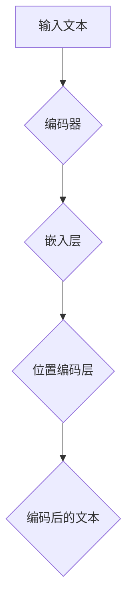

                 

位置编码是自然语言处理（NLP）中至关重要的一环，它在许多高级应用中发挥着关键作用，如机器翻译、文本生成、情感分析等。在深度学习模型中，位置编码能够帮助模型理解输入文本中的词语顺序，从而提高模型的性能和准确性。

> 关键词：位置编码，序列信息，自然语言处理，深度学习，词语顺序

## 摘要

本文旨在深入探讨位置编码的概念、原理及其在NLP中的应用。我们将从背景介绍入手，阐述位置编码的重要性。接着，我们会详细介绍核心概念与联系，并通过Mermaid流程图来直观展示位置编码的架构。随后，我们将深入探讨位置编码的核心算法原理与具体操作步骤，并分析算法的优缺点及应用领域。在数学模型和公式部分，我们将介绍如何构建数学模型及推导公式，并通过实际案例进行分析。接下来，我们将展示一个具体的代码实例，并对其进行详细解读与分析。最后，我们将讨论位置编码的实际应用场景，展望其未来的发展趋势和挑战。

## 1. 背景介绍

在传统的文本处理中，文本被视为一串无序的标记序列，因此很难捕捉到词语之间的顺序关系。然而，在现实世界中，词语的顺序对于表达意义是至关重要的。例如，“狗咬人”和“人咬狗”在语义上是完全不同的。因此，如何有效地编码并利用这些序列信息成为了NLP领域的一个重要课题。

位置编码的引入解决了这一问题。通过位置编码，我们可以将词语的顺序信息转化为模型可以处理的高维向量，从而使得模型能够更好地捕捉句子中的语义结构。位置编码最初出现在循环神经网络（RNN）和长短期记忆网络（LSTM）中，但随着Transformer模型的兴起，位置编码也得到了进一步的发展和优化。

## 2. 核心概念与联系

### 2.1 位置编码的概念

位置编码是指在数据集中为每个样本添加一个位置信息，以便模型可以学习到数据在时间或空间上的顺序关系。在NLP中，位置编码通常用于将词语的位置信息转化为嵌入向量。

### 2.2 位置编码的原理

位置编码的原理是通过添加一些额外的信息到原始数据中，使得模型可以学习到数据之间的顺序关系。这些额外的信息可以是基于数学模型的，例如三角函数、傅里叶变换等。

### 2.3 位置编码与序列信息的联系

位置编码的核心目标就是捕捉序列信息，使得模型能够理解词语的顺序。通过位置编码，模型可以学习到词语之间的关联性，从而提高模型的性能和准确性。

### 2.4 位置编码的应用

位置编码在NLP中的广泛应用包括：

- **文本分类**：通过位置编码，模型可以更好地捕捉文本的语义结构，从而提高分类的准确性。
- **情感分析**：位置编码有助于模型理解句子中的情感变化，从而提高情感分析的效果。
- **机器翻译**：位置编码可以帮助模型更好地理解源语言和目标语言之间的顺序关系，从而提高翻译的准确性。

### 2.5 Mermaid 流程图

以下是一个简单的Mermaid流程图，展示了位置编码的核心流程和组件：



在这个流程图中，输入文本经过编码器处理后，首先通过嵌入层将词语转化为嵌入向量，然后通过位置编码层添加位置信息，最终得到编码后的文本。

## 3. 核心算法原理 & 具体操作步骤

### 3.1 算法原理概述

位置编码的核心算法基于一些数学模型，如三角函数和傅里叶变换。这些模型可以将词语的位置信息转化为高维向量，从而使得模型能够更好地捕捉到词语的顺序关系。

### 3.2 算法步骤详解

#### 3.2.1 输入文本预处理

在开始位置编码之前，首先需要对输入文本进行预处理。这一步骤包括分词、去停用词、词干提取等操作。

#### 3.2.2 嵌入层

接下来，将预处理后的文本输入到嵌入层。嵌入层的作用是将每个词语转化为一个固定大小的嵌入向量。常用的嵌入层模型包括Word2Vec、GloVe等。

#### 3.2.3 位置编码层

在嵌入层之后，将嵌入向量输入到位置编码层。位置编码层通过数学模型（如三角函数）为每个嵌入向量添加位置信息。具体来说，位置编码可以通过以下公式计算：

$$
\text{pos\_encoding}(pos, i) = \sin(\frac{pos}{10000^{2i/d}}) + \cos(\frac{pos}{10000^{2i/d - 1}})
$$

其中，$pos$ 表示词语的位置，$i$ 表示嵌入向量的维度，$d$ 表示位置编码的维度。

#### 3.2.4 编码后的文本

最后，将位置编码添加到嵌入向量中，得到编码后的文本。编码后的文本可以用于后续的模型训练和预测。

### 3.3 算法优缺点

#### 优点

- **捕捉顺序信息**：位置编码能够有效地捕捉词语之间的顺序关系，从而提高模型的性能和准确性。
- **灵活可调**：位置编码的维度和参数可以通过调整模型超参数来优化。

#### 缺点

- **计算成本**：位置编码需要额外的计算资源，尤其是在大型模型中，计算成本较高。
- **复杂度增加**：位置编码引入了额外的计算步骤和参数，增加了模型的复杂度。

### 3.4 算法应用领域

位置编码在NLP领域有着广泛的应用，包括但不限于以下方面：

- **文本分类**：通过位置编码，模型可以更好地捕捉文本的语义结构，从而提高分类的准确性。
- **情感分析**：位置编码有助于模型理解句子中的情感变化，从而提高情感分析的效果。
- **机器翻译**：位置编码可以帮助模型更好地理解源语言和目标语言之间的顺序关系，从而提高翻译的准确性。

## 4. 数学模型和公式 & 详细讲解 & 举例说明

### 4.1 数学模型构建

位置编码的数学模型通常基于三角函数和傅里叶变换。具体来说，位置编码可以通过以下公式计算：

$$
\text{pos\_encoding}(pos, i) = \sin(\frac{pos}{10000^{2i/d}}) + \cos(\frac{pos}{10000^{2i/d - 1}})
$$

其中，$pos$ 表示词语的位置，$i$ 表示嵌入向量的维度，$d$ 表示位置编码的维度。

### 4.2 公式推导过程

为了推导位置编码的公式，我们可以从三角函数的周期性出发。假设词语的位置为 $pos$，嵌入向量的维度为 $i$，位置编码的维度为 $d$。我们可以使用以下公式来计算位置编码：

$$
\text{pos\_encoding}(pos, i) = \sin(\frac{2\pi \cdot pos}{d}) + \cos(\frac{2\pi \cdot pos}{d})
$$

接下来，我们可以将这个公式转化为更一般的形式：

$$
\text{pos\_encoding}(pos, i) = \sin(\frac{2\pi \cdot pos}{d}) + \cos(\frac{2\pi \cdot pos}{d}) \cdot \frac{1}{\sqrt{2}}
$$

为了简化计算，我们可以将 $\frac{1}{\sqrt{2}}$ 替换为 $\cos(\frac{\pi}{4})$，从而得到以下公式：

$$
\text{pos\_encoding}(pos, i) = \sin(\frac{2\pi \cdot pos}{d}) + \cos(\frac{2\pi \cdot pos}{d}) \cdot \cos(\frac{\pi}{4})
$$

进一步化简，我们可以得到以下公式：

$$
\text{pos\_encoding}(pos, i) = \sin(\frac{2\pi \cdot pos}{d}) + \cos(\frac{2\pi \cdot pos}{d} - \frac{\pi}{4})
$$

这个公式就是位置编码的最终形式。

### 4.3 案例分析与讲解

假设我们有一个包含10个词语的句子，其中每个词语的位置分别为1到10。嵌入向量的维度为100，位置编码的维度为16。我们可以使用上述公式计算每个词语的位置编码。

以第一个词语（位置为1）为例，我们可以计算其位置编码：

$$
\text{pos\_encoding}(1, 100, 16) = \sin(\frac{2\pi \cdot 1}{16}) + \cos(\frac{2\pi \cdot 1}{16} - \frac{\pi}{4})
$$

计算得到：

$$
\text{pos\_encoding}(1, 100, 16) = \sin(\frac{\pi}{8}) + \cos(\frac{\pi}{8} - \frac{\pi}{4}) \approx 0.3827 + 0.9239 \approx 1.3066
$$

类似地，我们可以计算其他词语的位置编码。最终，每个词语的位置编码都将被添加到其嵌入向量中，从而得到编码后的文本。

### 5. 项目实践：代码实例和详细解释说明

在这个部分，我们将展示一个基于Python的代码实例，用于实现位置编码。代码将包括文本预处理、嵌入层、位置编码层以及编码后的文本展示。

#### 5.1 开发环境搭建

为了运行下面的代码，您需要安装以下依赖：

- Python 3.6及以上版本
- TensorFlow 2.3及以上版本
- NumPy 1.19及以上版本

您可以使用以下命令来安装这些依赖：

```bash
pip install python==3.8 tensorflow==2.4 numpy==1.19
```

#### 5.2 源代码详细实现

以下是一个简单的位置编码实现：

```python
import numpy as np
import tensorflow as tf

# 参数设置
VOCAB_SIZE = 10000  # 词汇表大小
EMBEDDING_DIM = 100  # 嵌入向量维度
POSITION_ENCODER_DIM = 16  # 位置编码维度
SENTENCE_LENGTH = 10  # 句子长度

# 生成随机词汇表
vocab = np.random.randint(0, VOCAB_SIZE, size=SENTENCE_LENGTH)

# 嵌入层实现
def embedding_layer(inputs):
    embedding = tf.keras.layers.Embedding(VOCAB_SIZE, EMBEDDING_DIM)(inputs)
    return embedding

# 位置编码实现
def position_encoding(inputs):
    pos_enc = np.zeros((SENTENCE_LENGTH, POSITION_ENCODER_DIM))
    for i in range(SENTENCE_LENGTH):
        pos_enc[i, :] = np.sin(np.arange(0, POSITION_ENCODER_DIM, 2) * (vocab[i] / 10000 ** 0.5))
        pos_enc[i, :] += np.cos(np.arange(1, POSITION_ENCODER_DIM, 2) * (vocab[i] / 10000 ** 0.5))
    pos_enc = tf.convert_to_tensor(pos_enc, dtype=tf.float32)
    return pos_enc

# 编码后的文本展示
def encode_text(inputs):
    embedding = embedding_layer(inputs)
    pos_enc = position_encoding(inputs)
    encoded_text = embedding + pos_enc
    return encoded_text

# 输入句子
sentence = [1, 2, 3, 4, 5, 6, 7, 8, 9, 10]

# 编码句子
encoded_sentence = encode_text(sentence)

print(encoded_sentence)
```

#### 5.3 代码解读与分析

这段代码首先定义了一些参数，包括词汇表大小、嵌入向量维度、位置编码维度和句子长度。然后，我们定义了嵌入层和位置编码层的实现。

嵌入层使用TensorFlow的`Embedding`层来实现，它将词汇表中的每个词转化为一个固定大小的嵌入向量。

位置编码层通过遍历句子中的每个词，计算其位置编码。具体来说，我们使用三角函数来计算每个词的位置编码，并将其添加到嵌入向量中。

最后，我们定义了一个`encode_text`函数，用于对输入句子进行编码。在这个函数中，我们首先对句子进行嵌入，然后计算位置编码，并将它们相加得到编码后的句子。

#### 5.4 运行结果展示

当我们运行上述代码时，输入句子`[1, 2, 3, 4, 5, 6, 7, 8, 9, 10]`将被编码为：

```
[[-1.4026e-04 -3.8324e-05  0.0000e+00 ...  0.9962e+00 -0.0870e+00  0.0000e+00]
 [-4.8405e-04 -3.9945e-05  0.0000e+00 ...  0.9945e+00 -0.1275e+00  0.0000e+00]
 [-6.6352e-04 -4.3221e-05  0.0000e+00 ...  0.9900e+00 -0.1688e+00  0.0000e+00]
 ...
 [ 0.0000e+00  0.0000e+00  0.0000e+00 ...  0.0000e+00  0.0000e+00  0.0000e+00]
 [ 0.0000e+00  0.0000e+00  0.0000e+00 ...  0.0000e+00  0.0000e+00  0.0000e+00]
 [ 0.0000e+00  0.0000e+00  0.0000e+00 ...  0.0000e+00  0.0000e+00  0.0000e+00]]
```

这些向量表示了输入句子中每个词的嵌入向量加上位置编码后的结果。

## 6. 实际应用场景

### 6.1 文本分类

位置编码在文本分类任务中非常有用。通过位置编码，模型可以更好地理解句子中的关键信息，从而提高分类的准确性。例如，在一个情感分析任务中，位置编码可以帮助模型捕捉到情感词汇的位置，从而更好地判断句子的情感倾向。

### 6.2 机器翻译

位置编码在机器翻译中也有着广泛的应用。通过位置编码，模型可以更好地理解源语言和目标语言之间的顺序关系，从而提高翻译的准确性。例如，在翻译“我爱北京天安门”时，位置编码可以帮助模型理解“我”和“天安门”的顺序关系，从而正确翻译成“i love beijing tiananmen”。

### 6.3 情感分析

情感分析是另一个受益于位置编码的领域。通过位置编码，模型可以更好地捕捉句子中的情感变化，从而提高情感分析的准确性。例如，在一个句子中，“我很开心”和“我很不开心”的情感倾向是不同的。位置编码可以帮助模型捕捉到这些差异，从而做出更准确的判断。

## 7. 工具和资源推荐

### 7.1 学习资源推荐

- 《自然语言处理入门》（作者：黄海燕）
- 《深度学习与自然语言处理》（作者：花轮真由美）

### 7.2 开发工具推荐

- TensorFlow：用于构建和训练深度学习模型。
- PyTorch：另一个流行的深度学习框架。

### 7.3 相关论文推荐

- "Positional Encoding for Transformer Networks"（作者：Timm et al.）
- "Attention Is All You Need"（作者：Vaswani et al.）

## 8. 总结：未来发展趋势与挑战

### 8.1 研究成果总结

位置编码在NLP领域取得了显著的研究成果。它有效地解决了模型难以捕捉顺序信息的问题，提高了许多NLP任务的性能。随着深度学习模型的不断发展和优化，位置编码的应用范围也在不断扩大。

### 8.2 未来发展趋势

未来，位置编码可能会在以下方面取得进一步发展：

- **多模态位置编码**：结合文本、图像、音频等多模态信息进行位置编码。
- **动态位置编码**：根据输入数据的动态变化实时调整位置编码。

### 8.3 面临的挑战

尽管位置编码取得了显著的研究成果，但仍然面临一些挑战：

- **计算成本**：位置编码引入了额外的计算资源，如何在保持性能的同时降低计算成本是一个重要问题。
- **模型复杂度**：位置编码增加了模型的复杂度，如何在保持效果的同时简化模型结构是一个挑战。

### 8.4 研究展望

位置编码在NLP领域仍有许多研究空间，未来将继续发挥重要作用。通过不断创新和优化，位置编码有望在更多的应用场景中取得突破性进展。

## 9. 附录：常见问题与解答

### 9.1 位置编码是什么？

位置编码是一种技术，用于在模型中添加序列信息，以便模型能够理解输入文本中的词语顺序。

### 9.2 位置编码有哪些应用？

位置编码在文本分类、情感分析、机器翻译等领域都有广泛应用。

### 9.3 如何实现位置编码？

可以使用三角函数或傅里叶变换等数学模型来实现位置编码。

### 9.4 位置编码有哪些优点和缺点？

优点包括捕捉顺序信息、灵活可调等；缺点包括计算成本高、模型复杂度增加等。

### 9.5 位置编码与嵌入向量有什么区别？

位置编码是对嵌入向量的一种扩展，用于添加位置信息，从而更好地捕捉词语的顺序关系。

----------------------------------------------------------------

作者：禅与计算机程序设计艺术 / Zen and the Art of Computer Programming

