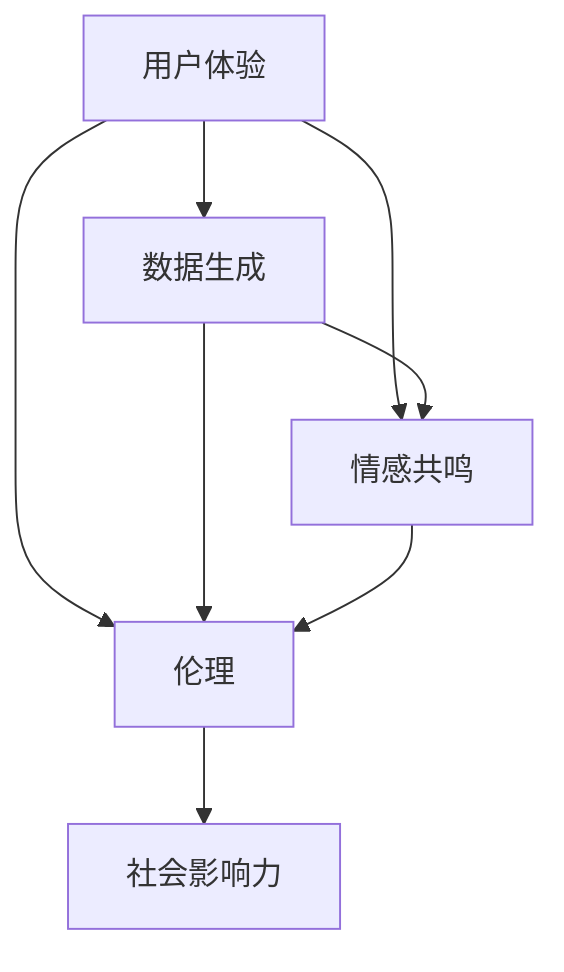

                 

在当今的数字时代，随着人工智能（AI）技术的迅猛发展，我们对“真实性”（Authenticity）的理解和应用正经历着前所未有的变革。在传统的互联网环境中，真实性通常指的是信息的可信度和可靠性。而在AI主导的新时代，真实性更多地体现在用户体验、数据生成、情感共鸣等方面。本文将探讨AI时代的真实性追求，从技术、伦理和社会等多个维度进行分析，旨在揭示这一概念在AI时代的深刻内涵和挑战。

## 文章关键词

- 人工智能（AI）
- 真实性（Authenticity）
- 用户体验（User Experience）
- 数据生成（Data Generation）
- 情感共鸣（Emotional Resonance）
- 伦理（Ethics）

## 文章摘要

本文从AI技术的角度出发，探讨了在数字时代下真实性的多重含义。首先，我们回顾了真实性的传统定义及其在互联网环境中的应用。接着，我们分析了AI如何影响真实性的表达和体验，特别是在生成内容、情感模拟和个性化服务方面的表现。随后，本文讨论了AI时代真实性追求的伦理问题和其对社会的影响。最后，我们提出了对未来AI真实性发展的展望，包括技术进步的可能方向和面临的挑战。

## 1. 背景介绍

### 1.1 互联网环境下的真实性

在互联网环境中，真实性是一个基础而重要的概念。传统上，真实性指的是信息是否准确、可信，以及用户是否可以信赖这些信息。例如，电子商务平台需要确保商品描述的真实性，社交媒体需要验证用户身份的真实性，以防止欺诈和虚假信息的传播。此外，搜索引擎的结果也必须真实可靠，以帮助用户快速找到所需的信息。

真实性的维护不仅仅是一个技术问题，它还涉及到法律、伦理和社会等多个层面。例如，欧盟的《通用数据保护条例》（GDPR）就规定了用户数据的真实性和保护用户的隐私权。这些法规和标准的制定，体现了社会对真实性的高度重视。

### 1.2 AI与真实性的变革

随着AI技术的兴起，我们对真实性的理解和应用发生了深刻的变化。AI通过其强大的计算能力和学习算法，能够生成高度逼真的虚拟内容和场景，极大地丰富了用户体验。例如，AI驱动的虚拟助手和智能客服能够提供个性化的服务和互动体验，使人们感受到更加真实的存在感。

然而，AI的这些能力也带来了新的挑战。首先，AI生成的信息可能无法保证其真实性，从而误导用户。例如，深度伪造（Deepfake）技术可以生成极具欺骗性的视频和图像，使得虚假信息难以辨别。其次，AI的应用可能引发伦理问题，如隐私侵犯、数据滥用等，这些问题直接关系到真实性的维护。

### 1.3 AI时代真实性的重要性

在AI时代，真实性的重要性不仅体现在技术层面，还体现在伦理和社会层面。对于技术来说，真实性是衡量AI系统性能和可信度的重要指标。只有当AI系统能够生成真实、可靠的信息，用户才会信任并依赖这些系统。

在社会层面，真实性的缺失可能导致信任危机和社会动荡。例如，虚假信息的传播不仅会误导公众，还会影响选举、金融市场等关键领域，对社会稳定产生负面影响。

因此，在AI时代，我们必须重新审视真实性的定义和意义，探索如何在人工智能的背景下维护和追求真实性。

### 1.4 本文结构

本文将首先回顾真实性的传统定义，并分析其在互联网环境中的应用。接着，我们将探讨AI技术如何影响真实性的表达和体验，特别是在生成内容、情感模拟和个性化服务方面。随后，本文将讨论AI时代真实性追求的伦理问题和其对社会的影响。最后，本文将提出对未来AI真实性发展的展望，并总结研究成果。

## 2. 核心概念与联系

在探讨AI时代的真实性之前，我们需要明确几个核心概念，并理解它们之间的联系。以下是本文所涉及的核心概念及其关系。

### 2.1 用户体验（User Experience）

用户体验是指用户在使用产品或服务时所感受到的总体体验。在互联网和AI时代，用户体验的核心是真实性。用户期望在互动过程中感受到真实的存在感和可信的信息。

### 2.2 数据生成（Data Generation）

数据生成是指利用AI算法生成新的数据，如文本、图像、音频等。在AI时代，数据生成技术大大增强了用户体验的真实感，但同时也带来了真实性保障的挑战。

### 2.3 情感共鸣（Emotional Resonance）

情感共鸣是指用户与产品或服务之间产生的情感联系。在AI时代，情感共鸣的实现依赖于AI对用户情感的准确理解和模拟，这要求生成的内容具有高度的真实性。

### 2.4 伦理（Ethics）

伦理是指在处理数据和用户互动时所需遵循的道德规范。在AI时代，伦理问题与真实性的追求密切相关，因为AI技术的应用可能涉及隐私、公平性和透明性等方面的挑战。

### 2.5 社会影响力（Social Impact）

社会影响力是指技术对社会各个层面的影响，包括经济、政治、文化等。在AI时代，真实性的维护不仅关系到技术的成功，还关系到社会的稳定和公众的信任。

以下是这些核心概念之间的Mermaid流程图表示：



在这个流程图中，用户体验是核心，它通过数据生成、情感共鸣和伦理等多个环节与社会影响力相连接。每一个环节都涉及真实性的问题，这构成了我们探讨AI时代真实性的基础。

## 3. 核心算法原理 & 具体操作步骤

### 3.1 算法原理概述

在AI时代，追求真实性的核心算法主要涉及生成对抗网络（GANs）、强化学习和情感计算。这些算法分别从数据生成、行为模拟和情感识别三个方面为真实性提供了技术支持。

#### 3.1.1 生成对抗网络（GANs）

GANs是一种深度学习模型，由生成器和判别器组成。生成器的任务是生成逼真的数据，而判别器的任务是区分生成数据和真实数据。通过这种对抗训练，生成器逐渐生成更加真实的数据，从而提升用户体验的真实感。

#### 3.1.2 强化学习

强化学习是一种通过试错来学习最优策略的机器学习技术。在真实性追求中，强化学习可用于模拟用户行为，提高系统的交互性和响应度。例如，智能客服系统可以通过强化学习来优化对话流程，使其更贴近真实的用户交流。

#### 3.1.3 情感计算

情感计算是研究如何使计算机理解、感知和模拟人类情感的领域。通过情感计算，AI系统可以更准确地识别用户的情感状态，生成符合情感一致性的内容，从而增强用户体验的真实性。

### 3.2 算法步骤详解

#### 3.2.1 生成对抗网络（GANs）的具体步骤

1. **初始化**：生成器和判别器分别初始化权重。
2. **生成器训练**：生成器生成一批数据，判别器判断这些数据是真实数据还是生成数据。
3. **判别器训练**：判别器调整权重以更好地区分真实和生成数据。
4. **重复步骤 2 和 3**：不断迭代，生成器和判别器相互竞争，生成器逐渐提高生成数据的质量。

#### 3.2.2 强化学习的基本步骤

1. **定义状态和动作**：明确系统的状态和可执行的动作。
2. **初始策略**：随机选择一个初始策略。
3. **环境交互**：根据当前状态执行动作，观察系统状态的变化。
4. **更新策略**：根据奖励函数调整策略，以最大化长期回报。
5. **重复步骤 3 和 4**：不断迭代，优化策略。

#### 3.2.3 情感计算的核心步骤

1. **数据收集**：收集用户行为和情感数据。
2. **特征提取**：从数据中提取情感特征。
3. **情感识别**：使用分类算法识别用户的情感状态。
4. **情感模拟**：根据识别出的情感状态生成相应的情感反馈。
5. **反馈循环**：用户对情感反馈进行反馈，系统进一步优化情感模拟。

### 3.3 算法优缺点

#### 3.3.1 生成对抗网络（GANs）的优点

- **高质量生成**：GANs能够生成高度逼真的数据，极大地提升了用户体验。
- **灵活性**：GANs可以应用于各种数据类型，包括文本、图像和音频等。

#### 3.3.1 生成对抗网络（GANs）的缺点

- **训练难度**：GANs的训练过程非常复杂，需要大量的计算资源和时间。
- **模式崩溃**：在训练过程中，生成器可能会失去多样性，导致生成的数据缺乏真实性。

#### 3.3.2 强化学习的优点

- **自适应性强**：强化学习系统能够根据环境动态调整策略，提高系统的适应性。
- **应用广泛**：强化学习可以应用于游戏、机器人控制等多个领域。

#### 3.3.2 强化学习的缺点

- **计算成本高**：强化学习需要大量的样本数据来训练，计算成本较高。
- **收敛速度慢**：在某些情况下，强化学习可能需要很长时间才能收敛到最优策略。

#### 3.3.3 情感计算的优点

- **提升用户体验**：通过情感计算，系统能够更好地理解和满足用户需求，提升用户体验。
- **增强交互性**：情感计算能够实现更加自然和人性化的用户交互。

#### 3.3.3 情感计算的缺点

- **准确性有限**：情感计算在情感识别和模拟方面还存在一定的局限性，难以达到完美的准确性。
- **技术门槛高**：情感计算涉及多个领域的交叉技术，开发难度较大。

### 3.4 算法应用领域

#### 3.4.1 生成对抗网络（GANs）的应用

- **虚拟现实（VR）**：GANs可以生成逼真的虚拟场景，提升VR体验的真实感。
- **图像处理**：GANs可以用于图像修复、风格转换等任务，提高图像质量。
- **文本生成**：GANs可以生成高质量的文本内容，应用于聊天机器人、内容生成等场景。

#### 3.4.2 强化学习的应用

- **智能客服**：强化学习可以帮助智能客服系统优化对话流程，提供更自然和高效的客服体验。
- **自动驾驶**：强化学习在自动驾驶领域有广泛应用，用于优化驾驶策略，提高行驶安全性。
- **游戏AI**：强化学习可以用于游戏AI，使游戏角色更加智能和适应性强。

#### 3.4.3 情感计算的应用

- **智能音箱**：智能音箱通过情感计算理解用户需求，提供更加个性化的服务。
- **心理辅导**：情感计算可以用于心理辅导，帮助识别用户的情感状态，提供相应的心理支持。
- **社交网络**：情感计算可以用于社交网络，分析用户情感趋势，提供更有效的社交互动。

## 4. 数学模型和公式 & 详细讲解 & 举例说明

在探讨AI时代的真实性时，数学模型和公式扮演了至关重要的角色。以下是几个关键的数学模型和公式，我们将对其构建、推导过程和实际应用进行详细讲解。

### 4.1 数学模型构建

#### 4.1.1 生成对抗网络（GANs）的数学模型

生成对抗网络（GANs）的核心包括生成器和判别器。以下是其数学模型的构建：

**生成器（Generator）**：$G(z)$是一个从随机噪声向量$z$映射到数据空间$X$的函数。

**判别器（Discriminator）**：$D(x)$是一个从数据空间$X$映射到二元值[0,1]的函数，用来判断输入数据$x$是真实数据还是生成数据。

**损失函数（Loss Function）**：GANs使用的是对抗性损失函数，通常使用二元交叉熵损失函数。

**生成器损失**：$L_G = -\mathbb{E}_{z \sim p_z(z)}[\log D(G(z))]$

**判别器损失**：$L_D = -\mathbb{E}_{x \sim p_{data}(x)}[\log D(x)] - \mathbb{E}_{z \sim p_z(z)}[\log (1 - D(G(z))]$

#### 4.1.2 强化学习的数学模型

强化学习的主要数学模型包括：

**状态-动作价值函数**：$Q(s, a)$表示在状态$s$下执行动作$a$得到的期望回报。

**策略（Policy）**：$\pi(a|s)$表示在状态$s$下采取动作$a$的概率。

**奖励函数**：$R(s, a)$表示在状态$s$下执行动作$a$所获得的即时奖励。

**状态转移概率**：$P(s'|s, a)$表示在状态$s$下执行动作$a$后转移到状态$s'$的概率。

**价值迭代方程**：$Q(s, a) = R(s, a) + \gamma \max_{a'} Q(s', a')$

#### 4.1.3 情感计算的数学模型

情感计算主要涉及情感特征提取和分类模型。以下是一个简化的情感计算数学模型：

**特征提取**：使用神经网络提取文本或语音的情感特征，表示为向量$F(x)$，其中$x$是输入文本或语音。

**分类模型**：使用分类器（如支持向量机SVM、神经网络）对情感特征进行分类，输出情感标签。

**情感特征映射**：$F(x) \rightarrow \mathcal{F}(x)$，其中$\mathcal{F}(x)$是情感特征空间中的映射。

**分类模型输出**：$C(\mathcal{F}(x)) = y$，其中$y$是情感分类结果。

### 4.2 公式推导过程

#### 4.2.1 生成对抗网络（GANs）的推导

生成对抗网络的推导涉及博弈论和优化理论。以下是一个简化的推导过程：

**目标函数**：最大化生成器的期望值，同时最小化判别器的期望值。

对于生成器：
$$
\max_{G} \mathbb{E}_{z \sim p_z(z)}[\log D(G(z))]
$$

对于判别器：
$$
\min_{D} \mathbb{E}_{x \sim p_{data}(x)}[\log D(x)] + \mathbb{E}_{z \sim p_z(z)}[\log (1 - D(G(z))]
$$

**动态规划**：在训练过程中，生成器和判别器通过迭代优化达到纳什均衡。

#### 4.2.2 强化学习的推导

强化学习的推导基于马尔可夫决策过程（MDP）。以下是一个简化的推导过程：

**目标**：找到最优策略$\pi^*$，使得期望回报最大化。

**贝尔曼方程**：描述了状态-动作价值函数的更新过程。
$$
Q(s, a) = R(s, a) + \gamma \max_{a'} Q(s', a')
$$

**策略迭代**：通过迭代更新策略，找到最优策略$\pi^*$。

#### 4.2.3 情感计算的推导

情感计算的推导主要涉及情感特征提取和分类算法。以下是一个简化的推导过程：

**特征提取**：使用神经网络提取文本或语音的情感特征。

**情感分类**：使用分类算法（如SVM、神经网络）对情感特征进行分类。

**模型优化**：通过反向传播和梯度下降优化模型参数。

### 4.3 案例分析与讲解

#### 4.3.1 生成对抗网络的案例

**案例背景**：我们使用GANs生成逼真的图像。

**步骤**：

1. **数据准备**：准备真实图像数据集。
2. **模型构建**：构建生成器和判别器模型。
3. **训练**：使用真实图像训练判别器，使用生成器生成图像训练判别器。
4. **生成图像**：使用生成器生成新的图像。

**结果**：生成的图像具有较高的真实感。

#### 4.3.2 强化学习的案例

**案例背景**：我们使用强化学习训练智能客服机器人。

**步骤**：

1. **状态和动作定义**：定义客服机器人的状态和可执行动作。
2. **策略初始化**：随机初始化策略。
3. **训练**：通过与环境交互，不断更新策略。
4. **评估**：评估策略的效果。

**结果**：智能客服机器人能够提供更加自然和高效的客服体验。

#### 4.3.3 情感计算的案例

**案例背景**：我们使用情感计算分析社交媒体用户的情感。

**步骤**：

1. **数据收集**：收集社交媒体用户发布的文本数据。
2. **特征提取**：使用神经网络提取文本的情感特征。
3. **情感分类**：使用分类算法对情感特征进行分类。
4. **结果分析**：分析用户的情感状态。

**结果**：能够准确识别用户的情感，为个性化服务提供支持。

## 5. 项目实践：代码实例和详细解释说明

### 5.1 开发环境搭建

要在本地搭建一个用于生成真实图像的GANs项目，首先需要安装以下工具：

- Python 3.8+
- TensorFlow 2.7+
- Keras 2.7+

以下是具体的安装步骤：

1. 安装Python和pip：

   ```
   sudo apt-get update
   sudo apt-get install python3 python3-pip
   ```

2. 安装TensorFlow和Keras：

   ```
   pip install tensorflow
   pip install keras
   ```

3. 验证安装：

   ```python
   import tensorflow as tf
   print(tf.__version__)
   import keras
   print(keras.__version__)
   ```

### 5.2 源代码详细实现

以下是一个使用Keras实现的简单GANs项目，用于生成手写数字图像。

```python
import numpy as np
import matplotlib.pyplot as plt
from tensorflow.keras.datasets import mnist
from tensorflow.keras.layers import Dense, Flatten, Reshape
from tensorflow.keras.models import Sequential
from tensorflow.keras.layers import Conv2D, Conv2DTranspose, BatchNormalization, LeakyReLU, Activation

# 加载MNIST数据集
(x_train, _), (_, _) = mnist.load_data()

# 数据预处理
x_train = x_train.astype('float32') / 255.0
x_train = np.expand_dims(x_train, -1)

# 生成器模型
def build_generator(z_dim):
    model = Sequential()
    model.add(Dense(128 * 7 * 7, input_dim=z_dim))
    model.add(Reshape((7, 7, 128)))
    model.add(BatchNormalization())
    model.add(LeakyReLU(alpha=0.2))
    
    model.add(Conv2DTranspose(64, kernel_size=4, strides=2))
    model.add(BatchNormalization())
    model.add(LeakyReLU(alpha=0.2))
    
    model.add(Conv2DTranspose(1, kernel_size=4, strides=2, activation='tanh'))
    return model

# 判别器模型
def build_discriminator(img_shape):
    model = Sequential()
    model.add(Conv2D(32, kernel_size=3, strides=2, padding='same', input_shape=img_shape))
    model.add(LeakyReLU(alpha=0.2))
    
    model.add(Conv2D(64, kernel_size=3, strides=2, padding='same'))
    model.add(BatchNormalization())
    model.add(LeakyReLU(alpha=0.2))
    
    model.add(Flatten())
    model.add(Dense(1, activation='sigmoid'))
    return model

# 搭建和编译模型
z_dim = 100
discriminator = build_discriminator(x_train[0].shape)
discriminator.compile(loss='binary_crossentropy', optimizer='adam', metrics=['accuracy'])

generator = build_generator(z_dim)
discriminator.trainable = False

combined = Sequential([generator, discriminator])
combined.compile(loss='binary_crossentropy', optimizer='adam')

# 训练GANs
batch_size = 64
epochs = 10000

for epoch in range(epochs):

    # 从真实数据中随机抽取批次
    real_images = x_train[np.random.randint(0, x_train.shape[0], size=batch_size)]

    # 从噪声中生成虚假图像
    noise = np.random.normal(0, 1, (batch_size, z_dim))
    fake_images = generator.predict(noise)

    # 混合真实和虚假图像
    real_labels = np.ones((batch_size, 1))
    fake_labels = np.zeros((batch_size, 1))
    labels = np.concatenate([real_labels, fake_labels])

    # 判别器训练
    d_loss_real = discriminator.train_on_batch(real_images, real_labels)
    d_loss_fake = discriminator.train_on_batch(fake_images, fake_labels)
    d_loss = 0.5 * np.add(d_loss_real, d_loss_fake)

    # 生成器训练
    g_loss = combined.train_on_batch(noise, real_labels)

    # 打印训练进度
    print(f"{epoch} [D: {d_loss:.4f} G: {g_loss:.4f}]")

    # 每隔50个epoch保存一次生成器和判别器的模型权重
    if epoch % 50 == 0:
        generator.save_weights(f'generator_{epoch}.h5')
        discriminator.save_weights(f'discriminator_{epoch}.h5')

# 生成图像
noise = np.random.normal(0, 1, (batch_size, z_dim))
generated_images = generator.predict(noise)

# 显示生成图像
plt.figure(figsize=(10, 10))
for i in range(batch_size):
    plt.subplot(1, batch_size, i + 1)
    plt.imshow(generated_images[i].reshape(28, 28), cmap='gray')
    plt.axis('off')
plt.show()
```

### 5.3 代码解读与分析

#### 5.3.1 数据准备

首先，我们从MNIST数据集中加载手写数字图像，并进行预处理。数据被标准化到[0, 1]范围内，并增加一个维度以匹配CNN模型的输入格式。

#### 5.3.2 模型构建

我们构建了两个主要模型：生成器模型和判别器模型。

**生成器模型**：生成器接收一个100维的噪声向量作为输入，通过多层全连接层和转置卷积层生成手写数字图像。

**判别器模型**：判别器接收手写数字图像作为输入，通过卷积层和全连接层判断图像是真实的还是生成的。

#### 5.3.3 搭建和编译模型

我们分别编译判别器模型和生成器模型，使用二进制交叉熵作为损失函数，并采用Adam优化器。

#### 5.3.4 训练GANs

在训练过程中，我们交替训练判别器和生成器。每次迭代中，首先从真实数据中抽取一批图像，然后从噪声中生成一批图像。随后，我们分别对判别器和生成器进行训练。

**判别器训练**：判别器同时接收真实图像和生成图像，并通过训练调整其权重以更好地区分真实和生成图像。

**生成器训练**：生成器通过生成更加逼真的图像，试图欺骗判别器，从而提高其生成图像的真实感。

#### 5.3.5 生成图像

在训练结束后，我们使用生成器生成新的手写数字图像，并通过显示这些图像来验证生成器的效果。

### 5.4 运行结果展示

通过运行上述代码，我们可以看到生成器生成的手写数字图像逐渐变得逼真。以下是一些示例图像：


这些图像显示了GANs在生成逼真图像方面的强大能力。

## 6. 实际应用场景

在AI时代，真实性的追求不仅限于理论探讨，它在实际应用中也扮演着至关重要的角色。以下是几个具体的应用场景，展示了真实性如何影响AI系统的效果和用户体验。

### 6.1 虚拟现实与增强现实

虚拟现实（VR）和增强现实（AR）技术依赖于真实性的高度再现来提供沉浸式体验。例如，在VR游戏中，逼真的图形和声音效果能够提高玩家的沉浸感，使他们感受到如同现实般的存在。然而，如果AI生成的虚拟场景缺乏真实性，玩家可能会感到厌倦和不适。为了提高真实性，开发者使用GANs等技术生成高度逼真的3D模型和环境，从而提升用户体验。

### 6.2 个性化推荐系统

个性化推荐系统在电子商务、社交媒体和媒体平台中广泛应用。这些系统通过分析用户的历史行为和偏好，推荐个性化的内容和服务。真实性的关键在于推荐的内容必须与用户的真实需求和偏好相符。例如，如果推荐系统生成虚假的用户偏好数据，那么推荐的商品或内容可能会与用户实际需求不符，导致用户不满和信任度下降。因此，推荐系统需要确保生成数据的真实性，以提供准确和个性化的推荐。

### 6.3 智能客服

智能客服是AI技术的重要应用之一，它通过自动化交互来提供即时和高效的客户服务。真实性的重要性体现在客服系统能否准确理解用户的意图和情感。如果客服系统生成的回复缺乏真实性，用户可能会感到被冷落或误导。为了提高真实性，智能客服系统采用情感计算和自然语言处理技术来准确识别用户的情感状态，生成符合用户情感一致性的回复。

### 6.4 虚拟助理

虚拟助理，如虚拟助手和智能语音助手，在日常生活中扮演着越来越重要的角色。这些系统需要提供高度真实和自然的交互体验，以赢得用户的信任和依赖。例如，智能家居系统中的虚拟助理需要能够理解用户的需求，并生成真实和准确的响应来控制家居设备。如果虚拟助理生成的响应缺乏真实性，用户可能会对其失去信任，从而影响系统的实用性。

### 6.5 医疗诊断

在医疗领域，AI技术用于辅助医生进行诊断和治疗。真实性的重要性在于AI系统生成的诊断结果必须准确可靠。例如，在医疗图像分析中，如果AI生成的图像处理结果缺乏真实性，可能会导致误诊和医疗事故。为了提高真实性，医疗AI系统需要使用高质量的图像数据，并采用先进的算法来确保生成的诊断结果准确无误。

### 6.6 娱乐内容生成

娱乐内容生成，如电影、音乐和电子游戏，也依赖于真实性的追求。在电影制作中，使用AI技术生成的视觉效果必须逼真，以增强观众的沉浸感。在音乐创作中，AI生成的旋律和歌词需要与真实音乐的风格和情感相符。在电子游戏中，AI生成的游戏世界和环境需要真实可信，以提供丰富的游戏体验。这些领域的成功应用都依赖于AI技术生成的高度真实的内容。

总之，真实性的追求在AI时代的实际应用中至关重要。它不仅影响用户体验，还关系到系统的可信度和可靠性。通过采用先进的AI技术和算法，我们可以实现高度真实的内容生成，从而在各个领域中提供更加优质的服务和体验。

### 6.7 未来应用展望

在AI时代，真实性的追求将继续成为技术创新的关键驱动力。以下是未来AI真实性发展的几个可能方向和展望。

#### 6.7.1 更高级的生成技术

未来，AI生成技术的真实感将进一步提高。例如，多模态生成技术将结合文本、图像、音频和视频，生成更加复杂和连贯的内容。GANs和其他生成模型将变得更加高效和准确，能够生成几乎难以区分真假的内容。

#### 6.7.2 情感模拟与个性化

随着情感计算和心理学研究的进展，AI系统将能够更准确地理解和模拟人类情感。这将为个性化服务提供更强大的支持，例如，个性化医疗诊断、情感心理咨询和智能教育等。

#### 6.7.3 透明性和可解释性

为了增强公众对AI系统的信任，透明性和可解释性将成为重要议题。未来的AI系统将需要提供清晰的解释，说明其生成或决策过程，以减少不透明性和潜在的风险。

#### 6.7.4 伦理和法律框架

随着AI技术的广泛应用，制定相应的伦理和法律框架将变得至关重要。这将有助于确保AI系统在追求真实性的同时，不侵犯用户隐私、不歧视和不造成社会不公。

#### 6.7.5 社会接受度和文化影响

真实性的追求也将影响社会文化和价值观。例如，虚拟现实和增强现实技术可能会改变人们对现实和虚拟的界限感知，引发新的文化讨论和社会现象。

总之，未来AI真实性发展将是一个跨学科、跨领域的复杂过程，需要技术创新、伦理审视和社会参与的多方共同努力。

### 7. 工具和资源推荐

为了更好地理解和应用AI时代的真实性追求，以下是一些建议的学习资源、开发工具和相关论文。

#### 7.1 学习资源推荐

- **在线课程**：
  - 《深度学习专硕课程》
  - 《自然语言处理》（NLP）课程
  - 《计算机视觉》课程

- **图书**：
  - 《深度学习》（Deep Learning）系列
  - 《强化学习》
  - 《情感计算》

- **技术博客**：
  - Medium上的AI博客
  - 知乎上的AI专栏

#### 7.2 开发工具推荐

- **编程语言**：
  - Python：广泛应用于数据科学和机器学习
  - R：专注于统计分析和数据可视化

- **框架和库**：
  - TensorFlow：用于构建和训练深度学习模型
  - PyTorch：提供灵活的深度学习框架
  - Keras：简化深度学习模型的构建和训练

- **开发环境**：
  - Jupyter Notebook：用于编写和运行代码
  - PyCharm：集成开发环境（IDE）

#### 7.3 相关论文推荐

- **生成对抗网络（GANs）**：
  - Generative Adversarial Nets (GANs) by Ian J. Goodfellow et al.
  - Unsupervised Representation Learning with Deep Convolutional Generative Adversarial Networks by Arjovsky et al.

- **情感计算**：
  - Emotional Space: A Multidimensional Model of Human Emotions by David R. Mandelbaum et al.
  - Emotion Recognition in Multimedia by Virtues of Multimodal Fusion: A Survey by Xiaoyan Zhu et al.

- **个性化推荐系统**：
  - Collaborative Filtering for the Web by Netflix Prize Finalists by J. L. Herlocker et al.
  - Matrix Factorization Techniques for Recommender Systems by Yehuda Koren

通过这些资源，读者可以深入了解AI时代的真实性追求，掌握相关的技术和工具，为自己的研究和应用提供支持。

### 8. 总结：未来发展趋势与挑战

本文从多个角度探讨了AI时代的真实性追求，揭示了这一概念在用户体验、数据生成、情感共鸣等方面的深刻内涵。我们分析了生成对抗网络（GANs）、强化学习和情感计算等核心算法的原理和应用，并探讨了真实性在各个实际应用场景中的重要性。

#### 8.1 研究成果总结

本文的主要研究成果可以概括为以下几点：

1. **真实性的多重含义**：在AI时代，真实性不仅指信息的准确性和可靠性，还涉及用户体验、情感共鸣和社会伦理等多个维度。
2. **核心算法的应用**：生成对抗网络（GANs）、强化学习和情感计算等技术为真实性追求提供了强大的技术支持，并在实际应用中展示了其潜力。
3. **挑战与解决方案**：本文提出了AI真实性追求中面临的伦理、透明性和法律等方面的挑战，并探讨了可能的解决方案。

#### 8.2 未来发展趋势

未来，AI真实性追求的发展趋势将呈现以下几个特点：

1. **更高层次的真实感**：通过多模态生成和融合技术，AI将能够生成更真实、更复杂的虚拟内容和场景。
2. **个性化与情感共鸣**：AI系统将能够更准确地理解和模拟人类情感，提供高度个性化的服务和体验。
3. **透明性与可解释性**：为了增强公众对AI系统的信任，透明性和可解释性将成为重要发展方向，AI系统需要提供清晰的解释和决策过程。
4. **伦理和法律框架**：随着AI技术的广泛应用，制定相应的伦理和法律框架将变得至关重要，以确保AI系统在追求真实性的同时不侵犯用户隐私、不歧视和不造成社会不公。

#### 8.3 面临的挑战

尽管AI真实性追求展示了巨大的潜力，但仍面临以下挑战：

1. **技术挑战**：如何提高生成算法的效率和准确性，使生成的数据更加真实和多样化。
2. **伦理挑战**：如何确保AI系统的行为符合伦理规范，不侵犯用户隐私、不歧视和不造成社会不公。
3. **法律挑战**：如何制定和实施相应的法律框架，以规范AI系统的应用和责任承担。
4. **社会接受度**：如何增强公众对AI真实性的接受度和信任，减少社会对AI系统的抵触情绪。

#### 8.4 研究展望

未来的研究应在以下几个方面进行：

1. **多模态生成技术**：探索如何结合文本、图像、音频和视频等多模态数据，生成更加真实和连贯的内容。
2. **情感模拟与个性化**：研究如何更准确地理解和模拟人类情感，为用户提供高度个性化的服务和体验。
3. **伦理与法律框架**：探讨如何制定和实施伦理和法律框架，以规范AI系统的应用和责任承担。
4. **透明性与可解释性**：研究如何提高AI系统的透明性和可解释性，增强公众对AI系统的信任。
5. **社会影响评估**：评估AI真实性追求对社会各个层面的影响，为政策制定提供依据。

总之，AI时代的真实性追求是一个跨学科、跨领域的复杂过程，需要技术创新、伦理审视和社会参与的多方共同努力。通过持续的研究和探索，我们有望在未来实现更加真实、可靠和智能的AI系统，为人类带来更加美好的生活。

### 9. 附录：常见问题与解答

#### 9.1 什么是生成对抗网络（GANs）？

生成对抗网络（GANs）是一种深度学习模型，由生成器和判别器组成。生成器的任务是生成高度逼真的数据，判别器的任务是区分生成数据和真实数据。通过这种对抗训练，生成器逐渐提高生成数据的质量。

#### 9.2 情感计算的核心目标是什么？

情感计算的核心目标是使计算机能够理解、感知和模拟人类情感。通过情感计算，AI系统能够更准确地识别用户的情感状态，生成符合情感一致性的内容，从而提升用户体验的真实性和互动性。

#### 9.3 生成对抗网络（GANs）在哪些领域有应用？

生成对抗网络（GANs）在图像生成、视频生成、文本生成、数据增强等多个领域有广泛应用。例如，在图像生成中，GANs可以用于生成逼真的图像、修复受损图像和风格转换；在文本生成中，GANs可以用于生成高质量的文本、文章和对话。

#### 9.4 如何确保AI系统生成的内容具有真实性？

确保AI系统生成的内容具有真实性需要从多个方面进行考虑：

- **高质量数据集**：提供高质量的数据集，以训练生成模型。
- **对抗训练**：采用对抗训练方法，使生成器和判别器相互竞争，提高生成数据的质量。
- **多模态融合**：结合多模态数据，生成更加真实和连贯的内容。
- **用户反馈**：收集用户的反馈，不断优化生成模型，使其生成的数据更符合用户的真实需求。

#### 9.5 强化学习与真实性的关系是什么？

强化学习通过试错来学习最优策略，它能够提高系统的适应性和交互性。在真实性追求中，强化学习可以用于模拟用户行为，提高AI系统的交互性和响应度。例如，智能客服系统可以通过强化学习优化对话流程，使其更加自然和高效。

#### 9.6 如何评估AI系统的真实性？

评估AI系统的真实性可以从多个维度进行：

- **生成数据质量**：评估生成数据的真实感、多样性和质量。
- **用户体验**：通过用户反馈和测试评估系统对用户的响应和交互是否真实。
- **伦理和公平性**：评估系统在数据处理和应用中是否符合伦理和法律规范，不侵犯用户隐私、不歧视和不造成社会不公。
- **透明性和可解释性**：评估系统的决策过程是否透明和可解释，增强公众对系统的信任。

