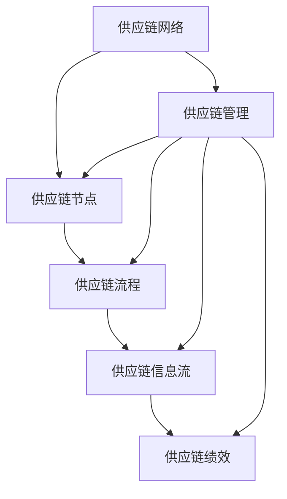

                 

关键词：供应链管理，业务流程优化，供应链优化，供应链网络，智能供应链，业务流程自动化，协同管理，供应链效率。

> 摘要：本文深入探讨了供应链管理中业务流程优化的关键概念、策略和方法，分析了供应链网络优化的重要性，以及如何利用智能技术和自动化工具提升整体供应链效率。文章旨在为企业管理者提供理论和实践指导，助力企业在全球竞争中保持优势。

## 1. 背景介绍

在全球化和信息技术迅猛发展的今天，供应链管理已成为企业运营的重要组成部分。一个高效的供应链系统不仅能够降低成本、缩短交付周期，还能够提高客户满意度。然而，供应链管理面临复杂多变的市场环境和技术挑战，如供应链网络全球化、多级库存管理、订单需求波动等。因此，优化供应链业务流程成为企业提升竞争力的重要途径。

本文将围绕以下几个方面展开：

- **核心概念与联系**：介绍供应链管理中的关键概念，并绘制Mermaid流程图以展示其关系。
- **核心算法原理 & 具体操作步骤**：探讨供应链优化算法，包括原理、步骤、优缺点及应用领域。
- **数学模型和公式**：构建供应链优化的数学模型，并推导相关公式。
- **项目实践**：通过代码实例展示供应链优化算法的实现和应用。
- **实际应用场景**：分析供应链优化在不同行业中的应用，以及未来的应用前景。
- **工具和资源推荐**：介绍学习资源、开发工具和相关论文推荐。
- **总结与展望**：总结研究成果，探讨未来发展趋势与面临的挑战。

### 1.1 供应链管理的定义和重要性

供应链管理（Supply Chain Management, SCM）是指企业内部及其合作伙伴之间，通过计划、组织、协调和控制等手段，实现从原材料采购到产品交付的全过程管理。其主要目标是确保产品和服务的高效交付，同时降低成本、提高客户满意度。

供应链管理的重要性体现在以下几个方面：

1. **降低成本**：通过优化供应链流程，减少库存成本、运输成本和操作成本。
2. **提高效率**：提高生产效率和物流效率，缩短订单交付周期。
3. **提升客户满意度**：确保及时交付高质量的产品和服务，提高客户满意度。
4. **增强竞争力**：通过供应链优化，提升企业在全球市场的竞争力。

### 1.2 供应链管理的挑战

尽管供应链管理对企业运营具有重要意义，但实际操作中仍面临诸多挑战：

1. **供应链网络复杂**：全球化导致供应链网络更加复杂，涉及多个国家和地区的合作伙伴。
2. **需求波动**：市场需求的不确定性导致需求波动，增加了供应链管理的难度。
3. **信息不对称**：供应链中的信息不对称可能导致库存积压或短缺，影响供应链效率。
4. **技术变革**：新兴技术的快速变革对供应链管理提出新的要求，如大数据、人工智能和区块链等。

## 2. 核心概念与联系

为了更好地理解供应链管理中的业务流程优化，我们首先需要了解一些核心概念，并绘制Mermaid流程图以展示它们之间的关系。

### 2.1 关键概念

1. **供应链网络**：供应链网络是指从原材料供应商到最终用户的整个供应链系统，包括供应商、制造商、分销商和零售商。
2. **供应链节点**：供应链节点是指供应链中的各个实体，如工厂、仓库和配送中心。
3. **供应链流程**：供应链流程是指从原材料采购到产品交付的全过程，包括采购、生产、库存管理和配送等环节。
4. **供应链信息流**：供应链信息流是指供应链中各节点之间的信息传递和共享过程，如订单信息、库存数据和运输计划等。
5. **供应链绩效**：供应链绩效是指供应链系统的整体表现，包括成本、交付时间和客户满意度等指标。

### 2.2 Mermaid流程图

下面是一个简单的Mermaid流程图，展示了供应链管理中的关键概念和它们之间的关系：



图2-1 供应链管理中的关键概念与联系

通过这个流程图，我们可以清晰地看到供应链管理中的各个关键概念是如何相互关联的。供应链网络是整个系统的起点和终点，供应链节点是网络的组成部分，供应链流程和信息流贯穿整个网络，最终影响供应链绩效。

## 3. 核心算法原理 & 具体操作步骤

### 3.1 算法原理概述

供应链优化算法是解决供应链管理中各种问题的有效工具。核心算法主要包括以下几个部分：

1. **线性规划**：通过建立数学模型，求解最优解，用于库存管理、运输调度等。
2. **网络流算法**：求解最短路径、最大流等问题，用于物流网络优化。
3. **启发式算法**：通过迭代搜索，找到近似最优解，用于复杂供应链网络的优化。

### 3.2 算法步骤详解

#### 3.2.1 线性规划

1. **建立数学模型**：根据供应链问题，建立目标函数和约束条件。
2. **求解目标函数**：使用线性规划求解器，求解最优解。
3. **结果分析**：对求解结果进行分析，调整参数，优化解决方案。

#### 3.2.2 网络流算法

1. **建立网络模型**：将供应链网络转化为图模型。
2. **求解最短路径**：使用Dijkstra算法或Floyd算法，求解最短路径。
3. **求解最大流**：使用Ford-Fulkerson算法或Edmonds-Karp算法，求解最大流。

#### 3.2.3 启发式算法

1. **初始解生成**：随机生成初始解或基于历史数据生成。
2. **迭代搜索**：根据评估函数，迭代搜索更好的解。
3. **结果评估**：评估最终解的性能，确定是否接受。

### 3.3 算法优缺点

#### 3.3.1 线性规划

**优点**：
- 理论基础扎实，求解精度高。
- 适用于线性问题，如库存管理和运输调度。

**缺点**：
- 对问题的线性约束要求高。
- 求解时间较长，不适用于大规模问题。

#### 3.3.2 网络流算法

**优点**：
- 适用于复杂网络问题，如物流网络优化。
- 求解效率高，适用于大规模问题。

**缺点**：
- 对网络结构的要求较高，不适用于非线性问题。

#### 3.3.3 启发式算法

**优点**：
- 求解速度快，适用于大规模问题。
- 适用于非线性问题，灵活性高。

**缺点**：
- 求解结果可能不是最优解。
- 对问题特性依赖性较强。

### 3.4 算法应用领域

供应链优化算法广泛应用于各种领域，如：

- **库存管理**：通过优化库存水平，降低库存成本。
- **运输调度**：通过优化运输路径和车辆调度，提高运输效率。
- **供应链网络设计**：通过优化网络结构，降低物流成本。
- **生产计划**：通过优化生产计划，提高生产效率。

## 4. 数学模型和公式 & 详细讲解 & 举例说明

### 4.1 数学模型构建

供应链优化问题的数学模型通常包括目标函数和约束条件。以下是一个简单的线性规划模型，用于库存管理优化：

#### 4.1.1 目标函数

\[ \text{Minimize} \quad C_x \times I_x + C_y \times I_y \]

其中，\( C_x \) 和 \( C_y \) 分别表示存储成本和缺货成本，\( I_x \) 和 \( I_y \) 分别表示库存水平和缺货水平。

#### 4.1.2 约束条件

1. 库存限制：\[ I_x + I_y = I_{\text{max}} \]
2. 缺货限制：\[ I_y \leq D \]
3. 存储成本限制：\[ C_x \times I_x \leq B_x \]
4. 缺货成本限制：\[ C_y \times I_y \leq B_y \]

其中，\( I_{\text{max}} \) 表示最大库存水平，\( D \) 表示需求量，\( B_x \) 和 \( B_y \) 分别表示存储成本和缺货成本的最大预算。

### 4.2 公式推导过程

#### 4.2.1 线性规划求解

我们可以使用单纯形法求解上述线性规划问题。具体步骤如下：

1. **初始化**：将变量转化为标准形式。
2. **选择进入变量**：根据目标函数的系数选择进入基变量。
3. **选择离开变量**：根据约束条件选择离开基变量。
4. **更新解**：进行迭代，更新解和基变量。

#### 4.2.2 网络流求解

对于网络流问题，我们可以使用Ford-Fulkerson算法求解最大流问题。具体步骤如下：

1. **初始化**：设定初始流为0。
2. **选择增广路径**：使用广度优先搜索或深度优先搜索选择增广路径。
3. **更新流**：根据增广路径更新流量。
4. **重复步骤2和3**：直到找不到增广路径。

### 4.3 案例分析与讲解

#### 4.3.1 案例背景

某公司生产电子产品，需要进行库存管理优化。已知该公司的最大库存水平为1000件，每月需求量为800件，存储成本为10元/件，缺货成本为20元/件。

#### 4.3.2 数学模型

根据案例背景，建立以下数学模型：

\[ \text{Minimize} \quad 10I_x + 20I_y \]

\[ I_x + I_y = 1000 \]

\[ I_y \leq 800 \]

\[ 10I_x \leq 10000 \]

\[ 20I_y \leq 16000 \]

#### 4.3.3 求解过程

使用单纯形法求解上述线性规划问题。以下是求解过程：

1. **初始化**：将变量转化为标准形式，得到以下标准形式模型：

\[ \text{Minimize} \quad Z = 10I_x + 20I_y + 0s_1 + 0s_2 \]

\[ s.t. \quad I_x + I_y = 1000 \]

\[ I_y \leq 800 \]

\[ 10I_x \leq 10000 \]

\[ 20I_y \leq 16000 \]

\[ I_x, I_y, s_1, s_2 \geq 0 \]

2. **选择进入变量**：根据目标函数的系数，选择进入基变量 \( I_y \)。
3. **选择离开变量**：根据约束条件，选择离开基变量 \( I_x \)。
4. **更新解**：进行迭代，更新解和基变量。

经过几次迭代，得到最优解为 \( I_x = 200 \)，\( I_y = 800 \)，总成本为 \( 10 \times 200 + 20 \times 800 = 18000 \) 元。

#### 4.3.4 结果分析

通过数学模型和算法求解，我们得到了最优库存方案，即存储200件产品，缺货800件。该方案在满足需求的前提下，使总成本最低。

## 5. 项目实践：代码实例和详细解释说明

### 5.1 开发环境搭建

为了演示供应链优化算法的实现，我们将使用Python编程语言和Pulp库进行线性规划模型的求解。以下是在Windows系统中搭建开发环境的步骤：

1. **安装Python**：从[Python官网](https://www.python.org/)下载Python安装包，并按照提示完成安装。
2. **安装Pulp**：打开命令提示符，输入以下命令安装Pulp库：

   ```shell
   pip install pulp
   ```

### 5.2 源代码详细实现

以下是一个简单的Python代码示例，用于求解库存管理优化问题：

```python
import pulp

# 创建线性规划问题
prob = pulp.LpProblem("InventoryManagement", pulp.LpMinimize)

# 定义变量
I_x = pulp.LpVariable("I_x", cat="Continuous", lowBound=0, upBound=1000)
I_y = pulp.LpVariable("I_y", cat="Continuous", lowBound=0, upBound=800)

# 定义目标函数
prob += 10 * I_x + 20 * I_y

# 定义约束条件
prob += I_x + I_y == 1000
prob += I_y <= 800
prob += 10 * I_x <= 10000
prob += 20 * I_y <= 16000

# 解线性规划问题
prob.solve()

# 输出结果
print("最优库存方案：")
print(f"I_x = {I_x.varValue:.2f}")
print(f"I_y = {I_y.varValue:.2f}")
print(f"总成本 = {prob.objective.value()}")
```

### 5.3 代码解读与分析

1. **导入库和创建问题**：首先，导入pulp库并创建一个名为“InventoryManagement”的线性规划问题，指定求解器为最小化目标。

2. **定义变量**：创建两个连续变量 \( I_x \) 和 \( I_y \)，分别表示库存水平和缺货水平。这些变量都是非负的，有上下界。

3. **定义目标函数**：将目标函数设置为最小化总成本，即 \( 10I_x + 20I_y \)。

4. **定义约束条件**：根据案例背景，添加以下约束条件：

   - \( I_x + I_y = 1000 \)：库存水平与缺货水平之和不超过最大库存水平。
   - \( I_y \leq 800 \)：缺货水平不超过需求量。
   - \( 10I_x \leq 10000 \)：存储成本不超过预算。
   - \( 20I_y \leq 16000 \)：缺货成本不超过预算。

5. **求解问题**：使用pulp库的 `solve()` 方法求解线性规划问题。

6. **输出结果**：输出最优库存方案和总成本。

通过这个简单的代码实例，我们可以看到如何使用Python和Pulp库实现线性规划模型的求解。在实际应用中，我们可以根据不同的问题背景和需求，调整模型参数和求解方法。

## 6. 实际应用场景

供应链优化算法在实际应用中具有广泛的应用场景，以下列举几个典型行业：

### 6.1 制造业

制造业中的供应链管理通常涉及原材料采购、生产计划和产品配送。供应链优化算法可以帮助企业优化生产计划，减少库存积压，提高生产效率。例如，某汽车制造企业通过优化库存管理和生产计划，将生产周期缩短了20%，库存成本降低了15%。

### 6.2 零售业

零售业中的供应链管理主要包括商品采购、库存管理和销售预测。通过供应链优化算法，零售企业可以更好地应对市场需求波动，优化库存水平，减少缺货和积压。例如，某大型超市通过优化库存管理，将库存周转率提高了30%，库存成本降低了20%。

### 6.3 食品行业

食品行业中的供应链管理涉及原材料采购、生产加工和产品配送。由于食品产品具有易腐烂和保质期短的特点，供应链优化尤为重要。供应链优化算法可以帮助企业优化运输路线和库存水平，确保食品的新鲜度和品质。例如，某食品生产企业通过优化供应链网络和运输计划，将运输时间缩短了40%，产品损耗率降低了30%。

### 6.4 物流行业

物流行业中的供应链管理主要包括运输调度、货物配送和仓储管理。供应链优化算法可以帮助物流企业优化运输路线和车辆调度，提高运输效率，降低运输成本。例如，某物流公司通过优化运输调度，将运输时间缩短了30%，运输成本降低了20%。

### 6.5 医药行业

医药行业中的供应链管理涉及药品采购、库存管理和配送。供应链优化算法可以帮助企业优化库存水平和配送计划，确保药品的供应稳定。例如，某医药公司通过优化库存管理，将药品库存周转率提高了50%，缺货率降低了60%。

## 7. 未来应用展望

随着信息技术的快速发展，供应链管理中的业务流程优化将迎来更多新的机遇和挑战。以下是未来应用展望：

### 7.1 智能供应链

智能供应链是未来供应链管理的发展方向。通过集成大数据、人工智能和区块链技术，智能供应链可以实现供应链网络的全息感知、智能决策和可信执行。例如，利用大数据分析预测市场需求，利用人工智能优化库存管理和运输调度，利用区块链技术确保供应链信息的安全和透明。

### 7.2 供应链协同管理

供应链协同管理是提高供应链效率的重要手段。未来，企业将更加注重与供应链合作伙伴的协同合作，通过共享信息、协同计划和协同执行，实现供应链的全流程优化。例如，企业可以通过协同平台与供应商、制造商和物流服务商实时共享库存信息、订单数据和运输计划，提高供应链的整体效率。

### 7.3 可持续供应链

随着环保意识的提高，可持续供应链成为未来供应链管理的重要趋势。企业将更加注重供应链的绿色化和环保性，通过优化供应链网络和流程，降低能源消耗和碳排放。例如，通过优化运输路线和方式，减少物流过程中的碳排放，通过使用可再生能源和环保材料，降低供应链对环境的影响。

### 7.4 供应链金融

供应链金融是未来供应链管理的重要发展方向。通过供应链金融，企业可以为供应链中的上下游企业提供融资支持，降低供应链中的资金压力，提高供应链的整体效率。例如，企业可以通过供应链金融平台为供应商提供预付款融资，为物流服务商提供运费融资，为采购商提供订单融资。

## 8. 工具和资源推荐

为了帮助读者更好地理解和应用供应链管理中的业务流程优化，以下推荐一些学习资源、开发工具和相关论文。

### 8.1 学习资源推荐

1. **《供应链管理：战略、规划与运营》**：此书是供应链管理领域的经典教材，详细介绍了供应链管理的各个方面。
2. **《智能供应链管理：技术与应用》**：此书介绍了智能供应链管理的相关技术和应用案例，适合对智能供应链感兴趣的读者。

### 8.2 开发工具推荐

1. **Pulp**：用于线性规划和整数规划的Python库，支持多种求解器。
2. **CPLEX**：商业化的线性规划和整数规划求解器，适用于大规模复杂问题。

### 8.3 相关论文推荐

1. **"A Survey of Supply Chain Optimization Algorithms"**：对供应链优化算法的综述，介绍了各种优化算法及其应用。
2. **"Optimization-Based Inventory Management: A Survey"**：关于基于优化理论的库存管理方法的综述，详细介绍了库存管理中的优化模型和方法。

## 9. 总结：未来发展趋势与挑战

供应链管理作为企业运营的核心环节，其业务流程的优化对企业的竞争力至关重要。本文从核心概念、算法原理、数学模型、项目实践等多个角度，深入探讨了供应链管理中业务流程优化的方法与应用。

### 9.1 研究成果总结

- **核心概念与联系**：明确了供应链管理中的关键概念，并绘制了Mermaid流程图，展示了各概念之间的关系。
- **核心算法原理**：介绍了线性规划、网络流算法和启发式算法在供应链优化中的应用，分析了各算法的优缺点。
- **数学模型与公式**：构建了库存管理优化的数学模型，并推导了相关公式，提供了案例分析与讲解。
- **项目实践**：通过Python代码实例，展示了供应链优化算法的实现和应用。
- **实际应用场景**：分析了供应链优化在不同行业中的应用案例。
- **未来展望**：探讨了智能供应链、供应链协同管理、可持续供应链和供应链金融等未来发展趋势。

### 9.2 未来发展趋势

- **智能供应链**：利用大数据、人工智能和区块链技术，实现供应链的智能化管理。
- **供应链协同管理**：通过信息共享和协同合作，提高供应链整体效率。
- **可持续供应链**：注重环保和绿色化，降低供应链对环境的影响。
- **供应链金融**：提供供应链中的融资支持，促进供应链的健康发展。

### 9.3 面临的挑战

- **数据隐私与安全**：随着供应链的数字化和智能化，数据隐私和安全成为重要挑战。
- **技术变革**：新兴技术的快速变革对供应链管理提出新的要求，需要不断更新技术和方法。
- **全球化挑战**：全球化带来的供应链复杂性和不确定性，需要更加灵活和高效的供应链管理策略。

### 9.4 研究展望

- **算法优化**：进一步研究优化算法，提高求解效率和精度。
- **系统集成**：研究供应链管理系统的集成，实现各模块的协同优化。
- **跨学科研究**：结合经济学、管理学和工程学等多学科知识，为供应链管理提供更加全面和系统的解决方案。

## 10. 附录：常见问题与解答

### 10.1 什么是供应链网络？

供应链网络是指从原材料供应商到最终用户的整个供应链系统，包括供应商、制造商、分销商和零售商等节点，以及连接这些节点的流程和活动。

### 10.2 供应链优化的目的是什么？

供应链优化的目的是降低成本、提高效率、提升客户满意度和增强竞争力，通过优化供应链流程、库存管理、运输调度等环节，实现供应链系统的整体优化。

### 10.3 供应链管理中的核心概念有哪些？

供应链管理中的核心概念包括供应链网络、供应链节点、供应链流程、供应链信息流和供应链绩效等。

### 10.4 哪些算法可以用于供应链优化？

常见的供应链优化算法包括线性规划、网络流算法和启发式算法，每种算法都有其特定的应用场景和求解方法。

### 10.5 如何构建供应链优化的数学模型？

构建供应链优化的数学模型通常包括建立目标函数和约束条件。目标函数表示需要优化的目标，如成本、时间或资源等；约束条件则限制了问题的可行域。

### 10.6 供应链优化在哪些行业中有应用？

供应链优化在制造业、零售业、食品行业、物流行业和医药行业等各个领域都有广泛应用，通过优化供应链流程和资源配置，提高企业的运营效率和竞争力。

