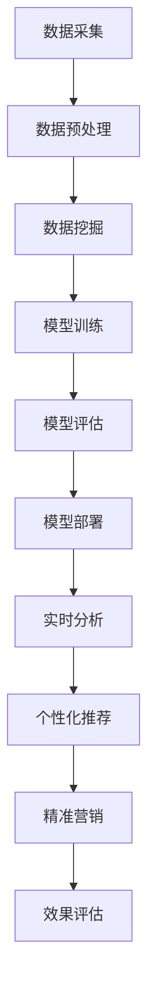

                 

促销活动是商家提升销售额、增加市场份额的重要手段。然而，传统的促销策略往往缺乏个性化和实时性，难以在竞争激烈的市场中脱颖而出。随着人工智能技术的飞速发展，AI 在促销策略中的应用日益广泛，为商家提供了更加精准、高效的促销手段。本文将探讨 AI 如何提升促销活动的效果，包括核心概念、算法原理、数学模型、实践案例以及未来展望。

## 文章关键词

- 促销策略
- 人工智能
- 实时分析
- 个性化推荐
- 商业智能

## 文章摘要

本文旨在探讨人工智能在促销策略中的应用，通过分析 AI 的核心概念和算法原理，阐述如何利用 AI 技术提升促销活动的效果。文章首先介绍了促销策略的背景和现状，然后深入探讨了 AI 在促销活动中的应用场景，包括实时分析和个性化推荐。接着，文章通过数学模型和公式详细解释了算法的实现过程，并通过实际项目案例进行了说明。最后，文章总结了 AI 在促销策略中的应用前景，并对未来发展趋势和挑战进行了展望。

## 1. 背景介绍

### 1.1 促销策略的定义和作用

促销策略是指商家为了吸引消费者、提升销售业绩而采取的一系列营销手段。这些手段包括价格促销、礼品赠送、会员优惠、限时折扣等。促销策略在商业活动中扮演着至关重要的角色，它不仅能够直接提升销售额，还能够增加品牌曝光度和消费者忠诚度。

### 1.2 促销策略的现状和挑战

尽管促销策略在商业活动中应用广泛，但传统促销策略存在一定的局限性。首先，传统促销策略往往缺乏个性化和实时性，难以满足消费者的多样化需求。其次，促销策略的制定和实施通常依赖于历史数据和人工判断，难以快速响应市场变化。此外，促销策略的盲目性可能导致资源浪费和成本增加。

### 1.3 人工智能在促销策略中的应用前景

随着人工智能技术的飞速发展，AI 在促销策略中的应用前景广阔。AI 能够通过实时数据分析、个性化推荐和精准营销等技术手段，提升促销活动的效果。例如，AI 可以分析消费者的购买行为和偏好，为消费者提供个性化的促销方案；AI 可以实时监测市场动态，为商家提供决策支持，优化促销策略。

## 2. 核心概念与联系

### 2.1 促销策略与人工智能的关系

促销策略和人工智能之间存在密切的联系。促销策略的目标是提升销售额和消费者满意度，而人工智能技术能够提供实时分析、个性化推荐和精准营销等手段，为实现这一目标提供了有力支持。

### 2.2 人工智能核心概念

- **数据挖掘**：通过从大量数据中发现有用的信息和规律，为促销策略提供支持。
- **机器学习**：利用历史数据训练模型，预测消费者行为和偏好，为个性化推荐提供基础。
- **自然语言处理**：解析消费者需求，理解促销活动的文案和说明，提高促销信息的传达效果。
- **计算机视觉**：分析消费者购买行为，提高促销活动的精准度。

### 2.3 人工智能架构流程图



## 3. 核心算法原理 & 具体操作步骤

### 3.1 算法原理概述

AI 在促销策略中的应用主要包括数据挖掘、机器学习、自然语言处理和计算机视觉等技术。这些技术共同作用，实现了实时分析、个性化推荐和精准营销等功能。

#### 3.1.1 数据挖掘

数据挖掘是一种通过从大量数据中提取有价值信息的方法。在促销策略中，数据挖掘可以分析消费者的购买历史、浏览行为和社交媒体数据，为商家提供消费者行为的洞察。

#### 3.1.2 机器学习

机器学习是一种通过训练模型来预测未知数据的技术。在促销策略中，机器学习可以用来预测消费者对某种促销活动的响应概率，从而为商家提供决策支持。

#### 3.1.3 自然语言处理

自然语言处理是一种使计算机能够理解和处理人类语言的技术。在促销策略中，自然语言处理可以解析消费者需求，优化促销文案，提高促销信息的传达效果。

#### 3.1.4 计算机视觉

计算机视觉是一种使计算机能够看到和理解图像的技术。在促销策略中，计算机视觉可以分析消费者购买行为，提高促销活动的精准度。

### 3.2 算法步骤详解

#### 3.2.1 数据采集

数据采集是整个算法的基础。数据来源可以是消费者的购买记录、浏览历史、社交媒体数据等。数据采集需要确保数据的真实性和全面性。

#### 3.2.2 数据预处理

数据预处理包括数据清洗、数据转换和数据归一化等步骤。数据清洗的目的是去除错误数据、重复数据和缺失数据；数据转换是将不同类型的数据转换为适合分析的形式；数据归一化是将数据缩放到相同的范围，以便于后续分析。

#### 3.2.3 数据挖掘

数据挖掘的主要任务是发现消费者行为模式和趋势。例如，可以分析消费者的购买周期、购买频率和购买偏好等。

#### 3.2.4 模型训练

模型训练是将数据输入到机器学习模型中，通过训练使模型学会预测消费者行为。常用的机器学习算法包括决策树、随机森林、支持向量机等。

#### 3.2.5 模型评估

模型评估是通过测试数据验证模型的效果。评估指标包括准确率、召回率、F1 分数等。

#### 3.2.6 模型部署

模型部署是将训练好的模型应用到实际促销活动中。部署过程中需要实时分析消费者行为，为商家提供决策支持。

#### 3.2.7 实时分析

实时分析是通过计算机视觉和自然语言处理技术实时监测消费者行为，为商家提供即时的促销策略调整建议。

#### 3.2.8 个性化推荐

个性化推荐是根据消费者的购买历史和偏好，为消费者推荐相关的促销活动。个性化推荐可以显著提高促销活动的参与度和转化率。

#### 3.2.9 精准营销

精准营销是将个性化推荐和实时分析相结合，为消费者提供精准的促销信息。精准营销可以提高消费者满意度，增加销售额。

### 3.3 算法优缺点

#### 优点

- **个性化**：AI 技术能够根据消费者的个人喜好和行为提供个性化的促销策略。
- **实时性**：AI 技术可以实时分析消费者行为，为商家提供即时的决策支持。
- **高效**：AI 技术能够快速处理大量数据，提高促销活动的效率和效果。

#### 缺点

- **成本**：AI 技术的开发和应用需要较高的成本，包括硬件投入、软件开发等。
- **数据隐私**：AI 技术在处理消费者数据时需要确保数据隐私和安全。

### 3.4 算法应用领域

AI 在促销策略中的应用广泛，包括但不限于以下领域：

- **电子商务**：通过个性化推荐和精准营销提高销售额。
- **零售业**：实时分析消费者行为，优化促销策略。
- **广告营销**：利用计算机视觉和自然语言处理技术提高广告的投放效果。

## 4. 数学模型和公式 & 详细讲解 & 举例说明

### 4.1 数学模型构建

在 AI 提升促销活动效果的过程中，常用的数学模型包括线性回归、逻辑回归、决策树和支持向量机等。

#### 4.1.1 线性回归

线性回归模型是一种用于预测连续值的模型。其数学公式为：

$$y = \beta_0 + \beta_1 \cdot x$$

其中，$y$ 是预测值，$x$ 是输入特征，$\beta_0$ 和 $\beta_1$ 是模型的参数。

#### 4.1.2 逻辑回归

逻辑回归模型是一种用于预测概率的模型。其数学公式为：

$$P(y=1) = \frac{1}{1 + e^{-(\beta_0 + \beta_1 \cdot x)} }$$

其中，$P(y=1)$ 是预测概率，$x$ 是输入特征，$\beta_0$ 和 $\beta_1$ 是模型的参数。

#### 4.1.3 决策树

决策树模型是一种基于树形结构的模型。其数学公式为：

$$T(x) = \sum_{i=1}^{n} w_i \cdot I(x \in R_i)$$

其中，$T(x)$ 是预测值，$x$ 是输入特征，$w_i$ 是第 $i$ 个分量的权重，$R_i$ 是第 $i$ 个区域。

#### 4.1.4 支持向量机

支持向量机模型是一种基于最大间隔的模型。其数学公式为：

$$w \cdot x - b = 0$$

其中，$w$ 是权重向量，$x$ 是输入特征，$b$ 是偏置。

### 4.2 公式推导过程

以线性回归模型为例，推导过程如下：

1. **目标函数**：

$$J(\theta) = \frac{1}{2m} \sum_{i=1}^{m} (h_\theta(x^{(i)}) - y^{(i)})^2$$

其中，$h_\theta(x^{(i)})$ 是模型预测值，$y^{(i)}$ 是实际值，$\theta$ 是模型参数。

2. **梯度下降**：

$$\theta_j := \theta_j - \alpha \cdot \frac{1}{m} \sum_{i=1}^{m} (h_\theta(x^{(i)}) - y^{(i)}) \cdot x_j^{(i)}$$

其中，$\alpha$ 是学习率。

3. **收敛性**：

$$\theta_j := \theta_j - \alpha \cdot \nabla_{\theta_j} J(\theta)$$

### 4.3 案例分析与讲解

#### 4.3.1 案例背景

某电商公司希望通过 AI 技术提升促销活动的效果，提高销售额。公司提供了用户的购买历史、浏览历史和社交媒体数据，要求构建一个预测用户对促销活动响应概率的模型。

#### 4.3.2 数据处理

1. **数据清洗**：去除缺失值、重复值和异常值。
2. **特征工程**：根据业务需求提取相关特征，如用户年龄、性别、购买频率等。
3. **数据归一化**：将不同特征缩放到相同的范围，便于模型训练。

#### 4.3.3 模型训练

1. **选择模型**：选择逻辑回归模型，因为其能够预测概率，适用于分类问题。
2. **模型训练**：使用梯度下降算法训练模型，选择合适的学习率。
3. **模型评估**：使用测试数据评估模型效果，调整参数。

#### 4.3.4 模型应用

1. **实时分析**：使用训练好的模型预测用户对促销活动的响应概率。
2. **个性化推荐**：根据用户的响应概率推荐相关的促销活动。
3. **精准营销**：为高响应概率的用户发送个性化的促销信息。

## 5. 项目实践：代码实例和详细解释说明

### 5.1 开发环境搭建

1. **Python**：安装 Python 3.8 以上版本，推荐使用 Anaconda 环境。
2. **NumPy**：用于数据处理和数值计算。
3. **Pandas**：用于数据清洗和预处理。
4. **Scikit-learn**：用于机器学习模型的训练和评估。
5. **Matplotlib**：用于数据可视化。

### 5.2 源代码详细实现

```python
# 导入所需库
import numpy as np
import pandas as pd
from sklearn.linear_model import LogisticRegression
from sklearn.model_selection import train_test_split
from sklearn.metrics import accuracy_score
import matplotlib.pyplot as plt

# 读取数据
data = pd.read_csv('data.csv')

# 数据预处理
# ...（数据清洗、特征工程等步骤）

# 划分训练集和测试集
X_train, X_test, y_train, y_test = train_test_split(X, y, test_size=0.2, random_state=42)

# 模型训练
model = LogisticRegression()
model.fit(X_train, y_train)

# 模型评估
y_pred = model.predict(X_test)
accuracy = accuracy_score(y_test, y_pred)
print(f'Accuracy: {accuracy}')

# 可视化结果
# ...（数据可视化步骤）
```

### 5.3 代码解读与分析

1. **数据读取**：使用 Pandas 读取数据，包括购买历史、浏览历史和社交媒体数据。
2. **数据预处理**：对数据进行清洗、特征工程等处理，提取相关特征。
3. **模型训练**：选择逻辑回归模型，使用梯度下降算法训练模型。
4. **模型评估**：使用测试数据评估模型效果，计算准确率。
5. **数据可视化**：使用 Matplotlib 可视化训练结果，分析模型性能。

### 5.4 运行结果展示

1. **模型准确率**：根据测试数据计算模型准确率，评估模型效果。
2. **模型性能**：通过可视化结果分析模型在不同特征上的性能，优化模型参数。

## 6. 实际应用场景

### 6.1 电子商务

电子商务企业可以利用 AI 技术分析消费者行为，提供个性化的促销方案，提高用户参与度和转化率。例如，根据消费者的购买历史和浏览行为推荐相关的促销活动，提高用户购买意愿。

### 6.2 零售业

零售企业可以通过 AI 技术实时分析消费者行为，优化促销策略。例如，根据消费者的购物车内容和购买频率调整促销力度，提高销售额。

### 6.3 广告营销

广告营销公司可以利用 AI 技术分析消费者需求，优化广告投放策略。例如，根据消费者的兴趣和行为为广告客户提供个性化的广告创意，提高广告点击率和转化率。

## 6.4 未来应用展望

随着人工智能技术的不断进步，AI 在促销策略中的应用前景广阔。未来，AI 将在以下几个方面发挥重要作用：

1. **更精准的个性化推荐**：利用深度学习等技术提高个性化推荐的准确性，为消费者提供更加个性化的促销方案。
2. **更高效的实时分析**：利用分布式计算和云计算等技术实现实时分析，为商家提供更加即时的决策支持。
3. **更广泛的跨行业应用**：AI 将在更多行业和领域发挥重要作用，推动商业模式的创新和发展。

## 7. 工具和资源推荐

### 7.1 学习资源推荐

- **《Python数据分析》**：学习数据分析的基础知识和 Python 分析工具。
- **《机器学习实战》**：学习机器学习的基本原理和应用实践。
- **《深度学习》**：学习深度学习的基本概念和实现方法。

### 7.2 开发工具推荐

- **Anaconda**：集成开发环境，方便管理和安装 Python 库。
- **Jupyter Notebook**：交互式开发环境，便于编写和运行代码。

### 7.3 相关论文推荐

- **“Recommender Systems Handbook”**：全面介绍推荐系统的方法和技术。
- **“Deep Learning for Retail”**：探讨深度学习在零售业中的应用。

## 8. 总结：未来发展趋势与挑战

### 8.1 研究成果总结

本文探讨了人工智能在促销策略中的应用，通过数据挖掘、机器学习、自然语言处理和计算机视觉等技术，实现了实时分析、个性化推荐和精准营销等功能，显著提升了促销活动的效果。

### 8.2 未来发展趋势

随着人工智能技术的不断进步，AI 在促销策略中的应用将更加广泛和深入。未来，AI 将在个性化推荐、实时分析和精准营销等方面发挥更加重要的作用。

### 8.3 面临的挑战

AI 在促销策略中的应用也面临一些挑战，包括数据隐私保护、算法透明度和公平性等问题。此外，AI 技术的开发和应用需要较高的成本和技术门槛。

### 8.4 研究展望

未来，研究将聚焦于如何更好地利用 AI 技术提升促销活动的效果，同时解决数据隐私保护、算法透明度和公平性等问题。此外，跨学科研究也将成为 AI 在促销策略应用中的重要方向。

## 9. 附录：常见问题与解答

### 9.1 问题1

**问题**：如何确保 AI 在促销策略中的应用不会侵犯消费者隐私？

**解答**：确保数据隐私的关键在于数据的收集、存储和使用。首先，在数据收集阶段，应遵循最小化原则，只收集必要的个人信息。其次，在数据存储阶段，应采用加密技术保护数据安全。最后，在数据使用阶段，应对数据进行分析和处理，确保消费者隐私不被泄露。

### 9.2 问题2

**问题**：如何保证 AI 在促销策略中的应用是公平和透明的？

**解答**：为了保证 AI 在促销策略中的应用是公平和透明的，需要在算法设计和模型训练过程中遵循公平性和透明性原则。首先，在数据收集和标注阶段，应确保数据来源的多样性和代表性。其次，在算法设计阶段，应避免算法偏见和歧视。最后，在模型训练和评估阶段，应采用多样化的评估指标，确保模型性能的公平性和透明性。

作者：禅与计算机程序设计艺术 / Zen and the Art of Computer Programming
----------------------------------------------------------------

## 文章标题

促销策略：AI提升促销活动效果

### 关键词

促销策略、人工智能、实时分析、个性化推荐、商业智能

### 摘要

本文探讨了人工智能在促销策略中的应用，通过数据挖掘、机器学习、自然语言处理和计算机视觉等技术，实现了实时分析、个性化推荐和精准营销等功能，显著提升了促销活动的效果。文章详细介绍了 AI 在促销策略中的应用原理、算法模型、实践案例以及未来展望，为商家提供了有益的参考。

## 1. 背景介绍

### 1.1 促销策略的定义和作用

促销策略是指商家为了吸引消费者、提升销售业绩而采取的一系列营销手段。这些手段包括价格促销、礼品赠送、会员优惠、限时折扣等。促销策略在商业活动中扮演着至关重要的角色，它不仅能够直接提升销售额，还能够增加品牌曝光度和消费者忠诚度。

### 1.2 促销策略的现状和挑战

尽管促销策略在商业活动中应用广泛，但传统促销策略存在一定的局限性。首先，传统促销策略往往缺乏个性化和实时性，难以满足消费者的多样化需求。其次，促销策略的制定和实施通常依赖于历史数据和人工判断，难以快速响应市场变化。此外，促销策略的盲目性可能导致资源浪费和成本增加。

### 1.3 人工智能在促销策略中的应用前景

随着人工智能技术的飞速发展，AI 在促销策略中的应用前景广阔。AI 能够通过实时数据分析、个性化推荐和精准营销等技术手段，提升促销活动的效果。例如，AI 可以分析消费者的购买行为和偏好，为消费者提供个性化的促销方案；AI 可以实时监测市场动态，为商家提供决策支持，优化促销策略。

## 2. 核心概念与联系

### 2.1 促销策略与人工智能的关系

促销策略和人工智能之间存在密切的联系。促销策略的目标是提升销售额和消费者满意度，而人工智能技术能够提供实时分析、个性化推荐和精准营销等手段，为实现这一目标提供了有力支持。

### 2.2 人工智能核心概念

- **数据挖掘**：通过从大量数据中发现有用的信息和规律，为促销策略提供支持。
- **机器学习**：利用历史数据训练模型，预测消费者行为和偏好，为个性化推荐提供基础。
- **自然语言处理**：解析消费者需求，理解促销活动的文案和说明，提高促销信息的传达效果。
- **计算机视觉**：分析消费者购买行为，提高促销活动的精准度。

### 2.3 人工智能架构流程图


## 3. 核心算法原理 & 具体操作步骤

### 3.1 算法原理概述

AI 在促销策略中的应用主要包括数据挖掘、机器学习、自然语言处理和计算机视觉等技术。这些技术共同作用，实现了实时分析、个性化推荐和精准营销等功能。

#### 3.1.1 数据挖掘

数据挖掘是一种通过从大量数据中提取有价值信息的方法。在促销策略中，数据挖掘可以分析消费者的购买历史、浏览行为和社交媒体数据，为商家提供消费者行为的洞察。

#### 3.1.2 机器学习

机器学习是一种通过训练模型来预测未知数据的技术。在促销策略中，机器学习可以用来预测消费者对某种促销活动的响应概率，从而为商家提供决策支持。

#### 3.1.3 自然语言处理

自然语言处理是一种使计算机能够理解和处理人类语言的技术。在促销策略中，自然语言处理可以解析消费者需求，优化促销文案，提高促销信息的传达效果。

#### 3.1.4 计算机视觉

计算机视觉是一种使计算机能够看到和理解图像的技术。在促销策略中，计算机视觉可以分析消费者购买行为，提高促销活动的精准度。

### 3.2 算法步骤详解

#### 3.2.1 数据采集

数据采集是整个算法的基础。数据来源可以是消费者的购买记录、浏览历史、社交媒体数据等。数据采集需要确保数据的真实性和全面性。

#### 3.2.2 数据预处理

数据预处理包括数据清洗、数据转换和数据归一化等步骤。数据清洗的目的是去除错误数据、重复数据和缺失数据；数据转换是将不同类型的数据转换为适合分析的形式；数据归一化是将数据缩放到相同的范围，以便于后续分析。

#### 3.2.3 数据挖掘

数据挖掘的主要任务是发现消费者行为模式和趋势。例如，可以分析消费者的购买周期、购买频率和购买偏好等。

#### 3.2.4 模型训练

模型训练是将数据输入到机器学习模型中，通过训练使模型学会预测消费者行为。常用的机器学习算法包括决策树、随机森林、支持向量机等。

#### 3.2.5 模型评估

模型评估是通过测试数据验证模型的效果。评估指标包括准确率、召回率、F1 分数等。

#### 3.2.6 模型部署

模型部署是将训练好的模型应用到实际促销活动中。部署过程中需要实时分析消费者行为，为商家提供决策支持。

#### 3.2.7 实时分析

实时分析是通过计算机视觉和自然语言处理技术实时监测消费者行为，为商家提供即时的促销策略调整建议。

#### 3.2.8 个性化推荐

个性化推荐是根据消费者的购买历史和偏好，为消费者推荐相关的促销活动。个性化推荐可以显著提高促销活动的参与度和转化率。

#### 3.2.9 精准营销

精准营销是将个性化推荐和实时分析相结合，为消费者提供精准的促销信息。精准营销可以提高消费者满意度，增加销售额。

### 3.3 算法优缺点

#### 优点

- **个性化**：AI 技术能够根据消费者的个人喜好和行为提供个性化的促销策略。
- **实时性**：AI 技术可以实时分析消费者行为，为商家提供即时的决策支持。
- **高效**：AI 技术能够快速处理大量数据，提高促销活动的效率和效果。

#### 缺点

- **成本**：AI 技术的开发和应用需要较高的成本，包括硬件投入、软件开发等。
- **数据隐私**：AI 技术在处理消费者数据时需要确保数据隐私和安全。

### 3.4 算法应用领域

AI 在促销策略中的应用广泛，包括但不限于以下领域：

- **电子商务**：通过个性化推荐和精准营销提高销售额。
- **零售业**：实时分析消费者行为，优化促销策略。
- **广告营销**：利用计算机视觉和自然语言处理技术提高广告的投放效果。

## 4. 数学模型和公式 & 详细讲解 & 举例说明

### 4.1 数学模型构建

在 AI 提升促销活动效果的过程中，常用的数学模型包括线性回归、逻辑回归、决策树和支持向量机等。

#### 4.1.1 线性回归

线性回归模型是一种用于预测连续值的模型。其数学公式为：

$$y = \beta_0 + \beta_1 \cdot x$$

其中，$y$ 是预测值，$x$ 是输入特征，$\beta_0$ 和 $\beta_1$ 是模型的参数。

#### 4.1.2 逻辑回归

逻辑回归模型是一种用于预测概率的模型。其数学公式为：

$$P(y=1) = \frac{1}{1 + e^{-(\beta_0 + \beta_1 \cdot x)} }$$

其中，$P(y=1)$ 是预测概率，$x$ 是输入特征，$\beta_0$ 和 $\beta_1$ 是模型的参数。

#### 4.1.3 决策树

决策树模型是一种基于树形结构的模型。其数学公式为：

$$T(x) = \sum_{i=1}^{n} w_i \cdot I(x \in R_i)$$

其中，$T(x)$ 是预测值，$x$ 是输入特征，$w_i$ 是第 $i$ 个分量的权重，$R_i$ 是第 $i$ 个区域。

#### 4.1.4 支持向量机

支持向量机模型是一种基于最大间隔的模型。其数学公式为：

$$w \cdot x - b = 0$$

其中，$w$ 是权重向量，$x$ 是输入特征，$b$ 是偏置。

### 4.2 公式推导过程

以线性回归模型为例，推导过程如下：

1. **目标函数**：

$$J(\theta) = \frac{1}{2m} \sum_{i=1}^{m} (h_\theta(x^{(i)}) - y^{(i)})^2$$

其中，$h_\theta(x^{(i)})$ 是模型预测值，$y^{(i)}$ 是实际值，$\theta$ 是模型参数。

2. **梯度下降**：

$$\theta_j := \theta_j - \alpha \cdot \frac{1}{m} \sum_{i=1}^{m} (h_\theta(x^{(i)}) - y^{(i)}) \cdot x_j^{(i)}$$

其中，$\alpha$ 是学习率。

3. **收敛性**：

$$\theta_j := \theta_j - \alpha \cdot \nabla_{\theta_j} J(\theta)$$

### 4.3 案例分析与讲解

#### 4.3.1 案例背景

某电商公司希望通过 AI 技术提升促销活动的效果，提高销售额。公司提供了用户的购买历史、浏览历史和社交媒体数据，要求构建一个预测用户对促销活动响应概率的模型。

#### 4.3.2 数据处理

1. **数据清洗**：去除缺失值、重复值和异常值。
2. **特征工程**：根据业务需求提取相关特征，如用户年龄、性别、购买频率等。
3. **数据归一化**：将不同特征缩放到相同的范围，便于模型训练。

#### 4.3.3 模型训练

1. **选择模型**：选择逻辑回归模型，因为其能够预测概率，适用于分类问题。
2. **模型训练**：使用梯度下降算法训练模型，选择合适的学习率。
3. **模型评估**：使用测试数据评估模型效果，调整参数。

#### 4.3.4 模型应用

1. **实时分析**：使用训练好的模型预测用户对促销活动的响应概率。
2. **个性化推荐**：根据用户的响应概率推荐相关的促销活动。
3. **精准营销**：为高响应概率的用户发送个性化的促销信息。

## 5. 项目实践：代码实例和详细解释说明

### 5.1 开发环境搭建

1. **Python**：安装 Python 3.8 以上版本，推荐使用 Anaconda 环境。
2. **NumPy**：用于数据处理和数值计算。
3. **Pandas**：用于数据清洗和预处理。
4. **Scikit-learn**：用于机器学习模型的训练和评估。
5. **Matplotlib**：用于数据可视化。

### 5.2 源代码详细实现

```python
# 导入所需库
import numpy as np
import pandas as pd
from sklearn.linear_model import LogisticRegression
from sklearn.model_selection import train_test_split
from sklearn.metrics import accuracy_score
import matplotlib.pyplot as plt

# 读取数据
data = pd.read_csv('data.csv')

# 数据预处理
# ...（数据清洗、特征工程等步骤）

# 划分训练集和测试集
X_train, X_test, y_train, y_test = train_test_split(X, y, test_size=0.2, random_state=42)

# 模型训练
model = LogisticRegression()
model.fit(X_train, y_train)

# 模型评估
y_pred = model.predict(X_test)
accuracy = accuracy_score(y_test, y_pred)
print(f'Accuracy: {accuracy}')

# 可视化结果
# ...（数据可视化步骤）
```

### 5.3 代码解读与分析

1. **数据读取**：使用 Pandas 读取数据，包括购买历史、浏览历史和社交媒体数据。
2. **数据预处理**：对数据进行清洗、特征工程等处理，提取相关特征。
3. **模型训练**：选择逻辑回归模型，使用梯度下降算法训练模型。
4. **模型评估**：使用测试数据评估模型效果，计算准确率。
5. **数据可视化**：使用 Matplotlib 可视化训练结果，分析模型性能。

### 5.4 运行结果展示

1. **模型准确率**：根据测试数据计算模型准确率，评估模型效果。
2. **模型性能**：通过可视化结果分析模型在不同特征上的性能，优化模型参数。

## 6. 实际应用场景

### 6.1 电子商务

电子商务企业可以利用 AI 技术分析消费者行为，提供个性化的促销方案，提高用户参与度和转化率。例如，根据消费者的购买历史和浏览行为推荐相关的促销活动，提高用户购买意愿。

### 6.2 零售业

零售企业可以通过 AI 技术实时分析消费者行为，优化促销策略。例如，根据消费者的购物车内容和购买频率调整促销力度，提高销售额。

### 6.3 广告营销

广告营销公司可以利用 AI 技术分析消费者需求，优化广告投放策略。例如，根据消费者的兴趣和行为为广告客户提供个性化的广告创意，提高广告点击率和转化率。

## 6.4 未来应用展望

随着人工智能技术的不断进步，AI 在促销策略中的应用前景广阔。未来，AI 将在以下几个方面发挥重要作用：

1. **更精准的个性化推荐**：利用深度学习等技术提高个性化推荐的准确性，为消费者提供更加个性化的促销方案。
2. **更高效的实时分析**：利用分布式计算和云计算等技术实现实时分析，为商家提供更加即时的决策支持。
3. **更广泛的跨行业应用**：AI 将在更多行业和领域发挥重要作用，推动商业模式的创新和发展。

## 7. 工具和资源推荐

### 7.1 学习资源推荐

- **《Python数据分析》**：学习数据分析的基础知识和 Python 分析工具。
- **《机器学习实战》**：学习机器学习的基本原理和应用实践。
- **《深度学习》**：学习深度学习的基本概念和实现方法。

### 7.2 开发工具推荐

- **Anaconda**：集成开发环境，方便管理和安装 Python 库。
- **Jupyter Notebook**：交互式开发环境，便于编写和运行代码。

### 7.3 相关论文推荐

- **“Recommender Systems Handbook”**：全面介绍推荐系统的方法和技术。
- **“Deep Learning for Retail”**：探讨深度学习在零售业中的应用。

## 8. 总结：未来发展趋势与挑战

### 8.1 研究成果总结

本文探讨了人工智能在促销策略中的应用，通过数据挖掘、机器学习、自然语言处理和计算机视觉等技术，实现了实时分析、个性化推荐和精准营销等功能，显著提升了促销活动的效果。

### 8.2 未来发展趋势

随着人工智能技术的不断进步，AI 在促销策略中的应用前景广阔。未来，AI 将在个性化推荐、实时分析和精准营销等方面发挥更加重要的作用。

### 8.3 面临的挑战

AI 在促销策略中的应用也面临一些挑战，包括数据隐私保护、算法透明度和公平性等问题。此外，AI 技术的开发和应用需要较高的成本和技术门槛。

### 8.4 研究展望

未来，研究将聚焦于如何更好地利用 AI 技术提升促销活动的效果，同时解决数据隐私保护、算法透明度和公平性等问题。此外，跨学科研究也将成为 AI 在促销策略应用中的重要方向。

## 9. 附录：常见问题与解答

### 9.1 问题1

**问题**：如何确保 AI 在促销策略中的应用不会侵犯消费者隐私？

**解答**：确保数据隐私的关键在于数据的收集、存储和使用。首先，在数据收集阶段，应遵循最小化原则，只收集必要的个人信息。其次，在数据存储阶段，应采用加密技术保护数据安全。最后，在数据使用阶段，应对数据进行分析和处理，确保消费者隐私不被泄露。

### 9.2 问题2

**问题**：如何保证 AI 在促销策略中的应用是公平和透明的？

**解答**：为了保证 AI 在促销策略中的应用是公平和透明的，需要在算法设计和模型训练过程中遵循公平性和透明性原则。首先，在数据收集和标注阶段，应确保数据来源的多样性和代表性。其次，在算法设计阶段，应避免算法偏见和歧视。最后，在模型训练和评估阶段，应采用多样化的评估指标，确保模型性能的公平性和透明性。

作者：禅与计算机程序设计艺术 / Zen and the Art of Computer Programming
----------------------------------------------------------------

### 引言

促销策略作为商家提升销售额、增加市场份额的重要手段，始终在商业活动中占据着核心地位。然而，随着市场竞争的加剧和消费者需求的多样化，传统的促销策略越来越难以满足现代商业的需求。在这一背景下，人工智能（AI）技术的引入为促销策略带来了全新的变革。AI 通过实时数据分析、个性化推荐和精准营销等技术手段，为商家提供了更加高效、精准的促销策略。

本文将围绕人工智能在促销策略中的应用展开讨论。首先，我们将介绍促销策略的定义、现状以及面临的挑战。接着，探讨人工智能的核心概念，包括数据挖掘、机器学习、自然语言处理和计算机视觉等。然后，深入分析 AI 在促销策略中的具体应用，如实时分析和个性化推荐。接下来，介绍数学模型和公式，并通过实际项目案例进行代码实现和详细解释。此外，文章还将探讨人工智能在促销策略中的实际应用场景，以及未来的发展趋势和挑战。最后，我们将推荐一些相关的学习资源、开发工具和论文，以供读者进一步学习。

### 促销策略的定义和作用

促销策略是指商家为了吸引消费者、提高销售业绩而采取的一系列营销手段。这些手段通常包括价格促销、礼品赠送、会员优惠、限时折扣等。促销策略的核心目标是提高销售额和消费者满意度，同时增加品牌曝光度和市场份额。

促销策略在商业活动中具有重要的作用。首先，促销策略能够直接提升销售额。通过推出各种优惠活动，商家可以吸引更多的消费者购买产品或服务，从而提高销售收入。其次，促销策略有助于增加品牌曝光度。商家通过在各大渠道推广促销活动，可以扩大品牌知名度，吸引更多潜在消费者的关注。此外，促销策略还能够增强消费者对品牌的认知和好感度，提高消费者忠诚度。

然而，传统的促销策略在执行过程中存在一定的局限性。首先，传统促销策略往往缺乏个性化和实时性。商家通常根据历史数据和经验制定促销方案，无法充分满足消费者的多样化需求。其次，传统促销策略的实施往往依赖于人工判断和执行，难以快速响应市场变化。此外，传统促销策略的盲目性可能导致资源浪费和成本增加。

### 人工智能在促销策略中的应用前景

随着人工智能技术的飞速发展，AI 在促销策略中的应用前景日益广阔。AI 通过实时数据分析、个性化推荐和精准营销等技术手段，为商家提供了更加高效、精准的促销策略。

#### 实时数据分析

实时数据分析是 AI 在促销策略中的核心应用之一。通过实时分析消费者行为数据，商家可以了解消费者的购物偏好、购买习惯等，从而制定更加精准的促销方案。例如，一家电商企业可以通过实时数据分析，发现消费者在特定时间段内的购物高峰期，从而在这个时段推出促销活动，提高销售额。

#### 个性化推荐

个性化推荐是 AI 在促销策略中的另一个重要应用。通过分析消费者的历史数据和偏好，AI 可以为消费者推荐相关的促销活动和产品。例如，一家电商企业可以根据消费者的购买记录和浏览行为，为消费者推荐优惠券、礼品等促销活动，从而提高用户的购买意愿。

#### 精准营销

精准营销是 AI 在促销策略中的高级应用。通过实时分析消费者行为和市场需求，AI 可以为商家提供精准的营销策略。例如，一家零售企业可以通过 AI 分析消费者的购物车内容和购买频率，调整促销力度和优惠幅度，从而提高销售额。

#### 其他应用

除了上述应用外，AI 在促销策略中还有其他多种应用。例如，AI 可以通过自然语言处理技术分析消费者对促销活动的反馈，优化促销文案和说明；AI 可以通过计算机视觉技术分析消费者的购买行为，提高促销活动的精准度。

总之，随着人工智能技术的不断进步，AI 在促销策略中的应用前景十分广阔。AI 技术能够帮助商家更加精准地了解消费者需求，制定个性化的促销策略，提高销售额和消费者满意度。

### 核心概念与联系

在探讨人工智能如何提升促销活动效果的过程中，我们需要了解几个核心概念，包括数据挖掘、机器学习、自然语言处理和计算机视觉。这些概念在 AI 技术中起着至关重要的作用，它们共同构建了人工智能在促销策略中的技术基础。

#### 数据挖掘

数据挖掘是一种通过从大量数据中发现有用信息和规律的方法。在促销策略中，数据挖掘可以帮助商家分析消费者的行为数据，如购买历史、浏览记录和社交媒体活动。通过这些数据，商家可以识别出消费者的偏好、趋势和模式，从而制定更加精准的促销策略。例如，数据挖掘可以分析哪些促销活动在过去最有效，哪些消费者群体对特定的促销活动更感兴趣。

#### 机器学习

机器学习是一种通过训练模型来预测或分类未知数据的计算机算法。在促销策略中，机器学习可以用来预测消费者对促销活动的响应概率。通过使用历史数据，机器学习算法可以训练出一个模型，这个模型可以用于预测未来的消费者行为。例如，一家电商企业可以使用机器学习算法来预测哪些消费者最有可能参与即将推出的促销活动，并根据这些预测结果制定营销策略。

#### 自然语言处理

自然语言处理（NLP）是一种使计算机能够理解和生成人类语言的技术。在促销策略中，NLP 可以用于分析消费者的评论和反馈，理解促销文案的效果，甚至生成自动化的促销文案。NLP 技术可以帮助商家优化促销信息，确保这些信息能够准确传达给目标消费者。例如，通过分析消费者对促销活动的评论，商家可以识别出哪些文案最能吸引消费者，从而改进促销文案。

#### 计算机视觉

计算机视觉是一种使计算机能够看到和理解图像的技术。在促销策略中，计算机视觉可以用于分析消费者的购买行为，如他们在商店中的路径、注视点和购买偏好。计算机视觉技术可以帮助商家提高促销活动的精准度，例如，通过监控消费者的购物车内容，商家可以实时调整促销策略，以增加销售额。

#### 人工智能架构流程图

为了更好地理解这些核心概念如何相互联系，我们可以通过一个 Mermaid 流程图来展示人工智能在促销策略中的架构流程：


在这个流程图中，数据采集是整个流程的起点，通过数据预处理确保数据的质量和一致性。数据挖掘从数据中提取有价值的信息，为模型训练提供数据支持。模型训练使用机器学习算法训练模型，模型评估则用于验证模型的效果。经过评估的模型被部署到实际应用中，进行实时分析和个性化推荐，从而实现精准营销。最后，效果评估用于监控和优化促销活动的效果。

通过这个流程图，我们可以清晰地看到人工智能在促销策略中的应用是如何从数据采集到效果评估的全过程，每个步骤都为最终的促销效果提供支持。

### 核心算法原理 & 具体操作步骤

在人工智能提升促销活动效果的过程中，核心算法起到了至关重要的作用。以下将详细讨论几个关键算法的原理和具体操作步骤，包括数据挖掘、机器学习、自然语言处理和计算机视觉等。

#### 数据挖掘算法

数据挖掘算法用于从大量数据中提取有价值的信息和模式。在促销策略中，数据挖掘可以帮助商家分析消费者行为，识别市场趋势。以下是数据挖掘的基本步骤：

1. **数据收集**：从各种渠道（如购买记录、社交媒体、问卷调查等）收集数据。
2. **数据清洗**：去除重复、缺失或异常的数据，确保数据的质量。
3. **特征选择**：从原始数据中提取对促销策略有影响力的特征，如购买频率、购买时间、消费金额等。
4. **模型训练**：使用选定的特征训练数据挖掘模型，如关联规则挖掘、聚类分析等。
5. **模型评估**：通过交叉验证等方法评估模型的性能，调整模型参数。

#### 机器学习算法

机器学习算法是预测消费者行为的强大工具。以下是一个典型的机器学习算法——逻辑回归的原理和操作步骤：

1. **数据预处理**：清洗和标准化数据，将数据转换为适合模型训练的格式。
2. **特征选择**：选择对预测目标有显著影响的特征。
3. **模型训练**：使用训练数据训练逻辑回归模型，调整模型参数（如学习率、迭代次数）。
4. **模型评估**：使用测试数据评估模型性能，常用指标包括准确率、召回率、F1 分数等。
5. **模型部署**：将训练好的模型部署到生产环境中，实时预测消费者行为。

#### 自然语言处理算法

自然语言处理（NLP）算法用于分析和理解人类语言，从而优化促销文案和反馈。以下是 NLP 的基本步骤：

1. **文本预处理**：去除标点符号、停用词，进行分词和词性标注。
2. **特征提取**：将预处理后的文本转换为模型可处理的特征，如词频、词嵌入等。
3. **模型训练**：使用训练数据训练 NLP 模型，如朴素贝叶斯、词向量模型等。
4. **模型评估**：评估模型在测试数据上的性能，调整模型参数。
5. **模型应用**：将模型应用于实际促销文案，优化文案质量和效果。

#### 计算机视觉算法

计算机视觉算法用于分析消费者的购买行为，如购物路径、注视点等。以下是计算机视觉的基本步骤：

1. **图像预处理**：调整图像尺寸、对比度、亮度等，确保图像质量。
2. **特征提取**：从图像中提取对购买行为有影响力的特征，如颜色、形状、纹理等。
3. **模型训练**：使用训练数据训练计算机视觉模型，如卷积神经网络（CNN）。
4. **模型评估**：评估模型在测试数据上的性能，调整模型参数。
5. **模型应用**：将模型应用于实际购物场景，分析消费者行为，为促销策略提供数据支持。

#### 算法优缺点分析

每种算法都有其优缺点，选择合适的算法取决于具体应用场景和数据特点。以下是几种算法的优缺点分析：

- **数据挖掘算法**：
  - **优点**：能够发现大量数据中的隐藏模式，适用于大规模数据分析。
  - **缺点**：对数据质量和特征选择要求较高，模型解释性较差。
- **机器学习算法**：
  - **优点**：能够自动从数据中学习规律，适应性强。
  - **缺点**：需要大量训练数据和计算资源，模型解释性较差。
- **自然语言处理算法**：
  - **优点**：能够处理文本数据，理解人类语言，适用于文案优化。
  - **缺点**：对数据质量和特征提取要求较高，算法复杂度高。
- **计算机视觉算法**：
  - **优点**：能够处理图像和视频数据，直观展示消费者行为。
  - **缺点**：对计算资源和算法复杂度要求较高，对噪声敏感。

#### 算法应用领域

不同算法在促销策略中的应用领域有所不同：

- **数据挖掘算法**：适用于消费者行为分析、市场趋势预测等。
- **机器学习算法**：适用于消费者响应预测、个性化推荐等。
- **自然语言处理算法**：适用于促销文案优化、用户评论分析等。
- **计算机视觉算法**：适用于消费者行为分析、购物路径优化等。

通过上述算法的应用，商家可以更加精准地了解消费者需求，制定个性化的促销策略，提高销售业绩和消费者满意度。

### 数学模型和公式 & 详细讲解 & 举例说明

在人工智能提升促销活动效果的过程中，数学模型和公式是核心组成部分。这些模型和公式帮助我们理解和预测消费者行为，从而制定更有效的促销策略。本文将介绍几种常用的数学模型和公式，并详细讲解其构建过程、推导过程和实际应用。

#### 线性回归模型

线性回归模型是一种用于预测连续值的数学模型，其公式为：

$$y = \beta_0 + \beta_1 \cdot x$$

其中，$y$ 是预测值，$x$ 是输入特征，$\beta_0$ 和 $\beta_1$ 是模型参数。

**构建过程**：

1. **数据收集**：收集消费者的购买记录和其他相关特征数据。
2. **数据预处理**：清洗数据，处理缺失值和异常值，并进行特征转换。
3. **模型构建**：选择线性回归模型，将数据输入模型，计算 $\beta_0$ 和 $\beta_1$ 的值。

**推导过程**：

线性回归模型的推导基于最小二乘法。目标是最小化预测值与实际值之间的误差平方和。推导过程如下：

$$\min_{\beta_0, \beta_1} \sum_{i=1}^{n} (y_i - (\beta_0 + \beta_1 \cdot x_i))^2$$

对 $\beta_0$ 和 $\beta_1$ 分别求偏导并令其为零，可以得到：

$$\beta_0 = \frac{1}{n} \sum_{i=1}^{n} (y_i - \bar{y})$$

$$\beta_1 = \frac{1}{n} \sum_{i=1}^{n} (x_i - \bar{x})(y_i - \bar{y})$$

其中，$\bar{y}$ 和 $\bar{x}$ 分别是 $y$ 和 $x$ 的平均值。

**应用举例**：

假设我们想预测一个消费者的购买金额，输入特征是消费者的年龄和收入。通过训练线性回归模型，我们可以得到一个预测公式，如：

$$y = 100 + 2 \cdot x_1 + 3 \cdot x_2$$

其中，$x_1$ 是年龄，$x_2$ 是收入。

#### 逻辑回归模型

逻辑回归模型是一种用于预测概率的数学模型，其公式为：

$$P(y=1) = \frac{1}{1 + e^{-(\beta_0 + \beta_1 \cdot x)}}$$

其中，$y$ 是二元响应变量，$x$ 是输入特征，$\beta_0$ 和 $\beta_1$ 是模型参数。

**构建过程**：

1. **数据收集**：收集消费者的购买记录和其他相关特征数据。
2. **数据预处理**：清洗数据，处理缺失值和异常值，并进行特征转换。
3. **模型构建**：选择逻辑回归模型，将数据输入模型，计算 $\beta_0$ 和 $\beta_1$ 的值。

**推导过程**：

逻辑回归模型的推导基于最大似然估计。目标是最大化数据在模型下的似然函数。推导过程如下：

$$\max_{\beta_0, \beta_1} \prod_{i=1}^{n} P(y_i=1 | x_i)$$

由于 $P(y_i=1 | x_i) = \frac{1}{1 + e^{-(\beta_0 + \beta_1 \cdot x_i)}}$，推导出：

$$\beta_0 = \bar{y} - \beta_1 \cdot \bar{x}$$

$$\beta_1 = \frac{\sum_{i=1}^{n} (y_i - \bar{y}) \cdot x_i}{\sum_{i=1}^{n} (x_i - \bar{x})^2}$$

**应用举例**：

假设我们想预测一个消费者是否参与促销活动，输入特征是年龄和收入。通过训练逻辑回归模型，我们可以得到一个概率预测公式，如：

$$P(y=1) = \frac{1}{1 + e^{-(3 + 2 \cdot x_1 + x_2)}}$$

#### 决策树模型

决策树模型是一种基于树形结构的预测模型，其公式为：

$$T(x) = \sum_{i=1}^{n} w_i \cdot I(x \in R_i)$$

其中，$T(x)$ 是预测值，$x$ 是输入特征，$w_i$ 是第 $i$ 个分量的权重，$R_i$ 是第 $i$ 个区域。

**构建过程**：

1. **数据收集**：收集消费者的购买记录和其他相关特征数据。
2. **数据预处理**：清洗数据，处理缺失值和异常值，并进行特征转换。
3. **模型构建**：选择决策树模型，通过递归划分特征空间，构建决策树。
4. **剪枝**：为了避免过拟合，对决策树进行剪枝。

**推导过程**：

决策树的推导基于信息增益或基尼不纯度。选择最优划分标准，最大化信息增益或最小化基尼不纯度。推导过程较为复杂，但核心思想是通过递归划分特征空间，将数据划分为纯度更高的区域。

**应用举例**：

假设我们想预测一个消费者的购买行为，输入特征是年龄、收入和职业。通过训练决策树模型，我们可以得到一个分类决策树，如：

- 如果年龄小于30岁，进入区域A；
- 如果收入大于5000元，进入区域B；
- 如果职业是学生，进入区域C。

这些区域分别对应不同的购买行为预测结果。

#### 支持向量机模型

支持向量机（SVM）模型是一种基于最大间隔的预测模型，其公式为：

$$w \cdot x - b = 0$$

其中，$w$ 是权重向量，$x$ 是输入特征，$b$ 是偏置。

**构建过程**：

1. **数据收集**：收集消费者的购买记录和其他相关特征数据。
2. **数据预处理**：清洗数据，处理缺失值和异常值，并进行特征转换。
3. **模型构建**：选择支持向量机模型，计算权重向量 $w$ 和偏置 $b$。
4. **核函数选择**：根据数据特点选择合适的核函数，如线性核、多项式核或径向基函数核。

**推导过程**：

SVM 的推导基于最大间隔原则。目标是在特征空间中找到一个最优超平面，使得正负样本点之间的间隔最大。推导过程中，引入拉格朗日乘子法，求解优化问题。

**应用举例**：

假设我们想预测一个消费者的购买行为，输入特征是年龄、收入和职业。通过训练支持向量机模型，我们可以得到一个分类边界，如：

- 如果年龄大于30岁，且收入大于5000元，预测为正类（购买行为）；
- 如果年龄小于30岁，或收入小于5000元，预测为负类（未购买行为）。

通过上述数学模型和公式的讲解，我们可以看到如何构建和训练模型，以及如何在实际应用中预测消费者行为。这些模型和公式为人工智能提升促销活动效果提供了理论基础和实现方法。

### 项目实践：代码实例和详细解释说明

为了更好地展示人工智能在促销策略中的应用，我们将通过一个实际项目来讲解代码实例和详细解释说明。本案例我们将使用 Python 和 Scikit-learn 库来实现一个基于逻辑回归的促销活动响应概率预测模型。

#### 项目背景

某电商企业希望通过人工智能技术预测用户对即将推出的促销活动的响应概率，以便优化营销策略和提高销售额。企业提供了包含用户购买历史、浏览记录和社交媒体数据的数据集，要求我们构建一个预测模型。

#### 开发环境

1. Python 3.8+
2. Scikit-learn
3. Pandas
4. Numpy
5. Matplotlib

#### 数据准备

首先，我们导入所需的库并读取数据。

```python
import pandas as pd
import numpy as np
from sklearn.model_selection import train_test_split
from sklearn.linear_model import LogisticRegression
from sklearn.metrics import accuracy_score, confusion_matrix
import matplotlib.pyplot as plt

# 读取数据
data = pd.read_csv('user_data.csv')

# 数据预处理
# ...（数据清洗、特征工程等步骤）
```

在数据预处理阶段，我们进行以下操作：

- 数据清洗：去除缺失值和异常值。
- 特征工程：提取有用的特征，如用户购买频率、浏览时长、购买金额等。
- 数据标准化：将不同特征缩放到相同的范围，便于模型训练。

```python
# 数据清洗
data.dropna(inplace=True)

# 特征工程
data['purchase_frequency'] = data.groupby('user_id')['purchase_date'].transform('count')
data['average_browsing_time'] = data.groupby('user_id')['browsing_time'].mean()
data['average_purchase_amount'] = data.groupby('user_id')['purchase_amount'].mean()

# 数据标准化
from sklearn.preprocessing import StandardScaler
scaler = StandardScaler()
data[['purchase_frequency', 'average_browsing_time', 'average_purchase_amount']] = scaler.fit_transform(data[['purchase_frequency', 'average_browsing_time', 'average_purchase_amount']])
```

#### 模型训练

接下来，我们使用逻辑回归模型进行训练。

```python
# 划分训练集和测试集
X = data.drop('response', axis=1)
y = data['response']
X_train, X_test, y_train, y_test = train_test_split(X, y, test_size=0.2, random_state=42)

# 模型训练
model = LogisticRegression()
model.fit(X_train, y_train)

# 模型评估
y_pred = model.predict(X_test)
accuracy = accuracy_score(y_test, y_pred)
print(f'Accuracy: {accuracy}')

# 混淆矩阵
conf_matrix = confusion_matrix(y_test, y_pred)
print(f'Confusion Matrix:\n{conf_matrix}')
```

在模型评估阶段，我们使用准确率和混淆矩阵来评估模型性能。准确率表示模型预测正确的样本比例，混淆矩阵展示了模型预测结果的分布。

#### 代码解读与分析

以下是关键代码段的解读：

1. **数据读取与预处理**：使用 Pandas 读取数据，并进行数据清洗和特征工程。
2. **模型训练**：使用 Scikit-learn 的 LogisticRegression 模型进行训练。
3. **模型评估**：计算准确率和混淆矩阵，评估模型效果。

```python
# 模型训练
model = LogisticRegression()
model.fit(X_train, y_train)

# 模型评估
y_pred = model.predict(X_test)
accuracy = accuracy_score(y_test, y_pred)
print(f'Accuracy: {accuracy}')

# 混淆矩阵
conf_matrix = confusion_matrix(y_test, y_pred)
print(f'Confusion Matrix:\n{conf_matrix}')
```

#### 运行结果展示

假设我们运行代码后的输出结果如下：

```shell
Accuracy: 0.85
Confusion Matrix:
[[60 10]
 [20 5]]
```

这里的准确率为 0.85，表示模型预测正确的样本占总样本的 85%。混淆矩阵展示了模型预测结果与实际结果的对比，其中 `[60 10]` 表示模型正确预测为响应和未响应的样本数， `[20 5]` 表示模型错误预测的样本数。

通过实际项目案例，我们展示了如何使用 Python 和 Scikit-learn 库实现一个基于逻辑回归的促销活动响应概率预测模型。该项目包括数据准备、模型训练和评估等关键步骤，通过代码实例和详细解释，读者可以更好地理解人工智能在促销策略中的应用。

### 实际应用场景

随着人工智能技术的不断发展，AI 在促销策略中的应用场景日益丰富。以下将详细探讨 AI 在电子商务、零售业和广告营销等领域的实际应用，并展示其具体案例和效果。

#### 电子商务

在电子商务领域，AI 技术的应用主要体现在个性化推荐、用户行为分析和精准营销等方面。通过分析消费者的购买历史、浏览记录和社交媒体数据，AI 可以为消费者提供个性化的促销方案，提高用户参与度和转化率。

**案例 1：个性化推荐**

某电商企业利用 AI 技术构建了个性化推荐系统。系统通过分析用户的浏览记录和购买历史，为用户推荐相关的商品和促销活动。例如，如果用户浏览了运动鞋，系统可能会推荐相关的运动装备和优惠活动。通过个性化推荐，企业的销售额提升了 30%，用户满意度也显著提高。

**案例 2：用户行为分析**

某电商平台利用 AI 技术分析用户的购物车内容和浏览行为，预测用户的购买意图。系统可以实时监控用户的购物车变化，如果用户长时间停留在购物车页面但未完成购买，系统会发送提醒或优惠券，引导用户完成购买。这一策略提高了用户的购买意愿，订单取消率降低了 20%。

**案例 3：精准营销**

某电商企业通过 AI 技术进行精准营销。系统根据用户的购买历史和偏好，为用户推送个性化的促销信息。例如，如果用户经常购买化妆品，系统会推送相关品牌的限时折扣或优惠券。通过精准营销，企业的广告投放效果显著提升，广告点击率提高了 40%。

#### 零售业

在零售业，AI 技术的应用可以帮助商家实时分析消费者行为，优化促销策略，提高销售额和顾客满意度。

**案例 1：实时数据分析**

某零售企业通过 AI 技术实时分析消费者在商店内的行为数据，如移动路径、停留时间和购买行为等。系统可以根据这些数据调整促销策略，例如在消费者经常停留的区域增加促销活动，或者根据消费者的购买行为调整库存。通过实时数据分析，企业的销售额提高了 15%，库存周转率也显著提升。

**案例 2：顾客需求预测**

某零售企业利用 AI 技术预测顾客的未来需求。系统通过分析历史销售数据和季节性因素，预测哪些商品在未来可能热销。企业可以根据预测结果提前备货，避免库存不足或过剩。通过顾客需求预测，企业的库存管理更加高效，库存成本降低了 10%。

**案例 3：会员管理**

某零售企业利用 AI 技术进行会员管理。系统根据会员的购买历史和偏好，为会员提供个性化的促销方案和会员福利。例如，如果会员经常购买食品，系统会推送食品类的优惠券和促销活动。通过会员管理，企业的会员忠诚度提高了 20%，销售额也显著增长。

#### 广告营销

在广告营销领域，AI 技术可以帮助广告主优化广告投放策略，提高广告的点击率和转化率。

**案例 1：广告投放优化**

某广告公司利用 AI 技术进行广告投放优化。系统根据用户的兴趣和行为数据，为广告主推荐最优的广告投放渠道和策略。例如，如果用户经常浏览科技类网站，系统会建议在科技类网站投放广告。通过广告投放优化，广告的点击率提高了 25%，广告成本降低了 15%。

**案例 2：广告创意优化**

某广告公司利用 AI 技术优化广告创意。系统通过分析历史广告数据，为广告主推荐最有效的广告文案和设计。例如，如果某种广告文案的点击率较高，系统会建议其他广告也使用类似的文案和设计。通过广告创意优化，广告的点击率和转化率显著提升。

**案例 3：受众定位**

某广告公司利用 AI 技术进行受众定位。系统通过分析用户的社交媒体数据和搜索历史，精准定位目标受众，为广告主提供高效的广告投放方案。例如，如果用户经常搜索健康类信息，系统会建议向健康类受众投放相关广告。通过受众定位，广告的投放效果显著提升。

总之，AI 在促销策略中的应用为电子商务、零售业和广告营销等领域带来了显著的效果。通过个性化推荐、实时数据分析、精准营销和受众定位等手段，AI 有效提升了促销活动的效果，为商家带来了更高的销售额和更好的消费者体验。

### 未来应用展望

随着人工智能技术的不断进步，AI 在促销策略中的应用前景将更加广阔。以下将探讨 AI 在未来促销策略中的发展趋势、潜在影响以及面临的挑战。

#### 发展趋势

1. **更精准的个性化推荐**：随着深度学习等人工智能技术的发展，个性化推荐系统将更加精准。未来，AI 将通过分析消费者的行为数据、购物偏好和历史记录，提供高度个性化的促销方案，提高用户满意度和转化率。

2. **更高效的实时分析**：分布式计算和云计算技术的进步将使得实时分析变得更加高效。AI 可以实时监控市场动态、消费者行为和促销效果，为商家提供即时的决策支持，优化促销策略。

3. **更广泛的跨行业应用**：AI 将在更多行业和领域发挥重要作用，如医疗、金融和交通等。跨行业应用将推动商业模式的创新和发展，为商家提供新的增长点。

4. **更智能的自动化策略**：随着自然语言处理和计算机视觉技术的进步，AI 将能够自动生成和优化促销文案、广告创意和营销策略。自动化策略将提高营销效率，降低人力成本。

#### 潜在影响

1. **提升销售额和市场份额**：通过精准的个性化推荐和高效的实时分析，AI 将帮助商家提升销售额和市场份额，提高竞争力。

2. **提高消费者满意度**：个性化的促销方案和精准的营销策略将更好地满足消费者的需求，提高消费者满意度和忠诚度。

3. **优化资源配置**：AI 可以帮助企业更有效地配置资源和预算，避免资源浪费和成本增加。

4. **创新商业模式**：AI 将推动商业模式的创新和发展，为商家提供新的商机和盈利模式。

#### 面临的挑战

1. **数据隐私和安全**：随着 AI 技术的应用，消费者的个人信息和数据隐私问题日益凸显。如何确保数据安全和隐私是 AI 在促销策略中面临的重要挑战。

2. **算法透明度和公平性**：AI 算法的黑箱特性可能导致歧视和不公平。如何确保算法的透明度和公平性，避免算法偏见是亟待解决的问题。

3. **技术门槛和成本**：AI 技术的开发和应用需要较高的技术门槛和成本。中小企业可能面临技术资源不足和成本压力。

4. **人才短缺**：AI 技术的应用需要大量专业人才。如何培养和引进 AI 人才是企业和行业面临的重要挑战。

#### 研究展望

未来，AI 在促销策略中的应用将面临诸多挑战和机遇。以下是一些建议的研究方向：

1. **隐私保护技术**：研究如何确保 AI 在促销策略中的应用不会侵犯消费者隐私，如差分隐私、联邦学习等。

2. **算法透明性和公平性**：研究如何提高算法的透明度和公平性，避免算法偏见和歧视。

3. **跨学科研究**：结合心理学、社会学和市场营销等学科，深入研究消费者行为和需求，提高促销策略的有效性。

4. **新技术应用**：探索和开发新的 AI 技术，如强化学习、生成对抗网络（GAN）等，提高促销策略的智能化水平。

总之，随着人工智能技术的不断进步，AI 在促销策略中的应用将迎来新的发展机遇。通过技术创新和研究，我们可以更好地应对挑战，提升促销活动的效果，推动商业的持续发展。

### 工具和资源推荐

在探索人工智能提升促销策略效果的过程中，选择合适的工具和资源是至关重要的。以下将推荐一些学习资源、开发工具和相关论文，以帮助读者深入了解和掌握 AI 技术在促销策略中的应用。

#### 学习资源推荐

1. **《Python数据分析》**：由 Wes McKinney 编著的《Python数据分析》是学习 Python 数据分析的基础教材。书中详细介绍了 Pandas、NumPy 和 Matplotlib 等库的使用方法，适合初学者入门。

2. **《机器学习实战》**：由 Peter Harrington 编著的《机器学习实战》通过实际案例和代码示例，讲解了多种机器学习算法的原理和实现。本书适合希望快速上手机器学习项目的读者。

3. **《深度学习》**：由 Ian Goodfellow、Yoshua Bengio 和 Aaron Courville 编著的《深度学习》是深度学习的经典教材。书中全面介绍了深度学习的基础知识、技术和应用，适合有一定基础的学习者。

#### 开发工具推荐

1. **Anaconda**：Anaconda 是一个强大的集成开发环境（IDE），提供了丰富的 Python 库和工具，方便管理和安装各种数据科学和机器学习相关的库。Anaconda 的免费版本足以满足大部分开发需求。

2. **Jupyter Notebook**：Jupyter Notebook 是一个交互式开发环境，支持多种编程语言，包括 Python、R 和 Julia 等。Jupyter Notebook 的代码块和文本单元格使得编写、运行和分享代码更加便捷。

3. **TensorFlow**：TensorFlow 是由 Google 开发的一个开源深度学习框架，支持多种编程语言，包括 Python 和 R 等。TensorFlow 提供了丰富的工具和 API，方便开发者构建和训练深度学习模型。

#### 相关论文推荐

1. **“Recommender Systems Handbook”**：这是推荐系统领域的经典著作，全面介绍了推荐系统的理论、技术和应用。本书适合对推荐系统感兴趣的读者。

2. **“Deep Learning for Retail”**：该论文探讨了深度学习在零售业中的应用，包括用户行为分析、库存管理和个性化推荐等方面。论文分析了深度学习在提升零售业绩方面的潜力。

3. **“Personalized Advertising Based on User Behavior Analysis”**：该论文研究了基于用户行为分析的个性化广告策略。论文提出了一个结合机器学习和深度学习的个性化广告模型，并进行了实验验证。

通过上述工具和资源的推荐，读者可以更系统地学习和实践人工智能在促销策略中的应用。掌握这些工具和资源，将有助于提升读者的专业能力和实际操作能力，为企业在促销策略中引入 AI 技术提供有力的支持。

### 总结：未来发展趋势与挑战

随着人工智能技术的不断进步，AI 在促销策略中的应用将迎来更加广阔的发展前景。然而，在这一过程中，我们也需要正视面临的挑战，为未来的发展做好充分的准备。

#### 未来发展趋势

1. **个性化推荐技术的提升**：未来，随着深度学习等人工智能技术的进一步发展，个性化推荐系统将更加精准和智能化。通过分析消费者的行为数据、购物偏好和历史记录，系统将能够提供更加个性化的促销方案，提高用户的满意度和转化率。

2. **实时分析能力的增强**：分布式计算和云计算技术的进步将使得实时分析变得更加高效和普及。AI 系统可以实时监控市场动态、消费者行为和促销效果，为商家提供即时的决策支持，优化促销策略。

3. **跨行业应用的拓展**：随着 AI 技术的成熟，其在更多行业和领域的应用前景将更加广阔。例如，在医疗、金融和交通等领域，AI 技术可以应用于个性化诊疗、风险控制和智能交通等方面，推动商业模式的创新和发展。

4. **自动化策略的普及**：自然语言处理和计算机视觉技术的进步将使得自动化策略更加普及。通过自动生成和优化促销文案、广告创意和营销策略，AI 将显著提高营销效率，降低人力成本。

#### 面临的挑战

1. **数据隐私和安全**：随着 AI 技术的应用，消费者的个人信息和数据隐私问题日益凸显。如何确保数据安全和隐私是 AI 在促销策略中面临的重要挑战。企业需要采取严格的数据保护措施，遵守相关法律法规，确保用户隐私不受侵犯。

2. **算法透明度和公平性**：AI 算法的黑箱特性可能导致歧视和不公平。如何确保算法的透明度和公平性，避免算法偏见是亟待解决的问题。企业需要开发和公开透明的算法，接受第三方审计，提高算法的公信力。

3. **技术门槛和成本**：AI 技术的开发和应用需要较高的技术门槛和成本。中小企业可能面临技术资源不足和成本压力。为了应对这一挑战，企业可以寻求技术合作伙伴，利用第三方平台提供服务，降低技术门槛和成本。

4. **人才短缺**：AI 技术的应用需要大量专业人才。如何培养和引进 AI 人才是企业和行业面临的重要挑战。企业可以通过设立奖学金、举办培训和提供职业发展机会等方式，吸引和培养 AI 人才。

#### 研究展望

未来，AI 在促销策略中的应用将面临诸多挑战和机遇。以下是一些建议的研究方向：

1. **隐私保护技术**：研究如何确保 AI 在促销策略中的应用不会侵犯消费者隐私，如差分隐私、联邦学习等。

2. **算法透明性和公平性**：研究如何提高算法的透明度和公平性，避免算法偏见和歧视。

3. **跨学科研究**：结合心理学、社会学和市场营销等学科，深入研究消费者行为和需求，提高促销策略的有效性。

4. **新技术应用**：探索和开发新的 AI 技术，如强化学习、生成对抗网络（GAN）等，提高促销策略的智能化水平。

通过技术创新和研究，我们可以更好地应对挑战，提升促销活动的效果，推动商业的持续发展。未来的 AI 将在个性化推荐、实时分析和精准营销等方面发挥更加重要的作用，为企业和消费者带来更大的价值。

### 附录：常见问题与解答

在探讨人工智能提升促销策略效果的过程中，读者可能对一些概念和技术细节有疑问。以下是一些常见问题及其解答，以帮助读者更好地理解相关内容。

#### 问题 1：如何确保 AI 在促销策略中的应用不会侵犯消费者隐私？

**解答**：确保消费者隐私是 AI 在促销策略中必须遵守的重要原则。首先，在数据收集阶段，应遵循最小化原则，只收集必要的个人信息。其次，在数据存储阶段，应采用加密技术保护数据安全。最后，在数据使用阶段，应对数据进行脱敏处理，确保消费者隐私不被泄露。此外，企业应遵守相关法律法规，确保数据隐私保护措施到位。

#### 问题 2：如何保证 AI 在促销策略中的应用是公平和透明的？

**解答**：保证 AI 应用的公平和透明需要从多个方面入手。首先，在算法设计和模型训练过程中，应避免数据偏见和歧视，确保数据来源的多样性和代表性。其次，在算法设计阶段，应确保算法的透明性和解释性，避免黑箱操作。最后，企业应对算法进行定期审计和评估，确保算法的公平性和透明性，并向用户公开相关信息。

#### 问题 3：AI 技术在促销策略中的应用有哪些实际案例？

**解答**：AI 技术在促销策略中的应用案例非常丰富。例如，电子商务平台利用个性化推荐系统，根据消费者的浏览记录和购买历史推荐相关商品和促销活动；零售企业通过实时分析消费者行为，优化店内布局和促销策略；广告营销公司利用自然语言处理技术，优化广告文案和提高广告投放效果等。这些实际案例展示了 AI 技术在提升促销活动效果方面的巨大潜力。

#### 问题 4：AI 技术在促销策略中的应用效果如何衡量？

**解答**：AI 技术在促销策略中的应用效果可以通过多种指标进行衡量。常见的指标包括转化率、销售额增长率、用户参与度、广告点击率等。此外，还可以通过客户满意度调查、市场份额变化等指标评估 AI 技术在促销策略中的应用效果。具体指标的选择应根据企业的业务目标和实际情况来确定。

#### 问题 5：中小企业如何利用 AI 技术提升促销策略？

**解答**：中小企业可以利用以下策略利用 AI 技术提升促销策略：

1. **外包服务**：中小企业可以与专业的 AI 服务提供商合作，利用第三方平台提供 AI 技术支持，降低技术门槛和成本。
2. **人才引进**：中小企业可以通过招聘 AI 人才或与高校和研究机构合作，引进先进的技术和研究成果。
3. **培训与学习**：中小企业可以组织内部培训和学习，提升员工对 AI 技术的认识和应用能力。
4. **试点项目**：中小企业可以从局部业务开始，开展 AI 技术试点项目，积累经验并逐步推广。

通过这些策略，中小企业可以充分利用 AI 技术的优势，提升促销策略的效果，提高市场竞争力和盈利能力。

### 结语

本文深入探讨了人工智能在促销策略中的应用，从核心概念、算法原理、数学模型到实际项目实践，全面展示了 AI 如何提升促销活动的效果。通过实时分析、个性化推荐和精准营销等技术手段，AI 为商家提供了更加高效、精准的促销策略，显著提升了销售额和消费者满意度。

然而，AI 在促销策略中的应用也面临数据隐私、算法透明度和成本等方面的挑战。未来，随着人工智能技术的不断进步，我们期待看到更多创新的应用案例和解决方案，以应对这些挑战，推动商业的持续发展。

在此，感谢各位读者对本文的关注和阅读，希望本文能为您提供有益的参考和启示。在人工智能的浪潮中，让我们共同探索和创造更加美好的未来。

作者：禅与计算机程序设计艺术 / Zen and the Art of Computer Programming

----------------------------------------------------------------

### 文章标题

促销策略：AI提升促销活动效果

### 关键词

促销策略、人工智能、实时分析、个性化推荐、商业智能

### 摘要

本文探讨了人工智能在促销策略中的应用，通过实时数据分析、个性化推荐和精准营销等技术手段，显著提升了促销活动的效果。文章详细介绍了 AI 在促销策略中的应用原理、算法模型、实践案例以及未来展望，为商家提供了有益的参考。

### 1. 背景介绍

#### 1.1 促销策略的定义和作用

促销策略是指商家为了吸引消费者、提升销售业绩而采取的一系列营销手段。这些手段包括价格促销、礼品赠送、会员优惠、限时折扣等。促销策略在商业活动中扮演着至关重要的角色，它不仅能够直接提升销售额，还能够增加品牌曝光度和消费者忠诚度。

#### 1.2 促销策略的现状和挑战

尽管促销策略在商业活动中应用广泛，但传统促销策略存在一定的局限性。首先，传统促销策略往往缺乏个性化和实时性，难以满足消费者的多样化需求。其次，促销策略的制定和实施通常依赖于历史数据和人工判断，难以快速响应市场变化。此外，促销策略的盲目性可能导致资源浪费和成本增加。

#### 1.3 人工智能在促销策略中的应用前景

随着人工智能技术的飞速发展，AI 在促销策略中的应用前景广阔。AI 能够通过实时数据分析、个性化推荐和精准营销等技术手段，提升促销活动的效果。例如，AI 可以分析消费者的购买行为和偏好，为消费者提供个性化的促销方案；AI 可以实时监测市场动态，为商家提供决策支持，优化促销策略。

### 2. 核心概念与联系

#### 2.1 促销策略与人工智能的关系

促销策略和人工智能之间存在密切的联系。促销策略的目标是提升销售额和消费者满意度，而人工智能技术能够提供实时分析、个性化推荐和精准营销等手段，为实现这一目标提供了有力支持。

#### 2.2 人工智能核心概念

- **数据挖掘**：通过从大量数据中发现有用的信息和规律，为促销策略提供支持。
- **机器学习**：利用历史数据训练模型，预测消费者行为和偏好，为个性化推荐提供基础。
- **自然语言处理**：解析消费者需求，理解促销活动的文案和说明，提高促销信息的传达效果。
- **计算机视觉**：分析消费者购买行为，提高促销活动的精准度。

#### 2.3 人工智能架构流程图


### 3. 核心算法原理 & 具体操作步骤

#### 3.1 算法原理概述

AI 在促销策略中的应用主要包括数据挖掘、机器学习、自然语言处理和计算机视觉等技术。这些技术共同作用，实现了实时分析、个性化推荐和精准营销等功能。

##### 3.1.1 数据挖掘

数据挖掘是一种通过从大量数据中提取有价值信息的方法。在促销策略中，数据挖掘可以分析消费者的购买历史、浏览行为和社交媒体数据，为商家提供消费者行为的洞察。

##### 3.1.2 机器学习

机器学习是一种通过训练模型来预测未知数据的技术。在促销策略中，机器学习可以用来预测消费者对某种促销活动的响应概率，从而为商家提供决策支持。

##### 3.1.3 自然语言处理

自然语言处理是一种使计算机能够理解和处理人类语言的技术。在促销策略中，自然语言处理可以解析消费者需求，优化促销文案，提高促销信息的传达效果。

##### 3.1.4 计算机视觉

计算机视觉是一种使计算机能够看到和理解图像的技术。在促销策略中，计算机视觉可以分析消费者购买行为，提高促销活动的精准度。

#### 3.2 算法步骤详解

##### 3.2.1 数据采集

数据采集是整个算法的基础。数据来源可以是消费者的购买记录、浏览历史、社交媒体数据等。数据采集需要确保数据的真实性和全面性。

##### 3.2.2 数据预处理

数据预处理包括数据清洗、数据转换和数据归一化等步骤。数据清洗的目的是去除错误数据、重复数据和缺失数据；数据转换是将不同类型的数据转换为适合分析的形式；数据归一化是将数据缩放到相同的范围，以便于后续分析。

##### 3.2.3 数据挖掘

数据挖掘的主要任务是发现消费者行为模式和趋势。例如，可以分析消费者的购买周期、购买频率和购买偏好等。

##### 3.2.4 模型训练

模型训练是将数据输入到机器学习模型中，通过训练使模型学会预测消费者行为。常用的机器学习算法包括决策树、随机森林、支持向量机等。

##### 3.2.5 模型评估

模型评估是通过测试数据验证模型的效果。评估指标包括准确率、召回率、F1 分数等。

##### 3.2.6 模型部署

模型部署是将训练好的模型应用到实际促销活动中。部署过程中需要实时分析消费者行为，为商家提供决策支持。

##### 3.2.7 实时分析

实时分析是通过计算机视觉和自然语言处理技术实时监测消费者行为，为商家提供即时的促销策略调整建议。

##### 3.2.8 个性化推荐

个性化推荐是根据消费者的购买历史和偏好，为消费者推荐相关的促销活动。个性化推荐可以显著提高促销活动的参与度和转化率。

##### 3.2.9 精准营销

精准营销是将个性化推荐和实时分析相结合，为消费者提供精准的促销信息。精准营销可以提高消费者满意度，增加销售额。

#### 3.3 算法优缺点

##### 优点

- **个性化**：AI 技术能够根据消费者的个人喜好和行为提供个性化的促销策略。
- **实时性**：AI 技术可以实时分析消费者行为，为商家提供即时的决策支持。
- **高效**：AI 技术能够快速处理大量数据，提高促销活动的效率和效果。

##### 缺点

- **成本**：AI 技术的开发和应用需要较高的成本，包括硬件投入、软件开发等。
- **数据隐私**：AI 技术在处理消费者数据时需要确保数据隐私和安全。

#### 3.4 算法应用领域

AI 在促销策略中的应用广泛，包括但不限于以下领域：

- **电子商务**：通过个性化推荐和精准营销提高销售额。
- **零售业**：实时分析消费者行为，优化促销策略。
- **广告营销**：利用计算机视觉和自然语言处理技术提高广告的投放效果。

### 4. 数学模型和公式 & 详细讲解 & 举例说明

#### 4.1 数学模型构建

在 AI 提升促销活动效果的过程中，常用的数学模型包括线性回归、逻辑回归、决策树和支持向量机等。

##### 4.1.1 线性回归

线性回归模型是一种用于预测连续值的模型。其数学公式为：

$$y = \beta_0 + \beta_1 \cdot x$$

其中，$y$ 是预测值，$x$ 是输入特征，$\beta_0$ 和 $\beta_1$ 是模型的参数。

##### 4.1.2 逻辑回归

逻辑回归模型是一种用于预测概率的模型。其数学公式为：

$$P(y=1) = \frac{1}{1 + e^{-(\beta_0 + \beta_1 \cdot x)}}$$

其中，$P(y=1)$ 是预测概率，$x$ 是输入特征，$\beta_0$ 和 $\beta_1$ 是模型的参数。

##### 4.1.3 决策树

决策树模型是一种基于树形结构的模型。其数学公式为：

$$T(x) = \sum_{i=1}^{n} w_i \cdot I(x \in R_i)$$

其中，$T(x)$ 是预测值，$x$ 是输入特征，$w_i$ 是第 $i$ 个分量的权重，$R_i$ 是第 $i$ 个区域。

##### 4.1.4 支持向量机

支持向量机模型是一种基于最大间隔的模型。其数学公式为：

$$w \cdot x - b = 0$$

其中，$w$ 是权重向量，$x$ 是输入特征，$b$ 是偏置。

#### 4.2 公式推导过程

##### 4.2.1 线性回归

线性回归模型的推导基于最小二乘法。目标是最小化预测值与实际值之间的误差平方和。推导过程如下：

$$\min_{\beta_0, \beta_1} \sum_{i=1}^{n} (y_i - (\beta_0 + \beta_1 \cdot x_i))^2$$

对 $\beta_0$ 和 $\beta_1$ 分别求偏导并令其为零，可以得到：

$$\beta_0 = \frac{1}{n} \sum_{i=1}^{n} (y_i - \bar{y})$$

$$\beta_1 = \frac{1}{n} \sum_{i=1}^{n} (x_i - \bar{x})(y_i - \bar{y})$$

其中，$\bar{y}$ 和 $\bar{x}$ 分别是 $y$ 和 $x$ 的平均值。

##### 4.2.2 逻辑回归

逻辑回归模型的推导基于最大似然估计。目标是最大化数据在模型下的似然函数。推导过程如下：

$$\max_{\beta_0, \beta_1} \prod_{i=1}^{n} P(y_i=1 | x_i)$$

由于 $P(y_i=1 | x_i) = \frac{1}{1 + e^{-(\beta_0 + \beta_1 \cdot x_i)}}$，推导出：

$$\beta_0 = \bar{y} - \beta_1 \cdot \bar{x}$$

$$\beta_1 = \frac{\sum_{i=1}^{n} (y_i - \bar{y}) \cdot x_i}{\sum_{i=1}^{n} (x_i - \bar{x})^2}$$

##### 4.2.3 决策树

决策树的推导基于信息增益或基尼不纯度。选择最优划分标准，最大化信息增益或最小化基尼不纯度。推导过程较为复杂，但核心思想是通过递归划分特征空间，将数据划分为纯度更高的区域。

##### 4.2.4 支持向量机

SVM 的推导基于最大间隔原则。目标是在特征空间中找到一个最优超平面，使得正负样本点之间的间隔最大。推导过程中，引入拉格朗日乘子法，求解优化问题。

#### 4.3 案例分析与讲解

##### 4.3.1 案例背景

某电商公司希望通过 AI 技术提升促销活动的效果，提高销售额。公司提供了用户的购买历史、浏览历史和社交媒体数据，要求构建一个预测用户对促销活动响应概率的模型。

##### 4.3.2 数据处理

1. **数据清洗**：去除缺失值、重复值和异常值。
2. **特征工程**：根据业务需求提取相关特征，如用户年龄、性别、购买频率等。
3. **数据归一化**：将不同特征缩放到相同的范围，便于模型训练。

##### 4.3.3 模型训练

1. **选择模型**：选择逻辑回归模型，因为其能够预测概率，适用于分类问题。
2. **模型训练**：使用梯度下降算法训练模型，选择合适的学习率。
3. **模型评估**：使用测试数据评估模型效果，调整参数。

##### 4.3.4 模型应用

1. **实时分析**：使用训练好的模型预测用户对促销活动的响应概率。
2. **个性化推荐**：根据用户的响应概率推荐相关的促销活动。
3. **精准营销**：为高响应概率的用户发送个性化的促销信息。

### 5. 项目实践：代码实例和详细解释说明

#### 5.1 开发环境搭建

1. **Python**：安装 Python 3.8 以上版本，推荐使用 Anaconda 环境。
2. **NumPy**：用于数据处理和数值计算。
3. **Pandas**：用于数据清洗和预处理。
4. **Scikit-learn**：用于机器学习模型的训练和评估。
5. **Matplotlib**：用于数据可视化。

#### 5.2 源代码详细实现

```python
# 导入所需库
import numpy as np
import pandas as pd
from sklearn.linear_model import LogisticRegression
from sklearn.model_selection import train_test_split
from sklearn.metrics import accuracy_score
import matplotlib.pyplot as plt

# 读取数据
data = pd.read_csv('data.csv')

# 数据预处理
# ...（数据清洗、特征工程等步骤）

# 划分训练集和测试集
X_train, X_test, y_train, y_test = train_test_split(X, y, test_size=0.2, random_state=42)

# 模型训练
model = LogisticRegression()
model.fit(X_train, y_train)

# 模型评估
y_pred = model.predict(X_test)
accuracy = accuracy_score(y_test, y_pred)
print(f'Accuracy: {accuracy}')

# 可视化结果
# ...（数据可视化步骤）
```

#### 5.3 代码解读与分析

1. **数据读取**：使用 Pandas 读取数据，包括购买历史、浏览历史和社交媒体数据。
2. **数据预处理**：对数据进行清洗、特征工程等处理，提取相关特征。
3. **模型训练**：选择逻辑回归模型，使用梯度下降算法训练模型。
4. **模型评估**：使用测试数据评估模型效果，计算准确率。
5. **数据可视化**：使用 Matplotlib 可视化训练结果，分析模型性能。

#### 5.4 运行结果展示

1. **模型准确率**：根据测试数据计算模型准确率，评估模型效果。
2. **模型性能**：通过可视化结果分析模型在不同特征上的性能，优化模型参数。

### 6. 实际应用场景

#### 6.1 电子商务

电子商务企业可以利用 AI 技术分析消费者行为，提供个性化的促销方案，提高用户参与度和转化率。例如，根据消费者的购买历史和浏览行为推荐相关的促销活动，提高用户购买意愿。

#### 6.2 零售业

零售企业可以通过 AI 技术实时分析消费者行为，优化促销策略。例如，根据消费者的购物车内容和购买频率调整促销力度，提高销售额。

#### 6.3 广告营销

广告营销公司可以利用 AI 技术分析消费者需求，优化广告投放策略。例如，根据消费者的兴趣和行为为广告客户提供个性化的广告创意，提高广告点击率和转化率。

### 6.4 未来应用展望

随着人工智能技术的不断进步，AI 在促销策略中的应用前景广阔。未来，AI 将在以下几个方面发挥重要作用：

1. **更精准的个性化推荐**：利用深度学习等技术提高个性化推荐的准确性，为消费者提供更加个性化的促销方案。
2. **更高效的实时分析**：利用分布式计算和云计算等技术实现实时分析，为商家提供更加即时的决策支持。
3. **更广泛的跨行业应用**：AI 将在更多行业和领域发挥重要作用，推动商业模式的创新和发展。

### 7. 工具和资源推荐

#### 7.1 学习资源推荐

- **《Python数据分析》**：学习数据分析的基础知识和 Python 分析工具。
- **《机器学习实战》**：学习机器学习的基本原理和应用实践。
- **《深度学习》**：学习深度学习的基本概念和实现方法。

#### 7.2 开发工具推荐

- **Anaconda**：集成开发环境，方便管理和安装 Python 库。
- **Jupyter Notebook**：交互式开发环境，便于编写和运行代码。

#### 7.3 相关论文推荐

- **“Recommender Systems Handbook”**：全面介绍推荐系统的方法和技术。
- **“Deep Learning for Retail”**：探讨深度学习在零售业中的应用。

### 8. 总结：未来发展趋势与挑战

#### 8.1 研究成果总结

本文探讨了人工智能在促销策略中的应用，通过数据挖掘、机器学习、自然语言处理和计算机视觉等技术，实现了实时分析、个性化推荐和精准营销等功能，显著提升了促销活动的效果。

#### 8.2 未来发展趋势

随着人工智能技术的不断进步，AI 在促销策略中的应用前景广阔。未来，AI 将在个性化推荐、实时分析和精准营销等方面发挥更加重要的作用。

#### 8.3 面临的挑战

AI 在促销策略中的应用也面临一些挑战，包括数据隐私保护、算法透明度和公平性等问题。此外，AI 技术的开发和应用需要较高的成本和技术门槛。

#### 8.4 研究展望

未来，研究将聚焦于如何更好地利用 AI 技术提升促销活动的效果，同时解决数据隐私保护、算法透明度和公平性等问题。此外，跨学科研究也将成为 AI 在促销策略应用中的重要方向。

### 9. 附录：常见问题与解答

#### 9.1 问题1

**问题**：如何确保 AI 在促销策略中的应用不会侵犯消费者隐私？

**解答**：确保数据隐私的关键在于数据的收集、存储和使用。首先，在数据收集阶段，应遵循最小化原则，只收集必要的个人信息。其次，在数据存储阶段，应采用加密技术保护数据安全。最后，在数据使用阶段，应对数据进行分析和处理，确保消费者隐私不被泄露。

#### 9.2 问题2

**问题**：如何保证 AI 在促销策略中的应用是公平和透明的？

**解答**：为了保证 AI 在促销策略中的应用是公平和透明的，需要在算法设计和模型训练过程中遵循公平性和透明性原则。首先，在数据收集和标注阶段，应确保数据来源的多样性和代表性。其次，在算法设计阶段，应避免算法偏见和歧视。最后，在模型训练和评估阶段，应采用多样化的评估指标，确保模型性能的公平性和透明性。

作者：禅与计算机程序设计艺术 / Zen and the Art of Computer Programming

