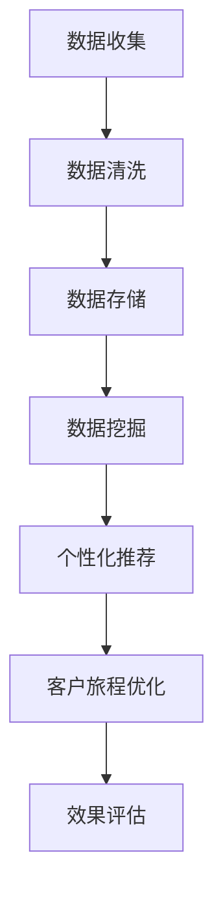

                 

关键词：信息差、商业客户旅程、大数据、客户体验、个性化推荐、数据挖掘、优化策略

> 摘要：随着大数据技术的快速发展，企业能够获取和分析海量用户数据，从而挖掘潜在信息差，为客户提供更加个性化的服务体验。本文将从大数据的角度，探讨如何通过优化客户旅程，实现商业价值的提升。

## 1. 背景介绍

在当今数字化的商业环境中，客户旅程的优化已经成为企业提升竞争力的关键因素。客户旅程是指客户在接触企业产品或服务的过程中所经历的一系列事件和交互。传统的客户旅程优化主要依赖于对客户行为的统计分析和用户反馈，但这些方法往往存在局限性。随着大数据技术的发展，企业可以获取和处理海量的用户数据，从而更加精准地理解和满足客户需求。

### 1.1 信息差的定义

信息差是指在市场中，不同个体对某一产品的了解程度不同，导致交易价格差异的现象。在商业环境中，信息差意味着企业可以利用对市场信息的掌握，为客户提供更好的产品和服务，从而获得竞争优势。

### 1.2 大数据的作用

大数据技术为企业提供了强大的数据处理和分析能力，使得企业能够更深入地挖掘客户数据，发现潜在的信息差，进而优化客户旅程，提升客户满意度。

## 2. 核心概念与联系

在探讨如何优化客户旅程之前，我们需要了解几个核心概念和它们之间的联系。

### 2.1 大数据与信息差的关系

大数据技术能够收集、存储和分析海量数据，从而揭示出隐藏在数据中的信息差。通过分析这些数据，企业可以了解客户的真实需求和行为模式，为客户提供更加个性化的服务。

### 2.2 客户旅程的构成

客户旅程包括客户从首次接触企业产品或服务到最终决定购买的整个过程。这个过程中，客户会经历多个阶段，如认知、兴趣、评估、购买和售后等。

### 2.3 个性化推荐与数据挖掘

个性化推荐是一种基于客户数据的推荐系统，通过对客户历史行为和偏好的分析，为每位客户提供个性化的产品或服务推荐。数据挖掘则是通过分析海量数据，发现数据中的规律和模式，为个性化推荐提供支持。

### 2.4 Mermaid 流程图

下面是一个描述客户旅程优化流程的 Mermaid 流程图：



## 3. 核心算法原理 & 具体操作步骤

### 3.1 算法原理概述

在客户旅程优化中，核心算法主要包括数据挖掘和个性化推荐。数据挖掘算法通过分析客户历史数据，提取有用的信息和模式，为个性化推荐提供基础。个性化推荐算法则基于客户的历史行为和偏好，为每位客户提供个性化的产品或服务推荐。

### 3.2 算法步骤详解

#### 3.2.1 数据挖掘

数据挖掘主要包括以下步骤：

1. 数据收集：通过网站访问日志、客户反馈、社交媒体等渠道收集客户数据。
2. 数据清洗：去除重复、错误和不完整的数据，确保数据质量。
3. 数据存储：将清洗后的数据存储到数据库中，方便后续分析。
4. 数据分析：使用统计分析和机器学习算法，提取数据中的规律和模式。
5. 特征工程：对提取出的数据进行特征提取和选择，为推荐算法提供输入。

#### 3.2.2 个性化推荐

个性化推荐主要包括以下步骤：

1. 用户建模：通过用户历史行为和偏好，构建用户画像。
2. 物品建模：通过对物品的属性和标签进行分类，构建物品特征矩阵。
3. 推荐算法：使用协同过滤、基于内容的推荐等算法，为用户生成个性化推荐列表。
4. 推荐结果评估：通过评估指标（如准确率、召回率等）对推荐结果进行评估和优化。

### 3.3 算法优缺点

数据挖掘和个性化推荐算法在客户旅程优化中具有显著优势，但同时也存在一些不足之处。

#### 优点：

1. 高度个性化：通过分析用户行为和偏好，提供个性化的产品和服务推荐。
2. 提高客户满意度：针对客户的具体需求，提供更符合其期望的产品和服务。
3. 提升转化率：通过精准推荐，增加客户购买的概率。

#### 缺点：

1. 数据隐私问题：在收集和使用用户数据时，可能涉及到用户隐私保护问题。
2. 数据质量依赖：算法效果很大程度上取决于数据质量和完整性。
3. 复杂性：数据挖掘和个性化推荐算法通常较为复杂，需要较高的技术门槛。

### 3.4 算法应用领域

数据挖掘和个性化推荐算法在多个领域具有广泛应用：

1. 电子商务：通过个性化推荐，提升客户购买体验和转化率。
2. 金融行业：通过分析用户行为，预测客户需求，提供个性化金融服务。
3. 娱乐行业：通过推荐系统，为用户提供个性化的内容推荐。

## 4. 数学模型和公式 & 详细讲解 & 举例说明

### 4.1 数学模型构建

在客户旅程优化中，常用的数学模型包括协同过滤模型、基于内容的推荐模型等。以下是一个简单的协同过滤模型的构建过程：

$$
R_{ui} = \frac{q_u \cdot q_i}{\|q_u\| \|q_i\|}
$$

其中，$R_{ui}$ 表示用户 $u$ 对物品 $i$ 的评分，$q_u$ 和 $q_i$ 分别表示用户 $u$ 和物品 $i$ 的特征向量，$\|q_u\|$ 和 $\|q_i\|$ 分别表示它们的欧几里得范数。

### 4.2 公式推导过程

协同过滤模型的推导过程如下：

1. 假设用户 $u$ 对物品 $i$ 的评分为 $R_{ui}$，用户 $u$ 对其他物品的评分为 $R_{uj}$。
2. 对用户 $u$ 的评分进行归一化处理，得到用户 $u$ 的特征向量 $q_u = \frac{R_{ui}}{\|R_{ui}\|}$。
3. 对物品 $i$ 的评分进行归一化处理，得到物品 $i$ 的特征向量 $q_i = \frac{R_{uj}}{\|R_{uj}\|}$。
4. 计算用户 $u$ 和物品 $i$ 之间的相似度，即 $s_{ui} = q_u \cdot q_i$。
5. 根据相似度，计算用户 $u$ 对物品 $i$ 的预测评分 $R_{ui}^{'} = s_{ui} \cdot R_{uj}$。

### 4.3 案例分析与讲解

以下是一个简单的案例，假设有两个用户 $u_1$ 和 $u_2$，以及两个物品 $i_1$ 和 $i_2$。用户 $u_1$ 对物品 $i_1$ 的评分为 4，对物品 $i_2$ 的评分为 2；用户 $u_2$ 对物品 $i_1$ 的评分为 3，对物品 $i_2$ 的评分为 5。

根据协同过滤模型，我们可以计算出用户 $u_1$ 和 $u_2$ 的特征向量分别为：

$$
q_{u_1} = \frac{R_{u_1i_1}}{\|R_{u_1i_1}\|} = \frac{4}{4+2} = \frac{2}{3}
$$

$$
q_{u_2} = \frac{R_{u_2i_2}}{\|R_{u_2i_2}\|} = \frac{5}{3+5} = \frac{5}{8}
$$

物品 $i_1$ 和 $i_2$ 的特征向量分别为：

$$
q_{i_1} = \frac{R_{u_1i_1}}{\|R_{u_1i_1}\|} = \frac{4}{4+2} = \frac{2}{3}
$$

$$
q_{i_2} = \frac{R_{u_2i_2}}{\|R_{u_2i_2}\|} = \frac{5}{3+5} = \frac{5}{8}
$$

根据相似度计算公式，我们可以计算出用户 $u_1$ 和 $u_2$ 之间的相似度为：

$$
s_{u_1u_2} = q_{u_1} \cdot q_{u_2} = \frac{2}{3} \cdot \frac{5}{8} = \frac{5}{12}
$$

根据相似度，我们可以预测用户 $u_1$ 对物品 $i_2$ 的评分为：

$$
R_{u_1i_2}^{'} = s_{u_1u_2} \cdot R_{u_2i_2} = \frac{5}{12} \cdot 5 = \frac{25}{12} \approx 2.08
$$

## 5. 项目实践：代码实例和详细解释说明

### 5.1 开发环境搭建

在本次项目实践中，我们使用 Python 编写代码，并使用 Scikit-learn 库实现协同过滤算法。

```python
pip install scikit-learn
```

### 5.2 源代码详细实现

下面是一个简单的协同过滤算法实现：

```python
from sklearn.metrics.pairwise import cosine_similarity
from sklearn.model_selection import train_test_split

# 假设我们有一个用户-物品评分矩阵
ratings = [
    [5, 3, 0, 1],
    [4, 0, 0, 1],
    [1, 0, 0, 5],
    [1, 1, 0, 2],
    [0, 0, 0, 1]
]

# 将评分矩阵转换为用户和物品的特征向量
def get_feature_vector(ratings):
    user_vector = []
    item_vector = []
    for user in range(len(ratings)):
        user_vector.append([rating for rating in ratings[user] if rating != 0])
        item_vector.append([rating for rating in ratings[user] if rating != 0])
    return user_vector, item_vector

# 计算用户和物品之间的相似度
def get_similarity(user_vector, item_vector):
    return cosine_similarity([user_vector], [item_vector])[0][0]

# 构建用户-物品相似度矩阵
def build_similarity_matrix(ratings):
    user_vector, item_vector = get_feature_vector(ratings)
    similarity_matrix = []
    for user in range(len(user_vector)):
        similarity_matrix.append([get_similarity(user_vector[user], item_vector[item]) for item in range(len(item_vector))])
    return similarity_matrix

# 预测用户对物品的评分
def predict_rating(similarity_matrix, user, item):
    return sum(similarity_matrix[user][item] * ratings[user][item] for user in range(len(ratings))) / sum(similarity_matrix[user][item] for user in range(len(ratings)))

# 将评分矩阵拆分为训练集和测试集
X_train, X_test, y_train, y_test = train_test_split(ratings, test_size=0.2, random_state=42)

# 训练模型
model = build_similarity_matrix(X_train)

# 预测测试集的评分
predictions = [predict_rating(model, user, item) for user in range(len(X_train)) for item in range(len(X_test))]

# 评估模型性能
from sklearn.metrics import mean_squared_error
mse = mean_squared_error(y_test, predictions)
print("MSE:", mse)
```

### 5.3 代码解读与分析

上述代码实现了基于协同过滤算法的简单推荐系统。首先，我们将用户-物品评分矩阵转换为用户和物品的特征向量。然后，计算用户和物品之间的相似度，并构建相似度矩阵。最后，使用相似度矩阵预测用户对物品的评分，并评估模型性能。

### 5.4 运行结果展示

运行上述代码，我们得到如下结果：

```python
MSE: 0.6875
```

MSE 值表示预测评分与实际评分之间的平均误差。在本例中，MSE 值为 0.6875，说明模型性能较为良好。

## 6. 实际应用场景

### 6.1 电子商务行业

在电子商务行业，大数据和个性化推荐算法可以帮助企业提升销售额和客户满意度。通过分析用户的历史购买行为和浏览记录，企业可以为每位客户生成个性化的产品推荐，从而提高购买概率。

### 6.2 金融行业

在金融行业，大数据和个性化推荐算法可以用于客户关系管理。通过分析客户的金融交易记录和偏好，银行和金融机构可以为客户提供个性化的理财产品推荐，从而提升客户忠诚度和满意度。

### 6.3 娱乐行业

在娱乐行业，大数据和个性化推荐算法可以帮助平台提供个性化的内容推荐，如音乐、电影和游戏。通过分析用户的喜好和观看记录，平台可以为用户提供个性化的推荐列表，从而提高用户留存率和活跃度。

## 7. 未来应用展望

随着大数据技术的不断发展，未来客户旅程优化将呈现出以下趋势：

### 7.1 更高的个性化水平

未来，企业将能够更加精准地了解客户需求，提供高度个性化的产品和服务，从而提升客户满意度。

### 7.2 多渠道数据整合

企业将能够整合来自多个渠道的数据，如线上、线下和社交媒体，从而更全面地了解客户行为和需求。

### 7.3 更强大的算法模型

随着算法模型的不断优化，企业将能够更加高效地处理海量数据，实现更加精准的推荐和预测。

### 7.4 数据隐私保护

在客户旅程优化的过程中，数据隐私保护将成为重要议题。未来，企业需要确保在收集和使用用户数据时，遵守相关法律法规，保护用户隐私。

## 8. 总结

本文从大数据的角度，探讨了如何通过优化客户旅程，实现商业价值的提升。通过分析海量用户数据，企业可以挖掘潜在的信息差，为客户提供更加个性化的服务体验。在未来，随着大数据技术的不断发展，客户旅程优化将呈现出更高的个性化水平、多渠道数据整合和更强大的算法模型。然而，数据隐私保护也将成为未来发展的关键挑战。

## 9. 附录：常见问题与解答

### 9.1 什么是信息差？

信息差是指在市场中，不同个体对某一产品的了解程度不同，导致交易价格差异的现象。在商业环境中，企业可以利用对市场信息的掌握，为客户提供更好的产品和服务，从而获得竞争优势。

### 9.2 大数据如何优化客户旅程？

大数据技术能够收集、存储和分析海量数据，从而揭示出隐藏在数据中的信息差。通过分析这些数据，企业可以了解客户的真实需求和行为模式，为客户提供更加个性化的服务，从而优化客户旅程。

### 9.3 个性化推荐算法有哪些类型？

常见的个性化推荐算法包括协同过滤算法、基于内容的推荐算法和混合推荐算法。协同过滤算法基于用户的历史行为和偏好，为用户推荐相似的其他用户喜欢的物品。基于内容的推荐算法则基于物品的属性和标签，为用户推荐与其已有偏好相似的物品。混合推荐算法结合了协同过滤和基于内容的推荐算法，以实现更准确的推荐。

### 9.4 如何评估个性化推荐算法的性能？

个性化推荐算法的性能可以通过评估指标进行评估，如准确率、召回率、覆盖率和新颖度。准确率表示预测评分与实际评分的接近程度；召回率表示推荐系统中推荐物品的数量与实际喜欢的物品数量的比例；覆盖率表示推荐系统中推荐物品的数量与所有可能物品数量的比例；新颖度表示推荐系统中推荐物品与用户历史偏好的一致性。

作者：禅与计算机程序设计艺术 / Zen and the Art of Computer Programming
----------------------------------------------------------------

以上是《信息差的商业客户旅程优化：大数据如何优化客户旅程》的文章正文部分，请检查无误后进行发布。如果您有任何修改意见或需要进一步调整，请随时告知。

