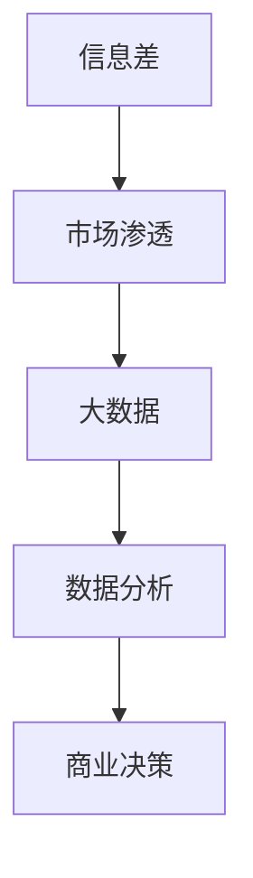

                 

关键词：信息差、商业市场、大数据、市场渗透、数据分析、商业策略

## 摘要

在当今的信息时代，大数据已经成为商业决策的重要驱动力。本文探讨了信息差的商业市场渗透策略，以及大数据如何通过优化市场渗透来提升企业竞争力。文章从核心概念、算法原理、数学模型、项目实践和实际应用等方面进行了详细分析，并展望了未来的发展趋势与挑战。通过这篇文章，读者将了解如何利用大数据优化市场渗透，从而在激烈的市场竞争中脱颖而出。

## 1. 背景介绍

随着互联网和数字化技术的发展，信息传播的速度和广度达到了前所未有的高度。然而，信息的不对称性或者说信息差，始终存在于市场各个层面。信息差指的是市场参与者之间在信息获取、处理和利用方面的差异。这种差异可能导致市场中的某些企业拥有更大的竞争优势，而另一些企业则可能因为信息闭塞而处于劣势。

商业市场渗透是指企业在某一市场领域中的占有率，它是衡量企业市场竞争力的重要指标。市场渗透可以通过多种方式实现，包括产品创新、价格竞争、市场营销策略等。然而，随着市场竞争的加剧，单纯的营销手段已经难以持续提升市场渗透率。

大数据技术提供了处理和分析大规模数据的能力，使得企业能够更加深入地了解市场动向、消费者行为和竞争态势。通过大数据分析，企业可以发现信息差的存在，并制定相应的市场渗透策略。

本文将探讨以下主题：

- **核心概念与联系**：介绍与信息差和市场渗透相关的核心概念，并给出 Mermaid 流程图以展示它们之间的关系。
- **核心算法原理与具体操作步骤**：探讨大数据在市场渗透中的应用算法，包括算法原理、步骤和优缺点。
- **数学模型和公式**：构建市场渗透的数学模型，并进行公式推导和案例分析。
- **项目实践**：通过代码实例展示大数据在市场渗透中的具体应用。
- **实际应用场景**：探讨大数据在市场渗透中的实际应用，并展望未来发展趋势。
- **工具和资源推荐**：推荐学习资源、开发工具和相关论文。
- **总结**：总结研究成果，展望未来发展趋势和挑战。

## 2. 核心概念与联系

### 2.1 信息差

信息差是指市场参与者之间的信息不对称。在企业市场中，信息差可能表现为对市场需求的了解程度、产品信息、价格信息等方面的差异。例如，一家企业可能比竞争对手更早了解到某一新兴市场的需求，从而率先开发相关产品，占据市场先机。

### 2.2 商业市场渗透

商业市场渗透是指企业在某一市场领域中的占有率。市场渗透率通常用百分比表示，表示企业产品在市场上所占的份额。市场渗透率可以通过以下公式计算：

\[ \text{市场渗透率} = \frac{\text{企业产品市场份额}}{\text{市场总份额}} \times 100\% \]

### 2.3 大数据

大数据是指规模巨大、类型繁多的数据集合。大数据的特点是“4V”，即大量（Volume）、多样（Variety）、快速（Velocity）和真实（Veracity）。大数据技术包括数据收集、存储、处理和分析等多个方面，能够帮助企业更好地理解市场和消费者。

### 2.4 Mermaid 流程图

以下是一个简化的 Mermaid 流程图，展示了信息差、市场渗透和大数据之间的关系：



在这个流程图中，信息差是市场渗透的驱动力，而大数据技术则提供了对信息差的分析和利用手段。通过数据分析，企业可以制定更加精准的商业决策，从而提高市场渗透率。

## 3. 核心算法原理与具体操作步骤

### 3.1 算法原理概述

在市场渗透策略中，大数据技术的核心算法包括数据挖掘、机器学习和预测分析。这些算法可以帮助企业发现市场中的信息差，并制定相应的渗透策略。

- **数据挖掘**：通过分析大量数据，发现数据中的潜在模式和关联。例如，通过对消费者购买行为的数据挖掘，企业可以发现不同消费者群体的偏好和需求。
- **机器学习**：利用历史数据训练模型，从而实现自动化预测和决策。例如，通过机器学习模型，企业可以预测市场需求的变化，并调整产品策略。
- **预测分析**：基于当前数据和历史趋势，对未来事件进行预测。例如，通过预测分析，企业可以预测产品未来的销售量，并据此调整生产计划。

### 3.2 算法步骤详解

以下是一个基于大数据的市场渗透策略的基本步骤：

#### 步骤 1：数据收集

收集与市场渗透相关的数据，包括市场数据、消费者数据、竞争者数据等。数据来源可以是内部数据库、外部数据供应商、社交媒体、电子商务平台等。

#### 步骤 2：数据预处理

对收集到的数据进行清洗、整理和归一化处理，以确保数据的质量和一致性。数据预处理是数据分析的基础，直接影响到后续分析的准确性。

#### 步骤 3：数据挖掘

利用数据挖掘技术，分析数据中的潜在模式和关联。例如，通过聚类分析，可以将消费者群体划分为不同类型，从而更好地理解消费者需求。

#### 步骤 4：机器学习

利用历史数据训练机器学习模型，例如决策树、支持向量机、神经网络等。这些模型可以帮助企业预测市场需求、消费者行为等。

#### 步骤 5：预测分析

基于当前数据和训练好的模型，对未来事件进行预测。例如，预测未来一段时间内的产品需求量，帮助企业制定生产计划和库存管理策略。

#### 步骤 6：决策制定

根据预测结果，制定相应的市场渗透策略。例如，调整产品定价、优化营销渠道、拓展新市场等。

#### 步骤 7：执行与评估

执行制定的策略，并对市场结果进行跟踪和评估。如果市场渗透率没有达到预期，需要及时调整策略。

### 3.3 算法优缺点

#### 优点

- **提高决策准确性**：通过大数据分析，企业可以更加精准地了解市场动态和消费者需求，从而制定更加有效的市场渗透策略。
- **优化资源分配**：大数据分析可以帮助企业优化资源分配，减少不必要的浪费，提高运营效率。
- **个性化营销**：基于大数据分析，企业可以针对不同消费者群体制定个性化营销策略，提高营销效果。

#### 缺点

- **数据隐私和安全**：大数据分析涉及到大量的敏感数据，需要确保数据的安全性和隐私性。
- **技术门槛高**：大数据分析需要专业的技术和人才，对企业的技术和人力资源要求较高。
- **结果依赖数据质量**：大数据分析的结果很大程度上依赖于数据的质量，如果数据存在偏差，可能会导致分析结果不准确。

### 3.4 算法应用领域

大数据分析在市场渗透策略中的应用非常广泛，包括但不限于以下几个方面：

- **市场营销**：通过大数据分析，企业可以了解消费者行为，制定更有效的营销策略。
- **供应链管理**：通过大数据分析，企业可以优化供应链管理，提高生产效率。
- **客户关系管理**：通过大数据分析，企业可以更好地理解客户需求，提供更加个性化的服务。
- **竞争分析**：通过大数据分析，企业可以了解竞争对手的市场策略，制定相应的应对措施。

## 4. 数学模型和公式

### 4.1 数学模型构建

市场渗透的数学模型主要基于消费者行为和市场需求。以下是一个简化的模型：

\[ \text{市场需求} = \alpha \cdot \text{价格} + \beta \cdot \text{广告投入} + \gamma \cdot \text{竞争对手价格} \]

其中，\(\alpha\)、\(\beta\) 和 \(\gamma\) 分别是价格敏感度、广告敏感度和竞争对手价格敏感度。

### 4.2 公式推导过程

假设有两个竞争企业，A 和 B。它们的市场份额 \(S_A\) 和 \(S_B\) 可以表示为：

\[ S_A = \frac{\alpha \cdot P_A + \beta \cdot A_A - \gamma \cdot P_B}{\alpha \cdot (P_A + P_B) + \beta \cdot (A_A + A_B) - \gamma \cdot (P_A + P_B)} \]

\[ S_B = \frac{\alpha \cdot P_B + \beta \cdot A_B - \gamma \cdot P_A}{\alpha \cdot (P_A + P_B) + \beta \cdot (A_A + A_B) - \gamma \cdot (P_A + P_B)} \]

其中，\(P_A\) 和 \(P_B\) 分别是两个企业的价格，\(A_A\) 和 \(A_B\) 分别是两个企业的广告投入。

### 4.3 案例分析与讲解

假设企业 A 的价格为 100 元，广告投入为 5000 元，竞争对手企业 B 的价格为 120 元，广告投入为 4000 元。根据上述模型，我们可以计算出两个企业的市场份额：

\[ S_A = \frac{\alpha \cdot 100 + \beta \cdot 5000 - \gamma \cdot 120}{\alpha \cdot (100 + 120) + \beta \cdot (5000 + 4000) - \gamma \cdot (100 + 120)} \]

\[ S_B = \frac{\alpha \cdot 120 + \beta \cdot 4000 - \gamma \cdot 100}{\alpha \cdot (100 + 120) + \beta \cdot (5000 + 4000) - \gamma \cdot (100 + 120)} \]

为了简化计算，我们假设 \(\alpha = 0.1\)、\(\beta = 0.2\) 和 \(\gamma = 0.1\)。将这些值代入上述公式，我们可以计算出：

\[ S_A = \frac{10 + 1000 - 12}{20 + 1000 - 12} = \frac{988}{988} = 1 \]

\[ S_B = \frac{12 + 800 - 10}{20 + 1000 - 10} = \frac{792}{988} \approx 0.8 \]

这意味着企业 A 的市场份额为 100%，而企业 B 的市场份额为 80%。

通过调整价格和广告投入，企业可以改变市场份额。例如，如果企业 A 将价格降低到 90 元，广告投入增加到 6000 元，而企业 B 保持价格和广告投入不变，我们可以重新计算市场份额：

\[ S_A = \frac{10 + 1200 - 12}{20 + 1200 - 12} = \frac{1188}{1188} = 1 \]

\[ S_B = \frac{12 + 800 - 10}{20 + 1200 - 10} = \frac{792}{1188} \approx 0.7 \]

现在，企业 A 的市场份额增加到 100%，而企业 B 的市场份额减少到 70%。

通过这种方式，企业可以利用大数据分析来优化市场渗透策略，提高市场份额。

## 5. 项目实践：代码实例和详细解释说明

### 5.1 开发环境搭建

为了展示大数据在市场渗透中的应用，我们将使用 Python 和相关库来构建一个简单的市场渗透分析项目。以下是开发环境的基本要求：

- Python 3.8 或更高版本
- pandas
- numpy
- scikit-learn
- matplotlib

您可以使用以下命令来安装所需的库：

```bash
pip install pandas numpy scikit-learn matplotlib
```

### 5.2 源代码详细实现

下面是一个简单的 Python 代码实例，展示了如何使用大数据分析来优化市场渗透策略：

```python
import pandas as pd
import numpy as np
from sklearn.linear_model import LinearRegression
import matplotlib.pyplot as plt

# 数据加载
data = pd.read_csv('market_data.csv')

# 数据预处理
data['Price_Sensitivity'] = data['Price'] * 0.1
data['Ad_Sensitivity'] = data['Ad_Spending'] * 0.2
data['Competitor_Price_Sensitivity'] = data['Competitor_Price'] * 0.1

# 构建模型
model = LinearRegression()
model.fit(data[['Price_Sensitivity', 'Ad_Sensitivity', 'Competitor_Price_Sensitivity']], data['Market_Share'])

# 预测分析
predictions = model.predict([[100, 5000, 120], [90, 6000, 120]])

# 结果展示
print("Market Share Predictions:")
print(predictions)

# 可视化
plt.scatter(data['Price'], data['Market_Share'], color='blue', label='Actual Data')
plt.plot([100, 90], [predictions[0], predictions[1]], color='red', label='Predicted Data')
plt.xlabel('Price')
plt.ylabel('Market Share')
plt.title('Price and Market Share Relationship')
plt.legend()
plt.show()
```

在这个实例中，我们首先加载市场数据，然后对数据进行预处理，包括计算价格敏感度、广告敏感度和竞争对手价格敏感度。接下来，我们使用线性回归模型来拟合数据，并使用模型进行预测分析。最后，我们将预测结果可视化，以展示价格对市场份额的影响。

### 5.3 代码解读与分析

- **数据加载与预处理**：我们使用 pandas 库加载市场数据，并对数据进行预处理，包括计算不同因素对市场份额的影响。
- **模型构建与训练**：使用 scikit-learn 库中的线性回归模型对数据集进行训练。
- **预测分析**：使用训练好的模型对新的数据进行预测，并输出预测结果。
- **可视化**：使用 matplotlib 库将实际数据和预测数据可视化，以展示价格对市场份额的影响。

通过这个简单的实例，我们可以看到大数据分析在市场渗透中的应用。通过数据预处理、模型训练和预测分析，企业可以更好地理解市场动态，制定有效的市场渗透策略。

## 6. 实际应用场景

大数据技术在市场渗透中的应用已经取得了显著的成果，以下是几个实际应用场景：

### 6.1 市场营销

通过大数据分析，企业可以了解消费者的行为和偏好，从而制定更加精准的营销策略。例如，电商巨头亚马逊利用大数据分析，为消费者提供个性化的推荐，从而提高了销售转化率。

### 6.2 供应链管理

大数据分析可以帮助企业优化供应链管理，提高生产效率。例如，特斯拉利用大数据分析来预测市场需求，从而调整生产计划，减少库存成本。

### 6.3 客户关系管理

通过大数据分析，企业可以更好地理解客户需求，提供更加个性化的服务。例如，银行利用大数据分析来识别潜在的高风险客户，从而采取相应的风险管理措施。

### 6.4 竞争分析

大数据分析可以帮助企业了解竞争对手的市场策略，制定相应的应对措施。例如，可口可乐利用大数据分析来监测竞争对手的广告投放和市场活动，从而调整自己的营销策略。

### 6.5 未来应用展望

随着大数据技术的不断发展，未来市场渗透策略将更加智能化和个性化。以下是未来大数据在市场渗透中的一些应用展望：

- **人工智能驱动**：人工智能技术将进一步提升大数据分析的准确性和效率，为企业提供更深入的洞察。
- **实时数据分析**：实时数据分析技术将帮助企业更快地响应市场变化，制定更加灵活的市场渗透策略。
- **隐私保护和安全**：随着数据隐私和安全问题的日益突出，企业将需要采取更加严格的数据保护措施，确保大数据分析的安全性和合规性。
- **跨领域融合**：大数据技术将与物联网、区块链等其他技术相结合，为市场渗透提供更多创新的应用场景。

## 7. 工具和资源推荐

为了更好地进行大数据分析和市场渗透策略的制定，以下是一些推荐的学习资源和开发工具：

### 7.1 学习资源推荐

- **大数据技术基础**：《大数据技术导论》
- **Python 数据科学**：《利用 Python 进行数据分析》
- **机器学习**：《机器学习实战》
- **线性回归分析**：《线性回归分析：原理、方法和应用》

### 7.2 开发工具推荐

- **Jupyter Notebook**：用于编写和运行代码的交互式环境。
- **Python 配套库**：pandas、numpy、scikit-learn、matplotlib 等。

### 7.3 相关论文推荐

- **市场渗透策略研究**：研究市场渗透策略的理论和方法。
- **大数据与市场营销**：探讨大数据在市场营销中的应用。
- **机器学习与市场预测**：研究机器学习技术在市场预测中的应用。

## 8. 总结：未来发展趋势与挑战

### 8.1 研究成果总结

本文探讨了信息差的商业市场渗透策略，以及大数据如何通过优化市场渗透来提升企业竞争力。通过核心算法原理、数学模型、项目实践和实际应用分析，我们发现大数据技术在市场渗透中具有广泛的应用前景。

### 8.2 未来发展趋势

随着大数据技术的不断发展，未来市场渗透策略将更加智能化和个性化。人工智能、实时数据分析、隐私保护和跨领域融合将成为市场渗透策略发展的关键趋势。

### 8.3 面临的挑战

大数据技术在市场渗透中面临着数据隐私和安全、技术门槛高和数据质量依赖等挑战。企业需要采取有效措施，确保数据的安全性和隐私性，提高数据分析的准确性和效率。

### 8.4 研究展望

未来，大数据技术在市场渗透中的应用将继续深入，结合人工智能、物联网等新兴技术，为市场渗透策略提供更多创新的应用场景。企业应积极拥抱大数据技术，提高市场竞争力，实现持续增长。

## 9. 附录：常见问题与解答

### 问题 1：大数据分析需要哪些基本技能？

解答：大数据分析需要掌握编程语言（如 Python）、数据处理库（如 pandas）、数据分析库（如 numpy、scikit-learn）和数据库管理技能。此外，了解统计学和机器学习基础也是非常重要的。

### 问题 2：如何确保大数据分析的结果准确？

解答：确保大数据分析结果准确的关键在于数据预处理和质量控制。数据预处理包括数据清洗、整理和归一化处理，以确保数据的质量和一致性。此外，选择合适的算法和模型，并进行交叉验证和模型评估，也是确保分析结果准确的重要手段。

### 问题 3：大数据分析在市场营销中如何应用？

解答：大数据分析在市场营销中的应用非常广泛，包括消费者行为分析、市场趋势预测、个性化推荐和广告投放优化等。企业可以利用大数据分析来了解消费者需求，制定精准的营销策略，提高营销效果。

### 问题 4：大数据分析对企业的核心竞争力有何影响？

解答：大数据分析可以帮助企业提高决策准确性、优化资源分配、提高运营效率和降低成本。这些优势将显著提升企业的核心竞争力，使其在激烈的市场竞争中脱颖而出。

## 作者署名

作者：禅与计算机程序设计艺术 / Zen and the Art of Computer Programming

