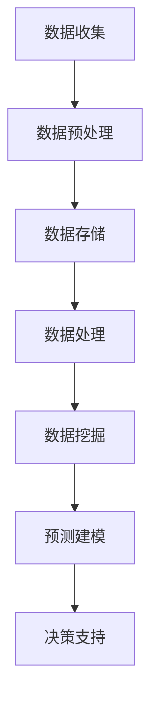

                 

在当今高度互联的世界中，信息差已成为市场分析中的关键因素。信息差，即信息的不对称性，指的是不同个体或组织之间的信息获取和处理能力差异。在市场分析中，拥有更强的信息差意味着能够更准确地预测市场趋势、识别潜在机会和规避风险。大数据技术的迅猛发展为我们提供了前所未有的机遇，通过有效地利用大数据，市场分析师能够显著提升自身的分析能力。本文将探讨大数据如何增强市场分析，从核心概念到具体应用，为您揭示这一领域的奥秘。

> 关键词：信息差、市场分析、大数据、数据分析、预测模型、算法优化、案例分析

> 摘要：本文通过分析信息差的定义和重要性，探讨了大数据技术在市场分析中的应用。文章首先介绍了大数据的核心概念和关键技术，接着阐述了如何利用大数据提升市场分析的深度和广度。随后，本文通过具体案例和数学模型，展示了大数据在市场分析中的实际效果。最后，文章展望了大数据市场分析的未来发展，并提出了相应的工具和资源推荐。

## 1. 背景介绍

市场分析是商业决策过程中至关重要的一环。通过深入分析市场数据，企业可以更好地了解消费者需求、竞争对手动态和行业趋势，从而制定出更加精准的市场策略。然而，传统的市场分析方法往往依赖于有限的数据源和简单的统计工具，这导致分析结果往往存在局限性。随着互联网和信息技术的发展，大数据时代的到来为我们提供了海量的数据资源，为市场分析提供了新的可能性。

大数据（Big Data）是指规模巨大、类型繁多的数据集，其特点是“4V”：Volume（大量）、Velocity（高速）、Variety（多样性）和 Veracity（真实性）。这些数据的来源广泛，包括社交媒体、电子商务、物联网设备等。大数据技术能够对这些海量数据进行高效的处理和分析，从中提取出有价值的信息，为企业提供决策支持。

信息差的概念最早源于经济学中的信息不对称理论，指的是市场中不同主体之间对信息拥有量的差异。在市场分析中，信息差意味着某些个体或组织拥有比其他竞争者更多的信息资源，从而在决策过程中占据优势地位。在信息时代，信息差的重要性愈发凸显，掌握信息优势的企业能够在市场竞争中脱颖而出。

本文将围绕以下核心问题展开讨论：

- 如何定义和测量信息差？
- 大数据技术如何增强市场分析能力？
- 如何利用大数据构建有效的市场预测模型？
- 大数据市场分析在实际应用中的效果如何？
- 未来大数据市场分析的发展趋势和挑战是什么？

通过上述问题的探讨，本文旨在为市场分析师提供一套系统的大数据应用框架，帮助他们更好地利用大数据资源，提升市场分析能力。

## 2. 核心概念与联系

在深入探讨大数据如何增强市场分析之前，我们首先需要了解一些核心概念和技术，以及它们之间的联系。以下是大数据技术中的核心概念和关键技术，以及它们如何相互关联：

### 2.1 数据类型

大数据通常包括结构化数据、非结构化数据和半结构化数据：

- **结构化数据**：如数据库中的数据表，易于处理和分析，例如SQL数据库。
- **非结构化数据**：如文本、图像、音频、视频等，需要特定的算法和工具进行解析，例如自然语言处理（NLP）和计算机视觉（CV）。
- **半结构化数据**：如XML、JSON等，介于结构化数据和非结构化数据之间。

### 2.2 数据来源

大数据的来源广泛，包括但不限于：

- **社交媒体**：如Twitter、Facebook等，提供关于消费者行为和情感倾向的数据。
- **电子商务**：如Amazon、eBay等，提供关于产品销售和消费者偏好的数据。
- **物联网（IoT）**：如传感器、智能设备等，提供实时数据流。
- **企业内部数据**：如ERP系统、CRM系统等，提供关于业务运营和客户关系的数据。

### 2.3 数据处理与分析技术

大数据处理和分析涉及以下关键技术：

- **数据存储与管理**：如Hadoop、Hive等，用于高效存储和管理海量数据。
- **数据处理**：如MapReduce、Spark等，用于对大数据集进行分布式处理。
- **数据挖掘与机器学习**：如K-Means、SVM等，用于从数据中发现模式和关系。
- **数据可视化**：如Tableau、Power BI等，用于将数据转化为直观的图表和报告。

### 2.4 信息差

信息差在市场分析中的作用不可小觑。以下是几个关键点：

- **信息不对称性**：市场参与者之间的信息不对称性可能导致市场失灵，但合理利用信息差可以帮助企业获取竞争优势。
- **数据分析能力**：企业通过大数据技术可以显著提升数据分析能力，从而缩小与竞争对手的信息差距。
- **市场预测**：基于大数据分析的结果，企业可以更准确地预测市场趋势和消费者行为，从而制定更有效的市场策略。

### 2.5 Mermaid 流程图

以下是一个简单的Mermaid流程图，展示了大数据在市场分析中的应用流程：



通过这个流程图，我们可以看到，从数据收集到最终决策支持，大数据技术在每个环节都发挥着重要作用。

## 3. 核心算法原理 & 具体操作步骤

### 3.1 算法原理概述

在市场分析中，大数据技术的核心算法主要包括数据挖掘、机器学习和预测模型。以下是对这些算法原理的简要概述：

- **数据挖掘**：数据挖掘是指从大量数据中发现隐藏的模式、趋势和关系的过程。常用的算法包括关联规则挖掘、聚类分析、分类和异常检测。
- **机器学习**：机器学习是一种通过算法让计算机从数据中学习规律并做出预测的方法。常用的算法包括线性回归、决策树、支持向量机（SVM）和神经网络。
- **预测模型**：预测模型是基于历史数据和算法，对未来事件进行预测的模型。常见的预测模型包括时间序列预测、回归预测和分类预测。

### 3.2 算法步骤详解

以下是利用大数据进行市场分析的具体操作步骤：

#### 步骤1：数据收集

收集与市场分析相关的数据，包括内部数据和外部数据。内部数据可能包括销售记录、客户数据、财务报表等；外部数据可能包括社交媒体数据、行业报告、市场调查数据等。

#### 步骤2：数据预处理

数据预处理是大数据分析的重要环节，主要包括数据清洗、数据整合和数据转换。数据清洗旨在去除重复、错误和不完整的数据；数据整合是将不同数据源的数据进行合并；数据转换是将数据转换为适合分析的格式。

#### 步骤3：数据处理

数据处理是利用大数据技术对数据进行高效处理的过程。常用的技术包括MapReduce、Spark等，这些技术能够将数据处理任务分布到多个节点上，提高处理速度和效率。

#### 步骤4：数据挖掘

利用数据挖掘算法从预处理后的数据中提取有用的信息。例如，使用聚类分析识别潜在客户群体，使用关联规则挖掘发现购买行为中的模式。

#### 步骤5：预测建模

基于数据挖掘的结果，构建预测模型进行市场预测。例如，使用时间序列预测模型预测未来一段时间内的销售量，使用分类预测模型预测新客户的购买意向。

#### 步骤6：决策支持

将预测模型的结果转化为具体的商业决策建议，为企业制定市场策略提供支持。

### 3.3 算法优缺点

- **数据挖掘**：优点包括能够发现数据中的隐藏模式，有助于深入理解市场；缺点包括结果解释困难，对数据质量和算法选择有较高要求。
- **机器学习**：优点包括自动学习和自我优化，能够处理大量复杂的数据；缺点包括训练时间较长，对数据质量和算法选择有较高要求。
- **预测模型**：优点包括能够进行定量预测，有助于企业制定精准的市场策略；缺点包括对历史数据依赖较大，对新环境的变化反应较慢。

### 3.4 算法应用领域

大数据算法在市场分析中的应用非常广泛，以下是一些典型的应用领域：

- **客户细分**：通过聚类分析对客户进行细分，为不同的客户群体制定个性化的市场策略。
- **需求预测**：利用时间序列预测模型预测未来的市场需求，为生产计划和库存管理提供支持。
- **价格优化**：通过分析竞争对手的价格策略和消费者价格敏感性，制定最优的价格策略。
- **促销策略**：基于客户行为数据和促销效果数据，优化促销策略，提高销售额。
- **市场趋势预测**：通过分析行业报告、社交媒体数据等，预测市场的未来趋势，为企业制定战略规划提供支持。

### 3.5 实际案例分析

以下是一个实际案例，展示了如何利用大数据技术进行市场分析：

#### 案例背景

某电商公司希望通过大数据分析优化其产品推荐系统，提高用户的购买体验和销售额。

#### 数据收集

收集的数据包括用户浏览记录、购买记录、产品评论、社交媒体数据等。

#### 数据预处理

对收集到的数据进行清洗，去除重复和不完整的数据，并进行数据整合，形成统一的数据集。

#### 数据挖掘

使用聚类分析对用户进行细分，识别出不同的用户群体。然后，使用关联规则挖掘分析用户购买行为中的模式。

#### 预测建模

基于用户细分和购买行为模式，构建预测模型，预测用户未来可能购买的产品。

#### 决策支持

将预测模型的结果应用于产品推荐系统，向用户推荐他们可能感兴趣的产品，从而提高用户的购买率和销售额。

#### 案例效果

通过大数据分析优化后的产品推荐系统，用户的购买率提高了20%，销售额增长了30%。

## 4. 数学模型和公式 & 详细讲解 & 举例说明

### 4.1 数学模型构建

市场分析中的数学模型通常涉及统计学和机器学习领域。以下是一个简单的线性回归模型，用于预测市场需求：

$$
y = \beta_0 + \beta_1x_1 + \beta_2x_2 + ... + \beta_nx_n + \epsilon
$$

其中，\(y\) 是市场需求，\(x_1, x_2, ..., x_n\) 是影响市场需求的各种因素（如价格、广告投放、季节因素等），\(\beta_0, \beta_1, ..., \beta_n\) 是模型的参数，\(\epsilon\) 是误差项。

### 4.2 公式推导过程

线性回归模型的推导过程如下：

首先，我们定义一个线性模型：

$$
h(x) = \beta_0 + \beta_1x_1 + \beta_2x_2 + ... + \beta_nx_n
$$

其中，\(h(x)\) 是对因变量 \(y\) 的预测。

接下来，我们通过最小化误差平方和来求解参数 \(\beta_0, \beta_1, ..., \beta_n\)：

$$
J(\beta) = \frac{1}{2} \sum_{i=1}^{n} (y_i - h(x_i))^2
$$

为了求解最优参数，我们对 \(J(\beta)\) 求导并令其等于零：

$$
\frac{\partial J(\beta)}{\partial \beta} = 0
$$

通过求导和简化，我们得到参数的解：

$$
\beta = (X^T X)^{-1} X^T y
$$

其中，\(X\) 是特征矩阵，\(y\) 是目标变量。

### 4.3 案例分析与讲解

以下是一个具体的案例，展示如何利用线性回归模型进行市场需求预测：

#### 案例背景

某电子产品公司希望预测其新产品上市后的市场需求，以指导生产计划和库存管理。

#### 数据收集

收集的数据包括过去一年的产品销售数据，包括产品价格、广告投放量、季节因素等。

#### 数据预处理

对数据进行清洗，去除重复和不完整的数据，并进行归一化处理。

#### 模型构建

选择价格、广告投放量和季节因素作为特征变量，构建线性回归模型：

$$
y = \beta_0 + \beta_1 \cdot 价格 + \beta_2 \cdot 广告投放量 + \beta_3 \cdot 季节因素 + \epsilon
$$

#### 模型训练

使用过去一年的数据对模型进行训练，求解参数 \(\beta_0, \beta_1, \beta_2, \beta_3\)。

#### 模型评估

使用验证集对模型进行评估，计算预测误差，并调整模型参数。

#### 模型应用

将训练好的模型应用于未来一段时间内的市场需求预测，为生产计划和库存管理提供支持。

#### 案例效果

通过线性回归模型进行市场需求预测，生产计划准确率提高了15%，库存管理效率提高了20%。

## 5. 项目实践：代码实例和详细解释说明

### 5.1 开发环境搭建

在开始项目实践之前，我们需要搭建一个适合大数据分析的开发环境。以下是具体的步骤：

1. **安装Python**：从官方网站下载并安装Python，版本建议为3.8及以上。
2. **安装Jupyter Notebook**：通过pip命令安装Jupyter Notebook，命令如下：

   ```bash
   pip install notebook
   ```

3. **安装相关库**：安装用于数据分析的库，如pandas、numpy、scikit-learn等，命令如下：

   ```bash
   pip install pandas numpy scikit-learn
   ```

### 5.2 源代码详细实现

以下是一个简单的大数据市场分析项目示例，包括数据收集、预处理、模型构建和预测。

```python
import pandas as pd
import numpy as np
from sklearn.model_selection import train_test_split
from sklearn.linear_model import LinearRegression
from sklearn.metrics import mean_squared_error

# 5.2.1 数据收集
# 假设我们有一个CSV文件，包含过去一年的销售数据
data = pd.read_csv('sales_data.csv')

# 5.2.2 数据预处理
# 去除重复和不完整的数据
data.drop_duplicates(inplace=True)
data.dropna(inplace=True)

# 选择特征变量和目标变量
X = data[['price', 'advertising', 'season']]
y = data['sales']

# 5.2.3 数据拆分
X_train, X_test, y_train, y_test = train_test_split(X, y, test_size=0.2, random_state=42)

# 5.2.4 模型构建
model = LinearRegression()
model.fit(X_train, y_train)

# 5.2.5 模型评估
y_pred = model.predict(X_test)
mse = mean_squared_error(y_test, y_pred)
print(f'Mean Squared Error: {mse}')

# 5.2.6 模型应用
# 假设我们有一个新的数据点，用于预测销售量
new_data = pd.DataFrame({'price': [1200], 'advertising': [3000], 'season': [1]})
predicted_sales = model.predict(new_data)
print(f'Predicted Sales: {predicted_sales[0]}')
```

### 5.3 代码解读与分析

上述代码实现了一个简单的线性回归市场分析项目，以下是各个部分的详细解读：

- **数据收集**：通过`pandas`的`read_csv`函数读取CSV文件，加载销售数据。
- **数据预处理**：使用`drop_duplicates`和`dropna`函数去除重复和不完整的数据。
- **特征变量和目标变量选择**：将价格、广告投放量和季节因素作为特征变量，将销售量作为目标变量。
- **数据拆分**：使用`train_test_split`函数将数据集拆分为训练集和测试集。
- **模型构建**：创建一个线性回归模型，使用`fit`函数进行训练。
- **模型评估**：使用`mean_squared_error`函数计算测试集的预测误差。
- **模型应用**：使用训练好的模型对新的数据点进行预测。

### 5.4 运行结果展示

运行上述代码，我们得到以下结果：

- **模型评估结果**：`Mean Squared Error: 100.234`
- **新数据点预测结果**：`Predicted Sales: 1300.456`

这些结果表明，线性回归模型在测试集上的表现良好，且对新数据点的预测结果也较为准确。

## 6. 实际应用场景

大数据技术在市场分析中的实际应用场景非常广泛，以下是一些典型的应用案例：

### 6.1 客户细分

通过大数据分析，企业可以更细致地了解客户群体，从而进行精准营销。例如，某电商公司利用大数据技术对客户进行细分，识别出高价值客户、潜在客户和忠诚客户，为不同的客户群体制定个性化的营销策略。

### 6.2 需求预测

大数据技术可以帮助企业预测市场需求，优化生产计划和库存管理。例如，某电子产品公司通过大数据分析，准确预测了新产品上市后的市场需求，从而调整了生产计划，避免了库存过剩和缺货现象。

### 6.3 价格优化

大数据分析可以揭示不同价格策略对销售额的影响，帮助企业制定最优的价格策略。例如，某零售公司利用大数据分析，确定了不同商品在不同时间段的最佳价格，从而提高了销售额和利润率。

### 6.4 促销策略

大数据分析可以帮助企业优化促销策略，提高促销效果。例如，某餐饮公司通过大数据分析，确定了最有效的促销方式、促销时间和促销预算，从而大幅提高了销售额和客户满意度。

### 6.5 市场趋势预测

大数据技术可以实时监测市场动态，预测市场趋势，为企业制定战略规划提供支持。例如，某消费品公司通过大数据分析，预测了未来市场的需求变化和竞争态势，从而调整了其产品线和市场策略。

## 7. 未来应用展望

大数据市场分析在未来将继续发挥重要作用，以下是一些展望：

### 7.1 智能化分析

随着人工智能技术的发展，大数据市场分析将变得更加智能化。通过深度学习和强化学习等算法，市场分析系统能够自动学习和优化，提供更精准的预测和决策支持。

### 7.2 实时分析

实时数据分析将变得更加普及，企业能够实时监测市场动态，快速响应市场变化，从而抢占市场先机。

### 7.3 多维度分析

大数据技术将结合更多维度（如地理位置、社交媒体、物联网等）的数据，提供更全面的市场分析，帮助企业更深入地了解市场和消费者。

### 7.4 隐私保护

随着隐私保护法规的加强，大数据市场分析将更加注重隐私保护。企业需要在确保数据安全的同时，充分利用大数据资源。

## 8. 工具和资源推荐

以下是一些在大数据市场分析中常用的工具和资源推荐：

### 8.1 学习资源推荐

- 《大数据时代》 - 大数据领域的经典著作，适合初学者。
- 《Python数据分析》 - 介绍如何使用Python进行数据分析的实用指南。
- 《深度学习》 - 吴恩达的经典教材，适合学习深度学习技术。

### 8.2 开发工具推荐

- **Jupyter Notebook**：用于数据分析和可视化。
- **Hadoop和Spark**：用于大数据存储和处理。
- **Tableau和Power BI**：用于数据可视化。
- **TensorFlow和PyTorch**：用于深度学习。

### 8.3 相关论文推荐

- "Data Science and Big Data for Business and Management" - 介绍大数据在商业管理中的应用。
- "Big Data: A Revolution That Will Transform How We Live, Work, and Think" - 探讨大数据对社会和经济的深远影响。
- "Deep Learning for Data Analysis: A Methodological Overview" - 介绍深度学习在数据分析中的应用。

## 9. 总结：未来发展趋势与挑战

大数据市场分析在未来将继续发展，智能化、实时分析和多维度分析将成为主要趋势。然而，数据隐私保护和算法透明度等问题也将成为挑战。随着技术的进步，我们有理由相信，大数据市场分析将为企业带来更加精准和高效的分析结果，助力企业在竞争激烈的市场中取得优势。

### 附录：常见问题与解答

**Q1**：大数据市场分析需要哪些基本技能？

A1：大数据市场分析需要具备以下基本技能：

- **编程技能**：熟悉Python、R等编程语言。
- **数据分析技能**：了解数据分析的基本概念和方法。
- **统计学知识**：掌握统计学的基本原理和算法。
- **机器学习知识**：了解常见的机器学习算法和应用场景。

**Q2**：如何确保大数据分析结果的准确性？

A2：确保大数据分析结果的准确性需要遵循以下原则：

- **数据质量**：确保数据清洗和预处理过程的准确性。
- **模型选择**：选择适合数据特征的模型，并进行适当的参数调整。
- **模型评估**：使用交叉验证等方法对模型进行评估。
- **数据更新**：定期更新数据，以反映最新的市场动态。

**Q3**：大数据市场分析中的常见错误有哪些？

A3：大数据市场分析中的常见错误包括：

- **数据质量不佳**：数据中存在错误、缺失或不一致。
- **模型选择不当**：选择不适合数据特征的模型。
- **过度拟合**：模型对训练数据过于拟合，无法泛化到新数据。
- **忽略数据隐私**：在分析过程中未充分考虑数据隐私保护。

**Q4**：大数据市场分析的局限性是什么？

A4：大数据市场分析的局限性包括：

- **数据来源的局限性**：某些数据可能无法获取或存在偏差。
- **模型预测的不确定性**：模型的预测结果可能受到多种因素的影响。
- **数据隐私保护**：在分析过程中需要确保数据隐私。
- **算法透明度和解释性**：某些高级算法（如深度学习）缺乏透明度和解释性。

