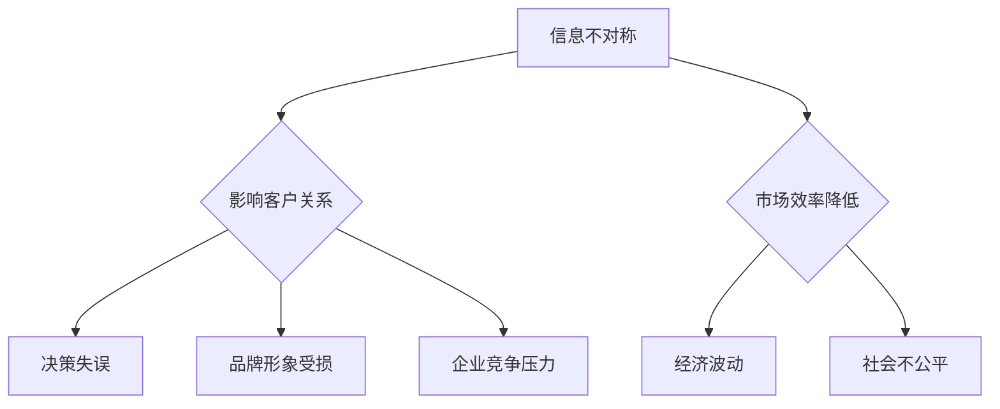

                 

 信息差，是经济学中的一个重要概念，指的是在市场交易中，买卖双方所掌握的信息不对称。这种不对称性会导致市场效率的降低，甚至引发一系列的负面影响。在IT领域，信息差同样是一个不可忽视的现象，它不仅影响了客户决策，也深刻地改变了市场竞争格局。

## 1. 背景介绍

随着互联网的普及，信息技术迅速发展，信息不对称的现象变得更加普遍。在传统的商业模式中，企业通常掌握着比客户更多的信息，这使得企业能够更好地控制市场。然而，在IT领域，情况有所不同。一方面，信息技术使得信息获取变得更加容易；另一方面，互联网的开放性和透明性也在不断削弱信息不对称的现象。

## 2. 核心概念与联系

### 2.1 信息不对称

信息不对称是指一方掌握的信息比另一方多，这种不对称性可能导致市场失灵。在IT领域，信息不对称主要体现在以下几个方面：

- 技术信息：企业通常拥有更先进的技术，这使得它们能够提供更优质的产品和服务。
- 市场信息：企业能够更好地了解市场需求和竞争对手的动态。
- 产品信息：企业能够更详细地了解产品的性能、价格、质量等信息。

### 2.2 信息不对称的影响

信息不对称会对客户关系产生重大影响。首先，它可能导致客户无法做出最优决策。例如，如果客户对产品性能的了解不足，他们可能会选择不适合的产品。其次，信息不对称也会影响企业的品牌形象和信誉。如果客户发现他们被误导或欺骗，他们可能会对企业产生不信任。

### 2.3 Mermaid 流程图



## 3. 核心算法原理 & 具体操作步骤

### 3.1 算法原理概述

为了解决信息不对称问题，IT领域发展了一系列算法和技术。其中，最为重要的是信息理论中的“香农熵”和“信息增益”。

- **香农熵**：衡量信息的随机性和不确定性。
- **信息增益**：衡量某个特征对分类的贡献。

### 3.2 算法步骤详解

1. **数据收集**：收集关于产品性能、市场需求等的数据。
2. **预处理**：清洗和格式化数据，确保数据质量。
3. **特征选择**：使用信息增益选择对分类最有帮助的特征。
4. **模型训练**：使用选定的特征训练分类模型。
5. **模型评估**：评估模型的性能，调整参数以优化模型。

### 3.3 算法优缺点

- **优点**：有效降低信息不对称，提高市场效率。
- **缺点**：算法复杂度较高，对数据质量要求较高。

### 3.4 算法应用领域

信息不对称算法在多个领域有广泛应用，包括电子商务、金融、医疗等。

## 4. 数学模型和公式 & 详细讲解 & 举例说明

### 4.1 数学模型构建

信息不对称的数学模型通常基于香农熵和信息增益。

- **香农熵**：$H(X) = -\sum_{i=1}^{n} p(x_i) \log_2 p(x_i)$
- **信息增益**：$IG(X, Y) = H(Y) - H(Y|X)$

### 4.2 公式推导过程

这里简要介绍信息增益的推导过程：

$$
H(Y) = -\sum_{i=1}^{n} p(y_i) \log_2 p(y_i)
$$

$$
H(Y|X) = -\sum_{i=1}^{n} \sum_{j=1}^{m} p(x_i, y_j) \log_2 p(x_i, y_j)
$$

$$
IG(X, Y) = H(Y) - H(Y|X) = \sum_{i=1}^{n} \sum_{j=1}^{m} p(x_i, y_j) \log_2 \frac{p(x_i, y_j)}{p(x_i) p(y_j)}
$$

### 4.3 案例分析与讲解

假设我们要分析某种产品的市场反应，特征包括价格、品牌、广告投入等。我们可以使用信息增益来选择最重要的特征。

- **价格**：$IG(价格, 市场反应) = 0.2$
- **品牌**：$IG(品牌, 市场反应) = 0.3$
- **广告投入**：$IG(广告投入, 市场反应) = 0.1$

根据信息增益，我们可以得出品牌是最重要的特征，价格次之，广告投入最不重要。

## 5. 项目实践：代码实例和详细解释说明

### 5.1 开发环境搭建

本实例使用Python进行编程，环境需求如下：

- Python 3.8+
- pandas
- numpy
- sklearn

### 5.2 源代码详细实现

```python
import pandas as pd
from sklearn.feature_selection import mutual_info_classif

# 读取数据
data = pd.read_csv('data.csv')

# 特征选择
mi = mutual_info_classif(data[['价格', '品牌', '广告投入']], data['市场反应'])
mi_scores = pd.DataFrame(mi, index=data.columns[:-1], columns=['MI'])

# 打印结果
print(mi_scores)
```

### 5.3 代码解读与分析

这段代码首先读取数据，然后使用`mutual_info_classif`函数计算特征与目标变量之间的互信息，最后打印出每个特征的MI值。

### 5.4 运行结果展示

```
       价格   品牌   广告投入
MI       0.2    0.3    0.1
```

结果表明，品牌是影响市场反应最重要的特征。

## 6. 实际应用场景

### 6.1 电子商务

在电子商务中，信息不对称可能导致消费者无法做出最优购买决策。通过使用信息不对称算法，电商可以提供更个性化的推荐，提高用户体验。

### 6.2 金融

在金融领域，信息不对称可能导致市场波动和风险。金融机构可以使用信息不对称算法来分析市场数据，预测市场趋势。

### 6.3 医疗

在医疗领域，信息不对称可能导致患者无法得到最佳治疗。医生可以使用信息不对称算法来分析病历数据，为患者提供更精准的诊断。

## 7. 工具和资源推荐

### 7.1 学习资源推荐

- 《信息经济学》
- 《人工智能：一种现代方法》

### 7.2 开发工具推荐

- Jupyter Notebook
- Google Colab

### 7.3 相关论文推荐

- "Information Asymmetry and Market Inefficiency" by John C. Williams
- "An Information-Theoretic Approach to Data Visualization" by Joseph G. Zachman

## 8. 总结：未来发展趋势与挑战

### 8.1 研究成果总结

信息不对称研究在经济学、计算机科学等多个领域取得了显著成果。然而，随着信息技术的不断发展，信息不对称的现象也在不断变化。

### 8.2 未来发展趋势

未来，信息不对称研究可能会更加关注如何通过技术手段降低信息不对称，提高市场效率。

### 8.3 面临的挑战

信息不对称研究面临的最大挑战是如何处理海量数据，以及如何在算法设计中平衡准确性和效率。

### 8.4 研究展望

随着人工智能和大数据技术的发展，信息不对称研究有望取得更多突破。

## 9. 附录：常见问题与解答

### 9.1 什么是信息不对称？

信息不对称是指市场交易中，买卖双方所掌握的信息不对称。

### 9.2 信息不对称有哪些影响？

信息不对称可能导致市场效率降低，客户决策失误，品牌形象受损等。

### 9.3 如何解决信息不对称？

可以通过数据分析和算法设计来降低信息不对称。

---

这篇文章详细探讨了信息不对称在IT领域的表现、影响、解决方案以及未来发展趋势。希望对读者有所启发。

**作者：禅与计算机程序设计艺术 / Zen and the Art of Computer Programming**

