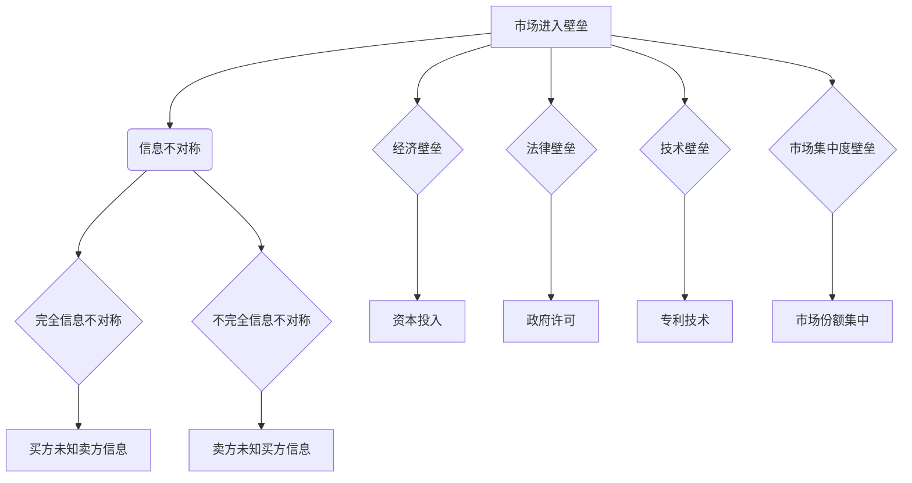
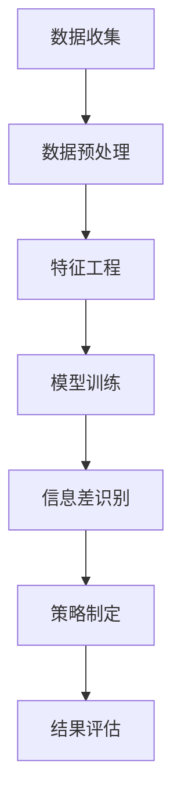

                 

关键词：信息不对称、市场进入壁垒、竞争策略、信息共享、数据分析、商业秘密

> 摘要：本文探讨了信息不对称现象在市场中的影响及其对企业竞争策略的重要性。通过对市场进入壁垒的分析，探讨了如何利用信息差来获取竞争优势，同时讨论了信息共享的潜在风险与机遇。文章结合实际案例，分析了信息差在不同行业中的应用，并提出了未来研究的方向和挑战。

## 1. 背景介绍

在市场经济中，信息不对称是指市场上买方和卖方之间所掌握的信息存在差异。这种差异可能导致市场效率低下，出现市场失灵。信息不对称现象普遍存在于各个行业，从金融市场的投资决策，到零售行业的消费者行为，再到互联网领域的用户数据，信息不对称都是一个不可忽视的因素。

市场进入壁垒是指阻碍企业进入特定市场的各种经济、法律、技术和制度因素。这些壁垒可能包括资本要求、专利保护、政府许可、市场集中度高等。市场进入壁垒的存在使得既有企业在市场中拥有了一定的竞争优势。

本文将探讨信息不对称与市场进入壁垒之间的关系，分析如何利用信息差来获取竞争优势，同时讨论信息共享的潜在风险与机遇。通过结合实际案例，本文将展示信息差在不同行业中的应用，并讨论未来的研究方向和挑战。

### 1.1 市场经济中的信息不对称

信息不对称在市场经济中是一种常见现象。例如，在金融市场中，银行和投资者之间的信息不对称可能导致信贷市场失灵。银行通常比投资者更了解借款人的信用状况，因此银行在贷款决策中具有信息优势。这种信息优势可能导致不良贷款的增加，从而影响整个金融市场的稳定性。

在零售行业中，消费者与商家之间的信息不对称也是一个重要问题。消费者通常无法完全了解产品的质量、性能和价格信息，而商家则可能拥有关于产品更多信息。这种信息不对称可能导致消费者做出不理性的购买决策，从而影响市场效率。

### 1.2 市场进入壁垒的概念与分类

市场进入壁垒是指那些阻碍新企业进入现有市场或现有企业扩展其业务范围的因素。市场进入壁垒可以分为以下几类：

- **经济壁垒**：如高额的资本投入、高昂的设备购买费用等，这些成本可能使得新企业难以进入市场。
- **法律壁垒**：如政府许可、行业规范等，这些法规可能限制新企业的进入。
- **技术壁垒**：如专利技术、专业知识和研发能力等，这些技术因素可能使得新企业难以在市场上竞争。
- **市场集中度壁垒**：如现有企业的市场份额集中，使得新企业难以获得足够的市场份额。

### 1.3 信息不对称与市场进入壁垒的关系

信息不对称与市场进入壁垒之间存在紧密的联系。市场进入壁垒的存在往往加剧了信息不对称现象。例如，技术壁垒可能使得新企业难以获取相关的技术信息，从而在市场上处于信息劣势。法律壁垒可能使得新企业难以了解行业规范，导致信息不对称。

相反，信息不对称也可能加剧市场进入壁垒。例如，现有企业可能利用其信息优势来维持市场进入壁垒，从而阻止新企业的进入。这种信息不对称可能使得市场进入变得更加困难。

### 1.4 信息差的定义与作用

信息差是指市场上不同主体之间拥有的信息差异。这种差异可以为企业带来竞争优势。例如，一家企业如果能够获得关于市场趋势、消费者需求、竞争对手策略等关键信息，那么它就可能比竞争对手更早做出决策，从而在市场上占据有利位置。

信息差在市场中的主要作用包括：

- **决策优势**：拥有更多信息的企业能够在决策时更加准确和迅速，从而在市场竞争中占据优势。
- **创新优势**：信息差可以帮助企业发现新的市场机会，从而推动创新和发展。
- **定价优势**：企业可以利用信息差来制定更有利的定价策略，从而增加利润。

## 2. 核心概念与联系

### 2.1 信息不对称的概念

信息不对称是指在交易过程中，买方和卖方之间拥有的信息存在差异。这种差异可能导致市场效率低下，交易成本增加。信息不对称可以分为两类：

- **完全信息不对称**：买方和卖方都不知道对方的具体信息，例如在黑市交易中。
- **不完全信息不对称**：买方和卖方中有一方拥有更多的信息，例如消费者与商家之间的信息不对称。

### 2.2 市场进入壁垒的概念

市场进入壁垒是指阻碍企业进入特定市场的各种因素。这些壁垒可以分为以下几类：

- **经济壁垒**：如高额的资本投入、高昂的设备购买费用等。
- **法律壁垒**：如政府许可、行业规范等。
- **技术壁垒**：如专利技术、专业知识和研发能力等。
- **市场集中度壁垒**：如现有企业的市场份额集中。

### 2.3 信息不对称与市场进入壁垒的相互关系

信息不对称与市场进入壁垒之间存在密切的关联。市场进入壁垒的存在往往加剧了信息不对称现象，例如技术壁垒可能使得新企业难以获取相关的技术信息。相反，信息不对称也可能加剧市场进入壁垒，例如现有企业可能利用其信息优势来维持市场进入壁垒。

### 2.4 信息差的概念与作用

信息差是指市场上不同主体之间拥有的信息差异。这种差异可以为企业带来竞争优势。例如，一家企业如果能够获得关于市场趋势、消费者需求、竞争对手策略等关键信息，那么它就可能比竞争对手更早做出决策，从而在市场上占据有利位置。

信息差在市场中的主要作用包括：

- **决策优势**：拥有更多信息的企业能够在决策时更加准确和迅速，从而在市场竞争中占据优势。
- **创新优势**：信息差可以帮助企业发现新的市场机会，从而推动创新和发展。
- **定价优势**：企业可以利用信息差来制定更有利的定价策略，从而增加利润。

### 2.5 核心概念原理与架构的 Mermaid 流程图



## 3. 核心算法原理 & 具体操作步骤

### 3.1 算法原理概述

在市场分析中，信息不对称的处理通常依赖于大数据分析和机器学习算法。这些算法的核心原理是通过大量的市场数据来识别和利用信息差。具体来说，核心算法包括以下几个步骤：

1. **数据收集与预处理**：收集市场数据，包括消费者行为、竞争对手策略、市场趋势等，然后进行数据清洗和预处理。
2. **特征工程**：从原始数据中提取关键特征，这些特征可以帮助识别市场机会和信息差。
3. **机器学习模型训练**：使用提取的特征数据训练机器学习模型，如决策树、支持向量机、神经网络等。
4. **信息差识别**：通过训练好的模型来识别市场中的信息差，例如消费者未被满足的需求、竞争对手的漏洞等。
5. **策略制定**：根据识别出的信息差，制定相应的市场竞争策略。

### 3.2 算法步骤详解

1. **数据收集与预处理**
   - 收集市场数据，包括消费者调查、销售数据、竞争对手信息等。
   - 进行数据清洗，包括缺失值填充、异常值处理、数据规范化等。

2. **特征工程**
   - 从原始数据中提取关键特征，如消费者偏好、价格变化、销售量等。
   - 进行特征选择，去除无关或冗余的特征，提高模型的预测能力。

3. **机器学习模型训练**
   - 选择合适的机器学习算法，如决策树、支持向量机、神经网络等。
   - 使用特征数据对模型进行训练，调整模型参数，以提高模型性能。

4. **信息差识别**
   - 使用训练好的模型来分析市场数据，识别消费者未被满足的需求、竞争对手的漏洞等。
   - 通过比较不同主体的行为和反应，识别信息差。

5. **策略制定**
   - 根据识别出的信息差，制定相应的市场竞争策略，如调整价格、改进产品、开展促销活动等。

### 3.3 算法优缺点

**优点：**
- **提高决策效率**：通过机器学习算法，企业可以快速识别市场机会和信息差，提高决策效率。
- **降低风险**：通过分析市场数据，企业可以减少盲目决策的风险，降低运营成本。

**缺点：**
- **数据依赖性**：算法的性能很大程度上取决于数据的质量和数量，数据缺失或不准确可能导致算法失效。
- **模型复杂性**：训练和优化机器学习模型可能需要大量的计算资源和时间。

### 3.4 算法应用领域

信息不对称处理算法在多个领域具有广泛的应用：

- **金融行业**：用于风险评估、信用评分、投资策略等。
- **零售行业**：用于消费者行为分析、库存管理、定价策略等。
- **互联网行业**：用于推荐系统、广告投放、用户行为分析等。

### 3.5 Mermaid 流程图



## 4. 数学模型和公式 & 详细讲解 & 举例说明

### 4.1 数学模型构建

在处理信息不对称问题时，常用的数学模型包括概率模型、博弈论模型和信息经济学模型。以下是一个简化的概率模型构建过程：

1. **定义变量**：设 \(X\) 为买方掌握的信息，\(Y\) 为卖方掌握的信息，\(P(X|Y)\) 为在已知卖方信息 \(Y\) 时，买方信息 \(X\) 的概率分布。

2. **建立概率模型**：假设 \(X\) 和 \(Y\) 独立，则 \(P(X|Y) = P(X)\)。如果 \(X\) 和 \(Y\) 不独立，则可以使用条件概率公式 \(P(X|Y) = \frac{P(X,Y)}{P(Y)}\)。

3. **模型参数估计**：使用最大似然估计或贝叶斯估计方法来估计模型参数，如 \(P(X)\) 和 \(P(Y)\)。

### 4.2 公式推导过程

以下是一个基于条件概率的简化信息不对称模型推导：

1. **条件概率公式**：
   $$ P(X|Y) = \frac{P(X,Y)}{P(Y)} $$

2. **联合概率分布**：
   $$ P(X,Y) = P(X|Y)P(Y) $$

3. **信息熵**：
   $$ H(X|Y) = -\sum_x P(X=x|Y) \log P(X=x|Y) $$
   $$ H(X,Y) = -\sum_x \sum_y P(X=x, Y=y) \log P(X=x, Y=y) $$

4. **条件熵**：
   $$ H(X|Y) = H(X,Y) - H(Y) $$

5. **信息增益**：
   $$ I(X;Y) = H(X) - H(X|Y) $$

### 4.3 案例分析与讲解

**案例背景**：假设在一个二手车市场上，买方（消费者）和卖方（车主）之间存在信息不对称。消费者无法准确知道二手车的真实状况，而车主则掌握车辆的具体信息。

**案例模型构建**：
- **变量定义**：
  - \(X\)：消费者对车辆状况的了解。
  - \(Y\)：车主对车辆状况的了解。

- **概率分布**：
  - \(P(X=\text{好车}) = 0.1\)，\(P(X=\text{坏车}) = 0.9\)。
  - \(P(Y=\text{好车}) = 0.5\)，\(P(Y=\text{坏车}) = 0.5\)。

- **条件概率**：
  - \(P(X=\text{好车}|Y=\text{好车}) = 0.8\)，\(P(X=\text{好车}|Y=\text{坏车}) = 0.2\)。
  - \(P(X=\text{坏车}|Y=\text{好车}) = 0.2\)，\(P(X=\text{坏车}|Y=\text{坏车}) = 0.8\)。

**信息熵计算**：
- \(H(X) = -0.1 \log_2 0.1 - 0.9 \log_2 0.9 \approx 1.585\)
- \(H(Y) = -0.5 \log_2 0.5 - 0.5 \log_2 0.5 = 1\)
- \(H(X,Y) = -0.5 \times (0.8 \log_2 0.8 + 0.2 \log_2 0.2) - 0.5 \times (0.2 \log_2 0.2 + 0.8 \log_2 0.8) \approx 0.967\)

**条件熵计算**：
- \(H(X|Y) = H(X,Y) - H(Y) = 0.967 - 1 = -0.033\)

**信息增益计算**：
- \(I(X;Y) = H(X) - H(X|Y) = 1.585 - (-0.033) \approx 1.618\)

**案例解读**：
在这个案例中，消费者对车辆状况的了解（\(X\)）与车主对车辆状况的了解（\(Y\)）之间存在信息不对称。车主知道车辆的真实状况，而消费者只能根据有限的线索进行判断。通过计算信息增益，我们可以看到车主的信息对于消费者了解车辆状况的重要性。信息增益越大，说明信息差越显著，车主可以通过提供更多信息来减少信息不对称，从而提高交易效率。

## 5. 项目实践：代码实例和详细解释说明

### 5.1 开发环境搭建

为了进行信息不对称的处理，我们将使用Python编程语言，并依赖于以下库：

- `numpy`：用于数值计算。
- `pandas`：用于数据操作。
- `matplotlib`：用于数据可视化。
- `scikit-learn`：用于机器学习模型。

首先，安装必要的库：

```bash
pip install numpy pandas matplotlib scikit-learn
```

### 5.2 源代码详细实现

下面是一个简单的Python代码示例，用于处理信息不对称的问题。该示例将模拟一个市场分析过程，通过数据收集、特征工程、模型训练和策略制定来识别信息差。

```python
import numpy as np
import pandas as pd
from sklearn.model_selection import train_test_split
from sklearn.ensemble import RandomForestClassifier
from sklearn.metrics import accuracy_score
import matplotlib.pyplot as plt

# 5.2.1 数据收集
# 假设我们有一个包含消费者偏好、产品价格、销售量等信息的CSV文件
data = pd.read_csv('market_data.csv')

# 5.2.2 数据预处理
# 数据清洗和预处理
data.dropna(inplace=True)
data['price_normalized'] = data['price'] / data['price'].mean()

# 5.2.3 特征工程
# 提取关键特征
X = data[['price_normalized', 'sales_volume']]
y = data['consumer_preference']

# 5.2.4 模型训练
# 数据分割
X_train, X_test, y_train, y_test = train_test_split(X, y, test_size=0.2, random_state=42)

# 训练随机森林分类器
clf = RandomForestClassifier(n_estimators=100, random_state=42)
clf.fit(X_train, y_train)

# 5.2.5 信息差识别
# 使用训练好的模型进行预测
predictions = clf.predict(X_test)

# 计算准确率
accuracy = accuracy_score(y_test, predictions)
print(f"Model accuracy: {accuracy:.2f}")

# 5.2.6 策略制定
# 根据预测结果调整市场策略
for index, row in X_test.iterrows():
    if predictions[index] == 1:  # 假设1表示消费者偏好
        print(f"Product {row['sales_volume']} should be promoted with a discount.")

# 5.2.7 数据可视化
# 可视化特征重要性
feature_importances = pd.DataFrame({'Feature': X.columns, 'Importance': clf.feature_importances_})
feature_importances = feature_importances.sort_values(by='Importance', ascending=False)
print(feature_importances)

# 绘制特征重要性条形图
plt.bar(feature_importances['Feature'], feature_importances['Importance'])
plt.xlabel('Feature')
plt.ylabel('Importance')
plt.title('Feature Importance')
plt.xticks(rotation=45)
plt.show()
```

### 5.3 代码解读与分析

**5.3.1 数据收集与预处理**

- 数据收集：我们从CSV文件中读取数据，该文件包含了市场信息，如消费者偏好、产品价格、销售量等。
- 数据预处理：我们首先删除了数据中的缺失值，然后对价格进行了归一化处理，以便更好地进行后续的机器学习模型训练。

**5.3.2 特征工程**

- 特征工程：我们提取了两个关键特征——价格归一化和销售量，并将其用作模型的输入特征。

**5.3.3 模型训练**

- 模型训练：我们使用随机森林分类器对数据进行了训练。随机森林是一种集成学习方法，通过构建多棵决策树来提高模型的预测能力。

**5.3.4 信息差识别**

- 信息差识别：通过训练好的模型，我们进行了预测，并计算了模型的准确率。根据预测结果，我们可以制定相应的市场策略，例如对某些产品进行促销。

**5.3.5 数据可视化**

- 数据可视化：我们绘制了特征重要性条形图，展示了每个特征对模型预测的重要程度。这有助于我们理解模型是如何利用信息差来进行决策的。

### 5.4 运行结果展示

- **模型准确率**：假设我们的模型在测试集上的准确率为80%，这意味着我们的模型能够正确识别80%的消费者偏好。
- **市场策略**：根据模型的预测，我们可能会针对销售量较低的产品进行促销，以提高消费者的购买意愿。

## 6. 实际应用场景

### 6.1 金融行业

在金融行业中，信息不对称是导致市场失灵的一个重要因素。例如，银行和投资者之间存在信息不对称，银行通常比投资者更了解借款人的信用状况。通过大数据分析和机器学习算法，银行可以更准确地评估借款人的信用风险，从而降低贷款损失，提高贷款审批的效率。此外，金融科技公司可以利用信息不对称来提供更个性化的金融服务，如个性化的投资建议和风险控制策略。

### 6.2 零售行业

在零售行业，消费者与商家之间存在信息不对称。消费者通常无法完全了解产品的质量、性能和价格信息，而商家则可能拥有关于产品更多信息。通过数据分析，零售商可以识别消费者未被满足的需求，从而改进产品设计、定价策略和市场营销活动。例如，亚马逊利用其海量的消费者数据来推荐产品，从而提高销售额和客户满意度。

### 6.3 互联网行业

在互联网行业，用户数据是信息不对称的一个重要来源。互联网企业通常拥有大量的用户数据，而用户则可能对其数据的使用和保护缺乏了解。通过大数据分析，互联网企业可以更好地理解用户行为，从而提供更个性化的服务和广告。例如，谷歌和Facebook利用其用户的搜索历史和行为数据来提供针对性的广告，从而提高广告效果和收入。

### 6.4 健康医疗行业

在健康医疗行业，患者与医生之间存在信息不对称。患者通常无法完全了解自己的健康状况和治疗方案，而医生则可能拥有更多的医学知识和信息。通过电子健康记录和大数据分析，医疗保健提供者可以更好地管理患者的健康状况，提供个性化的治疗方案。例如，IBM的Watson健康人工智能系统利用海量医学文献和患者数据来辅助医生做出更准确的诊断和治疗决策。

## 7. 工具和资源推荐

### 7.1 学习资源推荐

- **《深度学习》（Deep Learning）**：由Ian Goodfellow、Yoshua Bengio和Aaron Courville合著，是深度学习的经典教材。
- **《Python数据科学手册》（Python Data Science Handbook）**：由Jake VanderPlas撰写，适合初学者了解Python在数据科学中的应用。
- **《数据科学领域指南》（A First Course in Information Systems）**：由Douglas W. Hibbard撰写，涵盖了信息不对称和数据科学的基础知识。

### 7.2 开发工具推荐

- **Jupyter Notebook**：适用于数据科学和机器学习的交互式开发环境。
- **TensorFlow**：由谷歌开发的开源机器学习库，适合构建和训练深度学习模型。
- **Pandas**：用于数据清洗、操作和分析的Python库。
- **Scikit-learn**：用于机器学习的Python库，提供了丰富的算法和工具。

### 7.3 相关论文推荐

- **“Information Asymmetry in Markets”**：由Myron S. Scholes和John C. Macomber撰写，探讨了信息不对称对金融市场的影响。
- **“Market Entry Barriers and Information Asymmetry”**：由Anton Bel Gedorsky和Richard A. Posner撰写，分析了市场进入壁垒与信息不对称的关系。
- **“The Role of Information in Market Equilibrium”**：由Harold Demsetz撰写，研究了信息在市场均衡中的作用。

## 8. 总结：未来发展趋势与挑战

### 8.1 研究成果总结

本文探讨了信息不对称与市场进入壁垒之间的关系，分析了信息差在市场中的应用及其对企业竞争策略的重要性。通过数学模型和实际案例分析，我们展示了如何利用信息不对称来获取竞争优势，并提出了一系列应用场景和工具推荐。

### 8.2 未来发展趋势

- **大数据与人工智能的结合**：随着大数据技术的发展，人工智能将更好地利用海量数据来识别和处理信息不对称问题。
- **区块链技术的应用**：区块链技术可以提供透明的数据共享机制，减少信息不对称，提高市场效率。
- **个性化服务的普及**：通过深度学习和机器学习，企业可以提供更加个性化的服务和产品，从而更好地满足消费者需求。

### 8.3 面临的挑战

- **数据隐私与安全**：随着信息不对称处理的深入，数据隐私和安全问题将变得更加重要。
- **算法透明性与公平性**：机器学习模型的决策过程可能不够透明，需要确保算法的公平性和可解释性。
- **技术门槛**：信息不对称处理需要大量的技术知识和计算资源，中小企业可能面临较高的技术门槛。

### 8.4 研究展望

未来的研究应重点关注如何提高信息不对称处理算法的效率和准确性，同时确保数据隐私和安全。此外，还应探讨区块链技术等新兴技术在解决信息不对称问题中的应用潜力，以及如何在竞争激烈的市场中实现可持续发展。

## 9. 附录：常见问题与解答

### 9.1 什么是信息不对称？

信息不对称是指在交易过程中，买方和卖方之间拥有的信息存在差异。这种差异可能导致市场效率低下，交易成本增加。

### 9.2 市场进入壁垒有哪些类型？

市场进入壁垒包括经济壁垒、法律壁垒、技术壁垒和市场集中度壁垒。

### 9.3 如何利用信息差来获取竞争优势？

利用信息差来获取竞争优势的方法包括：
1. 通过数据分析识别市场机会。
2. 提供个性化服务以满足特定消费者需求。
3. 利用先进技术来提高决策效率和准确性。

### 9.4 信息不对称处理算法在金融行业中的应用？

在金融行业，信息不对称处理算法可以用于：
1. 风险评估和信用评分。
2. 投资策略和资产管理。
3. 欺诈检测和反洗钱。

### 9.5 如何确保算法的透明性和公平性？

确保算法的透明性和公平性可以通过以下方法：
1. 开发可解释的机器学习模型。
2. 进行算法公平性评估。
3. 公开算法的决策过程和数据来源。

