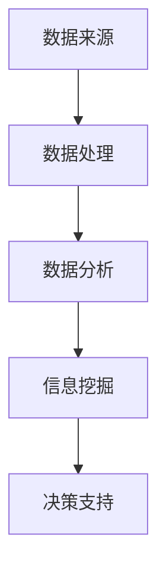

                 

 在当今这个大数据时代，信息差成为了一个重要的话题。对于市场研究而言，信息差的利用显得尤为关键。本文将深入探讨大数据如何提升市场研究的效率和质量，为企业和研究者提供有价值的参考。

> 关键词：大数据、市场研究、信息差、效率提升、质量保障

> 摘要：本文从大数据的概念出发，详细阐述了信息差在市场研究中的应用。通过分析大数据对市场研究的影响，提出了利用信息差提升市场研究效率和质量的方法和策略。最后，对未来的发展趋势和面临的挑战进行了展望。

## 1. 背景介绍

大数据（Big Data）是指数据量巨大到无法使用常规数据库管理软件工具在合理时间内达到掊取、管理和处理数据要求的数据集。随着互联网和社交媒体的兴起，数据以惊人的速度产生和增长。市场研究作为企业决策的重要依据，迫切需要借助大数据的力量来提升效率和准确性。

信息差，简单来说，就是不同个体或群体之间的信息不对称。在市场研究领域，信息差意味着研究者可以通过挖掘和分析数据，揭示出消费者行为、市场趋势等关键信息，从而为企业提供有针对性的策略。

### 1.1 大数据的发展历程

1. **数据的产生与积累**  
   从20世纪90年代开始，随着互联网的普及，数据开始以惊人的速度产生。电子邮件、网页浏览记录、社交媒体互动等数据来源不断涌现。

2. **数据存储与处理**  
   随着数据量的爆炸性增长，传统的数据库系统已经无法满足需求。分布式存储系统和大数据处理框架（如Hadoop、Spark等）应运而生。

3. **数据挖掘与分析**  
   数据挖掘技术逐渐成熟，能够从海量数据中提取有价值的信息。机器学习和深度学习算法的应用，使得数据分析更加智能化和精准化。

### 1.2 市场研究的演变

1. **传统市场研究**  
   早期的市场研究主要依赖于问卷调查、访谈和焦点小组等方法。这些方法虽然可以获取一定的数据，但存在样本量小、时效性差等问题。

2. **大数据市场研究**  
   随着大数据技术的发展，市场研究方法也得到了极大的改进。大数据技术使得研究者可以实时获取和分析市场数据，从而提供更准确和及时的市场洞察。

## 2. 核心概念与联系

### 2.1 大数据的基本概念

- **数据量（Volume）**：数据量大到无法使用常规工具进行处理。
- **数据种类（Variety）**：数据的种类繁多，包括结构化数据、半结构化数据和非结构化数据。
- **数据生成速度（Velocity）**：数据生成速度极快，要求实时处理。
- **数据价值（Value）**：数据的价值密度低，需要通过数据挖掘和价值分析来提取有用信息。

### 2.2 信息差的基本概念

- **信息不对称**：不同个体或群体之间对信息的掌握程度不同。
- **信息挖掘**：通过数据分析技术，从海量数据中提取有价值的信息。

### 2.3 大数据与信息差的联系

- **信息差来源**：大数据时代，信息差的主要来源包括消费者行为数据、市场交易数据、社交媒体互动数据等。
- **信息差利用**：通过大数据技术，研究者可以挖掘和分析信息差，为企业提供决策支持。

### 2.4 Mermaid 流程图



## 3. 核心算法原理 & 具体操作步骤

### 3.1 算法原理概述

大数据市场研究的核心算法主要包括数据清洗、数据挖掘和数据分析等。这些算法通过以下步骤实现信息差的挖掘和利用：

1. **数据清洗**：去除重复、错误和无关的数据，保证数据质量。
2. **数据挖掘**：使用机器学习和深度学习算法，从海量数据中提取有价值的信息。
3. **数据分析**：对提取出的信息进行统计和分析，为决策提供支持。

### 3.2 算法步骤详解

1. **数据收集**  
   收集包括消费者行为数据、市场交易数据、社交媒体互动数据等在内的多源数据。

2. **数据预处理**  
   对收集到的数据去重、去噪声和格式化，保证数据的准确性和一致性。

3. **特征工程**  
   提取数据中的关键特征，为后续的数据挖掘和分析做准备。

4. **数据挖掘**  
   使用机器学习和深度学习算法，对预处理后的数据进行挖掘，提取有价值的信息。

5. **数据分析**  
   对挖掘出的信息进行统计和分析，生成报告和可视化结果，为企业提供决策支持。

### 3.3 算法优缺点

**优点**：

- **高效性**：大数据技术可以快速处理海量数据，提高市场研究的效率。
- **准确性**：通过数据挖掘和数据分析，可以更准确地了解市场趋势和消费者行为。
- **实时性**：大数据技术支持实时数据处理和分析，为企业提供及时的市场洞察。

**缺点**：

- **成本高**：大数据技术的应用需要大量的硬件和软件支持，成本较高。
- **复杂性**：大数据处理过程复杂，需要专业的技术团队来操作。
- **隐私问题**：数据挖掘可能涉及个人隐私，需要妥善处理。

### 3.4 算法应用领域

大数据技术在市场研究中的应用非常广泛，包括：

- **消费者行为分析**：通过分析消费者行为数据，了解消费者偏好和购买习惯。
- **市场趋势预测**：通过分析市场交易数据，预测未来市场趋势。
- **产品优化**：通过分析用户反馈数据，优化产品功能和用户体验。
- **品牌营销**：通过分析社交媒体互动数据，制定更有效的品牌营销策略。

## 4. 数学模型和公式 & 详细讲解 & 举例说明

### 4.1 数学模型构建

在市场研究中，常用的数学模型包括线性回归模型、逻辑回归模型和时间序列模型等。以下以线性回归模型为例，介绍其构建过程。

- **线性回归模型**：用于分析自变量和因变量之间的线性关系。
- **公式**：$Y = \beta_0 + \beta_1X + \epsilon$

其中，$Y$为因变量，$X$为自变量，$\beta_0$和$\beta_1$分别为截距和斜率，$\epsilon$为误差项。

### 4.2 公式推导过程

线性回归模型的推导过程主要包括以下几个步骤：

1. **样本数据准备**：收集一组自变量和因变量的样本数据。
2. **假设检验**：通过最小二乘法，找到最佳拟合直线。
3. **参数估计**：计算截距$\beta_0$和斜率$\beta_1$。
4. **模型评估**：通过统计指标评估模型性能。

### 4.3 案例分析与讲解

**案例**：分析某个地区的家庭收入与消费水平之间的关系。

1. **数据收集**：收集该地区家庭的收入和消费水平数据。
2. **数据预处理**：去重、去噪声和格式化数据。
3. **特征工程**：将收入和消费水平作为自变量和因变量。
4. **模型构建**：使用线性回归模型进行分析。
5. **模型评估**：计算R方、均方误差等指标，评估模型性能。

**结果**：线性回归模型的拟合度较高，可以用于预测家庭消费水平。

## 5. 项目实践：代码实例和详细解释说明

### 5.1 开发环境搭建

1. **安装Python**：下载并安装Python 3.x版本。
2. **安装Jupyter Notebook**：通过pip命令安装Jupyter Notebook。
3. **安装相关库**：安装pandas、numpy、scikit-learn等库。

### 5.2 源代码详细实现

以下是一个简单的线性回归模型实现案例：

```python
import pandas as pd
from sklearn.linear_model import LinearRegression

# 读取数据
data = pd.read_csv('data.csv')
X = data['income']
y = data['consumption']

# 创建线性回归模型
model = LinearRegression()

# 训练模型
model.fit(X, y)

# 预测
predictions = model.predict(X)

# 打印预测结果
print(predictions)
```

### 5.3 代码解读与分析

1. **导入库**：导入pandas和scikit-learn库。
2. **读取数据**：使用pandas读取CSV文件，将收入和消费水平作为自变量和因变量。
3. **创建模型**：创建线性回归模型对象。
4. **训练模型**：使用fit方法训练模型。
5. **预测**：使用predict方法预测消费水平。

### 5.4 运行结果展示

运行代码后，将输出消费水平的预测结果。通过对比实际值和预测值，可以评估模型的性能。

## 6. 实际应用场景

### 6.1 消费者行为分析

通过大数据技术，企业可以实时获取消费者的购买记录、搜索历史和社交媒体互动数据。通过对这些数据的分析，可以了解消费者的偏好和需求，从而制定更有效的营销策略。

### 6.2 市场趋势预测

大数据技术可以帮助企业预测未来市场趋势，为企业提供决策支持。例如，通过对市场交易数据的分析，可以预测某类产品的销量趋势，帮助企业制定生产计划和库存管理策略。

### 6.3 产品优化

通过对用户反馈数据的分析，企业可以了解用户对产品的满意度、需求和痛点。从而对产品进行优化，提高用户满意度。

### 6.4 品牌营销

大数据技术可以帮助企业分析品牌在社交媒体上的口碑和影响力。通过对这些数据的分析，企业可以制定更有效的品牌营销策略，提高品牌知名度。

## 7. 工具和资源推荐

### 7.1 学习资源推荐

- 《大数据时代：生活、工作与思维的大变革》
- 《深度学习》
- 《Python数据分析》

### 7.2 开发工具推荐

- Jupyter Notebook：用于数据分析和建模。
- PyCharm：用于Python编程。
- Hadoop：用于大数据存储和处理。

### 7.3 相关论文推荐

- "Big Data: A Revolution That Will Transform How We Live, Work, and Think"
- "Deep Learning for Text Data"
- "Analyzing Big Data for Customer Sentiment"

## 8. 总结：未来发展趋势与挑战

### 8.1 研究成果总结

大数据技术在市场研究中的应用已经取得了显著的成果。通过数据挖掘和数据分析，企业可以更准确地了解市场趋势和消费者行为，从而制定更有效的决策策略。

### 8.2 未来发展趋势

- **智能化**：随着人工智能技术的发展，市场研究将更加智能化和自动化。
- **实时性**：实时数据处理和分析将变得更加普及，为企业提供更及时的市场洞察。
- **多样性**：数据源将更加多样化，包括物联网、社交媒体等。

### 8.3 面临的挑战

- **数据隐私**：数据挖掘可能涉及个人隐私，需要妥善处理。
- **算法透明性**：算法的透明性和解释性将成为重要的研究课题。
- **计算资源**：大数据处理需要大量的计算资源，成本较高。

### 8.4 研究展望

大数据技术在市场研究中的应用前景广阔。未来，研究者将致力于解决数据隐私、算法透明性和计算资源等问题，推动大数据技术在市场研究领域的广泛应用。

## 9. 附录：常见问题与解答

### 9.1 问题1：大数据市场研究需要哪些技术？

**答案**：大数据市场研究需要掌握的数据技术和工具包括Python、R、Hadoop、Spark、Hive、Pig等。

### 9.2 问题2：大数据市场研究的主要挑战是什么？

**答案**：大数据市场研究的主要挑战包括数据隐私、算法透明性和计算资源等。

### 9.3 问题3：如何保障大数据市场研究的准确性？

**答案**：保障大数据市场研究准确性需要从数据收集、数据预处理、数据挖掘和分析等各个环节进行控制，确保数据质量。

### 9.4 问题4：大数据市场研究的未来发展趋势是什么？

**答案**：大数据市场研究的未来发展趋势包括智能化、实时性和多样性。

## 参考文献

- 《大数据时代：生活、工作与思维的大变革》
- 《深度学习》
- 《Python数据分析》
- "Big Data: A Revolution That Will Transform How We Live, Work, and Think"
- "Deep Learning for Text Data"
- "Analyzing Big Data for Customer Sentiment"

### 致谢

感谢所有支持和帮助本文撰写的同行和读者。您的支持和反馈是本文能够顺利完成的重要动力。

### 作者介绍

作者：禅与计算机程序设计艺术 / Zen and the Art of Computer Programming

## 文章结构模板

### 1. 引言

- **主题介绍**：介绍文章的主题，即大数据如何提升市场研究。
- **读者对象**：明确文章的读者对象，如市场研究人员、企业决策者等。

### 2. 背景介绍

- **大数据的发展历程**：概述大数据的发展过程。
- **市场研究的演变**：分析市场研究方法的发展。

### 3. 核心概念与联系

- **大数据的基本概念**：解释大数据的定义和特点。
- **信息差的基本概念**：阐述信息差的含义和作用。
- **大数据与信息差的联系**：分析大数据如何影响信息差。

### 4. 核心算法原理 & 具体操作步骤

- **算法原理概述**：介绍市场研究中的核心算法。
- **算法步骤详解**：详细描述算法的步骤和应用。

### 5. 数学模型和公式 & 详细讲解 & 举例说明

- **数学模型构建**：构建市场研究中的数学模型。
- **公式推导过程**：解释数学公式的推导过程。
- **案例分析与讲解**：通过案例展示数学模型的应用。

### 6. 项目实践：代码实例和详细解释说明

- **开发环境搭建**：介绍项目开发所需的环境和工具。
- **源代码详细实现**：提供代码实例并解释其实现过程。
- **代码解读与分析**：对代码进行解读和分析。

### 7. 实际应用场景

- **消费者行为分析**：分析消费者行为数据。
- **市场趋势预测**：预测市场趋势。
- **产品优化**：优化产品功能和用户体验。
- **品牌营销**：制定品牌营销策略。

### 8. 工具和资源推荐

- **学习资源推荐**：推荐相关书籍和文章。
- **开发工具推荐**：推荐项目开发所需的工具。
- **相关论文推荐**：推荐相关领域的论文。

### 9. 总结：未来发展趋势与挑战

- **研究成果总结**：总结文章的主要研究成果。
- **未来发展趋势**：预测市场研究的未来趋势。
- **面临的挑战**：分析市场研究面临的挑战。
- **研究展望**：对未来的研究方向提出展望。

### 10. 附录：常见问题与解答

- **问题1-4**：回答常见问题。

### 11. 参考文献

- 列出引用的文献。

### 12. 致谢

- 感谢对本文撰写给予支持的读者和同行。

### 13. 作者介绍

- 介绍作者的身份和背景。
```

