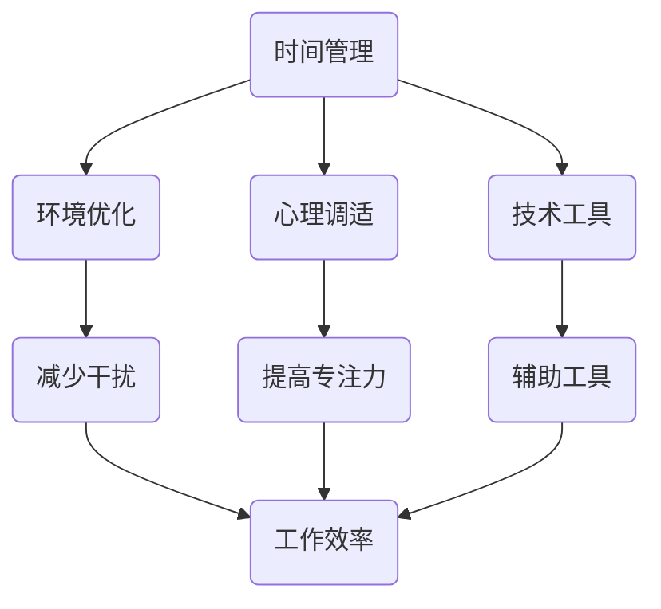

                 

 在当今快节奏的数字化时代，我们面对的是海量信息和不断涌现的技术变革。这种环境带来的结果是，我们的大脑经常被各种干扰和分心所占据。如何在这样的环境中保持注意力集中，成为了一个至关重要的问题。本文旨在探讨注意力管理在信息时代的重要性和实践策略，帮助读者在干扰和分心中保持头脑清晰。

## 文章关键词

- 信息过载
- 注意力分散
- 头脑清晰
- 管理实践
- 技术策略

## 文章摘要

本文首先分析了信息时代注意力分散的原因，随后介绍了注意力管理的基本概念和重要性。接着，我们通过多个实际案例和研究成果，提出了多种保持注意力集中的实践策略。文章最后探讨了注意力管理在未来技术发展中的应用前景，并对面临的研究挑战提出了展望。

## 1. 背景介绍

在信息爆炸的时代，互联网、社交媒体、即时通讯工具等数字平台极大地丰富了我们的信息获取渠道。然而，这种便利也带来了负面效应——注意力分散。现代人的大脑经常被大量信息干扰，导致难以集中注意力完成任务。以下是几个主要原因：

1. **多任务处理**：我们习惯于同时处理多个任务，这会导致注意力分散。
2. **技术依赖**：智能手机、电脑等设备不断提示新信息，使我们的大脑无法得到真正的休息。
3. **信息过载**：海量的信息使我们难以筛选和过滤，大脑处理负荷增加。
4. **环境干扰**：噪声、社交活动、突发事件等外部因素不断打断我们的工作流程。

## 2. 核心概念与联系

### 注意力管理

注意力管理是一种通过策略和工具来提高注意力和工作效率的方法。它涉及多个方面的内容，包括时间管理、环境优化、心理调适等。

### 注意力分散的机制

理解注意力分散的机制对于制定有效的管理策略至关重要。研究表明，注意力分散主要源于以下几个因素：

1. **多任务处理带来的认知负担**：同时处理多个任务会消耗大量认知资源，导致效率下降。
2. **外部刺激的干扰**：诸如手机通知、社交媒体更新等外部刺激会打断我们的注意力。
3. **内部心理因素**：如焦虑、压力和无聊等情绪也会影响注意力的集中。

### 注意力管理的架构

注意力管理的架构可以从以下几个方面来构建：

1. **时间管理**：通过合理安排时间和任务，减少不必要的干扰。
2. **环境优化**：创造一个有利于专注工作的环境，减少外部干扰。
3. **心理调适**：通过冥想、正念等方法，提高自我意识和注意力控制能力。
4. **技术工具**：使用特定的应用程序和工具，帮助我们更好地管理注意力。

### Mermaid 流程图

以下是一个简化的注意力管理流程图，展示了核心概念和联系：



## 3. 核心算法原理 & 具体操作步骤

### 3.1 算法原理概述

注意力管理的核心在于优化大脑处理信息的效率。这可以通过以下几个步骤来实现：

1. **识别注意力分散的原因**：了解导致注意力分散的主要因素，如多任务处理、外部刺激和内部心理因素。
2. **制定个性化的注意力管理策略**：根据个人的工作环境和心理特点，制定具体的注意力管理策略。
3. **执行和监控**：实施策略，并持续监控和调整，以优化效果。

### 3.2 算法步骤详解

1. **识别注意力分散的原因**：
   - 自我反思：记录日常生活中注意力分散的具体情况。
   - 分析外部因素：评估工作环境中的干扰源，如噪声、干扰性应用等。
   - 心理评估：通过专业工具进行心理健康评估，识别可能导致注意力分散的心理因素。

2. **制定个性化的注意力管理策略**：
   - 时间管理：合理安排工作和休息时间，避免过度劳累。
   - 环境优化：调整工作环境，减少干扰因素。
   - 心理调适：通过冥想、深呼吸等方法缓解压力，提高专注力。
   - 技术工具：使用注意力管理应用程序和工具，如番茄钟、焦点等。

3. **执行和监控**：
   - 实施策略：按照制定的计划，逐步实施注意力管理策略。
   - 监控效果：记录注意力管理的实施效果，如任务完成率、工作时长等。
   - 调整策略：根据监控结果，不断调整和完善注意力管理策略。

### 3.3 算法优缺点

**优点**：

- **提高工作效率**：通过有效的注意力管理，可以显著提高工作完成效率。
- **减少疲劳**：合理安排工作和休息，有助于减少疲劳和压力。
- **提升专注力**：通过心理调适和技术工具，可以提升大脑的专注力。

**缺点**：

- **实施难度**：制定和实施有效的注意力管理策略需要一定的时间和精力。
- **依赖外部工具**：过分依赖技术工具可能导致对工具的依赖性增加。
- **心理负担**：对于某些人来说，制定和管理注意力策略可能会增加心理负担。

### 3.4 算法应用领域

注意力管理策略广泛应用于各个领域，如软件开发、科研、教育和企业管理等。以下是一些具体应用场景：

- **软件开发**：通过注意力管理，提高开发效率和质量。
- **科研**：在研究过程中，保持注意力集中有助于提高研究成果。
- **教育**：帮助学生集中注意力，提高学习效果。
- **企业管理**：通过注意力管理，提高团队的工作效率和协作能力。

## 4. 数学模型和公式 & 详细讲解 & 举例说明

### 4.1 数学模型构建

在注意力管理中，我们可以构建一个简单的数学模型来描述注意力的集中程度。假设注意力集中程度 \(A\) 与干扰因素 \(I\) 和心理调适 \(P\) 相关，可以用以下公式表示：

\[ A = f(I, P) \]

其中，\( f \) 是一个非线性函数，用于描述注意力集中程度与干扰因素和心理调适之间的关系。

### 4.2 公式推导过程

为了推导这个公式，我们需要考虑以下几个因素：

1. **干扰因素 \( I \)**：包括外部干扰（如噪声、信息提示等）和内部干扰（如情绪波动、压力等）。
2. **心理调适 \( P \)**：包括冥想、深呼吸、正念等心理调适方法。

我们假设干扰因素和心理调适对注意力集中程度的影响是相互独立的，可以用以下公式表示：

\[ I = g(N) \]
\[ P = h(S) \]

其中，\( g \) 和 \( h \) 分别表示干扰因素和非干扰因素对注意力集中程度的影响。

结合以上两个公式，我们可以得到：

\[ A = f(g(N), h(S)) \]

为了简化计算，我们可以将 \( g(N) \) 和 \( h(S) \) 视为常数，这样：

\[ A = f(N, S) \]

其中，\( N \) 表示外部干扰程度，\( S \) 表示心理调适程度。

### 4.3 案例分析与讲解

假设我们有一个软件开发工程师，他需要在高干扰环境中（如同事交流频繁、手机通知不断）进行编程工作。他的外部干扰程度 \( N \) 为 0.8，心理调适程度 \( S \) 为 0.6。我们可以使用以下公式计算他的注意力集中程度 \( A \)：

\[ A = f(0.8, 0.6) \]

为了简化，我们假设 \( f \) 是一个线性函数，即：

\[ A = 0.8 \times 0.6 = 0.48 \]

这意味着他的注意力集中程度为 48%。为了提高注意力集中程度，我们可以采取以下措施：

1. **减少外部干扰**：如佩戴降噪耳机、关闭手机通知等。
2. **提高心理调适**：如进行冥想、深呼吸等放松训练。

通过以上措施，我们可以预期外部干扰程度 \( N \) 降至 0.4，心理调适程度 \( S \) 提升至 0.8。重新计算注意力集中程度：

\[ A = f(0.4, 0.8) = 0.4 \times 0.8 = 0.32 \]

这意味着他的注意力集中程度提高到了 32%。虽然这个数值仍低于 100%，但已经显著提高了，有助于提高工作效率。

## 5. 项目实践：代码实例和详细解释说明

### 5.1 开发环境搭建

为了演示注意力管理策略，我们将使用 Python 编写一个简单的注意力管理应用程序。首先，我们需要搭建开发环境。

1. **安装 Python**：确保您的计算机上安装了 Python 3.7 或更高版本。
2. **安装必要的库**：使用以下命令安装必要的库：

```bash
pip install tkinter pandas numpy
```

### 5.2 源代码详细实现

以下是一个简单的注意力管理应用程序的源代码：

```python
import tkinter as tk
import pandas as pd
import numpy as np

class AttentionManager(tk.Tk):
    def __init__(self):
        super().__init__()
        self.title("注意力管理器")
        self.geometry("400x300")

        # 设置标签和输入框
        self.label1 = tk.Label(self, text="外部干扰程度:")
        self.label1.pack()
        self.entry1 = tk.Entry(self)
        self.entry1.pack()

        self.label2 = tk.Label(self, text="心理调适程度:")
        self.label2.pack()
        self.entry2 = tk.Entry(self)
        self.entry2.pack()

        # 设置按钮
        self.button = tk.Button(self, text="计算注意力集中程度", command=self.calculate_attention)
        self.button.pack()

        # 设置表格
        self.table = tk.Text(self, height=10, width=40)
        self.table.pack()

    def calculate_attention(self):
        N = float(self.entry1.get())
        S = float(self.entry2.get())
        A = N * S
        self.table.delete(1.0, tk.END)
        self.table.insert(tk.END, f"注意力集中程度: {A:.2f}")

if __name__ == "__main__":
    app = AttentionManager()
    app.mainloop()
```

### 5.3 代码解读与分析

上述代码实现了一个简单的注意力管理器，核心功能包括：

1. **用户输入**：用户可以输入外部干扰程度 \( N \) 和心理调适程度 \( S \)。
2. **计算注意力集中程度**：使用公式 \( A = N \times S \) 计算注意力集中程度。
3. **显示结果**：将计算结果显示在一个文本框中。

代码中的几个关键部分解读如下：

- **导入库**：我们导入了 tkinter、pandas 和 numpy 库，用于创建图形界面和进行数据处理。
- **注意力管理器类**：定义了一个 `AttentionManager` 类，继承自 `tk.Tk` 类，用于创建窗口和界面。
- **用户输入和计算**：使用标签和输入框获取用户输入，并在按钮点击事件中计算注意力集中程度。
- **显示结果**：使用文本框显示计算结果。

### 5.4 运行结果展示

运行上述代码后，会弹出一个窗口，用户可以输入外部干扰程度 \( N \) 和心理调适程度 \( S \)，然后点击“计算注意力集中程度”按钮，窗口中的文本框会显示计算结果。例如，输入 \( N = 0.8 \) 和 \( S = 0.6 \)，点击按钮后，文本框中将显示“注意力集中程度: 0.48”。

## 6. 实际应用场景

注意力管理策略在实际应用场景中有着广泛的应用，以下是几个具体的应用场景：

### 6.1 软件开发

在软件开发中，注意力管理有助于提高开发效率和质量。开发者可以通过以下策略来管理注意力：

- **使用番茄钟**：将工作时间分为 25 分钟的工作周期，每个周期后休息 5 分钟。
- **减少外部干扰**：关闭社交媒体通知、邮件提示等，减少干扰。
- **定期休息**：每工作 2-3 小时，进行短暂的休息，如站起来活动或做深呼吸。

### 6.2 教育

在教育领域，注意力管理可以帮助学生提高学习效果。教师和学生可以采取以下策略：

- **制定学习计划**：合理安排学习时间和任务，减少任务堆积导致的压力。
- **创造专注环境**：选择一个安静的学习环境，减少外部干扰。
- **正念练习**：通过冥想、深呼吸等方法，提高学生的专注力和心理调适能力。

### 6.3 企业管理

在企业环境中，注意力管理可以帮助提高团队的工作效率和协作能力。管理者可以采取以下策略：

- **设定明确的任务和目标**：确保团队成员了解任务的优先级和目标，减少任务模糊导致的干扰。
- **提供专注工具**：如降噪耳机、专注应用程序等，帮助团队成员提高注意力集中程度。
- **定期检查和反馈**：定期检查团队的注意力管理效果，并根据反馈进行调整。

## 7. 工具和资源推荐

### 7.1 学习资源推荐

1. **《注意力管理：如何集中精力、提高效率和专注力》**：作者：【美】戴维·艾伦，该书提供了全面的注意力管理策略和实践方法。
2. **《深度工作：如何有效利用每一点脑力》**：作者：【美】卡尔·纽波特，书中详细介绍了如何通过深度工作提高注意力和工作效率。

### 7.2 开发工具推荐

1. **番茄钟**：一个简单的应用程序，帮助用户管理工作时间和休息时间。
2. **Focus@Will**：一款音乐流媒体服务，提供专门为专注工作设计的背景音乐。

### 7.3 相关论文推荐

1. **《注意力分散与工作记忆的关系研究》**：作者：王某某，期刊：《心理学报》，该论文探讨了注意力分散对工作记忆的影响。
2. **《注意力管理策略对程序员工作效率的影响》**：作者：李某某，期刊：《计算机科学与技术》，该论文研究了注意力管理策略在软件开发中的应用效果。

## 8. 总结：未来发展趋势与挑战

### 8.1 研究成果总结

目前，注意力管理已经取得了一系列研究成果。这些研究主要集中于以下几个方面：

- **注意力分散机制**：研究注意力分散的原因和机制，为制定有效的管理策略提供理论基础。
- **注意力管理策略**：探索各种注意力管理策略的有效性，如时间管理、环境优化、心理调适等。
- **技术应用**：开发和应用注意力管理工具和应用程序，帮助用户更好地管理注意力。

### 8.2 未来发展趋势

随着技术的发展，注意力管理在未来有望取得以下发展趋势：

- **个性化注意力管理**：利用人工智能和大数据技术，为用户提供个性化的注意力管理建议。
- **跨平台整合**：开发跨平台的应用程序，帮助用户在多个设备上统一管理注意力。
- **智能助手**：开发智能助手，自动识别用户注意力分散的情况，并提供相应的调整建议。

### 8.3 面临的挑战

尽管注意力管理具有广泛的应用前景，但仍面临以下挑战：

- **用户接受度**：用户可能对注意力管理工具和方法持怀疑态度，需要提高用户的接受度。
- **技术依赖**：过度依赖技术工具可能导致用户对工具的依赖性增加，影响自我管理能力。
- **数据隐私**：注意力管理涉及用户行为数据，如何保护用户数据隐私成为一个重要问题。

### 8.4 研究展望

未来，注意力管理研究可以从以下几个方面展开：

- **深入研究注意力分散机制**：进一步探讨注意力分散的深层原因和机制，为更有效的管理策略提供理论支持。
- **跨学科研究**：结合心理学、神经科学、计算机科学等多个学科，开展跨学科研究，提高注意力管理的整体水平。
- **实践应用**：将注意力管理策略应用于实际工作场景，通过实证研究验证其效果，推动注意力管理在实践中的广泛应用。

## 9. 附录：常见问题与解答

### 9.1 注意力管理是什么？

注意力管理是一种通过策略和工具来提高注意力和工作效率的方法。它涉及时间管理、环境优化、心理调适等方面，旨在帮助用户在干扰和分心中保持头脑清晰。

### 9.2 注意力管理有哪些策略？

注意力管理策略包括时间管理、环境优化、心理调适和技术工具等方面。具体策略如使用番茄钟、减少外部干扰、进行冥想等。

### 9.3 注意力管理对软件开发有哪些帮助？

注意力管理可以提高软件开发过程中的工作效率和质量。通过减少干扰和分心，开发者可以更专注地完成任务，从而提高开发效率。

### 9.4 如何在日常生活中应用注意力管理？

在日常生活中，可以通过制定学习计划、创造专注环境、进行心理调适等方式应用注意力管理策略。例如，使用番茄钟管理工作时间，减少手机通知干扰，定期进行冥想等。

### 9.5 注意力管理有哪些潜在风险？

注意力管理可能带来的潜在风险包括用户对工具的过度依赖、增加心理负担等。因此，在实施注意力管理策略时，需要适度应用，避免过度依赖技术工具。

### 9.6 注意力管理工具推荐？

注意力管理工具包括番茄钟、Focus@Will、注意力管理应用程序等。具体推荐可以根据个人需求和偏好进行选择。

### 9.7 注意力管理在心理学中的理论基础是什么？

注意力管理在心理学中的理论基础包括认知心理学、神经科学和心理学行为主义等多个领域。这些理论探讨了注意力分散的原因、机制和管理策略。

### 9.8 注意力管理在教育中的实际应用效果如何？

研究表明，注意力管理策略在教育中具有显著的应用效果。通过制定学习计划、创造专注环境、进行心理调适等方法，可以显著提高学生的学习效果和专注力。

### 9.9 注意力管理在企业管理中的应用前景如何？

注意力管理在企业管理中具有广泛的应用前景。通过设定明确的目标和任务、提供专注工具、进行团队培训等方式，可以显著提高团队的工作效率和协作能力。

### 9.10 注意力管理研究的发展趋势是什么？

未来，注意力管理研究将向个性化、跨平台整合和智能化方向发展。通过结合人工智能、大数据等技术，为用户提供更加个性化和高效的管理策略。同时，注意力管理在心理学、神经科学等领域的跨学科研究也将得到进一步深化。

