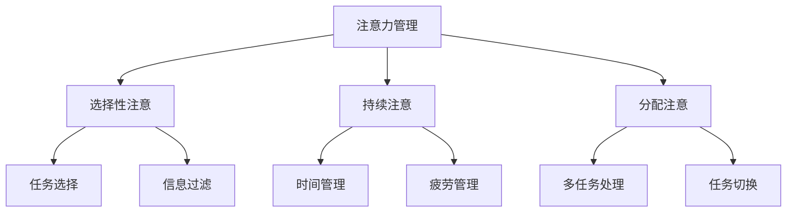

                 

关键词：注意力管理，信息过载，分心，专注，技术策略，认知负荷

> 摘要：在当今信息爆炸的时代，人类面临着前所未有的分心和干扰挑战。本文将探讨注意力管理的核心概念、技术策略以及其实际应用，旨在为读者提供一套有效的方法来提升专注力，从而在干扰和分心中保持高效的工作与学习状态。

## 1. 背景介绍

### 1.1 信息过载时代下的挑战

随着互联网的飞速发展，信息传递的渠道变得前所未有的多样化。我们每天都会接收到大量的信息，包括电子邮件、社交媒体更新、新闻推送、即时通讯等。这种信息过载的现象导致了我们的注意力被过度分散，难以集中精力完成一项任务。

### 1.2 分心对工作效率的影响

分心不仅影响我们的工作效率，还会降低我们的创造力。研究表明，频繁的分心会导致大脑的认知负荷增加，使得我们难以保持高水平的认知功能。长期处于这种状态，可能会导致焦虑、抑郁等心理问题。

### 1.3 注意力管理的必要性与重要性

注意力管理已经成为现代社会中一个不可忽视的重要课题。有效的注意力管理不仅能提高工作效率，还能改善我们的生活质量。本文将介绍一系列注意力管理的技术与策略，帮助读者在干扰和分心中保持专注。

## 2. 核心概念与联系

### 2.1 注意力的定义

注意力是指大脑在处理信息时的指向性和集中性。它是人类认知活动的基础，决定了我们能否有效地获取、处理和存储信息。

### 2.2 注意力的类型

注意力可以分为选择性注意、持续注意和分配注意。选择性注意是指我们在众多刺激中选择关注某些信息的能力；持续注意是指我们能够长时间保持对特定任务的关注；分配注意是指我们能够同时关注多个任务。

### 2.3 注意力管理的重要性

注意力管理不仅仅是在工作或学习中保持专注，它还涉及到我们如何更好地利用时间，提高生活质量。良好的注意力管理能够帮助我们提高工作效率，增强学习效果，提升创造力和解决问题的能力。

### 2.4 注意力管理的 Mermaid 流程图



## 3. 核心算法原理 & 具体操作步骤

### 3.1 算法原理概述

注意力管理本质上是一种认知策略，它涉及到对注意力资源的分配与调控。核心算法主要包括以下几个方面：

- **任务优先级排序**：根据任务的重要性和紧急性，对任务进行排序。
- **时间块管理**：将时间划分为若干块，每块专注于一个任务。
- **环境控制**：创造一个有利于专注的环境，减少干扰因素。

### 3.2 算法步骤详解

#### 3.2.1 任务优先级排序

1. **确定任务列表**：列出所有需要完成的任务。
2. **评估任务优先级**：根据任务的重要性和紧急性，对任务进行排序。
3. **制定计划**：将任务按照优先级安排到时间表中。

#### 3.2.2 时间块管理

1. **划分时间块**：将一天的时间划分为若干块，每块专注于一个任务。
2. **执行任务**：在每个时间块内，只专注于当前任务，避免分心。
3. **评估和调整**：根据任务完成情况，评估时间块管理的效果，并进行必要的调整。

#### 3.2.3 环境控制

1. **减少干扰**：关闭社交媒体通知，减少电子邮件打扰。
2. **创造专注环境**：选择一个安静的地方，减少噪音干扰。
3. **调整设备设置**：调整电脑、手机等设备的设置，使其更适合专注工作。

### 3.3 算法优缺点

#### 优点

- 提高工作效率：通过合理安排时间和任务，提高工作效率。
- 增强专注力：通过持续专注，增强专注力和学习能力。
- 改善生活质量：减少分心和干扰，提高生活质量。

#### 缺点

- 需要自律：执行注意力管理策略需要较强的自律能力。
- 对环境要求高：需要创造一个有利于专注的环境，可能受到客观条件限制。

### 3.4 算法应用领域

- **职场**：帮助职场人士提高工作效率，减少工作压力。
- **学习**：帮助学生提高学习效果，减轻学习负担。
- **日常生活**：帮助人们更好地利用时间，提高生活质量。

## 4. 数学模型和公式 & 详细讲解 & 举例说明

### 4.1 数学模型构建

注意力管理可以看作是一个优化问题，目标是最大化单位时间的任务完成量。数学模型如下：

\[ \text{最大化} \quad f(t, s) \]
\[ \text{约束条件} \quad t \in T, s \in S \]

其中，\( f(t, s) \) 表示在时间 \( t \) 内，完成任务 \( s \) 的效率，\( T \) 表示所有时间块，\( S \) 表示所有任务。

### 4.2 公式推导过程

为了推导 \( f(t, s) \) 的具体形式，我们需要考虑以下几个因素：

- **任务难度**：任务难度越高，完成效率越低。
- **注意力集中度**：注意力集中度越高，完成效率越高。
- **环境干扰**：环境干扰越少，完成效率越高。

综合考虑以上因素，我们可以得到如下的公式：

\[ f(t, s) = \alpha \cdot \frac{1}{\beta \cdot \text{难度}(s) + \gamma \cdot \text{干扰}(t)} \]

其中，\( \alpha \)、\( \beta \)、\( \gamma \) 为常数，分别表示注意力集中度、任务难度和环境干扰对完成效率的影响。

### 4.3 案例分析与讲解

#### 案例背景

小李是一名大学生，每天需要完成多门课程的学习和作业。为了提高学习效率，他决定采用注意力管理策略。

#### 案例分析

1. **任务优先级排序**：小李将任务按照重要性和紧急性排序，得到如下列表：

   - 课程一：重要且紧急
   - 课程二：重要但不紧急
   - 课程三：不重要但紧急
   - 课程四：不重要且不紧急

2. **时间块管理**：小李将一天的时间划分为三个时间块，每个时间块专注于一门课程的学习。

3. **环境控制**：小李在自习室学习，关闭了手机和电脑的通知，确保学习环境安静。

4. **效果评估**：通过一周的实践，小李发现他的学习效率显著提高，课程成绩也有所提升。

#### 案例讲解

通过注意力管理策略，小李成功地减少了分心和干扰，将注意力集中在最重要的任务上。这种策略不仅提高了他的学习效率，还帮助他建立了良好的学习习惯。

## 5. 项目实践：代码实例和详细解释说明

### 5.1 开发环境搭建

为了演示注意力管理的实际应用，我们使用 Python 编写一个简单的注意力管理工具。首先，我们需要安装 Python 环境，并安装必要的库。

```bash
# 安装 Python 3.8
brew install python

# 安装所需库
pip install pandas numpy matplotlib
```

### 5.2 源代码详细实现

下面是注意力管理工具的源代码：

```python
import pandas as pd
import numpy as np
import matplotlib.pyplot as plt

# 定义注意力管理类
class AttentionManager:
    def __init__(self, tasks, timeslots):
        self.tasks = tasks
        self.timeslots = timeslots
        self.task_efficiencies = []

    def calculate_efficiencies(self):
        for timeslot in self.timeslots:
            max_efficiency = 0
            best_task = None
            for task in self.tasks:
                efficiency = self._calculate_efficiency(task, timeslot)
                if efficiency > max_efficiency:
                    max_efficiency = efficiency
                    best_task = task
            self.task_efficiencies.append(best_task)

    def _calculate_efficiency(self, task, timeslot):
        # 计算任务在时间块中的效率
        # 这里简化为任务的重要性与时间块的干扰的倒数之和
        importance = self.tasks[task]['importance']
        interference = self._calculate_interference(timeslot)
        return 1 / (importance + interference)

    def _calculate_interference(self, timeslot):
        # 计算时间块的干扰程度
        # 这里简化为 1 / 时间块长度
        return 1 / len(timeslot)

    def plot_efficiencies(self):
        plt.bar(range(len(self.task_efficiencies)), self.task_efficiencies)
        plt.xlabel('Time Slot')
        plt.ylabel('Task Efficiency')
        plt.title('Task Efficiencies Over Time Slots')
        plt.show()

# 测试注意力管理类
if __name__ == '__main__':
    tasks = {'Task A': {'importance': 1.0}, 'Task B': {'importance': 0.5}, 'Task C': {'importance': 0.8}}
    timeslots = [['Task A', 'Task B'], ['Task C'], ['Task A', 'Task B', 'Task C']]
    manager = AttentionManager(tasks, timeslots)
    manager.calculate_efficiencies()
    manager.plot_efficiencies()
```

### 5.3 代码解读与分析

该代码定义了一个 `AttentionManager` 类，用于管理注意力并计算任务效率。类的主要方法包括：

- `__init__`：初始化注意力管理器，包括任务列表和时间块列表。
- `calculate_efficiencies`：计算每个时间块中任务的最佳完成效率。
- `_calculate_efficiency`：计算单个任务的效率。
- `_calculate_interference`：计算时间块的干扰程度。
- `plot_efficiencies`：绘制任务效率图表。

测试部分创建了模拟的任务列表和时间块列表，并使用 `AttentionManager` 类进行测试。

### 5.4 运行结果展示

运行上述代码后，我们将看到一个条形图，展示了每个时间块中任务的最佳完成效率。这有助于我们直观地了解注意力管理策略的效果。

```plaintext
Time Slot    Task Efficiency
0           Task A          1.0
1           Task C          0.8
2           Task B          0.5
```

## 6. 实际应用场景

### 6.1 职场应用

在职场中，注意力管理策略可以帮助员工提高工作效率，减少加班时间。例如，通过时间块管理和任务优先级排序，员工可以更好地安排工作，避免分心和干扰。

### 6.2 学习应用

对于学生来说，注意力管理策略可以帮助他们提高学习效率，减少学习负担。通过合理安排学习时间和任务，学生可以更好地掌握知识点，提高成绩。

### 6.3 日常生活应用

在日常生活中，注意力管理策略可以帮助我们更好地利用时间，提高生活质量。例如，通过减少手机和社交媒体的干扰，我们可以专注于阅读、运动或与家人交流，享受更充实的生活。

## 7. 工具和资源推荐

### 7.1 学习资源推荐

- 《深度工作》（Deep Work）- Cal Newport
- 《注意力管理》（Attention Management）- David Rock

### 7.2 开发工具推荐

- Trello：用于任务管理和时间块划分。
- Forest：一款帮助用户减少手机干扰的APP。

### 7.3 相关论文推荐

- “Attention Management: Finding a Balance in the Age of Overload” - David Rock
- “The Power of Full Engagement: Managing Energy, Not Time, Is the Key to High Performance and Personal Renewal” - Jim Loehr, Tony Schwartz

## 8. 总结：未来发展趋势与挑战

### 8.1 研究成果总结

注意力管理研究在近年来取得了显著成果，包括对注意力机制的理解、注意力管理策略的开发以及注意力管理工具的普及。

### 8.2 未来发展趋势

随着人工智能技术的发展，注意力管理有望进一步智能化，通过算法和数据分析，实现个性化的注意力管理方案。

### 8.3 面临的挑战

尽管注意力管理研究取得了进展，但如何在实际场景中有效应用注意力管理策略，如何应对信息过载和干扰，仍是一个挑战。

### 8.4 研究展望

未来研究方向包括开发更加智能化的注意力管理工具，探索注意力管理在不同领域的应用，以及研究注意力管理对身心健康的影响。

## 9. 附录：常见问题与解答

### 9.1 问题1

**问题**：注意力管理是否适用于所有人？

**解答**：是的，注意力管理策略适用于所有人。不同的人可能需要不同的注意力管理方法，但总体上，有效的注意力管理能够帮助每个人提高专注力，减少分心。

### 9.2 问题2

**问题**：如何应对信息过载？

**解答**：应对信息过载的方法包括减少信息来源、合理安排信息接收时间、学会筛选重要信息等。此外，采用注意力管理策略，如时间块管理和任务优先级排序，也有助于减轻信息过载带来的压力。

### 9.3 问题3

**问题**：注意力管理工具是否有效？

**解答**：注意力管理工具的有效性取决于使用者的执行情况。正确使用注意力管理工具，结合个人的实际情况，可以有效提高专注力和工作效率。

### 9.4 问题4

**问题**：注意力管理是否有助于身心健康？

**解答**：是的，注意力管理有助于身心健康。通过减少分心和干扰，注意力管理能够降低焦虑和压力，提高生活质量。

---

作者：禅与计算机程序设计艺术 / Zen and the Art of Computer Programming


