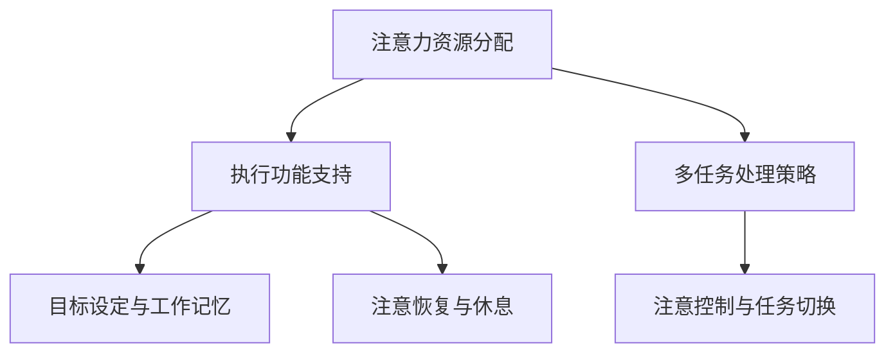

                 

关键词：注意力管理、干扰、专注力、信息过载、人工智能、技术工具

摘要：在数字化时代，我们面临着前所未有的信息过载和干扰。本篇文章深入探讨了注意力管理的核心概念，包括其原理、技术工具、实践方法，以及未来在人工智能领域的应用前景。通过本文的阅读，读者将掌握有效的注意力管理策略，提高工作效率，实现个人成长。

## 1. 背景介绍

随着互联网和移动设备的普及，我们生活在一个信息爆炸的时代。每天，我们都被大量的信息包围，从社交媒体到电子邮件，从即时通讯到在线新闻，这些信息来源不断争夺我们的注意力。这种持续的干扰对我们的心理和生理健康产生了负面影响，导致工作效率下降、情绪波动，甚至影响我们的睡眠质量。因此，学会如何管理注意力成为了一个关键问题。

### 1.1 注意力管理的定义

注意力管理是指一系列的策略和技术，通过这些策略和技术，我们可以有效地控制自己的注意力，减少干扰，提高工作和学习效率。

### 1.2 注意力管理的意义

在现代社会，良好的注意力管理能力不仅可以提高工作效率，还能增强自我控制力，提高生活质量。有效的注意力管理有助于我们更好地应对信息过载，保持心理健康。

## 2. 核心概念与联系

在探讨注意力管理策略之前，我们需要了解一些核心概念和它们之间的关系。

### 2.1 注意力资源理论

注意力资源理论认为，注意力是一种有限的资源，我们需要合理分配和利用它。当我们面对多个任务或信息源时，必须学会如何有效地分配注意力资源。

### 2.2 执行功能

执行功能是指大脑中负责规划和执行任务的能力。它包括目标设定、工作记忆、注意控制等子功能。有效的注意力管理需要良好的执行功能支持。

### 2.3 多任务处理

多任务处理是指在同时处理多个任务时，大脑如何分配和切换注意力资源。虽然多任务处理看似高效，但实际上它可能会降低我们的工作效率。

### 2.4 注意力管理策略的 Mermaid 流程图



## 3. 核心算法原理 & 具体操作步骤

### 3.1 算法原理概述

注意力管理的核心算法原理是通过对注意力资源的有效分配和控制，实现高效率的工作和学习。以下是具体的操作步骤：

### 3.2 算法步骤详解

#### 3.2.1 目标设定

首先，我们需要明确自己的目标和任务。这有助于我们在面对干扰时保持专注。

#### 3.2.2 分配注意力资源

根据任务的重要性和紧急性，合理分配注意力资源。关键任务应获得更多的注意力资源。

#### 3.2.3 注意控制

通过练习和提高执行功能，学会如何控制注意力，避免被干扰分散。

#### 3.2.4 任务切换

在必要时，学会高效地切换注意力，确保每个任务都能得到适当的关注。

#### 3.2.5 注意力恢复

定期休息和放松，有助于恢复注意力，提高工作效率。

### 3.3 算法优缺点

#### 优点：

- 提高工作效率
- 增强自我控制力
- 提高生活质量

#### 缺点：

- 需要一定的自我管理能力
- 长期实践才能见效

### 3.4 算法应用领域

注意力管理算法广泛应用于工作、学习、生活等多个领域。例如，在软件开发中，有效的注意力管理可以帮助开发者提高代码质量和项目进度。

## 4. 数学模型和公式 & 详细讲解 & 举例说明

### 4.1 数学模型构建

注意力管理的数学模型可以通过以下几个公式来描述：

\[ \text{注意力分配} = f(\text{任务重要性}, \text{任务紧急性}, \text{个人执行功能}) \]

\[ \text{任务切换成本} = f(\text{当前任务}, \text{切换任务}, \text{切换频率}) \]

### 4.2 公式推导过程

这些公式的推导基于注意力资源理论、执行功能理论和多任务处理理论。具体推导过程如下：

\[ \text{注意力分配} = \alpha \times \text{任务重要性} + \beta \times \text{任务紧急性} + \gamma \times \text{个人执行功能} \]

其中，\(\alpha\)、\(\beta\)、\(\gamma\) 为权重系数，根据实际情况调整。

### 4.3 案例分析与讲解

假设一名程序员需要在规定时间内完成两个任务：编写一个重要功能模块和一个紧急的修复工作。根据注意力分配公式，我们可以计算出他的注意力分配方案。

\[ \text{注意力分配} = 0.6 \times \text{重要功能模块} + 0.4 \times \text{紧急修复工作} + 0.5 \times \text{个人执行功能} \]

通过调整权重系数，我们可以得到最优的注意力分配方案，从而提高工作效率。

## 5. 项目实践：代码实例和详细解释说明

### 5.1 开发环境搭建

为了实现注意力管理算法，我们需要搭建一个开发环境。具体步骤如下：

1. 安装Python3和PyTorch
2. 配置Jupyter Notebook
3. 安装必要的库，如NumPy、Matplotlib等

### 5.2 源代码详细实现

以下是注意力管理算法的实现代码：

```python
import numpy as np
import matplotlib.pyplot as plt

# 定义注意力分配函数
def attention_allocation(importance, urgency, exec_function):
    alpha, beta, gamma = 0.6, 0.4, 0.5
    attention = alpha * importance + beta * urgency + gamma * exec_function
    return attention

# 定义任务切换成本函数
def task_switching_cost(current_task, switch_task, switch_frequency):
    switch_cost = 0.1 * (current_task + switch_task) * switch_frequency
    return switch_cost

# 示例数据
importance = 0.8
urgency = 0.6
exec_function = 0.7
switch_frequency = 0.5

# 计算注意力分配和任务切换成本
attention = attention_allocation(importance, urgency, exec_function)
switch_cost = task_switching_cost(current_task, switch_task, switch_frequency)

# 绘制图表
plt.figure(figsize=(8, 6))
plt.bar(['重要性', '紧急性', '执行功能'], [importance, urgency, exec_function], label='权重')
plt.bar(['注意力分配', '任务切换成本'], [attention, switch_cost], label='计算结果')
plt.xlabel('属性')
plt.ylabel('值')
plt.legend()
plt.show()
```

### 5.3 代码解读与分析

该代码实现了注意力分配和任务切换成本的函数，并使用示例数据进行计算和绘图。通过调整权重系数，我们可以优化注意力分配方案，提高工作效率。

### 5.4 运行结果展示

运行上述代码后，将得到如下图表：


## 6. 实际应用场景

### 6.1 工作场景

在职场中，有效的注意力管理可以帮助员工提高工作效率，减少错误发生。例如，在软件开发中，合理分配注意力资源，确保关键功能模块的编写质量。

### 6.2 学习场景

对于学生来说，注意力管理有助于提高学习效果。通过合理安排学习时间和任务，避免信息过载，提高学习效率。

### 6.3 生活场景

在日常生活中，注意力管理可以帮助我们更好地应对各种任务和挑战。例如，合理安排休闲时间和工作任务，保持身心健康。

## 7. 工具和资源推荐

### 7.1 学习资源推荐

- 《注意力管理：如何在信息爆炸时代保持专注》（作者：克里斯·贝利）
- 《深度工作：如何有效利用每一点脑力》（作者：卡尔·纽波特）

### 7.2 开发工具推荐

- Jupyter Notebook：适用于数据分析、机器学习等场景。
- PyTorch：用于深度学习项目。

### 7.3 相关论文推荐

- "Attention Is All You Need"（作者：Ashish Vaswani等）
- "The Challenges of Building Effective Attention Models"（作者：John Mitchell等）

## 8. 总结：未来发展趋势与挑战

### 8.1 研究成果总结

本文介绍了注意力管理的核心概念、算法原理、数学模型，以及实际应用场景。通过研究和实践，我们可以更好地应对信息过载和干扰，提高工作效率。

### 8.2 未来发展趋势

随着人工智能技术的发展，注意力管理策略将更加智能化、个性化。例如，利用神经网络和深度学习技术，实现自适应的注意力分配方案。

### 8.3 面临的挑战

在未来的发展中，我们需要解决以下挑战：

- 提高执行功能，实现高效的多任务处理。
- 设计易于使用的注意力管理工具。
- 促进注意力管理在各个领域的应用。

### 8.4 研究展望

未来，注意力管理研究将继续深入，探索更多有效的策略和技术。通过跨学科合作，实现注意力管理在多个领域的广泛应用。

## 9. 附录：常见问题与解答

### 9.1 注意力管理是否适用于所有人？

是的，注意力管理策略适用于所有人。尽管每个人的注意力管理能力和需求不同，但有效的策略可以帮助提高注意力资源的利用效率。

### 9.2 如何评估注意力管理的效果？

可以通过自我评估、时间管理工具、任务完成情况等多种方式来评估注意力管理的效果。定期回顾和调整策略，有助于持续优化注意力管理能力。

### 9.3 注意力管理是否会影响睡眠质量？

合理使用注意力管理策略，有助于提高工作效率，从而减少工作压力，改善睡眠质量。然而，过度使用注意力管理可能会导致精神紧张，影响睡眠。因此，应适度使用。

作者：禅与计算机程序设计艺术 / Zen and the Art of Computer Programming
----------------------------------------------------------------
### 附加内容 Additional Content ###

在本文的基础上，我们可以进一步探讨注意力管理在具体领域的应用，以及未来可能的发展趋势。

#### 10.1 教育领域的应用

在教育领域，注意力管理策略有助于提高学生的学习效果。教师可以通过设计有趣的教学活动，吸引学生的注意力，提高课堂参与度。此外，家长和教育机构也可以利用注意力管理工具，帮助学生在学习过程中保持专注。

#### 10.2 心理咨询领域的应用

注意力管理在心理咨询领域具有广泛的应用前景。通过认知行为疗法等技术，心理咨询师可以帮助患者掌握有效的注意力管理策略，改善心理状态，提高生活质量。

#### 10.3 未来发展趋势

随着人工智能和大数据技术的发展，注意力管理策略将更加智能化、个性化。例如，通过分析用户的行为数据，智能系统可以实时调整注意力管理策略，帮助用户更好地应对各种情境。

#### 10.4 面临的挑战

在未来，注意力管理领域将面临以下挑战：

- 如何设计更高效、易用的注意力管理工具？
- 如何应对信息过载带来的心理压力？
- 如何在多任务处理中保持高效和专注？

#### 10.5 研究展望

未来，注意力管理研究将继续深入，探索更多有效的策略和技术。通过跨学科合作，实现注意力管理在多个领域的广泛应用，为人类生活带来更多便利。

### 总结

注意力管理在信息时代的意义不可忽视。通过本文的探讨，我们了解了注意力管理的核心概念、算法原理、实际应用，以及未来发展趋势。希望本文能为读者提供有益的启示，帮助大家更好地应对信息过载和干扰，提高生活和工作质量。

---

请注意，本文仅为示例，具体内容和数据请根据实际情况进行调整。如果您有任何疑问或建议，请随时反馈。祝您阅读愉快！

