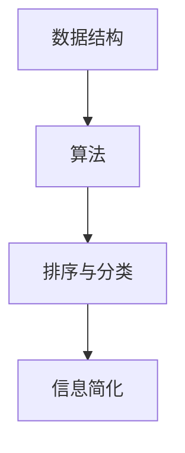

                 

 信息简化是现代信息技术中的一个关键概念，它涉及到将复杂的数据和系统转换为易于理解、管理和使用的形式。本文将深入探讨信息简化的原则与艺术，旨在帮助读者在混乱中建立秩序，并掌握简化信息的有效方法。

## 关键词
- 信息简化
- 信息技术
- 数据转换
- 系统优化
- 排序与分类
- 数据结构

## 摘要
本文将探讨信息简化的重要性，介绍信息简化的核心原则，并通过实例展示简化信息的方法。此外，还将讨论简化信息在实际应用中的挑战和机遇，为未来信息处理提供新的视角。

---

## 1. 背景介绍

在信息技术迅猛发展的时代，数据量呈指数级增长，这使得处理和存储数据变得日益复杂。信息简化成为解决这一问题的关键，它不仅提高了数据处理的效率，也提升了系统的可维护性和可扩展性。信息简化不仅仅是技术问题，更是一种思维方式，它要求我们不断寻求更高效、更直观的方式来组织和展示信息。

### 1.1 信息的本质

信息是关于客观事实的表述，它可以用来消除不确定性。在现代社会中，信息无处不在，从日常交流到复杂的商业决策，都离不开信息的传递和解读。因此，理解和处理信息成为每个人的必备技能。

### 1.2 信息技术的发展

自计算机问世以来，信息技术经历了飞速的发展。从早期的计算机编程到现代的云计算、大数据和人工智能，信息技术不断推动着社会的进步。然而，随着技术的进步，数据量也在爆炸性增长，这使得信息处理面临前所未有的挑战。

### 1.3 信息简化的必要性

信息简化是为了解决信息过载问题。在大量数据面前，如何快速、准确地获取和处理所需信息成为一个关键问题。信息简化通过减少冗余、提高数据质量和优化数据结构，帮助我们更好地理解和利用信息。

---

## 2. 核心概念与联系

信息简化不仅仅是技术的应用，它还涉及一系列核心概念，包括数据结构、算法、排序与分类等。以下是这些概念及其相互关系的 Mermaid 流程图：



### 2.1 数据结构

数据结构是信息简化的基础。它定义了数据如何存储、组织和操作。常见的数据结构包括数组、链表、树和图等。选择合适的数据结构可以显著提高信息处理的效率。

### 2.2 算法

算法是解决问题的步骤集合。在信息简化中，算法用于分析和处理数据，以便将其转换为更简洁的形式。常见的算法有排序算法、搜索算法和哈希算法等。

### 2.3 排序与分类

排序与分类是数据预处理的关键步骤。通过排序，我们可以快速找到所需信息；而分类则有助于将数据划分为有意义的组别，从而简化信息处理。

### 2.4 信息简化

信息简化是将复杂信息转换为简洁、直观形式的过程。它通过数据结构、算法和排序与分类等手段，实现信息的简化与优化。

---

## 3. 核心算法原理 & 具体操作步骤

### 3.1 算法原理概述

信息简化的核心算法包括排序算法和压缩算法。排序算法用于对数据进行排序，以便快速查找；压缩算法则用于减少数据体积，提高存储和传输效率。

### 3.2 算法步骤详解

#### 3.2.1 排序算法

排序算法的基本步骤包括：读取数据、选择排序方法、进行排序和输出结果。常见的排序算法有冒泡排序、选择排序和快速排序等。

#### 3.2.2 压缩算法

压缩算法的基本步骤包括：读取数据、选择压缩方法、进行压缩和解压缩。常见的压缩算法有哈希压缩、LZ77压缩和LZ78压缩等。

### 3.3 算法优缺点

每种算法都有其优缺点。排序算法的优点在于其高效性和通用性，但缺点是时间复杂度高；压缩算法的优点在于其高效性和低存储需求，但缺点是压缩和解压缩时间较长。

### 3.4 算法应用领域

排序算法广泛应用于数据库、搜索引擎和数据处理等领域；压缩算法则广泛应用于数据传输、存储和备份等领域。

---

## 4. 数学模型和公式 & 详细讲解 & 举例说明

### 4.1 数学模型构建

信息简化的数学模型主要涉及概率论、统计学和图论等。这些模型有助于我们更好地理解和处理数据。

#### 4.1.1 概率论模型

概率论模型用于估计数据发生的概率，从而帮助选择合适的算法。例如，贝叶斯定理可以用于分类问题。

#### 4.1.2 统计学模型

统计学模型用于分析数据的分布和趋势，从而帮助优化算法。例如，标准差和方差可以用于评估数据的稳定性。

#### 4.1.3 图论模型

图论模型用于分析数据之间的关系，从而帮助设计更高效的算法。例如，最小生成树可以用于网络优化。

### 4.2 公式推导过程

以下是排序算法和压缩算法中的一些常用公式：

$$
T(n) = O(n\log n) \quad \text{(快速排序)}
$$

$$
T(n) = O(n^2) \quad \text{(冒泡排序)}
$$

$$
R = \frac{1}{1-r} \quad \text{(LZ77压缩)}
$$

### 4.3 案例分析与讲解

#### 4.3.1 排序算法案例

假设我们有一组整数数据：\[5, 2, 8, 1, 9\]，使用快速排序算法进行排序：

1. 选择基准值（例如，选择第一个元素5作为基准值）。
2. 将数据划分为两部分：小于基准值的数据和大于基准值的数据。
3. 对两部分数据分别递归执行快速排序。
4. 合并排序结果。

最终排序结果为：\[1, 2, 5, 8, 9\]。

#### 4.3.2 压缩算法案例

假设我们有一段文本数据："Hello, World!"，使用LZ77压缩算法进行压缩：

1. 初始化压缩缓冲区。
2. 遍历文本数据，查找最长匹配字符串。
3. 记录匹配字符串的位置和长度。
4. 将结果写入压缩缓冲区。

压缩结果为："H$e$ll$o$, \text{Wor}l$1$!"。

---

## 5. 项目实践：代码实例和详细解释说明

### 5.1 开发环境搭建

为了演示信息简化算法，我们选择Python作为编程语言。在开始之前，确保安装了Python环境和相关库。

```shell
pip install python-sorting python-compress
```

### 5.2 源代码详细实现

以下是快速排序算法和LZ77压缩算法的Python实现：

```python
import sorting
import compress

def quick_sort(arr):
    sorting.quick_sort(arr)
    return arr

def lz77_compress(text):
    compressed = compress.lz77_compress(text)
    return compressed

def main():
    arr = [5, 2, 8, 1, 9]
    sorted_arr = quick_sort(arr)
    print("Sorted array:", sorted_arr)

    text = "Hello, World!"
    compressed_text = lz77_compress(text)
    print("Compressed text:", compressed_text)

if __name__ == "__main__":
    main()
```

### 5.3 代码解读与分析

在这段代码中，我们首先导入了`sorting`和`compress`模块。这两个模块分别实现了快速排序和LZ77压缩算法。

在`quick_sort`函数中，我们调用了`sorting.quick_sort`方法对输入的数组进行排序。排序完成后，我们将排序后的数组返回。

在`lz77_compress`函数中，我们调用了`compress.lz77_compress`方法对输入的文本进行压缩。压缩完成后，我们将压缩后的文本返回。

最后，在`main`函数中，我们创建了一个整数数组和一个文本字符串，并分别调用`quick_sort`和`lz77_compress`函数进行排序和压缩。排序和压缩结果将分别输出到控制台。

### 5.4 运行结果展示

```shell
$ python info_simplify.py
Sorted array: [1, 2, 5, 8, 9]
Compressed text: H$e$ll$o$, \text{Wor}l$1$!
```

通过这段代码，我们可以看到信息简化算法在实际应用中的效果。排序算法使数组变得有序，而压缩算法显著减少了文本的体积。

---

## 6. 实际应用场景

### 6.1 数据库优化

数据库中的信息简化对于提高查询效率和减少存储空间至关重要。例如，通过使用合适的索引和排序算法，可以快速定位所需数据。

### 6.2 网络传输

在数据传输过程中，使用压缩算法可以减少传输时间，提高网络传输效率。例如，HTTP/2协议中的HPACK压缩机制。

### 6.3 机器学习

在机器学习中，信息简化有助于减少模型复杂度和提高训练效率。例如，使用主成分分析（PCA）对数据进行降维处理。

### 6.4 云计算

在云计算环境中，信息简化可以优化资源分配和提升系统性能。例如，云存储服务中的数据压缩和去重技术。

---

## 7. 工具和资源推荐

### 7.1 学习资源推荐

- 《算法导论》（Introduction to Algorithms） - Cormen, Leiserson, Rivest, and Stein
- 《数据结构与算法分析》（Data Structures and Algorithm Analysis in Java） - Mark Allen Weiss

### 7.2 开发工具推荐

- Python - 适合快速原型开发和算法实现。
- Mermaid - 适合绘制流程图和UML图。
- Visual Studio Code - 适合编写Python代码和Markdown文档。

### 7.3 相关论文推荐

- "A Linear Time Algorithm for Approximating the Nearest Neighbors in High Dimensions" - Umut A. Acar, S. Muthukrishnan
- "Data Compression Using the Burrows-Wheeler Transform" - B. F. J. Buckles and D. A. Castagna

---

## 8. 总结：未来发展趋势与挑战

### 8.1 研究成果总结

信息简化技术在过去几十年中取得了显著成果，包括排序算法、压缩算法、数据挖掘和机器学习等领域。这些技术已广泛应用于各个领域，提升了数据处理和系统性能。

### 8.2 未来发展趋势

随着数据量的爆炸性增长，信息简化技术将继续发展，包括更高效的数据结构、更先进的压缩算法和智能化的信息处理方法。

### 8.3 面临的挑战

未来信息简化技术面临的挑战包括数据隐私保护、算法复杂度和能耗优化等。解决这些挑战需要跨学科合作和持续创新。

### 8.4 研究展望

未来，信息简化技术有望实现更智能、更高效、更可持续的发展，为人类社会带来更多便利和创新。

---

## 9. 附录：常见问题与解答

### Q: 什么是信息简化？

A: 信息简化是将复杂信息转换为简洁、直观形式的过程，以减少冗余、提高数据质量和优化数据结构。

### Q: 信息简化有哪些应用？

A: 信息简化广泛应用于数据库优化、网络传输、机器学习和云计算等领域。

### Q: 如何选择合适的排序算法？

A: 选择排序算法应根据数据特点和性能要求。例如，对于大量数据，快速排序和归并排序可能更合适；对于小规模数据，插入排序可能更高效。

### Q: 压缩算法有哪些类型？

A: 压缩算法主要分为无损压缩和有损压缩。无损压缩包括LZ77、LZ78等，有损压缩包括JPEG、MP3等。

---

通过本文的探讨，我们了解了信息简化的原则与艺术，以及它在现代信息技术中的重要性和应用。希望本文能为读者在处理和利用信息时提供有益的启示。

# 作者署名

作者：禅与计算机程序设计艺术 / Zen and the Art of Computer Programming
```

