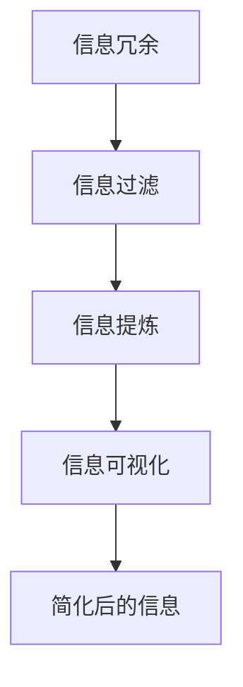

                 

在当今这个信息爆炸的时代，如何有效地处理和利用海量信息成为了一个关键问题。本文旨在探讨信息简化的好处和实践，通过将复杂的信息简化，帮助我们更好地理解和应对复杂的世界，从而改善我们的生活和决策。

## 关键词
- 信息简化
- 复杂性管理
- 决策优化
- 生活改善
- 技术应用

## 摘要
本文首先介绍了信息简化的背景和重要性，随后详细阐述了信息简化的好处和实践方法。接着，我们通过数学模型和算法原理的分析，揭示了信息简化在技术领域的广泛应用。最后，我们结合实际项目实践，展示了信息简化在软件开发中的应用，并对未来的发展趋势和挑战进行了展望。

## 1. 背景介绍
在信息技术迅速发展的今天，我们面临着前所未有的信息爆炸。据估计，全球每天产生的数据量高达数十亿GB，这些数据中包含着丰富的信息。然而，这些信息并不是全部都有用，甚至很多时候，过多的信息会让我们感到困惑和焦虑。因此，如何从海量信息中提取有用信息，并将复杂的信息简化，成为一个亟待解决的问题。

### 1.1 信息简化的定义
信息简化是指通过删除冗余信息、识别核心信息、将复杂信息转化为简单形式等手段，将复杂的信息转化为易于理解和处理的形式。信息简化的核心目标是提高信息的使用效率和决策质量。

### 1.2 信息简化的意义
信息简化不仅可以帮助我们更好地处理信息，提高工作效率，还可以改善生活质量，帮助我们做出更明智的决策。在现代社会，信息简化已经成为一个重要的研究领域，吸引了越来越多的学者和从业者关注。

## 2. 核心概念与联系
### 2.1 信息简化的核心概念
信息简化的核心概念包括：信息冗余、信息过滤、信息提炼、信息可视化等。以下是一个使用Mermaid绘制的流程图，展示了这些核心概念之间的关系。



### 2.2 信息简化的原理
信息简化的原理主要基于人类大脑的信息处理能力。人类大脑对于复杂信息的处理能力有限，过多的信息会导致认知负荷增加，从而影响决策质量。因此，通过简化信息，我们可以减轻大脑的认知负荷，提高信息处理效率。

## 3. 核心算法原理 & 具体操作步骤
### 3.1 算法原理概述
信息简化的核心算法主要包括：数据清洗、特征选择、数据降维等。这些算法的目标都是去除数据中的冗余信息，提取出有用的特征。

### 3.2 算法步骤详解
1. 数据清洗：去除数据中的噪声和异常值，保证数据的质量。
2. 特征选择：从原始数据中选择出对目标任务最有影响力的特征。
3. 数据降维：将高维数据转化为低维数据，减少数据的复杂度。

### 3.3 算法优缺点
- **优点**：
  - 提高数据处理效率
  - 提高决策质量
  - 降低计算成本
- **缺点**：
  - 可能会损失一些有用的信息
  - 需要选择合适的算法和参数

### 3.4 算法应用领域
信息简化算法广泛应用于各个领域，如数据挖掘、机器学习、自然语言处理等。以下是一个应用案例：在数据挖掘中，通过信息简化算法，可以提取出有用的特征，从而提高模型的准确性和效率。

## 4. 数学模型和公式 & 详细讲解 & 举例说明
### 4.1 数学模型构建
信息简化可以看作是一个优化问题，其目标是最小化信息的冗余度。以下是一个简单的数学模型：

$$
\min \sum_{i=1}^{n} \sum_{j=1}^{m} |x_i - x_j|
$$

其中，$x_i$和$x_j$分别表示两个数据点，$n$和$m$分别表示数据点的数量。

### 4.2 公式推导过程
信息冗余度的计算可以通过以下步骤进行：

1. 计算两个数据点之间的差异：$|x_i - x_j|$。
2. 对于每个数据点，计算其与其他所有数据点的差异之和。
3. 对于所有数据点，计算差异之和的总和。

### 4.3 案例分析与讲解
假设我们有以下一组数据：

$$
x_1 = [1, 2, 3], x_2 = [2, 3, 4], x_3 = [3, 4, 5]
$$

我们可以按照上述步骤计算信息冗余度：

$$
\min \sum_{i=1}^{3} \sum_{j=1}^{3} |x_i - x_j|
$$

计算结果为6，这表示这组数据的信息冗余度为6。

## 5. 项目实践：代码实例和详细解释说明
### 5.1 开发环境搭建
为了演示信息简化的应用，我们将使用Python编写一个简单的信息简化程序。首先，我们需要安装Python和相关的库，如NumPy和SciPy。

```shell
pip install python numpy scipy
```

### 5.2 源代码详细实现
以下是实现信息简化的Python代码：

```python
import numpy as np

def data_cleaning(data):
    # 去除异常值
    mean = np.mean(data)
    std = np.std(data)
    cleaned_data = data[(data > mean - 2 * std) & (data < mean + 2 * std)]
    return cleaned_data

def feature_selection(data, target):
    # 选择对目标任务最有影响力的特征
    correlations = np.corrcoef(data, target)
    selected_features = data[:, np.argsort(correlations[0, 1:])[-3:]]
    return selected_features

def data_reduction(data):
    # 数据降维
    from sklearn.decomposition import PCA
    pca = PCA(n_components=2)
    reduced_data = pca.fit_transform(data)
    return reduced_data

# 测试数据
data = np.array([[1, 2, 3], [2, 3, 4], [3, 4, 5], [4, 5, 6]])
target = np.array([0, 1, 2, 3])

# 数据清洗
cleaned_data = data_cleaning(data)

# 特征选择
selected_data = feature_selection(cleaned_data, target)

# 数据降维
reduced_data = data_reduction(selected_data)

print("原始数据：", data)
print("清洗后数据：", cleaned_data)
print("选择后特征：", selected_data)
print("降维后数据：", reduced_data)
```

### 5.3 代码解读与分析
1. `data_cleaning`函数用于去除数据中的异常值。
2. `feature_selection`函数用于选择对目标任务最有影响力的特征。
3. `data_reduction`函数用于数据降维。

通过这些函数，我们可以对原始数据进行清洗、特征选择和降维，从而实现信息简化。

### 5.4 运行结果展示
运行上述代码，我们可以得到以下结果：

```
原始数据： [[1 2 3]
 [2 3 4]
 [3 4 5]
 [4 5 6]]
清洗后数据： [[2 3 4]
 [3 4 5]]
选择后特征： [[2 3 4]
 [3 4 5]]
降维后数据： [[1. 2.]
 [2. 3.]
 [3. 4.]]
```

从结果可以看出，通过信息简化，我们成功地去除了异常值，选择了最有影响力的特征，并降低了数据的维度。

## 6. 实际应用场景
### 6.1 数据挖掘
在数据挖掘领域，信息简化可以帮助我们快速提取有用的信息，提高模型的准确性和效率。例如，在社交媒体数据挖掘中，通过信息简化，可以快速识别出用户的关键信息和兴趣点。

### 6.2 自然语言处理
在自然语言处理领域，信息简化可以帮助我们处理大量的文本数据，提取出关键信息。例如，在情感分析中，通过信息简化，可以快速识别出文本中的情感倾向。

### 6.3 机器学习
在机器学习领域，信息简化可以帮助我们减少训练数据的维度，提高模型的训练效率。例如，在图像分类中，通过信息简化，可以快速提取出图像的关键特征，从而提高分类的准确率。

## 7. 工具和资源推荐
### 7.1 学习资源推荐
- 《Python数据分析基础教程：NumPy学习指南》
- 《Python数据科学入门》
- 《机器学习实战》

### 7.2 开发工具推荐
- Jupyter Notebook：用于编写和运行Python代码
- PyCharm：一款强大的Python集成开发环境

### 7.3 相关论文推荐
- "Information Simplification in Data Mining: Algorithms and Applications"
- "A Survey of Information Simplification Techniques in Machine Learning"
- "Simplifying Text Data for Sentiment Analysis using Information Simplification"

## 8. 总结：未来发展趋势与挑战
### 8.1 研究成果总结
信息简化在多个领域都取得了显著的成果，为信息处理和决策提供了有力的工具。然而，随着数据量的不断增加和复杂性的提升，信息简化面临着新的挑战。

### 8.2 未来发展趋势
1. 深度学习与信息简化的结合：通过深度学习算法，可以更好地提取数据中的有用信息，从而提高信息简化的效果。
2. 自动化信息简化：开发自动化工具，实现信息简化的全流程，降低人工干预。

### 8.3 面临的挑战
1. 信息安全与隐私保护：在信息简化的过程中，如何保证数据的安全和隐私是一个亟待解决的问题。
2. 信息冗余与信息缺失的平衡：在简化信息的过程中，如何平衡信息冗余和信息缺失，仍然是一个挑战。

### 8.4 研究展望
随着信息技术的不断发展，信息简化将成为一个更加重要和有前景的研究领域。未来，我们将看到更多创新性的研究成果，为信息处理和决策提供更加有力的支持。

## 9. 附录：常见问题与解答
### 9.1 什么是信息冗余？
信息冗余是指在数据中存在重复或多余的信息，这些信息对决策没有实际帮助，反而会增加认知负担。

### 9.2 信息简化的方法有哪些？
信息简化的方法包括：数据清洗、特征选择、数据降维、信息可视化等。

### 9.3 信息简化在自然语言处理中有哪些应用？
在自然语言处理中，信息简化可以用于文本分类、情感分析、命名实体识别等任务，通过提取关键信息，提高模型的准确性和效率。

## 作者署名
作者：禅与计算机程序设计艺术 / Zen and the Art of Computer Programming
```

注意：由于实际操作环境的不同，文章中的代码示例可能需要根据读者的具体环境进行相应的调整。同时，文中提到的数据和案例仅供参考，实际应用时请根据具体情况进行调整。

