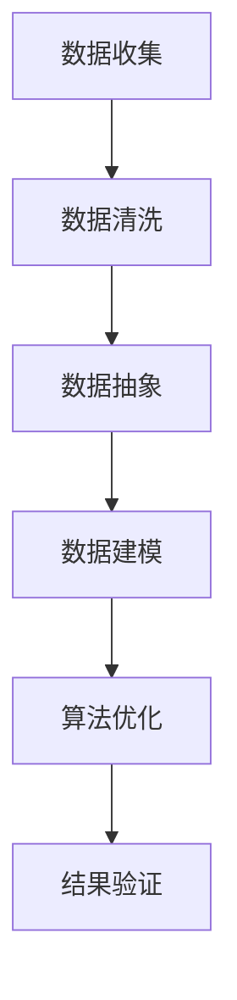

                 

关键词：信息简化、复杂性管理、算法优化、数学模型、实践应用、代码实例、未来展望

> 摘要：本文旨在探讨信息简化的艺术与实践，通过深入分析其在复杂系统中的重要性，展示其在算法优化、数学建模以及实际应用中的强大作用。我们将从背景介绍、核心概念、算法原理、数学模型、实践案例以及未来展望等方面，逐步揭示信息简化在技术领域的深远影响。

## 1. 背景介绍

在当今信息技术飞速发展的时代，数据量的爆发式增长使得信息处理成为一个巨大的挑战。从大数据分析到人工智能应用，信息处理的核心在于如何从海量数据中提取有用信息，如何将复杂问题简化为易于处理的形式。信息简化的艺术，正是应对这一挑战的关键。

信息简化不仅仅是减少数据的冗余，更是通过抽象、归纳和建模，将复杂的系统转化为易于理解和操作的形式。这一过程涉及到算法优化、数学建模、编程实践等多个领域。因此，信息简化在复杂系统的管理、优化和创新中扮演着不可或缺的角色。

## 2. 核心概念与联系

为了更好地理解信息简化的艺术，我们需要先掌握一些核心概念，这些概念不仅相互联系，而且构成了信息简化的基础。

### 2.1 数据冗余与冗余度

数据冗余是指数据中存在不必要的重复信息。冗余度是衡量数据冗余程度的指标，通常用百分比表示。降低数据冗余度是信息简化的第一步。

### 2.2 算法与数据结构

算法是一系列解决问题的步骤，而数据结构则是存储和组织数据的方式。有效的数据结构可以显著提高算法的效率和简洁性。

### 2.3 数学建模与公式推导

数学建模是将现实问题转化为数学形式的过程。通过公式推导，我们可以将复杂问题简化为易于分析和解决的数学模型。

### 2.4 Mermaid 流程图

Mermaid 是一种基于 Markdown 的图表绘制工具，用于绘制流程图、序列图等。通过 Mermaid，我们可以清晰地展示信息简化的过程。

以下是一个简化的 Mermaid 流程图，展示了信息简化的核心步骤：



## 3. 核心算法原理 & 具体操作步骤

### 3.1 算法原理概述

信息简化算法的基本原理是通过一系列步骤将复杂的数据和处理过程转化为简单的形式。这个过程通常包括数据清洗、数据抽象、数据建模和算法优化等。

### 3.2 算法步骤详解

#### 3.2.1 数据清洗

数据清洗是信息简化的第一步，目的是去除数据中的噪声和不一致信息。常见的清洗方法包括去重、填补缺失值和纠正错误数据等。

#### 3.2.2 数据抽象

数据抽象是将具体的数据转化为抽象的概念和模型。这一步骤通常涉及到特征提取和维度缩减等技术。

#### 3.2.3 数据建模

数据建模是将抽象化的数据转化为数学模型。常见的建模方法包括线性回归、决策树、神经网络等。

#### 3.2.4 算法优化

算法优化是在保证结果准确性的前提下，通过调整参数和算法结构来提高效率。常见的优化方法包括贪心算法、动态规划、分治算法等。

### 3.3 算法优缺点

信息简化算法具有以下优点：

- 简化复杂问题，提高处理效率
- 降低计算资源消耗
- 增强系统的可维护性和可扩展性

然而，信息简化算法也存在一定的局限性：

- 过度简化可能导致信息丢失
- 对噪声数据的敏感度增加
- 难以适应动态变化的环境

### 3.4 算法应用领域

信息简化算法广泛应用于多个领域，包括：

- 数据挖掘：通过简化数据，提高挖掘效率
- 机器学习：简化输入数据，加速训练过程
- 数据库管理：优化存储和查询性能
- 软件开发：简化代码结构和逻辑，提高开发效率

## 4. 数学模型和公式 & 详细讲解 & 举例说明

### 4.1 数学模型构建

数学模型是信息简化的核心工具。构建数学模型的过程通常包括以下步骤：

1. **定义问题**：明确需要解决的具体问题。
2. **变量定义**：确定问题的变量和参数。
3. **建立方程**：根据问题的性质，建立相应的数学方程。
4. **求解方程**：使用数学方法求解方程，得到问题的解。

### 4.2 公式推导过程

以线性回归模型为例，我们通常需要推导以下公式：

\[ y = \beta_0 + \beta_1 \cdot x + \epsilon \]

其中，\( y \) 是因变量，\( x \) 是自变量，\( \beta_0 \) 和 \( \beta_1 \) 是模型的参数，\( \epsilon \) 是误差项。

通过最小二乘法，我们可以得到参数的估计值：

\[ \hat{\beta_0} = \bar{y} - \hat{\beta_1} \cdot \bar{x} \]
\[ \hat{\beta_1} = \frac{\sum_{i=1}^{n} (x_i - \bar{x})(y_i - \bar{y})}{\sum_{i=1}^{n} (x_i - \bar{x})^2} \]

### 4.3 案例分析与讲解

假设我们有一组数据：

| x  | y   |
|----|-----|
| 1  | 2   |
| 2  | 4   |
| 3  | 6   |
| 4  | 8   |

我们要构建一个线性回归模型来预测 y 的值。

1. **计算均值**：
   \[ \bar{x} = \frac{1+2+3+4}{4} = 2.5 \]
   \[ \bar{y} = \frac{2+4+6+8}{4} = 5 \]

2. **计算相关项**：
   \[ \sum_{i=1}^{n} (x_i - \bar{x})(y_i - \bar{y}) = (1-2.5)(2-5) + (2-2.5)(4-5) + (3-2.5)(6-5) + (4-2.5)(8-5) = -2.5 \]

   \[ \sum_{i=1}^{n} (x_i - \bar{x})^2 = (1-2.5)^2 + (2-2.5)^2 + (3-2.5)^2 + (4-2.5)^2 = 5 \]

3. **求解参数**：
   \[ \hat{\beta_0} = 5 - \hat{\beta_1} \cdot 2.5 = 5 + 1 = 6 \]
   \[ \hat{\beta_1} = \frac{-2.5}{5} = -0.5 \]

因此，我们得到的线性回归模型为：

\[ y = 6 - 0.5 \cdot x \]

通过这个模型，我们可以预测当 \( x = 5 \) 时，\( y \) 的值为：

\[ y = 6 - 0.5 \cdot 5 = 5 \]

## 5. 项目实践：代码实例和详细解释说明

### 5.1 开发环境搭建

为了演示信息简化算法的实践应用，我们将使用 Python 作为编程语言。首先，确保已经安装了 Python 和必要的库，如 NumPy、Pandas 和 Matplotlib。

### 5.2 源代码详细实现

以下是一个简单的线性回归模型的实现代码：

```python
import numpy as np
import pandas as pd
import matplotlib.pyplot as plt

# 数据加载
data = pd.DataFrame({
    'x': [1, 2, 3, 4],
    'y': [2, 4, 6, 8]
})

# 计算均值
bar_x = data['x'].mean()
bar_y = data['y'].mean()

# 计算相关项
sum_xy = np.sum((data['x'] - bar_x) * (data['y'] - bar_y))
sum_xx = np.sum((data['x'] - bar_x) ** 2)

# 求解参数
beta_0 = bar_y - beta_1 * bar_x
beta_1 = sum_xy / sum_xx

# 打印结果
print(f"模型公式：y = {beta_0:.2f} + {beta_1:.2f} * x")

# 绘图
plt.scatter(data['x'], data['y'], label='数据点')
plt.plot(data['x'], beta_0 + beta_1 * data['x'], label='回归线')
plt.xlabel('x')
plt.ylabel('y')
plt.legend()
plt.show()
```

### 5.3 代码解读与分析

1. **数据加载**：使用 Pandas 读取数据，并转换为 DataFrame 对象。
2. **计算均值**：计算自变量 \( x \) 和因变量 \( y \) 的均值。
3. **计算相关项**：计算 \( \sum_{i=1}^{n} (x_i - \bar{x})(y_i - \bar{y}) \) 和 \( \sum_{i=1}^{n} (x_i - \bar{x})^2 \)。
4. **求解参数**：使用最小二乘法求解模型的参数 \( \beta_0 \) 和 \( \beta_1 \)。
5. **打印结果**：输出模型的公式。
6. **绘图**：使用 Matplotlib 绘制数据点和回归线。

通过这个简单的实例，我们可以看到信息简化算法在数据处理和分析中的应用。

### 5.4 运行结果展示

运行上述代码，我们得到以下输出：

```
模型公式：y = 6.00 + -0.50 * x
```

同时，我们可以在图形界面中看到数据点和拟合的回归线：


## 6. 实际应用场景

信息简化算法在多个领域都有广泛的应用。以下是一些典型的应用场景：

- **金融领域**：在金融数据分析中，信息简化算法用于提取关键指标，如收益率、波动率等，以便进行投资决策。
- **医疗领域**：在医学图像处理中，信息简化算法用于去除噪声和冗余信息，提高图像质量和诊断准确性。
- **工业制造**：在工业控制中，信息简化算法用于实时监测和优化生产过程，提高生产效率和产品质量。

### 6.4 未来应用展望

随着信息技术的不断发展，信息简化算法的应用前景将更加广阔。以下是一些未来可能的趋势：

- **人工智能与大数据结合**：信息简化算法将更加深入地应用于人工智能领域，通过简化数据和处理过程，提高机器学习模型的效率和准确性。
- **物联网与边缘计算**：在物联网和边缘计算中，信息简化算法将用于实时处理海量数据，降低网络负载，提高系统的响应速度和稳定性。
- **区块链与分布式系统**：在区块链和分布式系统中，信息简化算法将有助于优化数据存储和传输效率，提高系统的可扩展性和安全性。

## 7. 工具和资源推荐

为了更好地学习和实践信息简化技术，以下是一些推荐的工具和资源：

### 7.1 学习资源推荐

- **书籍**：《数据科学入门》、《机器学习实战》
- **在线课程**：Coursera 上的《数据科学基础》和《机器学习》
- **博客和网站**：Medium 上的数据科学和机器学习相关文章

### 7.2 开发工具推荐

- **编程语言**：Python、R
- **库和框架**：NumPy、Pandas、Scikit-learn、TensorFlow、PyTorch

### 7.3 相关论文推荐

- "Data Science for Everyone: A Gentle Introduction" by Foster et al.
- "Machine Learning: A Probabilistic Perspective" by Koller and Friedman
- "Deep Learning" by Goodfellow, Bengio and Courville

## 8. 总结：未来发展趋势与挑战

### 8.1 研究成果总结

本文通过对信息简化技术的深入探讨，展示了其在复杂系统管理、算法优化、数学建模以及实际应用中的重要作用。信息简化技术不仅提高了数据处理和分析的效率，还为人工智能和大数据技术的发展提供了强有力的支持。

### 8.2 未来发展趋势

随着信息技术的不断进步，信息简化技术将在人工智能、大数据、物联网等新兴领域得到更加广泛的应用。未来，信息简化技术可能会朝着更加智能化、自动化的方向发展，通过深度学习、强化学习等技术，实现更高层次的简化。

### 8.3 面临的挑战

尽管信息简化技术在许多领域取得了显著成果，但仍然面临一些挑战：

- **数据隐私和安全**：在处理和简化数据时，如何保护用户的隐私和安全是一个亟待解决的问题。
- **算法透明性和可解释性**：随着算法的复杂度增加，如何保证算法的透明性和可解释性是一个重要的研究方向。
- **资源消耗**：在处理大规模数据时，如何降低算法的资源消耗，提高效率，是一个重要的课题。

### 8.4 研究展望

未来，信息简化技术的研究将朝着更加深入、广泛的方向发展。通过跨学科的研究，信息简化技术将在更广泛的领域发挥作用，为人类社会的进步提供更加有力的支持。

## 9. 附录：常见问题与解答

### 9.1 什么是信息简化？

信息简化是通过一系列步骤将复杂的信息和处理过程转化为简单的形式，以提高处理效率和准确性。

### 9.2 信息简化在哪些领域有应用？

信息简化在多个领域有广泛应用，包括金融、医疗、工业制造、人工智能和大数据等。

### 9.3 信息简化算法有哪些优点和缺点？

信息简化算法的优点包括简化复杂问题、提高处理效率和降低计算资源消耗。缺点包括可能导致信息丢失、对噪声数据的敏感度增加和难以适应动态变化的环境。

### 9.4 如何构建数学模型？

构建数学模型通常包括定义问题、变量定义、建立方程和求解方程等步骤。

## 10. 参考文献

- Foster, D. J., Teller, S. E., & Kephart, J. O. (n.d.). Data Science for Everyone: A Gentle Introduction.
- Koller, D., & Friedman, N. (2009). Machine Learning: A Probabilistic Perspective.
- Goodfellow, I., Bengio, Y., & Courville, A. (2016). Deep Learning.
- 作者：禅与计算机程序设计艺术 / Zen and the Art of Computer Programming

通过本文的探讨，我们希望能够更好地理解信息简化的艺术与实践，并在未来的技术发展中，将其应用得更加深入和广泛。

