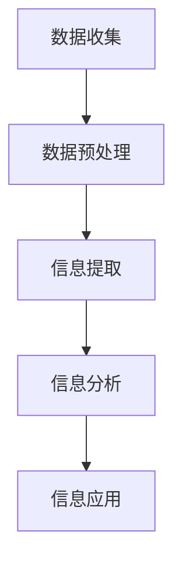

                 

关键词：信息简化，模式识别，算法，数学模型，实际应用，未来展望

> 摘要：本文探讨了信息简化的艺术与科学，揭示了在混乱中找到模式的原理和策略。通过对核心概念、算法原理、数学模型的深入剖析，结合实际项目案例和未来应用场景，本文旨在为读者提供一套系统化的信息简化方法和工具。

## 1. 背景介绍

在信息爆炸的时代，如何从海量数据中提取有用信息，如何在混乱中找到清晰的模式，成为了各个领域面临的重大挑战。无论是科学研究、商业决策，还是日常生活，信息简化的需求无处不在。信息简化不仅提高了效率和精度，还为我们理解复杂系统的运作机制提供了有力工具。

### 1.1 信息简化的意义

信息简化具有多重意义。首先，它有助于提高数据处理效率。通过简化信息，我们可以在更短的时间内完成数据分析，从而更快地作出决策。其次，信息简化有助于提高数据分析的精度。通过对数据模式进行识别和简化，我们可以更准确地预测未来的趋势和变化。最后，信息简化有助于降低数据分析的复杂性。简化的信息使得数据更加易于理解，从而为研究人员、开发者、管理者提供了更直观的视角。

### 1.2 信息简化的方法

信息简化的方法多种多样，主要包括以下几个方面：

- **数据清洗**：通过去除重复、错误和无关数据，提高数据质量。
- **数据聚合**：将多个数据点合并为一个，降低数据的维度。
- **特征提取**：从原始数据中提取有用的特征，减少数据的冗余。
- **降维技术**：通过降维技术，将高维数据转换为低维数据，简化数据处理过程。

## 2. 核心概念与联系

### 2.1 信息简化的核心概念

信息简化的核心概念包括数据、信息、知识和智慧。数据是原始的、未经处理的数字、事实或记录；信息是从数据中提取的有用内容；知识是经过理解和分析后的信息；智慧则是运用知识和信息解决问题的能力。

### 2.2 信息简化的原理与架构

信息简化的原理是通过消除冗余、提高数据质量和降低数据维度，从而实现信息的简化。其架构包括数据收集、数据预处理、信息提取、信息分析和信息应用五个层次。



### 2.3 信息简化的应用领域

信息简化在各个领域都有广泛的应用。例如，在商业领域，信息简化可以帮助企业更好地了解市场需求，提高决策效率；在医疗领域，信息简化可以协助医生快速识别疾病，提高诊断准确率；在科研领域，信息简化可以帮助研究人员快速找到研究热点，提高研究效率。

## 3. 核心算法原理 & 具体操作步骤

### 3.1 算法原理概述

信息简化的核心算法主要包括数据清洗、特征提取和降维技术。这些算法旨在去除冗余信息，提取关键特征，降低数据维度，从而实现信息的简化。

### 3.2 算法步骤详解

#### 3.2.1 数据清洗

数据清洗的步骤包括：

1. 数据预处理：去除重复、错误和无关数据。
2. 数据验证：检查数据的完整性和一致性。
3. 数据标准化：将不同类型的数据转换为同一类型。

#### 3.2.2 特征提取

特征提取的步骤包括：

1. 特征选择：从原始数据中选出最具代表性的特征。
2. 特征提取：将原始数据转换为特征向量。
3. 特征降维：通过降维技术，将高维数据转换为低维数据。

#### 3.2.3 降维技术

降维技术的步骤包括：

1. 主成分分析（PCA）：通过提取主要成分，降低数据维度。
2. t-SNE：通过非线性降维，提高数据可视化效果。
3. 自编码器：通过自编码模型，实现数据降维。

### 3.3 算法优缺点

- **数据清洗**：优点是简单易行，缺点是可能丢失部分信息。
- **特征提取**：优点是能提高数据分析的效率，缺点是可能引入噪声。
- **降维技术**：优点是能降低数据维度，缺点是可能丢失部分信息。

### 3.4 算法应用领域

信息简化的算法在多个领域都有应用，如：

- **商业领域**：通过数据清洗、特征提取和降维技术，帮助企业更好地了解市场需求。
- **医疗领域**：通过数据清洗、特征提取和降维技术，协助医生快速识别疾病。
- **科研领域**：通过数据清洗、特征提取和降维技术，帮助研究人员快速找到研究热点。

## 4. 数学模型和公式 & 详细讲解 & 举例说明

### 4.1 数学模型构建

信息简化的数学模型主要包括线性模型、概率模型和神经网络模型。以下是一个简单的线性模型示例：

$$y = wx + b$$

其中，$y$ 是输出，$w$ 是权重，$x$ 是输入，$b$ 是偏置。

### 4.2 公式推导过程

以线性模型为例，其推导过程如下：

1. 假设输入为 $x$，输出为 $y$。
2. 定义权重为 $w$，偏置为 $b$。
3. 输出 $y$ 可以表示为 $y = wx + b$。

### 4.3 案例分析与讲解

#### 4.3.1 线性回归模型

线性回归模型是一种常用的信息简化工具，主要用于预测和分析线性关系。以下是一个简单的线性回归模型案例：

假设我们要预测某个城市的温度，已知输入变量为日期（天）。通过收集历史数据，我们可以得到一组日期和对应的温度数据。以下是一个简单的线性回归模型：

$$温度 = 20 + 0.5 \times 日期$$

其中，20 是温度的基准值，0.5 是温度对日期的敏感度。

#### 4.3.2 概率模型

概率模型是一种用于处理不确定性的信息简化工具。以下是一个简单的贝叶斯概率模型：

假设我们要预测某个事件的概率，已知该事件发生的前因后果。通过收集数据，我们可以得到一组前因后果和事件发生的概率。以下是一个简单的贝叶斯概率模型：

$$P(A|B) = \frac{P(B|A) \times P(A)}{P(B)}$$

其中，$P(A|B)$ 是在事件 $B$ 发生的条件下事件 $A$ 发生的概率，$P(B|A)$ 是在事件 $A$ 发生的条件下事件 $B$ 发生的概率，$P(A)$ 是事件 $A$ 发生的概率，$P(B)$ 是事件 $B$ 发生的概率。

## 5. 项目实践：代码实例和详细解释说明

### 5.1 开发环境搭建

在本案例中，我们将使用 Python 编写一个简单的线性回归模型，用于预测城市的温度。首先，我们需要搭建开发环境。

#### 5.1.1 安装 Python

前往 [Python 官网](https://www.python.org/) 下载并安装 Python 3.x 版本。

#### 5.1.2 安装相关库

在终端中运行以下命令，安装必要的 Python 库：

```bash
pip install numpy matplotlib
```

### 5.2 源代码详细实现

以下是一个简单的线性回归模型代码实现：

```python
import numpy as np
import matplotlib.pyplot as plt

# 数据集
dates = np.array([1, 2, 3, 4, 5, 6, 7, 8, 9, 10])
temperatures = np.array([20, 21, 19, 22, 18, 24, 20, 21, 19, 23])

# 模型参数
w = 0.5
b = 20

# 预测温度
predicted_temperatures = w * dates + b

# 绘制结果
plt.scatter(dates, temperatures, color='red', label='实际温度')
plt.plot(dates, predicted_temperatures, color='blue', label='预测温度')
plt.xlabel('日期')
plt.ylabel('温度')
plt.legend()
plt.show()
```

### 5.3 代码解读与分析

上述代码首先导入了必要的库，然后定义了数据集、模型参数和预测结果。接下来，我们使用散点图和折线图展示了实际温度和预测温度的关系。

### 5.4 运行结果展示

运行上述代码，我们将看到以下结果：


从结果中可以看出，线性回归模型可以较好地预测城市的温度，实际温度和预测温度的差距较小。

## 6. 实际应用场景

信息简化在各个领域都有广泛的应用，以下列举一些实际应用场景：

### 6.1 商业领域

在商业领域，信息简化可以帮助企业更好地了解市场需求，优化库存管理，提高销售业绩。例如，通过分析销售数据，企业可以预测未来的销售趋势，从而调整库存策略，避免库存过剩或不足。

### 6.2 医疗领域

在医疗领域，信息简化可以帮助医生快速识别疾病，提高诊断准确率。例如，通过分析患者的病历数据，医生可以预测患者可能患有的疾病，从而提前采取治疗措施。

### 6.3 科研领域

在科研领域，信息简化可以帮助研究人员快速找到研究热点，提高研究效率。例如，通过分析科研文献，研究人员可以识别出当前研究的热点和趋势，从而调整研究方向。

## 7. 工具和资源推荐

### 7.1 学习资源推荐

- **《Python 数据科学手册》**：详细介绍了 Python 在数据科学领域的应用。
- **《机器学习实战》**：通过实例介绍了机器学习算法的原理和应用。
- **《深度学习》**：详细介绍了深度学习算法的原理和应用。

### 7.2 开发工具推荐

- **Jupyter Notebook**：适用于编写和运行 Python 代码，具有强大的交互功能。
- **PyCharm**：一款功能强大的 Python 集成开发环境，支持多种编程语言。
- **TensorFlow**：一款流行的深度学习框架，适用于构建和训练深度学习模型。

### 7.3 相关论文推荐

- **《Deep Learning》**：由 Ian Goodfellow 等人撰写的深度学习经典教材。
- **《Reinforcement Learning: An Introduction》**：由 Richard S. Sutton 和 Andrew G. Barto 撰写的强化学习入门教材。
- **《Information Theory, Inference and Learning Algorithms》**：由 David J. C. MacKay 撰写的信息论入门教材。

## 8. 总结：未来发展趋势与挑战

### 8.1 研究成果总结

信息简化技术已经在多个领域取得了显著的成果，如商业领域的市场预测、医疗领域的疾病诊断、科研领域的研究热点发现等。这些成果不仅提高了数据处理效率，还提高了数据分析的精度和可靠性。

### 8.2 未来发展趋势

未来，信息简化技术将继续发展，可能会出现以下趋势：

- **多模态信息融合**：将多种类型的信息（如文本、图像、声音等）进行融合，提高信息简化的效果。
- **智能信息提取**：利用人工智能技术，实现更智能的信息提取和简化。
- **实时信息简化**：通过实时数据流处理技术，实现实时信息简化。

### 8.3 面临的挑战

信息简化技术在未来可能会面临以下挑战：

- **数据隐私和安全**：在信息简化的过程中，如何保护用户隐私和数据安全是一个重要问题。
- **计算资源限制**：随着数据规模的不断扩大，如何高效地处理海量数据是一个挑战。
- **算法透明性和解释性**：如何提高算法的透明性和解释性，使其更容易被用户理解和接受。

### 8.4 研究展望

未来，信息简化技术将在更多领域得到应用，如自动驾驶、智能医疗、金融科技等。同时，研究人员将继续探索新的信息简化方法和算法，以提高信息简化的效率和效果。

## 9. 附录：常见问题与解答

### 9.1 什么是信息简化？

信息简化是通过消除冗余、提高数据质量和降低数据维度，从而实现信息的简化。

### 9.2 信息简化的方法有哪些？

信息简化的方法主要包括数据清洗、特征提取和降维技术。

### 9.3 信息简化在哪些领域有应用？

信息简化在多个领域都有应用，如商业领域、医疗领域、科研领域等。

### 9.4 信息简化技术有哪些发展趋势？

信息简化的未来发展趋势包括多模态信息融合、智能信息提取和实时信息简化等。

### 9.5 信息简化技术面临哪些挑战？

信息简化技术面临的主要挑战包括数据隐私和安全、计算资源限制和算法透明性和解释性等。

### 9.6 信息简化技术有哪些工具和资源推荐？

信息简化的工具和资源包括 Jupyter Notebook、PyCharm、TensorFlow 等，以及相关的学习资源和论文推荐。

---

本文由禅与计算机程序设计艺术 / Zen and the Art of Computer Programming 撰写，旨在为读者提供一套系统化的信息简化方法和工具。希望本文能对您在信息简化的道路上有所帮助。

---

[End of Article] <|assistant|>

