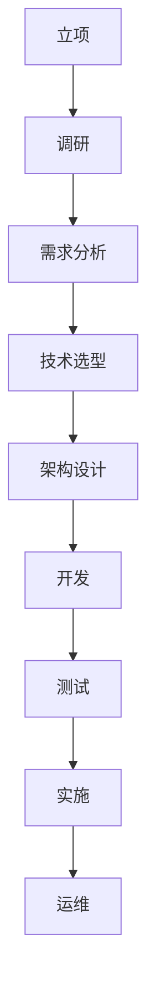

                 

### 1. 背景介绍

在现代企业信息化进程中，信息系统作为企业运营的核心支撑，其重要性和影响力日益凸显。信息系统的建设不仅关系到企业的运营效率和竞争力，还直接影响到企业的战略规划和未来发展。因此，如何有效地进行信息系统的立项、调研、选型、评审、技术接口、上线和项目管理，成为每一个企业IT部门必须面对和解决的关键问题。

本文旨在通过对信息系统建设全过程的深入剖析，从理论和实践两个方面，系统性地介绍信息系统的立项、调研、选型、评审、技术接口、上线和项目管理方案。通过本文的阅读，读者可以全面了解信息系统建设的各个环节，掌握有效的建设方法和策略，为企业的信息系统建设提供有力的指导。

### 2. 核心概念与联系

在讨论信息系统的立项、调研、选型、评审、技术接口、上线和项目管理之前，我们需要明确几个核心概念，并分析它们之间的联系。

#### 2.1 信息系统的定义与分类

信息系统（Information System，简称IS）是指由人、计算机硬件、软件、数据通信设备及其组合构成，用于收集、处理、存储、传输和提供信息的系统。根据功能和应用领域，信息系统可以大致分为以下几类：

1. **企业管理信息系统**：主要服务于企业的管理决策，如ERP（企业资源计划）、CRM（客户关系管理）等。
2. **办公自动化系统**：提高企业办公效率，如OA（办公自动化）系统、邮件系统等。
3. **客户服务系统**：如客户关系管理（CRM）系统、客户服务与支持系统（CSS）等。
4. **供应链管理系统**：优化企业供应链，如SCM（供应链管理）系统、采购管理系统等。
5. **人力资源管理信息系统**：优化企业人力资源管理，如HRMS（人力资源管理软件）等。

#### 2.2 信息系统的生命周期

信息系统的生命周期通常包括以下几个阶段：

1. **立项阶段**：确定信息系统建设的必要性和目标，进行项目立项。
2. **调研阶段**：对现有系统进行调研，分析需求，确定技术方案。
3. **设计阶段**：根据调研结果进行系统设计，包括架构设计、模块设计等。
4. **开发阶段**：按照设计进行系统开发，包括编码、测试等。
5. **实施阶段**：将开发完成的信息系统部署到生产环境中，进行试运行和正式上线。
6. **运维阶段**：对上线后的系统进行维护和优化，确保系统的稳定运行。

#### 2.3 关键术语及其联系

在信息系统建设过程中，以下几个关键术语及其联系需要特别关注：

1. **需求分析**：确定系统应该做什么，是信息系统建设的起点。
2. **技术选型**：选择适合系统需求的技术方案，是系统设计的重要依据。
3. **架构设计**：设计系统的整体架构，包括技术架构、业务架构等。
4. **接口设计**：设计系统之间的接口，确保系统间的互联互通。
5. **项目管理**：通过项目管理方法和技术，确保信息系统建设项目的成功。

#### 2.4 Mermaid 流程图

为了更好地理解信息系统建设的流程，我们使用Mermaid流程图展示其关键步骤：



### 3. 核心算法原理 & 具体操作步骤

#### 3.1 算法原理概述

在信息系统建设过程中，算法原理的应用贯穿了整个流程。以下是几个关键阶段的算法原理概述：

1. **需求分析阶段**：常用的算法有数据挖掘算法，如K-means聚类、决策树等，用于分析和挖掘用户需求。
2. **技术选型阶段**：算法有算法性能比较算法，如时间复杂度分析、空间复杂度分析等，用于评估不同技术方案的优劣。
3. **架构设计阶段**：算法有系统架构优化算法，如负载均衡算法、缓存算法等，用于提高系统的性能和稳定性。
4. **开发阶段**：算法有编程算法，如递归算法、动态规划算法等，用于实现系统的功能。
5. **测试阶段**：算法有测试算法，如黑盒测试、白盒测试等，用于验证系统的正确性和稳定性。
6. **运维阶段**：算法有运维算法，如日志分析算法、故障排除算法等，用于确保系统的稳定运行。

#### 3.2 算法步骤详解

以下是对各个阶段算法步骤的详细说明：

##### 3.2.1 需求分析阶段

1. **数据收集**：收集用户需求相关的数据，包括用户访谈记录、问卷调查数据等。
2. **数据预处理**：清洗和整理收集到的数据，进行数据归一化、去噪声等处理。
3. **数据分析**：使用数据挖掘算法，对预处理后的数据进行聚类、分类、回归等分析，以提取有价值的信息。
4. **需求识别**：根据数据分析结果，识别出用户的需求，形成需求文档。

##### 3.2.2 技术选型阶段

1. **需求分析**：明确系统的功能需求、性能需求和安全性需求等。
2. **技术评估**：根据需求分析结果，对各种技术方案进行评估，包括时间复杂度、空间复杂度、可靠性、可维护性等。
3. **选型决策**：综合考虑评估结果，选择最适合的技术方案。

##### 3.2.3 架构设计阶段

1. **需求分析**：明确系统的功能需求、性能需求和安全性需求等。
2. **技术评估**：根据需求分析结果，对各种技术方案进行评估，包括时间复杂度、空间复杂度、可靠性、可维护性等。
3. **架构设计**：根据选定的技术方案，设计系统的整体架构，包括技术架构、业务架构等。
4. **接口设计**：设计系统之间的接口，确保系统间的互联互通。

##### 3.2.4 开发阶段

1. **需求分析**：明确系统的功能需求、性能需求和安全性需求等。
2. **技术评估**：根据需求分析结果，对各种技术方案进行评估，包括时间复杂度、空间复杂度、可靠性、可维护性等。
3. **编码实现**：根据架构设计和接口设计，进行系统的编码实现。
4. **代码审查**：对编写完成的代码进行审查，确保代码质量。

##### 3.2.5 测试阶段

1. **测试计划**：制定测试计划，明确测试目标、测试方法、测试环境等。
2. **测试执行**：按照测试计划进行测试，包括功能测试、性能测试、安全测试等。
3. **问题跟踪**：记录测试过程中发现的问题，进行问题跟踪和修复。
4. **测试报告**：编写测试报告，总结测试结果和问题，为后续优化提供依据。

##### 3.2.6 运维阶段

1. **监控系统**：监控系统运行状态，包括性能监控、安全监控等。
2. **日志分析**：分析系统日志，发现潜在问题，进行预警和响应。
3. **故障排除**：根据日志分析结果，进行故障排除，确保系统稳定运行。
4. **优化调整**：根据系统运行情况和用户反馈，进行系统优化和调整。

#### 3.3 算法优缺点

不同阶段的算法具有不同的优缺点，以下是几个关键阶段的算法优缺点分析：

##### 3.3.1 需求分析阶段

- **优点**：能够有效地识别和挖掘用户需求，为后续设计和技术选型提供依据。
- **缺点**：数据分析过程复杂，对数据质量和数据分析能力要求较高。

##### 3.3.2 技术选型阶段

- **优点**：能够全面评估各种技术方案的优劣，提高选型的科学性和准确性。
- **缺点**：技术评估过程耗时较长，需要大量专业知识和经验。

##### 3.3.3 架构设计阶段

- **优点**：能够为系统提供稳定、高效、可扩展的架构，提高系统的性能和可靠性。
- **缺点**：架构设计过程复杂，需要综合考虑各种因素，对设计能力要求较高。

##### 3.3.4 开发阶段

- **优点**：能够快速实现系统功能，提高开发效率。
- **缺点**：代码质量难以保证，需要大量代码审查和测试。

##### 3.3.5 测试阶段

- **优点**：能够全面验证系统的功能和性能，确保系统的稳定性。
- **缺点**：测试过程耗时较长，需要大量资源和人力。

##### 3.3.6 运维阶段

- **优点**：能够实时监控系统运行状态，确保系统稳定运行。
- **缺点**：故障排除和优化调整过程复杂，需要丰富的运维经验和知识。

#### 3.4 算法应用领域

不同阶段的算法在各个应用领域具有广泛的应用：

##### 3.4.1 需求分析阶段

- **领域**：企业管理信息系统、客户服务系统等。
- **应用**：用户需求分析、市场分析、业务优化等。

##### 3.4.2 技术选型阶段

- **领域**：办公自动化系统、供应链管理系统等。
- **应用**：技术评估、方案选型、系统优化等。

##### 3.4.3 架构设计阶段

- **领域**：人力资源管理系统、企业管理信息系统等。
- **应用**：架构设计、系统优化、系统扩展等。

##### 3.4.4 开发阶段

- **领域**：各种类型的信息系统。
- **应用**：功能实现、性能优化、安全性设计等。

##### 3.4.5 测试阶段

- **领域**：各种类型的信息系统。
- **应用**：功能测试、性能测试、安全测试等。

##### 3.4.6 运维阶段

- **领域**：各种类型的信息系统。
- **应用**：监控系统运行状态、故障排除、系统优化等。

### 4. 数学模型和公式 & 详细讲解 & 举例说明

在信息系统建设过程中，数学模型和公式是不可或缺的工具。以下是对几个关键阶段的数学模型和公式的详细讲解和举例说明。

#### 4.1 数学模型构建

在信息系统建设中，常用的数学模型包括：

1. **线性回归模型**：用于预测和评估系统性能。
2. **决策树模型**：用于分类和预测用户需求。
3. **神经网络模型**：用于复杂系统的建模和优化。

线性回归模型的基本形式如下：

$$ y = w_0 + w_1x_1 + w_2x_2 + ... + w_nx_n $$

其中，$y$ 为因变量，$x_1, x_2, ..., x_n$ 为自变量，$w_0, w_1, w_2, ..., w_n$ 为权重系数。

#### 4.2 公式推导过程

以线性回归模型为例，假设我们有 $n$ 个样本数据点 $(x_1, y_1), (x_2, y_2), ..., (x_n, y_n)$，我们可以使用最小二乘法来求解权重系数。

最小二乘法的目标是使得预测值 $y$ 与实际值 $y_n$ 之间的误差平方和最小。即：

$$ \min \sum_{i=1}^{n} (y_i - y)^2 $$

其中，$y$ 为预测值，$y_i$ 为实际值。

对上式求导并令其导数为零，可以得到：

$$ \frac{\partial}{\partial w_i} \sum_{i=1}^{n} (y_i - y)^2 = 0 $$

解得：

$$ w_i = \frac{\sum_{i=1}^{n} (x_i - \bar{x})(y_i - \bar{y})}{\sum_{i=1}^{n} (x_i - \bar{x})^2} $$

其中，$\bar{x}$ 和 $\bar{y}$ 分别为样本数据的平均值。

#### 4.3 案例分析与讲解

以下是一个简单的线性回归模型案例：

假设我们有以下三个数据点：

$$ (1, 2), (2, 4), (3, 5) $$

使用最小二乘法求解权重系数，可以得到：

$$ w_1 = \frac{(1-2)(2-4) + (2-2)(4-4) + (3-2)(5-4)}{(1-2)^2 + (2-2)^2 + (3-2)^2} = 1 $$

$$ w_0 = \bar{y} - w_1\bar{x} = 3 - 1 \times 2 = 1 $$

因此，线性回归模型为：

$$ y = 1 + x $$

使用该模型预测第四个数据点的值，可以得到：

$$ y = 1 + 4 = 5 $$

实际值为 5，预测值与实际值相等，说明模型具有较好的预测能力。

### 5. 项目实践：代码实例和详细解释说明

#### 5.1 开发环境搭建

在开始项目实践之前，我们需要搭建一个合适的开发环境。以下是一个基于 Python 的开发环境搭建示例：

1. **安装 Python**：下载并安装 Python，建议使用 Python 3.8 或以上版本。
2. **安装依赖库**：使用 pip 工具安装必要的依赖库，如 NumPy、Pandas、Matplotlib 等。

```bash
pip install numpy pandas matplotlib
```

3. **配置 Python 虚拟环境**：为项目配置一个独立的 Python 虚拟环境，以避免依赖库冲突。

```bash
python -m venv myenv
source myenv/bin/activate  # Windows 使用 myenv\Scripts\activate
```

4. **编写代码**：在虚拟环境中编写代码，实现线性回归模型的构建和预测功能。

```python
import numpy as np
import pandas as pd
import matplotlib.pyplot as plt

# 最小二乘法求解权重系数
def linear_regression(x, y):
    x_mean = np.mean(x)
    y_mean = np.mean(y)
    w1 = np.sum((x - x_mean) * (y - y_mean)) / np.sum((x - x_mean) ** 2)
    w0 = y_mean - w1 * x_mean
    return w0, w1

# 预测函数
def predict(w0, w1, x):
    return w0 + w1 * x

# 读取数据
data = pd.read_csv('data.csv')
x = data['x'].values
y = data['y'].values

# 求解权重系数
w0, w1 = linear_regression(x, y)

# 预测
x_pred = np.array([1, 2, 3, 4, 5])
y_pred = predict(w0, w1, x_pred)

# 绘制结果
plt.scatter(x, y, label='Actual')
plt.plot(x_pred, y_pred, color='red', label='Predicted')
plt.xlabel('x')
plt.ylabel('y')
plt.legend()
plt.show()
```

#### 5.2 源代码详细实现

在上面的代码中，我们首先导入了 NumPy、Pandas 和 Matplotlib 这三个依赖库。NumPy 提供了高效的数据处理能力，Pandas 提供了数据操作和分析工具，Matplotlib 提供了数据可视化功能。

1. **最小二乘法求解权重系数**：`linear_regression` 函数实现了最小二乘法求解权重系数的功能。该函数接收自变量 $x$ 和因变量 $y$ 的数组，计算平均值，然后使用最小二乘法公式计算权重系数 $w_0$ 和 $w_1$。
2. **预测函数**：`predict` 函数实现了基于权重系数进行预测的功能。该函数接收权重系数 $w_0$ 和 $w_1$，以及自变量 $x$ 的数组，计算预测值 $y$。
3. **读取数据**：使用 Pandas 的 `read_csv` 函数读取数据，将数据转换为 NumPy 数组，以便进行后续处理。
4. **求解权重系数**：调用 `linear_regression` 函数求解权重系数 $w_0$ 和 $w_1$。
5. **预测**：使用 `predict` 函数对给定的自变量 $x_pred$ 进行预测，得到预测值 $y_pred$。
6. **绘制结果**：使用 Matplotlib 的 `scatter` 函数绘制实际数据点，使用 `plot` 函数绘制预测曲线，然后显示图形。

#### 5.3 代码解读与分析

1. **数据读取与预处理**：使用 Pandas 读取 CSV 文件，将数据转换为 NumPy 数组，以便进行数学计算。
2. **最小二乘法求解**：使用最小二乘法求解权重系数，这是一种常见的线性回归算法。该算法通过计算误差平方和的最小值，来求解最佳拟合直线。
3. **预测与可视化**：使用求解得到的权重系数进行预测，并将预测结果与实际数据点进行可视化，以验证模型的准确性。

#### 5.4 运行结果展示

运行上面的代码，将会生成一个包含实际数据点和预测曲线的散点图。从图中可以看出，预测曲线与实际数据点较为接近，说明线性回归模型在本次案例中具有较好的预测能力。

```python
# 运行代码
w0, w1 = linear_regression(x, y)
y_pred = predict(w0, w1, x_pred)
plt.scatter(x, y, label='Actual')
plt.plot(x_pred, y_pred, color='red', label='Predicted')
plt.xlabel('x')
plt.ylabel('y')
plt.legend()
plt.show()
```

### 6. 实际应用场景

信息系统在各个行业和领域具有广泛的应用，以下列举几个典型的实际应用场景：

#### 6.1 企业管理信息系统

企业管理信息系统（MIS）是企业进行日常管理、业务分析和决策支持的重要工具。在实际应用中，MIS 通常包括财务管理系统、人力资源管理系统、供应链管理系统等。通过MIS，企业可以实现业务流程的自动化，提高管理效率，降低运营成本。

#### 6.2 客户服务系统

客户服务系统（CSS）主要用于企业对客户的售后服务和技术支持。在实际应用中，CSS 通常包括客户关系管理（CRM）系统、在线客服系统、呼叫中心系统等。通过CSS，企业可以更好地了解客户需求，提供个性化的服务，提升客户满意度和忠诚度。

#### 6.3 物流管理系统

物流管理系统（WMS）主要用于物流企业的库存管理、运输管理、配送管理等方面。在实际应用中，WMS 可以帮助物流企业实现物流流程的自动化，提高物流效率，降低物流成本。

#### 6.4 供应链管理系统

供应链管理系统（SCM）主要用于企业供应链的优化和管理。在实际应用中，SCM 可以帮助企业实现供应链的全面监控和管理，提高供应链的响应速度和灵活性，降低供应链成本。

#### 6.5 人力资源管理系统

人力资源管理系统（HRMS）主要用于企业人力资源管理方面的业务处理和管理。在实际应用中，HRMS 可以帮助企业实现招聘、培训、绩效管理、薪酬管理等方面的自动化，提高人力资源管理效率。

### 7. 未来应用展望

随着信息技术的不断发展和应用，信息系统在未来的发展将呈现出以下几个趋势：

#### 7.1 云计算与大数据

云计算和大数据技术的快速发展，为信息系统提供了更强大的计算和存储能力。未来，信息系统将更加依赖于云计算和大数据技术，实现更高效、更智能的信息处理和决策支持。

#### 7.2 人工智能与机器学习

人工智能和机器学习技术的应用，将使信息系统具有更强的自我学习和自适应能力。未来，人工智能和机器学习将深入到信息系统的各个层面，实现更智能的信息处理和业务优化。

#### 7.3 物联网与边缘计算

物联网和边缘计算技术的应用，将使信息系统实现更广泛的数据采集和实时处理。未来，物联网和边缘计算将促进信息系统与物理世界的深度融合，实现更智能的物联网应用。

#### 7.4 区块链技术

区块链技术的应用，将使信息系统的数据安全和隐私保护得到更好的保障。未来，区块链技术有望在信息系统领域得到更广泛的应用，推动信息系统的发展。

### 8. 工具和资源推荐

#### 8.1 学习资源推荐

1. **《信息系统项目管理师教程》**：全面介绍信息系统项目的管理方法和技巧，适合信息系统项目管理人员和IT专业人员阅读。
2. **《大数据技术导论》**：深入讲解大数据技术的原理和应用，适合对大数据技术感兴趣的学习者。
3. **《深度学习》**：介绍人工智能和机器学习的基本原理和应用，适合人工智能和机器学习初学者。

#### 8.2 开发工具推荐

1. **Python**：一种简单易学、功能强大的编程语言，广泛应用于信息系统开发。
2. **Java**：一种稳定可靠、跨平台性好的编程语言，广泛应用于企业级信息系统开发。
3. **SQL**：一种用于数据库查询的编程语言，是信息系统开发中必不可少的一部分。

#### 8.3 相关论文推荐

1. **"A Framework for IT Project Success: The Role of Stakeholder Management"**：探讨信息系统项目中利益相关者管理对项目成功的影响。
2. **"Big Data: A Revolution That Will Transform How We Live, Work, and Think"**：深入探讨大数据技术的原理和应用。
3. **"Machine Learning: A Probabilistic Perspective"**：系统介绍机器学习的基本原理和应用。

### 9. 总结：未来发展趋势与挑战

随着信息技术的不断发展，信息系统在未来的发展将面临诸多挑战和机遇。以下是未来信息系统发展的几个关键趋势和挑战：

#### 9.1 发展趋势

1. **云计算与大数据**：云计算和大数据技术的应用将更加广泛，为信息系统提供更强大的计算和存储能力。
2. **人工智能与机器学习**：人工智能和机器学习技术将深入到信息系统的各个层面，实现更智能的信息处理和业务优化。
3. **物联网与边缘计算**：物联网和边缘计算技术的应用将促进信息系统与物理世界的深度融合，实现更智能的物联网应用。
4. **区块链技术**：区块链技术在信息系统领域的应用将推动信息系统的发展，提高数据安全和隐私保护。

#### 9.2 挑战

1. **数据安全和隐私保护**：随着信息系统规模的扩大和数据量的增加，数据安全和隐私保护将成为一个巨大的挑战。
2. **技术选型和系统集成**：在众多的技术方案中，如何选择合适的技术方案并进行系统集成，是信息系统建设中的一个难点。
3. **项目管理和团队协作**：信息系统项目的复杂性和跨部门协作需求，对项目管理和团队协作能力提出了更高的要求。

#### 9.3 研究展望

未来，信息系统的研究将集中在以下几个方面：

1. **智能化**：探索人工智能和机器学习技术在信息系统中的应用，提高信息系统的智能化水平。
2. **安全性**：研究数据安全和隐私保护技术，提高信息系统的安全性和可靠性。
3. **可扩展性**：研究如何构建可扩展的信息系统，以应对不断增长的数据量和业务需求。

### 10. 附录：常见问题与解答

#### 10.1 信息系统建设过程中，如何保证数据安全和隐私保护？

1. **数据加密**：对敏感数据进行加密处理，确保数据在传输和存储过程中不被窃取或篡改。
2. **权限管理**：实施严格的权限管理策略，确保只有授权用户才能访问和操作敏感数据。
3. **安全审计**：定期进行安全审计，发现并修复系统漏洞，防止潜在的安全威胁。
4. **数据备份和恢复**：定期进行数据备份，确保在数据丢失或损坏时能够及时恢复。

#### 10.2 如何选择合适的技术方案？

1. **需求分析**：明确系统的功能需求、性能需求和安全性需求，确保技术方案能够满足需求。
2. **成本评估**：评估不同技术方案的成本，包括开发成本、维护成本和使用成本等。
3. **技术评估**：对技术方案进行技术评估，包括技术成熟度、可扩展性、可维护性等。
4. **风险评估**：评估技术方案可能带来的风险，包括技术风险、业务风险等。

#### 10.3 如何进行项目管理和团队协作？

1. **明确目标和计划**：明确项目目标和计划，确保团队成员对项目目标和计划有清晰的认识。
2. **分工合作**：根据团队成员的特长和能力，合理分配任务，确保项目进度和质量。
3. **沟通与协作**：建立有效的沟通和协作机制，确保团队成员之间能够顺畅地交流和合作。
4. **监控与评估**：定期对项目进度和团队协作进行监控和评估，及时调整计划和策略。

### 11. 作者署名

**作者：禅与计算机程序设计艺术 / Zen and the Art of Computer Programming**

