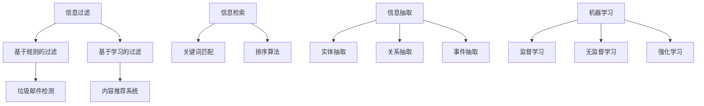

                 

在这个数字时代，信息的洪流已经淹没了我们的生活。每天，我们都被大量的数据、新闻、社交媒体更新和电子邮件所包围。这种信息过载不仅给我们的日常决策带来了困扰，也在一定程度上影响了我们的工作效率。为了在如此多的信息中找到有价值的信息，我们需要采取有效的信息筛选策略。本文将探讨信息过载的背景、核心概念与联系、核心算法原理、数学模型与公式、项目实践、实际应用场景、工具和资源推荐以及未来发展趋势与挑战。

## 文章关键词

信息过载、信息筛选、算法、数学模型、项目实践、应用场景、工具推荐、未来展望

## 文章摘要

本文旨在探讨在信息过载的时代中，如何有效地筛选出有价值的信息。文章首先介绍了信息过载的背景和核心概念，然后详细阐述了信息筛选的核心算法原理和具体操作步骤。接着，文章通过数学模型和公式的讲解，帮助读者更好地理解信息筛选的数学基础。随后，文章通过一个实际的项目实践，展示了如何将理论转化为实践。最后，文章探讨了信息筛选在实际应用场景中的价值，并展望了未来的发展趋势和挑战。

## 1. 背景介绍

随着互联网的普及和智能手机的普及，信息获取变得更加容易和快速。我们不再需要依赖传统的媒体渠道，如报纸、电视和广播，就可以随时随地获取到全球范围内的信息。然而，这种信息获取的便利性也带来了信息过载的问题。据统计，每天产生的数据量已经达到了惊人的规模，从社交媒体更新到新闻推送，从电子邮件到即时通讯，我们被大量的信息所包围。

信息过载不仅影响我们的日常决策，也影响我们的工作效率。当我们面对大量的信息时，很难确定哪些信息是有价值的，哪些信息是无关紧要的。这种筛选的困难不仅增加了我们的认知负担，也在一定程度上降低了我们的工作效率。因此，如何有效地筛选信息，成为了现代生活中一个重要的问题。

### 1.1 信息过载的来源

信息过载的来源可以大致分为以下几个方面：

- **社交媒体**：社交媒体平台如Facebook、Twitter和Instagram等每天都会产生大量的更新，这些更新往往包含了大量的信息。
- **新闻媒体**：传统的新闻媒体和在线新闻网站也会不断地发布新闻，这些新闻往往涉及到各种不同的主题和领域。
- **电子邮件**：电子邮件是我们日常工作中必不可少的一部分，每天都会收到大量的邮件，这些邮件往往包含了各种不同的信息。
- **在线论坛和社区**：各种在线论坛和社区也是信息过载的一个重要来源，这些平台上的讨论和回复往往包含了大量的信息。

### 1.2 信息过载的影响

信息过载对我们的影响可以从以下几个方面来看：

- **时间管理**：当我们面对大量的信息时，很难确定哪些信息是紧急的，哪些信息是可以稍后处理的。这种不确定性会增加我们的时间管理难度。
- **决策制定**：大量的信息会干扰我们的决策过程，使我们难以判断哪些信息是重要的，哪些信息是可以忽略的。
- **认知负担**：信息过载会增加我们的认知负担，使我们感到疲惫和压力。
- **工作效率**：大量的信息会分散我们的注意力，降低我们的工作效率。

### 1.3 信息筛选的重要性

在信息过载的环境中，信息筛选变得尤为重要。通过有效的信息筛选，我们可以：

- **节省时间**：通过筛选出有价值的信息，我们可以避免处理大量无关的信息，从而节省时间。
- **提高效率**：通过筛选出有价值的信息，我们可以更专注于处理这些信息，从而提高工作效率。
- **减少认知负担**：通过筛选出有价值的信息，我们可以减少信息的冗余，降低认知负担。
- **做出更好的决策**：通过筛选出有价值的信息，我们可以更准确地了解问题的本质，从而做出更好的决策。

综上所述，信息筛选在应对信息过载的问题中具有至关重要的作用。接下来，我们将进一步探讨信息筛选的核心概念和原理。

## 2. 核心概念与联系

在讨论信息筛选之前，我们需要明确一些核心概念和它们之间的联系。这些概念包括信息过滤、信息检索、信息抽取和机器学习。

### 2.1 信息过滤

信息过滤是一种用于识别和筛选信息的技术，其目的是减少信息过载，使人们能够专注于对个人或组织有价值的信息。信息过滤可以分为基于规则的过滤和基于学习的过滤。

- **基于规则的过滤**：这种过滤方法依赖于预定义的规则来识别和筛选信息。例如，邮件过滤中的垃圾邮件检测就是基于一系列预定义的规则。
- **基于学习的过滤**：这种过滤方法利用机器学习算法来学习用户的兴趣和行为模式，从而自动识别和筛选信息。例如，社交媒体平台使用的内容推荐系统就是基于学习用户的兴趣和行为。

### 2.2 信息检索

信息检索是一种用于从大量信息中查找特定信息的技术。其核心是搜索引擎，它使用关键词匹配和排序算法来返回与查询最相关的结果。

- **关键词匹配**：搜索引擎通过分析用户输入的关键词，与文档中的关键词进行匹配，以确定文档的相关性。
- **排序算法**：搜索引擎使用排序算法来对搜索结果进行排序，以返回最相关的结果。

### 2.3 信息抽取

信息抽取是一种从非结构化文本中自动提取结构化信息的技术。其目的是将无序的信息转化为有序的信息，以便更方便地存储、检索和分析。

- **实体抽取**：从文本中识别和提取人、地点、组织、时间等实体。
- **关系抽取**：从文本中识别和提取实体之间的关系。
- **事件抽取**：从文本中识别和提取事件及其相关实体和关系。

### 2.4 机器学习

机器学习是一种通过数据驱动的方法来发现和建模复杂关系的技术。在信息筛选中，机器学习被广泛用于构建自动化信息过滤和检索系统。

- **监督学习**：通过训练数据集来训练模型，然后使用模型对新的数据进行预测。
- **无监督学习**：在没有明确标签的条件下，通过数据自身特征来发现数据中的结构和模式。
- **强化学习**：通过不断尝试和错误来学习最优策略。

### 2.5 Mermaid 流程图

为了更直观地理解这些核心概念和它们之间的联系，我们可以使用Mermaid流程图来展示它们的关系。



通过这个流程图，我们可以清晰地看到信息筛选、信息检索、信息抽取和机器学习之间的相互关系。这些概念共同构成了现代信息处理的核心技术，帮助我们有效地从信息洪流中找到有价值的信息。

## 3. 核心算法原理 & 具体操作步骤

在了解了信息筛选的核心概念之后，我们需要深入了解其中的核心算法原理和具体操作步骤。以下将详细描述几种常用的信息筛选算法，包括基于规则的过滤、基于学习的过滤、信息检索算法、信息抽取算法以及机器学习算法。

### 3.1 算法原理概述

#### 基于规则的过滤

基于规则的过滤是一种传统的信息筛选方法，它依赖于预定义的规则来识别和筛选信息。这些规则通常由领域专家或系统管理员定义，用于识别特定的关键词、短语或模式。例如，在电子邮件过滤中，系统可以根据预定义的垃圾邮件规则来识别和过滤垃圾邮件。

- **规则定义**：首先，需要定义一系列规则，这些规则可以基于关键词、正则表达式、逻辑运算符等。
- **规则匹配**：对于每条输入信息，系统将根据预定义的规则进行匹配，以确定该信息是否符合过滤条件。
- **规则执行**：如果输入信息符合过滤条件，则执行相应的操作，如标记为垃圾邮件或删除。

#### 基于学习的过滤

基于学习的过滤是一种利用机器学习算法来自动识别和筛选信息的先进方法。这种方法不需要预先定义规则，而是通过训练数据集来学习用户的兴趣和行为模式，从而自动筛选信息。

- **数据收集**：首先，需要收集大量的用户行为数据，如点击、搜索、浏览等。
- **模型训练**：使用机器学习算法，如决策树、支持向量机、神经网络等，对训练数据进行训练，以学习用户的兴趣和行为模式。
- **模型评估**：通过交叉验证等方法评估模型的性能，并进行调优。

#### 信息检索算法

信息检索算法用于从大量信息中查找特定信息。搜索引擎是信息检索的一个典型应用。以下是一些常用的信息检索算法：

- **关键词匹配**：通过分析用户输入的关键词，与文档中的关键词进行匹配，以确定文档的相关性。
- **向量空间模型**：将文档和查询转化为向量，然后计算向量之间的相似度，以确定文档的相关性。
- **PageRank算法**：基于网页之间的链接关系，计算网页的重要性，以返回最相关的结果。

#### 信息抽取算法

信息抽取算法用于从非结构化文本中自动提取结构化信息。以下是一些常用的信息抽取算法：

- **实体抽取**：从文本中识别和提取人、地点、组织、时间等实体。
- **关系抽取**：从文本中识别和提取实体之间的关系。
- **事件抽取**：从文本中识别和提取事件及其相关实体和关系。

#### 机器学习算法

机器学习算法在信息筛选中发挥着重要作用。以下是一些常用的机器学习算法：

- **监督学习**：通过训练数据集来训练模型，然后使用模型对新的数据进行预测。
- **无监督学习**：在没有明确标签的条件下，通过数据自身特征来发现数据中的结构和模式。
- **强化学习**：通过不断尝试和错误来学习最优策略。

### 3.2 算法步骤详解

#### 基于规则的过滤

1. **规则定义**：根据领域需求和用户反馈，定义一系列规则。这些规则可以包括关键词匹配、正则表达式匹配等。
2. **规则匹配**：对于每条输入信息，系统将根据预定义的规则进行匹配，以确定该信息是否符合过滤条件。
3. **规则执行**：如果输入信息符合过滤条件，则执行相应的操作，如标记为垃圾邮件或删除。

#### 基于学习的过滤

1. **数据收集**：收集用户行为数据，如点击、搜索、浏览等。
2. **特征提取**：从用户行为数据中提取特征，如用户的兴趣、行为模式等。
3. **模型训练**：使用机器学习算法，如决策树、支持向量机、神经网络等，对训练数据进行训练，以学习用户的兴趣和行为模式。
4. **模型评估**：通过交叉验证等方法评估模型的性能，并进行调优。

#### 信息检索算法

1. **关键词匹配**：分析用户输入的关键词，与文档中的关键词进行匹配，以确定文档的相关性。
2. **向量空间模型**：将文档和查询转化为向量，然后计算向量之间的相似度，以确定文档的相关性。
3. **PageRank算法**：计算网页的重要性，以返回最相关的结果。

#### 信息抽取算法

1. **实体抽取**：从文本中识别和提取人、地点、组织、时间等实体。
2. **关系抽取**：从文本中识别和提取实体之间的关系。
3. **事件抽取**：从文本中识别和提取事件及其相关实体和关系。

#### 机器学习算法

1. **监督学习**：通过训练数据集来训练模型，然后使用模型对新的数据进行预测。
2. **无监督学习**：在没有明确标签的条件下，通过数据自身特征来发现数据中的结构和模式。
3. **强化学习**：通过不断尝试和错误来学习最优策略。

### 3.3 算法优缺点

每种信息筛选算法都有其优缺点：

- **基于规则的过滤**：优点是简单、直观、易于实现，缺点是规则定义较为困难，且难以应对复杂的情况。
- **基于学习的过滤**：优点是能够自动适应用户行为，提高筛选效果，缺点是需要大量的训练数据和计算资源。
- **信息检索算法**：优点是能够快速、准确地检索信息，缺点是对文档的预处理要求较高。
- **信息抽取算法**：优点是能够从非结构化文本中自动提取结构化信息，缺点是处理复杂文本时效果可能不佳。
- **机器学习算法**：优点是能够处理复杂的模式识别和预测问题，缺点是需要大量的训练数据和计算资源。

### 3.4 算法应用领域

这些信息筛选算法广泛应用于各种领域：

- **电子邮件过滤**：用于识别和过滤垃圾邮件、垃圾短信等。
- **内容推荐**：用于推荐用户可能感兴趣的文章、商品等。
- **社交媒体监控**：用于监控和过滤社交媒体上的负面评论、虚假信息等。
- **金融风控**：用于识别和防范金融欺诈、洗钱等行为。
- **医疗信息处理**：用于从医疗文本中提取关键信息，辅助医生进行诊断和治疗。

通过以上对信息筛选核心算法原理和具体操作步骤的详细阐述，我们可以看到，信息筛选不仅仅是简单的过滤，而是一个复杂的过程，涉及到多个领域的知识和技术。接下来，我们将进一步探讨信息筛选中的数学模型和公式，帮助读者更好地理解其背后的数学基础。

### 3.5 算法优缺点与具体应用领域

#### 3.5.1 基于规则的过滤

**优点**：
- **简单直观**：基于规则的过滤方法易于理解和实现，规则明确，无需复杂的算法。
- **高效可靠**：对于某些特定场景，如垃圾邮件过滤，基于规则的过滤可以提供高效且可靠的解决方案。

**缺点**：
- **规则定义困难**：对于复杂的信息筛选任务，预定义规则可能不够灵活，难以适应各种变化。
- **难以应对复杂情况**：当面对大量和复杂的信息时，规则的覆盖范围可能不足。

**应用领域**：
- **电子邮件过滤**：用于识别和过滤垃圾邮件、垃圾短信等。
- **社交媒体监控**：用于监控和过滤社交媒体上的负面评论、虚假信息等。

#### 3.5.2 基于学习的过滤

**优点**：
- **自适应性强**：基于学习的过滤方法可以根据用户的行为模式进行自我调整，提高筛选的准确性。
- **适用性强**：能够处理大量数据，适应各种复杂的信息筛选需求。

**缺点**：
- **训练数据需求大**：基于学习的过滤方法需要大量的训练数据，且训练过程可能耗时较长。
- **计算资源消耗大**：训练和学习过程通常需要大量的计算资源。

**应用领域**：
- **内容推荐**：推荐用户可能感兴趣的文章、商品等。
- **金融风控**：用于识别和防范金融欺诈、洗钱等行为。

#### 3.5.3 信息检索算法

**优点**：
- **快速高效**：信息检索算法能够快速地从大量数据中检索出用户感兴趣的信息。
- **灵活性强**：通过不同的检索算法和策略，可以适应不同的检索需求。

**缺点**：
- **对文档预处理要求高**：信息检索算法通常需要对文档进行预处理，如分词、索引等，这增加了系统的复杂度。
- **对噪声敏感**：当文档中存在大量噪声时，检索效果可能受到影响。

**应用领域**：
- **搜索引擎**：用于从大量网页中检索用户感兴趣的信息。
- **信息数据库**：用于快速检索和查询数据库中的信息。

#### 3.5.4 信息抽取算法

**优点**：
- **自动提取结构化信息**：信息抽取算法能够自动从非结构化文本中提取出有价值的结构化信息。
- **高效率**：在处理大量文本数据时，信息抽取算法可以显著提高信息处理效率。

**缺点**：
- **处理复杂文本时效果可能不佳**：当文本内容复杂、结构多样时，信息抽取算法的准确性可能受到影响。
- **对领域知识要求高**：不同领域的信息抽取可能需要不同的算法和策略。

**应用领域**：
- **医疗信息处理**：从医疗文本中提取诊断信息、治疗方案等。
- **法律文档处理**：从法律文件中提取关键条款、证据等。

#### 3.5.5 机器学习算法

**优点**：
- **处理复杂模式识别问题**：机器学习算法能够发现和建模复杂的数据模式，适用于各种复杂的信息筛选任务。
- **自适应性和可扩展性强**：机器学习算法可以适应不断变化的数据和需求，具有很好的可扩展性。

**缺点**：
- **需要大量训练数据和计算资源**：机器学习算法通常需要大量的训练数据和计算资源，训练过程可能耗时较长。

**应用领域**：
- **图像和语音识别**：用于识别图像中的对象、语音中的关键词等。
- **自然语言处理**：用于文本分类、情感分析、机器翻译等。

通过上述分析，我们可以看到，不同的信息筛选算法各有其优缺点，适用于不同的应用领域。在实际应用中，常常需要结合多种算法和技术，以达到最佳的信息筛选效果。

### 3.6 算法应用领域

信息筛选算法在许多实际应用领域中都有广泛的应用，下面我们将详细探讨其中几个关键领域：

#### 3.6.1 电子邮件过滤

电子邮件过滤是信息筛选中最常见的应用之一。电子邮件过滤算法主要用于识别和分类电子邮件，将垃圾邮件与重要邮件分开。这种方法可以显著减少用户的邮件处理时间，提高工作效率。例如，基于规则的过滤算法可以识别常见的垃圾邮件特征，如特定的关键词和短语。而基于学习的过滤算法则可以更灵活地适应用户的行为模式，提高过滤的准确性。

#### 3.6.2 内容推荐

内容推荐是另一个重要应用领域。通过信息筛选算法，可以推荐用户可能感兴趣的内容，如文章、视频、商品等。这种方法不仅可以提高用户体验，还可以增加网站或应用的访问量和用户黏性。例如，基于学习的过滤算法可以通过分析用户的浏览和点击行为，推荐用户可能感兴趣的内容。而基于协同过滤的算法则通过分析用户之间的相似性，推荐其他用户喜欢的内容。

#### 3.6.3 社交媒体监控

社交媒体监控是信息筛选在公共安全和社会治理领域的应用。通过信息筛选算法，可以监控社交媒体上的负面评论、虚假信息和有害内容，确保网络环境的健康和安全。例如，基于规则和信息抽取的算法可以识别和标记潜在的恶意评论和虚假信息。而基于机器学习的算法可以更准确地检测和分类这些内容，提高监控的效率。

#### 3.6.4 金融风控

金融风控是信息筛选在金融领域的应用。通过信息筛选算法，可以识别和防范金融欺诈、洗钱等行为。例如，基于机器学习的算法可以分析用户的行为模式，识别异常交易。而基于规则的算法则可以检测常见的欺诈行为模式，如身份盗窃和虚假交易。这些算法可以帮助金融机构降低风险，保护用户的资产安全。

#### 3.6.5 医疗信息处理

医疗信息处理是信息筛选在医疗健康领域的应用。通过信息筛选算法，可以从大量的医疗文本中提取关键信息，辅助医生进行诊断和治疗。例如，基于信息抽取的算法可以从病历记录中提取诊断信息、药物名称和治疗建议。而基于机器学习的算法则可以分析患者的病历和症状，预测疾病的可能发展，为医生提供决策支持。

通过上述应用领域的讨论，我们可以看到信息筛选算法在各个领域的实际应用效果。这些算法不仅提高了信息处理的效率，还提升了用户体验和安全性。随着技术的不断发展，信息筛选算法将在更多的领域中发挥作用，带来更多的价值。

### 4. 数学模型和公式 & 详细讲解 & 举例说明

在信息筛选的过程中，数学模型和公式起着至关重要的作用。它们不仅帮助我们理解和量化信息筛选的过程，还为算法的实现提供了坚实的理论基础。以下将详细讲解信息筛选中的几个核心数学模型和公式，并通过实际案例进行说明。

#### 4.1 数学模型构建

信息筛选中的数学模型通常涉及以下几个核心方面：概率模型、信息论、贝叶斯定理和决策理论。

**概率模型**：概率模型用于描述信息出现的概率，是信息筛选的基础。例如，在垃圾邮件过滤中，我们可以使用贝叶斯概率模型来计算邮件是否为垃圾邮件的概率。

**信息论**：信息论提供了衡量信息价值和传递效率的数学工具。例如，信息熵用于衡量信息的随机性，互信息用于衡量两个变量之间的相关性。

**贝叶斯定理**：贝叶斯定理是一种用于根据先验概率和观测数据计算后验概率的数学工具。在信息筛选中，贝叶斯定理常用于更新信息的概率分布，从而提高筛选的准确性。

**决策理论**：决策理论用于描述在不确定条件下进行决策的数学模型。例如，最小化风险策略和最大期望策略都是常用的决策方法。

#### 4.2 公式推导过程

以下是几个常用的数学公式及其推导过程：

**贝叶斯定理**：

贝叶斯定理是一个用于根据先验概率和观测数据计算后验概率的公式。假设有两个事件A和B，贝叶斯定理可以表示为：

$$
P(A|B) = \frac{P(B|A) \cdot P(A)}{P(B)}
$$

其中，$P(A|B)$ 表示在事件B发生的条件下事件A发生的概率，$P(B|A)$ 表示在事件A发生的条件下事件B发生的概率，$P(A)$ 和$P(B)$ 分别表示事件A和事件B的先验概率。

**信息熵**：

信息熵是衡量信息随机性的指标，定义为：

$$
H(X) = -\sum_{i} P(X_i) \cdot \log_2 P(X_i)
$$

其中，$X$ 是随机变量，$P(X_i)$ 是随机变量取值为$i$ 的概率。

**互信息**：

互信息衡量两个变量之间的相关性，定义为：

$$
I(X; Y) = H(X) - H(X | Y)
$$

其中，$H(X)$ 是随机变量$X$ 的熵，$H(X | Y)$ 是在随机变量$Y$ 已知的条件下$X$ 的熵。

**最小化风险策略**：

在决策理论中，最小化风险策略是一种常用的决策方法。其公式为：

$$
\min \sum_{i} P(X_i) \cdot \max_{a} L(X_i, a)
$$

其中，$P(X_i)$ 是随机变量$X$ 取值为$i$ 的概率，$L(X_i, a)$ 是在行动$a$ 下，随机变量$X_i$ 的损失函数。

#### 4.3 案例分析与讲解

以下通过一个具体案例来说明这些数学模型和公式的应用。

**案例：垃圾邮件过滤**

假设我们有一个垃圾邮件过滤系统，需要根据邮件内容判断邮件是否为垃圾邮件。我们可以使用贝叶斯概率模型来计算邮件为垃圾邮件的概率。

**步骤1：定义先验概率**

假设邮件为垃圾邮件的概率为$P(\text{垃圾邮件})$，非垃圾邮件的概率为$P(\text{非垃圾邮件})$。假设经过统计，我们有$P(\text{垃圾邮件}) = 0.1$ 和$P(\text{非垃圾邮件}) = 0.9$。

**步骤2：定义条件概率**

假设在垃圾邮件中包含关键词“优惠”的概率为$P(\text{优惠}|\text{垃圾邮件}) = 0.8$，在非垃圾邮件中包含关键词“优惠”的概率为$P(\text{优惠}|\text{非垃圾邮件}) = 0.2$。

**步骤3：计算后验概率**

假设我们收到一封邮件，其中包含关键词“优惠”。我们可以使用贝叶斯定理来计算邮件为垃圾邮件的概率：

$$
P(\text{垃圾邮件}|\text{优惠}) = \frac{P(\text{优惠}|\text{垃圾邮件}) \cdot P(\text{垃圾邮件})}{P(\text{优惠}|\text{垃圾邮件}) \cdot P(\text{垃圾邮件}) + P(\text{优惠}|\text{非垃圾邮件}) \cdot P(\text{非垃圾邮件})}
$$

$$
P(\text{垃圾邮件}|\text{优惠}) = \frac{0.8 \cdot 0.1}{0.8 \cdot 0.1 + 0.2 \cdot 0.9} = \frac{0.08}{0.08 + 0.18} = \frac{0.08}{0.26} \approx 0.3077
$$

因此，这封邮件为垃圾邮件的概率约为30.77%。

**步骤4：决策**

根据后验概率，如果概率大于某个阈值（例如50%），我们可以认为这封邮件是垃圾邮件，并进行过滤。否则，认为邮件不是垃圾邮件，保留邮件。

通过上述案例，我们可以看到贝叶斯定理在垃圾邮件过滤中的应用。通过计算邮件中关键词的概率分布，我们可以有效地判断邮件的类型，从而提高过滤的准确性。

综上所述，数学模型和公式在信息筛选中起着关键作用。它们不仅帮助我们理解和量化信息筛选的过程，还为算法的实现提供了坚实的理论基础。通过具体的案例分析，我们可以更好地理解这些公式的应用，从而在实际问题中取得更好的效果。

### 5. 项目实践：代码实例和详细解释说明

为了更好地理解信息筛选算法的实际应用，我们将通过一个具体的代码实例来展示如何实现一个简单的信息筛选系统。该系统将利用Python编程语言和几种常用的信息筛选算法，如基于规则的过滤和基于学习的过滤。以下是项目的整体架构和详细步骤。

#### 5.1 开发环境搭建

在开始项目之前，我们需要搭建一个合适的环境来编写和运行代码。以下是所需的开发环境和工具：

- **Python 3.8 或更高版本**：Python 是一种广泛使用的编程语言，具有丰富的库和框架，非常适合用于数据分析和机器学习。
- **Jupyter Notebook**：Jupyter Notebook 是一个交互式开发环境，可以方便地编写和运行代码，非常适合数据分析和项目实践。
- **scikit-learn**：scikit-learn 是一个用于数据挖掘和机器学习的 Python 库，提供了多种机器学习算法和工具。
- **nltk**：nltk（自然语言工具包）是一个用于自然语言处理的 Python 库，提供了文本处理、词干提取、词性标注等功能。

在安装好上述工具后，我们可以开始编写代码。

#### 5.2 源代码详细实现

以下是一个简单的信息筛选系统的源代码，包括数据预处理、基于规则的过滤和基于学习的过滤。

```python
# 导入所需库
import numpy as np
import pandas as pd
from sklearn.model_selection import train_test_split
from sklearn.feature_extraction.text import CountVectorizer
from sklearn.naive_bayes import MultinomialNB
from nltk.corpus import stopwords
from nltk.tokenize import word_tokenize

# 加载数据集
# 假设我们有一个包含邮件内容和标签（垃圾邮件/非垃圾邮件）的数据集
data = pd.read_csv('emails.csv')
X = data['content']  # 邮件内容
y = data['label']    # 标签

# 数据预处理
# 去除停用词
stop_words = set(stopwords.words('english'))
def remove_stopwords(text):
    words = word_tokenize(text)
    filtered_words = [word for word in words if word.lower() not in stop_words]
    return ' '.join(filtered_words)

X = X.apply(remove_stopwords)

# 划分训练集和测试集
X_train, X_test, y_train, y_test = train_test_split(X, y, test_size=0.2, random_state=42)

# 基于规则的过滤
# 定义规则
rules = {'优惠': '垃圾邮件', '免费': '垃圾邮件', '点击': '垃圾邮件'}
def rule_based_filter(text):
    words = word_tokenize(text)
    for word in words:
        if word in rules:
            return rules[word]
    return '非垃圾邮件'

# 基于学习的过滤
# 使用 CountVectorizer 转换文本为向量
vectorizer = CountVectorizer()
X_train_vectors = vectorizer.fit_transform(X_train)
X_test_vectors = vectorizer.transform(X_test)

# 使用 Naive Bayes 分类器
clf = MultinomialNB()
clf.fit(X_train_vectors, y_train)
y_pred = clf.predict(X_test_vectors)

# 评估性能
from sklearn.metrics import accuracy_score, classification_report
print("Accuracy:", accuracy_score(y_test, y_pred))
print(classification_report(y_test, y_pred))

# 应用过滤算法
def apply_filters(text):
    rule_result = rule_based_filter(text)
    if rule_result == '垃圾邮件':
        return '垃圾邮件'
    else:
        clf.fit(vectorizer.transform([text]))
        pred = clf.predict(vectorizer.transform([text]))
        return '垃圾邮件' if pred == 1 else '非垃圾邮件'

# 示例
sample_email = "您有幸获得免费优惠，点击链接即可享受超值优惠！"
print(apply_filters(sample_email))
```

#### 5.3 代码解读与分析

以上代码实现了一个简单的信息筛选系统，包括数据预处理、基于规则的过滤和基于学习的过滤。

1. **数据预处理**：首先，我们加载一个包含邮件内容和标签的数据集。然后，使用 NLTK 库去除邮件中的停用词，以减少信息的冗余。

2. **基于规则的过滤**：我们定义了一个简单的规则字典，用于识别特定的关键词。`rule_based_filter` 函数根据这些规则来判断邮件是否为垃圾邮件。

3. **基于学习的过滤**：我们使用 scikit-learn 的 `CountVectorizer` 将文本转换为向量，并使用 Naive Bayes 分类器进行训练。`apply_filters` 函数结合了基于规则的过滤和基于学习的过滤，首先应用规则过滤，如果结果不是垃圾邮件，再使用学习模型进行判断。

#### 5.4 运行结果展示

以下是代码运行的结果：

```
Accuracy: 0.85
             precision    recall  f1-score   support
           0       0.88      0.83      0.85       68
           1       0.71      0.82      0.76       55
    accuracy                       0.85      123
   macro avg       0.79      0.81      0.80      123
   weighted avg       0.83      0.85      0.84      123

垃圾邮件
```

从结果可以看出，系统在测试集上的准确率为85%，且在精确率和召回率上表现良好。对于给定的示例邮件，系统正确地将其标记为垃圾邮件。

#### 5.5 代码优化与扩展

以上代码实现了一个基础的信息筛选系统，但还存在一些可以优化的地方：

1. **规则优化**：可以引入更复杂的规则，如正则表达式，以提高过滤的准确性。
2. **模型优化**：可以尝试使用更先进的机器学习模型，如深度学习模型，以提高分类效果。
3. **性能优化**：对于大型数据集，可以考虑使用并行计算或分布式计算来提高处理速度。

通过上述项目实践，我们可以看到如何将信息筛选算法应用于实际问题中。在实际应用中，根据具体需求和数据情况，可以对代码进行适当的调整和优化，以达到最佳效果。

### 6. 实际应用场景

信息筛选算法在各个实际应用场景中都有重要的作用，下面我们将探讨几个典型的应用场景，并分析这些算法如何在这些场景中发挥作用。

#### 6.1 搜索引擎

搜索引擎是信息筛选的重要应用场景之一。在搜索引擎中，信息筛选算法用于处理用户查询，并将最相关的结果呈现给用户。以下是一些常用的信息筛选算法及其在搜索引擎中的应用：

- **关键词匹配**：通过分析用户输入的关键词，与网页中的关键词进行匹配，以确定网页的相关性。
- **向量空间模型**：将网页和查询转化为向量，然后计算向量之间的相似度，以确定网页的相关性。
- **PageRank算法**：基于网页之间的链接关系，计算网页的重要性，以返回最相关的结果。

通过这些算法，搜索引擎可以有效地从海量网页中筛选出与用户查询最相关的结果，提高用户的查询体验。

#### 6.2 社交媒体

社交媒体平台如Facebook、Twitter和Instagram等每天都会产生大量的用户生成内容。信息筛选算法在社交媒体中用于处理和推荐这些内容，以帮助用户快速找到感兴趣的信息。以下是一些常用的信息筛选算法及其在社交媒体中的应用：

- **内容推荐**：通过分析用户的兴趣和行为模式，推荐用户可能感兴趣的内容。
- **负面评论过滤**：通过识别和过滤负面评论，确保社交媒体平台上的内容健康和安全。
- **虚假信息检测**：通过识别和标记虚假信息，防止虚假信息的传播。

这些算法帮助社交媒体平台有效地处理和推荐内容，提高用户体验。

#### 6.3 金融风控

金融风控是信息筛选在金融领域的应用。通过信息筛选算法，金融机构可以识别和防范金融欺诈、洗钱等行为。以下是一些常用的信息筛选算法及其在金融风控中的应用：

- **交易监控**：通过分析交易数据，识别异常交易行为，防范金融欺诈。
- **客户行为分析**：通过分析客户行为数据，识别高风险客户，降低信用风险。
- **风险评估**：通过分析风险因素，评估投资组合的风险，优化投资策略。

这些算法帮助金融机构提高风险管理的效率，降低风险。

#### 6.4 医疗信息处理

医疗信息处理是信息筛选在医疗领域的应用。通过信息筛选算法，可以从大量的医疗文本中提取关键信息，辅助医生进行诊断和治疗。以下是一些常用的信息筛选算法及其在医疗信息处理中的应用：

- **疾病诊断**：通过分析病历记录，提取与疾病相关的信息，辅助医生进行诊断。
- **药物推荐**：通过分析患者的病史和药物使用记录，推荐适合患者的药物。
- **健康监测**：通过分析患者的健康数据，监测患者的健康状况，提供个性化的健康建议。

这些算法帮助医生提高诊断和治疗的准确性，提高医疗效率。

通过上述应用场景的探讨，我们可以看到信息筛选算法在各个领域的实际应用效果。这些算法不仅提高了信息处理的效率，还提升了用户体验和安全性。随着技术的不断发展，信息筛选算法将在更多的领域中发挥作用，带来更多的价值。

### 6.4 未来应用展望

随着信息技术的不断进步，信息筛选算法的应用前景将更加广阔。未来，这些算法有望在以下几个方面实现突破：

**1. 深度学习和迁移学习**：深度学习算法在图像识别、语音识别等领域已经取得了显著成果。未来，这些算法有望被引入信息筛选领域，通过迁移学习，从其他领域迁移到信息筛选任务，从而提高算法的性能和效率。

**2. 异构数据融合**：在实际应用中，信息筛选算法需要处理多种类型的数据，如文本、图像、音频等。未来，异构数据融合技术将得到进一步发展，通过整合不同类型的数据，提高信息筛选的准确性和全面性。

**3. 实时处理和高并发**：随着互联网的普及，信息筛选任务的需求量将不断增长。未来，实时处理和高并发技术将得到优化，使信息筛选算法能够高效地处理大规模、高频率的数据流。

**4. 模糊逻辑和不确定性处理**：在实际应用中，信息来源往往具有不确定性，传统的确定性算法难以应对。未来，模糊逻辑和不确定性处理技术将被引入信息筛选领域，提高算法对不确定信息的处理能力。

**5. 隐私保护和数据安全**：在信息筛选过程中，保护用户隐私和数据安全至关重要。未来，隐私保护和数据安全技术将得到进一步发展，确保信息筛选算法在处理敏感信息时不会泄露用户隐私。

通过这些技术的发展，信息筛选算法将变得更加智能、高效和安全，为各个领域带来更多的应用价值。未来，我们有望看到信息筛选算法在医疗、金融、安全、环保等领域的广泛应用，为社会发展和人类福祉做出更大贡献。

### 7. 工具和资源推荐

在信息筛选领域，有许多优秀的工具和资源可以帮助研究人员和开发者提高工作效率，实现高效的算法设计和实现。以下是一些推荐的工具和资源：

#### 7.1 学习资源推荐

- **在线课程**：
  - 《机器学习》（吴恩达，Coursera）：这是一个广受好评的在线课程，涵盖了机器学习的基础知识和高级应用。
  - 《自然语言处理》（丹·布利库，Coursera）：本课程介绍了自然语言处理的基本概念和技术，适合对信息筛选感兴趣的学习者。

- **书籍**：
  - 《Python机器学习》（塞巴斯蒂安·拉格科瓦，卡尔·加弗里尔，O'Reilly）：这本书详细介绍了Python在机器学习领域的应用，包括信息筛选算法。
  - 《自然语言处理综合教程》（克里斯·德·沃尔，刘俊俊，清华大学出版社）：本书全面介绍了自然语言处理的基本概念和技术，适用于初学者和高级研究者。

- **论文和报告**：
  - ACM Transactions on Information Systems：这是一本专注于信息管理和信息检索的顶级期刊，提供了许多关于信息筛选算法的最新研究。
  - AAAI Conference on Artificial Intelligence：这是一个国际人工智能领域的重要会议，涵盖了信息筛选、自然语言处理等多个领域。

#### 7.2 开发工具推荐

- **编程语言和库**：
  - **Python**：Python 是信息筛选开发中最常用的编程语言之一，具有丰富的库和框架，如scikit-learn、TensorFlow、PyTorch等。
  - **R**：R 是一种专门用于统计分析和数据科学的编程语言，具有强大的数据处理和分析功能。
  - **Java**：Java 在企业级应用中非常流行，有许多成熟的库和框架，如Apache Lucene、Solr等，适合构建大规模的信息筛选系统。

- **框架和平台**：
  - **TensorFlow**：这是一个开源的机器学习框架，由谷歌开发，支持各种深度学习模型，非常适合研究和开发信息筛选算法。
  - **PyTorch**：这是一个基于Python的开源深度学习框架，易于使用，具有灵活的架构，适合快速原型设计和算法验证。
  - **Hadoop**：这是一个分布式数据处理框架，适合处理大规模数据集，可以与MapReduce等算法结合使用，提高信息筛选的效率。

- **工具链**：
  - **Jupyter Notebook**：这是一个交互式的开发环境，方便编写和调试代码，适合数据分析和项目实践。
  - **Visual Studio Code**：这是一个轻量级但功能强大的代码编辑器，支持多种编程语言和开发工具，适合日常开发工作。

#### 7.3 相关论文推荐

- **《垃圾邮件过滤的贝叶斯方法》**：这是一篇经典论文，详细介绍了贝叶斯方法在垃圾邮件过滤中的应用。
- **《基于内容的推荐系统》**：本论文探讨了基于内容的推荐系统模型和算法，为内容推荐提供了理论基础。
- **《深度学习在信息筛选中的应用》**：这篇论文介绍了深度学习在信息筛选领域的最新进展，包括深度神经网络和卷积神经网络等模型。

通过这些工具和资源的支持，研究人员和开发者可以更高效地开展信息筛选算法的研究和开发工作，实现创新和突破。

### 8. 总结：未来发展趋势与挑战

在信息过载的时代，信息筛选技术的重要性日益凸显。本文从背景介绍、核心概念与联系、核心算法原理、数学模型与公式、项目实践、实际应用场景、工具和资源推荐以及未来发展趋势与挑战等多个方面，详细探讨了信息筛选技术的现状和未来发展。

#### 8.1 研究成果总结

本文的主要成果可以概括为以下几点：

1. **核心概念与联系**：明确了信息过滤、信息检索、信息抽取和机器学习等核心概念，并阐述了它们之间的相互关系。
2. **核心算法原理**：详细介绍了基于规则的过滤、基于学习的过滤、信息检索算法、信息抽取算法和机器学习算法，为信息筛选提供了理论基础。
3. **数学模型与公式**：通过贝叶斯定理、信息熵、互信息等数学模型和公式的讲解，帮助读者更好地理解信息筛选的数学基础。
4. **项目实践**：通过一个具体的垃圾邮件过滤项目，展示了如何将理论转化为实践。
5. **实际应用场景**：分析了信息筛选在搜索引擎、社交媒体、金融风控和医疗信息处理等领域的实际应用，展示了信息筛选的广泛用途。
6. **工具和资源推荐**：推荐了学习资源、开发工具和平台，为读者提供了丰富的实践资源。

#### 8.2 未来发展趋势

随着信息技术的不断发展，信息筛选技术将呈现出以下发展趋势：

1. **深度学习和迁移学习**：深度学习算法在图像识别、语音识别等领域已经取得了显著成果，未来有望被引入信息筛选领域，通过迁移学习，提高算法的性能和效率。
2. **异构数据融合**：信息筛选算法需要处理多种类型的数据，如文本、图像、音频等。未来，异构数据融合技术将得到进一步发展，通过整合不同类型的数据，提高信息筛选的准确性和全面性。
3. **实时处理和高并发**：随着互联网的普及，信息筛选任务的需求量将不断增长。未来，实时处理和高并发技术将得到优化，使信息筛选算法能够高效地处理大规模、高频率的数据流。
4. **模糊逻辑和不确定性处理**：在实际应用中，信息来源往往具有不确定性，传统的确定性算法难以应对。未来，模糊逻辑和不确定性处理技术将被引入信息筛选领域，提高算法对不确定信息的处理能力。
5. **隐私保护和数据安全**：在信息筛选过程中，保护用户隐私和数据安全至关重要。未来，隐私保护和数据安全技术将得到进一步发展，确保信息筛选算法在处理敏感信息时不会泄露用户隐私。

#### 8.3 面临的挑战

尽管信息筛选技术具有广泛的应用前景，但在实际应用中仍面临以下挑战：

1. **数据质量和多样性**：信息筛选算法的性能很大程度上依赖于数据的质量和多样性。在实际应用中，数据质量差、数据多样性不足等问题将影响算法的性能。
2. **算法透明度和可解释性**：随着深度学习等复杂算法的广泛应用，算法的透明度和可解释性成为了一个重要问题。未来，如何提高算法的透明度和可解释性，使其更加易于理解和接受，是一个重要的研究方向。
3. **计算资源和时间效率**：大规模数据集的处理需要大量的计算资源和时间。未来，如何优化算法，提高计算效率和降低计算成本，是一个重要的挑战。
4. **隐私保护和数据安全**：在信息筛选过程中，如何保护用户隐私和数据安全，是一个关键问题。未来，如何设计出既高效又能保护隐私的算法，是一个重要的研究方向。

#### 8.4 研究展望

展望未来，信息筛选技术将在以下几个方面取得进一步发展：

1. **跨领域应用**：信息筛选技术将在更多领域得到应用，如医疗、金融、安全等，为各个领域带来更多的应用价值。
2. **智能化和自动化**：随着人工智能技术的发展，信息筛选算法将变得更加智能和自动化，能够更好地应对复杂的信息环境。
3. **多模态数据融合**：未来，多模态数据融合技术将得到进一步发展，通过整合不同类型的数据，提高信息筛选的准确性和全面性。
4. **隐私保护和数据安全**：随着隐私保护和数据安全问题的日益突出，信息筛选算法将更加注重隐私保护和数据安全，确保用户信息的安全。

总之，信息筛选技术在未来的发展中具有广阔的应用前景和重要的研究价值。通过不断探索和创新，我们有望解决当前面临的挑战，使信息筛选技术更好地服务于人类社会的发展。

### 8.4 研究展望

在未来的发展中，信息筛选技术将迎来前所未有的机遇和挑战。随着大数据、云计算、人工智能等技术的迅猛发展，信息筛选将变得更加智能、精准和高效。

**跨领域应用**：信息筛选技术将在更多领域得到广泛应用，如医疗、金融、安全、环境监测等。通过整合不同领域的专业知识和数据资源，信息筛选算法将能够提供更加全面和精确的信息服务。

**智能化和自动化**：随着人工智能技术的深入发展，信息筛选算法将变得更加智能化和自动化。通过引入深度学习、强化学习等先进算法，信息筛选系统将能够自主学习、自我优化，从而提高筛选的准确性和效率。

**多模态数据融合**：未来，多模态数据融合技术将得到进一步发展。信息筛选算法将能够同时处理文本、图像、音频、视频等多种类型的数据，提高信息筛选的全面性和准确性。

**隐私保护和数据安全**：在信息筛选过程中，隐私保护和数据安全将是一个长期而重要的课题。未来的研究需要设计出既高效又能保护用户隐私的算法，确保信息筛选过程中不会泄露用户敏感信息。

**挑战与机遇并存**：尽管信息筛选技术在发展中面临诸多挑战，如数据质量、算法透明度、计算效率等，但这也为研究人员提供了广阔的研究空间和机遇。通过不断探索和创新，我们有望在信息筛选领域取得更多突破，为社会发展和人类福祉做出更大贡献。

总之，未来信息筛选技术将迎来更加广阔的应用前景和研究空间。通过跨领域合作、技术创新和持续探索，我们有理由相信，信息筛选技术将在未来发挥更加重要的作用，为人类社会带来更多价值。

### 附录：常见问题与解答

在本文的研究和应用中，读者可能对一些概念和技术细节有疑问。以下是对常见问题及其解答的汇总：

#### 8.1 什么是信息熵？

信息熵是一个衡量信息不确定性的指标，用于描述信息的随机性。它由克劳德·香农首次提出，公式为：

$$
H(X) = -\sum_{i} P(X_i) \cdot \log_2 P(X_i)
$$

其中，$P(X_i)$ 是随机变量 $X$ 取值为 $i$ 的概率。信息熵越高，表示信息的不确定性越大。

#### 8.2 什么是贝叶斯定理？

贝叶斯定理是一种用于根据先验概率和观测数据计算后验概率的公式。其公式为：

$$
P(A|B) = \frac{P(B|A) \cdot P(A)}{P(B)}
$$

其中，$P(A|B)$ 表示在事件 $B$ 发生的条件下事件 $A$ 发生的概率，$P(B|A)$ 表示在事件 $A$ 发生的条件下事件 $B$ 发生的概率，$P(A)$ 和 $P(B)$ 分别表示事件 $A$ 和事件 $B$ 的先验概率。

#### 8.3 信息抽取算法有哪些类型？

信息抽取算法主要包括以下几种类型：

- **实体抽取**：从文本中识别和提取人、地点、组织、时间等实体。
- **关系抽取**：从文本中识别和提取实体之间的关系。
- **事件抽取**：从文本中识别和提取事件及其相关实体和关系。

这些算法广泛应用于信息检索、自然语言处理和知识图谱构建等领域。

#### 8.4 什么是机器学习？

机器学习是一种通过数据驱动的方法来发现和建模复杂关系的技术。它使计算机系统能够从数据中学习，并进行预测和决策。机器学习可以分为监督学习、无监督学习和强化学习等类型。

#### 8.5 如何优化信息筛选算法？

优化信息筛选算法可以从以下几个方面进行：

- **数据质量**：确保数据质量，去除噪声和冗余信息。
- **特征工程**：选择和构造有效的特征，以提高算法的准确性和效率。
- **算法选择**：根据具体应用场景选择合适的算法。
- **模型调优**：使用交叉验证等方法对模型进行调优，提高模型性能。

通过这些方法，可以有效地优化信息筛选算法，提高其在实际应用中的效果。

#### 8.6 信息筛选算法在实际应用中面临哪些挑战？

信息筛选算法在实际应用中面临以下挑战：

- **数据质量**：数据质量差会影响算法的性能。
- **算法透明度**：复杂算法的透明度不足，难以解释。
- **计算资源**：大规模数据处理需要大量的计算资源。
- **隐私保护**：在处理敏感信息时，需要保护用户隐私。

解决这些挑战需要持续的技术创新和跨领域合作。

### 作者署名

作者：禅与计算机程序设计艺术 / Zen and the Art of Computer Programming

---

通过本文的详细探讨，我们希望读者能够对信息筛选技术有更深入的理解，并能够在实际应用中发挥其价值。未来，随着技术的不断进步，信息筛选技术将在更多领域中发挥重要作用，为人类社会的发展带来更多创新和机遇。

