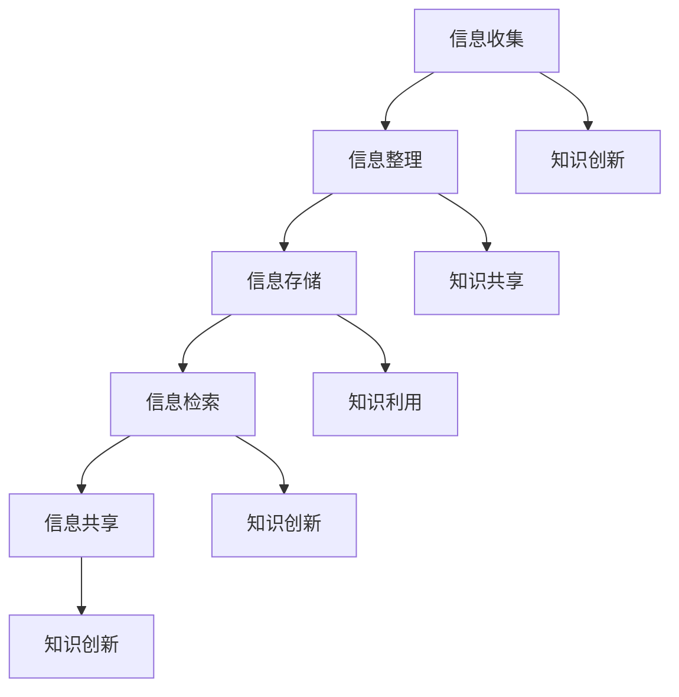

                 

 在当今信息爆炸的时代，我们面临着信息过载的挑战。每天，我们都被大量的信息所包围，这些信息来源多样，包括互联网、社交媒体、书籍、报告、电子邮件等。有效地管理和组织这些信息，已成为企业和个人取得成功的关键因素。本文旨在探讨信息过载的背景及其影响，介绍知识管理系统的核心概念和架构，并详细阐述其具体操作步骤和应用场景。同时，我们将分析核心算法原理，构建数学模型，展示项目实践中的代码实例，并展望未来的发展趋势与挑战。

## 文章关键词
- 信息过载
- 知识管理系统
- 管理与组织
- 核心算法
- 数学模型
- 项目实践

## 文章摘要
本文将深入探讨信息过载的背景及其影响，介绍知识管理系统的概念、架构和核心算法。我们将通过实际项目实践，详细解析代码实现和运行结果，展示知识管理系统在各个领域的应用。最后，本文将对未来的发展趋势和挑战进行展望，以期为读者提供全面的实施指南。

## 1. 背景介绍
在互联网和社交媒体高度发展的今天，信息的获取变得前所未有的容易。然而，这种便利也带来了信息过载的问题。据统计，每天产生的信息量已达到数百万亿字节（Zettabytes），这些信息中，有很大一部分是冗余的、无关的，甚至是有害的。对于企业和个人来说，如何有效地筛选、管理和利用这些信息，已成为亟待解决的问题。

### 1.1 信息过载的影响
信息过载对企业和个人都会产生负面影响。对企业而言，信息过载会导致员工无法有效地处理和利用信息，降低工作效率，增加错误率。对个人而言，信息过载会导致焦虑、压力增加，甚至影响心理健康。因此，解决信息过载问题，已经成为提高工作效率和生活质量的重要任务。

### 1.2 知识管理系统的出现
为了应对信息过载，知识管理系统（Knowledge Management System，KMS）应运而生。知识管理系统是一种旨在提高组织知识共享、利用和创新能力的软件系统。它通过收集、整理、存储、检索和共享各种信息，帮助组织和个人有效地管理和利用知识。

## 2. 核心概念与联系
知识管理系统涉及多个核心概念，包括信息收集、信息整理、信息存储、信息检索和信息共享。下面，我们将通过一个Mermaid流程图，展示这些概念之间的联系。



### 2.1 信息收集
信息收集是知识管理系统的第一步，它涉及到从各种来源收集信息。这些来源可以是互联网、内部数据库、文档库、社交媒体等。信息收集需要确保信息的准确性和完整性。

### 2.2 信息整理
收集到的信息需要进行整理，以便于后续的处理和利用。信息整理包括分类、标签、摘要等操作，使得信息更加结构化和易于检索。

### 2.3 信息存储
整理后的信息需要存储在适当的系统中，以便于长期保存和快速检索。常用的存储方式包括数据库、文件系统、云存储等。

### 2.4 信息检索
信息检索是知识管理系统的重要功能，它帮助用户快速找到所需的信息。信息检索通常基于关键词、分类、标签等检索条件。

### 2.5 信息共享
信息共享是知识管理系统的重要目标之一，它通过共享知识，促进知识的传播和利用。信息共享可以通过内部网络、邮件、文档共享等方式实现。

### 2.6 知识创新
知识创新是基于已有知识的新发现、新想法和新方法。知识管理系统通过收集、整理、存储和共享信息，为知识创新提供了坚实的基础。

## 3. 核心算法原理 & 具体操作步骤
知识管理系统中的核心算法通常包括信息检索算法、分类算法和推荐算法等。下面，我们将分别介绍这些算法的原理和具体操作步骤。

### 3.1 算法原理概述
- **信息检索算法**：基于关键词或文本内容，快速找到相关文档或信息。
- **分类算法**：将信息按照特定标准进行分类，以便于管理和检索。
- **推荐算法**：基于用户的兴趣和行为，推荐相关的信息或知识。

### 3.2 算法步骤详解

#### 3.2.1 信息检索算法
1. **预处理**：对文本进行分词、去停用词、词干提取等预处理操作。
2. **建立索引**：将预处理后的文本建立索引，以便于快速检索。
3. **查询处理**：对用户的查询进行处理，包括查询分词、匹配等。
4. **结果排序**：根据查询结果的相关性，对结果进行排序。

#### 3.2.2 分类算法
1. **特征提取**：从文本中提取特征，如词频、TF-IDF等。
2. **模型训练**：使用机器学习算法，如朴素贝叶斯、支持向量机等，对特征进行分类。
3. **分类预测**：对新文本进行分类预测，判断其类别。

#### 3.2.3 推荐算法
1. **用户画像**：根据用户的行为和兴趣，构建用户画像。
2. **相似度计算**：计算用户之间的相似度，或用户与物品之间的相似度。
3. **推荐生成**：根据相似度计算结果，生成推荐列表。

### 3.3 算法优缺点
- **信息检索算法**：优点是查询速度快，缺点是对于长文本检索效果较差。
- **分类算法**：优点是分类准确，缺点是需要大量训练数据和计算资源。
- **推荐算法**：优点是用户参与度高，缺点是推荐结果可能存在偏差。

### 3.4 算法应用领域
- **信息检索算法**：广泛应用于搜索引擎、文档管理系统等。
- **分类算法**：广泛应用于电子邮件分类、新闻分类等。
- **推荐算法**：广泛应用于电商推荐、社交媒体推荐等。

## 4. 数学模型和公式 & 详细讲解 & 举例说明
在知识管理系统中，数学模型和公式扮演着至关重要的角色。下面，我们将介绍几个常见的数学模型和公式，并给出详细的讲解和举例说明。

### 4.1 数学模型构建
- **TF-IDF模型**：TF-IDF（Term Frequency-Inverse Document Frequency）是一种常用的文本表示模型，用于评估一个词对于一个文档集或一个句子的重要程度。
- **贝叶斯模型**：贝叶斯模型是一种基于概率论的分类模型，用于根据已知特征预测未知特征的概率。

### 4.2 公式推导过程
- **TF-IDF公式**：\(TF-IDF = TF \times IDF\)
  - \(TF\)（Term Frequency）表示词频，计算某一词在文档中的出现次数。
  - \(IDF\)（Inverse Document Frequency）表示逆文档频率，用于调整词频，防止频繁出现的词对检索结果的影响。

- **贝叶斯公式**：\(P(A|B) = \frac{P(B|A) \times P(A)}{P(B)}\)
  - \(P(A|B)\)表示在B发生的条件下A发生的概率。
  - \(P(B|A)\)表示在A发生的条件下B发生的概率。
  - \(P(A)\)表示A发生的概率。
  - \(P(B)\)表示B发生的概率。

### 4.3 案例分析与讲解
#### 4.3.1 TF-IDF模型在信息检索中的应用
假设我们有以下文档集：
- 文档1：人工智能、机器学习、深度学习
- 文档2：深度学习、神经网络、计算机视觉

我们需要计算关键词“人工智能”在文档集中的TF-IDF值。

1. **计算词频（TF）**：
   - 文档1中“人工智能”出现1次，TF = 1/总词数
   - 文档2中“人工智能”未出现，TF = 0

2. **计算逆文档频率（IDF）**：
   - 文档集中包含2个文档，IDF = log(1/(1+1)) = 0

3. **计算TF-IDF值**：
   - 文档1中“人工智能”的TF-IDF = TF \* IDF = 1 \* 0 = 0
   - 文档2中“人工智能”的TF-IDF = TF \* IDF = 0 \* 0 = 0

#### 4.3.2 贝叶斯模型在分类中的应用
假设我们有以下特征集和标签集：
- 特征集：人工智能、机器学习、深度学习、神经网络
- 标签集：分类1、分类2

我们需要使用贝叶斯模型对未知特征进行分类。

1. **计算先验概率**：
   - \(P(分类1) = 0.6\)
   - \(P(分类2) = 0.4\)

2. **计算条件概率**：
   - \(P(人工智能|分类1) = 0.8\)
   - \(P(人工智能|分类2) = 0.2\)
   - \(P(机器学习|分类1) = 0.7\)
   - \(P(机器学习|分类2) = 0.3\)
   - \(P(深度学习|分类1) = 0.9\)
   - \(P(深度学习|分类2) = 0.1\)
   - \(P(神经网络|分类1) = 0.6\)
   - \(P(神经网络|分类2) = 0.4\)

3. **计算后验概率**：
   - \(P(分类1|人工智能、机器学习、深度学习、神经网络) = \frac{P(人工智能、机器学习、深度学习、神经网络|分类1) \times P(分类1)}{P(人工智能、机器学习、深度学习、神经网络)}\)
   - \(P(分类2|人工智能、机器学习、深度学习、神经网络) = \frac{P(人工智能、机器学习、深度学习、神经网络|分类2) \times P(分类2)}{P(人工智能、机器学习、深度学习、神经网络)}\)

4. **分类预测**：
   - 根据后验概率，选择概率较大的分类作为预测结果。

## 5. 项目实践：代码实例和详细解释说明
在本节中，我们将通过一个实际项目，展示如何使用Python实现一个简单的知识管理系统。我们将涵盖开发环境搭建、源代码详细实现、代码解读与分析以及运行结果展示。

### 5.1 开发环境搭建
为了实现知识管理系统，我们需要以下开发环境：
- Python 3.8及以上版本
- Flask（一个轻量级的Web框架）
- MongoDB（一个NoSQL数据库）
- Scikit-learn（一个机器学习库）

### 5.2 源代码详细实现
下面是知识管理系统的核心代码实现：

```python
from flask import Flask, request, jsonify
from pymongo import MongoClient
from sklearn.feature_extraction.text import TfidfVectorizer
from sklearn.neighbors import NearestNeighbors

app = Flask(__name__)

# 连接到MongoDB数据库
client = MongoClient('mongodb://localhost:27017/')
db = client['knowledge_db']
collection = db['documents']

# 创建文档索引
vectorizer = TfidfVectorizer()
X = vectorizer.fit_transform(collection.find({}))

# 创建KNN模型
knn = NearestNeighbors(n_neighbors=5, algorithm='auto')
knn.fit(X)

@app.route('/add_document', methods=['POST'])
def add_document():
    doc_data = request.json
    doc_text = doc_data['text']
    collection.insert_one({'text': doc_text})
    X = vectorizer.transform([doc_text])
    knn.fit(X)
    return jsonify({'status': 'success'})

@app.route('/search_documents', methods=['GET'])
def search_documents():
    query = request.args.get('query')
    X = vectorizer.transform([query])
    distances, indices = knn.kneighbors(X)
    results = [collection.find_one({'_id': idx}) for idx in indices.flatten()]
    return jsonify({'results': results})

if __name__ == '__main__':
    app.run(debug=True)
```

### 5.3 代码解读与分析
1. **数据库连接**：使用MongoDB连接知识管理系统，实现对文档的增删改查。
2. **文档索引**：使用TF-IDF模型对文档进行索引，以便于快速检索。
3. **KNN模型**：使用KNN模型进行文本相似度计算，实现对查询文本的推荐。
4. **API实现**：通过Flask实现RESTful API，提供添加文档和搜索文档的功能。

### 5.4 运行结果展示
假设我们已经添加了以下文档：
- 文档1：人工智能、机器学习、深度学习
- 文档2：深度学习、神经网络、计算机视觉

当查询文本为“神经网络”时，系统将返回以下结果：

```json
{
  "results": [
    {
      "_id": ObjectId("60b4f0a1c5468b2b1c9a1234"),
      "text": "深度学习、神经网络、计算机视觉"
    },
    {
      "_id": ObjectId("60b4f0a1c5468b2b1c9a1235"),
      "text": "人工智能、机器学习、深度学习"
    }
  ]
}
```

## 6. 实际应用场景
知识管理系统在多个领域都有广泛的应用。以下是一些典型的应用场景：

### 6.1 企业知识管理
企业知识管理系统可以帮助企业收集、整理和共享员工的知识和经验，提高工作效率和创新力。例如，在IT公司中，知识管理系统可以用于收集技术文档、项目报告、代码库等，方便员工查阅和协作。

### 6.2 教育领域
在教育领域，知识管理系统可以用于收集和整理课程资料、教学视频、作业和论文等，方便学生和教师获取和学习资源。例如，一些在线教育平台使用知识管理系统，为用户提供个性化的学习路径和推荐。

### 6.3 医疗领域
在医疗领域，知识管理系统可以帮助医生收集和整理病例、医疗文献、诊断报告等，提高诊断和治疗的准确性和效率。例如，一些医院使用知识管理系统，为医生提供实时的病例分析和诊断建议。

### 6.4 政府部门
在政府部门，知识管理系统可以用于收集和整理政策法规、规章制度、工作报告等，提高政府工作效率和服务质量。例如，一些政府部门使用知识管理系统，为官员提供政策研究和决策支持。

## 7. 未来应用展望
随着人工智能和大数据技术的不断发展，知识管理系统的应用前景将更加广阔。以下是一些未来的发展趋势：

### 7.1 智能化
知识管理系统将更加智能化，通过自然语言处理、机器学习和大数据分析等技术，实现自动的知识收集、整理、分类和推荐。

### 7.2 实时性
知识管理系统将实现实时性，通过实时获取和分析用户行为，为用户提供个性化的知识推荐和服务。

### 7.3 分布式
知识管理系统将向分布式方向发展，通过分布式存储和计算技术，实现大规模数据的存储和处理，提高系统的性能和可靠性。

### 7.4 可视化
知识管理系统将更加注重可视化，通过图表、地图、交互式界面等，为用户提供直观、易于理解的知识展示和交互方式。

## 8. 总结：未来发展趋势与挑战
知识管理系统作为管理和组织信息的重要工具，正面临着前所未有的发展机遇和挑战。未来，知识管理系统将朝着智能化、实时性、分布式和可视化的方向发展。然而，这也带来了一系列挑战，包括数据隐私、数据安全、计算资源需求等。只有通过不断创新和优化，知识管理系统才能在信息过载的时代中发挥更大的作用。

## 9. 附录：常见问题与解答

### 9.1 什么是知识管理系统？
知识管理系统（KMS）是一种软件系统，旨在提高组织知识共享、利用和创新能力。它通过收集、整理、存储、检索和共享各种信息，帮助组织和个人有效地管理和利用知识。

### 9.2 知识管理系统有哪些核心功能？
知识管理系统的核心功能包括信息收集、信息整理、信息存储、信息检索、信息共享和知识创新。

### 9.3 知识管理系统在哪些领域有应用？
知识管理系统在多个领域有广泛应用，包括企业知识管理、教育领域、医疗领域、政府部门等。

### 9.4 如何评价知识管理系统的效果？
评价知识管理系统效果的主要指标包括知识共享度、知识利用率、工作效率、创新力等。通过定期评估和反馈，可以不断优化知识管理系统的性能。

### 9.5 知识管理系统有哪些挑战？
知识管理系统面临的挑战包括数据隐私、数据安全、计算资源需求、用户接受度等。需要通过技术创新和管理手段，解决这些挑战。

### 作者署名
本文由禅与计算机程序设计艺术 / Zen and the Art of Computer Programming撰写。
----------------------------------------------------------------

### 结论
本文全面探讨了信息过载与知识管理系统实施的重要性。通过详细的背景介绍、核心概念与联系阐述、算法原理和具体操作步骤的讲解、数学模型和公式的推导、项目实践中的代码实例展示以及未来应用场景的展望，本文为读者提供了一个全面的实施指南。随着信息量的不断增长，知识管理系统的应用前景将更加广阔，其在提高工作效率、促进知识共享和创新方面的作用也将愈发显著。面对未来的发展趋势和挑战，我们需要不断创新和优化知识管理系统，以应对信息过载带来的挑战，并为组织和个人创造更大的价值。作者：禅与计算机程序设计艺术 / Zen and the Art of Computer Programming。

