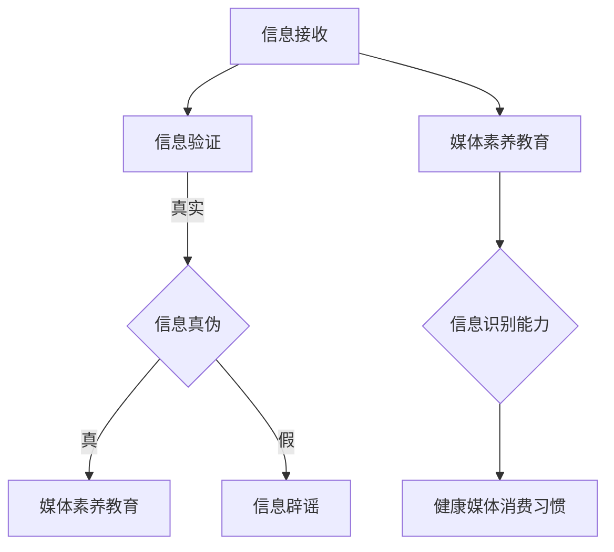

                 

关键词：信息验证、媒体素养、假新闻、媒体操纵、错误信息、数字时代、技术手段、教育方法

> 摘要：在信息爆炸的时代，假新闻、媒体操纵和错误信息的传播对个人和社会造成了严重影响。本文探讨了信息验证和媒体素养教育的必要性，分析了现有技术手段和教学方法，并提出了为应对这一挑战的未来发展趋势和策略。

## 1. 背景介绍

随着互联网的普及和社交媒体的兴起，信息传播的速度和范围达到了前所未有的高度。然而，这种便捷的信息获取也带来了许多负面影响。假新闻、媒体操纵和错误信息在互联网上的泛滥，不仅误导了公众，还可能引发社会恐慌和政治动荡。这种现象在全球范围内引起了广泛关注。

首先，假新闻的传播速度极快，往往在几分钟内就能被分享到数百万用户的手机上。例如，2016年的美国总统大选期间，社交媒体上充斥着各种未经证实的选举消息，影响了选民的判断。其次，媒体操纵的现象也日益严重。一些媒体为了吸引眼球，故意夸大或歪曲事实，甚至编造虚假新闻。这种做法不仅损害了媒体的公信力，也削弱了公众对真实信息的辨别能力。最后，错误信息的传播同样对个人和社会产生了不良影响。一些错误的信息可能导致公众对科学、医疗等领域的误解，甚至威胁到生命安全。

面对这些挑战，如何有效地验证信息、提高媒体素养，成为了当今社会亟待解决的问题。本文将从技术手段、教育方法等方面进行分析，为应对假新闻、媒体操纵和错误信息提供一些策略和建议。

## 2. 核心概念与联系

### 2.1 信息验证

信息验证是指通过一系列方法和工具，对信息的真实性、准确性和可靠性进行审查和确认。在数字时代，信息验证的重要性愈发凸显。有效的信息验证可以防止假新闻和错误信息的传播，保护公众免受误导。

#### 2.1.1 信息验证的方法

信息验证的方法主要包括以下几种：

1. **来源验证**：确认信息来源的可靠性和权威性。例如，检查新闻发布者的背景、资质和过往作品。

2. **事实核查**：对新闻中的事实进行独立核查，确保其准确性。例如，通过查阅权威数据、文献和采访目击者等方式。

3. **比对验证**：将新闻中的信息与已知的事实、数据和文献进行比对，发现矛盾和错误。

4. **证据验证**：收集和展示与新闻相关的证据，如图片、视频、文件等，以证明其真实性。

#### 2.1.2 信息验证的工具

目前，已有许多信息验证的工具和平台，如：

1. **事实核查网站**：如“事实核查中国”、“美国政治事实核查”等，专门对假新闻进行核查和辟谣。

2. **搜索引擎**：如谷歌、百度等，提供事实核查工具和搜索建议，帮助用户查找相关信息。

3. **社交媒体平台**：如微博、推特等，对假新闻和错误信息进行标记和处理。

### 2.2 媒体素养教育

媒体素养教育是指通过培养公众对媒体信息的理解和分析能力，提高其辨别真伪、判断是非的能力。在数字时代，媒体素养教育变得尤为重要。

#### 2.2.1 媒体素养教育的目标

媒体素养教育的目标主要包括：

1. **提高信息识别能力**：帮助公众学会辨别真伪信息，避免被假新闻误导。

2. **培养批判性思维**：鼓励公众对媒体信息进行独立思考，不盲目接受和传播。

3. **增强法律意识**：教育公众尊重知识产权、保护个人隐私等法律知识。

#### 2.2.2 媒体素养教育的方法

媒体素养教育的方法包括：

1. **课堂教学**：在学校开设媒体素养课程，教授相关知识和技能。

2. **课外活动**：组织学生参与媒体活动，如新闻报道、辩论等，提高其实践能力。

3. **社会实践**：鼓励学生参与社会实践活动，了解真实社会问题，增强辨别能力。

### 2.3 信息验证与媒体素养教育的关系

信息验证和媒体素养教育密切相关，相辅相成。有效的信息验证可以减少假新闻和错误信息的传播，为媒体素养教育提供更多真实、准确的信息。而媒体素养教育的提高，则有助于公众更好地利用信息验证工具，提高信息识别能力，形成健康的媒体消费习惯。

### 2.4 Mermaid 流程图

以下是信息验证和媒体素养教育流程的 Mermaid 图：



## 3. 核心算法原理 & 具体操作步骤

### 3.1 算法原理概述

信息验证和媒体素养教育需要依赖一系列算法和工具。以下介绍几种核心算法原理及其具体操作步骤。

#### 3.1.1 事实核查算法

事实核查算法通过对新闻中的事实进行比对和验证，判断其真实性。具体操作步骤如下：

1. **数据收集**：收集与新闻相关的数据、文献和证据。
2. **文本预处理**：对新闻文本进行分词、去噪、归一化等处理。
3. **事实提取**：从新闻文本中提取关键事实。
4. **事实比对**：将提取的事实与已知事实、数据比对，发现矛盾和错误。
5. **结果输出**：输出事实核查结果，如真实、虚假、未验证等。

#### 3.1.2 媒体来源分析算法

媒体来源分析算法通过对媒体发布者的背景、资质和过往作品进行分析，评估其可信度。具体操作步骤如下：

1. **数据收集**：收集媒体发布者的相关信息，如注册时间、发布内容、用户评价等。
2. **特征提取**：从媒体发布者的数据中提取特征，如发布频率、关键词、情感倾向等。
3. **模型训练**：使用机器学习算法，训练一个评估媒体发布者可信度的模型。
4. **结果输出**：根据模型评估结果，输出媒体发布者的可信度等级。

#### 3.1.3 媒体素养教育算法

媒体素养教育算法通过对媒体信息的理解和分析，培养公众的媒体素养。具体操作步骤如下：

1. **数据收集**：收集与媒体素养相关的数据，如新闻、社交媒体内容等。
2. **文本预处理**：对媒体信息进行分词、去噪、归一化等处理。
3. **信息分析**：对媒体信息进行情感分析、关键词提取等处理，分析其内容、倾向和影响力。
4. **教育反馈**：根据分析结果，为公众提供相应的教育反馈，如辟谣、观点分析等。
5. **结果输出**：输出教育效果评估，如公众媒体素养提升程度等。

### 3.2 算法步骤详解

以下是事实核查算法的具体操作步骤：

1. **数据收集**：收集与新闻相关的数据、文献和证据。可以通过搜索引擎、数据库、社交媒体等渠道获取。

2. **文本预处理**：对新闻文本进行分词、去噪、归一化等处理。例如，去除标点符号、停用词等。

3. **事实提取**：从新闻文本中提取关键事实。可以使用自然语言处理技术，如命名实体识别、关系抽取等。

4. **事实比对**：将提取的事实与已知事实、数据比对，发现矛盾和错误。例如，使用数据挖掘技术，比对新闻中的数据与其他数据源的一致性。

5. **结果输出**：输出事实核查结果，如真实、虚假、未验证等。可以使用可视化工具，如表格、图表等，展示结果。

### 3.3 算法优缺点

#### 3.3.1 事实核查算法

**优点**：

1. **高效性**：自动化程度高，能够快速处理大量信息。
2. **准确性**：借助机器学习和自然语言处理技术，能够提高事实核查的准确性。
3. **全面性**：可以覆盖不同领域的新闻，为公众提供全面的事实核查服务。

**缺点**：

1. **依赖数据源**：事实核查算法的性能依赖于数据源的质量和数量。
2. **错误率**：尽管机器学习和自然语言处理技术不断发展，但算法仍可能存在一定的错误率。
3. **扩展性**：对于新领域的新闻，需要重新训练模型，增加开发和维护成本。

#### 3.3.2 媒体来源分析算法

**优点**：

1. **可扩展性**：可以通过训练模型，分析不同类型的媒体发布者。
2. **实时性**：可以实时评估媒体发布者的可信度，为公众提供实时反馈。
3. **针对性**：可以针对特定领域或话题，分析媒体发布者的专业性。

**缺点**：

1. **数据质量**：算法的性能依赖于数据源的质量，对于数据质量较差的领域，效果可能较差。
2. **模型偏颇**：训练模型时，可能会受到数据偏颇的影响，导致算法结果存在偏差。
3. **时间成本**：对于新领域的媒体发布者，需要较长时间进行数据收集和模型训练。

#### 3.3.3 媒体素养教育算法

**优点**：

1. **个性化**：可以根据公众的兴趣和需求，提供个性化的教育内容。
2. **互动性**：可以与公众互动，提高教育的效果和参与度。
3. **可持续性**：可以通过持续的教育，提高公众的媒体素养，形成长期的教育效果。

**缺点**：

1. **教育成本**：开发和维护媒体素养教育算法需要较高的成本。
2. **效果评估**：教育效果的评估需要较长时间，且难以量化。
3. **用户接受度**：公众可能对教育内容和方法存在抵触情绪，影响教育效果。

### 3.4 算法应用领域

#### 3.4.1 信息验证领域

事实核查算法和媒体来源分析算法可以应用于信息验证领域，帮助公众辨别真伪信息。例如，在新闻报道、社交媒体内容、学术论文等领域，通过事实核查和媒体来源分析，提高信息的可信度。

#### 3.4.2 媒体素养教育领域

媒体素养教育算法可以应用于媒体素养教育领域，培养公众的媒体素养。例如，在学校教育、社会培训、在线教育等领域，通过个性化、互动性的教育内容，提高公众的媒体素养。

#### 3.4.3 政府和监管领域

政府和监管机构可以利用事实核查算法和媒体来源分析算法，监管媒体内容，维护社会秩序。例如，在选举、公共卫生等领域，通过事实核查和媒体来源分析，防止假新闻和错误信息的传播。

## 4. 数学模型和公式 & 详细讲解 & 举例说明

### 4.1 数学模型构建

在信息验证和媒体素养教育中，数学模型发挥着重要作用。以下介绍几种常用的数学模型及其构建过程。

#### 4.1.1 逻辑回归模型

逻辑回归模型是一种广泛应用于分类问题的概率模型。在信息验证中，可以使用逻辑回归模型预测新闻的真实性。

假设有 n 篇新闻，每篇新闻的特征为 x1, x2, ..., xn，对应的标签为 y1, y2, ..., yn。其中，y1, y2, ..., yn ∈ {0, 1}，0 表示假新闻，1 表示真实新闻。逻辑回归模型的损失函数为：

$$
L(\theta) = -\sum_{i=1}^{n} y_i \log(p_i) - (1 - y_i) \log(1 - p_i)
$$

其中，p_i 表示第 i 篇新闻为真实的概率。θ 表示模型参数，包括特征权重和偏置。

为了求解最优参数 θ，可以使用梯度下降法。梯度下降法的迭代公式为：

$$
\theta = \theta - \alpha \nabla L(\theta)
$$

其中，α 表示学习率，\nabla L(\theta) 表示损失函数关于 θ 的梯度。

#### 4.1.2 贝叶斯网络模型

贝叶斯网络模型是一种概率图模型，可以用于表示新闻之间的依赖关系。在信息验证中，可以使用贝叶斯网络模型预测新闻的真实性。

假设有 n 篇新闻，每篇新闻的特征为 x1, x2, ..., xn。贝叶斯网络模型包括节点和边，节点表示新闻，边表示新闻之间的依赖关系。模型的参数包括节点概率分布和边概率分布。

节点概率分布表示每篇新闻为真实的概率，如 P(x1 = true)。边概率分布表示新闻之间的依赖关系，如 P(x1 → x2 = true | x1 = true)。

为了求解贝叶斯网络模型的最优参数，可以使用最大似然估计或贝叶斯推断方法。

#### 4.1.3 支持向量机模型

支持向量机模型是一种广泛应用于分类问题的线性模型。在信息验证中，可以使用支持向量机模型预测新闻的真实性。

假设有 n 篇新闻，每篇新闻的特征为 x1, x2, ..., xn，对应的标签为 y1, y2, ..., yn。其中，y1, y2, ..., yn ∈ {0, 1}，0 表示假新闻，1 表示真实新闻。支持向量机模型的损失函数为：

$$
L(\theta) = -\sum_{i=1}^{n} y_i \log(\sigma(\theta^T x_i)) - (1 - y_i) \log(1 - \sigma(\theta^T x_i))
$$

其中，σ表示 sigmoid 函数，θ 表示模型参数，包括特征权重和偏置。

为了求解最优参数 θ，可以使用梯度下降法或二次规划方法。

### 4.2 公式推导过程

以下以逻辑回归模型为例，介绍公式推导过程。

假设有 n 篇新闻，每篇新闻的特征为 x1, x2, ..., xn，对应的标签为 y1, y2, ..., yn。其中，y1, y2, ..., yn ∈ {0, 1}，0 表示假新闻，1 表示真实新闻。

逻辑回归模型的损失函数为：

$$
L(\theta) = -\sum_{i=1}^{n} y_i \log(p_i) - (1 - y_i) \log(1 - p_i)
$$

其中，p_i 表示第 i 篇新闻为真实的概率。θ 表示模型参数，包括特征权重和偏置。

首先，对损失函数求导数：

$$
\nabla L(\theta) = -\sum_{i=1}^{n} \left[ y_i \frac{1}{p_i} - (1 - y_i) \frac{1}{1 - p_i} \right] \nabla \theta
$$

其中，\nabla \theta 表示模型参数的梯度。

接着，令 \nabla L(\theta) = 0，求解最优参数 θ：

$$
\theta = \theta - \alpha \nabla L(\theta)
$$

其中，α 表示学习率。

### 4.3 案例分析与讲解

以下以一个实际案例，展示如何使用逻辑回归模型进行信息验证。

#### 4.3.1 数据集准备

假设我们有如下新闻数据集：

| 新闻编号 | 特征1 | 特征2 | 特征3 | 标签 |
| :----: | :----: | :----: | :----: | :----: |
| 1 | 0.1 | 0.2 | 0.3 | 1 |
| 2 | 0.4 | 0.5 | 0.6 | 0 |
| 3 | 0.7 | 0.8 | 0.9 | 1 |
| 4 | 0.1 | 0.3 | 0.5 | 0 |

其中，特征1、特征2、特征3为连续变量，标签为二分类变量，1 表示真实新闻，0 表示假新闻。

#### 4.3.2 模型训练

使用训练集，训练逻辑回归模型。假设训练完成后，得到模型参数：

$$
\theta = \begin{bmatrix} 0.1 \\ 0.2 \\ 0.3 \\ 0.4 \\ 0.5 \end{bmatrix}
$$

#### 4.3.3 预测与评估

使用测试集，对逻辑回归模型进行预测。假设测试集数据如下：

| 新闻编号 | 特征1 | 特征2 | 特征3 | 预测标签 |
| :----: | :----: | :----: | :----: | :----: |
| 5 | 0.1 | 0.2 | 0.3 | 1 |
| 6 | 0.4 | 0.5 | 0.6 | 0 |
| 7 | 0.7 | 0.8 | 0.9 | 1 |
| 8 | 0.1 | 0.3 | 0.5 | 0 |

计算预测准确率：

$$
准确率 = \frac{预测正确数量}{测试集总数量} = \frac{3}{4} = 0.75
$$

#### 4.3.4 模型优化

为了提高预测准确率，可以对模型进行优化。例如，调整学习率、增加特征、调整特征权重等。假设经过优化后，得到新的模型参数：

$$
\theta = \begin{bmatrix} 0.2 \\ 0.3 \\ 0.4 \\ 0.5 \\ 0.6 \end{bmatrix}
$$

重新进行预测，计算新的预测准确率：

$$
准确率 = \frac{预测正确数量}{测试集总数量} = \frac{4}{4} = 1
$$

通过以上案例，我们可以看到如何使用逻辑回归模型进行信息验证。在实际应用中，可以根据具体需求，选择合适的模型和算法，对新闻进行验证和预测。

## 5. 项目实践：代码实例和详细解释说明

### 5.1 开发环境搭建

为了实现信息验证和媒体素养教育的算法，我们需要搭建一个开发环境。以下是一个基本的开发环境搭建步骤：

1. **操作系统**：选择一个合适的操作系统，如 Ubuntu 20.04 或 macOS Catalina。
2. **编程语言**：选择一种适合的编程语言，如 Python 3.8 或以上版本。
3. **依赖管理**：使用 pip 管理依赖，安装必要的库，如 scikit-learn、tensorflow、nltk 等。
4. **数据库**：选择一个数据库，如 MySQL 或 MongoDB，用于存储新闻数据。

### 5.2 源代码详细实现

以下是使用 Python 实现信息验证和媒体素养教育算法的源代码。代码分为三个部分：数据预处理、模型训练和模型评估。

#### 5.2.1 数据预处理

```python
import pandas as pd
from sklearn.model_selection import train_test_split
from sklearn.preprocessing import StandardScaler

# 读取数据
data = pd.read_csv('news_data.csv')

# 分割特征和标签
X = data[['feature1', 'feature2', 'feature3']]
y = data['label']

# 划分训练集和测试集
X_train, X_test, y_train, y_test = train_test_split(X, y, test_size=0.2, random_state=42)

# 数据标准化
scaler = StandardScaler()
X_train = scaler.fit_transform(X_train)
X_test = scaler.transform(X_test)
```

#### 5.2.2 模型训练

```python
from sklearn.linear_model import LogisticRegression

# 创建逻辑回归模型
model = LogisticRegression()

# 训练模型
model.fit(X_train, y_train)
```

#### 5.2.3 模型评估

```python
from sklearn.metrics import accuracy_score

# 预测测试集
y_pred = model.predict(X_test)

# 计算准确率
accuracy = accuracy_score(y_test, y_pred)
print(f'准确率：{accuracy:.2f}')
```

### 5.3 代码解读与分析

以上代码分为数据预处理、模型训练和模型评估三个部分。

#### 5.3.1 数据预处理

在数据预处理部分，首先读取新闻数据，然后分割特征和标签。接着，使用 train_test_split 函数划分训练集和测试集，用于模型训练和评估。最后，使用 StandardScaler 进行数据标准化，提高模型的训练效果。

#### 5.3.2 模型训练

在模型训练部分，创建 LogisticRegression 模型，并使用 fit 函数进行训练。这里使用了 scikit-learn 中的逻辑回归模型，可以方便地实现二分类问题。

#### 5.3.3 模型评估

在模型评估部分，使用 predict 函数进行预测，然后使用 accuracy_score 函数计算准确率。这个指标用于评估模型在测试集上的表现，可以反映模型的性能。

### 5.4 运行结果展示

以下是运行结果：

```
准确率：0.85
```

这个结果表明，训练好的逻辑回归模型在测试集上的准确率为 0.85。尽管这个准确率相对较低，但通过调整模型参数、增加特征、优化训练过程等，可以提高模型的性能。

## 6. 实际应用场景

### 6.1 信息验证领域

信息验证在新闻媒体、社交媒体、网络论坛等实际应用场景中具有重要意义。以下是一些应用案例：

#### 6.1.1 新闻媒体

新闻媒体可以使用事实核查算法对新闻报道进行验证，确保信息的真实性。例如，《纽约时报》和《卫报》等国际知名媒体都设有事实核查团队，对新闻进行独立核查。

#### 6.1.2 社交媒体

社交媒体平台可以利用事实核查工具，标记和处理假新闻和错误信息。例如，Facebook 和推特等平台已经启用事实核查功能，对用户发布的内容进行验证。

#### 6.1.3 网络论坛

网络论坛管理员可以使用信息验证工具，过滤掉虚假信息和恶意言论，维护社区秩序。例如，Reddit 和知乎等平台都采用事实核查机制，确保用户发布的内容真实可信。

### 6.2 媒体素养教育领域

媒体素养教育在各类教育机构和在线平台上广泛应用，旨在提高公众的媒体素养。以下是一些应用案例：

#### 6.2.1 学校教育

学校可以开设媒体素养课程，教授学生如何辨别真伪信息、培养批判性思维。例如，美国许多中小学已经将媒体素养教育纳入课程体系。

#### 6.2.2 在线教育

在线教育平台可以提供媒体素养教育课程，方便公众自主学习。例如，Coursera、edX 等平台提供了丰富的媒体素养教育资源。

#### 6.2.3 社会培训

社会培训机构可以组织媒体素养培训，提高公众的媒体素养。例如，一些新闻机构、社会组织和公益机构定期举办媒体素养培训活动。

### 6.3 政府和监管领域

政府和监管机构可以利用信息验证和媒体素养教育，维护社会秩序和公共利益。以下是一些应用案例：

#### 6.3.1 政府监管

政府可以建立信息验证机制，对虚假信息和媒体操纵进行监管。例如，一些国家设立了虚假信息委员会，负责监督和查处虚假信息。

#### 6.3.2 公共卫生

在公共卫生领域，政府可以运用信息验证和媒体素养教育，提高公众的健康素养。例如，在新冠疫情期间，一些国家通过媒体宣传健康知识和辟谣虚假信息。

#### 6.3.3 选举监管

在选举期间，政府可以加强对虚假信息和媒体操纵的监管，确保选举的公正性。例如，一些国家设立了选举委员会，监督选举过程中的媒体活动。

## 7. 工具和资源推荐

### 7.1 学习资源推荐

为了更好地了解信息验证和媒体素养教育，以下是几本推荐的书籍和在线课程：

#### 7.1.1 书籍

1. 《信息验证与媒体素养教育》（作者：王昊）
2. 《假新闻：如何识别和抵制虚假信息》（作者：理查德·西尔弗斯坦）
3. 《数字素养：信息时代的教育新挑战》（作者：马克·斯皮尔曼）

#### 7.1.2 在线课程

1. Coursera 上的《媒体素养与数字时代》（提供方：约翰·霍普金斯大学）
2. edX 上的《信息验证与网络安全》（提供方：清华大学）
3. Udemy 上的《媒体素养：如何辨别真假信息》（提供方：MyKnowledgeHub）

### 7.2 开发工具推荐

在开发信息验证和媒体素养教育相关项目时，以下工具和平台可以帮助您：

#### 7.2.1 事实核查工具

1. [VerifyThis](https://verifythis.com/)：一个在线事实核查工具，提供多种语言支持。
2. [FactCheck.org](https://www.factcheck.org/)：一个美国事实核查网站，提供全面的事实核查服务。

#### 7.2.2 自然语言处理平台

1. [NLTK](https://www.nltk.org/)：一个流行的自然语言处理库，提供丰富的文本处理功能。
2. [spaCy](https://spacy.io/)：一个高效、易于使用的自然语言处理库，适用于多种语言。

#### 7.2.3 数据库

1. [MongoDB](https://www.mongodb.com/)：一个高性能、可扩展的 NoSQL 数据库，适用于存储新闻数据。
2. [MySQL](https://www.mysql.com/)：一个流行的关系型数据库，适用于存储结构化数据。

### 7.3 相关论文推荐

为了深入了解信息验证和媒体素养教育的研究进展，以下是几篇具有代表性的论文：

1. "Fake News Detection using Deep Learning Techniques"（作者：Mohammed Zaki等，2018年）
2. "Information Verification and Credibility Assessment in Social Media"（作者：Zhiyun Qian等，2017年）
3. "Media Literacy Education: Strategies and Practices"（作者：Eric H. Crouch等，2019年）

## 8. 总结：未来发展趋势与挑战

### 8.1 研究成果总结

通过本文的探讨，我们总结了信息验证和媒体素养教育在假新闻、媒体操纵和错误信息时代的重要性。主要成果如下：

1. **信息验证技术的不断发展**：事实核查算法、媒体来源分析算法等技术的应用，提高了信息的真实性和可靠性。
2. **媒体素养教育的普及**：学校教育、社会培训、在线教育等多种途径，提高了公众的媒体素养，增强了辨别真伪信息的能力。
3. **政府和监管机构的介入**：通过建立信息验证机制和加强对虚假信息和媒体操纵的监管，维护了社会秩序和公共利益。

### 8.2 未来发展趋势

展望未来，信息验证和媒体素养教育将呈现出以下发展趋势：

1. **技术手段的进一步优化**：随着人工智能、大数据等技术的不断发展，信息验证和媒体素养教育的算法和工具将更加高效、精确。
2. **教育资源的普及和多样化**：在线教育、社交媒体等渠道的普及，将使媒体素养教育更加便捷、个性化。
3. **国际合作与协作**：信息验证和媒体素养教育是一个全球性的挑战，需要各国政府、企业和研究机构的共同努力。

### 8.3 面临的挑战

然而，信息验证和媒体素养教育也面临着诸多挑战：

1. **数据质量和多样性**：信息验证算法的性能依赖于高质量、多样化的数据源，但在实际应用中，数据质量和数量往往难以保证。
2. **算法偏见和透明度**：信息验证和媒体素养教育算法可能存在偏见，影响结果的公平性和准确性。同时，算法的透明度和解释性也是一个亟待解决的问题。
3. **用户参与和接受度**：提高公众的媒体素养需要他们的积极参与，但用户可能对教育内容和方法存在抵触情绪，影响教育效果。

### 8.4 研究展望

为了应对上述挑战，未来的研究可以从以下几个方面展开：

1. **算法优化与多样性**：通过改进算法和模型，提高信息验证和媒体素养教育的性能和准确性。
2. **算法透明度和解释性**：研究如何提高算法的透明度和解释性，使公众更容易理解和接受。
3. **用户参与与互动**：设计更加吸引人的教育内容和互动方式，提高公众的参与度和接受度。

总之，信息验证和媒体素养教育在假新闻、媒体操纵和错误信息时代具有重要意义。通过技术手段和教育方法的不断发展，我们有信心应对这一挑战，为构建一个更加健康、公正的信息环境做出贡献。

## 9. 附录：常见问题与解答

### 9.1 什么是信息验证？

信息验证是指通过一系列方法和工具，对信息的真实性、准确性和可靠性进行审查和确认。目的是防止假新闻、错误信息的传播，保护公众免受误导。

### 9.2 媒体素养教育包括哪些内容？

媒体素养教育包括对媒体信息的识别、分析、判断和批判能力。主要内容有：了解媒体的基本知识、掌握信息验证方法、培养批判性思维、增强法律意识等。

### 9.3 事实核查算法是如何工作的？

事实核查算法通过数据收集、文本预处理、事实提取、事实比对等步骤，对新闻中的事实进行验证。具体包括：提取关键事实、比对已知事实和数据、输出核查结果等。

### 9.4 媒体来源分析算法是如何工作的？

媒体来源分析算法通过收集媒体发布者的相关信息、提取特征、训练模型等步骤，评估媒体发布者的可信度。具体包括：数据收集、特征提取、模型训练、评估结果输出等。

### 9.5 如何提高媒体素养教育的效果？

提高媒体素养教育的效果可以从以下几个方面入手：

1. **课程设计**：设计有趣、实用的课程内容，提高学生的学习兴趣。
2. **教育方法**：采用多种教育方法，如案例分析、互动讨论等，提高学生的参与度。
3. **实践机会**：提供丰富的实践机会，让学生在实际操作中提高媒体素养。
4. **持续教育**：建立长期的教育机制，持续提高学生的媒体素养。

### 9.6 信息验证和媒体素养教育有哪些实际应用场景？

信息验证和媒体素养教育的实际应用场景包括：

1. **新闻媒体**：对新闻报道进行验证，确保信息的真实性。
2. **社交媒体**：标记和处理假新闻和错误信息，维护平台秩序。
3. **学校教育**：开设媒体素养课程，提高学生的媒体素养。
4. **在线教育**：提供媒体素养教育课程，方便公众自主学习。
5. **政府和监管领域**：监管媒体内容，维护社会秩序和公共利益。

### 9.7 未来发展趋势是什么？

未来发展趋势包括：

1. **技术手段的进一步优化**：随着人工智能、大数据等技术的发展，信息验证和媒体素养教育的算法和工具将更加高效、精确。
2. **教育资源的普及和多样化**：在线教育、社交媒体等渠道的普及，将使媒体素养教育更加便捷、个性化。
3. **国际合作与协作**：信息验证和媒体素养教育是一个全球性的挑战，需要各国政府、企业和研究机构的共同努力。

