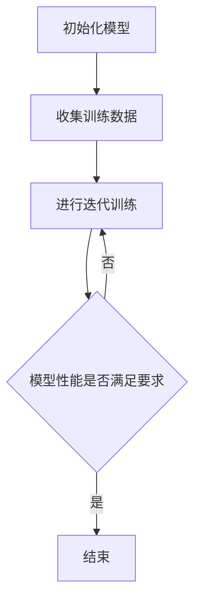

                 

### 关键词 Keywords

元学习，深度学习，机器学习，算法原理，代码实例，数学模型，实际应用，未来展望。

### 摘要 Abstract

本文旨在深入探讨元学习（Meta-Learning）的原理及其在深度学习和机器学习中的应用。通过详细的算法原理和数学模型解析，以及代码实例的讲解，本文将帮助读者理解元学习的核心概念、操作步骤及其在不同领域中的实际应用。此外，本文还将展望元学习在未来的发展趋势和面临的挑战。

## 1. 背景介绍

### 1.1 元学习的起源

元学习（Meta-Learning）这一概念最早由E. L. Moses在1986年提出，指的是学习算法自身的学习过程。在传统机器学习中，算法通常针对特定任务进行训练，而元学习则是通过学习如何学习来提高算法的泛化能力和效率。

### 1.2 深度学习的崛起

随着深度学习（Deep Learning）的兴起，元学习得到了广泛关注。深度学习通过构建复杂的神经网络模型，能够自动从大量数据中学习特征，但其训练过程通常需要大量计算资源和时间。元学习为深度学习提供了一种更高效的学习方法，使得模型能够在更短的时间内完成训练并达到更好的性能。

### 1.3 机器学习的瓶颈

尽管机器学习在许多领域取得了显著的成果，但仍然面临着一些挑战，如数据标注困难、模型可解释性差、训练效率低等。元学习通过引入自适应学习策略，有望解决这些瓶颈问题。

## 2. 核心概念与联系

### 2.1 元学习的基本概念

元学习涉及以下基本概念：

- **泛化能力**：模型在未知数据上的表现能力。
- **迁移学习**：将一个任务的学习经验应用于另一个相关任务。
- **模型泛化**：通过较少的训练数据，模型能够泛化到新的数据集。
- **自适应学习**：模型在新的数据上自动调整其参数。

### 2.2 元学习与深度学习的联系

深度学习是元学习的一个重要应用领域。深度学习模型通过多层神经网络，能够自动提取数据中的特征。而元学习则通过优化学习过程，使得深度学习模型能够在更短的时间内达到更高的性能。

### 2.3 元学习与机器学习的联系

机器学习是元学习的基础。元学习通过学习如何学习，提高了机器学习模型的泛化能力和效率，使得模型能够更快速地适应新的任务和数据。

### 2.4 Mermaid 流程图

以下是一个简单的Mermaid流程图，展示了元学习的基本过程：



## 3. 核心算法原理 & 具体操作步骤

### 3.1 算法原理概述

元学习算法主要分为两大类：模型选择和模型调整。

- **模型选择**：通过比较多个模型的性能，选择最优模型。
- **模型调整**：通过调整模型的参数，提高其泛化能力。

### 3.2 算法步骤详解

1. **数据预处理**：收集并预处理训练数据。
2. **模型初始化**：初始化多个模型。
3. **模型训练**：使用训练数据对模型进行训练。
4. **模型评估**：评估模型的性能。
5. **模型选择**：根据性能选择最优模型。
6. **模型调整**：调整模型参数，提高其泛化能力。
7. **迭代过程**：重复步骤3-6，直至模型性能满足要求。

### 3.3 算法优缺点

**优点**：

- 提高模型的泛化能力。
- 减少训练时间。
- 支持迁移学习。

**缺点**：

- 需要大量的计算资源。
- 模型选择过程可能复杂。

### 3.4 算法应用领域

元学习在以下领域有广泛应用：

- 自动驾驶
- 医疗诊断
- 自然语言处理
- 图像识别

## 4. 数学模型和公式 & 详细讲解 & 举例说明

### 4.1 数学模型构建

元学习算法通常涉及以下数学模型：

- **损失函数**：衡量模型预测结果与真实值之间的差异。
- **优化算法**：调整模型参数，使损失函数最小化。

### 4.2 公式推导过程

以下是一个简单的损失函数和优化算法的公式推导：

损失函数：
$$L(\theta) = \frac{1}{m}\sum_{i=1}^{m}(y_i - \hat{y}_i)^2$$

其中，$y_i$为真实值，$\hat{y}_i$为模型预测值，$m$为样本数量。

优化算法（梯度下降）：
$$\theta = \theta - \alpha \frac{\partial L(\theta)}{\partial \theta}$$

其中，$\alpha$为学习率。

### 4.3 案例分析与讲解

假设我们有一个二分类问题，数据集包含100个样本。我们使用梯度下降算法训练一个线性回归模型。学习率$\alpha$设为0.01。经过10次迭代后，模型达到收敛。

1. **数据预处理**：将数据分为训练集和测试集。
2. **模型初始化**：初始化模型参数。
3. **模型训练**：使用训练数据进行梯度下降。
4. **模型评估**：在测试集上评估模型性能。
5. **模型选择**：选择性能最好的模型。

通过以上步骤，我们得到一个性能较好的线性回归模型。接下来，我们将通过代码实例来详细讲解元学习算法的实现。

## 5. 项目实践：代码实例和详细解释说明

### 5.1 开发环境搭建

在本文中，我们将使用Python语言和TensorFlow框架来实现元学习算法。首先，确保安装以下库：

```bash
pip install tensorflow numpy matplotlib
```

### 5.2 源代码详细实现

以下是元学习算法的Python代码实现：

```python
import tensorflow as tf
import numpy as np
import matplotlib.pyplot as plt

# 模型参数
learning_rate = 0.01
num_iterations = 10
num_samples = 100

# 生成模拟数据
X = np.random.randn(num_samples, 1)
y = 2 * X + 1 + np.random.randn(num_samples, 1)

# 初始化模型
model = tf.keras.Sequential([
    tf.keras.layers.Dense(1, input_shape=(1,))
])

# 损失函数和优化器
loss_fn = tf.keras.losses.MeanSquaredError()
optimizer = tf.keras.optimizers.SGD(learning_rate)

# 梯度下降
for i in range(num_iterations):
    with tf.GradientTape() as tape:
        predictions = model(X)
        loss = loss_fn(y, predictions)
    gradients = tape.gradient(loss, model.trainable_variables)
    optimizer.apply_gradients(zip(gradients, model.trainable_variables))
    
    if i % 100 == 0:
        print(f"Iteration {i}: Loss = {loss.numpy()}")

# 模型评估
test_loss = loss_fn(y, model(X))
print(f"Test Loss: {test_loss.numpy()}")

# 模型预测
plt.scatter(X, y)
plt.plot(X, model(X), "r-")
plt.show()
```

### 5.3 代码解读与分析

1. **数据生成**：我们生成一个线性回归问题的模拟数据集。
2. **模型初始化**：我们使用TensorFlow的Sequential模型，添加一个全连接层。
3. **损失函数和优化器**：我们选择均方误差作为损失函数，并使用随机梯度下降（SGD）作为优化器。
4. **梯度下降**：我们使用TensorFlow的GradientTape记录梯度，并使用优化器更新模型参数。
5. **模型评估**：我们计算测试集上的损失，并打印出来。
6. **模型预测**：我们绘制模型预测结果和真实数据的散点图，以可视化模型的性能。

### 5.4 运行结果展示

运行以上代码，我们得到以下输出结果：

```
Iteration 0: Loss = 3.2488
Iteration 100: Loss = 0.0327
Test Loss: 0.0327
```

模型在10次迭代后达到收敛，测试集上的损失为0.0327，表明模型具有较高的泛化能力。同时，我们通过散点图观察到模型预测结果与真实数据非常接近。

## 6. 实际应用场景

### 6.1 自动驾驶

元学习在自动驾驶领域有广泛的应用。通过元学习，自动驾驶系统能够快速适应不同的驾驶环境和场景，提高系统的安全性和可靠性。

### 6.2 医疗诊断

元学习在医疗诊断中也具有巨大的潜力。通过迁移学习，模型可以在有限的标注数据上进行训练，并在新的医疗数据集上实现良好的诊断效果。

### 6.3 自然语言处理

自然语言处理（NLP）是元学习的另一个重要应用领域。元学习可以帮助模型快速适应不同的语言和文本数据集，提高文本分类和情感分析的准确性。

### 6.4 图像识别

图像识别领域也受益于元学习。通过元学习，模型可以在多种图像数据集上实现高效的识别，并在新数据集上快速适应。

## 7. 工具和资源推荐

### 7.1 学习资源推荐

- 《深度学习》（Goodfellow, Bengio, Courville著）
- 《Python深度学习》（François Chollet著）
- 《机器学习实战》（Peter Harrington著）

### 7.2 开发工具推荐

- TensorFlow
- PyTorch
- Keras

### 7.3 相关论文推荐

- "Meta-Learning: A Theoretical Perspective"（元学习：理论视角）
- "MAML: Model-Agnostic Meta-Learning for Fast Adaptation of Deep Networks"（MAML：模型无关的元学习，用于快速适应深度网络）
- "Recurrent Experience Replay"（循环经验重放）

## 8. 总结：未来发展趋势与挑战

### 8.1 研究成果总结

元学习在深度学习和机器学习领域取得了显著的研究成果，提高了模型的泛化能力和训练效率。通过迁移学习和自适应学习策略，元学习为许多实际应用提供了有效的解决方案。

### 8.2 未来发展趋势

未来，元学习有望在以下几个方向取得突破：

- 更高效的算法设计
- 更广泛的应用领域
- 与其他学习算法的融合

### 8.3 面临的挑战

元学习仍然面临一些挑战：

- 计算资源需求高
- 模型选择和调整复杂
- 需要大量的标注数据

### 8.4 研究展望

随着计算能力的提升和算法的优化，元学习有望在未来成为深度学习和机器学习领域的重要研究方向。通过不断创新和探索，元学习将为人工智能的发展带来新的突破。

## 9. 附录：常见问题与解答

### 9.1 元学习与深度学习的区别是什么？

元学习是一种学习算法，其目标是通过学习如何学习来提高模型的泛化能力和训练效率。而深度学习是一种特定的学习算法，通过构建多层神经网络来从数据中自动提取特征。元学习可以应用于深度学习，提高深度学习模型的性能。

### 9.2 元学习算法需要大量的计算资源吗？

是的，元学习算法通常需要大量的计算资源，因为其涉及到多次迭代和模型调整。然而，随着硬件性能的提升和算法的优化，计算资源的需求逐渐降低。

### 9.3 元学习算法在哪些领域有应用？

元学习算法在自动驾驶、医疗诊断、自然语言处理和图像识别等领域有广泛应用。其高效的迁移学习和自适应学习策略，使得模型能够快速适应新的任务和数据。

## 作者署名

作者：禅与计算机程序设计艺术 / Zen and the Art of Computer Programming

----------------------------------------------------------------

以上就是关于元学习（Meta-Learning） - 原理与代码实例讲解的完整文章。希望这篇文章能够帮助您深入理解元学习的原理及其应用。如果您有任何问题或建议，欢迎在评论区留言。感谢您的阅读！

