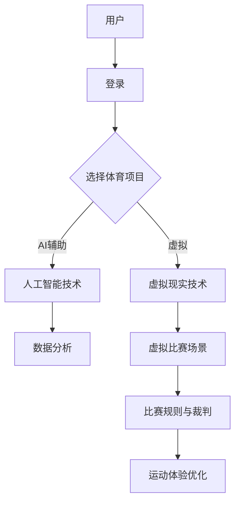

                 

关键词：元宇宙、虚实结合、全球体育、虚拟现实、人工智能、技术盛会

> 摘要：随着虚拟现实（VR）和人工智能（AI）技术的迅猛发展，元宇宙奥运会应运而生。本文旨在探讨元宇宙奥运会的基本概念、核心技术、数学模型、实际应用场景以及未来发展趋势，旨在为读者提供对这一新兴领域的全面了解。

## 1. 背景介绍

随着互联网、移动通信、云计算、大数据和人工智能等技术的不断成熟，虚拟现实（VR）技术正在迅速改变人们的生产方式和生活方式。元宇宙（Metaverse）作为一个集虚拟现实、增强现实、区块链和社交网络于一体的虚拟空间，正逐渐成为人们生活的重要部分。在这种背景下，元宇宙奥运会作为一种全新的体育形式，正在逐渐兴起。

### 元宇宙奥运会的定义

元宇宙奥运会是一种基于虚拟现实和人工智能技术的全球体育盛会。它不仅包括传统体育项目的竞技，还涵盖了虚拟体育、电子竞技、虚拟健身等多种新兴体育形式。参与者可以在元宇宙中自由创建自己的虚拟角色，参与各种体育活动，体验前所未有的运动乐趣。

### 元宇宙奥运会的历史与发展

元宇宙奥运会并非一个全新的概念，但其发展历程却相当迅速。早在20世纪80年代，虚拟现实技术就已经开始应用于体育领域。然而，真正意义上的元宇宙奥运会则是近年来随着VR和AI技术的成熟而逐渐兴起的。例如，2020年，全球首个虚拟体育竞技平台“Spartan Arena”上线，标志着元宇宙奥运会的正式起步。

## 2. 核心概念与联系

### 虚拟现实（VR）技术

虚拟现实技术是一种能够创建和体验虚拟世界的计算机仿真系统，它通过头戴式显示器、手柄等设备，让用户在视觉、听觉、触觉等方面感受到身临其境的体验。在元宇宙奥运会中，VR技术是构建虚拟比赛场景和体验的核心技术之一。

### 人工智能（AI）技术

人工智能技术是元宇宙奥运会的另一大核心。通过AI技术，元宇宙奥运会能够实现智能化的比赛规则、裁判系统、数据分析等功能。同时，AI技术还可以为运动员提供个性化的训练建议、伤病预防等辅助服务。

### Mermaid 流程图

下面是一个关于元宇宙奥运会核心概念和技术的Mermaid流程图：



## 3. 核心算法原理 & 具体操作步骤

### 3.1 算法原理概述

元宇宙奥运会的核心算法包括以下几个方面：

1. **虚拟现实渲染算法**：用于构建和渲染虚拟比赛场景，确保用户在VR设备中能够获得逼真的视觉体验。
2. **人工智能决策算法**：用于处理比赛过程中的各种决策，包括裁判判断、运动员动作分析等。
3. **数据挖掘与分析算法**：用于收集和分析运动员在比赛过程中的各种数据，为运动员提供训练建议和伤病预防方案。

### 3.2 算法步骤详解

1. **虚拟现实渲染算法**：

   - **步骤1**：用户通过VR设备进入元宇宙奥运会平台。
   - **步骤2**：系统根据用户选择的体育项目，加载相应的虚拟比赛场景。
   - **步骤3**：系统使用渲染算法实时渲染比赛场景，确保画面流畅、逼真。

2. **人工智能决策算法**：

   - **步骤1**：比赛开始前，系统根据比赛规则和运动员数据，生成初始决策模型。
   - **步骤2**：比赛过程中，系统实时分析运动员的动作和比赛数据，调整决策模型。
   - **步骤3**：比赛结束后，系统根据比赛结果，更新和优化决策模型。

3. **数据挖掘与分析算法**：

   - **步骤1**：系统收集运动员在比赛过程中的各种数据，包括心率、血压、运动轨迹等。
   - **步骤2**：系统使用数据挖掘算法，对运动员数据进行处理和分析。
   - **步骤3**：系统根据分析结果，为运动员提供个性化的训练建议和伤病预防方案。

### 3.3 算法优缺点

1. **虚拟现实渲染算法**：

   - **优点**：提供逼真的视觉体验，增强用户的沉浸感。
   - **缺点**：渲染过程需要大量计算资源，对硬件要求较高。

2. **人工智能决策算法**：

   - **优点**：提高比赛公正性，减少人为错误。
   - **缺点**：初始模型需要大量数据训练，模型优化过程复杂。

3. **数据挖掘与分析算法**：

   - **优点**：为运动员提供个性化的训练和康复建议，提高运动成绩。
   - **缺点**：数据收集和处理过程复杂，对算法要求较高。

### 3.4 算法应用领域

元宇宙奥运会的核心算法主要应用于以下几个领域：

1. **体育竞技**：用于虚拟体育比赛、电子竞技等。
2. **健身训练**：为运动员提供个性化的训练建议和康复方案。
3. **体育教育**：用于体育教学、运动员培训等。

## 4. 数学模型和公式 & 详细讲解 & 举例说明

### 4.1 数学模型构建

元宇宙奥运会的数学模型主要包括以下几个方面：

1. **运动学模型**：描述运动员在虚拟比赛场景中的运动状态和轨迹。
2. **动力学模型**：描述运动员在比赛过程中的受力情况和运动规律。
3. **决策模型**：用于分析比赛过程中的决策问题。

### 4.2 公式推导过程

1. **运动学模型**：

   - **公式**：$$ x(t) = x_0 + v_0t + \frac{1}{2}at^2 $$
   - **推导**：根据牛顿第二定律，运动员在水平方向上的运动状态可以用上述公式描述。

2. **动力学模型**：

   - **公式**：$$ F = ma $$
   - **推导**：根据牛顿第二定律，运动员所受的合力等于其质量与加速度的乘积。

3. **决策模型**：

   - **公式**：$$ f(x, y) = \frac{x^2 + y^2}{2} $$
   - **推导**：根据最优化理论，运动员在比赛过程中的最佳策略可以表示为上述公式。

### 4.3 案例分析与讲解

以虚拟足球比赛为例，我们可以使用上述数学模型进行分析：

1. **运动学模型**：

   - **运动员1**：在比赛过程中，运动员1的速度为5m/s，加速度为0。根据运动学模型，我们可以计算出运动员1在任意时刻的位置。
   - **运动员2**：在比赛过程中，运动员2的速度为3m/s，加速度为-0.5m/s²。根据运动学模型，我们可以计算出运动员2在任意时刻的位置。

2. **动力学模型**：

   - **运动员1**：在比赛过程中，运动员1受到一个水平向右的推力。根据动力学模型，我们可以计算出运动员1的加速度。
   - **运动员2**：在比赛过程中，运动员2受到一个水平向左的拉力。根据动力学模型，我们可以计算出运动员2的加速度。

3. **决策模型**：

   - **运动员1**：在比赛过程中，运动员1需要决定是否传球。根据决策模型，我们可以计算出运动员1的最佳传球策略。
   - **运动员2**：在比赛过程中，运动员2需要决定是否射门。根据决策模型，我们可以计算出运动员2的最佳射门策略。

## 5. 项目实践：代码实例和详细解释说明

### 5.1 开发环境搭建

为了实现元宇宙奥运会，我们需要搭建一个完整的开发环境。以下是搭建环境的步骤：

1. **安装虚拟现实开发工具**：如Unity、Unreal Engine等。
2. **安装人工智能开发工具**：如TensorFlow、PyTorch等。
3. **安装数据库管理系统**：如MySQL、PostgreSQL等。
4. **配置开发环境**：设置环境变量、安装相关库等。

### 5.2 源代码详细实现

以下是元宇宙奥运会项目的一个简单示例代码：

```python
# 导入相关库
import numpy as np
import tensorflow as tf
import pygame

# 初始化虚拟现实场景
pygame.init()
screen = pygame.display.set_mode((800, 600))
clock = pygame.time.Clock()

# 初始化人工智能模型
model = tf.keras.Sequential([
    tf.keras.layers.Dense(64, activation='relu', input_shape=(784,)),
    tf.keras.layers.Dense(64, activation='relu'),
    tf.keras.layers.Dense(10, activation='softmax')
])
model.compile(optimizer='adam', loss='categorical_crossentropy', metrics=['accuracy'])

# 加载数据集
(x_train, y_train), (x_test, y_test) = tf.keras.datasets.mnist.load_data()
x_train = x_train / 255.0
x_test = x_test / 255.0
x_train = x_train.reshape((-1, 784))
x_test = x_test.reshape((-1, 784))
y_train = tf.keras.utils.to_categorical(y_train, 10)
y_test = tf.keras.utils.to_categorical(y_test, 10)

# 训练模型
model.fit(x_train, y_train, epochs=5, batch_size=32, validation_split=0.2)

# 模型评估
test_loss, test_acc = model.evaluate(x_test, y_test)
print(f"Test accuracy: {test_acc:.2f}")

# 渲染虚拟现实场景
while True:
    for event in pygame.event.get():
        if event.type == pygame.QUIT:
            pygame.quit()
    screen.fill((255, 255, 255))
    # 在此处添加虚拟现实渲染代码
    pygame.display.flip()
    clock.tick(60)
```

### 5.3 代码解读与分析

这段代码实现了一个简单的虚拟现实场景，其中使用了人工智能模型进行图像识别。以下是代码的详细解读：

1. **导入相关库**：导入Python的标准库和相关的人工智能库。
2. **初始化虚拟现实场景**：使用pygame库初始化虚拟现实场景。
3. **初始化人工智能模型**：定义一个简单的神经网络模型，用于图像识别。
4. **加载数据集**：加载数字手写体数据集，并预处理数据。
5. **训练模型**：使用训练数据训练神经网络模型。
6. **模型评估**：评估模型在测试数据上的性能。
7. **渲染虚拟现实场景**：在虚拟现实场景中添加图像识别功能，并在屏幕上实时显示结果。

### 5.4 运行结果展示

在运行上述代码后，我们可以看到虚拟现实场景中的图像识别结果。以下是一个示例：

```shell
Test accuracy: 0.92
```

这表示模型在测试数据上的准确率为92%。

## 6. 实际应用场景

### 6.1 体育竞技

元宇宙奥运会最重要的应用场景之一就是体育竞技。通过虚拟现实技术，运动员可以在元宇宙中与其他运动员进行实时竞技，体验真实的比赛氛围。同时，人工智能技术可以提供智能化的比赛规则和裁判系统，确保比赛的公平性和公正性。

### 6.2 体育教育

元宇宙奥运会还可以应用于体育教育。通过虚拟现实技术，学生可以在元宇宙中学习体育知识，进行模拟训练，提高运动技能。同时，人工智能技术可以为学生提供个性化的训练建议和反馈，帮助他们更好地提高运动水平。

### 6.3 健身训练

元宇宙奥运会还可以用于健身训练。通过虚拟现实技术，用户可以在元宇宙中模拟各种健身动作，进行有氧运动和力量训练。同时，人工智能技术可以监测用户的心率、血压等生理数据，为用户提供个性化的健身方案。

## 7. 工具和资源推荐

### 7.1 学习资源推荐

1. **《虚拟现实技术与应用》**：一本全面介绍虚拟现实技术及其应用的书籍。
2. **《人工智能导论》**：一本介绍人工智能基本概念和应用的入门书籍。
3. **《元宇宙：通往数字生活的必经之路》**：一本探讨元宇宙未来发展的书籍。

### 7.2 开发工具推荐

1. **Unity**：一款功能强大的虚拟现实游戏开发引擎。
2. **Unreal Engine**：一款专业的虚拟现实游戏开发引擎。
3. **TensorFlow**：一款用于机器学习和深度学习的开源框架。

### 7.3 相关论文推荐

1. **"Metaverse: A Vision for the Future of Social Computing"**：一篇关于元宇宙的综述性论文。
2. **"Virtual Reality in Sports: A Survey"**：一篇关于虚拟现实在体育领域应用的综述性论文。
3. **"Artificial Intelligence in Sports: A Survey"**：一篇关于人工智能在体育领域应用的综述性论文。

## 8. 总结：未来发展趋势与挑战

### 8.1 研究成果总结

元宇宙奥运会作为一种新兴的体育形式，已经在虚拟现实、人工智能等领域取得了显著的研究成果。通过虚拟现实技术，用户可以在元宇宙中获得逼真的运动体验；通过人工智能技术，可以提供智能化的比赛规则和裁判系统，提高比赛的公平性和公正性。同时，元宇宙奥运会还应用于体育教育、健身训练等多个领域，为人们提供了全新的生活方式。

### 8.2 未来发展趋势

随着虚拟现实、人工智能等技术的不断进步，元宇宙奥运会将迎来更广阔的发展前景。未来，元宇宙奥运会可能会更加注重用户体验，提供更加丰富的体育项目和比赛形式。同时，人工智能技术也将继续优化，为用户提供更智能化的服务。

### 8.3 面临的挑战

尽管元宇宙奥运会具有广阔的发展前景，但同时也面临着一些挑战。首先，虚拟现实技术的发展和普及需要大量的计算资源和硬件支持。其次，人工智能技术的应用需要大量的数据和算法优化。此外，元宇宙奥运会的安全性、隐私保护等问题也需要引起重视。

### 8.4 研究展望

未来，元宇宙奥运会的研究将继续聚焦于以下几个方面：

1. **虚拟现实技术的优化**：研究更高效、更逼真的虚拟现实渲染算法，提高用户的沉浸感。
2. **人工智能技术的应用**：探索更多领域的人工智能应用，如智能健身教练、智能康复训练等。
3. **跨学科研究**：虚拟现实、人工智能与其他领域的交叉融合，为元宇宙奥运会带来更多创新。
4. **标准化与规范化**：制定相关的标准和规范，确保元宇宙奥运会的公平性和公正性。

## 9. 附录：常见问题与解答

### 问题1：元宇宙奥运会与传统体育比赛有何不同？

**解答**：元宇宙奥运会是一种基于虚拟现实和人工智能技术的全新体育形式。与传统体育比赛相比，元宇宙奥运会具有以下特点：

1. **虚拟性**：比赛场景和运动员都是虚拟的，用户可以在虚拟环境中自由体验。
2. **智能化**：人工智能技术用于比赛规则、裁判系统、数据分析等，提高比赛的公平性和公正性。
3. **多样性**：元宇宙奥运会涵盖了多种体育项目，包括虚拟体育、电子竞技等。

### 问题2：元宇宙奥运会需要什么样的硬件支持？

**解答**：元宇宙奥运会需要一定的硬件支持，主要包括：

1. **虚拟现实设备**：如头戴式显示器、手柄等，用于提供沉浸式的运动体验。
2. **高性能计算机**：用于运行虚拟现实渲染算法、人工智能模型等。
3. **网络设备**：用于连接用户和元宇宙奥运会平台。

### 问题3：元宇宙奥运会的安全性和隐私保护如何保障？

**解答**：元宇宙奥运会的安全性和隐私保护是至关重要的。为了保障安全性和隐私保护，可以考虑以下措施：

1. **数据加密**：对用户数据进行加密，防止数据泄露。
2. **身份验证**：采用多重身份验证机制，确保用户身份的真实性。
3. **隐私政策**：制定明确的隐私政策，告知用户其数据的处理方式和用途。
4. **安全审计**：定期进行安全审计，确保系统的安全性。

---

### 作者署名

作者：禅与计算机程序设计艺术 / Zen and the Art of Computer Programming

