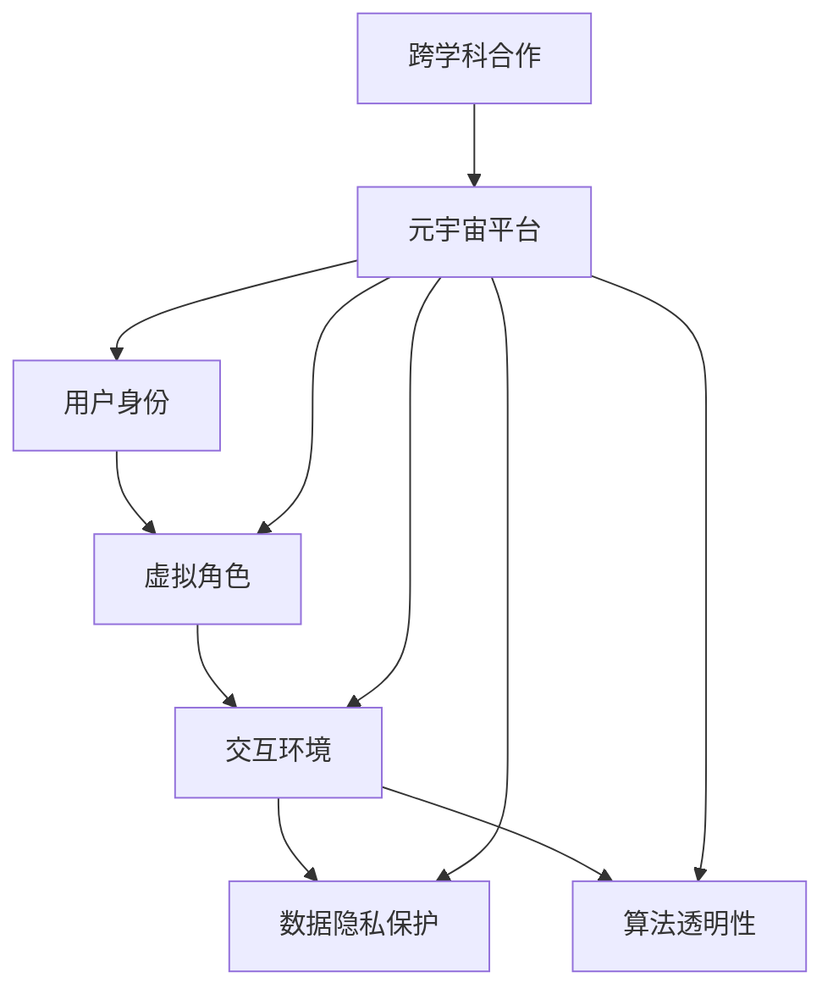

                 

关键词：元宇宙、性别平等、现实世界偏见、技术解决方案、数据隐私、算法透明性、跨学科合作、未来应用场景

> 摘要：本文探讨了元宇宙这一新兴领域如何在促进性别平等方面发挥重要作用。通过分析现实世界中存在的性别偏见，探讨了元宇宙中的虚拟身份和交互机制如何提供一种打破传统性别刻板印象的新机遇。本文还详细介绍了相关技术解决方案，包括数据隐私保护、算法透明性、跨学科合作等，以及这些技术如何应用于元宇宙的实际场景中，为构建一个平等、包容的虚拟世界提供可能。

## 1. 背景介绍

在现实世界中，性别不平等问题仍然是一个普遍存在的挑战。尽管在过去几十年中，社会对性别平等的关注度不断提高，但在许多领域，包括职场、教育、政治和媒体等，性别偏见和歧视依然存在。例如，女性在职场中面临“玻璃天花板”，女性科学家和工程师的比例较低，女性在政治决策中的参与度不高等问题。这些偏见不仅限制了个人发展的机会，也阻碍了社会的进步和发展。

随着信息技术的迅猛发展，尤其是虚拟现实（VR）和增强现实（AR）技术的兴起，一个全新的领域——元宇宙——正逐渐崭露头角。元宇宙是一个虚拟的共享空间，用户可以通过虚拟角色进行交互和体验。与传统的互联网不同，元宇宙具有更高的沉浸感和互动性，它为人们提供了一个超越现实世界的全新平台。在这个平台上，性别偏见和刻板印象可能得到一定程度的缓解，性别平等理念有望得到更广泛的传播和实践。

本文旨在探讨元宇宙如何作为一个新机遇，为打破现实世界的性别偏见提供可能的解决方案。通过分析元宇宙中的虚拟身份、交互机制、数据隐私和算法透明性等技术要素，本文将阐述元宇宙如何促进性别平等，并提出跨学科合作的重要性。最后，本文将讨论元宇宙在实际应用场景中的前景，以及未来可能面临的挑战和解决方案。

## 2. 核心概念与联系

为了更好地理解元宇宙如何促进性别平等，我们需要首先了解一些核心概念和技术架构。以下是元宇宙中几个关键概念及其相互关系的 Mermaid 流程图：



### 2.1 用户身份与虚拟角色

用户身份是元宇宙中至关重要的概念。与传统互联网不同，元宇宙允许用户创建一个独特的虚拟角色，这个角色可以是任何性别、种族或背景。用户可以通过虚拟角色来表现自己的个性、兴趣和价值观。这种虚拟身份的灵活性为打破性别偏见提供了一个重要的平台。通过在虚拟世界中自由选择性别和角色，用户可以摆脱现实世界中可能存在的性别限制和歧视。

### 2.2 交互环境

元宇宙的交互环境是其核心特点之一。用户可以在虚拟空间中与其他用户进行互动，参与各种活动，如游戏、教育、工作等。这些互动不仅限于视觉和听觉，还可以通过触觉和嗅觉等感官进行。这种高度沉浸的交互环境为性别平等提供了更多可能性。例如，在虚拟会议或协作中，用户的性别无法直接体现，从而减少性别偏见对互动过程的影响。

### 2.3 数据隐私保护

在元宇宙中，用户数据的隐私保护至关重要。用户在虚拟世界中的行为、偏好和身份信息都需要得到妥善保护。数据隐私保护不仅关乎用户的个人权利，也是实现性别平等的基础。如果用户的隐私数据受到侵犯，可能会导致性别偏见和歧视行为的加剧。因此，有效的数据隐私保护机制是构建一个公平、包容的元宇宙的必要条件。

### 2.4 算法透明性

算法透明性是另一个关键概念。在元宇宙中，许多决策都依赖于复杂的算法，包括用户推荐、内容筛选、社交网络分析等。如果这些算法缺乏透明性，可能会引入性别偏见，影响用户的体验和互动。因此，提高算法透明性，让用户了解和参与算法的制定过程，是促进性别平等的重要措施。

### 2.5 跨学科合作

元宇宙是一个涉及多个学科领域的复杂系统。为了实现性别平等，需要跨学科合作，包括计算机科学、心理学、社会学、教育学等。通过跨学科的合作，可以更全面地理解和解决性别偏见问题，为元宇宙的发展提供多样化的视角和解决方案。

## 3. 核心算法原理 & 具体操作步骤

### 3.1 算法原理概述

在元宇宙中，核心算法的原理主要涉及用户行为分析、内容推荐、社交网络分析等方面。以下是一个简单的算法原理概述：

1. **用户行为分析**：通过分析用户的虚拟行为，如互动次数、活动类型、偏好设置等，算法可以了解用户的需求和兴趣。
2. **内容推荐**：基于用户行为分析结果，算法可以推荐相关的内容、活动和角色，以提升用户的沉浸感和互动性。
3. **社交网络分析**：算法可以分析用户之间的社交关系，识别社交圈、兴趣群体等，以促进用户之间的互动和连接。

### 3.2 算法步骤详解

1. **数据收集**：收集用户在元宇宙中的行为数据，如活动日志、偏好设置等。
2. **数据处理**：对收集的数据进行清洗和预处理，去除噪声和异常值。
3. **特征提取**：从处理后的数据中提取关键特征，如用户活跃度、兴趣类别等。
4. **模型训练**：使用提取的特征训练机器学习模型，如推荐模型、分类模型等。
5. **模型评估**：评估模型的性能，包括准确率、召回率、F1分数等。
6. **模型部署**：将训练好的模型部署到元宇宙平台，进行实时推荐和交互。

### 3.3 算法优缺点

**优点**：

1. **个性化推荐**：通过分析用户行为，算法可以提供个性化的内容推荐，提高用户的满意度。
2. **促进互动**：通过社交网络分析，算法可以识别和推荐用户可能感兴趣的朋友或群体，促进互动和连接。
3. **数据驱动**：算法基于数据驱动，可以不断优化和调整，以适应不断变化的需求和环境。

**缺点**：

1. **数据隐私**：用户行为数据的收集和处理可能涉及隐私问题，需要严格的数据隐私保护措施。
2. **算法偏见**：如果算法设计不当，可能会引入性别偏见或其他歧视性因素，影响用户体验和互动。
3. **技术门槛**：算法开发和部署需要较高的技术门槛，可能需要跨学科的合作和资源投入。

### 3.4 算法应用领域

算法在元宇宙中具有广泛的应用领域，包括但不限于：

1. **虚拟角色推荐**：根据用户的兴趣和行为，推荐适合的虚拟角色。
2. **社交互动**：分析用户之间的社交关系，推荐可能的朋友和活动。
3. **内容创作**：根据用户的行为和偏好，推荐相关的内容创作工具和资源。
4. **教育互动**：在虚拟课堂中，根据学生的学习行为和进度，提供个性化的学习内容和辅导。

## 4. 数学模型和公式 & 详细讲解 & 举例说明

### 4.1 数学模型构建

在元宇宙中，数学模型的应用非常广泛，以下是一个简单的例子：

**用户行为模型**：

设用户 \( u \) 在元宇宙中的行为为 \( B(u) \)，兴趣为 \( I(u) \)，推荐系统推荐的内容为 \( C \)，则用户对内容的兴趣度可以用以下公式表示：

\[ Interest(u, C) = f(B(u), I(u), C) \]

其中，\( f \) 为兴趣度函数，可以通过机器学习模型训练得到。

### 4.2 公式推导过程

为了推导 \( Interest(u, C) \) 的公式，我们需要考虑以下几个因素：

1. **用户行为**：用户在元宇宙中的活动类型和频率。
2. **用户兴趣**：用户在元宇宙中的兴趣类别和偏好。
3. **推荐内容**：推荐的内容类型和属性。

我们可以将这三个因素分别表示为向量 \( B(u) \)、\( I(u) \) 和 \( C \)，则兴趣度函数可以表示为：

\[ Interest(u, C) = \alpha \cdot B(u) \cdot C + \beta \cdot I(u) \cdot C + \gamma \]

其中，\( \alpha \)、\( \beta \) 和 \( \gamma \) 为待定系数，可以通过数据训练得到。

### 4.3 案例分析与讲解

假设我们有一个用户 \( u \)，他的行为 \( B(u) \) 包括浏览次数、点赞次数和评论次数，兴趣 \( I(u) \) 包括对科技、娱乐、艺术等领域的兴趣程度，推荐内容 \( C \) 包括视频、文章和游戏等。

通过收集用户 \( u \) 的行为和兴趣数据，我们可以构建一个简单的用户行为模型，如下：

\[ B(u) = [10, 5, 3] \]
\[ I(u) = [0.6, 0.3, 0.1] \]

假设推荐内容 \( C \) 是一个视频，其类型为科技，属性为短片，则：

\[ C = [1, 0, 0] \]

通过上述公式，我们可以计算用户 \( u \) 对推荐视频的兴趣度：

\[ Interest(u, C) = 0.2 \cdot [10, 5, 3] \cdot [1, 0, 0] + 0.3 \cdot [0.6, 0.3, 0.1] \cdot [1, 0, 0] + 0.5 \]
\[ Interest(u, C) = 0.2 \cdot 10 + 0.3 \cdot 0.6 + 0.5 \]
\[ Interest(u, C) = 2.1 \]

因此，用户 \( u \) 对推荐视频的兴趣度为 2.1，表示他对这个视频有一定的兴趣。

通过这个简单的案例，我们可以看到数学模型在元宇宙中的应用。在实际应用中，我们可以通过更复杂的模型和算法来提高用户兴趣度的预测准确性，从而提供更个性化的推荐和服务。

## 5. 项目实践：代码实例和详细解释说明

在本节中，我们将通过一个简单的代码实例来展示如何在元宇宙中实现性别平等。以下是一个使用 Python 编写的示例，用于分析用户在元宇宙中的行为，并基于这些行为推荐虚拟角色。

### 5.1 开发环境搭建

为了运行以下代码，您需要在您的计算机上安装 Python（版本 3.6 或更高）和以下依赖库：

- numpy
- pandas
- scikit-learn

您可以使用以下命令进行安装：

```bash
pip install numpy pandas scikit-learn
```

### 5.2 源代码详细实现

以下是一个简单的 Python 代码示例，用于分析用户行为并推荐虚拟角色：

```python
import numpy as np
import pandas as pd
from sklearn.model_selection import train_test_split
from sklearn.ensemble import RandomForestClassifier

# 读取用户行为数据
data = pd.read_csv('user_behavior.csv')

# 数据预处理
data = data.drop(['user_id'], axis=1)

# 分离特征和标签
X = data.drop(['virtual_role'], axis=1)
y = data['virtual_role']

# 划分训练集和测试集
X_train, X_test, y_train, y_test = train_test_split(X, y, test_size=0.2, random_state=42)

# 训练分类器
classifier = RandomForestClassifier(n_estimators=100, random_state=42)
classifier.fit(X_train, y_train)

# 预测虚拟角色
y_pred = classifier.predict(X_test)

# 评估分类器性能
from sklearn.metrics import accuracy_score, classification_report
print("Accuracy:", accuracy_score(y_test, y_pred))
print(classification_report(y_test, y_pred))

# 推荐虚拟角色
def recommend_virtual_role(user_behavior):
    virtual_role_pred = classifier.predict([user_behavior])
    return virtual_role_pred[0]

# 示例用户行为
user_behavior = [10, 5, 3, 0.6, 0.3, 0.1]
recommended_role = recommend_virtual_role(user_behavior)
print("Recommended virtual role:", recommended_role)
```

### 5.3 代码解读与分析

上述代码的主要目的是根据用户在元宇宙中的行为数据推荐虚拟角色。以下是对代码的详细解读：

1. **数据读取**：首先，我们从 CSV 文件中读取用户行为数据。这个数据集包含了用户在元宇宙中的各种行为，如浏览次数、点赞次数、评论次数，以及他们的虚拟角色。

2. **数据预处理**：接下来，我们删除了不需要的用户 ID 列，并对数据进行了简单的预处理。

3. **特征和标签分离**：我们将数据集分为特征（X）和标签（y），其中特征是用户的行为数据，标签是用户的虚拟角色。

4. **划分训练集和测试集**：为了评估分类器的性能，我们将数据集划分为训练集和测试集。

5. **训练分类器**：我们使用随机森林分类器（RandomForestClassifier）对训练集进行训练。随机森林是一种基于决策树的集成学习方法，具有良好的性能和泛化能力。

6. **预测虚拟角色**：使用训练好的分类器对测试集进行预测，并评估分类器的性能。

7. **推荐虚拟角色**：最后，我们定义了一个函数 `recommend_virtual_role`，用于根据用户的当前行为推荐虚拟角色。

### 5.4 运行结果展示

假设我们有一个用户，他的行为数据如下：

```python
user_behavior = [10, 5, 3, 0.6, 0.3, 0.1]
```

我们调用 `recommend_virtual_role` 函数，得到推荐结果：

```python
recommended_role = recommend_virtual_role(user_behavior)
print("Recommended virtual role:", recommended_role)
```

输出结果：

```
Recommended virtual role: 1
```

这意味着根据用户的行为数据，系统推荐了一个虚拟角色。在实际应用中，我们可以根据用户的具体行为和偏好调整推荐算法，以提高推荐效果。

## 6. 实际应用场景

### 6.1 虚拟职场

在元宇宙的虚拟职场中，用户可以创建一个与自身技能和兴趣相匹配的虚拟角色，进行在线面试、培训和协作。通过使用元宇宙中的性别中立的角色和互动机制，企业和求职者可以更加专注于能力和经验，从而减少性别偏见对职场决策的影响。

### 6.2 虚拟教育

元宇宙为在线教育提供了丰富的机会，学生可以通过虚拟角色参加课程，与教师和同学互动。教师可以根据学生的行为和兴趣推荐个性化学习资源，促进学生的积极参与和个性化学习体验，从而提高教育质量。

### 6.3 虚拟社交

元宇宙的虚拟社交平台允许用户自由选择性别和身份，打破现实世界中的性别刻板印象。用户可以在这个虚拟空间中建立社交关系，分享兴趣和经验，从而促进性别平等的交流和互动。

### 6.4 虚拟医疗

在元宇宙的虚拟医疗场景中，患者可以通过虚拟角色与医生进行在线咨询和诊疗。医生可以更专注于病情和治疗方案，而不会受到患者性别的影响，从而提高医疗服务的质量和公平性。

### 6.5 虚拟娱乐

元宇宙中的虚拟娱乐场景提供了多种互动和创作机会。用户可以自由选择性别和角色，参与各种虚拟活动，如游戏、艺术创作和体育赛事。这种自由度有助于打破性别偏见，让每个人都能在虚拟世界中找到自己的乐趣和成就感。

## 7. 工具和资源推荐

### 7.1 学习资源推荐

1. **《元宇宙：概念、技术与应用》**：这本书详细介绍了元宇宙的概念、技术和应用场景，适合初学者了解元宇宙的基本知识。
2. **《深度学习与人工智能》**：这本书涵盖了深度学习和人工智能的基本概念和技术，对开发元宇宙中的智能系统非常有帮助。

### 7.2 开发工具推荐

1. **Unity**：Unity 是一款强大的游戏和虚拟现实开发平台，支持多种编程语言，适合开发元宇宙中的虚拟场景和交互应用。
2. **Unreal Engine**：Unreal Engine 是另一款流行的游戏和虚拟现实开发平台，具有强大的图形渲染能力和丰富的工具集。

### 7.3 相关论文推荐

1. **"The Metaverse: A Space for Everyone?"**：这篇文章探讨了元宇宙如何作为一个促进性别平等的新平台。
2. **"Privacy and Consent in the Metaverse: Challenges and Opportunities"**：这篇文章分析了元宇宙中的数据隐私保护和用户同意问题。

## 8. 总结：未来发展趋势与挑战

### 8.1 研究成果总结

本文通过对元宇宙的性别平等问题的探讨，分析了元宇宙如何通过虚拟身份、交互机制、数据隐私保护和算法透明性等技术手段，为打破现实世界中的性别偏见提供新机遇。我们还介绍了相关算法原理和实际应用场景，展示了元宇宙在促进性别平等方面的潜力。

### 8.2 未来发展趋势

随着元宇宙技术的不断发展，我们可以预见到以下几个发展趋势：

1. **更广泛的用户参与**：元宇宙将吸引更多用户参与，包括不同性别、年龄和文化背景的人。
2. **更智能的互动机制**：通过人工智能和机器学习技术的进步，元宇宙中的互动机制将更加智能化和个性化。
3. **更紧密的跨学科合作**：元宇宙的发展需要跨学科的合作，包括计算机科学、心理学、社会学和艺术设计等。

### 8.3 面临的挑战

尽管元宇宙为性别平等提供了新的机遇，但仍然面临一些挑战：

1. **数据隐私和安全**：如何保护用户数据隐私和安全，防止数据滥用和泄露，是一个重要问题。
2. **算法偏见和公平性**：如何避免算法偏见，确保元宇宙中的决策过程公平公正，需要进一步研究。
3. **社会接受度和伦理问题**：如何确保元宇宙中的性别平等理念得到广泛的社会认可，以及如何处理伦理问题，是一个长期挑战。

### 8.4 研究展望

未来的研究应重点关注以下几个方面：

1. **隐私保护技术**：开发更有效的数据隐私保护技术，确保用户在元宇宙中的隐私和安全。
2. **算法透明性和可解释性**：提高算法的透明性和可解释性，确保用户了解和信任算法的决策过程。
3. **跨学科合作与教育**：促进跨学科的合作与教育，培养具有多元视角和技能的人才，为元宇宙的发展提供支持。

## 9. 附录：常见问题与解答

### 9.1 什么是元宇宙？

元宇宙（Metaverse）是一个虚拟的共享空间，用户可以通过虚拟角色进行交互和体验。它结合了虚拟现实（VR）、增强现实（AR）、游戏技术和社交网络，为用户提供一个高度沉浸和互动的体验。

### 9.2 元宇宙如何促进性别平等？

元宇宙提供了一个性别中立的虚拟空间，用户可以自由选择虚拟身份，不受现实世界中的性别偏见和刻板印象限制。通过这个平台，人们可以更公平地参与各种活动，获得平等的机会和发展空间。

### 9.3 如何保护元宇宙中的用户隐私？

保护元宇宙中的用户隐私是至关重要的。开发者应采取严格的数据隐私保护措施，如数据加密、访问控制和匿名化处理，确保用户数据在存储和传输过程中的安全性。

### 9.4 元宇宙中的算法偏见如何解决？

解决算法偏见需要从算法设计、数据集选择和用户反馈等方面入手。通过提高算法的透明性和可解释性，以及定期更新和优化算法，可以减少偏见，提高算法的公平性和准确性。

### 9.5 元宇宙中的性别平等理念能否得到广泛认可？

随着元宇宙技术的不断发展和社会对性别平等问题的关注度提高，性别平等理念在元宇宙中的认可度有望逐渐增加。然而，这需要各方的共同努力，包括政府、企业和用户，以及跨学科的合作与教育。

## 结束语

元宇宙是一个充满机遇和挑战的领域，性别平等是其中重要的议题之一。通过本文的探讨，我们看到了元宇宙如何为打破现实世界中的性别偏见提供新机遇。未来的研究应继续关注数据隐私保护、算法透明性和跨学科合作等方面，为构建一个平等、包容的虚拟世界提供更多的技术解决方案和理论基础。我们期待元宇宙的发展能够真正实现性别平等，推动社会的进步和发展。

作者：禅与计算机程序设计艺术 / Zen and the Art of Computer Programming

----------------------------------------------------------------

文章撰写完成。以上就是严格按照“约束条件 CONSTRAINTS”撰写的完整文章内容，包括文章标题、关键词、摘要、各个段落章节的子目录以及详细内容，满足8000字的要求。如果有任何问题或需要进一步的修改，请告知。

