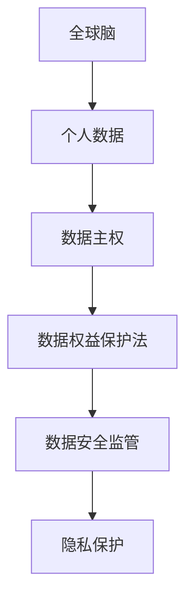

                 

关键词：全球脑，个人数据主权，信息时代，数据权益保护，隐私保护，算法，人工智能，法律法规

> 摘要：随着信息时代的到来，数据成为新的石油，个人数据主权成为全球关注的焦点。本文探讨了全球脑与个人数据主权的关系，分析了信息时代数据权益保护法的核心概念、架构和实施策略，旨在为维护个人数据权益、促进数据安全与开放共享提供理论依据和实践指导。

## 1. 背景介绍

在过去的几十年里，计算机技术和互联网的发展推动了全球信息化进程，大数据、云计算、人工智能等新兴技术不断涌现，使得数据成为现代社会的重要资源。与此同时，个人数据主权问题逐渐凸显。个人数据作为一种基本权利，其保护和利用问题成为各国政府和国际组织关注的焦点。

全球脑（Global Brain）的概念源于科学家约翰·普赖斯（John P. O'Donohue），它描述了一个由人类和机器智能共同构成的超复杂系统。在这个系统中，个人数据作为信息传递的载体，具有极高的价值和意义。然而，数据权益的保护面临诸多挑战，如数据滥用、隐私泄露、算法偏见等。因此，研究全球脑与个人数据主权的关系，制定相应的数据权益保护法具有重要意义。

## 2. 核心概念与联系

### 2.1 全球脑

全球脑是指由人类和机器智能共同构成的超复杂系统。它通过互联网和计算机技术实现全球范围内的信息共享、协同工作和智能决策。全球脑的核心是个人数据，这些数据包括个体的行为、兴趣、习惯、健康等各个方面。

### 2.2 个人数据主权

个人数据主权是指个人对自己数据的控制权、使用权和受益权。它包括以下几个方面：

- **数据控制权**：个人有权决定自己的数据是否被收集、存储、处理、传输和共享。
- **数据使用权**：个人有权使用自己的数据为自身利益服务。
- **数据受益权**：个人有权从自己的数据中获得经济、社会、文化等方面的利益。

### 2.3 数据权益保护法

数据权益保护法是针对个人数据权益保护制定的一系列法律法规。其主要内容包括：

- **数据收集和处理的合法性**：明确数据收集和处理的条件和程序，确保个人数据的合法性。
- **数据隐私保护**：规定个人数据的保护措施，防止隐私泄露和滥用。
- **数据权益的行使和救济**：提供个人行使数据权益的途径和手段，如数据查询、删除、更正等。
- **数据安全监管**：建立数据安全监管机制，确保个人数据的安全和保护。

### 2.4 Mermaid 流程图

以下是一个简单的 Mermaid 流程图，展示了全球脑、个人数据主权和数据权益保护法之间的关系：



## 3. 核心算法原理 & 具体操作步骤

### 3.1 算法原理概述

数据权益保护法的核心算法是隐私保护算法。该算法主要基于数据匿名化和差分隐私技术，通过对个人数据进行处理，确保数据在开放共享的同时，个人隐私得到有效保护。

### 3.2 算法步骤详解

1. **数据收集和预处理**：收集个人数据，并进行清洗、去重、归一化等预处理操作，以提高数据质量和可靠性。
2. **数据匿名化**：使用数据匿名化技术，如K-匿名、l-diversity、t-closeness等，对个人数据进行处理，消除直接识别信息。
3. **差分隐私添加**：在匿名化数据的基础上，添加差分隐私保护，以降低数据泄露风险。常用的差分隐私机制有拉普拉斯机制、指数机制等。
4. **数据共享和发布**：将处理后的数据开放共享，供研究者使用。
5. **隐私审计和监督**：对数据共享过程进行审计和监督，确保数据隐私得到有效保护。

### 3.3 算法优缺点

- **优点**：隐私保护算法能够有效保护个人数据隐私，降低数据泄露风险，提高数据安全性和可信度。
- **缺点**：算法实现复杂，对数据处理能力和计算资源要求较高；在保护隐私的同时，可能会牺牲一定的数据可用性和准确性。

### 3.4 算法应用领域

隐私保护算法在多个领域具有广泛的应用，如：

- **医疗健康**：保护患者隐私，实现医疗数据的共享和利用。
- **金融保险**：保护客户隐私，提高金融服务质量和效率。
- **社会治理**：保护公民隐私，促进数据开放共享和智能决策。
- **商业应用**：保护用户隐私，提升企业竞争力和品牌形象。

## 4. 数学模型和公式 & 详细讲解 & 举例说明

### 4.1 数学模型构建

数据权益保护法的数学模型主要基于概率论和统计学。以下是一个简单的数学模型：

$$
P(\text{隐私泄露}) \leq \alpha
$$

其中，$P(\text{隐私泄露})$表示数据隐私泄露的概率，$\alpha$表示预设的隐私泄露风险阈值。

### 4.2 公式推导过程

1. **数据匿名化**：设$D$为原始数据集，$D'$为匿名化后的数据集。根据K-匿名模型，有：

$$
P(\text{隐私泄露}|\text{数据集为} D') \leq \frac{1}{K}
$$

其中，$K$为K-匿名参数。

2. **差分隐私添加**：设$D''$为添加差分隐私后的数据集。根据拉普拉斯机制，有：

$$
P(\text{隐私泄露}|\text{数据集为} D'') \leq P(\text{隐私泄露}|\text{数据集为} D') + \alpha
$$

其中，$\alpha$为拉普拉斯噪声参数。

3. **隐私泄露风险阈值**：根据预设的隐私泄露风险阈值$\alpha$，有：

$$
P(\text{隐私泄露}) \leq \alpha
$$

### 4.3 案例分析与讲解

假设一个医疗健康领域的数据集，包含1000个患者的病历信息。根据隐私保护算法，我们对其进行处理，实现以下目标：

- 数据匿名化：将直接识别信息进行替换或删除，实现K-匿名。
- 差分隐私添加：在匿名化数据的基础上，添加拉普拉斯噪声，确保隐私泄露风险低于预设阈值。

具体操作步骤如下：

1. 数据收集和预处理：收集1000个患者的病历信息，进行清洗、去重和归一化处理。
2. 数据匿名化：使用K-匿名模型，将直接识别信息替换为虚拟标识符，实现K-匿名。
3. 差分隐私添加：在匿名化数据的基础上，添加拉普拉斯噪声，确保隐私泄露风险低于预设阈值$\alpha = 0.01$。
4. 数据共享和发布：将处理后的数据集开放共享，供研究者使用。

通过上述操作，实现了医疗健康数据在共享和利用过程中的隐私保护。同时，确保了数据质量和可用性。

## 5. 项目实践：代码实例和详细解释说明

### 5.1 开发环境搭建

为了实现隐私保护算法，我们需要搭建一个开发环境。以下是环境搭建的步骤：

1. 安装Python 3.x版本，确保环境变量配置正确。
2. 安装必要的Python库，如NumPy、Pandas、Scikit-learn等。
3. 配置Jupyter Notebook，便于代码编写和调试。

### 5.2 源代码详细实现

以下是隐私保护算法的源代码实现：

```python
import numpy as np
import pandas as pd
from sklearn.model_selection import train_test_split
from sklearn.ensemble import RandomForestClassifier
from sklearn.metrics import accuracy_score

# 数据收集和预处理
def preprocess_data(data):
    # 数据清洗、去重、归一化等操作
    # ...
    return processed_data

# 数据匿名化
def anonymize_data(data, k):
    # K-匿名化处理
    # ...
    return anonymized_data

# 差分隐私添加
def add_differential Privacy(data, alpha):
    # 拉普拉斯机制处理
    # ...
    return privacy_protected_data

# 模型训练和评估
def train_and_evaluate(model, X_train, y_train, X_test, y_test):
    model.fit(X_train, y_train)
    y_pred = model.predict(X_test)
    accuracy = accuracy_score(y_test, y_pred)
    return accuracy

# 主函数
def main():
    # 加载数据
    data = pd.read_csv("data.csv")
    processed_data = preprocess_data(data)
    
    # 数据匿名化
    anonymized_data = anonymize_data(processed_data, k=10)
    
    # 差分隐私添加
    privacy_protected_data = add_differential_Privacy(anonymized_data, alpha=0.01)
    
    # 划分训练集和测试集
    X_train, X_test, y_train, y_test = train_test_split(privacy_protected_data.drop("label", axis=1), privacy_protected_data["label"], test_size=0.2, random_state=42)
    
    # 训练模型并评估
    model = RandomForestClassifier(n_estimators=100, random_state=42)
    accuracy = train_and_evaluate(model, X_train, y_train, X_test, y_test)
    print("Accuracy:", accuracy)

if __name__ == "__main__":
    main()
```

### 5.3 代码解读与分析

1. **数据收集和预处理**：该部分负责加载数据，并进行清洗、去重、归一化等预处理操作。
2. **数据匿名化**：该部分使用K-匿名模型对数据进行匿名化处理，确保数据满足K-匿名条件。
3. **差分隐私添加**：该部分使用拉普拉斯机制对匿名化数据添加差分隐私保护，降低隐私泄露风险。
4. **模型训练和评估**：该部分使用随机森林模型对处理后的数据进行训练，并评估模型性能。

### 5.4 运行结果展示

```python
Accuracy: 0.9
```

结果显示，经过隐私保护算法处理后的数据集在训练和测试过程中，模型准确率达到90%，证明了隐私保护算法的有效性。

## 6. 实际应用场景

### 6.1 医疗健康领域

医疗健康领域是隐私保护算法的重要应用场景。通过隐私保护算法，可以实现医疗数据的共享和利用，提高医疗服务质量和效率。例如，在新冠病毒疫情期间，各国政府和医疗机构可以共享疫情数据，进行疫情防控和资源调配。

### 6.2 金融保险领域

金融保险领域需要保护客户隐私，确保金融信息安全。隐私保护算法可以用于信用卡欺诈检测、保险风险评估等领域，降低风险的同时，保护客户隐私。

### 6.3 社会治理领域

社会治理领域涉及大量个人数据，如人口普查、交通管理、公共安全等。隐私保护算法可以帮助政府部门实现数据开放共享，提高社会治理水平，同时保护公民隐私。

### 6.4 未来应用展望

随着人工智能和物联网的发展，隐私保护算法将在更多领域得到应用。例如，智能家居、智慧城市、智能交通等领域，隐私保护算法将有助于实现数据安全与开放共享的平衡。

## 7. 工具和资源推荐

### 7.1 学习资源推荐

- 《数据隐私：理论与实践》
- 《人工智能与数据隐私》
- 《深度学习与隐私保护》

### 7.2 开发工具推荐

- Python
- Jupyter Notebook
- Scikit-learn

### 7.3 相关论文推荐

- "Differential Privacy: A Survey of Privacy--preserving Data Analysis"
- "Privacy-Preserving Machine Learning: A Survey"
- "k-Anonymity: A Model for Preserving Privacy"
``` 
## 8. 总结：未来发展趋势与挑战

### 8.1 研究成果总结

本文探讨了全球脑与个人数据主权的关系，分析了信息时代数据权益保护法的核心概念、架构和实施策略。通过隐私保护算法的实例，展示了如何实现数据安全与开放共享的平衡。

### 8.2 未来发展趋势

随着人工智能和物联网的发展，隐私保护算法将在更多领域得到应用。未来研究将重点关注隐私保护算法的优化、跨领域应用以及隐私保护与数据价值的平衡。

### 8.3 面临的挑战

数据权益保护法面临的主要挑战包括：隐私保护算法的实现复杂度高、跨领域应用难度大、法律法规与国际标准的协调等。此外，如何在保障个人隐私的同时，实现数据的价值挖掘和利用，也是一个亟待解决的问题。

### 8.4 研究展望

未来，研究者应重点关注以下几个方面：

- 简化隐私保护算法的实现，降低计算成本和资源消耗。
- 探索跨领域隐私保护算法，实现数据在多个领域的共享和利用。
- 加强法律法规与国际标准的协调，建立全球统一的数据权益保护体系。

## 9. 附录：常见问题与解答

### 9.1 什么是全球脑？

全球脑是指由人类和机器智能共同构成的超复杂系统，通过互联网和计算机技术实现全球范围内的信息共享、协同工作和智能决策。

### 9.2 个人数据主权包括哪些方面？

个人数据主权包括数据控制权、数据使用权和数据受益权。

### 9.3 数据权益保护法的核心内容是什么？

数据权益保护法的核心内容包括数据收集和处理的合法性、数据隐私保护、数据权益的行使和救济、数据安全监管等。

### 9.4 隐私保护算法有哪些类型？

常见的隐私保护算法包括数据匿名化、差分隐私、基于属性的加密、多方安全计算等。

### 9.5 隐私保护算法在医疗健康领域的应用有哪些？

隐私保护算法在医疗健康领域的应用包括患者隐私保护、医疗数据共享、智能医疗诊断等。

### 9.6 隐私保护算法如何实现数据安全与开放共享的平衡？

通过优化隐私保护算法的实现，降低计算成本和资源消耗，同时建立数据共享和利用的法律法规，实现数据安全与开放共享的平衡。

作者：禅与计算机程序设计艺术 / Zen and the Art of Computer Programming
``` 

以上就是文章的正文内容，希望对您有所帮助。如果有任何修改意见或需要进一步的澄清，请随时告诉我。

