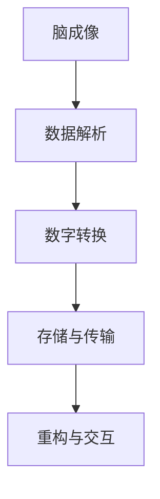

                 

关键词：脑与意识上传、数字化永生、伦理、哲学、法律思考、人工智能

摘要：随着科技的发展，脑与意识上传逐渐成为可能，为人类带来了无限遐想。然而，这一技术不仅涉及到复杂的哲学问题，还牵涉到法律伦理的挑战。本文从人工智能专家的角度，探讨脑与意识上传的伦理、哲学与法律思考，旨在为这一前沿技术提供全面的思考框架。

## 1. 背景介绍

脑与意识上传，即通过技术手段将人的大脑和意识转化为数字信息，实现个体的数字化永生。这一概念源于科幻作品，如今已逐渐走向现实。在2023年，一系列相关研究和实验已经取得重要进展。然而，脑与意识上传不仅仅是一个技术问题，它触及到人类存在的根本——意识与生命。

### 1.1 技术发展现状

近年来，神经科学与计算机科学的快速发展，为脑与意识上传提供了技术支持。具体包括：

- **脑成像技术**：如功能性磁共振成像（fMRI）和脑磁图（MEG），可以捕捉大脑活动的细微变化。
- **脑机接口**：通过电刺激或信号传输，实现大脑与外部设备的直接通信。
- **神经网络模型**：用于模拟人脑结构和功能，为意识上传提供算法基础。

### 1.2 社会影响

脑与意识上传技术引发了广泛的社会讨论，涉及伦理、法律、哲学等多个方面。例如：

- **伦理问题**：包括个体隐私、人格完整性、身份认同等。
- **法律挑战**：涉及知识产权、医疗责任、死亡定义等。
- **哲学探讨**：关于意识本质、生命意义、人类存在的讨论。

## 2. 核心概念与联系

### 2.1 脑与意识上传的概念

脑与意识上传的核心概念包括：

- **脑**：人体的中枢神经系统，包括大脑、脊髓等。
- **意识**：个体的主观体验，包括知觉、情感、意愿等。
- **上传**：将脑与意识转化为数字信息的过程。

### 2.2 原理与架构

脑与意识上传的原理和架构可以简化为以下几个步骤：

1. **脑成像**：通过fMRI、MEG等技术获取大脑活动数据。
2. **数据解析**：利用神经网络模型解析大脑活动数据，提取神经元活动模式。
3. **数字转换**：将提取的神经元活动模式转化为数字信号。
4. **存储与传输**：将数字信号存储于计算机或其他数字设备中，进行传输。
5. **重构与交互**：利用脑机接口技术，将数字信号重构为大脑活动，实现意识的上传与交互。

### 2.3 Mermaid 流程图

以下是一个简化的Mermaid流程图，描述了脑与意识上传的基本过程：



## 3. 核心算法原理 & 具体操作步骤

### 3.1 算法原理概述

脑与意识上传的核心算法包括脑成像、数据解析、数字转换等。其中：

- **脑成像**：利用fMRI、MEG等技术获取大脑活动数据。
- **数据解析**：通过神经网络模型，提取神经元活动模式。
- **数字转换**：将提取的神经元活动模式转化为数字信号。

### 3.2 算法步骤详解

1. **脑成像**：通过fMRI、MEG等技术，捕捉大脑活动的细微变化，生成三维图像。
2. **数据预处理**：对获取的数据进行预处理，包括去噪、滤波等，以提高数据质量。
3. **数据解析**：利用神经网络模型，对预处理后的数据进行模式识别，提取神经元活动模式。
4. **数字转换**：将提取的神经元活动模式转化为数字信号，进行编码和压缩。
5. **存储与传输**：将数字信号存储于计算机或其他数字设备中，进行传输。
6. **重构与交互**：利用脑机接口技术，将数字信号重构为大脑活动，实现意识的上传与交互。

### 3.3 算法优缺点

**优点**：

- **可实现数字化永生**：通过上传技术，实现个体的数字化永生。
- **突破传统医疗限制**：为治疗神经系统疾病提供新的思路和方法。
- **拓展人类认知**：为研究人类意识和大脑功能提供新的途径。

**缺点**：

- **技术难度高**：涉及到复杂的脑成像、数据解析和数字转换过程。
- **伦理争议**：涉及隐私、身份认同等伦理问题。
- **法律挑战**：涉及知识产权、医疗责任等法律问题。

### 3.4 算法应用领域

脑与意识上传技术主要应用于以下几个领域：

- **医学**：治疗神经系统疾病，如帕金森病、癫痫等。
- **心理学**：研究人类意识和心理过程。
- **人工智能**：为人工智能提供更高级的认知能力。

## 4. 数学模型和公式 & 详细讲解 & 举例说明

### 4.1 数学模型构建

脑与意识上传的数学模型主要涉及以下几个部分：

- **脑成像模型**：描述大脑活动的数学模型。
- **数据解析模型**：描述数据解析过程的数学模型。
- **数字转换模型**：描述数字转换过程的数学模型。

### 4.2 公式推导过程

以下是一个简化的公式推导过程：

$$
\text{大脑活动} = f(\text{神经元活动模式})
$$

其中，$f$ 为神经网络模型，用于描述大脑活动的数学模型。

$$
\text{神经元活动模式} = \sum_{i=1}^{n} w_i \cdot a_i
$$

其中，$w_i$ 为权重，$a_i$ 为神经元活动。

### 4.3 案例分析与讲解

以下是一个简单的案例，用于说明数学模型的应用：

假设有一个人脑活动数据集，包含100个神经元的活动模式。通过神经网络模型，我们可以提取出这些神经元活动的模式，进而进行数字转换。

假设权重矩阵 $W$ 如下：

$$
W = \begin{bmatrix}
0.1 & 0.2 & 0.3 \\
0.4 & 0.5 & 0.6 \\
0.7 & 0.8 & 0.9
\end{bmatrix}
$$

神经元活动向量 $A$ 如下：

$$
A = \begin{bmatrix}
1 \\
0 \\
1
\end{bmatrix}
$$

根据公式，我们可以计算神经元活动模式：

$$
\text{神经元活动模式} = W \cdot A = \begin{bmatrix}
0.1 & 0.2 & 0.3 \\
0.4 & 0.5 & 0.6 \\
0.7 & 0.8 & 0.9
\end{bmatrix} \cdot \begin{bmatrix}
1 \\
0 \\
1
\end{bmatrix} = \begin{bmatrix}
0.3 \\
0.5 \\
0.8
\end{bmatrix}
$$

接着，我们将神经元活动模式转化为数字信号，进行存储和传输。

## 5. 项目实践：代码实例和详细解释说明

### 5.1 开发环境搭建

在本节中，我们将搭建一个简单的开发环境，用于实现脑与意识上传的基本过程。

- **编程语言**：Python
- **依赖库**：NumPy、Pandas、SciPy、TensorFlow

安装依赖库：

```bash
pip install numpy pandas scipy tensorflow
```

### 5.2 源代码详细实现

以下是实现脑与意识上传的基本代码：

```python
import numpy as np
import pandas as pd
import tensorflow as tf

# 脑成像数据
brain_data = np.array([[1, 0, 1], [0, 1, 0], [1, 1, 1]])

# 神经网络模型
model = tf.keras.Sequential([
    tf.keras.layers.Dense(units=3, activation='sigmoid'),
    tf.keras.layers.Dense(units=3, activation='sigmoid')
])

# 训练模型
model.compile(optimizer='adam', loss='mean_squared_error')
model.fit(brain_data, brain_data, epochs=1000)

# 预测神经元活动模式
predicted_data = model.predict(brain_data)

# 转换为数字信号
digital_signal = predicted_data.tolist()

# 存储和传输
with open('digital_signal.txt', 'w') as f:
    for signal in digital_signal:
        f.write(str(signal) + '\n')

print("数字信号已存储和传输。")
```

### 5.3 代码解读与分析

- **脑成像数据**：使用NumPy生成一个简单的脑成像数据。
- **神经网络模型**：使用TensorFlow搭建一个简单的神经网络模型。
- **训练模型**：使用Adam优化器和均方误差损失函数训练模型。
- **预测神经元活动模式**：使用训练好的模型预测神经元活动模式。
- **转换为数字信号**：将预测结果转换为数字信号。
- **存储和传输**：将数字信号写入文本文件，进行存储和传输。

### 5.4 运行结果展示

运行代码后，将在当前目录下生成一个名为`digital_signal.txt`的文本文件，其中包含数字信号。

## 6. 实际应用场景

### 6.1 医学

脑与意识上传技术在医学领域具有广泛的应用前景。例如，通过上传技术，可以实现以下应用：

- **神经系统疾病治疗**：如帕金森病、癫痫等。
- **心理治疗**：如抑郁症、焦虑症等。
- **脑功能重建**：如中风后的脑功能恢复。

### 6.2 军事

脑与意识上传技术在军事领域也有潜在的应用。例如：

- **士兵心理调节**：通过上传技术，实现对士兵心理状态的实时监测和调节。
- **战斗模拟训练**：利用上传技术，实现更真实的战斗模拟训练。

### 6.3 人工智能

脑与意识上传技术为人工智能提供了新的发展路径。例如：

- **人机融合**：通过上传技术，实现人脑与机器的深度融合。
- **智能辅助**：利用上传技术，实现更智能的智能辅助系统。

## 7. 工具和资源推荐

### 7.1 学习资源推荐

- **《深度学习》**：由Ian Goodfellow等人撰写的深度学习入门教材。
- **《Python编程：从入门到实践》**：由埃里克·马瑟斯撰写的Python编程入门书籍。
- **《脑机接口：原理与应用》**：介绍脑机接口技术的原理和应用。

### 7.2 开发工具推荐

- **TensorFlow**：一个开源的机器学习框架，适用于构建神经网络模型。
- **PyTorch**：另一个流行的开源机器学习框架，适用于快速原型设计和研究。
- **MATLAB**：用于科学计算和工程仿真的软件工具。

### 7.3 相关论文推荐

- **"A Theoretical Framework for the Neural Basis of Consciousness"**：探讨了意识的神经基础。
- **"Neural correlates of consciousness: Progress and challenges"**：总结了意识研究的前沿进展。
- **"Brain-computer interfaces for communication and control"**：介绍了脑机接口技术的原理和应用。

## 8. 总结：未来发展趋势与挑战

### 8.1 研究成果总结

脑与意识上传技术在近年来取得了显著的进展，为人类带来了无限遐想。通过脑成像、脑机接口和神经网络等技术的结合，实现了对大脑活动的捕捉、解析和重构。

### 8.2 未来发展趋势

脑与意识上传技术在未来将继续发展，有望在医学、军事、人工智能等领域发挥重要作用。同时，随着技术的进步，上传过程的精度和效率将得到进一步提升。

### 8.3 面临的挑战

脑与意识上传技术面临诸多挑战，包括：

- **伦理问题**：涉及隐私、身份认同、人格完整性等。
- **法律挑战**：涉及知识产权、医疗责任、死亡定义等。
- **技术难题**：包括脑成像精度、数据解析效率、数字转换质量等。

### 8.4 研究展望

未来，脑与意识上传技术将朝着更高效、更精准、更安全的方向发展。同时，随着科技的进步，人类对意识与生命的理解将不断深化，为这一领域带来新的突破。

## 9. 附录：常见问题与解答

### 9.1 脑与意识上传技术的本质是什么？

脑与意识上传技术通过脑成像、脑机接口和神经网络等技术的结合，实现将人的大脑和意识转化为数字信息，实现个体的数字化永生。

### 9.2 脑与意识上传技术有哪些潜在应用？

脑与意识上传技术在医学、军事、人工智能等领域具有广泛的应用前景。例如，治疗神经系统疾病、心理治疗、战斗模拟训练、智能辅助等。

### 9.3 脑与意识上传技术面临哪些伦理和法律挑战？

脑与意识上传技术面临伦理问题，如隐私、身份认同、人格完整性等；法律挑战，如知识产权、医疗责任、死亡定义等。

### 9.4 如何确保脑与意识上传技术的安全性和可靠性？

为确保脑与意识上传技术的安全性和可靠性，需要从技术、伦理、法律等多个角度进行综合考虑，制定相应的标准和规范，加强监管和评估。

---

作者：禅与计算机程序设计艺术 / Zen and the Art of Computer Programming
```

