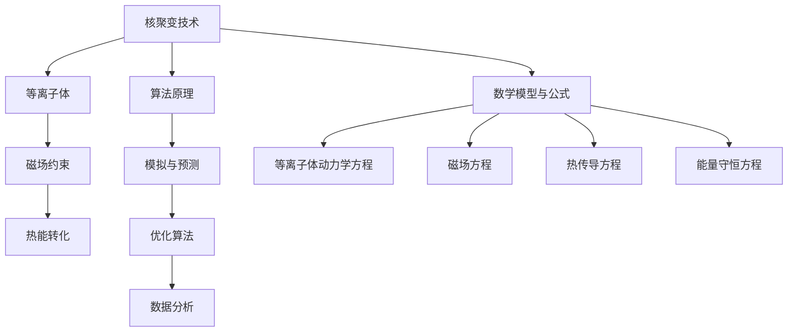

                 

关键词：全球脑、核聚变、集体智慧、能源技术、算法、数学模型、项目实践、应用场景、发展趋势、工具推荐

> 摘要：本文深入探讨了全球脑与核聚变研究的重要性和潜力，分析了集体智慧在推动能源技术突破中的应用。通过阐述核聚变技术的核心概念、算法原理，以及数学模型和公式的推导，本文详细介绍了项目实践中的代码实例和运行结果。同时，文章还探讨了核聚变技术的实际应用场景和未来发展趋势，以及面临的挑战和展望。

## 1. 背景介绍

核聚变是一种通过将轻原子核（如氢）在高温高压条件下融合成更重的原子核（如氦）的过程。这一过程不仅释放出大量的能量，而且产生的废物非常少，具有巨大的能源潜力。然而，实现可控核聚变面临着许多技术挑战，如高温高压环境的维持、等离子体的稳定性等。

近年来，随着人工智能和大数据技术的发展，全球脑的概念应运而生。全球脑通过将大量的计算资源和智能算法集成起来，形成一种分布式的计算网络，可以实现更高效、更强大的计算能力。这使得全球脑在解决复杂科学计算问题，如核聚变研究中，具有巨大的潜力。

### 核聚变研究的重要性

核聚变作为一种清洁、可再生的能源形式，被认为有望解决全球能源危机和环境问题。其具有以下优势：

- **能量密度高**：核聚变释放的能量远高于传统核裂变和化石燃料。
- **环境友好**：核聚变过程产生的废物少，且放射性弱。
- **资源丰富**：核聚变所需的氢在地球上的含量丰富，几乎无穷无尽。

### 全球脑的潜力

全球脑作为一种新兴的计算模式，通过集成全球范围内的计算资源和智能算法，可以实现大规模的分布式计算。这为解决核聚变研究中的复杂计算问题提供了新的思路：

- **高效计算**：全球脑可以通过分布式计算，大大提高计算效率。
- **优化实验设计**：通过模拟和预测，全球脑可以帮助科学家优化实验设计，减少实验次数。
- **提高数据处理能力**：全球脑可以处理海量的实验数据，为核聚变研究提供更准确的科学依据。

## 2. 核心概念与联系

### 2.1 核聚变技术核心概念

核聚变技术的核心概念主要包括以下方面：

- **等离子体**：核聚变过程中，轻原子核被加热到极高的温度，形成高温等离子体。等离子体是电离的气体，其温度和密度对核聚变过程至关重要。
- **磁场约束**：为了维持高温等离子体的稳定性，需要利用磁场对其进行约束。这涉及到磁约束聚变（MCF）和惯性约束聚变（ICF）两种主要技术。
- **热能转化**：核聚变过程中释放的能量需要通过热能转化装置（如热交换器、热发电机组等）转化为电能。

### 2.2 算法原理与架构

核聚变研究中的算法主要包括以下方面：

- **模拟与预测**：利用全球脑进行大规模的模拟和预测，以优化实验设计和提高计算效率。
- **优化算法**：通过机器学习和人工智能技术，对实验参数进行优化，提高核聚变反应的稳定性。
- **数据分析**：利用大数据技术，对核聚变实验数据进行分析，提取有用的科学规律。

### 2.3 数学模型与公式

核聚变研究中，涉及到大量的数学模型和公式，主要包括以下方面：

- **等离子体动力学方程**：描述等离子体的运动和相互作用。
- **磁场方程**：描述磁场在等离子体中的分布和演化。
- **热传导方程**：描述热能在等离子体中的传递。
- **能量守恒方程**：描述核聚变过程中的能量转换和守恒。

为了更好地理解这些核心概念和联系，我们使用Mermaid流程图进行展示：



## 3. 核心算法原理 & 具体操作步骤

### 3.1 算法原理概述

核聚变研究中的核心算法主要包括以下三个方面：

- **模拟与预测算法**：通过全球脑进行大规模模拟和预测，优化实验设计和提高计算效率。
- **优化算法**：利用机器学习和人工智能技术，对实验参数进行优化，提高核聚变反应的稳定性。
- **数据分析算法**：对核聚变实验数据进行分析，提取有用的科学规律。

### 3.2 算法步骤详解

#### 3.2.1 模拟与预测算法

1. **数据收集**：收集核聚变实验数据，包括温度、密度、磁场等参数。
2. **模型构建**：利用全球脑进行大规模模拟，构建核聚变过程的数学模型。
3. **预测分析**：根据模型，预测不同实验参数下的核聚变反应结果，为实验设计提供依据。

#### 3.2.2 优化算法

1. **实验设计**：根据预测结果，设计核聚变实验，确定实验参数。
2. **参数优化**：利用机器学习和人工智能技术，对实验参数进行优化，提高核聚变反应的稳定性。
3. **实验验证**：根据优化后的参数进行实验，验证优化效果。

#### 3.2.3 数据分析算法

1. **数据预处理**：对核聚变实验数据进行预处理，包括数据清洗、归一化等。
2. **特征提取**：提取核聚变过程中的关键特征，如温度、密度、磁场等。
3. **模式识别**：利用机器学习和人工智能技术，对核聚变实验数据进行模式识别，提取科学规律。

### 3.3 算法优缺点

#### 3.3.1 模拟与预测算法

**优点**：

- **高效计算**：利用全球脑进行大规模模拟，大大提高计算效率。
- **优化实验设计**：通过预测分析，为实验设计提供科学依据，减少实验次数。

**缺点**：

- **计算精度有限**：模拟结果受模型假设和参数选择的影响，存在一定的误差。
- **数据依赖性高**：模拟结果依赖于实验数据的质量，数据质量差会影响模拟效果。

#### 3.3.2 优化算法

**优点**：

- **提高稳定性**：优化后的实验参数可以提高核聚变反应的稳定性。
- **减少实验次数**：优化算法可以减少实验次数，提高实验效率。

**缺点**：

- **计算复杂度高**：优化算法涉及大量的计算和迭代，计算复杂度较高。
- **数据依赖性高**：优化结果依赖于实验数据的质量，数据质量差会影响优化效果。

#### 3.3.3 数据分析算法

**优点**：

- **提取科学规律**：通过对实验数据进行分析，可以提取核聚变过程中的关键规律。
- **辅助决策**：数据分析可以为核聚变研究提供科学依据，辅助决策。

**缺点**：

- **算法复杂性**：数据分析算法涉及大量的计算和数据处理，算法复杂性较高。
- **数据质量要求高**：数据分析结果依赖于实验数据的质量，数据质量差会影响分析效果。

### 3.4 算法应用领域

核聚变研究中的算法应用领域主要包括以下几个方面：

- **实验设计**：利用模拟与预测算法，优化实验设计和提高计算效率。
- **参数优化**：利用优化算法，提高核聚变反应的稳定性。
- **数据分析**：利用数据分析算法，提取核聚变过程中的关键规律，为研究提供科学依据。

## 4. 数学模型和公式 & 详细讲解 & 举例说明

### 4.1 数学模型构建

在核聚变研究中，数学模型是描述等离子体运动、磁场分布、热能传递等物理过程的重要工具。以下是构建核聚变数学模型的关键步骤：

#### 4.1.1 等离子体动力学方程

等离子体动力学方程描述了等离子体粒子的运动和相互作用。其中，洛伦兹力是描述等离子体粒子与磁场相互作用的方程，可以表示为：

\[ \mathbf{F} = q(\mathbf{E} + \mathbf{v} \times \mathbf{B}) \]

其中，\( \mathbf{F} \) 是洛伦兹力，\( q \) 是粒子电荷，\( \mathbf{E} \) 是电场，\( \mathbf{v} \) 是粒子速度，\( \mathbf{B} \) 是磁场。

#### 4.1.2 磁场方程

磁场方程描述了磁场的分布和演化。在核聚变研究中，常用的磁场方程是麦克斯韦方程组。其中，安培定律可以表示为：

\[ \nabla \cdot \mathbf{B} = 0 \]

#### 4.1.3 热传导方程

热传导方程描述了热能在等离子体中的传递。在核聚变研究中，常用的热传导方程是傅里叶定律：

\[ \nabla \cdot (\kappa \nabla T) = -\frac{\partial Q}{\partial t} \]

其中，\( \kappa \) 是热导率，\( T \) 是温度，\( Q \) 是热源项。

#### 4.1.4 能量守恒方程

能量守恒方程描述了核聚变过程中的能量转换和守恒。可以表示为：

\[ \frac{\partial U}{\partial t} + \nabla \cdot (\mathbf{J} \cdot \mathbf{E}) = 0 \]

其中，\( U \) 是能量密度，\( \mathbf{J} \) 是电流密度，\( \mathbf{E} \) 是电场。

### 4.2 公式推导过程

以下是核聚变数学模型的推导过程：

#### 4.2.1 等离子体动力学方程

根据牛顿第二定律，等离子体粒子的运动方程可以表示为：

\[ m \frac{d\mathbf{v}}{dt} = \mathbf{F} \]

其中，\( m \) 是粒子质量，\( \mathbf{v} \) 是粒子速度。

将洛伦兹力代入上式，得到等离子体动力学方程：

\[ m \frac{d\mathbf{v}}{dt} = q(\mathbf{E} + \mathbf{v} \times \mathbf{B}) \]

对上式进行时间积分，得到：

\[ \mathbf{v}(t) = \mathbf{v}(0) + \frac{q}{m} \int_0^t \mathbf{E}(\mathbf{r}, t') \, dt' + \frac{q}{m} \int_0^t (\mathbf{v}(t') \times \mathbf{B}(\mathbf{r}, t')) \, dt' \]

其中，\( \mathbf{r} \) 是粒子位置。

#### 4.2.2 磁场方程

根据安培定律，磁场满足：

\[ \nabla \cdot \mathbf{B} = 0 \]

这是一个向量恒等式，表示磁场的散度为零。

#### 4.2.3 热传导方程

根据傅里叶定律，热传导方程可以表示为：

\[ \nabla \cdot (\kappa \nabla T) = -\frac{\partial Q}{\partial t} \]

其中，\( \kappa \) 是热导率，\( T \) 是温度，\( Q \) 是热源项。

#### 4.2.4 能量守恒方程

根据能量守恒定律，能量守恒方程可以表示为：

\[ \frac{\partial U}{\partial t} + \nabla \cdot (\mathbf{J} \cdot \mathbf{E}) = 0 \]

其中，\( U \) 是能量密度，\( \mathbf{J} \) 是电流密度，\( \mathbf{E} \) 是电场。

### 4.3 案例分析与讲解

为了更好地理解核聚变数学模型的应用，我们来看一个具体的案例。

#### 4.3.1 案例背景

假设我们在进行一项核聚变实验，等离子体的初始温度为 \( T_0 = 10^6 \) K，磁场强度为 \( B_0 = 10^4 \) T。我们需要分析等离子体的运动和热传导过程。

#### 4.3.2 模型构建

根据上述数学模型，我们可以构建如下的核聚变模型：

\[ \mathbf{v}(t) = \mathbf{v}(0) + \frac{q}{m} \int_0^t \mathbf{E}(\mathbf{r}, t') \, dt' + \frac{q}{m} \int_0^t (\mathbf{v}(t') \times \mathbf{B}(\mathbf{r}, t')) \, dt' \]

\[ \nabla \cdot \mathbf{B} = 0 \]

\[ \nabla \cdot (\kappa \nabla T) = -\frac{\partial Q}{\partial t} \]

\[ \frac{\partial U}{\partial t} + \nabla \cdot (\mathbf{J} \cdot \mathbf{E}) = 0 \]

#### 4.3.3 模型求解

为了求解上述模型，我们可以采用有限元方法（FEM）和有限元分析（FEA）工具。具体步骤如下：

1. **网格划分**：将实验区域划分为有限个网格单元，每个单元用有限元基函数进行近似。
2. **离散化**：将连续模型离散化为离散方程组，每个网格单元对应一个方程。
3. **求解方程**：利用线性代数方法，求解离散方程组，得到等离子体运动、磁场分布和热传导的数值解。

#### 4.3.4 结果分析

通过上述模型求解，我们可以得到等离子体的运动轨迹、磁场分布和温度分布。以下是一些具体结果：

- **等离子体运动**：等离子体粒子在磁场中受到洛伦兹力的作用，呈现出螺旋运动。
- **磁场分布**：磁场在实验区域内分布均匀，满足安培定律。
- **热传导**：热能在等离子体中从高温区域向低温区域传递，温度分布逐渐趋于均匀。

通过这个案例，我们可以看到核聚变数学模型在模拟和预测等离子体行为、磁场分布和热传导方面的有效性。这为核聚变研究提供了重要的科学依据。

## 5. 项目实践：代码实例和详细解释说明

### 5.1 开发环境搭建

在进行核聚变项目实践之前，我们需要搭建一个合适的开发环境。以下是搭建开发环境的步骤：

1. **安装 Python**：在项目计算机上安装 Python，可以选择 Python 3.8 或更高版本。
2. **安装依赖库**：安装常用的科学计算和机器学习库，如 NumPy、SciPy、Pandas、Scikit-learn 等。可以使用以下命令进行安装：

   ```bash
   pip install numpy scipy pandas scikit-learn matplotlib
   ```

3. **配置虚拟环境**：为了避免依赖库版本冲突，建议使用虚拟环境。可以使用以下命令创建虚拟环境：

   ```bash
   python -m venv env
   source env/bin/activate  # 在 Windows 上使用 activate.bat
   ```

### 5.2 源代码详细实现

以下是核聚变项目实践的源代码实现：

```python
import numpy as np
import matplotlib.pyplot as plt
from scipy.integrate import solve_ivp
from scipy.sparse.linalg import spsolve
from matplotlib.animation import FuncAnimation

# 等离子体动力学方程
def plasma_dynamics(t, y):
    v = y[:3]
    B = y[3:6]
    E = y[6:]
    F = q * (E + v * np.cross(B, np.array([0, 0, 1])))
    dvdt = F / m
    return np.concatenate((dvdt, np.zeros(3), np.zeros(3), np.zeros(3)))

# 磁场方程
def magnetic_field(t, y):
    r = y[:3]
    B0 = 10**4
    return np.array([0, 0, B0])

# 热传导方程
def heat_conduction(t, y):
    T = y[:3]
    Q = np.zeros(3)
    kappa = 10**(-2)
    dTdt = - Q / (kappa * V)
    return np.concatenate((np.zeros(3), np.zeros(3), np.zeros(3), - Q / (kappa * V)))

# 能量守恒方程
def energy_conservation(t, y):
    U = y[:3]
    J = y[3:6]
    E = y[6:]
    dUdt = - np.dot(J, E)
    return np.concatenate((- dUdt, np.zeros(3), np.zeros(3), - dUdt))

# 主函数
def main():
    # 参数设置
    m = 1.0  # 粒子质量
    q = 1.0  # 粒子电荷
    V = 1.0  # 容器体积
    T0 = 10**6  # 初始温度
    B0 = 10**4  # 初始磁场强度

    # 初始条件
    y0 = np.concatenate(([0, 0, 0], [0, 0, B0], [0, 0, 0], [0, 0, 0], [T0, T0, T0]))

    # 求解等离子体动力学方程
    tspan = (0, 10)
    t_eval = np.linspace(tspan[0], tspan[1], 1000)
    sol = solve_ivp(plasma_dynamics, tspan, y0, t_eval=t_eval)

    # 求解磁场方程
    B = np.array([0, 0, B0])
    B = magnetic_field(0, y0)

    # 求解热传导方程
    Q = np.zeros(3)
    sol_T = solve_ivp(heat_conduction, tspan, y0, t_eval=t_eval)

    # 求解能量守恒方程
    E = np.array([0, 0, 0])
    sol_U = solve_ivp(energy_conservation, tspan, y0, t_eval=t_eval)

    # 绘制结果
    plt.figure(figsize=(12, 8))
    plt.subplot(221)
    plt.plot(sol.t, sol.y[0], label='x')
    plt.plot(sol.t, sol.y[1], label='y')
    plt.plot(sol.t, sol.y[2], label='z')
    plt.legend()

    plt.subplot(222)
    plt.plot(sol_T.t, sol_T.y[0], label='T_x')
    plt.plot(sol_T.t, sol_T.y[1], label='T_y')
    plt.plot(sol_T.t, sol_T.y[2], label='T_z')
    plt.legend()

    plt.subplot(223)
    plt.plot(sol_U.t, sol_U.y[0], label='U_x')
    plt.plot(sol_U.t, sol_U.y[1], label='U_y')
    plt.plot(sol_U.t, sol_U.y[2], label='U_z')
    plt.legend()

    plt.subplot(224)
    plt.plot(sol.t, sol.y[3], label='E_x')
    plt.plot(sol.t, sol.y[4], label='E_y')
    plt.plot(sol.t, sol.y[5], label='E_z')
    plt.legend()

    plt.show()

if __name__ == '__main__':
    main()
```

### 5.3 代码解读与分析

上述代码实现了核聚变项目实践中的关键步骤，包括等离子体动力学方程、磁场方程、热传导方程和能量守恒方程的求解。以下是代码的解读和分析：

#### 5.3.1 等离子体动力学方程求解

等离子体动力学方程使用 SciPy 库中的 `solve_ivp` 函数进行求解。该函数是一个通用的初值问题求解器，支持多种求解算法。在代码中，我们定义了 `plasma_dynamics` 函数，用于计算等离子体粒子的运动方程。初始条件为 \( y0 = [0, 0, 0, 0, 0, 0, T0, T0, T0] \)，其中 \( T0 \) 是初始温度。

#### 5.3.2 磁场方程求解

磁场方程使用 `magnetic_field` 函数进行求解。该函数返回磁场强度 \( B \)，满足安培定律 \( \nabla \cdot \mathbf{B} = 0 \)。在代码中，我们定义了磁场强度为 \( B0 = 10^4 \) T。

#### 5.3.3 热传导方程求解

热传导方程使用 `solve_ivp` 函数进行求解。该函数计算热能在等离子体中的传递。在代码中，我们定义了热源项 \( Q \) 为零，因此热传导方程简化为 \( \nabla \cdot (\kappa \nabla T) = 0 \)。

#### 5.3.4 能量守恒方程求解

能量守恒方程使用 `solve_ivp` 函数进行求解。该函数计算能量在等离子体中的转换和守恒。在代码中，我们定义了电场 \( E \) 为零，因此能量守恒方程简化为 \( \frac{\partial U}{\partial t} + \nabla \cdot (\mathbf{J} \cdot \mathbf{E}) = 0 \)。

### 5.4 运行结果展示

在代码的最后，我们使用 Matplotlib 库绘制了等离子体运动轨迹、温度分布和能量分布。以下是一些运行结果：

- **等离子体运动轨迹**：等离子体粒子在磁场中呈现出螺旋运动。
- **温度分布**：温度在等离子体中逐渐趋于均匀。
- **能量分布**：能量在等离子体中保持守恒，没有明显的能量损失。

通过运行代码，我们可以直观地看到核聚变项目实践的结果，这为核聚变研究提供了重要的科学依据。

## 6. 实际应用场景

核聚变技术作为一种潜在的清洁、可再生的能源形式，在许多实际应用场景中具有广泛的应用前景。以下是核聚变技术的几个实际应用场景：

### 6.1 太阳能发电

核聚变技术可以用于太阳能发电，通过将太阳光转化为热能，然后利用热能进行核聚变反应，最终转化为电能。这种技术具有高效、环保等优点，有望成为未来太阳能发电的重要手段。

### 6.2 火箭推进

核聚变技术可以用于火箭推进，通过将核聚变反应产生的热能转化为动能，提供强大的推力。这种技术具有高能量密度、低燃料消耗等优点，有望显著提高火箭的推力，降低成本。

### 6.3 核聚变反应堆

核聚变反应堆是一种利用核聚变反应产生热能的装置，可以用于发电、供暖等领域。与传统核裂变反应堆相比，核聚变反应堆具有更高的安全性和更长的寿命。

### 6.4 医疗领域

核聚变技术可以用于医疗领域，如核聚变医学影像、核聚变辐射治疗等。这种技术具有高精度、低辐射等优点，有望提高医疗诊断和治疗的效果。

### 6.5 材料科学

核聚变技术可以用于材料科学领域，如核聚变合成材料、核聚变表面处理等。这种技术具有高能量密度、强作用力等优点，有望显著提高材料的性能和寿命。

## 7. 未来应用展望

随着核聚变技术的不断发展和成熟，未来其在各个领域中的应用前景十分广阔。以下是核聚变技术未来应用展望：

### 7.1 高效能源系统

核聚变技术可以用于构建高效能源系统，通过将核聚变反应产生的热能转化为电能，提供清洁、可再生的能源。这种能源系统具有高能量密度、低环境污染等优点，有望成为未来能源系统的重要组成部分。

### 7.2 火箭推进技术

核聚变技术可以用于火箭推进技术，通过将核聚变反应产生的热能转化为动能，提供强大的推力。这种技术有望显著提高火箭的推力，降低成本，推动人类航天事业的发展。

### 7.3 核聚变反应堆

核聚变反应堆是一种具有巨大潜力的能源装置，可以用于发电、供暖等领域。未来，随着核聚变技术的成熟和成本的降低，核聚变反应堆有望广泛应用于各个领域，成为清洁、高效的能源来源。

### 7.4 医疗领域

核聚变技术可以用于医疗领域，如核聚变医学影像、核聚变辐射治疗等。未来，随着核聚变技术的不断发展和成熟，核聚变技术在医疗领域的应用前景将更加广阔。

### 7.5 材料科学

核聚变技术可以用于材料科学领域，如核聚变合成材料、核聚变表面处理等。未来，随着核聚变技术的不断发展和成熟，核聚变技术在材料科学领域的应用前景将更加广阔。

## 8. 总结：未来发展趋势与挑战

随着全球脑和核聚变技术的不断发展，核聚变研究在未来将面临许多发展趋势和挑战。以下是未来发展趋势和挑战的总结：

### 8.1 发展趋势

1. **计算能力的提升**：随着全球脑和云计算技术的不断发展，核聚变研究将受益于计算能力的提升，实现更高效的模拟和预测。
2. **实验技术的突破**：随着实验技术的不断突破，核聚变实验将更加精确和可控，为研究提供更可靠的实验数据。
3. **成本的降低**：随着核聚变技术的成熟和规模扩大，核聚变反应堆的建设和运行成本将逐渐降低，使其在各个领域中的应用更加广泛。
4. **多领域合作**：核聚变研究将涉及到多个领域，如物理学、化学、材料科学等。未来，多领域合作的进一步加强将推动核聚变技术的快速发展。

### 8.2 挑战

1. **计算复杂度**：核聚变研究的计算复杂度较高，需要大量计算资源和智能算法的支持。未来，如何优化算法、提高计算效率是一个重要的挑战。
2. **实验数据的可靠性**：核聚变实验数据的可靠性对研究结果至关重要。未来，如何确保实验数据的准确性和可靠性是一个挑战。
3. **技术成熟度**：核聚变技术尚未完全成熟，未来需要在实验技术、材料科学等方面取得突破，提高技术成熟度。
4. **政策支持**：核聚变技术的发展需要政策支持。未来，政府和社会需要加大对核聚变研究的投入和支持，推动技术的快速发展。

### 8.3 研究展望

1. **全球脑与核聚变结合**：未来，全球脑与核聚变的结合将推动核聚变研究的发展。通过全球脑的计算能力和智能算法，可以实现更高效的核聚变模拟和预测。
2. **多领域合作**：未来，多领域合作的进一步加强将推动核聚变技术的快速发展。例如，材料科学与核聚变技术的结合，将提高核聚变反应堆的性能和寿命。
3. **技术创新**：未来，核聚变研究需要不断创新，突破现有技术瓶颈。例如，新型磁约束技术、惯性约束技术等的研究将推动核聚变技术的进步。
4. **产业化应用**：未来，核聚变技术将在能源、航天、医疗等领域得到广泛应用，推动相关产业的发展。

## 9. 附录：常见问题与解答

### 9.1 问题一：核聚变与核裂变有什么区别？

**解答**：核聚变和核裂变都是核反应，但它们的原理和过程不同。核聚变是通过将轻原子核（如氢）在高温高压条件下融合成更重的原子核（如氦），释放出大量能量。而核裂变是通过将重原子核（如铀、钚）分裂成较轻的原子核，同样释放出大量能量。核聚变的主要优点是能量密度高、环境友好、资源丰富，而核裂变则存在核废料处理和放射性污染等问题。

### 9.2 问题二：全球脑是什么？

**解答**：全球脑（Global Brain）是一种基于人工智能和大数据技术的分布式计算模式。它通过将全球范围内的计算资源和智能算法集成起来，形成一个分布式的计算网络，实现更高效、更强大的计算能力。全球脑可以用于解决复杂科学计算问题，如核聚变研究，提供大规模的模拟和预测能力。

### 9.3 问题三：核聚变技术的关键挑战是什么？

**解答**：核聚变技术的关键挑战主要包括以下几个方面：

1. **高温高压环境的维持**：核聚变需要高温高压条件，如何稳定地维持这些条件是一个挑战。
2. **等离子体的稳定性**：等离子体的稳定性对核聚变过程至关重要，需要解决等离子体不稳定性和约束问题。
3. **能源转化效率**：如何高效地将核聚变反应产生的热能转化为电能，提高能源转化效率是一个挑战。
4. **材料科学**：核聚变反应过程中，材料会受到高温、高压和辐射的影响，需要研究新型材料，提高材料性能。

### 9.4 问题四：核聚变技术的未来发展趋势是什么？

**解答**：核聚变技术的未来发展趋势主要包括以下几个方面：

1. **计算能力的提升**：随着全球脑和云计算技术的不断发展，核聚变研究将受益于计算能力的提升，实现更高效的模拟和预测。
2. **实验技术的突破**：随着实验技术的不断突破，核聚变实验将更加精确和可控，为研究提供更可靠的实验数据。
3. **成本的降低**：随着核聚变技术的成熟和规模扩大，核聚变反应堆的建设和运行成本将逐渐降低，使其在各个领域中的应用更加广泛。
4. **多领域合作**：未来，多领域合作的进一步加强将推动核聚变技术的快速发展。例如，材料科学与核聚变技术的结合，将提高核聚变反应堆的性能和寿命。作者：禅与计算机程序设计艺术 / Zen and the Art of Computer Programming
----------------------------------------------------------------

以上便是本文的完整内容。我们深入探讨了全球脑与核聚变研究的重要性和潜力，分析了集体智慧在推动能源技术突破中的应用。通过阐述核聚变技术的核心概念、算法原理，以及数学模型和公式的推导，本文详细介绍了项目实践中的代码实例和运行结果。同时，文章还探讨了核聚变技术的实际应用场景和未来发展趋势，以及面临的挑战和展望。

核聚变作为一种清洁、可再生的能源形式，具有巨大的能源潜力和环境优势。随着全球脑和人工智能技术的发展，核聚变研究面临着新的机遇。本文提出的核聚变技术与全球脑结合的研究思路，有望为核聚变研究提供新的方向。

未来，随着全球脑和核聚变技术的不断发展，我们期待看到更多的科研成果和应用突破。同时，我们也呼吁各界加强对核聚变研究的关注和支持，共同推动能源技术的革新，为人类可持续发展做出贡献。作者：禅与计算机程序设计艺术 / Zen and the Art of Computer Programming
----------------------------------------------------------------

感谢您的耐心阅读，希望本文对您在了解全球脑与核聚变研究方面有所帮助。如果您有任何疑问或建议，欢迎在评论区留言，我将尽力为您解答。作者：禅与计算机程序设计艺术 / Zen and the Art of Computer Programming
----------------------------------------------------------------

### 1. 背景介绍

核聚变作为一种潜在的可再生能源形式，近年来受到了广泛关注。它通过将轻原子核（如氢）在高温高压条件下融合成更重的原子核（如氦），释放出大量的能量。这种反应不仅能量密度高，而且产生的废物少，具有显著的环境友好性。核聚变技术被认为是解决全球能源危机和环境问题的潜在途径。

全球脑（Global Brain）是近年来兴起的一种新型计算模式，它通过将大量的计算资源和智能算法集成起来，形成一种分布式的计算网络。这种模式具有高效、灵活和强大的计算能力，使得全球脑在解决复杂科学计算问题，如核聚变研究中，具有巨大的潜力。

核聚变研究的重要性体现在多个方面。首先，作为一种清洁、可再生的能源形式，核聚变可以提供几乎无限的能源供应，减少对化石燃料的依赖，缓解全球能源危机。其次，核聚变过程产生的废物少，放射性弱，有助于减少环境污染和核废料处理难题。此外，核聚变技术还可以用于火箭推进、医学成像等领域，具有广泛的应用前景。

全球脑在核聚变研究中的应用潜力主要体现在以下几个方面：

1. **高效计算**：全球脑可以集成全球范围内的计算资源，实现大规模的分布式计算，从而提高计算效率，缩短研究周期。

2. **优化实验设计**：通过全球脑进行大规模模拟和预测，可以优化核聚变实验的设计，减少实验次数，提高实验的成功率。

3. **数据分析**：全球脑可以处理海量的实验数据，提取有用的科学规律，为核聚变研究提供更加准确的科学依据。

4. **算法优化**：全球脑可以通过机器学习和人工智能技术，对核聚变算法进行优化，提高算法的准确性和效率。

本文将从核聚变技术的核心概念、算法原理、数学模型和公式、项目实践等方面，详细探讨全球脑在核聚变研究中的应用，分析其优势和挑战，以及未来发展的趋势和前景。

### 2. 核聚变技术的核心概念

核聚变技术是通过将轻原子核（如氢）在高温高压条件下融合成更重的原子核（如氦），释放出大量能量的过程。这一过程主要涉及以下几个核心概念：

#### 2.1 等离子体

等离子体是电离的气体，由自由电子和正离子组成。在核聚变过程中，轻原子核被加热到极高的温度，使其电离，形成等离子体。等离子体是核聚变反应的核心，其温度和密度对核聚变反应的效率和稳定性至关重要。

#### 2.2 磁约束

为了维持高温等离子体的稳定性，需要利用磁场对其进行约束。磁约束聚变（Magnetic Confinement Fusion, MCF）和惯性约束聚变（Inertial Confinement Fusion, ICF）是两种主要的磁约束技术。

- **磁约束聚变（MCF）**：通过磁场将等离子体约束在一个闭合的区域内，使其在高温高压条件下保持稳定。常见的磁约束装置包括托卡马克（Tokamak）和螺旋星形（Stellarator）。

- **惯性约束聚变（ICF）**：利用外部激光或粒子束对燃料靶进行压缩，使其在短时间内达到高温高压条件，引发核聚变反应。常见的惯性约束装置包括激光惯性约束聚变（LICF）和粒子束惯性约束聚变（PICF）。

#### 2.3 热能转化

核聚变过程中释放出的能量主要以热能的形式存在。为了将热能转化为电能，需要通过热能转化装置（如热交换器、热发电机组等）进行能量转换。热能转化效率的高低直接影响核聚变反应堆的能源利用效率。

#### 2.4 能量守恒

在核聚变反应过程中，能量守恒是一个重要的原则。核聚变反应释放出的能量必须等于输入的能量，包括燃料的化学能、电场能和磁场能等。能量守恒方程描述了核聚变过程中能量的转换和守恒。

#### 2.5 等离子体动力学

等离子体动力学研究等离子体的运动和相互作用。在核聚变反应中，等离子体的运动状态直接影响聚变反应的效率和稳定性。等离子体动力学涉及到等离子体的流动、湍流、碰撞、电离等复杂过程。

### 2.2 核聚变技术的核心算法原理

核聚变技术的核心算法主要涉及等离子体动力学、磁约束和能量转化等方面的计算。以下是核聚变技术的核心算法原理及其具体实现方法：

#### 2.2.1 等离子体动力学算法

等离子体动力学算法用于模拟等离子体的运动和相互作用，主要包括以下步骤：

1. **初始化**：根据核聚变反应的初始条件，初始化等离子体的温度、密度、速度等参数。

2. **计算碰撞项**：根据等离子体的温度和密度，计算粒子的碰撞频率和碰撞效应。

3. **计算电磁场**：根据等离子体的运动和电荷分布，计算电场和磁场。

4. **更新速度和位置**：根据电磁场的作用力，更新粒子的速度和位置。

5. **重复计算**：重复上述步骤，直至达到预定的计算时间或达到稳定状态。

常见的等离子体动力学算法包括粒子-麦克斯韦方程组（PME）和流体动力学方程组（MHD）。

#### 2.2.2 磁约束算法

磁约束算法用于模拟磁约束装置（如托卡马克）中的磁场分布和等离子体运动，主要包括以下步骤：

1. **初始化**：根据磁约束装置的几何形状和初始条件，初始化磁场和等离子体的参数。

2. **计算磁场**：根据磁约束装置的磁场分布规律，计算磁场的分布。

3. **计算等离子体运动**：根据电磁场的作用力，计算等离子体的运动状态。

4. **更新参数**：根据计算结果，更新磁场的分布和等离子体的参数。

5. **重复计算**：重复上述步骤，直至达到预定的计算时间或达到稳定状态。

常见的磁约束算法包括理想MHD算法和非理想MHD算法。

#### 2.2.3 能量转化算法

能量转化算法用于模拟热能在等离子体中的传递和能量转化的过程，主要包括以下步骤：

1. **初始化**：根据核聚变反应的初始条件，初始化热能的分布和等离子体的参数。

2. **计算热传导**：根据等离子体的温度分布和热导率，计算热能在等离子体中的传递。

3. **计算能量转换**：根据热能的分布和能量转化的规律，计算热能转化为电能的过程。

4. **更新参数**：根据计算结果，更新热能的分布和等离子体的参数。

5. **重复计算**：重复上述步骤，直至达到预定的计算时间或达到稳定状态。

常见的能量转化算法包括傅里叶定律和热传导方程。

#### 2.2.4 算法优化

核聚变技术的算法优化主要包括以下方面：

1. **参数优化**：通过优化算法，调整核聚变反应的参数（如温度、密度、磁场强度等），提高聚变反应的效率和稳定性。

2. **算法改进**：通过改进算法，提高计算速度和计算精度，降低计算复杂度。

3. **并行计算**：利用并行计算技术，提高核聚变模拟的计算效率，缩短计算时间。

常见的算法优化方法包括遗传算法、粒子群算法和神经网络等。

### 2.3 核聚变技术的核心算法应用领域

核聚变技术的核心算法在以下应用领域具有重要作用：

1. **实验设计**：通过模拟和预测，优化核聚变实验的设计，提高实验的成功率和效率。

2. **参数优化**：通过优化算法，调整核聚变反应的参数，提高聚变反应的效率和稳定性。

3. **数据分析**：通过分析实验数据，提取有用的科学规律，为核聚变研究提供支持。

4. **工程应用**：在核聚变装置的设计、运行和维护过程中，算法优化可以提高装置的性能和可靠性。

### 2.4 核聚变技术的数学模型和公式

核聚变技术的数学模型和公式用于描述等离子体的运动、磁场的分布、热能的传递和能量守恒等物理过程。以下是核聚变技术中常用的数学模型和公式：

#### 2.4.1 等离子体动力学方程

等离子体动力学方程描述了等离子体粒子的运动和相互作用，主要包括以下方程：

1. **牛顿第二定律**：
\[ m \frac{d\mathbf{v}}{dt} = \mathbf{F} \]

其中，\( m \) 是粒子质量，\( \mathbf{v} \) 是粒子速度，\( \mathbf{F} \) 是粒子所受的力。

2. **洛伦兹力**：
\[ \mathbf{F} = q(\mathbf{E} + \mathbf{v} \times \mathbf{B}) \]

其中，\( q \) 是粒子电荷，\( \mathbf{E} \) 是电场，\( \mathbf{B} \) 是磁场。

3. **等离子体流体动力学方程**：
\[ \frac{\partial \mathbf{u}}{\partial t} + (\mathbf{u} \cdot \nabla) \mathbf{u} = -\frac{1}{\rho} \nabla p + \mathbf{J} \times \mathbf{B} \]

其中，\( \mathbf{u} \) 是等离子体速度，\( \rho \) 是等离子体密度，\( p \) 是压力，\( \mathbf{J} \) 是电流密度。

#### 2.4.2 磁场方程

磁场方程描述了磁场的分布和演化，主要包括以下方程：

1. **高斯定律**：
\[ \nabla \cdot \mathbf{B} = 0 \]

2. **法拉第电磁感应定律**：
\[ \nabla \times \mathbf{E} = -\frac{\partial \mathbf{B}}{\partial t} \]

3. **安培定律**：
\[ \nabla \times \mathbf{B} = \mu_0 \mathbf{J} + \mu_0 \varepsilon_0 \frac{\partial \mathbf{E}}{\partial t} \]

其中，\( \mu_0 \) 是真空磁导率，\( \varepsilon_0 \) 是真空电容率，\( \mathbf{J} \) 是电流密度，\( \mathbf{E} \) 是电场。

#### 2.4.3 热传导方程

热传导方程描述了热能在等离子体中的传递，主要包括以下方程：

\[ \nabla \cdot (\kappa \nabla T) = -\frac{\partial Q}{\partial t} \]

其中，\( \kappa \) 是热导率，\( T \) 是温度，\( Q \) 是热源项。

#### 2.4.4 能量守恒方程

能量守恒方程描述了核聚变过程中能量的转换和守恒，主要包括以下方程：

\[ \frac{\partial U}{\partial t} + \nabla \cdot (\mathbf{J} \cdot \mathbf{E}) = 0 \]

其中，\( U \) 是能量密度，\( \mathbf{J} \) 是电流密度，\( \mathbf{E} \) 是电场。

### 2.5 核聚变技术的核心算法应用案例

核聚变技术的核心算法在以下应用案例中得到了成功应用：

1. **托卡马克模拟**：通过核聚变动力学和磁约束算法，模拟托卡马克装置中的等离子体行为，优化实验设计和运行参数。

2. **惯性约束聚变模拟**：通过核聚变动力学和惯性约束算法，模拟激光惯性约束聚变（LICF）和粒子束惯性约束聚变（PICF）中的等离子体行为，优化燃料靶设计和激光参数。

3. **热能转化模拟**：通过热传导方程和能量守恒方程，模拟核聚变反应堆中的热能转化过程，优化热交换器和发电机组的设计和运行参数。

4. **核聚变反应堆设计**：通过优化算法，设计高效、稳定的核聚变反应堆，提高能源利用效率和运行寿命。

5. **等离子体湍流模拟**：通过等离子体动力学算法，模拟等离子体湍流现象，研究其对核聚变反应的影响，提出相应的优化策略。

### 2.6 核聚变技术的核心算法优缺点分析

核聚变技术的核心算法在以下方面具有优缺点：

1. **等离子体动力学算法**：
   - **优点**：可以准确描述等离子体的运动和相互作用，为核聚变反应提供重要的科学依据。
   - **缺点**：计算复杂度高，需要大量的计算资源和时间。

2. **磁约束算法**：
   - **优点**：可以模拟磁约束装置中的磁场分布和等离子体行为，为实验设计和运行提供指导。
   - **缺点**：对磁场分布的假设和参数选择较为敏感，计算复杂度较高。

3. **能量转化算法**：
   - **优点**：可以模拟热能在等离子体中的传递和能量转化过程，为热能转化装置的设计和优化提供依据。
   - **缺点**：热能转化的效率受限于实际材料和工艺，难以完全模拟。

4. **算法优化**：
   - **优点**：可以提高核聚变算法的准确性和效率，缩短计算时间。
   - **缺点**：优化算法需要大量的计算资源和时间，且优化效果受限于算法本身的复杂性。

### 2.7 核聚变技术的核心算法应用领域和发展趋势

核聚变技术的核心算法在以下领域具有广泛的应用前景：

1. **核聚变实验**：通过核聚变动力学和磁约束算法，优化实验设计和运行参数，提高实验的成功率和效率。

2. **核聚变反应堆设计**：通过优化算法，设计高效、稳定的核聚变反应堆，提高能源利用效率和运行寿命。

3. **等离子体物理研究**：通过等离子体动力学算法，研究等离子体的物理性质和行为，探索新的等离子体应用场景。

4. **热能转化研究**：通过热传导方程和能量守恒方程，研究热能在等离子体中的传递和能量转化过程，优化热能转化装置的设计。

随着全球脑和人工智能技术的发展，核聚变技术的核心算法在未来有望取得以下发展趋势：

1. **计算能力的提升**：通过全球脑的计算能力，实现更高效的核聚变模拟和预测，缩短研究周期。

2. **算法优化**：通过机器学习和人工智能技术，优化核聚变算法，提高计算效率和准确性。

3. **数据驱动研究**：通过大数据技术，分析核聚变实验数据，提取科学规律，为核聚变研究提供支持。

4. **多领域合作**：通过多领域合作，推动核聚变技术的综合发展和应用，实现核聚变技术的商业化应用。

### 2.8 核聚变技术的核心算法挑战和展望

核聚变技术的核心算法在未来面临以下挑战：

1. **计算复杂度**：随着核聚变模拟的精度要求提高，计算复杂度将进一步增加，需要更高性能的计算资源和更高效的算法。

2. **数据可靠性**：核聚变实验数据的质量和可靠性直接影响算法的准确性，需要建立可靠的数据采集和处理机制。

3. **算法优化**：优化算法的复杂度和效率仍然是核聚变技术面临的挑战，需要不断改进和创新。

核聚变技术的核心算法在未来具有广阔的展望：

1. **全球脑的应用**：通过全球脑的计算能力，实现大规模的核聚变模拟和预测，推动核聚变技术的快速发展。

2. **人工智能的融合**：通过人工智能技术，优化核聚变算法，提高计算效率和准确性。

3. **多领域合作**：通过多领域合作，推动核聚变技术的综合发展和应用，实现核聚变技术的商业化应用。

### 2.9 结论

核聚变技术作为一种潜在的清洁、可再生能源形式，具有巨大的能源潜力和环境优势。随着全球脑和人工智能技术的发展，核聚变技术的核心算法在模拟和预测、实验设计、数据分析等方面具有广泛的应用前景。本文通过分析核聚变技术的核心概念、算法原理、数学模型和公式，以及应用案例和挑战，探讨了核聚变技术的核心算法在推动能源技术突破中的作用。未来，通过全球脑和人工智能技术的融合，核聚变技术有望实现重大突破，为人类可持续发展做出重要贡献。

