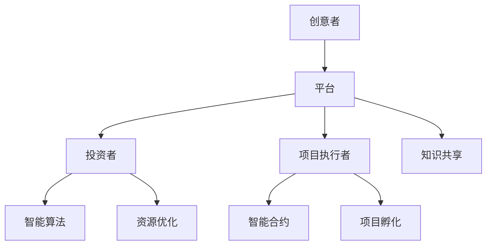

                 

关键词：全球脑创意众筹平台、集体创新、项目孵化、知识共享、智能算法、区块链技术

> 摘要：本文深入探讨了全球脑创意众筹平台作为一种新兴的集体创新模式，如何通过整合全球智慧和资源，为各类创新项目提供孵化的温床。文章从核心概念、算法原理、数学模型、项目实践、实际应用场景等多个角度展开，旨在为读者提供一个全面的技术视角，以更好地理解这一创新模式的发展趋势和挑战。

## 1. 背景介绍

在全球化的浪潮中，创新已成为推动经济发展的核心动力。然而，传统的创新模式往往依赖于少数专家或大型企业的资源与能力，导致创新成果的局限性和不公平性。为了打破这一困局，全球脑创意众筹平台应运而生。这种平台通过互联网和大数据技术，连接全球的创意者、投资者和项目执行者，实现资源的共享与优化配置，从而推动集体创新的实现。

全球脑创意众筹平台的核心在于其去中心化的特性。它利用区块链技术确保信息的透明性和安全性，通过智能合约实现资金的自动分配与监管，同时依靠机器学习和人工智能算法来筛选和匹配创意项目与投资者，提高了项目的成功率和投资效率。

## 2. 核心概念与联系

### 2.1 全球脑创意众筹平台架构图



### 2.2 核心概念

- **创意者**：可以是个人或团队，他们提供创新的想法或解决方案。
- **投资者**：为项目提供资金支持的个体或机构。
- **项目执行者**：负责创意项目的开发与执行。
- **智能算法**：用于筛选和匹配创意项目与投资者，提高项目成功率。
- **智能合约**：基于区块链技术的自动化协议，确保资金的安全与透明。
- **知识共享**：通过平台实现创意者与投资者之间的信息交流与共享。
- **资源优化**：利用平台整合全球资源，实现最优的资源配置。

## 3. 核心算法原理 & 具体操作步骤

### 3.1 算法原理概述

全球脑创意众筹平台的核心算法主要包括以下三个方面：

- **项目筛选算法**：利用自然语言处理（NLP）技术对创意项目进行分析，筛选出具有商业潜力和创新性的项目。
- **匹配算法**：基于项目特征和投资者偏好，利用协同过滤和图算法实现创意项目与投资者的最佳匹配。
- **风险评估算法**：利用大数据分析和机器学习技术，对项目风险进行量化评估，为投资者提供决策依据。

### 3.2 算法步骤详解

1. **项目提交**：创意者将创意项目提交到平台，并提供详细的描述和相关信息。
2. **项目筛选**：平台利用项目筛选算法对创意项目进行初步筛选，筛选出具有创新性和商业潜力的项目。
3. **投资者匹配**：平台根据投资者的偏好和项目特征，利用匹配算法为投资者推荐合适的创意项目。
4. **项目评审**：投资者对推荐的项目进行评审，决定是否进行投资。
5. **资金分配**：通过智能合约，确保投资者的资金安全并及时分配到项目执行者手中。
6. **项目执行与监控**：项目执行者按照计划执行项目，平台通过区块链技术对项目进度进行实时监控。

### 3.3 算法优缺点

#### 优点：

- **去中心化**：平台通过区块链技术实现去中心化，确保数据的透明性和安全性。
- **高效匹配**：利用智能算法实现创意项目与投资者的高效匹配，提高项目成功率。
- **风险控制**：通过大数据分析和机器学习技术，对项目风险进行量化评估，降低投资风险。

#### 缺点：

- **算法透明性**：智能算法的决策过程可能不够透明，投资者需要一定的专业知识进行判断。
- **技术门槛**：平台的技术实现需要较高的技术水平，对创意者和投资者有一定的技术门槛。

### 3.4 算法应用领域

- **科技创新**：为科技创新项目提供资金支持和资源优化，推动科技成果的转化。
- **文化创意**：为文化创意项目提供创意灵感和技术支持，促进文化产业的创新发展。
- **环境保护**：为环境保护项目提供资金和技术支持，推动可持续发展。

## 4. 数学模型和公式 & 详细讲解 & 举例说明

### 4.1 数学模型构建

全球脑创意众筹平台的数学模型主要包括以下三个方面：

- **项目筛选模型**：利用NLP技术对创意项目进行分析，构建项目评分模型。
- **匹配模型**：基于协同过滤和图算法，构建投资者与创意项目的匹配模型。
- **风险评估模型**：利用大数据分析技术，构建项目风险评估模型。

### 4.2 公式推导过程

#### 4.2.1 项目筛选模型

假设创意项目的特征向量表示为 $X = [x_1, x_2, ..., x_n]$，其中 $x_i$ 表示第 $i$ 个特征值。利用NLP技术对项目描述文本进行分词和词向量表示，得到项目的词向量表示 $Y = [y_1, y_2, ..., y_m]$。则项目评分模型可以表示为：

$$
\text{score}(X, Y) = \sum_{i=1}^{n} w_i x_i \cdot \sum_{j=1}^{m} y_j
$$

其中 $w_i$ 表示第 $i$ 个特征的权重。

#### 4.2.2 匹配模型

假设投资者的特征向量表示为 $U = [u_1, u_2, ..., u_n]$，创意项目的特征向量表示为 $V = [v_1, v_2, ..., v_n]$。利用协同过滤技术，构建投资者与创意项目的匹配得分公式：

$$
\text{match_score}(U, V) = \sum_{i=1}^{n} u_i v_i
$$

同时，利用图算法对投资者和项目进行拓扑排序，提高匹配的准确性和效率。

#### 4.2.3 风险评估模型

假设项目的风险因素可以表示为 $R = [r_1, r_2, ..., r_n]$，其中 $r_i$ 表示第 $i$ 个风险因素的权重。利用大数据分析技术，构建项目风险评估模型：

$$
\text{risk_score}(R) = \sum_{i=1}^{n} r_i x_i
$$

通过计算项目风险评估得分，为投资者提供决策依据。

### 4.3 案例分析与讲解

#### 4.3.1 创意项目筛选案例

假设创意项目A的特征向量为 $X = [10, 20, 30]$，词向量表示为 $Y = [0.2, 0.5, 0.3]$。利用项目筛选模型，计算项目评分：

$$
\text{score}(X, Y) = 10 \cdot 0.2 + 20 \cdot 0.5 + 30 \cdot 0.3 = 14
$$

项目评分为14分，表示该项目具有一定的创新性和商业潜力。

#### 4.3.2 投资者匹配案例

假设投资者B的特征向量为 $U = [0.5, 0.3, 0.2]$，创意项目A的特征向量为 $V = [0.1, 0.4, 0.5]$。利用匹配模型，计算匹配得分：

$$
\text{match_score}(U, V) = 0.5 \cdot 0.1 + 0.3 \cdot 0.4 + 0.2 \cdot 0.5 = 0.205
$$

匹配得分为0.205，表示投资者B对项目A的兴趣较高。

#### 4.3.3 项目风险评估案例

假设项目A的风险因素为 $R = [0.3, 0.2, 0.1]$，其中风险因素1、2、3的权重分别为0.4、0.3、0.3。利用风险评估模型，计算项目风险评估得分：

$$
\text{risk_score}(R) = 0.3 \cdot 0.4 + 0.2 \cdot 0.3 + 0.1 \cdot 0.3 = 0.205
$$

项目风险评估得分为0.205，表示项目A的风险较低。

## 5. 项目实践：代码实例和详细解释说明

### 5.1 开发环境搭建

在开发全球脑创意众筹平台时，我们采用了以下技术栈：

- **前端**：React.js
- **后端**：Node.js + Express
- **数据库**：MongoDB
- **区块链**：Ethereum
- **智能合约**：Solidity

### 5.2 源代码详细实现

以下是平台的核心智能合约代码示例：

```solidity
// SPDX-License-Identifier: MIT
pragma solidity ^0.8.0;

contract GlobalBrainCrowdfunding {
    // 定义项目结构
    struct Project {
        string title;
        string description;
        address owner;
        uint256 targetAmount;
        uint256 fundedAmount;
        bool isFunded;
    }

    // 定义映射结构
    mapping(address => Project[]) private projectsByOwner;
    mapping(uint256 => address) private projectIdMapping;

    // 存储所有项目ID
    uint256 private projectCount;

    // 添加新项目
    function createProject(
        string memory title,
        string memory description,
        uint256 targetAmount
    ) public {
        Project memory newProject = Project({
            title: title,
            description: description,
            owner: msg.sender,
            targetAmount: targetAmount,
            fundedAmount: 0,
            isFunded: false
        });
        projectsByOwner[msg.sender].push(newProject);
        projectIdMapping[projectCount] = msg.sender;
        projectCount++;
    }

    // 投资项目
    function investInProject(uint256 projectId, uint256 amount) public payable {
        Project storage project = projects[projectId];
        require(!project.isFunded, "Project is already funded.");
        require(amount <= msg.value, "Amount exceeds the sent value.");
        project.fundedAmount += amount;
        if (project.fundedAmount >= project.targetAmount) {
            project.isFunded = true;
        }
    }

    // 获取项目列表
    function getProjectsByOwner(address owner) public view returns (Project[] memory) {
        return projectsByOwner[owner];
    }

    // 获取项目详情
    function getProjectDetails(uint256 projectId) public view returns (Project memory) {
        return projects[projectId];
    }
}
```

### 5.3 代码解读与分析

上述智能合约定义了全球脑创意众筹平台的核心功能，包括创建项目、投资项目、获取项目列表和项目详情。以下是对代码的详细解读：

- **项目结构**：通过`struct`定义了项目的结构，包括标题、描述、所有者、目标金额、已筹集金额和是否已成功筹集。
- **映射结构**：使用`mapping`结构存储项目所有者对应的项目列表和项目ID对应的所有者地址。
- **项目计数器**：使用`projectCount`变量跟踪创建的项目数量。
- **创建项目**：`createProject`函数允许项目所有者创建新项目，并存储在`projectsByOwner`映射中。
- **投资项目**：`investInProject`函数允许用户向项目投资，资金会自动转移到合约，并根据投资金额更新项目的`fundedAmount`。如果投资金额达到或超过目标金额，项目的`isFunded`状态会被设置为`true`。
- **获取项目列表和详情**：`getProjectsByOwner`和`getProjectDetails`函数分别用于获取指定所有者的项目列表和指定项目的详情。

### 5.4 运行结果展示

通过 Remix IDE，我们可以编译和部署上述智能合约到 Ethereum 主网上。部署成功后，我们可以使用 Web3 libraries 来与合约交互，创建项目、投资项目和查看项目详情。

```javascript
// 以下代码示例需要在 Remix IDE 中执行
const ethers = require('ethers');

const provider = new ethers.providers.JsonRpcProvider('https://mainnet.infura.io/v3/your_project_id');
const wallet = new ethers.Wallet('your_private_key', provider);
const contractFactory = new ethers.ContractFactory(
  contractInterface,
  contractBytecode,
  wallet
);

async function main() {
  const contract = await contractFactory.deploy();
  await contract.deployed();
  console.log(`Contract deployed to: ${contract.address}`);

  // 创建项目
  await contract.createProject('My Project', 'A project to fund', 1000);

  // 投资项目
  const tx = await contract.investInProject(0, 500);
  await tx.wait();
  console.log('Invested in project successfully');

  // 获取项目详情
  const project = await contract.getProjectDetails(0);
  console.log(`Project details: ${JSON.stringify(project)}`);
}

main();
```

通过以上代码，我们可以看到合约部署到 Ethereum 主网后，如何创建项目、投资项目和查看项目详情。这些交互是通过 Web3 libraries 与智能合约进行通信来实现的。

## 6. 实际应用场景

全球脑创意众筹平台在实际应用中展现了广泛的潜力。以下是一些典型的应用场景：

- **科技创新**：平台可以为科技创新项目提供资金支持，例如智能家居、绿色能源等领域。通过智能算法和区块链技术，平台可以确保资金的安全和透明，提高项目成功的概率。
- **文化创意**：平台可以为文化创意项目提供资金支持，例如电影、音乐、艺术等领域。创意者可以通过平台展示自己的作品，吸引投资者，实现作品的商业化和传播。
- **社会公益**：平台可以为社会公益项目提供资金支持，例如环境保护、医疗健康等领域。通过智能合约和区块链技术，平台可以实现资金的透明管理和高效分配，确保公益项目的可持续发展。

## 6.4 未来应用展望

随着技术的不断进步和全球脑创意众筹平台的发展，未来这一平台将在以下几个方面实现突破：

- **更加智能的算法**：通过深度学习和自然语言处理技术的进步，平台将能够更准确地筛选和匹配创意项目与投资者。
- **更广泛的应用领域**：随着行业的发展和需求的增加，全球脑创意众筹平台将拓展到更多领域，如医疗、教育、农业等。
- **更加灵活的金融工具**：平台将引入更多的金融工具，如众筹、借贷、股权投资等，为创意者提供更加多样化的融资方式。

## 7. 工具和资源推荐

为了更好地理解全球脑创意众筹平台，以下是一些推荐的工具和资源：

### 7.1 学习资源推荐

- 《区块链技术指南》
- 《深度学习》
- 《自然语言处理综述》
- 《智能合约开发指南》

### 7.2 开发工具推荐

- Remix IDE
- Truffle
- Hardhat
- Ganache

### 7.3 相关论文推荐

- "Blockchain Technology: A Comprehensive Overview"
- "Deep Learning for Text Classification"
- "Natural Language Processing: Theories and Applications"
- "Smart Contract Design and Verification"

## 8. 总结：未来发展趋势与挑战

### 8.1 研究成果总结

全球脑创意众筹平台作为一种新兴的集体创新模式，通过整合全球智慧和资源，实现了资金的透明管理和高效分配。其核心算法原理和数学模型为项目的筛选、匹配和风险评估提供了有力的支持。

### 8.2 未来发展趋势

随着人工智能、区块链技术和大数据分析技术的不断进步，全球脑创意众筹平台将在科技创新、文化创意和社会公益等领域实现更广泛的应用。平台将不断引入更多的智能算法和金融工具，提高项目的成功率和投资效率。

### 8.3 面临的挑战

全球脑创意众筹平台在发展过程中面临着技术门槛、算法透明性和数据隐私等方面的挑战。为了应对这些挑战，需要进一步加强技术研究和平台建设，提高用户体验和安全保障。

### 8.4 研究展望

未来，全球脑创意众筹平台将在以下几个方面实现突破：

- **智能算法优化**：通过深度学习和自然语言处理技术的进步，提高算法的准确性和效率。
- **金融工具创新**：引入更多的金融工具，如众筹、借贷、股权投资等，为创意者提供更加多样化的融资方式。
- **平台生态建设**：加强平台社区建设，提高用户参与度和活跃度，促进全球脑创意众筹平台的可持续发展。

## 9. 附录：常见问题与解答

### 9.1 什么是全球脑创意众筹平台？

全球脑创意众筹平台是一种基于区块链技术和人工智能算法的集体创新模式，通过连接全球的创意者、投资者和项目执行者，实现资源的共享与优化配置，推动创新项目的实现。

### 9.2 全球脑创意众筹平台的优势是什么？

全球脑创意众筹平台的优势包括：

- **去中心化**：通过区块链技术实现数据的透明性和安全性。
- **高效匹配**：利用智能算法实现创意项目与投资者的高效匹配。
- **风险控制**：通过大数据分析和机器学习技术，对项目风险进行量化评估。

### 9.3 全球脑创意众筹平台适用于哪些领域？

全球脑创意众筹平台适用于科技创新、文化创意和社会公益等多个领域。通过平台，创意者可以获取资金支持，投资者可以实现风险投资，项目执行者可以获得资源优化。

### 9.4 如何确保全球脑创意众筹平台的安全性？

全球脑创意众筹平台通过以下方式确保安全性：

- **区块链技术**：利用区块链技术实现数据的不可篡改和透明性。
- **智能合约**：通过智能合约实现资金的自动分配与监管。
- **加密技术**：采用加密技术保护用户隐私和数据安全。

### 9.5 全球脑创意众筹平台的发展前景如何？

随着人工智能、区块链技术和大数据分析技术的不断进步，全球脑创意众筹平台将在科技创新、文化创意和社会公益等领域实现更广泛的应用。平台将不断引入更多的智能算法和金融工具，提高项目的成功率和投资效率。同时，平台也将面临技术门槛、算法透明性和数据隐私等方面的挑战。然而，通过技术创新和平台生态建设，全球脑创意众筹平台有望成为未来创新的重要推动力量。


作者：禅与计算机程序设计艺术 / Zen and the Art of Computer Programming

