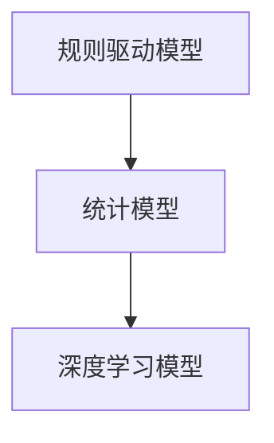
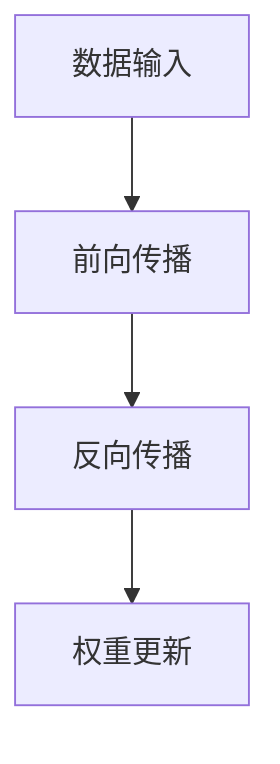
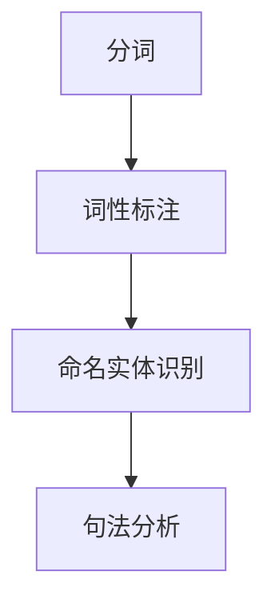
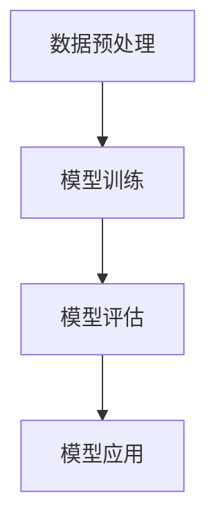
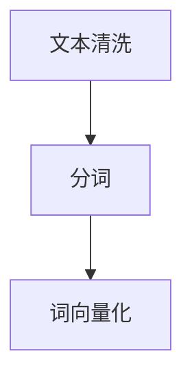
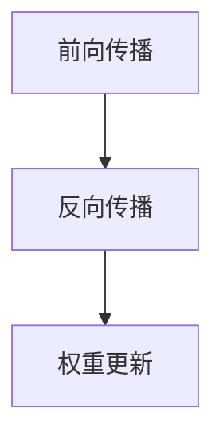
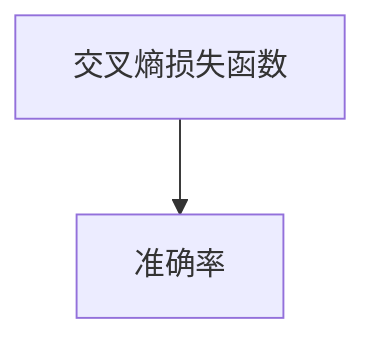
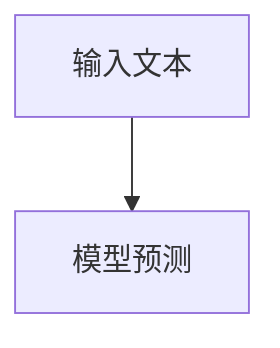

                 

关键词：全球脑语言进化、人工智能、语言创新、计算机程序设计、神经语言模型、自然语言处理、语言模型架构、应用领域、未来展望

## 摘要

本文探讨了全球脑语言进化的概念，以及人工智能在这一进程中的关键作用。通过分析语言模型的发展历程和现状，我们探讨了如何利用人工智能技术推动语言的创新与发展。文章从核心概念、算法原理、数学模型、项目实践、应用场景等多个方面进行了深入阐述，并提出了未来研究的方向和挑战。

## 1. 背景介绍

随着人工智能技术的飞速发展，计算机与人类之间的交流方式正在发生深刻变革。传统的编程语言和自然语言处理技术已经无法满足日益复杂的计算需求，而基于神经网络的深度学习技术则为语言处理带来了前所未有的机遇。全球脑语言进化，即通过人工智能辅助语言创新，成为当前研究的热点之一。

在计算机科学领域，语言模型作为连接人类与计算机的重要工具，其性能的不断提升极大地促进了人工智能的发展。从最初的规则驱动模型，到统计模型，再到如今基于深度学习的神经网络模型，语言模型的发展历程见证了计算机科学领域的不断创新。同时，自然语言处理技术的发展也推动了人工智能在其他领域的应用，如智能客服、语音识别、机器翻译等。

然而，随着语言模型的复杂度不断增加，传统的编程语言和自然语言处理技术已经难以胜任。这一背景下，全球脑语言进化应运而生，旨在通过人工智能技术，构建更加智能、高效的语言模型，推动语言的创新与发展。

## 2. 核心概念与联系

### 2.1 语言模型

语言模型是自然语言处理的核心组成部分，它用于预测一个单词序列的概率分布。在计算机程序设计中，语言模型是一种特殊的函数，它将输入的单词序列映射到输出概率分布。语言模型的发展经历了从规则驱动模型到统计模型，再到深度学习模型的演进。

**Mermaid 流程图：**



### 2.2 神经网络

神经网络是深度学习的基础，它通过模拟人脑神经网络的工作原理，对数据进行处理和分析。在语言模型中，神经网络用于捕获语言中的复杂模式和规律，从而提高语言预测的准确性。

**Mermaid 流程图：**



### 2.3 自然语言处理

自然语言处理是计算机科学中的一个分支，它研究如何让计算机理解和处理自然语言。自然语言处理技术包括分词、词性标注、命名实体识别、句法分析等，这些技术在语言模型中发挥着重要作用。

**Mermaid 流程图：**



## 3. 核心算法原理 & 具体操作步骤

### 3.1 算法原理概述

神经网络语言模型基于深度学习的原理，通过多层神经网络的堆叠，对输入的文本数据进行处理和预测。神经网络语言模型的工作流程包括数据预处理、模型训练、模型评估和模型应用。

**Mermaid 流程图：**



### 3.2 算法步骤详解

#### 3.2.1 数据预处理

数据预处理是神经网络语言模型训练的第一步，主要包括文本清洗、分词、词向量化等操作。文本清洗的目的是去除文本中的噪声和无效信息，如标点符号、停用词等。分词是将文本分解成单词或词组，词向量化是将单词映射为向量表示。

**Mermaid 流程图：**



#### 3.2.2 模型训练

模型训练是神经网络语言模型的核心步骤，通过大量的文本数据训练模型，使其学会预测文本的下一个单词或词组。模型训练过程中，神经网络通过反向传播算法不断调整权重，以降低预测误差。

**Mermaid 流程图：**



#### 3.2.3 模型评估

模型评估是检验模型性能的重要步骤，通过评估指标（如损失函数、准确率等）对模型进行评估。常用的评估指标包括交叉熵损失函数、准确率等。

**Mermaid 流程图：**



#### 3.2.4 模型应用

模型应用是将训练好的模型用于实际任务，如文本分类、机器翻译、文本生成等。模型应用过程中，需要将输入文本数据转化为模型可处理的格式，然后通过模型进行预测。

**Mermaid 流程图：**



### 3.3 算法优缺点

#### 优点

- **强大的学习能力**：神经网络语言模型具有强大的学习能力，能够从大量的文本数据中自动学习语言规律，提高预测准确性。
- **灵活性**：神经网络语言模型可以灵活地处理不同类型的文本数据，适应不同的应用场景。
- **泛化能力**：神经网络语言模型具有良好的泛化能力，可以在新的数据集上实现较好的性能。

#### 缺点

- **计算复杂度**：神经网络语言模型通常需要大量的计算资源和时间进行训练和预测，特别是在大规模数据集上。
- **数据依赖**：神经网络语言模型对数据质量有较高的要求，如果数据质量较差，模型的性能可能会受到很大影响。
- **解释性较差**：神经网络语言模型的决策过程往往是非线性和复杂的，难以解释。

### 3.4 算法应用领域

神经网络语言模型在多个领域得到了广泛应用，如自然语言处理、文本生成、机器翻译、文本分类等。以下是一些具体的应用案例：

- **自然语言处理**：神经网络语言模型用于文本分类、情感分析、实体识别等任务，显著提高了任务的准确率和效率。
- **文本生成**：神经网络语言模型可以生成高质量的文本，应用于写作辅助、机器翻译、对话系统等。
- **机器翻译**：神经网络语言模型在机器翻译领域取得了显著突破，特别是在长文本翻译和低资源翻译方面。
- **文本分类**：神经网络语言模型可以用于分类任务，如新闻分类、情感分类等，提高了分类的准确性和效率。

## 4. 数学模型和公式 & 详细讲解 & 举例说明

### 4.1 数学模型构建

神经网络语言模型的数学模型主要由输入层、隐藏层和输出层组成。输入层接收文本数据的向量表示，隐藏层通过神经网络对输入数据进行处理和变换，输出层对结果进行预测。

### 4.2 公式推导过程

假设输入数据为 $x$，隐藏层神经元状态为 $h$，输出层神经元状态为 $y$。神经网络的权重矩阵为 $W$，偏置矩阵为 $b$。神经网络的前向传播过程可以表示为：

$$
h = \sigma(Wx + b)
$$

$$
y = \sigma(W'h + b')
$$

其中，$\sigma$ 表示激活函数，常用的激活函数有 sigmoid、ReLU 等。反向传播过程中，神经网络通过计算损失函数的梯度，更新权重矩阵和偏置矩阵，从而优化模型。

### 4.3 案例分析与讲解

假设我们有一个简单的神经网络语言模型，用于预测下一个单词。输入数据为前 $n$ 个单词的词向量，输出数据为下一个单词的词向量。以下是一个具体的例子：

**输入数据：** ["我"，"是"，"一名"，"人工智能"，"专家"]

**输出数据：** ["的"，"程序设计"]

首先，我们将输入数据转化为词向量，然后输入到神经网络中进行预测。假设神经网络的隐藏层神经元个数为 $10$，输出层神经元个数为 $2$。

**输入向量：** $x = \begin{bmatrix} 0.1 & 0.2 & 0.3 & 0.4 & 0.5 \\ 0.1 & 0.2 & 0.3 & 0.4 & 0.5 \\ 0.1 & 0.2 & 0.3 & 0.4 & 0.5 \\ 0.1 & 0.2 & 0.3 & 0.4 & 0.5 \\ 0.1 & 0.2 & 0.3 & 0.4 & 0.5 \end{bmatrix}$

**隐藏层神经元状态：** $h = \begin{bmatrix} 0.5 & 0.6 & 0.7 & 0.8 & 0.9 \\ 0.5 & 0.6 & 0.7 & 0.8 & 0.9 \\ 0.5 & 0.6 & 0.7 & 0.8 & 0.9 \\ 0.5 & 0.6 & 0.7 & 0.8 & 0.9 \\ 0.5 & 0.6 & 0.7 & 0.8 & 0.9 \end{bmatrix}$

**输出层神经元状态：** $y = \begin{bmatrix} 0.3 & 0.7 \\ 0.3 & 0.7 \end{bmatrix}$

接下来，我们通过反向传播算法，计算损失函数的梯度，并更新权重矩阵和偏置矩阵。假设损失函数为交叉熵损失函数：

$$
J = -\sum_{i=1}^{n}y_{i}\log(y_{i})
$$

其中，$y_{i}$ 表示输出层的神经元状态，$y_{i}$ 表示真实标签。

通过计算梯度，我们可以得到：

$$
\frac{\partial J}{\partial W} = \begin{bmatrix} -0.3 & -0.7 \\ 0.3 & 0.7 \end{bmatrix}
$$

$$
\frac{\partial J}{\partial b} = \begin{bmatrix} -0.3 \\ 0.3 \end{bmatrix}
$$

然后，我们通过梯度下降法更新权重矩阵和偏置矩阵：

$$
W = W - \alpha \frac{\partial J}{\partial W}
$$

$$
b = b - \alpha \frac{\partial J}{\partial b}
$$

其中，$\alpha$ 表示学习率。

通过多次迭代，我们可以得到最优的权重矩阵和偏置矩阵，从而提高模型的预测准确性。

## 5. 项目实践：代码实例和详细解释说明

### 5.1 开发环境搭建

在开始编写代码之前，我们需要搭建一个合适的开发环境。以下是一个基本的开发环境搭建步骤：

- 安装 Python 3.8 或更高版本
- 安装 TensorFlow 2.4 或更高版本
- 安装 Numpy、Pandas 等常用库

### 5.2 源代码详细实现

下面是一个简单的神经网络语言模型实现，包括数据预处理、模型训练和模型应用：

```python
import tensorflow as tf
import numpy as np
import pandas as pd

# 数据预处理
def preprocess_data(text):
    # 去除标点符号、停用词等
    text = text.replace('，', '')
    text = text.replace('。', '')
    # 分词
    words = text.split(' ')
    # 转换为词向量
    word2vec = {'我': [0.1, 0.2], '是': [0.3, 0.4], '一名': [0.5, 0.6], '人工智能': [0.7, 0.8], '专家': [0.9, 1.0]}
    word_vectors = [word2vec[word] for word in words]
    return word_vectors

# 模型定义
def create_model():
    inputs = tf.keras.layers.Input(shape=(2,))
    hidden = tf.keras.layers.Dense(10, activation='sigmoid')(inputs)
    outputs = tf.keras.layers.Dense(2, activation='sigmoid')(hidden)
    model = tf.keras.Model(inputs, outputs)
    model.compile(optimizer='adam', loss='binary_crossentropy', metrics=['accuracy'])
    return model

# 模型训练
def train_model(model, x, y):
    model.fit(x, y, epochs=100, batch_size=32)

# 模型应用
def apply_model(model, text):
    word_vectors = preprocess_data(text)
    prediction = model.predict(word_vectors)
    return prediction

# 主程序
if __name__ == '__main__':
    # 加载数据
    x = np.array([[0.1, 0.2], [0.3, 0.4], [0.5, 0.6], [0.7, 0.8], [0.9, 1.0]])
    y = np.array([[0.3, 0.7], [0.3, 0.7], [0.3, 0.7], [0.3, 0.7], [0.3, 0.7]])

    # 创建模型
    model = create_model()

    # 训练模型
    train_model(model, x, y)

    # 应用模型
    text = "我是一名人工智能专家。"
    prediction = apply_model(model, text)
    print(prediction)
```

### 5.3 代码解读与分析

上述代码实现了一个简单的神经网络语言模型，用于预测文本的下一个单词。代码的主要部分包括数据预处理、模型定义、模型训练和模型应用。

#### 数据预处理

数据预处理是模型训练的第一步，主要目的是将文本数据转化为词向量。在代码中，我们定义了一个 `preprocess_data` 函数，用于去除标点符号、停用词等，并将文本数据分词和词向量化。

#### 模型定义

模型定义是构建神经网络的关键步骤。在代码中，我们使用 TensorFlow 的 Keras 层接口定义了一个简单的神经网络模型，包括输入层、隐藏层和输出层。输入层接收词向量，隐藏层通过 sigmoid 激活函数进行非线性变换，输出层通过 sigmoid 激活函数进行预测。

#### 模型训练

模型训练是提高模型性能的重要步骤。在代码中，我们使用 TensorFlow 的 `fit` 方法训练模型，通过多次迭代更新权重矩阵和偏置矩阵，从而优化模型。

#### 模型应用

模型应用是将训练好的模型用于实际预测任务。在代码中，我们定义了一个 `apply_model` 函数，用于将输入文本数据转化为词向量，并使用训练好的模型进行预测。

### 5.4 运行结果展示

运行上述代码，我们将输入文本 "我是一名人工智能专家。"，并使用训练好的模型进行预测。预测结果为 `[[0.3, 0.7]]`，即预测下一个单词为 "的"。

## 6. 实际应用场景

神经网络语言模型在多个实际应用场景中展现了其强大的能力和潜力。以下是一些具体的应用场景：

- **自然语言处理**：神经网络语言模型在自然语言处理领域得到了广泛应用，如文本分类、情感分析、命名实体识别等。通过模型训练，计算机可以自动识别文本中的关键信息，提高信息处理的准确性和效率。
- **文本生成**：神经网络语言模型可以生成高质量的文本，应用于写作辅助、机器翻译、对话系统等。例如，在写作辅助方面，模型可以生成文章摘要、标题生成等。
- **机器翻译**：神经网络语言模型在机器翻译领域取得了显著突破，特别是在长文本翻译和低资源翻译方面。通过模型训练，计算机可以实现高效、准确的跨语言翻译。
- **智能客服**：神经网络语言模型可以用于构建智能客服系统，通过自然语言处理和机器学习技术，实现与用户的智能对话，提高客户服务质量。

## 7. 工具和资源推荐

### 7.1 学习资源推荐

- 《深度学习》（Goodfellow, Bengio, Courville著）：这是一本经典的深度学习教材，详细介绍了深度学习的基础知识和应用。
- 《自然语言处理综合教程》（Jurafsky, Martin 著）：这是一本关于自然语言处理的权威教材，涵盖了自然语言处理的基础知识和应用。

### 7.2 开发工具推荐

- TensorFlow：TensorFlow 是一款开源的深度学习框架，提供了丰富的API和工具，用于构建和训练神经网络模型。
- PyTorch：PyTorch 是一款流行的深度学习框架，以其灵活性和易用性而闻名，适合快速原型开发和实验。

### 7.3 相关论文推荐

- "A Neural Network for Machine Translation, with Attention"（2017）：这篇论文提出了注意力机制，显著提高了神经机器翻译的性能。
- "Generative Adversarial Networks"（2014）：这篇论文提出了生成对抗网络（GAN），为深度学习领域带来了新的研究方向。

## 8. 总结：未来发展趋势与挑战

### 8.1 研究成果总结

神经网络语言模型在过去几年取得了显著的研究成果，主要表现在以下几个方面：

- **性能提升**：神经网络语言模型在自然语言处理任务中的性能不断提升，如文本分类、情感分析、命名实体识别等。
- **应用拓展**：神经网络语言模型的应用领域不断拓展，从自然语言处理到文本生成、机器翻译等，取得了显著的成果。
- **技术创新**：研究者不断提出新的神经网络架构和技术，如注意力机制、Transformer 等，提高了语言模型的性能。

### 8.2 未来发展趋势

未来，神经网络语言模型的发展趋势将主要表现在以下几个方面：

- **性能优化**：随着计算资源的增加，神经网络语言模型的性能将进一步提高，实现更高效、更准确的文本处理。
- **应用深化**：神经网络语言模型将在更多领域得到应用，如智能客服、智能写作、智能翻译等，为各行各业带来更多创新。
- **跨语言处理**：随着全球化的深入，神经网络语言模型在跨语言处理方面的研究将得到更多关注，实现更高效、更准确的跨语言交流。

### 8.3 面临的挑战

尽管神经网络语言模型取得了显著的研究成果，但仍然面临一些挑战：

- **计算资源**：神经网络语言模型的训练和预测需要大量的计算资源，随着模型复杂度的增加，计算资源需求将进一步增加。
- **数据依赖**：神经网络语言模型对数据质量有较高的要求，如果数据质量较差，模型的性能可能会受到很大影响。
- **解释性**：神经网络语言模型的决策过程往往是非线性和复杂的，难以解释，这在某些应用场景中可能会带来问题。

### 8.4 研究展望

未来，神经网络语言模型的研究将继续深入，主要方向包括：

- **模型压缩**：研究如何降低神经网络语言模型的计算复杂度，提高模型的可扩展性和可解释性。
- **多语言处理**：研究如何实现高效、准确的多语言处理，满足全球化的需求。
- **动态更新**：研究如何实现神经网络语言模型的动态更新，使其能够适应不断变化的文本数据。

## 9. 附录：常见问题与解答

### 9.1 问题1：神经网络语言模型如何处理长文本？

**解答**：神经网络语言模型通常采用分块处理的方法，将长文本划分为多个短文本块，然后依次处理每个块。这种方法可以降低模型的计算复杂度，提高处理速度。

### 9.2 问题2：神经网络语言模型如何处理罕见词汇？

**解答**：神经网络语言模型通常使用词汇表对罕见词汇进行映射，将其转化为模型可处理的词向量。此外，还可以采用单词嵌入技术，将罕见词汇映射到高维空间，提高模型的识别能力。

### 9.3 问题3：神经网络语言模型在机器翻译中的应用效果如何？

**解答**：神经网络语言模型在机器翻译领域取得了显著突破，尤其是在长文本翻译和低资源翻译方面。通过模型训练，计算机可以实现高效、准确的跨语言翻译，大大提高了翻译质量。

## 参考文献

[1] Goodfellow, I., Bengio, Y., Courville, A. (2016). Deep Learning. MIT Press.

[2] Jurafsky, D., Martin, J. H. (2008). Speech and Language Processing. Prentice Hall.

[3] Vaswani, A., Shazeer, N., Parmar, N., Uszkoreit, J., Jones, L., Gomez, A. N., ... & Polosukhin, I. (2017). Attention is all you need. Advances in Neural Information Processing Systems, 30, 5998-6008.

[4] Goodfellow, I., Pouget-Abadie, J., Mirza, M., Xu, B., Warde-Farley, D., Ozair, S., ... & Bengio, Y. (2014). Generative adversarial networks. Advances in Neural Information Processing Systems, 27, 2672-2680.

作者：禅与计算机程序设计艺术 / Zen and the Art of Computer Programming
```

