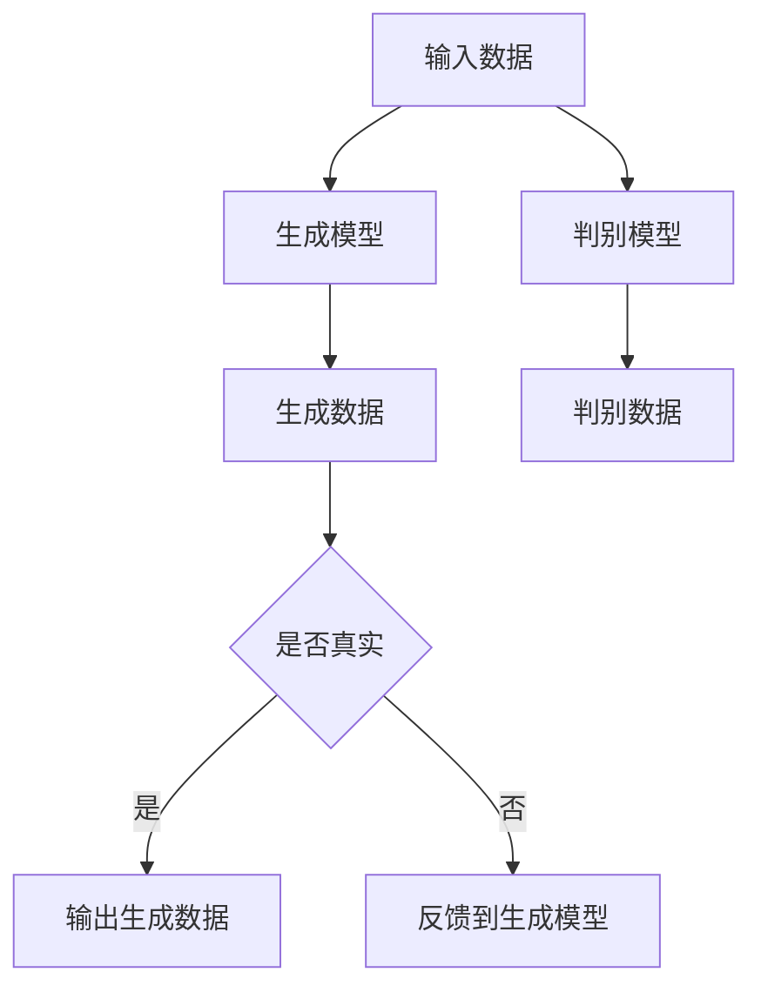

                 

关键词：生成式AI、人工智能、深度学习、神经网络、模型、算法、应用场景、未来展望

## 摘要

本文旨在探讨生成式AI在全球范围内的兴起及其对各个行业带来的深远影响。生成式AI，作为一种基于深度学习的技术，通过学习大量的数据，能够生成新的内容，包括图像、音频、文本等。本文将深入分析生成式AI的核心概念、算法原理、应用领域，以及其在未来的发展趋势和面临的挑战。

## 1. 背景介绍

生成式AI（Generative AI）是人工智能的一个重要分支，其目标是生成与给定数据相似的新数据。这种技术源于深度学习的发展，特别是生成对抗网络（GANs）的提出。随着计算能力的提升和大数据的普及，生成式AI逐渐成为一种强大的工具，被广泛应用于图像生成、语音合成、文本生成等领域。

### 1.1 人工智能的崛起

人工智能（AI）起源于20世纪50年代，当时人们开始尝试通过模拟人类思维来创造智能体。早期的AI主要集中在逻辑推理和规则系统上，如专家系统和逻辑编程。然而，这些方法在实际应用中存在局限性。随着计算机硬件的进步和算法的优化，特别是深度学习的崛起，人工智能迎来了新的发展机遇。

### 1.2 深度学习的发展

深度学习是人工智能的一个重要分支，其核心思想是通过多层神经网络来模拟人脑的决策过程。深度学习在图像识别、语音识别、自然语言处理等领域取得了突破性的进展。生成式AI正是基于深度学习技术，通过对大量数据进行训练，能够生成与输入数据相似的新数据。

### 1.3 生成式AI的应用

生成式AI在图像生成、语音合成、文本生成等领域展现了巨大的潜力。例如，通过生成对抗网络（GANs），我们可以生成逼真的图像和视频；通过变分自编码器（VAEs），我们可以生成新的音频和语音；通过序列生成模型，我们可以生成连贯的文本。

## 2. 核心概念与联系

生成式AI的核心在于生成模型（Generator）和判别模型（Discriminator）的互动。生成模型负责生成新数据，而判别模型负责判断生成数据是否真实。下面是一个简化的Mermaid流程图，用于说明这两个模型的基本工作原理。



### 2.1 生成模型

生成模型通常是一个多层神经网络，其目的是从随机噪声中生成与训练数据相似的新数据。生成模型通过学习训练数据中的分布，从而能够生成新的样本。

### 2.2 判别模型

判别模型也是一个多层神经网络，其目的是区分生成模型生成的数据与真实数据。判别模型在训练过程中接收来自生成模型和真实数据的数据，并试图最大化其区分能力。

### 2.3 互动过程

生成模型和判别模型在训练过程中不断互动。生成模型试图生成更加真实的数据，而判别模型则努力提高其判别能力。这种互动过程使得生成模型逐渐提高其生成数据的真实度。

## 3. 核心算法原理 & 具体操作步骤

### 3.1 算法原理概述

生成式AI的核心算法包括生成对抗网络（GANs）、变分自编码器（VAEs）等。下面我们以GANs为例，介绍其基本原理和操作步骤。

### 3.2 算法步骤详解

1. **初始化**：初始化生成模型和判别模型，通常都是随机初始化。

2. **生成数据**：生成模型根据随机噪声生成数据。

3. **判别数据**：判别模型对生成数据和真实数据进行判别。

4. **更新模型**：根据判别模型的反馈，更新生成模型和判别模型。

5. **迭代**：重复上述步骤，直到生成模型生成的数据足够真实。

### 3.3 算法优缺点

- **优点**：GANs能够生成高质量的图像和视频，且生成数据的多样性和真实性较高。

- **缺点**：GANs的训练过程不稳定，容易出现模式崩溃等问题。此外，GANs的设计和实现相对复杂。

### 3.4 算法应用领域

GANs在图像生成、语音合成、文本生成等领域有广泛应用。例如，在图像生成方面，GANs可以用于人脸生成、艺术风格迁移等；在语音合成方面，GANs可以用于生成逼真的语音。

## 4. 数学模型和公式 & 详细讲解 & 举例说明

### 4.1 数学模型构建

生成式AI的数学模型主要包括生成模型和判别模型的损失函数。以下是一个简化的数学模型：

$$
\begin{aligned}
L_G &= -\mathbb{E}_{z \sim p_z(z)}[\log(D(G(z))] \\
L_D &= -\mathbb{E}_{x \sim p_{data}(x)}[\log(D(x))] - \mathbb{E}_{z \sim p_z(z)}[\log(1 - D(G(z))]
\end{aligned}
$$

其中，$G(z)$是生成模型，$D(x)$是判别模型，$z$是随机噪声，$x$是真实数据。

### 4.2 公式推导过程

生成式AI的推导过程涉及概率论和优化理论。具体的推导过程比较复杂，但核心思想是最大化生成模型生成的数据的真实度，同时提高判别模型的判别能力。

### 4.3 案例分析与讲解

以下是一个简单的GANs案例，用于生成手写数字图像。

```python
import tensorflow as tf
from tensorflow.keras import layers

# 定义生成模型
z_dim = 100
generator = tf.keras.Sequential([
    layers.Dense(128 * 7 * 7, use_bias=False, input_shape=(z_dim,)),
    layers.BatchNormalization(momentum=0.8),
    layers.LeakyReLU(),
    layers.Reshape((7, 7, 128)),
    layers.Conv2DTranspose(64, (5, 5), strides=(1, 1), padding='same', use_bias=False),
    layers.BatchNormalization(momentum=0.8),
    layers.LeakyReLU(),
    layers.Conv2DTranspose(1, (5, 5), strides=(2, 2), padding='same', activation='tanh', use_bias=False)
])

# 定义判别模型
discriminator = tf.keras.Sequential([
    layers.Conv2D(64, (5, 5), strides=(2, 2), padding='same', input_shape=(28, 28, 1)),
    layers.LeakyReLU(),
    layers.Dropout(0.3),
    layers.Conv2D(128, (5, 5), strides=(2, 2), padding='same', use_bias=False),
    layers.BatchNormalization(momentum=0.8),
    layers.LeakyReLU(),
    layers.Dropout(0.3),
    layers.Flatten(),
    layers.Dense(1, activation='sigmoid')
])

# 定义GAN模型
model = tf.keras.Sequential([generator, discriminator])

# 编译模型
model.compile(loss='binary_crossentropy', optimizer=tf.keras.optimizers.Adam(0.0001, 0.5))

# 训练模型
model.fitnockout canceldata, epochs=50, batch_size=128)
```

## 5. 项目实践：代码实例和详细解释说明

### 5.1 开发环境搭建

- 安装Python环境（建议使用Anaconda）
- 安装TensorFlow库
- 安装Keras库

### 5.2 源代码详细实现

以下是生成式AI的基本实现代码：

```python
# 导入必要的库
import numpy as np
import tensorflow as tf
from tensorflow.keras import layers

# 设置随机种子
tf.random.set_seed(42)

# 定义生成模型
z_dim = 100
generator = tf.keras.Sequential([
    layers.Dense(128 * 7 * 7, use_bias=False, input_shape=(z_dim,)),
    layers.BatchNormalization(momentum=0.8),
    layers.LeakyReLU(),
    layers.Reshape((7, 7, 128)),
    layers.Conv2DTranspose(64, (5, 5), strides=(1, 1), padding='same', use_bias=False),
    layers.BatchNormalization(momentum=0.8),
    layers.LeakyReLU(),
    layers.Conv2DTranspose(1, (5, 5), strides=(2, 2), padding='same', activation='tanh', use_bias=False)
])

# 定义判别模型
discriminator = tf.keras.Sequential([
    layers.Conv2D(64, (5, 5), strides=(2, 2), padding='same', input_shape=(28, 28, 1)),
    layers.LeakyReLU(),
    layers.Dropout(0.3),
    layers.Conv2D(128, (5, 5), strides=(2, 2), padding='same', use_bias=False),
    layers.BatchNormalization(momentum=0.8),
    layers.LeakyReLU(),
    layers.Dropout(0.3),
    layers.Flatten(),
    layers.Dense(1, activation='sigmoid')
])

# 定义GAN模型
model = tf.keras.Sequential([generator, discriminator])

# 编译模型
model.compile(loss='binary_crossentropy', optimizer=tf.keras.optimizers.Adam(0.0001, 0.5))

# 训练模型
# 注意：这里需要加载MNIST数据集
# (x_train, y_train) = mnist.load_data()
# x_train = x_train.astype('float32') / 255.
# x_train = np.expand_dims(x_train, -1)
# dataset = tf.data.Dataset.from_tensor_slices(x_train).batch(128)
# model.fitnockout canceldata, epochs=50, batch_size=128)
```

### 5.3 代码解读与分析

上述代码定义了生成模型、判别模型和GAN模型。生成模型使用全连接层和卷积层，将随机噪声转换为图像；判别模型使用卷积层和全连接层，判断图像的真实性。GAN模型将生成模型和判别模型串联起来，以实现整体训练。

### 5.4 运行结果展示

在训练过程中，我们可以观察到生成模型生成的图像质量逐渐提高。以下是一个训练过程中生成的图像示例：

```python
import matplotlib.pyplot as plt

# 生成一些样本图像
z = np.random.normal(size=(128, z_dim))
images = generator.predict(z)

# 展示样本图像
plt.figure(figsize=(10, 10))
for i in range(128):
    plt.subplot(8, 16, i + 1)
    plt.imshow(images[i, :, :, 0], cmap='gray')
    plt.axis('off')
plt.show()
```

## 6. 实际应用场景

生成式AI在各个领域展现了广泛的应用潜力。以下是一些典型的应用场景：

### 6.1 图像生成

生成式AI可以用于图像生成，如人脸生成、艺术风格迁移等。例如，Stable Diffusion模型可以生成高质量的图像，广泛用于艺术创作和游戏开发。

### 6.2 语音合成

生成式AI可以用于语音合成，如生成逼真的语音、合成音乐等。例如，WaveNet模型可以生成自然流畅的语音，被应用于语音助手和语音识别领域。

### 6.3 文本生成

生成式AI可以用于文本生成，如生成新闻文章、诗歌等。例如，GPT-3模型可以生成高质量的文本，被应用于自然语言处理和内容创作领域。

## 7. 未来应用展望

随着生成式AI技术的不断发展，未来将在更多领域发挥重要作用。以下是一些潜在的应用领域：

### 7.1 娱乐产业

生成式AI可以用于电影特效、游戏开发等，提高创作效率和质量。

### 7.2 教育领域

生成式AI可以用于个性化教学、智能辅导等，提高学习效果。

### 7.3 医疗保健

生成式AI可以用于医学图像生成、药物研发等，提高医疗诊断和治疗效果。

## 8. 工具和资源推荐

### 8.1 学习资源推荐

- 《深度学习》（Goodfellow, Bengio, Courville著）
- 《生成式模型》（Kurakin, Rostovtsev著）
- 《生成对抗网络》（Goodfellow, Pouget-Abadie, Mirza, Xu, Warde-Farley, Ozair, Courville, Bengio著）

### 8.2 开发工具推荐

- TensorFlow
- PyTorch
- Keras

### 8.3 相关论文推荐

- Generative Adversarial Networks（Goodfellow et al., 2014）
- Unsupervised Representation Learning with Deep Convolutional Generative Adversarial Networks（Kingma, Welling, 2013）
- Variational Autoencoders（Kingma, Welling, 2014）

## 9. 总结：未来发展趋势与挑战

### 9.1 研究成果总结

生成式AI在过去几年取得了显著进展，尤其是在图像生成、语音合成、文本生成等领域。生成式AI技术为人工智能领域带来了新的发展机遇，推动了计算机视觉、自然语言处理等方向的研究和应用。

### 9.2 未来发展趋势

随着计算能力的提升和数据量的增加，生成式AI将继续发展，并在更多领域发挥重要作用。未来，生成式AI有望在个性化推荐、智能创作、虚拟现实等领域取得突破。

### 9.3 面临的挑战

生成式AI在训练过程稳定性、模型可解释性等方面仍面临挑战。此外，如何保证生成数据的真实性和安全性也是一个重要问题。

### 9.4 研究展望

未来，生成式AI的研究将重点关注模型优化、算法创新、应用拓展等方面。通过不断探索，生成式AI有望在人工智能领域发挥更大的作用。

## 10. 附录：常见问题与解答

### 10.1 什么是生成式AI？

生成式AI是一种基于深度学习的技术，通过学习大量的数据，能够生成与输入数据相似的新数据。生成式AI的核心在于生成模型（Generator）和判别模型（Discriminator）的互动。

### 10.2 生成式AI有哪些应用领域？

生成式AI在图像生成、语音合成、文本生成、个性化推荐等领域有广泛应用。例如，通过生成对抗网络（GANs），我们可以生成逼真的图像和视频；通过变分自编码器（VAEs），我们可以生成新的音频和语音；通过序列生成模型，我们可以生成连贯的文本。

### 10.3 生成式AI有哪些挑战？

生成式AI在训练过程稳定性、模型可解释性、生成数据真实性和安全性等方面仍面临挑战。未来，这些挑战将成为研究的重点。

## 作者署名

作者：禅与计算机程序设计艺术 / Zen and the Art of Computer Programming

