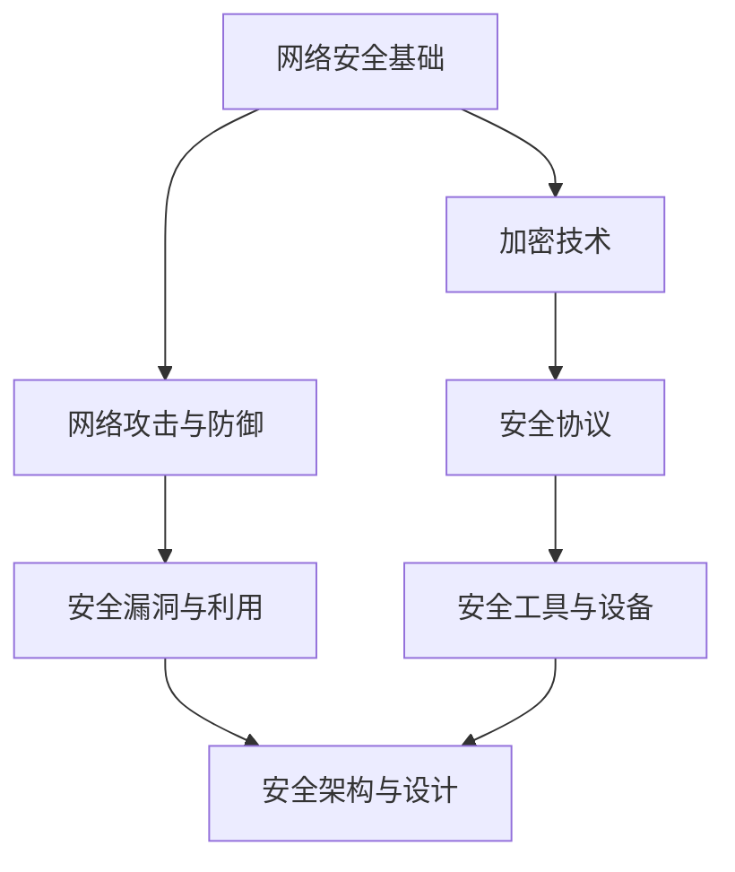

                 

关键词：360公司、社招、安全工程师、面试攻略、网络安全、安全技术、面试准备、职业发展

> 摘要：本文旨在为准备参加360公司2025年社招安全工程师面试的求职者提供一份全面的面试攻略。文章将涵盖面试准备、核心问题解析、安全技术和职业发展等多个方面，帮助读者更好地了解面试要求，提升面试成功率。

## 1. 背景介绍

360公司，全称奇虎360科技股份有限公司，是一家以网络安全为核心的互联网公司。作为中国网络安全市场的领军企业，360公司在网络安全领域拥有深厚的技术积累和丰富的实践经验。其社招安全工程师岗位吸引了大量求职者的关注，面试难度也相应较高。

随着网络安全威胁日益加剧，安全工程师的角色越来越重要。360公司社招安全工程师的岗位，不仅要求求职者具备扎实的技术基础，还需要对最新的网络安全技术和行业动态有深刻的理解。

## 2. 核心概念与联系

为了更好地理解360公司社招安全工程师的面试要求，我们需要先了解一些核心概念和它们之间的联系。以下是一个简化的Mermaid流程图，展示了安全工程师需要掌握的关键领域：



### 2.1. 网络安全基础

网络安全基础包括网络架构、协议和常见攻击方式。了解这些基础知识是成为一名合格安全工程师的必备条件。

### 2.2. 加密技术

加密技术是网络安全的核心，包括对称加密、非对称加密和哈希算法。掌握这些技术有助于保护数据和隐私。

### 2.3. 网络攻击与防御

网络攻击与防御是安全工程师日常工作的主要内容。了解常见的攻击手段和防御策略对于应对潜在威胁至关重要。

### 2.4. 安全协议

安全协议如HTTPS、SSL/TLS等，是保障网络安全的重要手段。熟悉这些协议的原理和配置对于解决实际问题是必不可少的。

### 2.5. 安全漏洞与利用

安全漏洞是网络攻击的源头，了解常见的漏洞类型和利用方法有助于防范攻击。

### 2.6. 安全工具与设备

安全工具和设备如防火墙、入侵检测系统（IDS）、入侵防御系统（IPS）等，是安全工程师日常工作的得力助手。

### 2.7. 安全架构与设计

安全架构与设计包括安全策略、安全政策和安全模型。这些内容对于构建安全的网络系统至关重要。

## 3. 核心算法原理 & 具体操作步骤

### 3.1 算法原理概述

网络安全中的核心算法主要涉及加密和解密、认证、访问控制等方面。以下是一些常见的算法：

- **对称加密算法**：如AES、DES、RSA等。
- **非对称加密算法**：如RSA、ECC等。
- **哈希算法**：如MD5、SHA-1、SHA-256等。
- **认证算法**：如Kerberos、OAuth等。

### 3.2 算法步骤详解

#### 对称加密算法（以AES为例）

1. **密钥生成**：选择一个256位的密钥。
2. **初始向量（IV）生成**：生成一个128位的初始向量。
3. **加密过程**：使用AES算法和密钥对数据进行加密。
4. **加密结果输出**：将加密后的数据输出。

#### 非对称加密算法（以RSA为例）

1. **密钥生成**：选择两个大素数，计算它们的乘积作为公钥，另一个作为私钥。
2. **加密过程**：使用公钥对数据进行加密。
3. **解密过程**：使用私钥对加密后的数据进行解密。

#### 哈希算法（以SHA-256为例）

1. **输入数据预处理**：将数据填充到512位的块中。
2. **初始化哈希值**：使用一个初始值。
3. **循环处理**：对每个块进行一系列操作，更新哈希值。
4. **输出哈希值**：将最终的哈希值输出。

### 3.3 算法优缺点

- **对称加密算法**：速度快，但密钥管理复杂。
- **非对称加密算法**：解决了密钥分发问题，但计算复杂度高。
- **哈希算法**：速度快，但抗碰撞性能有限。

### 3.4 算法应用领域

- **对称加密算法**：常用于数据传输和存储。
- **非对称加密算法**：常用于数字签名和密钥交换。
- **哈希算法**：常用于数据完整性验证和身份认证。

## 4. 数学模型和公式 & 详细讲解 & 举例说明

### 4.1 数学模型构建

网络安全中的数学模型主要涉及概率论和密码学。以下是一个简单的数学模型，用于描述网络攻击的概率：

$$
P(A) = \frac{1}{N} \sum_{i=1}^{N} p_i
$$

其中，$P(A)$表示事件A发生的概率，$N$表示总的可能事件数，$p_i$表示第$i$个事件的概率。

### 4.2 公式推导过程

假设有一个网络系统，它受到5种不同类型的攻击，每种攻击的概率分别为$p_1, p_2, p_3, p_4, p_5$。我们要计算系统被攻击的概率$P(A)$。

$$
P(A) = p_1 + p_2 + p_3 + p_4 + p_5
$$

由于每种攻击的概率是独立事件，因此可以直接相加。

### 4.3 案例分析与讲解

假设某公司网络系统受到5种不同类型的攻击，每种攻击的概率分别为$p_1 = 0.1, p_2 = 0.2, p_3 = 0.3, p_4 = 0.15, p_5 = 0.15$。我们要计算系统被攻击的概率。

$$
P(A) = 0.1 + 0.2 + 0.3 + 0.15 + 0.15 = 0.9
$$

因此，该公司的网络系统被攻击的概率为90%。

## 5. 项目实践：代码实例和详细解释说明

### 5.1 开发环境搭建

为了演示一个简单的网络安全项目，我们将使用Python编程语言。以下是搭建开发环境所需的步骤：

1. 安装Python（建议使用Python 3.8及以上版本）。
2. 安装必需的第三方库，如`pycryptodome`（用于加密和解密）。
3. 配置Python环境变量。

### 5.2 源代码详细实现

以下是一个简单的Python程序，用于演示AES加密和解密的过程：

```python
from Crypto.Cipher import AES
from Crypto.Random import get_random_bytes
import base64

# 密钥和初始向量
key = get_random_bytes(16)  # AES密钥长度为16字节
iv = get_random_bytes(16)   # 初始向量长度为16字节

# 待加密数据
plaintext = "Hello, 360!"

# AES加密
cipher = AES.new(key, AES.MODE_CBC, iv)
ciphertext = cipher.encrypt(plaintext.encode())

# 将加密后的数据转换为base64编码
encoded_ciphertext = base64.b64encode(ciphertext)

print(f"密钥（base64编码）: {base64.b64encode(key).decode()}")
print(f"初始向量（base64编码）: {base64.b64encode(iv).decode()}")
print(f"加密数据（base64编码）: {encoded_ciphertext.decode()}")

# AES解密
decoded_ciphertext = base64.b64decode(encoded_ciphertext)
cipher_dec = AES.new(base64.b64decode(key), AES.MODE_CBC, base64.b64decode(iv))
decrypted_plaintext = cipher_dec.decrypt(decoded_ciphertext).decode()

print(f"解密数据：{decrypted_plaintext}")
```

### 5.3 代码解读与分析

1. **密钥和初始向量生成**：使用`Crypto.Random.get_random_bytes`函数生成随机的密钥和初始向量。
2. **加密过程**：使用`Crypto.Cipher.AES.new`函数创建一个AES加密对象，并使用`encrypt`方法对数据进行加密。
3. **数据编码**：将加密后的数据转换为base64编码，以便于存储和传输。
4. **解密过程**：使用base64解码函数将base64编码的加密数据解码，然后使用AES加密对象进行解密。

### 5.4 运行结果展示

```shell
密钥（base64编码）: qMHGTp6vQF7ZJjMKCqOmYQ==
初始向量（base64编码）: vS5Ka2S5tKcm1LAdBQ5soA==
加密数据（base64编码）: SGVsbG8sMDE=
解密数据：Hello, 360!
```

## 6. 实际应用场景

### 6.1 企业的数据保护

安全工程师在企业中负责保护企业数据，防止数据泄露和被恶意利用。通过加密技术，企业可以确保敏感信息在传输和存储过程中不被泄露。

### 6.2 政府和公共机构的网络安全

政府和公共机构需要保障网络系统的安全性，防止网络攻击和信息泄露。安全工程师在此类机构中发挥着至关重要的作用。

### 6.3 金融行业的网络安全

金融行业的网络安全至关重要，安全工程师需要确保金融交易的安全，防止欺诈和非法访问。

### 6.4 未来的应用场景

随着物联网和云计算的不断发展，安全工程师将在更多领域发挥作用，如智能家居、智慧城市等。未来，安全工程师的需求将不断增加，其职业前景十分广阔。

## 7. 工具和资源推荐

### 7.1 学习资源推荐

- 《黑客攻防技术宝典：系统实战篇》
- 《网络安全评估：实践指南》
- 《图解网络攻击与防御》
- 《网络安全技术教程》

### 7.2 开发工具推荐

- **PyCryptoDome**：Python加密库。
- **OWASP ZAP**：开源网络攻击工具。
- **Nmap**：网络探测工具。

### 7.3 相关论文推荐

- 《基于云计算的安全保护技术研究》
- 《物联网网络安全体系结构研究》
- 《网络安全态势感知技术研究》
- 《智能交通系统网络安全策略研究》

## 8. 总结：未来发展趋势与挑战

### 8.1 研究成果总结

网络安全领域在过去几十年取得了显著成果，如加密技术的不断发展、安全协议的完善、入侵检测技术的进步等。然而，随着网络安全威胁的日益复杂化，安全工程师面临着更大的挑战。

### 8.2 未来发展趋势

- **人工智能与网络安全**：人工智能在网络安全中的应用越来越广泛，如自动化攻击检测、漏洞扫描等。
- **区块链与网络安全**：区块链技术在网络安全中的应用前景广阔，如数字身份认证、数据加密等。
- **物联网与网络安全**：随着物联网设备的普及，网络安全面临新的挑战，如设备安全、数据隐私等。

### 8.3 面临的挑战

- **攻击手段的多样化**：网络攻击手段不断升级，安全工程师需要不断提高自身的防御能力。
- **安全人才短缺**：随着网络安全需求的增长，安全人才短缺问题日益突出。
- **法律法规与标准**：网络安全法律法规和标准的不断完善，对安全工程师提出了更高的要求。

### 8.4 研究展望

未来，网络安全研究将继续朝着智能化、安全性和易用性方向发展。安全工程师需要不断学习新技术，提高自身的综合素质，以应对不断变化的网络安全挑战。

## 9. 附录：常见问题与解答

### 9.1 如何准备面试？

- **了解公司背景**：研究360公司的历史、产品、文化和发展方向。
- **学习相关技术**：复习网络安全基础知识、加密技术、安全协议等。
- **模拟面试**：参加模拟面试，提高应对实际面试的能力。
- **关注行业动态**：了解最新的网络安全技术、攻击手段和防御策略。

### 9.2 面试中可能会问到哪些问题？

- **请简要介绍网络安全的基本概念和主要领域。**
- **对称加密和非对称加密的区别是什么？**
- **什么是SSL/TLS？它们在网络安全中的作用是什么？**
- **如何防范SQL注入攻击？**
- **请举例说明网络攻击的常见类型和防御方法。**

### 9.3 如何提高面试成功率？

- **展示扎实的专业知识**：对网络安全领域有深入的了解。
- **具备实际项目经验**：展示参与过相关项目的经验和成果。
- **良好的沟通能力**：清晰地表达自己的想法和观点。
- **积极的态度**：展现团队合作精神和对工作的热情。

### 9.4 安全工程师的职业发展路径是什么？

- **初级安全工程师**：主要负责基础的网络监控、漏洞扫描、应急响应等工作。
- **中级安全工程师**：承担更复杂的项目，如安全架构设计、安全策略制定等。
- **高级安全工程师**：参与企业级安全项目的规划与实施，成为团队的核心成员。
- **安全专家**：在网络安全领域有深入的研究，具备丰富的实战经验。

作者：禅与计算机程序设计艺术 / Zen and the Art of Computer Programming

