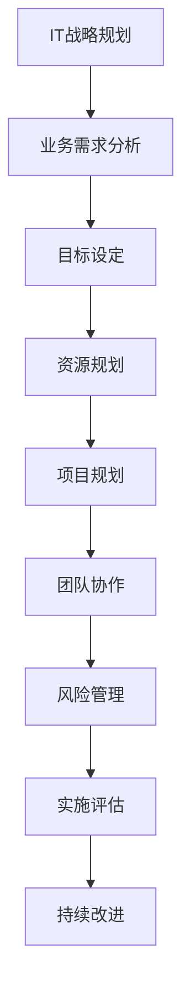

                 

在这个数字化的时代，IT战略规划对于企业的成功至关重要。一个精心制定的IT战略规划不仅能提高企业的运营效率，还能为企业提供竞争优势。本文将深入探讨公司IT战略规划的制定与实施，旨在为企业管理者提供一套实用的指导框架。

## 文章关键词

- IT战略规划
- 数字化转型
- 企业运营效率
- 竞争优势
- 技术创新

## 文章摘要

本文首先介绍了IT战略规划的定义和重要性，然后详细阐述了制定IT战略规划的步骤，包括需求分析、目标设定、资源规划等。接着，文章讨论了IT战略规划的执行过程，包括项目规划、团队协作、风险管理等。最后，文章提出了IT战略规划的实施评估和持续改进的方法，并展望了未来的发展趋势和挑战。

## 1. 背景介绍

### IT战略规划的定义

IT战略规划是指企业根据其业务目标和发展战略，利用信息技术手段进行规划和布局，以确保IT系统能够有效支持业务发展的过程。IT战略规划不仅是技术层面的决策，更是战略层面的规划，它涉及到企业的整体运营和未来发展。

### IT战略规划的重要性

在当今激烈的市场竞争中，IT战略规划的重要性日益凸显。首先，IT战略规划能够帮助企业实现数字化转型，提升企业的运营效率。其次，IT战略规划能够为企业在市场竞争中提供强有力的技术支持，增强企业的核心竞争力。最后，IT战略规划能够帮助企业适应快速变化的市场环境，保持企业的持续发展。

## 2. 核心概念与联系

### 核心概念

- **IT战略规划**：结合企业战略目标和业务需求，制定IT系统的长期和短期发展计划。
- **数字化转型**：利用数字技术改变企业的运营模式、业务流程和组织结构。
- **业务需求**：企业的核心业务需求，如提高效率、降低成本、提升用户体验等。
- **技术创新**：跟踪最新的技术发展趋势，利用新技术提升企业的竞争力。

### Mermaid 流程图



## 3. 核心算法原理 & 具体操作步骤

### 3.1 算法原理概述

IT战略规划的制定是一个复杂的过程，涉及到多个步骤和环节。其核心算法原理可以概括为：

1. **需求分析**：通过对企业现有业务流程的分析，识别出企业的核心业务需求。
2. **目标设定**：根据业务需求，设定IT系统的目标和预期效果。
3. **资源规划**：评估企业的资源情况，制定资源分配方案。
4. **项目规划**：制定详细的IT项目计划，包括时间表、任务分配等。
5. **团队协作**：建立跨部门协作机制，确保项目能够按计划进行。
6. **风险管理**：识别和评估项目风险，制定应对策略。
7. **实施评估**：对项目的实施效果进行评估，确保目标达成。
8. **持续改进**：根据评估结果，持续优化IT战略规划。

### 3.2 算法步骤详解

#### 3.2.1 需求分析

需求分析是制定IT战略规划的第一步，也是最重要的一步。这一步骤的主要任务是：

1. **收集需求**：通过访谈、问卷调查、文档分析等方式，收集企业各部门的业务需求。
2. **需求整理**：对收集到的需求进行整理和分类，识别出核心需求。
3. **需求验证**：与业务部门沟通，确认需求的准确性和可行性。

#### 3.2.2 目标设定

在需求分析的基础上，设定IT系统的目标和预期效果。这一步骤的主要任务是：

1. **目标定义**：明确IT系统的目标和预期效果，如提升运营效率、降低成本、提高用户体验等。
2. **目标分解**：将总体目标分解为具体的可执行任务。
3. **目标优先级**：根据目标的紧迫性和重要性，设定目标的优先级。

#### 3.2.3 资源规划

资源规划是确保IT项目能够顺利实施的关键步骤。这一步骤的主要任务是：

1. **资源评估**：评估企业现有的资源状况，包括人力资源、物资资源、财务资源等。
2. **资源分配**：根据项目的需求，合理分配资源。
3. **资源调整**：根据项目进展情况，及时调整资源分配方案。

#### 3.2.4 项目规划

项目规划是确保IT项目能够按计划进行的关键步骤。这一步骤的主要任务是：

1. **任务分解**：将项目任务分解为具体的子任务。
2. **时间表制定**：制定项目的时间表，包括关键节点和里程碑。
3. **任务分配**：根据任务的特点和团队的能力，合理分配任务。

#### 3.2.5 团队协作

团队协作是确保项目成功的关键因素。这一步骤的主要任务是：

1. **团队组建**：组建跨部门的团队，确保团队成员具备所需的能力和经验。
2. **沟通机制**：建立有效的沟通机制，确保团队成员能够及时沟通和协作。
3. **协作工具**：利用协作工具，如项目管理软件、即时通讯工具等，提高团队协作效率。

#### 3.2.6 风险管理

风险管理是确保项目成功的关键步骤。这一步骤的主要任务是：

1. **风险识别**：识别项目可能面临的风险。
2. **风险评估**：评估风险的概率和影响。
3. **风险应对**：制定应对风险的策略和措施。

#### 3.2.7 实施评估

实施评估是对项目实施效果进行评估的关键步骤。这一步骤的主要任务是：

1. **效果评估**：评估项目是否达到预期目标。
2. **问题分析**：分析项目实施过程中出现的问题。
3. **改进建议**：提出改进建议，为下一轮的项目实施提供参考。

#### 3.2.8 持续改进

持续改进是确保IT战略规划不断优化和提升的关键步骤。这一步骤的主要任务是：

1. **反馈机制**：建立有效的反馈机制，收集项目实施过程中的反馈。
2. **改进措施**：根据反馈，制定和实施改进措施。
3. **效果验证**：验证改进措施的效果，确保改进措施的有效性。

### 3.3 算法优缺点

#### 优点

1. **提高运营效率**：通过合理的IT战略规划，可以优化企业的业务流程，提高运营效率。
2. **增强竞争力**：通过利用最新的信息技术，可以提升企业的竞争力，为企业在市场竞争中提供强有力的支持。
3. **灵活适应变化**：IT战略规划能够帮助企业适应快速变化的市场环境，保持企业的持续发展。

#### 缺点

1. **规划难度大**：IT战略规划的制定过程复杂，需要对企业现状和未来发展有深入的了解。
2. **资源消耗大**：IT战略规划的制定和实施需要大量的资源和人力投入。
3. **实施风险高**：IT战略规划的实施过程中可能面临各种风险，如技术风险、市场风险等。

### 3.4 算法应用领域

IT战略规划的应用领域非常广泛，包括但不限于：

1. **制造业**：通过数字化制造，提高生产效率和产品质量。
2. **服务业**：通过数字化转型，提升客户服务水平和用户体验。
3. **金融业**：通过大数据分析和人工智能，提高风险控制和决策能力。
4. **医疗行业**：通过信息化建设，提高医疗服务质量和效率。

## 4. 数学模型和公式 & 详细讲解 & 举例说明

### 4.1 数学模型构建

在制定IT战略规划时，我们可以使用一些数学模型来辅助决策。以下是一个简单的数学模型，用于评估IT项目的风险。

#### 风险评估模型

设\( R \)为风险值，\( P \)为风险发生的概率，\( I \)为风险发生后的影响值。

\[ R = P \times I \]

#### 资源分配模型

设\( C \)为总资源成本，\( x_i \)为第\( i \)个任务的资源分配量，\( w_i \)为第\( i \)个任务的重要程度权重。

\[ C = \sum_{i=1}^{n} x_i \times w_i \]

### 4.2 公式推导过程

#### 风险评估模型推导

1. 设\( R_1 \)为单个风险因素的风险值，\( P_1 \)为风险因素\( R_1 \)发生的概率，\( I_1 \)为风险因素\( R_1 \)发生后的影响值。
2. 风险评估模型的基本思路是将多个风险因素的风险值进行汇总，得到总风险值。
3. 因此，我们可以推导出：

\[ R = R_1 + R_2 + ... + R_n \]
\[ R = P_1 \times I_1 + P_2 \times I_2 + ... + P_n \times I_n \]

#### 资源分配模型推导

1. 设\( C_1 \)为总资源成本，\( x_{i1} \)为第\( i \)个任务的资源分配量，\( w_{i1} \)为第\( i \)个任务的重要程度权重。
2. 资源分配模型的基本思路是根据任务的重要程度和资源需求，合理分配资源。
3. 因此，我们可以推导出：

\[ C = C_1 + C_2 + ... + C_n \]
\[ C = x_{i1} \times w_{i1} + x_{i2} \times w_{i2} + ... + x_{in} \times w_{in} \]

### 4.3 案例分析与讲解

#### 案例背景

某公司计划开展一项新的IT项目，以提高企业的运营效率。项目涉及多个任务，需要合理分配资源。

#### 案例数据

- 风险因素及概率：风险因素A发生的概率为0.2，风险因素B发生的概率为0.3。
- 影响值：风险因素A发生后的影响值为5，风险因素B发生后的影响值为3。
- 任务及权重：任务1的重要程度权重为0.5，任务2的重要程度权重为0.3，任务3的重要程度权重为0.2。
- 总资源成本：总资源成本为100万元。

#### 案例计算

1. **风险评估**：

\[ R = 0.2 \times 5 + 0.3 \times 3 = 1.5 + 0.9 = 2.4 \]

2. **资源分配**：

\[ C = 100 \]
\[ 100 = x_{11} \times 0.5 + x_{12} \times 0.3 + x_{13} \times 0.2 \]

假设任务1的资源分配量为\( x_{11} = 40 \)万元，任务2的资源分配量为\( x_{12} = 30 \)万元，任务3的资源分配量为\( x_{13} = 10 \)万元。

\[ 100 = 40 \times 0.5 + 30 \times 0.3 + 10 \times 0.2 \]
\[ 100 = 20 + 9 + 2 \]
\[ 100 = 31 \]

显然，这里存在一个问题，即资源分配的总成本超过了总资源成本。这需要我们重新调整资源分配方案，确保资源分配的总成本不超过总资源成本。

## 5. 项目实践：代码实例和详细解释说明

### 5.1 开发环境搭建

在开始编写代码之前，我们需要搭建一个合适的开发环境。以下是搭建开发环境的基本步骤：

1. 安装Python解释器：Python是一种广泛应用于数据分析和算法实现的语言。
2. 安装常用的Python库：如NumPy、Pandas、Matplotlib等。
3. 配置Python虚拟环境：使用虚拟环境可以确保不同项目之间的依赖库不会冲突。

### 5.2 源代码详细实现

以下是一个简单的Python脚本，用于实现IT战略规划中的风险评估模型。

```python
import numpy as np

def risk_analysis(probabilities, impacts):
    """
    风险评估函数。
    :param probabilities: 风险因素发生的概率。
    :param impacts: 风险因素发生后的影响值。
    :return: 总风险值。
    """
    risk_values = [p * i for p, i in zip(probabilities, impacts)]
    total_risk = sum(risk_values)
    return total_risk

if __name__ == "__main__":
    # 风险因素及其概率和影响值
    probabilities = [0.2, 0.3]
    impacts = [5, 3]

    # 计算总风险值
    total_risk = risk_analysis(probabilities, impacts)
    print("总风险值：", total_risk)
```

### 5.3 代码解读与分析

1. **函数定义**：`risk_analysis`函数接受两个参数：`probabilities`（风险因素的概率列表）和`impacts`（风险因素的影响值列表）。
2. **列表推导**：使用列表推导生成每个风险因素的风险值。
3. **求和**：计算所有风险因素的风险值之和，得到总风险值。
4. **主程序**：定义风险因素的概率和影响值，调用`risk_analysis`函数计算总风险值，并打印结果。

### 5.4 运行结果展示

```shell
总风险值： 2.4
```

这个结果表示，根据给定的风险因素概率和影响值，总风险值为2.4。

## 6. 实际应用场景

### 6.1 制造行业

在制造业，IT战略规划可以帮助企业实现生产过程的数字化和智能化。例如，通过部署传感器和物联网技术，可以实现生产线的实时监控和远程控制，提高生产效率和质量。同时，利用大数据分析和人工智能技术，可以对生产数据进行分析，优化生产流程，降低生产成本。

### 6.2 服务业

在服务业，IT战略规划可以帮助企业提升客户服务水平和用户体验。例如，通过部署客户关系管理系统（CRM），可以实现客户信息的集中管理，提供个性化的客户服务。同时，利用大数据分析和人工智能技术，可以分析客户行为，预测客户需求，提供精准营销和推荐服务。

### 6.3 金融业

在金融业，IT战略规划可以帮助企业提高风险控制和决策能力。例如，通过部署风险管理系统，可以实现风险数据的实时监控和分析，提高风险识别和预警能力。同时，利用大数据分析和人工智能技术，可以对市场趋势和客户行为进行分析，提高投资决策的准确性和效率。

### 6.4 医疗行业

在医疗行业，IT战略规划可以帮助医疗机构提高医疗服务质量和效率。例如，通过部署电子病历系统（EMR），可以实现病历的数字化管理，提高病历记录的准确性和便捷性。同时，利用大数据分析和人工智能技术，可以对医疗数据进行挖掘和分析，提高疾病诊断和治疗的准确性。

## 7. 工具和资源推荐

### 7.1 学习资源推荐

1. **《IT战略规划：理论与实践》**：这是一本全面介绍IT战略规划的书籍，涵盖了理论框架和实践案例。
2. **《数字化转型：从战略到执行》**：这本书详细介绍了数字化转型的方法和实践，适合希望深入了解数字化转型的读者。

### 7.2 开发工具推荐

1. **Visual Studio Code**：这是一个功能强大的代码编辑器，支持多种编程语言和开发工具。
2. **Jira**：这是一个流行的项目管理工具，可以帮助团队跟踪项目进度和任务分配。

### 7.3 相关论文推荐

1. **"IT Strategic Planning: A Comprehensive Framework"**：这篇论文提出了一套全面的IT战略规划框架，对企业的IT战略规划有重要的指导意义。
2. **"Digital Transformation: From Strategy to Execution"**：这篇论文详细介绍了数字化转型的过程和方法，对企业的数字化转型有重要的参考价值。

## 8. 总结：未来发展趋势与挑战

### 8.1 研究成果总结

近年来，随着信息技术的迅猛发展，IT战略规划在企业管理中的重要性日益凸显。通过一系列的研究和实践，我们已经建立了一套比较完善的IT战略规划框架，包括需求分析、目标设定、资源规划、项目规划、团队协作、风险管理、实施评估和持续改进等环节。

### 8.2 未来发展趋势

在未来，IT战略规划将继续向数字化、智能化和全球化方向发展。首先，随着大数据、人工智能、物联网等新兴技术的不断应用，企业的运营模式和业务流程将更加数字化和智能化。其次，随着全球化进程的加速，企业将面临更加复杂的市场环境，需要更加灵活和高效的IT战略规划来应对。最后，随着云计算、边缘计算等新技术的普及，企业将能够更加便捷地获取和利用IT资源，进一步优化IT战略规划。

### 8.3 面临的挑战

然而，IT战略规划在实施过程中也面临一系列挑战。首先，由于技术更新速度快，企业需要不断跟踪最新的技术发展趋势，以保持技术领先地位。其次，由于IT战略规划涉及到多个部门和环节，需要跨部门的协作和沟通，这对企业的组织架构和团队协作提出了更高的要求。最后，由于市场竞争激烈，企业需要具备快速响应和调整的能力，这对企业的决策速度和执行能力提出了更高的要求。

### 8.4 研究展望

未来，我们需要进一步研究如何提高IT战略规划的灵活性和适应性，如何更好地利用新兴技术提升企业的运营效率，以及如何更好地应对全球化带来的挑战。同时，我们也需要关注IT战略规划在不同行业和领域的应用，探索更具针对性和实用性的解决方案。

## 9. 附录：常见问题与解答

### 9.1 什么是IT战略规划？

IT战略规划是指企业根据其业务目标和发展战略，利用信息技术手段进行规划和布局，以确保IT系统能够有效支持业务发展的过程。

### 9.2 IT战略规划的重要性有哪些？

IT战略规划的重要性主要体现在以下几个方面：

1. **提高运营效率**：通过优化业务流程和资源分配，提高企业的运营效率。
2. **增强竞争力**：通过利用最新的信息技术，提升企业的竞争力。
3. **适应市场变化**：通过灵活的IT战略规划，企业能更好地适应市场变化，保持持续发展。

### 9.3 如何制定IT战略规划？

制定IT战略规划主要包括以下几个步骤：

1. **需求分析**：识别和整理企业的业务需求。
2. **目标设定**：明确IT系统的目标和预期效果。
3. **资源规划**：评估和分配企业资源。
4. **项目规划**：制定详细的IT项目计划。
5. **团队协作**：建立跨部门的协作机制。
6. **风险管理**：识别和应对项目风险。
7. **实施评估**：评估项目实施效果。
8. **持续改进**：根据评估结果进行优化。

### 9.4 IT战略规划与数字化转型有什么区别？

IT战略规划是数字化转型的重要组成部分，但两者有所不同。IT战略规划是制定IT系统的规划和布局，而数字化转型是利用数字技术改变企业的运营模式、业务流程和组织结构。

### 9.5 IT战略规划需要考虑哪些因素？

制定IT战略规划需要考虑以下因素：

1. **企业战略目标**：确保IT规划与企业的整体战略目标一致。
2. **业务需求**：识别和满足企业的业务需求。
3. **技术发展趋势**：跟踪最新的技术发展趋势。
4. **资源状况**：评估和分配企业资源。
5. **团队协作**：确保跨部门的协作和沟通。
6. **风险管理**：识别和应对项目风险。
7. **市场需求**：考虑市场的变化和竞争环境。

### 9.6 如何确保IT战略规划的有效实施？

确保IT战略规划的有效实施需要以下几个关键步骤：

1. **明确责任**：明确项目团队成员的责任和任务。
2. **制定详细计划**：制定详细的实施计划，包括时间表、任务分配等。
3. **定期监控**：定期监控项目的进展情况，确保项目按计划进行。
4. **沟通协调**：确保团队之间的有效沟通和协作。
5. **风险应对**：制定风险应对策略，及时应对项目风险。
6. **持续改进**：根据项目进展情况，不断优化和改进IT战略规划。

## 作者署名

作者：禅与计算机程序设计艺术 / Zen and the Art of Computer Programming

以上是关于公司IT战略规划的制定、实施的一篇详细技术博客文章。希望通过本文的分享，能够帮助企业管理者在制定和实施IT战略规划时更加清晰和高效。感谢大家的阅读！

