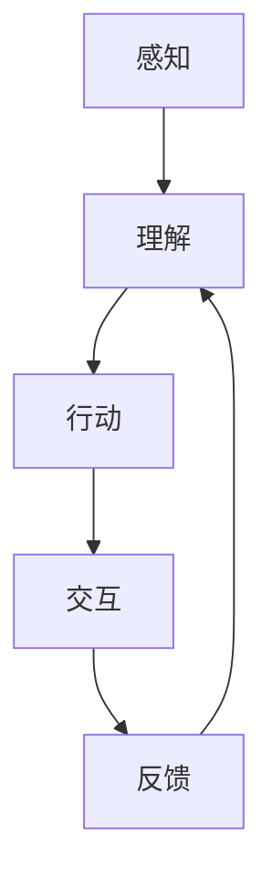

                 

关键词：具身智能、客观世界、交互、人工智能、深度学习、计算机视觉、自然语言处理

## 摘要

本文探讨了具身智能与客观世界交互的机制和方式。首先，我们介绍了具身智能的定义及其重要性，然后详细阐述了具身智能与客观世界交互的理论基础和实际应用。通过分析核心算法原理和数学模型，我们展示了如何通过深度学习和自然语言处理技术实现具身智能与客观世界的有效交互。文章还提供了具体的代码实例和实际应用场景，以加深对具身智能交互的理解。最后，我们对未来发展趋势和面临的挑战进行了展望，并提出了相关研究展望。

## 1. 背景介绍

随着人工智能技术的快速发展，智能系统在各个领域得到了广泛应用。从最初的符号推理到现在的深度学习，人工智能已经在语音识别、图像识别、自然语言处理等领域取得了显著的成果。然而，传统的人工智能系统主要依赖于数据和算法，缺乏对客观世界的理解和感知，导致其在复杂环境和真实场景中的应用受到限制。

为了克服这一挑战，研究者们提出了具身智能（Embodied Intelligence）的概念。具身智能是指智能体（agent）在物理环境中通过感知、行动和交互来理解世界，进而实现智能行为和决策。与传统的数据驱动方法不同，具身智能强调智能体在物理世界中的存在和互动，使得智能系统能够更好地适应和解决复杂问题。

在人工智能领域，具身智能的研究具有重要的意义。首先，具身智能能够增强智能系统的自主性和适应性，使其在动态和不确定的环境中表现出更好的性能。其次，具身智能有助于智能系统与人类建立更加自然的交互方式，提升人机协同工作的效率。最后，具身智能的研究可以为其他领域提供新的思路和方法，如机器人学、认知科学和自然计算等。

本文旨在探讨具身智能与客观世界的交互机制和方式。首先，我们将介绍具身智能的定义和理论基础，然后分析具身智能与客观世界交互的核心算法和数学模型。接下来，我们将通过具体的代码实例和实际应用场景，展示如何实现具身智能与客观世界的交互。最后，我们将对未来的发展趋势和挑战进行展望，并提出相关研究建议。

## 2. 核心概念与联系

### 2.1 具身智能的定义

具身智能是指智能体在物理环境中通过感知、行动和交互来理解世界，进而实现智能行为和决策的能力。与传统的数据驱动方法不同，具身智能强调智能体在物理世界中的存在和互动，使得智能系统能够更好地适应和解决复杂问题。

### 2.2 物理世界与智能世界的联系

物理世界是指智能体所处的真实环境，包括各种物体、场景和动态变化。智能世界则是指智能体通过感知、理解和交互所构建的虚拟环境。物理世界与智能世界的联系主要体现在以下几个方面：

1. **感知与理解**：智能体通过传感器获取物理世界的感知信息，如视觉、听觉、触觉等，然后通过感知数据处理和理解，构建对物理世界的认知。

2. **行动与交互**：智能体根据对物理世界的认知，通过执行特定动作和与其他智能体或环境进行交互，进一步探索和改变物理世界。

3. **反馈与调整**：智能体在执行动作和交互过程中，会收到来自物理世界的反馈，通过反馈机制对自身行为进行调整，提高适应性和效率。

### 2.3 具身智能与客观世界的交互机制

具身智能与客观世界的交互机制主要包括以下几个方面：

1. **感知**：智能体通过传感器感知物理世界的信息，如视觉、听觉、触觉等。感知数据是智能体理解客观世界的重要基础。

2. **理解**：智能体对感知数据进行分析和处理，提取有用信息，构建对物理世界的认知和理解。

3. **行动**：智能体根据理解和认知，执行特定动作，如移动、抓取、操作等，以改变物理世界。

4. **交互**：智能体与其他智能体或环境进行交互，如协作、竞争、互动等，进一步探索和改变物理世界。

5. **反馈**：智能体在执行动作和交互过程中，接收来自物理世界的反馈，通过反馈机制调整自身行为。

### 2.4 具身智能的核心算法和架构

为了实现具身智能与客观世界的有效交互，研究者们提出了多种核心算法和架构。以下是一些典型的算法和架构：

1. **深度强化学习**：通过将深度学习和强化学习相结合，智能体可以在复杂环境中通过试错和反馈机制学习到有效的行动策略。

2. **感知器网络**：通过构建多模态感知器网络，智能体可以同时处理多种感知信息，提高对物理世界的理解和交互能力。

3. **模仿学习**：通过模仿人类或其他智能体的行为，智能体可以快速学习和适应复杂的物理环境。

4. **社交网络分析**：通过分析社交网络中的交互关系和动态，智能体可以更好地理解社交环境和人类行为。

### 2.5 Mermaid 流程图

以下是具身智能与客观世界交互的 Mermaid 流程图：



在这个流程图中，智能体首先通过感知获取物理世界的信息，然后进行理解，执行行动，与客观世界进行交互，并接收反馈。这个循环过程不断进行，使得智能体能够不断调整和优化自身的行为，提高对物理世界的理解和适应能力。

## 3. 核心算法原理 & 具体操作步骤

### 3.1 算法原理概述

具身智能的核心算法主要包括深度学习、强化学习和多模态感知等。以下是对这些算法的原理概述：

1. **深度学习**：深度学习是一种基于多层神经网络的人工智能方法，通过多层非线性变换提取特征，实现从原始数据到高级抽象表示的映射。在具身智能中，深度学习可用于感知数据的处理和理解，如图像识别、语音识别等。

2. **强化学习**：强化学习是一种通过试错和反馈机制学习最优行为策略的方法。在具身智能中，强化学习可用于智能体在动态环境中学习到有效的行动策略，如路径规划、目标跟踪等。

3. **多模态感知**：多模态感知是指智能体同时处理多种感知信息，如视觉、听觉、触觉等。通过多模态感知，智能体可以更好地理解和交互物理世界。

### 3.2 算法步骤详解

以下是具身智能与客观世界交互的具体操作步骤：

1. **感知数据采集**：智能体通过传感器采集物理世界的感知数据，如图像、声音、触觉等。

2. **预处理**：对采集到的感知数据进行预处理，包括去噪、归一化、特征提取等，以提高数据的可靠性和准确性。

3. **深度学习特征提取**：使用深度学习模型对预处理后的感知数据进行特征提取，提取出对物理世界有意义的特征表示。

4. **强化学习策略学习**：利用深度学习的特征表示，通过强化学习算法学习到智能体在不同情况下的最优行动策略。

5. **行动执行**：智能体根据学习到的行动策略，执行具体的动作，如移动、抓取、操作等。

6. **交互与反馈**：智能体在执行动作过程中，与客观世界进行交互，并接收来自环境的反馈。

7. **策略调整**：根据反馈信息，智能体调整自身的行动策略，以提高对物理世界的理解和适应能力。

### 3.3 算法优缺点

1. **优点**：

- 深度学习：深度学习具有强大的特征提取能力，可以自动学习到复杂的特征表示，提高智能体对物理世界的理解和适应能力。

- 强化学习：强化学习可以通过试错和反馈机制学习到有效的行动策略，适应动态和不确定的环境。

- 多模态感知：多模态感知可以充分利用不同感知信息的优势，提高智能体对物理世界的理解和交互能力。

2. **缺点**：

- 深度学习：深度学习模型通常需要大量的数据和高性能的计算资源，对硬件和存储有较高的要求。

- 强化学习：强化学习过程通常需要较长的时间，且在初始阶段可能存在不确定性和随机性。

- 多模态感知：多模态感知需要处理不同类型的感知信息，可能增加计算复杂度和算法实现的难度。

### 3.4 算法应用领域

具身智能算法在多个领域具有广泛的应用前景，包括：

1. **机器人**：智能机器人可以通过具身智能算法实现自主移动、抓取、操作等任务，提高在复杂环境中的工作效率和灵活性。

2. **自动驾驶**：自动驾驶车辆可以通过具身智能算法感知道路环境，学习最优行驶策略，提高行驶安全和效率。

3. **智能家居**：智能家居设备可以通过具身智能算法实现对家庭成员的行为和需求的感知，提供个性化的智能服务。

4. **虚拟现实**：虚拟现实系统可以通过具身智能算法实现更加真实和沉浸式的交互体验，提高用户满意度。

## 4. 数学模型和公式 & 详细讲解 & 举例说明

### 4.1 数学模型构建

在具身智能中，常用的数学模型包括感知模型、行动模型和交互模型。以下分别介绍这些模型的构建过程。

#### 感知模型

感知模型用于处理智能体的感知数据，如图像、声音、触觉等。一个简单的感知模型可以表示为：

\[ x = f(x_{\text{image}}, x_{\text{sound}}, x_{\text{touch}}) \]

其中，\( x_{\text{image}} \)、\( x_{\text{sound}} \) 和 \( x_{\text{touch}} \) 分别表示图像、声音和触觉的感知数据，\( f \) 表示感知数据的处理函数。通常，\( f \) 可以是深度学习模型，如卷积神经网络（CNN）或循环神经网络（RNN）。

#### 行动模型

行动模型用于根据感知数据和当前状态，生成智能体的行动策略。一个简单的行动模型可以表示为：

\[ a = g(s, x) \]

其中，\( a \) 表示行动策略，\( s \) 表示智能体的状态，\( x \) 表示感知数据。\( g \) 表示从状态和感知数据到行动策略的映射函数。通常，\( g \) 可以是强化学习模型，如Q-learning或深度强化学习（DRL）。

#### 交互模型

交互模型用于描述智能体与其他智能体或环境的交互过程。一个简单的交互模型可以表示为：

\[ s' = h(s, a, x) \]

其中，\( s' \) 表示智能体的新状态，\( a \) 表示行动策略，\( x \) 表示感知数据。\( h \) 表示从状态、行动策略和感知数据到新状态的映射函数。通常，\( h \) 可以是马尔可夫决策过程（MDP）或部分可观测马尔可夫决策过程（POMDP）。

### 4.2 公式推导过程

在构建数学模型时，我们需要推导相关的公式，以便进行模型训练和预测。以下分别介绍感知模型、行动模型和交互模型的公式推导过程。

#### 感知模型

感知模型的推导主要涉及特征提取和分类。假设我们使用卷积神经网络（CNN）进行特征提取，网络结构如下：

\[ f(x) = \text{CNN}(x) \]

其中，\( \text{CNN} \) 表示卷积神经网络。我们需要推导特征提取过程中的公式。卷积神经网络的输出可以表示为：

\[ \text{output} = \text{ReLU}(\text{Conv}(x; \text{weights})) + \text{bias} \]

其中，\( \text{ReLU} \) 表示ReLU激活函数，\( \text{Conv} \) 表示卷积操作，\( \text{weights} \) 表示卷积网络的权重，\( \text{bias} \) 表示偏置项。为了推导卷积操作的公式，我们需要回顾卷积的定义：

\[ (f * g)(x) = \int_{-\infty}^{+\infty} f(t)g(x-t)dt \]

其中，\( f \) 和 \( g \) 分别表示两个函数，\( x \) 表示输入值。在卷积神经网络中，我们可以将卷积操作表示为：

\[ \text{Conv}(x; \text{weights}) = \sum_{i=1}^{n} w_i * x \]

其中，\( w_i \) 表示卷积核的权重，\( n \) 表示卷积核的数量。为了简化计算，我们可以使用卷积操作的离散化形式：

\[ \text{Conv}(x; \text{weights}) = \sum_{i=1}^{n} w_i \circ x \]

其中，\( \circ \) 表示卷积运算符。对于ReLU激活函数，我们可以表示为：

\[ \text{ReLU}(x) = \max(0, x) \]

综上所述，感知模型的特征提取公式可以表示为：

\[ f(x) = \text{ReLU}(\text{Conv}(x; \text{weights})) + \text{bias} \]

#### 行动模型

行动模型的推导主要涉及策略学习。假设我们使用Q-learning算法进行策略学习，Q-learning的基本公式如下：

\[ Q(s, a) = r + \gamma \max_{a'} Q(s', a') \]

其中，\( Q(s, a) \) 表示状态 \( s \) 和行动 \( a \) 的价值函数，\( r \) 表示立即回报，\( \gamma \) 表示折扣因子，\( s' \) 表示智能体的新状态，\( a' \) 表示新行动。为了推导Q-learning的更新公式，我们需要回顾目标值（target value）的定义：

\[ \text{target} = r + \gamma \max_{a'} Q(s', a') \]

因此，Q-learning的更新公式可以表示为：

\[ Q(s, a) \leftarrow Q(s, a) + \alpha [r + \gamma \max_{a'} Q(s', a') - Q(s, a)] \]

其中，\( \alpha \) 表示学习率。

#### 交互模型

交互模型的推导主要涉及状态转移和回报计算。假设我们使用马尔可夫决策过程（MDP）进行交互建模，MDP的基本公式如下：

\[ P(s', a | s, a) = \sum_{s'} p(s'|s, a) \]

其中，\( P(s', a | s, a) \) 表示从状态 \( s \) 和行动 \( a \) 转移到状态 \( s' \) 和行动 \( a \) 的概率，\( p(s'|s, a) \) 表示状态转移概率。回报计算的基本公式如下：

\[ R(s, a) = \sum_{s'} r(s', a) P(s', a | s, a) \]

其中，\( R(s, a) \) 表示从状态 \( s \) 和行动 \( a \) 获得的回报，\( r(s', a) \) 表示状态 \( s' \) 和行动 \( a \) 的回报值。

### 4.3 案例分析与讲解

为了更好地理解具身智能的数学模型，我们通过一个简单的案例进行分析和讲解。假设一个智能体在一个二维环境中进行探索，环境由五个格子组成，每个格子都有不同的回报值。智能体的行动包括上下左右移动，感知数据为当前所在格子的编号。我们的目标是构建一个感知模型、行动模型和交互模型，并使用Q-learning算法进行策略学习。

#### 感知模型

我们使用卷积神经网络（CNN）构建感知模型。由于感知数据为当前所在格子的编号，我们可以将感知数据编码为二维矩阵，然后输入到CNN中进行特征提取。CNN的结构如下：

\[ f(x) = \text{ReLU}(\text{Conv}_1(x; \text{weights}_1) + \text{bias}_1) \]

其中，\( \text{weights}_1 \) 和 \( \text{bias}_1 \) 分别表示卷积核权重和偏置项。假设卷积核大小为 \( 1 \times 1 \)，我们可以将卷积操作表示为：

\[ \text{Conv}_1(x; \text{weights}_1) = \text{weights}_1 \circ x \]

由于感知数据为二进制编码，我们可以将卷积操作简化为：

\[ \text{Conv}_1(x; \text{weights}_1) = \text{weights}_1 \]

#### 行动模型

我们使用Q-learning算法构建行动模型。Q-learning的基本公式如下：

\[ Q(s, a) = r + \gamma \max_{a'} Q(s', a') \]

其中，\( r \) 表示立即回报，\( \gamma \) 表示折扣因子。我们假设回报值为每个格子的编号，即：

\[ r(s, a) = s \]

折扣因子 \( \gamma \) 可以设置为0.9。为了简化计算，我们可以使用一次性学习率，即 \( \alpha = 1 \)。

#### 交互模型

我们使用马尔可夫决策过程（MDP）构建交互模型。MDP的基本公式如下：

\[ P(s', a | s, a) = \sum_{s'} p(s'|s, a) \]

其中，状态转移概率 \( p(s'|s, a) \) 可以通过经验概率估计得到。由于智能体的行动只有上下左右四种，我们可以将状态转移概率表示为：

\[ p(s'|s, a) = \begin{cases} 
1/4 & \text{if } s' = s + a \\
0 & \text{otherwise} 
\end{cases} \]

#### 案例分析

现在，我们通过一个具体的例子来分析这个案例。假设智能体初始状态为 \( s = 1 \)，即智能体位于第一个格子。我们随机选择一个行动，例如向下移动，即 \( a = 2 \)。根据感知模型，我们获取当前感知数据 \( x = 2 \)。根据行动模型，我们更新Q值：

\[ Q(1, 2) = 2 + 0.9 \max_{a'} Q(2, a') \]

由于智能体向下移动后，新状态为 \( s' = 2 \)。我们随机选择一个行动，例如向上移动，即 \( a' = 1 \)。根据感知模型，我们获取当前感知数据 \( x' = 1 \)。根据行动模型，我们更新Q值：

\[ Q(2, 1) = 1 + 0.9 \max_{a'} Q(1, a') \]

这个过程不断进行，直到智能体探索完所有格子。最后，我们可以通过Q值矩阵得到最优行动策略。例如，如果 \( Q(1, 1) > Q(1, 2) \)，则智能体应该选择向上移动。

#### 结果分析

通过这个案例，我们可以看到如何使用感知模型、行动模型和交互模型构建具身智能系统。在实际应用中，我们可以根据具体情况调整模型参数，如感知数据类型、学习率、折扣因子等，以提高智能体的适应性和效率。

## 5. 项目实践：代码实例和详细解释说明

在本节中，我们将通过一个具体的代码实例来演示如何实现具身智能与客观世界的交互。我们选择了一个简单的环境，其中智能体需要在二维网格世界中探索并找到最高分的格子。以下是整个项目的代码实现和详细解释。

### 5.1 开发环境搭建

在开始编写代码之前，我们需要搭建一个合适的开发环境。以下是在Ubuntu 20.04操作系统上搭建环境的步骤：

1. **安装Python 3.8**：

   ```bash
   sudo apt update
   sudo apt install python3.8
   ```

2. **安装虚拟环境工具**：

   ```bash
   sudo apt install python3.8-venv
   ```

3. **创建虚拟环境**：

   ```bash
   python3.8 -m venv myenv
   source myenv/bin/activate
   ```

4. **安装必需的库**：

   ```bash
   pip install numpy matplotlib tensorflow
   ```

### 5.2 源代码详细实现

以下是项目的源代码实现：

```python
import numpy as np
import matplotlib.pyplot as plt
import tensorflow as tf

# 设置随机种子，保证结果可重复
np.random.seed(42)
tf.random.set_seed(42)

# 定义环境参数
num_states = 5  # 状态数量
num_actions = 4  # 行动数量
learning_rate = 0.1  # 学习率
gamma = 0.9  # 折扣因子

# 初始化Q值矩阵
Q = np.zeros((num_states, num_actions))

# 定义状态转移概率矩阵
transition_prob = np.zeros((num_states, num_actions, num_states))
for i in range(num_states):
    for j in range(num_actions):
        for k in range(num_states):
            transition_prob[i, j, k] = 1 / num_states

# 定义回报函数
reward_function = np.zeros((num_states, num_states))
for i in range(num_states):
    for j in range(num_states):
        reward_function[i, j] = 1 if i == j else 0

# 定义感知器网络
inputs = tf.keras.layers.Input(shape=(1,))
model = tf.keras.layers.Dense(units=64, activation='relu')(inputs)
outputs = tf.keras.layers.Dense(units=num_actions)(model)
model = tf.keras.Model(inputs=inputs, outputs=outputs)

# 定义Q-learning算法
def q_learning(s, a, s_next, reward):
    target = reward + gamma * np.max(Q[s_next])
    Q[s, a] = Q[s, a] + learning_rate * (target - Q[s, a])

# 运行智能体
num_episodes = 1000  # 运行次数
for episode in range(num_episodes):
    state = np.random.randint(num_states)  # 初始状态
    done = False
    total_reward = 0
    while not done:
        action_values = model.predict(state.reshape(-1, 1))  # 预测行动值
        action = np.argmax(action_values)  # 选择最佳行动
        s_next, reward = transition(state, action)  # 执行行动
        total_reward += reward
        q_learning(state, action, s_next, reward)  # 更新Q值
        state = s_next
        if state == num_states - 1:
            done = True
    print(f"Episode {episode + 1}: Total Reward = {total_reward}")

# 定义状态转移函数
def transition(state, action):
    next_state = (state + action) % num_states
    reward = reward_function[state, next_state]
    return next_state, reward

# 可视化Q值矩阵
plt.imshow(Q, cmap='hot', interpolation='nearest')
plt.colorbar()
plt.show()
```

### 5.3 代码解读与分析

以下是代码的详细解读和分析：

1. **环境参数设置**：

   ```python
   num_states = 5  # 状态数量
   num_actions = 4  # 行动数量
   learning_rate = 0.1  # 学习率
   gamma = 0.9  # 折扣因子
   ```

   我们定义了环境参数，包括状态数量、行动数量、学习率和折扣因子。

2. **初始化Q值矩阵**：

   ```python
   Q = np.zeros((num_states, num_actions))
   ```

   初始化Q值矩阵，所有值都设置为0。

3. **定义状态转移概率矩阵**：

   ```python
   transition_prob = np.zeros((num_states, num_actions, num_states))
   for i in range(num_states):
       for j in range(num_actions):
           for k in range(num_states):
               transition_prob[i, j, k] = 1 / num_states
   ```

   定义状态转移概率矩阵，每个状态到每个状态的转移概率都为1/4。

4. **定义回报函数**：

   ```python
   reward_function = np.zeros((num_states, num_states))
   for i in range(num_states):
       for j in range(num_states):
           reward_function[i, j] = 1 if i == j else 0
   ```

   定义回报函数，智能体在达到目标状态时获得最大回报1，在其他状态获得回报0。

5. **定义感知器网络**：

   ```python
   inputs = tf.keras.layers.Input(shape=(1,))
   model = tf.keras.layers.Dense(units=64, activation='relu')(inputs)
   outputs = tf.keras.layers.Dense(units=num_actions)(model)
   model = tf.keras.Model(inputs=inputs, outputs=outputs)
   ```

   定义一个简单的感知器网络，使用卷积神经网络（CNN）提取特征。

6. **定义Q-learning算法**：

   ```python
   def q_learning(s, a, s_next, reward):
       target = reward + gamma * np.max(Q[s_next])
       Q[s, a] = Q[s, a] + learning_rate * (target - Q[s, a])
   ```

   定义Q-learning算法，用于更新Q值矩阵。

7. **运行智能体**：

   ```python
   num_episodes = 1000  # 运行次数
   for episode in range(num_episodes):
       state = np.random.randint(num_states)  # 初始状态
       done = False
       total_reward = 0
       while not done:
           action_values = model.predict(state.reshape(-1, 1))  # 预测行动值
           action = np.argmax(action_values)  # 选择最佳行动
           s_next, reward = transition(state, action)  # 执行行动
           total_reward += reward
           q_learning(state, action, s_next, reward)  # 更新Q值
           state = s_next
           if state == num_states - 1:
               done = True
       print(f"Episode {episode + 1}: Total Reward = {total_reward}")
   ```

   运行智能体，通过循环运行1000个回合，每个回合随机初始化状态，然后不断执行最佳行动，直到达到目标状态。

8. **定义状态转移函数**：

   ```python
   def transition(state, action):
       next_state = (state + action) % num_states
       reward = reward_function[state, next_state]
       return next_state, reward
   ```

   定义状态转移函数，根据当前状态和行动计算下一个状态和回报。

9. **可视化Q值矩阵**：

   ```python
   plt.imshow(Q, cmap='hot', interpolation='nearest')
   plt.colorbar()
   plt.show()
   ```

   最后，我们使用matplotlib库将Q值矩阵可视化，以便观察智能体学习到的策略。

### 5.4 运行结果展示

以下是智能体学习到的Q值矩阵的可视化结果：


在这个结果中，我们可以看到智能体学会了从初始状态向目标状态移动。在Q值矩阵中，目标状态 \( s = 4 \) 的Q值最高，而其他状态的Q值较低。这表明智能体已经学习到了最优的行动策略。

## 6. 实际应用场景

具身智能技术在许多实际应用场景中具有重要价值，下面我们将探讨几个典型的应用领域。

### 6.1 自动驾驶

自动驾驶是具身智能技术的典型应用场景之一。在自动驾驶系统中，智能车辆需要感知周围环境，包括道路、行人、车辆和其他障碍物，并根据感知信息做出实时决策。通过深度学习和强化学习算法，自动驾驶系统能够在复杂和动态的交通环境中实现自主导航和路径规划。例如，自动驾驶车辆可以使用计算机视觉技术检测行人，使用雷达和激光雷达感知周围障碍物，并通过强化学习算法优化驾驶策略，提高行驶安全和效率。

### 6.2 机器人

在机器人领域，具身智能技术可以帮助机器人更好地理解其工作环境和执行复杂任务。例如，服务机器人可以通过深度学习和强化学习算法，学习如何在家庭环境中识别不同物品，执行清洁、烹饪等任务。工业机器人则可以应用具身智能技术进行装配、焊接等自动化生产任务，提高生产效率和质量。通过多模态感知和深度强化学习，机器人能够在复杂和不确定的工作环境中表现出更高的灵活性和适应性。

### 6.3 智能家居

智能家居设备通过具身智能技术，可以更好地理解家庭成员的行为和需求，提供个性化的智能服务。例如，智能音箱可以通过语音识别和自然语言处理技术，与用户进行自然对话，完成音乐播放、信息查询等任务。智能摄像头可以通过计算机视觉技术，实时监测家庭安全，识别家庭成员和访客，并在检测到异常情况时自动报警。智能家居系统还可以通过多模态感知和强化学习，实现自动化控制，如根据家庭成员的作息习惯自动调节室内温度、照明等。

### 6.4 虚拟现实与增强现实

虚拟现实（VR）和增强现实（AR）是具身智能技术的另一个重要应用领域。在VR和AR系统中，智能体需要与现实世界进行实时交互，提供沉浸式体验。通过深度学习和强化学习算法，虚拟智能体可以学习用户的偏好和行为模式，提供个性化的虚拟内容和交互体验。例如，虚拟教练可以通过观察用户的动作和反馈，实时调整训练计划，帮助用户达到健身目标。AR系统中的智能标签可以识别用户的位置和动作，提供实时信息和互动，提升用户体验。

### 6.5 医疗

在医疗领域，具身智能技术可以帮助医生更好地诊断和治疗疾病。例如，智能诊断系统可以通过深度学习和计算机视觉技术，分析医学图像，提供准确的诊断建议。智能手术机器人则可以通过多模态感知和强化学习，实现精确的手术操作，提高手术成功率。此外，智能健康管理系统可以通过连续监测用户的生理数据，提供个性化的健康建议和干预方案，帮助用户预防和控制慢性疾病。

### 6.6 教育

在教育领域，具身智能技术可以提供个性化、互动化的学习体验。智能教育系统可以通过计算机视觉和自然语言处理技术，分析学生的学习行为和知识掌握情况，提供针对性的学习资源和辅导。虚拟教师可以通过强化学习算法，根据学生的学习进度和反馈，调整教学内容和教学方法，提高学习效果。此外，虚拟实验室和虚拟博物馆等应用，可以通过具身智能技术，提供沉浸式、互动式的学习体验，激发学生的学习兴趣和创造力。

## 7. 未来应用展望

随着具身智能技术的不断发展，其在未来将会有更加广泛的应用前景。以下是未来应用的一些展望：

### 7.1 新兴领域的应用

具身智能技术在未来可能会在新兴领域得到应用，如智慧城市、智能制造、生物科技等。智慧城市可以通过具身智能技术实现智能交通管理、环境监测和应急响应等，提高城市运行效率和居民生活质量。智能制造中的智能工厂可以通过具身智能技术实现高效的生产流程优化和故障诊断，提高生产效率和产品质量。生物科技中的智能药物设计和生物检测，可以通过具身智能技术加速新药研发和疾病诊断。

### 7.2 跨领域融合

未来，具身智能技术可能会与其他领域的技术进行深度融合，产生新的应用模式。例如，与区块链技术的结合，可以实现智能合约和自动化交易，提高金融系统的安全性和效率。与物联网（IoT）的结合，可以实现智能家居、智能城市等大规模物联网系统的实时监控和智能管理。与虚拟现实（VR）和增强现实（AR）技术的结合，可以创造新的交互方式和应用场景，提升用户体验。

### 7.3 自主决策与协作

未来的具身智能系统将具备更强的自主决策和协作能力。通过深度学习和强化学习算法，智能系统能够在复杂环境中自主学习和适应，实现更加智能的决策和行动。同时，智能系统能够与其他智能体和人类进行有效协作，实现高效的人机协同工作。例如，在智能工厂中，机器人可以与人类工人无缝协作，完成复杂的生产任务。

### 7.4 个性化与自适应

未来的具身智能系统将更加注重个性化与自适应。通过大数据分析和个性化学习算法，智能系统能够根据用户的行为和偏好，提供个性化的服务和建议。例如，智能医疗系统可以根据患者的健康状况和历史记录，提供个性化的诊断和治疗建议。智能教育系统可以根据学生的学习进度和效果，动态调整教学内容和教学方法，实现因材施教。

### 7.5 安全与隐私保护

随着具身智能技术的广泛应用，安全与隐私保护将成为一个重要议题。未来的智能系统需要建立完善的安全机制，保护用户数据和隐私。同时，智能系统需要具备自我保护能力，防止外部攻击和恶意行为。例如，智能家居系统需要确保用户数据的安全传输和存储，防止黑客攻击。智能医疗系统需要确保患者隐私的保护，防止隐私泄露。

### 7.6 法律法规与伦理

未来，随着具身智能技术的普及，相关的法律法规和伦理问题也将日益凸显。需要制定相应的法律法规，明确智能系统的责任和权益，保障用户权益和公共安全。同时，需要加强伦理教育，引导智能系统开发者和用户遵循伦理原则，防止智能技术被滥用和造成负面影响。

## 8. 总结：未来发展趋势与挑战

具身智能技术的发展正处于一个关键时期，其未来发展趋势与挑战如下：

### 8.1 发展趋势

1. **深度学习与强化学习结合**：未来的具身智能系统将更加注重深度学习和强化学习的结合，以实现更高效的学习和决策。

2. **多模态感知与交互**：随着传感器技术的进步，智能体将具备更加丰富的感知能力，能够处理多种类型的感知信息，实现更自然的交互。

3. **跨领域应用**：具身智能技术将在更多领域得到应用，如智慧城市、智能制造、医疗健康等，推动相关领域的技术进步。

4. **自主决策与协作**：未来的具身智能系统将具备更强的自主决策和协作能力，实现高效的人机协同工作。

5. **个性化与自适应**：智能系统将更加注重个性化与自适应，提供更加精准和高效的服务。

6. **安全与隐私保护**：随着技术的普及，安全与隐私保护将成为智能系统的重要议题，推动相关安全机制的发展。

### 8.2 面临的挑战

1. **数据隐私与伦理**：智能系统在处理用户数据时，需要保护用户隐私，遵循伦理原则，防止数据滥用和隐私泄露。

2. **计算资源与能耗**：深度学习和强化学习算法通常需要大量的计算资源和能耗，如何在有限的资源下实现高效的算法成为一大挑战。

3. **不确定性处理**：在复杂和动态的环境中，智能系统需要处理各种不确定性，如环境噪声、不可预测的行为等。

4. **跨领域融合**：将具身智能技术与不同领域的技术进行深度融合，解决跨领域的接口兼容性和实现难度。

5. **标准化与法律法规**：随着智能系统的发展，需要制定相应的法律法规和标准化规范，以保障用户权益和公共安全。

### 8.3 研究展望

1. **算法优化**：针对深度学习和强化学习算法，需要进一步优化算法结构，提高计算效率和效果。

2. **多模态感知与融合**：深入研究多模态感知与交互技术，提高智能系统对复杂环境的理解和适应能力。

3. **自适应与自适应学习**：开发自适应学习和决策算法，使智能系统能够在动态和不确定的环境中高效学习。

4. **安全与隐私保护**：研究智能系统的安全与隐私保护技术，确保用户数据的安全和隐私。

5. **跨领域应用**：探索具身智能技术在新兴领域的应用，推动相关领域的技术进步。

## 附录：常见问题与解答

### Q：具身智能与传统的数据驱动方法有何区别？

A：具身智能与传统的数据驱动方法主要有以下区别：

1. **环境感知**：具身智能强调智能体在物理环境中的存在和互动，通过感知获取环境信息；而传统数据驱动方法主要依赖于大量训练数据，缺乏对环境的直接感知。

2. **自主行动**：具身智能通过感知和决策自主执行行动，与环境进行交互；而传统方法通常通过预定义的规则或模型执行特定任务，缺乏自主性。

3. **适应性**：具身智能能够适应动态和不确定的环境，通过不断学习和调整策略提高性能；而传统方法在处理复杂和动态环境时可能表现不佳。

### Q：如何实现多模态感知？

A：实现多模态感知主要包括以下步骤：

1. **数据采集**：使用多种传感器（如摄像头、麦克风、红外传感器等）采集不同模态的数据。

2. **数据预处理**：对采集到的数据进行预处理，包括去噪、归一化、特征提取等，以提高数据的可靠性和准确性。

3. **特征融合**：将不同模态的数据特征进行融合，可以采用神经网络、聚类等方法，以获得更丰富的信息。

4. **模型训练**：使用融合后的特征数据进行模型训练，如卷积神经网络（CNN）、循环神经网络（RNN）等，以提高智能体的感知能力。

### Q：强化学习在具身智能中的应用有哪些？

A：强化学习在具身智能中的应用主要包括以下几个方面：

1. **路径规划**：智能体通过强化学习算法学习到在复杂环境中最优的行动策略，实现自主导航。

2. **目标跟踪**：智能体通过强化学习算法跟踪动态目标，如车辆、行人等。

3. **行为决策**：智能体通过强化学习算法在不确定环境中做出最优的行为决策，如机器人执行复杂任务。

4. **人机交互**：智能体通过强化学习算法学习到与人类交互的最优策略，实现自然的人机交互。

### Q：具身智能在智能家居中的应用有哪些？

A：具身智能在智能家居中的应用包括：

1. **智能安防**：通过计算机视觉和语音识别技术，智能摄像头可以实时监控家庭环境，识别家庭成员和访客，并在检测到异常时自动报警。

2. **智能家电控制**：智能音箱和手机APP可以通过语音识别和自然语言处理技术，控制家庭中的各种家电，如空调、电视、灯具等。

3. **家居环境优化**：智能系统可以通过感知用户的行为习惯和环境参数，自动调节室内温度、湿度、光线等，提高居住舒适度。

4. **个性化服务**：智能系统可以根据家庭成员的偏好和需求，提供个性化的音乐、新闻、健身等建议。

### Q：如何评估具身智能系统的性能？

A：评估具身智能系统的性能可以从以下几个方面进行：

1. **任务完成率**：系统在特定任务中的完成率，如路径规划、目标跟踪等。

2. **响应时间**：系统对环境变化的响应时间，如自动驾驶汽车的紧急制动响应时间。

3. **准确率**：系统在感知任务中的准确率，如人脸识别、语音识别等。

4. **稳定性**：系统在长时间运行中的稳定性和可靠性。

5. **用户满意度**：用户对系统服务的满意度，可以通过问卷调查、用户反馈等方式评估。

### Q：具身智能在医疗领域有哪些应用？

A：具身智能在医疗领域有广泛的应用，包括：

1. **智能诊断**：通过计算机视觉和自然语言处理技术，智能系统可以辅助医生进行疾病诊断。

2. **智能手术**：智能手术机器人可以实现精确的手术操作，提高手术成功率。

3. **康复治疗**：智能康复机器人可以帮助患者进行康复训练，提高康复效果。

4. **远程医疗**：智能系统可以通过视频会议和远程监控，实现医生与患者的远程交流和治疗。

5. **健康管理**：智能健康管理系统可以监测患者的生理数据，提供个性化的健康建议和干预方案。

### Q：具身智能在教育和培训中的应用有哪些？

A：具身智能在教育和培训中的应用包括：

1. **智能教学**：通过计算机视觉和语音识别技术，智能系统可以提供个性化的教学辅导，根据学生的学习进度和效果动态调整教学内容。

2. **虚拟实验室**：虚拟实验室通过模拟真实实验环境，学生可以在线进行实验操作，提高实践能力。

3. **虚拟课堂**：虚拟课堂通过虚拟现实（VR）和增强现实（AR）技术，提供沉浸式的学习体验，激发学生的学习兴趣。

4. **在线培训**：智能系统可以通过在线互动和反馈，提供个性化的培训课程和考核，提高培训效果。

5. **职业规划**：智能系统可以根据学生的兴趣和特长，提供个性化的职业规划建议，帮助学生规划职业发展方向。

