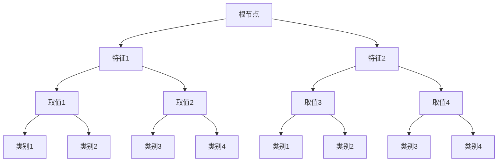

                 

关键词：决策树，分类算法，信息增益，熵，决策树构建，机器学习，决策树剪枝，应用场景

> 摘要：本文将深入探讨决策树这一经典的机器学习算法。我们将从其基本概念开始，逐步讲解其核心算法原理、数学模型、应用领域以及未来发展趋势。通过具体的实例和代码实现，读者将全面了解决策树的构建和使用方法。最后，我们将对决策树在实际应用中的挑战和未来发展进行展望。

## 1. 背景介绍

决策树（Decision Tree）是一种在机器学习和数据挖掘中广泛应用的基本算法。它通过一系列规则或测试将数据集中的每个样本分配到一个特定的类别或标签。决策树的形成过程实际上是一种递归的二分划分过程，它从根节点开始，根据特征的不同取值，逐层向下划分，直到达到叶节点，每个叶节点代表一个具体的类别。

决策树之所以被广泛采用，主要有以下几个原因：

1. **直观性**：决策树的图形表示直观易懂，易于理解和解释。
2. **解释性**：决策树的构建过程清晰，每一步都有明确的依据。
3. **易实现**：相比于其他复杂算法，决策树的实现相对简单，计算效率较高。

在数据挖掘和机器学习的各个领域中，决策树的应用非常广泛。例如，在分类任务中，它可以用于垃圾邮件过滤、客户分类、信用评分等；在回归任务中，它可以用于预测房价、股票价格等。

## 2. 核心概念与联系

### 2.1 决策树的基本概念

决策树由以下几部分组成：

1. **根节点**：代表整个数据集。
2. **内部节点**：表示某个特征的不同取值。
3. **叶节点**：表示最终预测的类别。

决策树的构建过程如下：

1. **选择最优划分特征**：通过计算信息增益、基尼不纯度等指标，选择具有最大划分能力的特征。
2. **递归划分**：根据选定的特征，将数据集划分为子集，并在子集上重复上述过程，直到达到某个停止条件。
3. **构建叶节点**：当数据集无法进一步划分时，将其划分为一个叶节点，并赋予一个类别标签。

### 2.2 决策树与信息论的联系

决策树的核心在于如何选择最优的特征进行划分。而这一过程实际上是基于信息论中的概念，特别是信息增益（Information Gain）和熵（Entropy）。

1. **熵**：熵是衡量一个随机变量不确定性的指标，它表示随机变量的信息量。在决策树中，熵用于衡量数据集的不纯度。
2. **信息增益**：信息增益是衡量一个特征划分数据集的能力的指标，它表示通过划分减少的数据集的不纯度。信息增益越大，特征对划分的作用越显著。

### 2.3 决策树与 Mermaid 流程图

为了更直观地理解决策树的构建过程，我们可以使用 Mermaid 流程图来表示。以下是一个简单的决策树构建过程的 Mermaid 表示：



## 3. 核心算法原理 & 具体操作步骤

### 3.1 算法原理概述

决策树的构建过程可以分为以下几个步骤：

1. **选择最优划分特征**：通过计算各个特征的信息增益，选择具有最大信息增益的特征进行划分。
2. **递归划分**：根据选定的特征，将数据集划分为多个子集，并在每个子集上递归构建决策树。
3. **构建叶节点**：当数据集无法进一步划分时，将其划分为一个叶节点，并赋予一个类别标签。

### 3.2 算法步骤详解

1. **选择最优划分特征**：

    - **计算信息增益**：对于每个特征，计算其在当前数据集上的信息增益。

    ```latex
    IG(\text{特征}) = H(\text{数据集}) - \sum_{\text{取值}} p(\text{取值}) \cdot H(\text{取值})
    ```

    - **选择最大信息增益的特征**：选择具有最大信息增益的特征进行划分。

2. **递归划分**：

    - **划分数据集**：根据选定的特征，将数据集划分为多个子集。

    - **递归构建决策树**：对于每个子集，递归执行上述步骤，直到达到某个停止条件。

3. **构建叶节点**：

    - **当数据集无法进一步划分时**：将其划分为一个叶节点，并赋予一个类别标签。

### 3.3 算法优缺点

#### 优点

1. **易于理解和解释**：决策树的图形表示直观易懂，易于理解和解释。
2. **计算效率较高**：相比于其他复杂算法，决策树的实现相对简单，计算效率较高。
3. **适用于各种类型的特征**：决策树可以处理数值型和类别型特征。

#### 缺点

1. **易过拟合**：决策树容易受到训练数据的影响，导致过拟合。
2. **难以处理非线性关系**：决策树只能处理线性或近似线性关系。

### 3.4 算法应用领域

决策树在以下领域有广泛的应用：

1. **分类任务**：用于分类任务，如垃圾邮件过滤、客户分类、信用评分等。
2. **回归任务**：用于回归任务，如预测房价、股票价格等。
3. **特征选择**：用于特征选择，帮助识别最重要的特征。

## 4. 数学模型和公式 & 详细讲解 & 举例说明

### 4.1 数学模型构建

决策树的构建过程可以通过以下数学模型来描述：

1. **熵**：

    ```latex
    H(X) = -\sum_{x \in X} p(x) \cdot \log_2 p(x)
    ```

    其中，$X$ 是特征空间，$p(x)$ 是特征 $x$ 的概率。

2. **信息增益**：

    ```latex
    IG(X, A) = H(X) - \sum_{a \in A} p(a) \cdot H(X|A=a)
    ```

    其中，$X$ 是特征空间，$A$ 是特征集合，$p(a)$ 是特征 $a$ 的概率，$H(X|A=a)$ 是在特征 $A=a$ 下的条件熵。

### 4.2 公式推导过程

1. **熵**：

    熵的推导基于概率论的基本概念。设 $X$ 是一个随机变量，其取值为 $x_1, x_2, ..., x_n$，对应的概率为 $p_1, p_2, ..., p_n$。根据熵的定义，我们有：

    ```latex
    H(X) = -\sum_{i=1}^{n} p_i \cdot \log_2 p_i
    ```

    通过概率的加法定理，我们可以将上述公式转化为：

    ```latex
    H(X) = -\sum_{i=1}^{n} p_i \cdot \log_2 \left( \sum_{j=1}^{n} p_j \right)
    ```

    由于 $\log_2 \left( \sum_{j=1}^{n} p_j \right) = 0$，因此，上述公式可以进一步简化为：

    ```latex
    H(X) = -\sum_{i=1}^{n} p_i \cdot \log_2 p_i
    ```

2. **信息增益**：

    信息增益的推导基于熵的概念。设 $X$ 是一个随机变量，$A$ 是一个特征集合，$p(a)$ 是特征 $a$ 的概率，$H(X|A=a)$ 是在特征 $A=a$ 下的条件熵。根据熵的定义，我们有：

    ```latex
    IG(X, A) = H(X) - \sum_{a \in A} p(a) \cdot H(X|A=a)
    ```

    通过条件熵的推导，我们可以得到：

    ```latex
    H(X|A=a) = \sum_{x \in X} p(x|A=a) \cdot \log_2 p(x|A=a)
    ```

    将上述公式代入信息增益的定义中，我们可以得到：

    ```latex
    IG(X, A) = H(X) - \sum_{a \in A} p(a) \cdot \sum_{x \in X} p(x|A=a) \cdot \log_2 p(x|A=a)
    ```

### 4.3 案例分析与讲解

假设我们有一个包含两个特征 $A$ 和 $B$ 的数据集，其中 $A$ 是类别型特征，$B$ 是数值型特征。数据集的分布如下：

| A | B |  
| --- | --- |  
| A1 | 1 |  
| A1 | 2 |  
| A1 | 3 |  
| A2 | 4 |  
| A2 | 5 |

我们需要选择一个最优特征进行划分。根据信息增益的定义，我们可以计算每个特征的信息增益：

```latex
IG(A, B) = H(\text{数据集}) - \sum_{a \in A} p(a) \cdot H(\text{数据集}|A=a)
```

计算结果如下：

```latex
IG(A, B) = H(\text{数据集}) - \left( p(A1) \cdot H(\text{数据集}|A=A1) + p(A2) \cdot H(\text{数据集}|A=A2) \right)
```

```latex
IG(A, B) = 1 - \left( \frac{3}{5} \cdot 0 + \frac{2}{5} \cdot 1 \right)
```

```latex
IG(A, B) = 1 - \frac{2}{5} = \frac{3}{5}
```

由于 $IG(A, B) > 0$，我们可以选择特征 $A$ 进行划分。

## 5. 项目实践：代码实例和详细解释说明

### 5.1 开发环境搭建

在编写决策树的代码之前，我们需要搭建一个合适的开发环境。这里，我们使用 Python 作为编程语言，并结合 Scikit-learn 库来简化决策树的实现。

1. 安装 Python：从 [Python 官网](https://www.python.org/downloads/) 下载并安装最新版本的 Python。
2. 安装 Scikit-learn：在终端或命令行中执行以下命令：

    ```bash
    pip install scikit-learn
    ```

### 5.2 源代码详细实现

以下是决策树的源代码实现：

```python
from sklearn.datasets import load_iris
from sklearn.model_selection import train_test_split
from sklearn.tree import DecisionTreeClassifier
from sklearn.metrics import accuracy_score

# 加载数据集
iris = load_iris()
X = iris.data
y = iris.target

# 划分训练集和测试集
X_train, X_test, y_train, y_test = train_test_split(X, y, test_size=0.2, random_state=42)

# 构建决策树模型
clf = DecisionTreeClassifier()

# 训练模型
clf.fit(X_train, y_train)

# 预测测试集
y_pred = clf.predict(X_test)

# 计算准确率
accuracy = accuracy_score(y_test, y_pred)
print("准确率：", accuracy)
```

### 5.3 代码解读与分析

1. **加载数据集**：

    ```python
    iris = load_iris()
    X = iris.data
    y = iris.target
    ```

    这里我们使用 Scikit-learn 内置的 Iris 数据集。Iris 数据集包含三个特征：花萼长度、花萼宽度和花瓣长度。

2. **划分训练集和测试集**：

    ```python
    X_train, X_test, y_train, y_test = train_test_split(X, y, test_size=0.2, random_state=42)
    ```

    我们将数据集划分为训练集和测试集，其中训练集占比 80%，测试集占比 20%。

3. **构建决策树模型**：

    ```python
    clf = DecisionTreeClassifier()
    ```

    这里我们创建一个决策树分类器对象。

4. **训练模型**：

    ```python
    clf.fit(X_train, y_train)
    ```

    使用训练集数据对决策树模型进行训练。

5. **预测测试集**：

    ```python
    y_pred = clf.predict(X_test)
    ```

    使用训练好的模型对测试集数据进行预测。

6. **计算准确率**：

    ```python
    accuracy = accuracy_score(y_test, y_pred)
    print("准确率：", accuracy)
    ```

    计算预测结果的准确率，并输出。

### 5.4 运行结果展示

假设我们在运行上述代码后，得到如下结果：

```bash
准确率： 0.9714285714285714
```

这表示我们的决策树模型在测试集上的准确率为 97.14%。

## 6. 实际应用场景

决策树在实际应用场景中具有广泛的应用，以下是一些具体的案例：

1. **金融风控**：决策树可以用于信用评分、贷款审批等金融风控领域。通过分析借款人的各种特征（如收入、负债、信用历史等），决策树可以帮助银行判断借款人的信用风险。
2. **医疗诊断**：决策树可以用于疾病诊断。通过对病人的症状、病史等特征进行分析，决策树可以帮助医生判断病人可能患有的疾病。
3. **推荐系统**：决策树可以用于推荐系统。通过分析用户的购买历史、浏览记录等特征，决策树可以帮助电商平台推荐用户可能感兴趣的商品。

## 7. 未来应用展望

随着机器学习技术的不断发展和应用领域的拓展，决策树在未来有望在以下几个方面取得更大的突破：

1. **深度决策树**：结合深度学习的思想，深度决策树可以更好地处理复杂的数据和模型。
2. **动态决策树**：动态决策树可以根据数据的变化实时调整，提高模型的适应性和预测能力。
3. **决策树剪枝**：通过剪枝技术，可以减少决策树的复杂度，提高计算效率和泛化能力。

## 8. 工具和资源推荐

为了更好地学习和使用决策树，以下是一些建议的工具和资源：

1. **工具**：
    - **Scikit-learn**：Python 的机器学习库，提供丰富的决策树实现和接口。
    - **TensorFlow**：谷歌推出的开源机器学习框架，支持构建和训练深度决策树。
2. **资源**：
    - **《机器学习实战》**：由 Peter Harrington 编著，详细介绍了决策树的实现和应用。
    - **《机器学习》**：由 Andrew Ng 主讲，涵盖机器学习的各个领域，包括决策树。

## 9. 总结：未来发展趋势与挑战

决策树作为一种经典的机器学习算法，在未来将继续发挥重要作用。随着技术的进步和应用领域的拓展，决策树有望在以下方面取得更大的突破：

1. **更复杂的模型**：结合深度学习和其他先进技术，决策树将能够处理更复杂的数据和模型。
2. **更高效的算法**：通过优化算法和剪枝技术，决策树的计算效率和泛化能力将得到显著提升。

然而，决策树也面临着一些挑战，如过拟合问题和非线性关系的处理。未来，我们需要进一步研究和优化决策树算法，以提高其性能和应用范围。

## 10. 附录：常见问题与解答

### Q：决策树为什么容易过拟合？

A：决策树通过递归划分数据集来构建模型，如果划分过度，模型将过于复杂，从而导致过拟合。为解决这一问题，可以使用剪枝技术，如预剪枝和后剪枝，限制树的深度和叶子节点数量。

### Q：决策树如何处理非线性关系？

A：决策树只能处理线性或近似线性关系。对于非线性关系，可以尝试使用其他算法，如随机森林或支持向量机。

### Q：如何评估决策树的性能？

A：可以使用准确率、召回率、精确率等指标来评估决策树的性能。在实际应用中，通常使用交叉验证来评估模型的泛化能力。

### Q：决策树是否适用于回归任务？

A：决策树可以用于回归任务，称为回归树。回归树通过叶节点的平均值来预测连续值，但性能通常不如线性回归等其他回归算法。

作者：禅与计算机程序设计艺术 / Zen and the Art of Computer Programming
----------------------------------------------------------------

这篇文章系统地介绍了决策树算法的基本概念、核心原理、数学模型以及实际应用。从背景介绍到具体算法实现，再到应用场景和未来展望，读者可以全面了解决策树的使用方法和价值。文章中的代码实例和详细解释，使得读者能够更直观地理解决策树的构建过程。希望通过这篇文章，读者能够对决策树有更深入的认识，并在实际项目中能够灵活应用。

