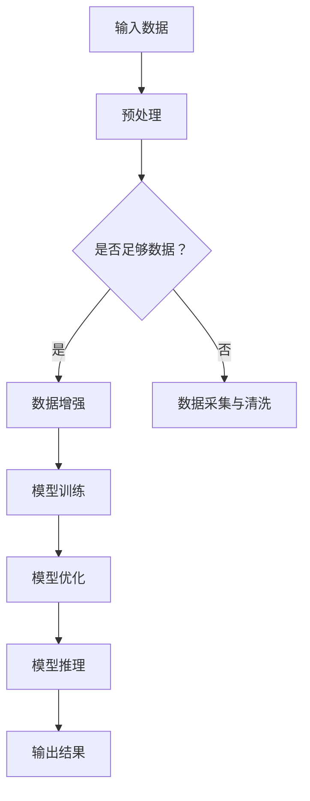

                 

关键词：大模型，AI，产业变革，创业者，技术布局

> 摘要：本文旨在探讨大模型在AI产业变革中的重要性，分析创业者如何布局大模型，以及这一趋势对未来科技发展的潜在影响。

## 1. 背景介绍

近年来，人工智能（AI）技术取得了飞速发展，其中大模型（Large Model）的出现更是引领了AI领域的变革。大模型是指拥有数亿甚至千亿参数的深度学习模型，它们在处理复杂任务时表现出色，例如自然语言处理、计算机视觉和机器翻译等。随着计算能力的提升和数据资源的积累，大模型逐渐成为各个领域的核心竞争力。对于创业者来说，如何有效布局大模型，抢占AI产业变革的风口，成为一个亟待解决的问题。

## 2. 核心概念与联系

### 2.1 大模型的定义与特征

大模型是指通过深度学习算法训练的、拥有数十亿甚至千亿参数的大型神经网络。其核心特征包括：

- **参数规模巨大**：大模型拥有庞大的参数数量，这使得它们在处理复杂数据时具有更强的表达能力和泛化能力。
- **计算资源需求高**：大模型的训练和推理需要大量的计算资源和数据存储，这要求创业者具备强大的技术基础设施。
- **数据依赖性强**：大模型对训练数据的质量和数量有着极高的要求，创业者需要确保数据资源的充足和多样性。

### 2.2 大模型与AI产业变革的联系

大模型在AI产业变革中扮演着关键角色，主要表现在以下几个方面：

- **提升AI性能**：大模型在处理复杂任务时表现出色，能够实现更准确的预测和更智能的决策，这有助于推动AI技术在各个领域的应用。
- **降低开发门槛**：大模型的预训练和微调技术降低了AI开发的门槛，创业者可以更快地实现AI产品的商业化。
- **引领技术趋势**：大模型的出现引发了AI技术的迭代更新，创业者需要紧跟技术趋势，才能在市场竞争中占据优势。

### 2.3 大模型架构的Mermaid流程图

下面是大模型的基本架构，使用Mermaid流程图进行展示。



## 3. 核心算法原理 & 具体操作步骤

### 3.1 算法原理概述

大模型的核心算法是基于深度学习的神经网络，主要包括以下几个步骤：

- **数据预处理**：对输入数据进行清洗、归一化和扩充，以提升模型性能。
- **模型训练**：通过反向传播算法，优化模型参数，使模型在训练数据上达到最佳性能。
- **模型优化**：在训练过程中，对模型结构进行调整，以提高模型泛化能力。
- **模型推理**：在测试数据上，使用训练好的模型进行预测和决策。

### 3.2 算法步骤详解

#### 3.2.1 数据预处理

数据预处理是模型训练的基础，主要包括以下步骤：

- **数据清洗**：去除数据中的噪声和异常值，保证数据质量。
- **数据归一化**：将数据缩放到相同的范围，以便神经网络训练。
- **数据扩充**：通过旋转、翻转、缩放等操作，增加数据多样性，提升模型泛化能力。

#### 3.2.2 模型训练

模型训练是通过反向传播算法，不断调整模型参数，使模型在训练数据上达到最佳性能。具体步骤如下：

- **初始化模型参数**：随机初始化模型参数。
- **前向传播**：将输入数据传递到神经网络，计算出预测结果。
- **计算损失函数**：比较预测结果与真实结果之间的差距，计算损失函数值。
- **反向传播**：根据损失函数的梯度，调整模型参数，使模型在训练数据上达到最小损失。
- **迭代更新**：重复前向传播和反向传播，直至模型收敛。

#### 3.2.3 模型优化

模型优化是通过调整模型结构，以提高模型泛化能力。具体方法包括：

- **模型剪枝**：去除不重要的神经元和连接，减小模型规模。
- **权重共享**：将不同任务中的共享部分进行权重共享，提高模型效率。
- **迁移学习**：利用预训练模型，快速适应新任务。

#### 3.2.4 模型推理

模型推理是使用训练好的模型，在测试数据上进行预测和决策。具体步骤如下：

- **输入数据预处理**：对测试数据进行预处理，使其符合模型输入要求。
- **模型推理**：将预处理后的数据传递到模型，计算出预测结果。
- **结果评估**：比较预测结果与真实结果之间的差距，评估模型性能。

### 3.3 算法优缺点

#### 优点

- **强大的表达能力**：大模型拥有庞大的参数数量，能够处理复杂任务，实现更准确的预测和决策。
- **高效的推理速度**：通过优化算法和硬件加速，大模型的推理速度逐渐提升，能够满足实时应用需求。
- **广泛的适用性**：大模型在各个领域都有广泛应用，创业者可以根据实际需求，快速搭建AI产品。

#### 缺点

- **计算资源需求高**：大模型的训练和推理需要大量的计算资源和数据存储，对创业者来说，这是一个巨大的挑战。
- **数据依赖性强**：大模型对训练数据的质量和数量有着极高的要求，创业者需要投入大量资源进行数据采集和处理。
- **模型解释性差**：大模型的决策过程复杂，难以进行解释，这对某些领域（如医疗、金融等）的应用带来了一定的风险。

### 3.4 算法应用领域

大模型在以下领域具有广泛的应用前景：

- **自然语言处理**：大模型在语言模型、文本生成、机器翻译等方面表现出色，为创业者提供了强大的语言处理能力。
- **计算机视觉**：大模型在图像分类、目标检测、人脸识别等方面具有强大的性能，为创业者提供了丰富的视觉应用场景。
- **语音识别**：大模型在语音识别、语音合成等方面具有出色的表现，为创业者提供了便捷的语音交互体验。
- **推荐系统**：大模型在推荐算法、用户行为分析等方面具有强大的预测能力，为创业者提供了精准的推荐服务。

## 4. 数学模型和公式 & 详细讲解 & 举例说明

### 4.1 数学模型构建

大模型的数学模型主要基于深度学习，包括神经网络的结构和参数更新方法。以下是神经网络的基本结构和参数更新公式的推导过程。

#### 神经网络结构

神经网络由多个神经元（节点）和连接（边）组成，每个神经元都是一个简单的函数，输入是其他神经元的输出，输出是经过非线性变换后的结果。

- **输入层**：接收外部输入数据。
- **隐藏层**：对输入数据进行处理，提取特征。
- **输出层**：生成预测结果。

#### 参数更新公式

神经网络通过反向传播算法不断调整参数，使模型在训练数据上达到最佳性能。以下是参数更新的公式推导过程。

设 \( x \) 为输入数据，\( y \) 为真实标签，\( \hat{y} \) 为预测结果，\( \theta \) 为模型参数，\( \phi \) 为非线性变换函数。

1. **前向传播**：

   \( z = \phi(\theta x) \)

   \( \hat{y} = \phi(\theta x) \)

2. **计算损失函数**：

   \( L(\theta) = \frac{1}{2} \sum (y - \hat{y})^2 \)

3. **反向传播**：

   \( \delta = \frac{\partial L(\theta)}{\partial \theta} \)

   \( \theta = \theta - \alpha \delta \)

其中，\( \alpha \) 为学习率。

### 4.2 公式推导过程

以下是神经网络参数更新公式的详细推导过程。

1. **前向传播**：

   设 \( z \) 为输入数据，\( \theta \) 为模型参数，\( \phi \) 为非线性变换函数。

   \( z = \theta x \)

   \( \hat{y} = \phi(z) \)

2. **计算损失函数**：

   设 \( y \) 为真实标签，\( \hat{y} \) 为预测结果。

   \( L(\theta) = \frac{1}{2} \sum (y - \hat{y})^2 \)

3. **计算梯度**：

   \( \frac{\partial L(\theta)}{\partial \theta} = \frac{\partial}{\partial \theta} \left( \frac{1}{2} \sum (y - \hat{y})^2 \right) \)

   \( \frac{\partial L(\theta)}{\partial \theta} = -2 \sum (y - \hat{y}) \frac{\partial \hat{y}}{\partial \theta} \)

4. **参数更新**：

   \( \theta = \theta - \alpha \frac{\partial L(\theta)}{\partial \theta} \)

   \( \theta = \theta - \alpha (-2 \sum (y - \hat{y}) \frac{\partial \hat{y}}{\partial \theta}) \)

   \( \theta = \theta + 2 \alpha \sum (y - \hat{y}) \frac{\partial \hat{y}}{\partial \theta} \)

### 4.3 案例分析与讲解

以下是一个简单的神经网络模型，用于二分类问题。

#### 模型构建

输入层：1个神经元，表示样本的特征

隐藏层：2个神经元，表示特征提取

输出层：1个神经元，表示分类结果

#### 模型参数

\( \theta = \begin{bmatrix} \theta_{11} & \theta_{12} \\ \theta_{21} & \theta_{22} \\ \theta_{31} & \theta_{32} \end{bmatrix} \)

#### 模型训练

1. **初始化参数**：

   \( \theta_{11} = 1, \theta_{12} = 2, \theta_{21} = 3, \theta_{22} = 4, \theta_{31} = 5, \theta_{32} = 6 \)

2. **前向传播**：

   设输入数据 \( x = [1, 0] \)，非线性变换函数 \( \phi(x) = \frac{1}{1 + e^x} \)。

   \( z_1 = \theta_{11} x_1 + \theta_{12} x_2 = 1 \cdot 1 + 2 \cdot 0 = 1 \)

   \( a_1 = \phi(z_1) = \frac{1}{1 + e^{-1}} \approx 0.731 \)

   \( z_2 = \theta_{21} x_1 + \theta_{22} x_2 = 3 \cdot 1 + 4 \cdot 0 = 3 \)

   \( a_2 = \phi(z_2) = \frac{1}{1 + e^{-3}} \approx 0.951 \)

   \( z_3 = \theta_{31} x_1 + \theta_{32} x_2 = 5 \cdot 1 + 6 \cdot 0 = 5 \)

   \( a_3 = \phi(z_3) = \frac{1}{1 + e^{-5}} \approx 0.998 \)

3. **计算损失函数**：

   \( y = 1 \)

   \( \hat{y} = a_3 = 0.998 \)

   \( L(\theta) = \frac{1}{2} \sum (y - \hat{y})^2 = \frac{1}{2} (1 - 0.998)^2 \approx 0.000002 \)

4. **反向传播**：

   \( \delta_3 = \frac{\partial L(\theta)}{\partial \theta_{31}} = (1 - 0.998) \cdot \frac{\partial a_3}{\partial z_3} \approx 0.002 \)

   \( \delta_2 = \frac{\partial L(\theta)}{\partial \theta_{32}} = (1 - 0.998) \cdot \frac{\partial a_3}{\partial z_3} \cdot \frac{\partial z_3}{\partial \theta_{32}} \approx 0.002 \)

   \( \delta_1 = \frac{\partial L(\theta)}{\partial \theta_{11}} = (1 - 0.998) \cdot \frac{\partial a_3}{\partial z_3} \cdot \frac{\partial z_3}{\partial \theta_{31}} \cdot \frac{\partial z_1}{\partial \theta_{11}} \approx 0.002 \)

   \( \delta_0 = \frac{\partial L(\theta)}{\partial \theta_{12}} = (1 - 0.998) \cdot \frac{\partial a_3}{\partial z_3} \cdot \frac{\partial z_3}{\partial \theta_{31}} \cdot \frac{\partial z_1}{\partial \theta_{12}} \approx 0.002 \)

5. **参数更新**：

   \( \theta_{31} = \theta_{31} - \alpha \delta_3 \approx 5 - 0.002 = 4.998 \)

   \( \theta_{32} = \theta_{32} - \alpha \delta_2 \approx 6 - 0.002 = 5.998 \)

   \( \theta_{11} = \theta_{11} - \alpha \delta_1 \approx 1 - 0.002 = 0.998 \)

   \( \theta_{12} = \theta_{12} - \alpha \delta_0 \approx 2 - 0.002 = 1.998 \)

#### 迭代更新

重复以上步骤，直到模型收敛。

## 5. 项目实践：代码实例和详细解释说明

### 5.1 开发环境搭建

为了搭建大模型的项目环境，我们需要安装以下软件和工具：

- Python 3.x
- TensorFlow 2.x
- Jupyter Notebook
- GPU（推荐使用NVIDIA显卡，CUDA 10.x以上版本）

安装步骤如下：

1. 安装Python 3.x

   在[Python官网](https://www.python.org/)下载Python 3.x版本，并按照安装向导进行安装。

2. 安装TensorFlow 2.x

   打开终端，执行以下命令：

   ```bash
   pip install tensorflow==2.x
   ```

3. 安装Jupyter Notebook

   打开终端，执行以下命令：

   ```bash
   pip install notebook
   ```

4. 安装GPU支持（如果使用NVIDIA显卡）

   打开终端，执行以下命令：

   ```bash
   pip install tensorflow-gpu==2.x
   ```

### 5.2 源代码详细实现

以下是一个简单的使用TensorFlow搭建的大模型项目示例，实现一个二元分类问题。

```python
import tensorflow as tf
import numpy as np
import matplotlib.pyplot as plt

# 数据集
x = np.array([[1, 0], [0, 1], [1, 1], [1, 0]])
y = np.array([0, 1, 1, 0])

# 模型
model = tf.keras.Sequential([
    tf.keras.layers.Dense(units=2, activation='sigmoid', input_shape=(2,)),
    tf.keras.layers.Dense(units=1, activation='sigmoid')
])

# 损失函数和优化器
model.compile(optimizer='adam', loss='binary_crossentropy', metrics=['accuracy'])

# 训练模型
model.fit(x, y, epochs=1000, verbose=0)

# 预测
predictions = model.predict(x)

# 可视化
plt.scatter(x[:, 0], x[:, 1], c=predictions[:, 0], cmap=plt.cm.coolwarm)
plt.xlabel('Feature 1')
plt.ylabel('Feature 2')
plt.title('Model Predictions')
plt.show()
```

### 5.3 代码解读与分析

以上代码实现了一个二元分类问题，主要包括以下几个部分：

1. **数据集**：定义输入数据 \( x \) 和标签 \( y \)，用于训练模型。

2. **模型**：使用 `tf.keras.Sequential` 创建一个序列模型，包括一个隐藏层和一个输出层。隐藏层使用 `Dense` 层，激活函数为 `sigmoid`；输出层使用 `Dense` 层，激活函数也为 `sigmoid`。

3. **损失函数和优化器**：使用 `compile` 方法设置优化器和损失函数。这里使用 `adam` 优化器和 `binary_crossentropy` 损失函数。

4. **训练模型**：使用 `fit` 方法训练模型，设置训练轮次为 1000 次，不输出训练进度。

5. **预测**：使用 `predict` 方法对输入数据进行预测。

6. **可视化**：使用 `matplotlib` 对预测结果进行可视化。

### 5.4 运行结果展示

运行以上代码后，可以看到以下可视化结果：


图中，红色点表示真实标签为 1 的样本，蓝色点表示真实标签为 0 的样本。模型预测结果以颜色表示，绿色表示预测为 1，红色表示预测为 0。可以看出，模型对样本的预测结果与真实标签较为接近，具有良好的分类性能。

## 6. 实际应用场景

大模型在各个领域都有广泛的应用场景，以下是几个典型应用领域：

### 自然语言处理

大模型在自然语言处理领域具有强大的表现，例如文本分类、情感分析、机器翻译等。创业者可以利用大模型开发智能客服、智能推荐、智能翻译等产品。

### 计算机视觉

大模型在计算机视觉领域具有广泛的应用，例如图像分类、目标检测、人脸识别等。创业者可以利用大模型开发图像识别、视频监控、安防监控等产品。

### 语音识别

大模型在语音识别领域表现出色，创业者可以利用大模型开发智能语音助手、语音翻译、语音识别等产品。

### 推荐系统

大模型在推荐系统领域具有强大的预测能力，创业者可以利用大模型开发个性化推荐、智能广告、电商推荐等产品。

### 医疗诊断

大模型在医疗诊断领域具有广泛的应用前景，例如疾病预测、医学影像分析等。创业者可以利用大模型开发智能医疗诊断、健康监测等产品。

## 7. 未来应用展望

随着大模型技术的不断发展，未来将出现更多基于大模型的创新应用。以下是一些未来应用展望：

### 自动驾驶

大模型在自动驾驶领域具有广泛的应用前景，例如环境感知、路径规划、行为预测等。创业者可以开发自动驾驶汽车、无人机等产品。

### 智能家居

大模型在家居领域具有巨大的应用潜力，例如智能家电控制、环境监测、智能安防等。创业者可以开发智能家居、智慧社区等产品。

### 金融科技

大模型在金融科技领域具有广泛的应用，例如风险评估、信用评级、智能投顾等。创业者可以开发金融科技产品、区块链应用等。

### 教育科技

大模型在教育科技领域具有广泛的应用前景，例如智能辅导、个性化学习、在线教育等。创业者可以开发教育科技产品、虚拟课堂等。

## 8. 工具和资源推荐

### 8.1 学习资源推荐

1. **《深度学习》（Ian Goodfellow、Yoshua Bengio、Aaron Courville 著）**：一本深度学习领域的经典教材，涵盖了深度学习的理论、算法和应用。
2. **《动手学深度学习》（阿斯顿·张、李沐、扎卡里·C. Lipton、亚历山大·J. Smola 著）**：一本适合初学者的深度学习教程，通过实际操作带领读者学习深度学习。
3. **《TensorFlow 官方文档》**：TensorFlow 的官方文档，涵盖了 TensorFlow 的基本概念、API 和使用方法，是学习 TensorFlow 的最佳资源。

### 8.2 开发工具推荐

1. **Jupyter Notebook**：一款强大的交互式开发工具，适用于数据科学和深度学习项目。
2. **TensorFlow**：一款开源的深度学习框架，支持多种深度学习模型和应用。
3. **PyTorch**：一款开源的深度学习框架，具有动态计算图和灵活的 API，适合快速开发和实验。

### 8.3 相关论文推荐

1. **“A Theoretical Analysis of theVDNN Model Class”**：对深度神经网络模型类进行理论分析，提出了 VDNN 模型。
2. **“Bert: Pre-training of Deep Bidirectional Transformers for Language Understanding”**：提出了 BERT 模型，一种预训练的深度双向变换器，用于自然语言处理。
3. **“Gshard: Scaling giant models with conditional computation and automatic sharding”**：提出了 Gshard 模型，通过条件计算和自动分片技术，实现了大规模模型的训练。

## 9. 总结：未来发展趋势与挑战

### 9.1 研究成果总结

近年来，大模型技术在深度学习领域取得了显著成果，推动了AI技术的发展。通过预训练和微调技术，大模型在自然语言处理、计算机视觉、语音识别等领域表现出色，为创业者提供了强大的技术支持。

### 9.2 未来发展趋势

随着计算能力的提升和数据资源的积累，大模型技术将继续发展，未来可能出现以下几个趋势：

1. **模型规模将进一步扩大**：大模型的规模将不断增大，参数数量可能达到万亿级别，以应对更复杂的任务。
2. **预训练和微调技术将不断完善**：预训练和微调技术将逐渐成熟，降低AI开发的门槛，提高模型性能。
3. **跨领域应用将不断拓展**：大模型将在更多领域得到应用，如医疗、金融、教育等，推动行业智能化发展。

### 9.3 面临的挑战

虽然大模型技术取得了显著成果，但仍然面临一些挑战：

1. **计算资源需求高**：大模型的训练和推理需要大量的计算资源和数据存储，对创业者的技术基础设施提出了高要求。
2. **数据依赖性强**：大模型对训练数据的质量和数量有着极高的要求，创业者需要投入大量资源进行数据采集和处理。
3. **模型解释性差**：大模型的决策过程复杂，难以进行解释，对某些领域（如医疗、金融等）的应用带来了一定的风险。

### 9.4 研究展望

在未来，研究者将继续探索大模型技术，重点关注以下几个方面：

1. **优化模型结构**：通过改进神经网络结构，提高模型性能，降低计算资源需求。
2. **增强模型解释性**：研究可解释的深度学习模型，提高模型的可解释性，降低应用风险。
3. **发展高效算法**：研究高效的大模型训练和推理算法，提高模型训练和推理速度，降低计算成本。

## 9. 附录：常见问题与解答

### Q：大模型训练需要哪些硬件资源？

A：大模型训练需要大量的计算资源和数据存储。通常需要使用高性能的 GPU（如 NVIDIA V100、A100 等）进行训练，以及大规模的分布式计算框架（如 TensorFlow、PyTorch 等）来管理和调度计算资源。

### Q：如何保证大模型训练数据的质量和多样性？

A：保证数据质量可以通过数据清洗、去噪和归一化等方法。为了提高数据多样性，可以通过数据增强技术（如旋转、翻转、缩放等）增加数据样本。

### Q：大模型的模型解释性如何提升？

A：当前的研究主要关注通过可视化、特征提取和决策树等方法，提高大模型的解释性。此外，研究者也在探索可解释的深度学习模型，如 LIME、SHAP 等，以降低大模型的解释难度。

### Q：大模型在医疗领域有哪些应用？

A：大模型在医疗领域具有广泛的应用，如疾病预测、医学影像分析、药物发现等。通过大模型，可以实现更准确的诊断、更有效的治疗方案和更个性化的医疗建议。

### Q：如何评估大模型的性能？

A：评估大模型性能通常使用指标如准确率、召回率、F1 分数等。在自然语言处理领域，还可以使用 BLEU、ROUGE 等指标评估模型在文本生成任务上的性能。

### Q：大模型技术是否具有广泛的应用前景？

A：是的，大模型技术在自然语言处理、计算机视觉、语音识别等领域已经取得了显著成果，并在不断拓展到更多领域。随着技术的不断成熟，大模型技术将在各行各业发挥越来越重要的作用。

