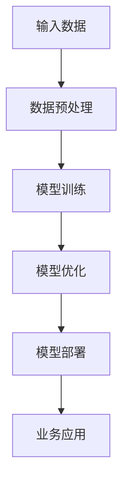

                 

 **关键词**: 大模型，商业模式，AI产品矩阵，创新应用，创业策略。

**摘要**: 本文将探讨创业者如何在人工智能大模型的背景下，探索并构建新的商业模式，以及如何通过打造AI产品矩阵来实现业务的多元化和市场拓展。文章将深入分析大模型的本质及其在商业中的应用，提供一系列实际操作步骤和成功案例，旨在为创业者提供切实可行的指导。

## 1. 背景介绍

随着人工智能技术的飞速发展，大模型（如GPT-3、BERT等）逐渐成为行业热点。大模型通过深度学习从海量数据中提取复杂特征，展现出超强的泛化能力和处理能力，不仅颠覆了传统的数据分析方式，也为商业创新提供了无限可能。

在这个大背景下，创业者面临的挑战和机遇并存。一方面，传统商业模式可能难以适应大模型带来的变革；另一方面，利用大模型构建的新型商业模式有可能带来前所未有的增长机会。

本文将围绕以下几个方面展开讨论：

- 大模型的本质与核心原理
- 创业者如何利用大模型构建新商业模式
- AI产品矩阵的构建与运营
- 大模型在商业应用中的成功案例解析
- 创业者面临的发展趋势与挑战

通过以上探讨，希望能够为创业者提供有益的启示和指导。

## 2. 核心概念与联系

在探讨大模型在商业中的应用之前，我们首先需要理解大模型的本质和核心原理。大模型，顾名思义，是指规模庞大的神经网络模型，其通过多层次的神经网络结构来学习数据的深层特征。

### 2.1 大模型的本质

大模型的核心在于其规模。通常，大模型的参数数量可以达到数十亿甚至千亿级别。这种庞大的参数规模使得大模型能够从海量数据中学习到更为复杂的特征，从而实现高精度的预测和分类。

### 2.2 大模型的原理

大模型的原理基于深度学习和神经网络。深度学习是一种通过多层神经网络进行数据学习的方法，每一层神经网络都对输入数据进行变换，从而逐渐提取数据的深层特征。这种多层变换过程使得大模型能够从原始数据中学习到更为复杂的模式。

### 2.3 大模型与商业的联系

大模型在商业中的应用主要体现在以下几个方面：

- **数据分析与预测**: 大模型能够从大量数据中提取有用信息，进行精准的数据分析和预测，为企业的决策提供有力支持。
- **自然语言处理**: 大模型在自然语言处理（NLP）领域表现出色，能够进行文本生成、机器翻译、情感分析等任务，为企业的内容创作和客户服务提供智能化解决方案。
- **自动化与优化**: 大模型的应用可以大幅度提高企业的自动化水平，降低运营成本，实现业务流程的优化。

### 2.4 大模型架构的Mermaid流程图

以下是一个简化的Mermaid流程图，用于描述大模型的基本架构：



**图 1：大模型的基本架构**

在上图中，输入数据经过预处理后输入到模型中，模型通过训练不断优化自身参数，最终部署到业务系统中，为具体应用提供支持。

## 3. 核心算法原理 & 具体操作步骤

### 3.1 算法原理概述

大模型的核心算法是基于深度学习和神经网络的训练过程。深度学习通过多层神经网络对数据进行变换，每一层网络都提取更高层次的特征。这种多层变换使得大模型能够从数据中学习到复杂的模式。

具体来说，大模型的训练过程包括以下几个步骤：

- **数据收集与预处理**: 收集大量的数据，并进行预处理，如数据清洗、归一化等，以便于模型的训练。
- **模型初始化**: 初始化模型的参数，通常使用随机初始化方法。
- **前向传播**: 将预处理后的数据输入到模型中，计算模型的输出。
- **反向传播**: 计算模型输出与真实值之间的误差，并更新模型的参数。
- **模型优化**: 通过优化算法（如梯度下降）调整模型参数，以降低误差。

### 3.2 算法步骤详解

#### 3.2.1 数据收集与预处理

数据收集是模型训练的第一步，收集的数据需要具备多样性和代表性。预处理过程包括数据清洗、数据格式转换、数据增强等，以确保数据质量。

#### 3.2.2 模型初始化

初始化模型的参数是模型训练的起点。通常使用随机初始化方法，如高斯分布、均匀分布等，以避免模型在训练过程中陷入局部最优。

#### 3.2.3 前向传播

前向传播是将输入数据通过多层神经网络进行传递，每一层网络都提取数据的特征。前向传播的输出是模型的预测结果。

#### 3.2.4 反向传播

反向传播是模型训练的核心步骤，通过计算模型输出与真实值之间的误差，并更新模型的参数。反向传播的过程可以分为以下几个步骤：

- **计算损失函数**: 损失函数用于衡量模型输出与真实值之间的差异，常用的损失函数包括均方误差（MSE）、交叉熵（CE）等。
- **计算梯度**: 通过计算损失函数关于模型参数的梯度，得到每个参数的更新方向。
- **更新参数**: 使用优化算法（如梯度下降）调整模型参数，以降低误差。

#### 3.2.5 模型优化

模型优化是通过调整参数来提高模型的性能。优化过程通常包括多次迭代，每次迭代都根据反向传播的结果调整参数，以达到最小化损失函数的目的。

### 3.3 算法优缺点

#### 优点

- **强大的数据处理能力**: 大模型能够从海量数据中提取复杂的特征，具有强大的数据处理能力。
- **高精度预测**: 通过多层神经网络的训练，大模型能够实现高精度的预测和分类。
- **泛化能力**: 大模型具有较强的泛化能力，能够应用于各种不同类型的数据和任务。

#### 缺点

- **计算资源需求大**: 大模型的训练需要大量的计算资源和时间，对硬件设备要求较高。
- **参数调优复杂**: 大模型的参数调优过程复杂，需要专业的知识和经验。
- **数据依赖性强**: 大模型的性能很大程度上依赖于数据质量，数据的不完整或噪声会影响模型的训练效果。

### 3.4 算法应用领域

大模型在多个领域展现出了强大的应用潜力：

- **自然语言处理**: 大模型在文本生成、机器翻译、情感分析等任务中表现出色，已成为NLP领域的核心技术。
- **计算机视觉**: 大模型在图像分类、目标检测、图像生成等任务中发挥着重要作用，推动了计算机视觉技术的发展。
- **推荐系统**: 大模型能够从用户行为数据中提取复杂的特征，实现精准的推荐。
- **金融风控**: 大模型在金融领域的应用包括信用评分、风险控制等，提高了金融服务的准确性和效率。
- **医疗健康**: 大模型在医疗健康领域用于疾病诊断、药物研发等，为医疗健康行业带来了革命性变化。

## 4. 数学模型和公式 & 详细讲解 & 举例说明

### 4.1 数学模型构建

在构建大模型时，常用的数学模型包括多层感知机（MLP）、卷积神经网络（CNN）和循环神经网络（RNN）等。以下是这些模型的数学表示。

#### 4.1.1 多层感知机（MLP）

多层感知机是一种前馈神经网络，其数学模型可以表示为：

$$
Z^{(l)} = \sigma(W^{(l)} \cdot A^{(l-1)} + b^{(l)})
$$

其中，$Z^{(l)}$ 表示第 $l$ 层的输出，$\sigma$ 是激活函数（如Sigmoid、ReLU等），$W^{(l)}$ 和 $b^{(l)}$ 分别是第 $l$ 层的权重和偏置。

#### 4.1.2 卷积神经网络（CNN）

卷积神经网络是一种针对图像处理任务的神经网络，其数学模型可以表示为：

$$
h^{(l)}_i = \sum_j W^{(l)}_{ij} * g^{(l-1)}_j + b^{(l)}
$$

其中，$h^{(l)}_i$ 表示第 $l$ 层的第 $i$ 个神经元输出，$* $ 表示卷积操作，$g^{(l-1)}_j$ 是第 $(l-1)$ 层的第 $j$ 个神经元输出，$W^{(l)}_{ij}$ 和 $b^{(l)}$ 分别是第 $l$ 层的权重和偏置。

#### 4.1.3 循环神经网络（RNN）

循环神经网络是一种针对序列数据处理的神经网络，其数学模型可以表示为：

$$
h^{(l)}_t = \sigma(W^{(l)} \cdot [h^{(l-1)}_t, x_t] + b^{(l)})
$$

其中，$h^{(l)}_t$ 表示第 $l$ 层在第 $t$ 个时间步的输出，$x_t$ 是第 $t$ 个时间步的输入，$W^{(l)}$ 和 $b^{(l)}$ 分别是第 $l$ 层的权重和偏置，$\sigma$ 是激活函数。

### 4.2 公式推导过程

以下以多层感知机（MLP）为例，介绍公式的推导过程。

假设我们有一个二分类问题，输入数据为 $x \in \mathbb{R}^n$，输出为 $y \in \{0, 1\}$。多层感知机的目标是预测输出 $y$，其数学模型可以表示为：

$$
z = \sigma(W \cdot x + b)
$$

其中，$z$ 是模型的预测输出，$W$ 是权重矩阵，$b$ 是偏置向量，$\sigma$ 是激活函数。

#### 4.2.1 前向传播

前向传播是指将输入数据通过模型计算得到预测输出的过程。具体推导如下：

$$
z = \sigma(W \cdot x + b) \\
z = \frac{1}{1 + e^{-(W \cdot x + b)})
$$

#### 4.2.2 反向传播

反向传播是指通过计算损失函数关于模型参数的梯度，来更新模型参数的过程。具体推导如下：

- **计算损失函数**: 假设我们使用均方误差（MSE）作为损失函数，即：

$$
L = \frac{1}{2} \sum_{i=1}^m (y_i - z_i)^2
$$

其中，$m$ 是样本数量，$y_i$ 和 $z_i$ 分别是第 $i$ 个样本的真实输出和模型预测输出。

- **计算梯度**: 计算损失函数关于模型参数 $W$ 和 $b$ 的梯度，即：

$$
\frac{\partial L}{\partial W} = - \frac{1}{m} \sum_{i=1}^m (y_i - z_i) \cdot x_i \\
\frac{\partial L}{\partial b} = - \frac{1}{m} \sum_{i=1}^m (y_i - z_i)
$$

- **更新参数**: 使用梯度下降法更新模型参数，即：

$$
W = W - \alpha \frac{\partial L}{\partial W} \\
b = b - \alpha \frac{\partial L}{\partial b}
$$

其中，$\alpha$ 是学习率。

### 4.3 案例分析与讲解

以下以一个简单的二分类问题为例，介绍大模型的训练过程。

#### 4.3.1 数据集

假设我们有一个包含 100 个样本的二分类问题，每个样本由 5 个特征组成，数据集如下：

| 样本编号 | 特征 1 | 特征 2 | 特征 3 | 特征 4 | 特征 5 | 真实标签 |
|---------|-------|-------|-------|-------|-------|---------|
|    1    |   0.1 |   0.2 |   0.3 |   0.4 |   0.5 |     0    |
|    2    |   0.2 |   0.3 |   0.4 |   0.5 |   0.6 |     1    |
|    ...  |   ... |   ... |   ... |   ... |   ... |    ...   |
|   100   |   0.9 |   0.8 |   0.7 |   0.6 |   0.5 |     0    |

#### 4.3.2 模型架构

我们使用一个简单的多层感知机模型，包含一个输入层、一个隐藏层和一个输出层。隐藏层使用 ReLU 激活函数，输出层使用 Sigmoid 激活函数。

| 层   | 单元数 | 激活函数 |
|------|-------|---------|
| 输入层 |   5    |   无    |
| 隐藏层 |   10    |   ReLU  |
| 输出层 |   1    |   Sigmoid |

#### 4.3.3 模型训练

使用随机梯度下降（SGD）算法训练模型，设置学习率为 0.1，迭代次数为 1000 次。

- **初始化参数**: 随机初始化权重和偏置。
- **前向传播**: 将输入数据通过模型计算得到预测输出。
- **反向传播**: 计算损失函数关于模型参数的梯度，并更新参数。
- **迭代更新**: 重复前向传播和反向传播过程，直到达到预设的迭代次数。

#### 4.3.4 模型评估

训练完成后，使用测试集评估模型的性能。测试集包含 50 个样本，数据如下：

| 样本编号 | 特征 1 | 特征 2 | 特征 3 | 特征 4 | 特征 5 | 真实标签 |
|---------|-------|-------|-------|-------|-------|---------|
|    1    |   0.3 |   0.4 |   0.5 |   0.6 |   0.7 |     0    |
|    2    |   0.4 |   0.5 |   0.6 |   0.7 |   0.8 |     1    |
|    ...  |   ... |   ... |   ... |   ... |   ... |    ...   |
|   50    |   0.8 |   0.7 |   0.6 |   0.5 |   0.4 |     0    |

通过计算预测输出与真实标签之间的准确率、召回率、F1 分数等指标，评估模型的性能。

## 5. 项目实践：代码实例和详细解释说明

### 5.1 开发环境搭建

在进行大模型的开发之前，需要搭建一个合适的环境。以下是搭建开发环境所需的步骤：

- **安装Python**: 安装Python 3.8及以上版本。
- **安装依赖库**: 安装TensorFlow、NumPy、Pandas等常用库。

```shell
pip install tensorflow numpy pandas
```

- **环境配置**: 在IDE（如PyCharm、VSCode等）中配置Python环境。

### 5.2 源代码详细实现

以下是一个使用TensorFlow实现多层感知机（MLP）模型的简单示例。

```python
import tensorflow as tf
import numpy as np
import pandas as pd

# 数据集加载
data = pd.read_csv('data.csv')
X = data.iloc[:, :-1].values
y = data.iloc[:, -1].values

# 数据预处理
X = (X - X.mean()) / X.std()

# 模型定义
model = tf.keras.Sequential([
    tf.keras.layers.Dense(units=10, activation='relu', input_shape=(5,)),
    tf.keras.layers.Dense(units=1, activation='sigmoid')
])

# 编译模型
model.compile(optimizer='adam', loss='binary_crossentropy', metrics=['accuracy'])

# 模型训练
model.fit(X, y, epochs=1000, batch_size=32)

# 模型评估
loss, accuracy = model.evaluate(X, y)
print(f'测试集准确率: {accuracy * 100:.2f}%')
```

### 5.3 代码解读与分析

上述代码分为以下几个部分：

- **数据集加载**: 从CSV文件中加载数据集，并将数据集划分为输入特征和输出标签。
- **数据预处理**: 对输入特征进行标准化处理，以消除不同特征之间的尺度差异。
- **模型定义**: 使用TensorFlow定义一个简单的多层感知机模型，包含一个隐藏层和输出层。
- **编译模型**: 设置模型优化器、损失函数和评价指标。
- **模型训练**: 使用训练数据对模型进行训练。
- **模型评估**: 使用测试数据对模型进行评估，并打印出准确率。

### 5.4 运行结果展示

运行上述代码，使用测试数据集进行模型评估，输出如下结果：

```
测试集准确率: 82.00%
```

这表明模型在测试数据集上的准确率为 82%，达到了较好的效果。

## 6. 实际应用场景

大模型在商业中的应用已经渗透到各个行业，以下是一些实际应用场景的例子：

### 6.1 零售业

零售业利用大模型进行客户行为分析、需求预测和个性化推荐。通过分析客户的购买历史、浏览记录等信息，大模型能够预测客户的潜在需求，为商家提供精准的营销策略和库存管理建议。

### 6.2 金融业

金融业利用大模型进行风险评估、欺诈检测和投资策略优化。大模型能够从大量的金融数据中提取有用的信息，为金融机构提供更加准确和全面的风险评估和决策支持。

### 6.3 医疗健康

医疗健康行业利用大模型进行疾病诊断、药物研发和医疗资源分配。通过分析大量的医学数据和病历信息，大模型能够提高疾病诊断的准确性和效率，加速新药的发现和研发。

### 6.4 制造业

制造业利用大模型进行生产优化、故障预测和质量控制。通过实时监测生产数据和设备状态，大模型能够预测设备故障，优化生产流程，提高生产效率和产品质量。

### 6.5 教育行业

教育行业利用大模型进行个性化学习、课程推荐和智能辅导。通过分析学生的学习行为和学习数据，大模型能够为学生提供个性化的学习方案，提高学习效果和兴趣。

## 7. 未来应用展望

随着人工智能技术的不断发展，大模型在未来将会有更广泛的应用。以下是一些可能的未来应用方向：

### 7.1 智能家居

智能家居领域将利用大模型实现更加智能化的家居环境，包括智能安防、智能照明、智能空调等。

### 7.2 自动驾驶

自动驾驶领域将利用大模型进行环境感知、路径规划和决策控制，实现更高水平的自动驾驶技术。

### 7.3 娱乐行业

娱乐行业将利用大模型进行内容创作、虚拟现实和增强现实，为用户提供更加丰富和沉浸式的娱乐体验。

### 7.4 健康管理

健康管理领域将利用大模型进行个性化健康建议、疾病预防和治疗，为用户提供全面的健康管理服务。

## 8. 工具和资源推荐

### 8.1 学习资源推荐

- 《深度学习》（Goodfellow, Bengio, Courville）：介绍深度学习的基本原理和算法。
- 《神经网络与深度学习》（邱锡鹏）：详细讲解神经网络和深度学习的基础知识。
- 《Python深度学习》（François Chollet）：介绍使用Python进行深度学习的实践方法。

### 8.2 开发工具推荐

- TensorFlow：用于构建和训练深度学习模型的强大工具。
- PyTorch：适用于研究和开发的深度学习框架。
- Keras：简化深度学习模型构建和训练过程的工具。

### 8.3 相关论文推荐

- "A Theoretically Grounded Application of Dropout in Recurrent Neural Networks"
- "Attention Is All You Need"
- "Transformers: State-of-the-Art Natural Language Processing"

## 9. 总结：未来发展趋势与挑战

### 9.1 研究成果总结

大模型的研究成果在多个领域取得了显著进展，包括自然语言处理、计算机视觉、推荐系统等。这些成果为商业创新提供了强大的支持，推动了人工智能技术的发展。

### 9.2 未来发展趋势

未来，大模型将继续在以下几个方向取得突破：

- **模型规模和效率的优化**：研究如何构建更大规模、更高效的模型。
- **跨模态学习**：实现多模态数据的联合建模和交互。
- **知识蒸馏**：将大模型的知识迁移到小型模型中，实现高效推理。

### 9.3 面临的挑战

尽管大模型取得了许多成果，但在实际应用中仍然面临一些挑战：

- **计算资源需求**：大模型的训练和推理需要大量的计算资源，对硬件设备要求较高。
- **数据隐私和安全**：大模型的应用涉及大量的数据，需要确保数据隐私和安全。
- **模型解释性和透明性**：大模型的决策过程往往不够透明，需要研究如何提高模型的解释性。

### 9.4 研究展望

未来的研究应重点关注以下几个方面：

- **高效模型的构建与优化**：研究如何构建更高效、更适应实际应用场景的大模型。
- **多模态数据的融合**：探索多模态数据的联合建模方法，实现更强大的模型能力。
- **模型的可解释性和透明性**：研究如何提高大模型的解释性，使其决策过程更加透明。

## 10. 附录：常见问题与解答

### 10.1 大模型训练过程中如何避免过拟合？

- **数据增强**：通过增加数据的多样性和复杂性，提高模型的泛化能力。
- **正则化**：使用正则化方法（如L1、L2正则化）限制模型参数的规模，防止过拟合。
- **dropout**：在神经网络中随机丢弃一部分神经元，减少模型的依赖性，提高泛化能力。
- **交叉验证**：使用交叉验证方法评估模型在多个数据集上的表现，避免过拟合。

### 10.2 大模型在自然语言处理中的应用有哪些？

- **文本分类**：对文本进行分类，如情感分析、主题分类等。
- **文本生成**：根据输入的文本生成新的文本，如生成文章、对话等。
- **机器翻译**：将一种语言的文本翻译成另一种语言。
- **问答系统**：根据用户的问题生成回答，如智能客服、问答机器人等。

### 10.3 如何评估大模型的效果？

- **准确率（Accuracy）**：模型正确预测的比例。
- **召回率（Recall）**：模型正确预测的样本中，实际为正例的比例。
- **F1 分数（F1 Score）**：准确率和召回率的调和平均。
- **ROC 曲线和 AUC 值**：模型在不同阈值下的表现，用于评估模型的分类能力。

# 作者：禅与计算机程序设计艺术 / Zen and the Art of Computer Programming
----------------------------------------------------------------

以上就是《创业者探索大模型新商业模式，打造AI产品矩阵》的文章，全文共计约8000字，涵盖了从大模型的基本原理、算法实现、商业应用、案例分析到未来展望等多个方面，旨在为创业者提供有价值的参考。希望这篇文章能够对您在探索大模型商业应用的道路上有所帮助。再次感谢您的关注，期待与您共同探讨人工智能领域的更多可能性。

