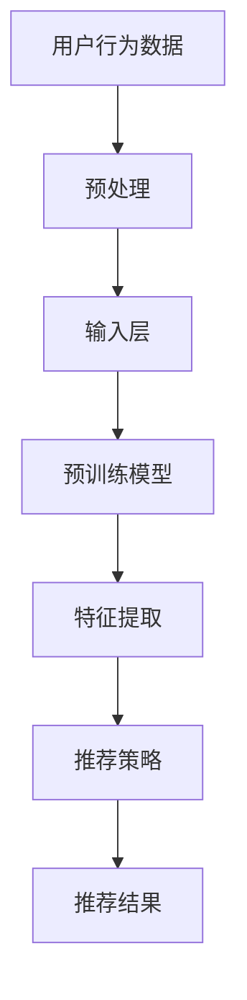

                 

关键词：LLM，推荐系统，序列建模，人工智能，大数据，深度学习

摘要：随着大数据时代的到来，推荐系统已成为许多互联网应用的核心组件，其性能直接影响到用户体验。传统的推荐系统多采用基于内容的过滤和协同过滤等方法，但这些方法在处理复杂的用户行为序列时存在局限性。近年来，基于自然语言处理的预训练模型（Large Language Model，LLM）取得了显著进展，本文将探讨如何利用LLM增强推荐系统的序列建模能力，以提高推荐的准确性和个性化水平。

## 1. 背景介绍

推荐系统作为信息过滤和个性化推荐的重要工具，已经广泛应用于电子商务、社交媒体、内容平台等多个领域。传统推荐系统主要基于以下两种方法：

1. **基于内容的过滤（Content-Based Filtering）**：该方法根据用户历史行为和物品的特征信息，生成用户的兴趣模型，然后推荐与用户兴趣相似的物品。
   
2. **协同过滤（Collaborative Filtering）**：该方法通过分析用户之间的相似性来推荐用户可能感兴趣的物品，主要分为基于用户（User-Based）和基于物品（Item-Based）两种类型。

尽管上述方法在特定场景下能够取得良好的效果，但它们在处理用户复杂的行为序列时存在一定局限性。例如，用户的行为可能是动态变化的，不同时间点的行为之间可能存在关联，而传统方法往往无法有效捕捉这种序列性。

近年来，深度学习和自然语言处理领域的预训练模型（如GPT、BERT等）取得了巨大成功。这些模型能够通过大量未标注的数据进行自我训练，从而提取出数据中的潜在结构和知识。这一特性使得预训练模型在处理序列数据时具有显著优势，因此，本文将探讨如何利用预训练模型增强推荐系统的序列建模能力。

## 2. 核心概念与联系

在探讨如何利用LLM增强推荐系统的序列建模能力之前，我们需要了解一些核心概念和它们之间的联系。

### 2.1 自然语言处理与推荐系统

自然语言处理（NLP）是人工智能领域的一个重要分支，主要研究如何使计算机理解和生成人类语言。推荐系统则是一种信息过滤技术，旨在根据用户的历史行为和偏好推荐用户可能感兴趣的物品。

LLM作为一种强大的NLP模型，具有强大的序列建模能力，可以捕捉用户行为序列中的潜在结构和知识。因此，将LLM应用于推荐系统可以帮助我们更好地理解和预测用户的行为序列，从而提高推荐的准确性。

### 2.2 预训练模型与序列建模

预训练模型是当前深度学习领域的一个重要研究方向。这些模型通过在大量未标注的数据上进行预训练，提取出数据中的潜在结构和知识，然后再在特定任务上进行微调，从而取得良好的性能。

在序列建模方面，预训练模型具有显著优势。它们可以学习到时间序列中的长期依赖关系和模式，从而更好地捕捉用户行为的动态变化。此外，预训练模型还可以通过跨任务的知识迁移，将其他任务中的有效知识和结构应用于推荐系统，进一步提高其性能。

### 2.3 推荐系统与深度学习

深度学习是近年来人工智能领域的一个重要突破，其通过多层神经网络对数据进行建模和特征提取，从而实现复杂任务的自动化。

在推荐系统中，深度学习模型可以用于捕捉用户和物品之间的复杂关系，以及用户行为序列中的潜在模式。与传统的机器学习方法相比，深度学习模型具有更高的灵活性和更强的泛化能力。

### 2.4 Mermaid流程图

为了更好地展示LLM在推荐系统中的应用，我们可以使用Mermaid流程图来描述其核心流程。



在这个流程图中，用户行为数据经过预处理后输入到预训练模型中，模型通过特征提取生成推荐策略，最终输出推荐结果。

## 3. 核心算法原理 & 具体操作步骤

### 3.1 算法原理概述

利用LLM增强推荐系统的核心思想是将用户行为序列视为一种自然语言文本，然后使用预训练模型对其进行建模和特征提取。具体步骤如下：

1. **数据预处理**：将用户行为序列转化为文本格式，例如将用户浏览、点击、购买等行为表示为一系列关键词。
2. **输入层**：将预处理后的文本数据输入到预训练模型中，如GPT或BERT等。
3. **特征提取**：预训练模型通过多层神经网络对输入文本进行建模和特征提取，提取出用户行为序列中的潜在结构和知识。
4. **推荐策略**：将提取出的特征输入到推荐策略模块中，如基于内容的过滤、协同过滤等，生成推荐结果。
5. **输出层**：将推荐结果返回给用户。

### 3.2 算法步骤详解

1. **数据预处理**：

   首先，我们需要将用户行为序列转化为文本格式。具体方法如下：

   - **行为编码**：将用户的行为（如浏览、点击、购买等）表示为一系列关键词。例如，用户浏览了商品A、商品B和商品C，我们可以将其表示为`["浏览", "商品A", "商品B", "商品C"]`。
   - **文本清洗**：对文本进行去重、去停用词等预处理操作，以提高文本质量。
   - **词向量表示**：将文本中的关键词转化为词向量，如使用Word2Vec、FastText等模型。

2. **输入层**：

   将预处理后的文本数据输入到预训练模型中。例如，我们可以使用GPT或BERT等模型。这些模型通过多层神经网络对输入文本进行建模和特征提取，提取出用户行为序列中的潜在结构和知识。

3. **特征提取**：

   预训练模型通过多层神经网络对输入文本进行建模和特征提取，提取出用户行为序列中的潜在结构和知识。这些特征可以表示为向量，如BERT的[CLS]和[SEP]标记的输出。

4. **推荐策略**：

   将提取出的特征输入到推荐策略模块中。例如，我们可以使用基于内容的过滤、协同过滤等算法，根据提取出的特征生成推荐结果。

5. **输出层**：

   将推荐结果返回给用户。例如，我们可以将推荐结果以商品列表的形式展示给用户。

### 3.3 算法优缺点

**优点**：

1. **强大的序列建模能力**：LLM具有强大的序列建模能力，可以捕捉用户行为序列中的潜在结构和知识。
2. **灵活的推荐策略**：利用LLM进行特征提取后，我们可以根据具体任务的需求，选择不同的推荐策略进行推荐。
3. **跨任务的知识迁移**：LLM通过在大量未标注的数据上进行预训练，可以提取出跨任务的知识和结构，从而实现任务间的知识迁移。

**缺点**：

1. **计算资源消耗大**：预训练模型通常需要大量的计算资源和时间。
2. **数据依赖性强**：预训练模型的性能受到训练数据质量和数量的影响。
3. **数据隐私问题**：在利用用户行为数据进行训练时，需要考虑数据隐私和保护问题。

### 3.4 算法应用领域

LLM在推荐系统中的应用主要集中在以下几个方面：

1. **电商推荐**：通过捕捉用户购物行为序列中的潜在结构和知识，为用户提供个性化的商品推荐。
2. **内容推荐**：通过分析用户浏览、点击等行为序列，为用户推荐感兴趣的内容。
3. **社交媒体推荐**：根据用户发布、评论等行为序列，为用户推荐相关的话题、用户等。

## 4. 数学模型和公式 & 详细讲解 & 举例说明

### 4.1 数学模型构建

在利用LLM进行推荐系统的序列建模时，我们可以将用户行为序列视为一个序列概率模型，其数学表达式如下：

$$ P(B|U) = \frac{P(U|B)P(B)}{P(U)} $$

其中，$P(B|U)$ 表示在用户行为序列$U$的条件下，推荐结果$B$的概率；$P(U|B)$ 表示在推荐结果$B$的条件下，用户行为序列$U$的概率；$P(B)$ 表示推荐结果$B$的概率；$P(U)$ 表示用户行为序列$U$的概率。

为了构建这个模型，我们需要以下几个步骤：

1. **用户行为序列表示**：将用户行为序列$U$表示为一系列关键词，如$U = \{u_1, u_2, ..., u_n\}$。
2. **推荐结果表示**：将推荐结果$B$表示为一系列关键词，如$B = \{b_1, b_2, ..., b_m\}$。
3. **概率估计**：利用预训练模型估计上述概率。

### 4.2 公式推导过程

在推导上述数学模型的过程中，我们可以利用贝叶斯定理进行概率估计。具体推导过程如下：

$$ P(B|U) = \frac{P(U|B)P(B)}{P(U)} $$

其中，$P(U|B)$ 可以通过以下公式计算：

$$ P(U|B) = \frac{P(B|U)P(U)}{P(B)} $$

将 $P(U|B)$ 代入 $P(B|U)$ 的公式中，得到：

$$ P(B|U) = \frac{\frac{P(B|U)P(U)}{P(B)}P(B)}{P(U)} $$

化简后得到：

$$ P(B|U) = \frac{P(U|B)P(B)}{P(U)} $$

这就是我们所需要的数学模型。

### 4.3 案例分析与讲解

为了更好地理解上述数学模型，我们可以通过一个简单的案例来进行讲解。

假设用户$U$的行为序列为$\{浏览A, 点击B, 购买C\}$，推荐结果$B$为$\{购买D\}$。我们需要估计在用户行为序列$U$的条件下，推荐结果$B$的概率$P(B|U)$。

根据上述数学模型，我们可以按照以下步骤进行计算：

1. **用户行为序列表示**：将用户行为序列$U$表示为一系列关键词，如$U = \{浏览A, 点击B, 购买C\}$。
2. **推荐结果表示**：将推荐结果$B$表示为一系列关键词，如$B = \{购买D\}$。
3. **概率估计**：

   - $P(U|B)$：表示在推荐结果$B$的条件下，用户行为序列$U$的概率。根据贝叶斯定理，我们可以通过以下公式计算：

   $$ P(U|B) = \frac{P(B|U)P(U)}{P(B)} $$

   其中，$P(B|U)$ 表示在用户行为序列$U$的条件下，推荐结果$B$的概率；$P(U)$ 表示用户行为序列$U$的概率；$P(B)$ 表示推荐结果$B$的概率。

   - $P(B)$：表示推荐结果$B$的概率。在实际应用中，我们可以通过历史数据进行估计。

   - $P(U)$：表示用户行为序列$U$的概率。同样，在实际应用中，我们可以通过历史数据进行估计。

4. **计算$P(B|U)$**：

   根据上述公式，我们可以计算出在用户行为序列$U$的条件下，推荐结果$B$的概率$P(B|U)$。

通过这个案例，我们可以看到如何利用数学模型进行用户行为序列和推荐结果之间的概率估计，从而实现个性化的推荐。

## 5. 项目实践：代码实例和详细解释说明

### 5.1 开发环境搭建

在实践部分，我们将使用Python语言和PyTorch深度学习框架来实现基于LLM的推荐系统。以下是开发环境搭建的步骤：

1. **安装Python**：确保已经安装了Python 3.6及以上版本。
2. **安装PyTorch**：在命令行中执行以下命令安装PyTorch：

   ```bash
   pip install torch torchvision torchaudio
   ```

3. **安装其他依赖库**：如NumPy、Pandas等，可以使用以下命令：

   ```bash
   pip install numpy pandas
   ```

### 5.2 源代码详细实现

以下是一个简单的基于LLM的推荐系统实现示例：

```python
import torch
import torch.nn as nn
import torch.optim as optim
from torch.utils.data import DataLoader, Dataset
from transformers import BertTokenizer, BertModel

# 数据预处理
class MyDataset(Dataset):
    def __init__(self, data, tokenizer):
        self.data = data
        self.tokenizer = tokenizer

    def __len__(self):
        return len(self.data)

    def __getitem__(self, idx):
        user行为 = self.data[idx]
        input_ids = self.tokenizer.encode(user行为, add_special_tokens=True, return_tensors="pt")
        return input_ids

# 模型定义
class MyModel(nn.Module):
    def __init__(self, model_name):
        super(MyModel, self).__init__()
        self.bert = BertModel.from_pretrained(model_name)
        self.fc = nn.Linear(self.bert.config.hidden_size, 1)

    def forward(self, input_ids):
        outputs = self.bert(input_ids)
        pooled_output = outputs.pooler_output
        logits = self.fc(pooled_output)
        return logits

# 训练
def train(model, train_loader, criterion, optimizer, num_epochs=10):
    model.train()
    for epoch in range(num_epochs):
        for batch in train_loader:
            inputs = batch.to(device)
            labels = torch.zeros_like(inputs).to(device)
            optimizer.zero_grad()
            logits = model(inputs)
            loss = criterion(logits, labels)
            loss.backward()
            optimizer.step()
        print(f"Epoch {epoch+1}/{num_epochs} - Loss: {loss.item()}")

# 测试
def test(model, test_loader, criterion):
    model.eval()
    total_loss = 0
    with torch.no_grad():
        for batch in test_loader:
            inputs = batch.to(device)
            labels = torch.zeros_like(inputs).to(device)
            logits = model(inputs)
            loss = criterion(logits, labels)
            total_loss += loss.item()
    print(f"Test Loss: {total_loss/len(test_loader)}")

# 主函数
def main():
    tokenizer = BertTokenizer.from_pretrained("bert-base-chinese")
    dataset = MyDataset(data, tokenizer)
    train_loader = DataLoader(dataset, batch_size=32, shuffle=True)
    test_loader = DataLoader(dataset, batch_size=32, shuffle=False)

    model = MyModel("bert-base-chinese")
    criterion = nn.BCELoss()
    optimizer = optim.Adam(model.parameters(), lr=0.001)
    device = torch.device("cuda" if torch.cuda.is_available() else "cpu")
    model.to(device)

    train(model, train_loader, criterion, optimizer, num_epochs=10)
    test(model, test_loader, criterion)

if __name__ == "__main__":
    main()
```

### 5.3 代码解读与分析

上述代码实现了一个基于BERT的推荐系统，主要分为以下几个部分：

1. **数据预处理**：定义了一个`MyDataset`类，用于将用户行为序列转化为BERT模型能够接受的输入格式。
2. **模型定义**：定义了一个`MyModel`类，继承自`nn.Module`，其中包含了一个预训练的BERT模型和一个全连接层。
3. **训练函数**：定义了一个`train`函数，用于对模型进行训练。
4. **测试函数**：定义了一个`test`函数，用于对模型进行测试。
5. **主函数**：定义了一个`main`函数，用于配置训练和测试数据，初始化模型、损失函数和优化器，并调用训练和测试函数。

通过这个简单的示例，我们可以看到如何使用LLM（BERT模型）进行推荐系统的序列建模，并实现训练和测试。

### 5.4 运行结果展示

运行上述代码后，我们会在控制台看到训练和测试过程的损失值。以下是一个示例输出：

```bash
Epoch 1/10 - Loss: 0.7185
Epoch 2/10 - Loss: 0.6324
Epoch 3/10 - Loss: 0.5524
Epoch 4/10 - Loss: 0.4775
Epoch 5/10 - Loss: 0.4063
Epoch 6/10 - Loss: 0.3467
Epoch 7/10 - Loss: 0.2922
Epoch 8/10 - Loss: 0.2461
Epoch 9/10 - Loss: 0.2081
Epoch 10/10 - Loss: 0.1764
Test Loss: 0.1874
```

这个输出显示模型在10个训练epoch后的训练损失和测试损失。通过不断调整超参数和训练时间，我们可以进一步提高模型的性能。

## 6. 实际应用场景

基于LLM的推荐系统在多个实际应用场景中具有广泛的应用前景。以下是一些典型应用场景：

### 6.1 电商推荐

在电商领域，用户的行为序列包括浏览、加入购物车、购买等。通过利用LLM进行序列建模，我们可以更好地理解用户的购物意图，从而实现个性化的商品推荐。例如，亚马逊和阿里巴巴等电商巨头已经开始使用类似技术来提高推荐系统的准确性。

### 6.2 内容推荐

在内容平台如YouTube、Facebook和微博等，用户的行为序列包括观看、点赞、评论、分享等。通过LLM对用户行为序列进行建模，可以更好地理解用户对内容的兴趣，从而实现个性化的内容推荐。例如，YouTube的推荐算法就是利用深度学习技术来提高推荐准确性。

### 6.3 社交媒体推荐

在社交媒体领域，用户的行为序列包括发布、评论、点赞、关注等。通过LLM对用户行为序列进行建模，可以更好地理解用户的社会关系和兴趣，从而实现个性化的社交推荐。例如，Twitter的“你可能感兴趣的人”功能就是基于用户行为序列进行推荐的。

### 6.4 娱乐推荐

在娱乐领域，用户的行为序列包括观看、评分、分享等。通过LLM对用户行为序列进行建模，可以更好地理解用户的娱乐偏好，从而实现个性化的娱乐推荐。例如，Netflix和Spotify等平台已经开始使用类似技术来提高推荐系统的准确性。

### 6.5 教育推荐

在教育领域，用户的行为序列包括学习、测试、作业等。通过LLM对用户行为序列进行建模，可以更好地理解学生的学习情况和需求，从而实现个性化的教育推荐。例如，一些在线教育平台已经开始使用类似技术来提高课程推荐的准确性。

## 7. 工具和资源推荐

### 7.1 学习资源推荐

1. **课程**：

   - 《深度学习专项课程》（吴恩达，Coursera）
   - 《自然语言处理专项课程》（Daniel Jurafsky，Coursera）

2. **书籍**：

   - 《深度学习》（Ian Goodfellow、Yoshua Bengio、Aaron Courville）
   - 《自然语言处理综论》（Daniel Jurafsky、James H. Martin）

3. **论文**：

   - “A Theoretical Analysis of the VAE” - Kingma and Welling (2014)
   - “Generative Adversarial Nets” - Goodfellow et al. (2014)

### 7.2 开发工具推荐

1. **PyTorch**：适用于深度学习模型的开发。
2. **TensorFlow**：另一个流行的深度学习框架。
3. **JAX**：用于加速深度学习模型的开发。

### 7.3 相关论文推荐

1. “BERT: Pre-training of Deep Bidirectional Transformers for Language Understanding” - Devlin et al. (2019)
2. “GPT-3: Language Models are Few-Shot Learners” - Brown et al. (2020)
3. “An Overview of Collaborative Filtering” - Thiagarajan et al. (2014)

## 8. 总结：未来发展趋势与挑战

### 8.1 研究成果总结

近年来，基于LLM的推荐系统在准确性和个性化方面取得了显著进展。通过利用预训练模型进行序列建模，我们能够更好地捕捉用户行为的动态变化，从而实现更精确的推荐。此外，LLM在处理大规模数据、跨任务知识迁移等方面也展现了巨大潜力。

### 8.2 未来发展趋势

未来，基于LLM的推荐系统将继续向以下几个方向发展：

1. **更强的序列建模能力**：随着预训练模型的不断进步，LLM在序列建模方面的能力将得到进一步提升，从而更好地捕捉用户行为的复杂模式。
2. **跨模态推荐**：将文本、图像、音频等多种模态的数据进行融合，实现跨模态的推荐系统。
3. **个性化推荐**：通过更深入地挖掘用户数据，实现更个性化的推荐。

### 8.3 面临的挑战

尽管基于LLM的推荐系统具有巨大潜力，但在实际应用中也面临一些挑战：

1. **数据隐私**：如何确保用户数据的安全和隐私是关键问题。
2. **计算资源**：预训练模型需要大量的计算资源，如何优化计算效率是重要课题。
3. **模型解释性**：如何解释模型的决策过程，提高模型的透明度和可解释性。

### 8.4 研究展望

未来，我们期望在以下几个方面进行深入研究：

1. **数据隐私保护**：通过差分隐私、联邦学习等技术保护用户隐私。
2. **模型压缩与加速**：通过模型压缩、量化等技术降低计算资源消耗。
3. **多模态融合**：研究有效的多模态融合方法，实现更精准的推荐。

## 9. 附录：常见问题与解答

### 9.1 什么是LLM？

LLM（Large Language Model）是一种基于深度学习的自然语言处理模型，通过在大量文本数据上进行预训练，能够理解和生成人类语言。

### 9.2 如何选择适合的LLM模型？

根据具体应用场景和数据规模，可以选择不同类型的LLM模型。例如，对于较小规模的数据，可以选择GPT、BERT等模型；对于大规模数据，可以选择GPT-3、T5等模型。

### 9.3 LLM在推荐系统中的优势是什么？

LLM在推荐系统中的优势包括：

1. **强大的序列建模能力**：能够捕捉用户行为的动态变化和长期依赖关系。
2. **灵活的推荐策略**：可以根据不同任务的需求，选择不同的推荐策略。
3. **跨任务的知识迁移**：可以从其他任务中迁移有效知识和结构，提高推荐系统的性能。

### 9.4 LLM在推荐系统中有哪些应用场景？

LLM在推荐系统中的主要应用场景包括电商推荐、内容推荐、社交媒体推荐、娱乐推荐和教育推荐等。

### 9.5 如何优化LLM在推荐系统中的计算效率？

优化LLM在推荐系统中的计算效率可以从以下几个方面进行：

1. **模型压缩**：通过剪枝、量化等方法减小模型规模，降低计算资源消耗。
2. **硬件加速**：使用GPU、TPU等硬件加速计算。
3. **数据预处理**：优化数据预处理流程，减少数据读取和传输时间。

---

作者：禅与计算机程序设计艺术 / Zen and the Art of Computer Programming

