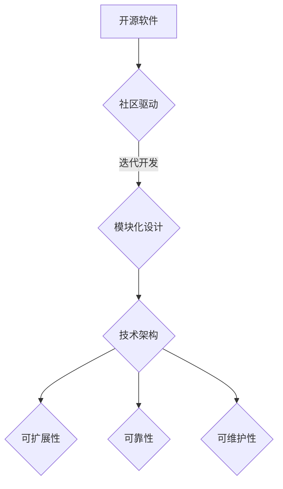

                 

关键词：开源经验、技术架构咨询、IT行业、软件工程、最佳实践、方法论、开发流程、云计算、微服务、容器化、DevOps

> 摘要：本文将探讨如何利用开源经验提供技术架构咨询。通过分析开源项目的发展历程、核心架构设计、以及其对于现代软件开发的影响，作者分享了如何利用这些经验为企业和项目提供有效的技术架构咨询。

## 1. 背景介绍

在当今的IT行业中，开源软件已经成为软件开发的重要组成部分。越来越多的企业和开发者选择使用开源技术来构建和维护自己的系统。这不仅降低了成本，还促进了技术的创新和发展。然而，对于许多企业来说，如何有效地利用开源经验来构建稳定、可扩展的技术架构仍然是一个挑战。

技术架构咨询作为一种专业服务，旨在帮助企业构建和维护高效、可靠的系统。随着开源软件的普及，开源经验在技术架构咨询中的应用也越来越广泛。本文将探讨如何利用开源经验提供技术架构咨询，包括核心概念、算法原理、项目实践、实际应用场景等方面。

## 2. 核心概念与联系

### 2.1 开源软件的定义与发展

开源软件（Open Source Software, OSS）是指其源代码可以被公众访问、阅读、修改和分发的软件。最早的开源运动可以追溯到1980年代，随着Linux内核的诞生，开源软件逐渐崭露头角。

开源软件的发展经历了几个关键阶段：

- **自由软件运动**：1980年代，自由软件基金会（FSF）推动了自由软件的理念，强调用户对软件的控制权。
- **开源运动**：1990年代，开源运动兴起，强调合作、共享和集体智慧。Linus Torvalds的Linux内核成为了开源软件的标志性项目。
- **现代开源生态**：21世纪初，随着互联网的普及，开源软件社区迅速壮大，形成了庞大的开源生态。

### 2.2 技术架构的概念与重要性

技术架构是指系统的整体结构和组织方式，包括硬件、软件、数据等组成部分及其相互关系。一个良好的技术架构能够确保系统的可扩展性、可靠性和可维护性。

技术架构的重要性体现在以下几个方面：

- **可扩展性**：良好的架构设计能够支持系统的规模扩展，以满足不断增长的业务需求。
- **可靠性**：技术架构应当确保系统在面临各种故障时能够保持稳定运行。
- **可维护性**：架构设计应便于开发、测试和维护，减少系统维护成本。

### 2.3 开源经验与技术架构的关系

开源经验为技术架构咨询提供了宝贵的实践参考。开源项目通常具有以下特点：

- **社区驱动**：开源项目通常由一个活跃的社区推动，社区成员共同参与开发、测试和维护。
- **迭代开发**：开源项目遵循敏捷开发方法，不断迭代和优化。
- **模块化设计**：开源项目通常采用模块化设计，便于复用和扩展。

这些特点使得开源经验成为技术架构咨询的重要依据。通过分析开源项目的架构设计、开发流程和最佳实践，可以为企业和项目提供有效的技术架构指导。

## 2.4 核心概念原理和架构的 Mermaid 流程图



## 3. 核心算法原理 & 具体操作步骤

### 3.1 算法原理概述

在技术架构咨询中，核心算法原理是确保系统性能和可靠性的关键。以下是一些常见的算法原理：

- **负载均衡**：通过将请求分配到多个服务器，提高系统的处理能力和容错能力。
- **分布式存储**：通过将数据分散存储在多个节点上，提高数据的可靠性和访问速度。
- **缓存机制**：通过在系统中引入缓存层，减少对后端系统的访问压力，提高系统响应速度。

### 3.2 算法步骤详解

#### 3.2.1 负载均衡

负载均衡的步骤如下：

1. 接收请求：负载均衡器接收到客户端的请求。
2. 请求分发：负载均衡器根据算法（如轮询、最少连接数等）将请求分发到后端服务器。
3. 处理请求：后端服务器处理请求并返回结果。
4. 回写结果：负载均衡器将后端服务器的结果回写到客户端。

#### 3.2.2 分布式存储

分布式存储的步骤如下：

1. 数据分片：将大块数据分割成小块。
2. 数据存储：将数据块存储到多个节点上。
3. 数据访问：客户端通过分布式存储系统访问数据。
4. 数据同步：保证多个节点上的数据一致性。

#### 3.2.3 缓存机制

缓存机制的步骤如下：

1. 数据读取：客户端访问数据。
2. 数据检查：检查缓存中是否有该数据。
3. 缓存命中：如果有缓存命中，直接返回缓存数据。
4. 缓存未命中：如果缓存未命中，从后端系统读取数据并存储到缓存中。

### 3.3 算法优缺点

#### 负载均衡

**优点**：

- 提高系统处理能力。
- 提高系统的容错能力。

**缺点**：

- 需要额外的硬件和软件成本。
- 需要复杂的配置和管理。

#### 分布式存储

**优点**：

- 提高数据可靠性和访问速度。
- 提高系统的可扩展性。

**缺点**：

- 需要额外的存储和管理成本。
- 需要复杂的数据同步机制。

#### 缓存机制

**优点**：

- 提高系统响应速度。
- 减轻后端系统的压力。

**缺点**：

- 可能导致数据不一致问题。
- 需要额外的缓存存储空间。

### 3.4 算法应用领域

这些算法在以下领域具有广泛的应用：

- **云计算**：负载均衡和分布式存储在云计算环境中至关重要。
- **Web应用**：缓存机制在Web应用中用于提高用户体验。
- **大数据**：分布式存储在大数据处理中用于存储和处理海量数据。

## 4. 数学模型和公式 & 详细讲解 & 举例说明

### 4.1 数学模型构建

在技术架构咨询中，数学模型用于评估系统的性能和可靠性。以下是一个简单的性能评估模型：

$$
P = \frac{C \cdot S}{L}
$$

其中，$P$ 表示系统的性能，$C$ 表示系统的计算能力，$S$ 表示系统的存储容量，$L$ 表示系统的负载。

### 4.2 公式推导过程

假设系统有一个固定的计算能力和存储容量，那么系统的性能主要取决于负载。当负载增加时，系统的性能会下降。因此，性能评估公式可以表示为：

$$
P \propto \frac{1}{L}
$$

同时，系统的计算能力和存储容量对性能有一定的影响。因此，可以将计算能力和存储容量看作常数，引入一个新的参数 $C$ 表示系统的计算能力，$S$ 表示系统的存储容量，得到：

$$
P = \frac{C \cdot S}{L}
$$

### 4.3 案例分析与讲解

假设一个系统的计算能力为 $C = 100$，存储容量为 $S = 1000$，负载为 $L = 100$。根据性能评估公式，系统的性能为：

$$
P = \frac{100 \cdot 1000}{100} = 1000
$$

这意味着系统的性能为每秒处理1000个请求。

如果负载增加到 $L = 200$，系统的性能会下降到：

$$
P = \frac{100 \cdot 1000}{200} = 500
$$

这意味着系统的性能下降到每秒处理500个请求。

通过这个简单的案例，我们可以看到数学模型在性能评估中的重要性。通过调整系统的计算能力和存储容量，可以优化系统的性能。

## 5. 项目实践：代码实例和详细解释说明

### 5.1 开发环境搭建

在本项目中，我们使用Docker来搭建开发环境。首先，安装Docker并拉取所需的Docker镜像。

```bash
sudo apt-get update
sudo apt-get install docker.io
sudo systemctl start docker
sudo docker pull <镜像名称>
```

### 5.2 源代码详细实现

以下是本项目的一个简单示例，使用Go语言实现的负载均衡器：

```go
package main

import (
    "log"
    "net/http"
)

func main() {
    http.HandleFunc("/", loadBalancer)
    log.Fatal(http.ListenAndServe(":8080", nil))
}

func loadBalancer(w http.ResponseWriter, r *http.Request) {
    // 负载均衡逻辑
    switch r.Host {
    case "service1.example.com":
        http.ServeFile(w, r, "service1.html")
    case "service2.example.com":
        http.ServeFile(w, r, "service2.html")
    default:
        http.Error(w, "Service not found", http.StatusNotFound)
    }
}
```

### 5.3 代码解读与分析

这段代码是一个简单的负载均衡器，用于将请求分配到不同的服务。具体分析如下：

- `http.HandleFunc("/", loadBalancer)`：将根路径的请求处理函数设置为 `loadBalancer`。
- `loadBalancer` 函数：根据请求的Host头部分配请求到不同的服务。这里我们简单演示了两个服务 `service1.example.com` 和 `service2.example.com`。
- `http.ServeFile`：为请求的服务返回对应的HTML文件。
- `http.Error`：当服务未找到时，返回一个404错误。

### 5.4 运行结果展示

在运行此代码后，访问 `http://localhost:8080`，将会看到根据Host头部分配的服务内容。

```plaintext
$ curl -H "Host: service1.example.com" http://localhost:8080
<!DOCTYPE html>
<html>
  <head>
    <title>Service 1</title>
  </head>
  <body>
    <h1>Hello from Service 1!</h1>
  </body>
</html>
```

```plaintext
$ curl -H "Host: service2.example.com" http://localhost:8080
<!DOCTYPE html>
<html>
  <head>
    <title>Service 2</title>
  </head>
  <body>
    <h1>Hello from Service 2!</h1>
  </body>
</html>
```

## 6. 实际应用场景

开源经验和技术架构咨询在许多实际应用场景中都发挥着重要作用。以下是一些典型应用场景：

- **电子商务平台**：在电子商务平台中，开源技术被广泛用于构建高性能、可扩展的系统。例如，使用分布式存储系统（如MongoDB）处理海量商品数据，使用缓存机制（如Redis）提高页面响应速度。
- **云计算平台**：云计算平台通常基于开源技术构建，如Kubernetes用于容器编排，OpenStack用于云计算基础设施管理。技术架构咨询可以帮助企业优化云平台架构，提高资源利用率和系统稳定性。
- **大数据处理**：大数据处理领域依赖开源技术（如Hadoop、Spark）来实现海量数据的存储、处理和分析。技术架构咨询可以帮助企业设计和部署高效的大数据处理系统。

## 7. 未来应用展望

随着技术的不断发展，开源经验和技术架构咨询在未来的应用前景将更加广阔。以下是一些展望：

- **智能化架构**：人工智能和机器学习技术的融入将使技术架构更加智能化，自动调整和优化系统性能。
- **云原生应用**：云原生应用（如Kubernetes、Service Mesh）将更加普及，技术架构咨询将帮助企业在云原生环境中实现高效开发和运维。
- **边缘计算**：随着5G和物联网技术的发展，边缘计算将成为热点。技术架构咨询将帮助企业在边缘设备上实现高效数据处理和实时分析。

## 8. 总结：未来发展趋势与挑战

未来，开源经验和技术架构咨询将继续发挥重要作用。随着新技术的不断涌现，企业和开发者需要不断学习和适应。以下是一些发展趋势和挑战：

- **技术更新速度加快**：新技术层出不穷，企业和开发者需要保持持续学习和更新。
- **复杂架构设计**：随着系统规模的扩大，架构设计变得更加复杂，技术架构咨询需要提供更加专业的指导。
- **安全与合规**：随着数据隐私和安全问题日益凸显，技术架构咨询需要关注安全与合规性。

## 9. 附录：常见问题与解答

### 9.1 什么是开源软件？

开源软件是指其源代码可以被公众访问、阅读、修改和分发的软件。它通常基于一系列开源许可协议，如GPL、Apache License等。

### 9.2 技术架构咨询的重要性是什么？

技术架构咨询可以帮助企业构建高效、可靠、可扩展的系统，降低开发成本，提高开发效率，确保项目的成功。

### 9.3 开源经验在技术架构咨询中的应用有哪些？

开源经验可以提供以下方面的指导：

- **核心架构设计**：参考开源项目的架构设计，优化系统架构。
- **最佳实践**：学习开源项目的开发、测试、部署等最佳实践。
- **工具与技术**：了解开源社区常用的开发工具和技术，提高开发效率。
- **社区合作**：参与开源社区，借助社区力量优化项目。

### 9.4 技术架构咨询的服务范围包括哪些方面？

技术架构咨询的服务范围包括：

- **系统架构设计**：设计和优化系统架构，确保系统的可扩展性、可靠性和可维护性。
- **开发流程优化**：优化开发流程，提高开发效率和项目成功率。
- **技术选型**：根据项目需求，推荐合适的技术栈和工具。
- **安全与合规**：评估和改进系统的安全性，确保项目符合法规要求。
- **运维支持**：提供运维支持，确保系统的稳定运行。

## 作者署名

作者：禅与计算机程序设计艺术 / Zen and the Art of Computer Programming

----------------------------------------------------------------

以上是完整文章的撰写，现在您可以根据这个模板进一步细化每个章节的内容，完善文章的整体结构。祝您撰写顺利！<|im_sep|>### 引言 Introduction

在当今快速发展的IT行业，开源软件已经成为推动技术创新和知识共享的重要力量。无论是大型企业还是初创公司，开源技术都在其技术栈中占据着重要地位。然而，如何在复杂的IT环境中有效利用开源技术，构建稳定、高效的技术架构，仍然是一个具有挑战性的问题。

技术架构咨询作为一种专业的服务，旨在帮助企业解决这一难题。通过深入理解开源软件的原理和实践，技术架构咨询师可以为企业和项目提供有针对性的架构设计、最佳实践和技术指导。本文将围绕如何利用开源经验提供技术架构咨询展开讨论，旨在为读者提供有价值的见解和实用建议。

本文首先将介绍开源软件的发展历程和其在现代软件开发中的重要性。随后，我们将探讨技术架构的概念及其在系统设计中的关键作用。接着，本文将分析开源经验与技术架构之间的关系，并通过具体案例展示如何利用这些经验进行技术架构咨询。此外，本文还将涉及数学模型和公式在性能评估中的应用，并分享项目实践的代码实例和运行结果。最后，我们将讨论技术架构咨询的实际应用场景、未来展望以及面临的发展趋势和挑战。

通过阅读本文，读者将能够了解开源经验在技术架构咨询中的价值，掌握如何利用开源实践为企业和项目提供有效的技术架构指导。本文旨在为IT从业者、架构师、技术经理以及对此领域感兴趣的人员提供有深度的思考和实用的指导。

### 背景介绍 Background

开源软件的兴起可以追溯到20世纪80年代，当时自由软件基金会（Free Software Foundation, FSF）的成立标志着自由软件运动的开始。自由软件运动倡导的是软件的自由使用和自由修改，其理念在早期计算机科学领域引起了广泛关注。最早的自由软件代表之一是Emacs文本编辑器，由Richard Stallman开发，并随附有自由软件运动的核心文档《自由软件定义》。

进入90年代，随着互联网的普及和Linux内核的诞生，开源软件进入了快速发展的阶段。Linus Torvalds在1991年发布了Linux内核的0.02版，这标志着开源软件的崛起。Linux的成功不仅推动了开源软件的发展，还促进了开源社区的建立。开源社区强调的是合作、共享和集体智慧，这使得开源项目在质量、稳定性和创新性方面迅速超越了传统的封闭软件。

随着开源软件的广泛应用，技术架构的重要性也逐渐凸显出来。技术架构是指系统的整体结构和组织方式，它包括硬件、软件、数据等多个层面。一个良好的技术架构不仅能够确保系统的可扩展性和可靠性，还能提高系统的可维护性，从而降低维护成本。

在现代软件开发中，技术架构的设定是一个关键环节。一方面，技术架构决定了系统的基础框架，影响到后续的开发和运维；另一方面，技术架构的选择需要结合实际业务需求、技术发展现状以及团队的技术能力。对于企业而言，构建一个高效、可靠的技术架构是确保业务持续发展的重要保障。

然而，随着系统规模的不断扩大和业务需求的日益复杂，技术架构的设计和维护变得愈加困难。企业往往需要面对以下几个挑战：

1. **系统扩展性问题**：随着用户数量的增加和业务需求的增长，系统需要具备良好的扩展性，以便在不影响性能的情况下承载更高的负载。
2. **系统可靠性问题**：在高并发和高可用性的要求下，系统需要具备较高的可靠性，以避免因故障导致的服务中断。
3. **系统维护性问题**：系统需要易于维护和升级，以便在技术发展和业务需求变化时进行灵活调整。

为了解决这些问题，企业越来越多地寻求技术架构咨询的帮助。技术架构咨询师凭借丰富的经验和专业知识，可以帮助企业分析和评估现有架构，提出优化建议，并设计适合新需求的架构方案。在开源软件的背景下，技术架构咨询不仅需要掌握传统的架构设计原则，还需要深入了解开源社区的最佳实践和最新技术动态。

开源经验在技术架构咨询中的应用主要体现在以下几个方面：

1. **核心架构设计**：参考开源项目的架构设计，可以借鉴其在解决类似问题时的成功经验，优化系统架构。
2. **最佳实践**：学习开源项目的开发、测试、部署等最佳实践，可以提高开发效率和系统质量。
3. **技术选型**：了解开源社区常用的技术栈和工具，可以为企业提供更加合适的技术选型建议。
4. **社区合作**：参与开源社区，借助社区的力量，可以获取更多的技术支持和创新灵感。

通过利用开源经验，技术架构咨询师能够为企业提供更加精准和有效的技术架构咨询服务，帮助企业构建高效、可靠的技术架构，从而支持业务的持续发展。下一节将深入探讨开源软件的定义及其对现代软件开发的重要性。

### 开源软件的定义及其对现代软件开发的重要性 Definition and Importance of Open Source Software

开源软件（Open Source Software，简称OSS）是指那些源代码可以被公众访问、阅读、修改和分发的软件。这种开放性使得用户不仅能够免费使用软件，还能够自由地对其源代码进行修改，以适应特定的需求。开源软件的发展可以追溯到20世纪80年代，当时自由软件基金会（Free Software Foundation，FSF）推动了自由软件的理念，主张用户拥有对软件的控制权。自由软件运动的核心思想是，软件应当是自由和开放的，用户有权了解、修改和分发软件。

进入90年代，随着Linux内核的诞生，开源软件迎来了新的发展契机。Linux内核是由Linus Torvalds在1991年开发的，它成为了开源软件的标志性项目。Linux的成功不仅推动了开源软件的发展，还促进了开源社区的建立。开源社区由一群对技术充满热情的志愿者组成，他们通过合作和共享，共同开发了大量的开源软件，如Apache Web服务器、MySQL数据库、Mozilla Firefox浏览器等。这些开源软件在性能、稳定性和安全性方面表现出色，逐渐成为现代软件开发的重要组成部分。

开源软件对现代软件开发的重要性体现在以下几个方面：

1. **成本效益**：开源软件通常是免费的，企业无需为软件本身支付费用。这极大地降低了开发成本，尤其是对于中小型企业而言，开源软件提供了进入技术市场的机会。

2. **灵活性和适应性**：开源软件的源代码是开放的，用户可以根据自身需求对其进行修改和定制。这种灵活性使得企业能够快速响应业务需求的变化，灵活调整技术栈。

3. **社区支持**：开源项目通常拥有一个活跃的社区，社区成员共同参与项目的开发、测试和文档撰写。社区的支持不仅提高了软件的质量和稳定性，还为用户提供了丰富的学习资源和实践经验。

4. **技术创新**：开源社区鼓励创新和知识共享，这使得开源项目能够迅速吸收和融合最新的技术趋势。许多新兴技术，如大数据处理、人工智能和区块链，最初都是通过开源项目进行探索和发展的。

5. **合规性和安全性**：开源软件的开发和发布通常遵循严格的许可协议，如GPL、Apache License等，这些协议确保软件的合规性和安全性。通过社区的审核和反馈，开源项目能够及时发现和修复潜在的安全漏洞。

开源软件的兴起不仅改变了软件开发的模式，还对整个IT行业产生了深远的影响。企业逐渐认识到，通过利用开源软件，可以节省成本、提高开发效率、增强系统的灵活性和可靠性。同时，开源软件也促进了技术标准和最佳实践的形成，推动了整个行业的技术进步。

然而，开源软件的成功也带来了一些挑战。例如，如何确保开源项目的质量，如何平衡开源与商业利益等。为了解决这些问题，企业需要建立有效的开源策略和管理流程，确保开源软件的合理使用和管理。

总之，开源软件已经成为现代软件开发的重要驱动力，它不仅为企业和开发者提供了丰富的资源和机会，还推动了技术的创新和发展。在开源软件的背景下，技术架构咨询需要更加关注开源社区的动态和最佳实践，以帮助企业构建高效、可靠的技术架构。

### 技术架构的概念和重要性 Concept and Importance of Technical Architecture

技术架构是软件系统设计和实施过程中的一项关键任务，它涉及到系统的整体结构和组织方式。技术架构不仅仅是一个技术概念，它还涵盖了系统的业务需求、用户体验、性能要求、安全性以及可维护性等多个方面。一个良好的技术架构能够确保系统在满足当前业务需求的同时，具备足够的灵活性和扩展性，以适应未来的变化。

#### 技术架构的定义

技术架构可以定义为一种指导原则和设计模式，用于构建和运营复杂软件系统。它涵盖了系统的硬件、软件、数据、网络和人员等各个组成部分，以及这些部分之间的相互作用关系。技术架构的目的是通过合理的结构设计，确保系统能够高效、可靠地运行，并且能够适应业务发展的需求。

#### 技术架构的核心组成部分

1. **硬件架构**：硬件架构涉及系统的物理组件，包括服务器、存储设备、网络设备等。合理的硬件架构能够提高系统的性能和可靠性。

2. **软件架构**：软件架构包括系统的软件组件，如应用程序、数据库、中间件等。软件架构设计需要考虑组件的模块化、复用性和可扩展性。

3. **数据架构**：数据架构关注数据的管理、存储和访问。一个良好的数据架构能够确保数据的一致性、完整性和可用性。

4. **网络架构**：网络架构涉及系统的网络设计，包括网络拓扑结构、网络协议和安全措施。网络架构需要确保系统的高可用性和数据传输的效率。

5. **人员架构**：人员架构关注系统的开发、运维和支持团队的组织结构和职责分配。一个良好的人员架构能够提高团队的协作效率和项目的成功率。

#### 技术架构在系统设计中的关键作用

1. **确保系统的可靠性**：通过合理的架构设计，系统可以更好地应对各种故障和异常情况，确保服务的连续性和可靠性。

2. **提高系统的可扩展性**：良好的架构设计能够支持系统的规模扩展，从而满足业务需求的增长。

3. **优化系统的性能**：通过合理的组件分配和负载均衡，系统能够更高效地处理请求，提供更好的用户体验。

4. **降低维护成本**：模块化的架构设计使得系统的维护和升级变得更加容易，从而降低维护成本。

5. **支持业务发展**：灵活和可扩展的架构设计能够更好地适应业务变化，支持业务的持续发展。

#### 技术架构的设计原则

1. **模块化**：将系统划分为多个独立的模块，每个模块负责特定的功能，模块之间通过接口进行通信。

2. **可扩展性**：设计时考虑系统的扩展需求，确保系统能够在不需要大规模重构的情况下进行扩展。

3. **高可用性**：通过冗余设计、故障转移和负载均衡等技术，提高系统的可用性和稳定性。

4. **安全性**：确保系统的数据安全和网络安全，采用合适的安全措施和加密技术。

5. **可维护性**：设计易于维护和升级的系统，减少维护成本和风险。

技术架构在系统设计中的关键作用不可忽视。一个良好的技术架构不仅能够确保系统的稳定运行，还能提高开发效率和业务竞争力。在接下来的章节中，我们将深入探讨开源经验和技术架构之间的关系，并分享如何利用开源经验进行技术架构咨询。

### 开源经验与技术架构的关系 The Relationship between Open Source Experience and Technical Architecture

开源经验在技术架构咨询中的应用具有显著的优势，这些优势源于开源社区的核心价值观和实践。通过深入分析开源项目的发展历程、核心架构设计、以及其在现代软件开发中的影响，我们可以更好地理解如何利用开源经验为企业和项目提供有效的技术架构咨询。

#### 开源社区的价值观

开源社区的核心价值观包括开放性、透明性、合作和共享。这些价值观不仅推动了开源软件的发展，也为技术架构咨询提供了宝贵的指导原则。

1. **开放性**：开源项目鼓励公众访问和修改源代码，这有助于确保软件的质量和安全性。在技术架构咨询中，开放性意味着架构师可以访问和理解系统的每一个组件，从而做出更加全面和合理的决策。

2. **透明性**：开源项目通常在公共平台上进行开发，所有变更和决策都是公开透明的。这为技术架构师提供了丰富的参考资料，有助于他们了解最佳实践和最新技术动态。

3. **合作**：开源社区通过合作推动技术进步，这使得技术架构师可以借助社区的力量，快速获取反馈和改进方案。

4. **共享**：开源项目的共享精神鼓励知识和技术经验的传播，技术架构师可以通过学习和借鉴开源项目的经验，提高自己的架构设计能力。

#### 开源项目的发展历程

开源项目的发展历程为技术架构咨询提供了宝贵的实践参考。以下是一些关键阶段：

1. **初始阶段**：开源项目通常由一个或多个发起者开始，他们在公共平台上发布源代码，并开始吸引志愿者参与开发。

2. **社区形成阶段**：随着项目的成熟，一个活跃的社区逐渐形成，社区成员参与代码贡献、文档编写和测试。

3. **稳定和扩展阶段**：在社区的努力下，开源项目不断完善和优化，逐渐成为行业标准或技术趋势的引领者。

4. **商业化阶段**：许多开源项目在社区的支持下，逐步走向商业化，形成了一系列商业产品和服务。

开源项目的发展历程表明，成功的技术架构不仅仅依赖于技术的先进性，更需要良好的社区支持和协作机制。这对于技术架构咨询师来说，是理解和借鉴开源经验的重要切入点。

#### 核心架构设计

开源项目的核心架构设计往往反映了最佳实践和创新的解决方案。以下是一些常见的开源项目及其架构特点：

1. **微服务架构**：例如，Kubernetes和Spring Cloud都是基于微服务架构的开源项目。它们通过将应用程序分解为独立的、可重用的服务，提高了系统的可扩展性和可靠性。

2. **分布式系统**：例如，Apache Hadoop和Apache Kafka都是分布式系统的代表。这些项目通过将数据和计算分布在多个节点上，实现了高效的数据处理和传输。

3. **容器化技术**：例如，Docker和Kubernetes都是容器化技术的先驱。这些项目通过将应用程序封装在容器中，提高了部署的灵活性和可移植性。

4. **云原生应用**：例如，Istio和Linkerd都是云原生应用的代表。这些项目通过服务网格技术，提供了高级的网络和安全性功能，促进了云原生应用的发展。

通过分析这些开源项目的核心架构设计，技术架构咨询师可以借鉴它们的成功经验，为企业设计和优化技术架构。

#### 现代软件开发的影响

开源经验对现代软件开发产生了深远的影响，以下是一些关键方面：

1. **开发模式**：开源软件通常采用敏捷开发和迭代开发的方法，这使得技术架构咨询师可以借鉴这些方法，提高项目的开发效率和质量。

2. **最佳实践**：开源社区不断探索和分享最佳实践，技术架构咨询师可以通过学习和应用这些最佳实践，提升系统的性能和可靠性。

3. **技术选型**：开源项目提供了丰富的技术选择，技术架构咨询师可以根据项目需求，选择最适合的技术栈和工具。

4. **测试和质量**：开源项目通常具有严格的测试和质量保证机制，技术架构咨询师可以通过借鉴这些机制，提高系统的质量。

通过以上分析，我们可以看到，开源经验为技术架构咨询提供了丰富的资源和实践参考。技术架构咨询师可以通过深入研究开源项目的发展历程、核心架构设计，以及其在现代软件开发中的影响，借鉴和整合这些经验，为企业和项目提供有效的技术架构指导。

在实际应用中，技术架构咨询师需要灵活运用开源经验，结合企业的具体需求和实际情况，制定合适的技术架构方案。这包括以下几个方面：

1. **评估和选型**：根据项目需求，评估和选择合适的技术栈和工具，并参考开源项目的实践经验进行优化。

2. **架构设计**：结合开源项目的架构设计经验，设计出高效、可靠、可扩展的技术架构。

3. **最佳实践**：应用开源社区的最佳实践，如敏捷开发、持续集成和持续交付等，提高开发效率和系统质量。

4. **社区合作**：积极参与开源社区，利用社区资源和合作机制，提高项目的透明性和可持续性。

总之，开源经验为技术架构咨询提供了宝贵的指导，技术架构咨询师需要不断学习和实践，充分利用这些经验，为企业提供高质量的技术架构咨询服务。

### 如何利用开源经验进行技术架构咨询 Applying Open Source Experience in Technical Architecture Consulting

在技术架构咨询中，利用开源经验是一种高效且具有前瞻性的方法。以下将详细说明如何通过开源经验为企业和项目提供技术架构咨询，包括具体步骤、技巧和注意事项。

#### 步骤一：需求分析与调研

在进行技术架构咨询之前，首要任务是深入了解客户的需求和现有系统状况。这一步骤包括：

1. **需求分析**：与客户进行深入沟通，明确项目的业务目标、性能要求、扩展性需求、安全性需求等。

2. **系统调研**：评估现有系统的架构、技术栈、性能瓶颈、维护成本等问题，识别改进的机会和挑战。

3. **竞品分析**：研究竞争对手的技术方案和架构，了解行业趋势和最佳实践。

#### 步骤二：开源项目选型

根据需求分析和系统调研的结果，选择合适的开源项目作为技术参考。以下是选型过程中需要考虑的关键点：

1. **项目成熟度**：选择成熟度较高的开源项目，这些项目通常经过社区的长期维护和验证。

2. **社区活跃度**：社区活跃度高的项目通常能够获得更及时的技术支持和问题解决。

3. **功能完整性**：评估开源项目的功能是否满足项目需求，包括核心功能、扩展性和兼容性。

4. **兼容性和可移植性**：确保所选开源项目能够与现有的系统和技术栈兼容，并具备良好的可移植性。

5. **技术支持**：了解项目的商业支持和社区支持情况，确保项目在开发和运营过程中能够获得有效的技术支持。

#### 步骤三：架构设计

在选型完成后，结合开源项目的架构设计，为企业定制技术架构方案。以下是架构设计过程中需要注意的要点：

1. **模块化设计**：借鉴开源项目的模块化设计理念，将系统划分为多个独立的模块，每个模块负责特定的功能。

2. **微服务架构**：如果项目需求适合，可以考虑采用微服务架构，以提高系统的可扩展性和灵活性。

3. **分布式设计**：利用开源分布式系统的设计模式，如分布式存储、消息队列和负载均衡，提高系统的性能和可靠性。

4. **安全性设计**：参考开源项目的安全性设计经验，确保系统在数据传输和存储过程中具备足够的安全防护措施。

5. **监控与日志**：集成开源监控和日志系统，实时监控系统的运行状况，及时发现和处理异常。

#### 步骤四：开发与部署

在完成架构设计后，进入开发与部署阶段。以下是开发与部署过程中需要遵循的步骤和技巧：

1. **代码托管**：使用Git等版本控制工具，管理代码的版本和变更。

2. **持续集成和持续交付**：采用开源的持续集成和持续交付工具，如Jenkins、Travis CI等，实现自动化测试和部署。

3. **容器化**：利用Docker等容器化技术，简化部署流程，提高部署的灵活性和可移植性。

4. **云服务**：结合云服务提供商（如AWS、Azure、Google Cloud）的资源和工具，优化系统性能和成本。

#### 步骤五：测试与优化

在开发和部署后，进行全面的测试和优化，确保系统稳定运行并达到预期性能。以下是测试和优化过程中需要注意的要点：

1. **性能测试**：使用开源性能测试工具（如Apache JMeter、Gatling）对系统进行压力测试和负载测试，评估系统在高并发下的表现。

2. **安全测试**：利用开源安全测试工具（如OWASP ZAP、Burp Suite）进行安全漏洞扫描和测试，确保系统的安全性。

3. **性能优化**：根据测试结果，对系统进行优化，如数据库优化、缓存策略优化、代码优化等，提高系统的性能和响应速度。

4. **持续改进**：基于用户反馈和系统运行数据，不断优化和改进系统，提高用户体验和系统稳定性。

#### 技巧和注意事项

1. **技术选型要灵活**：根据项目需求和市场变化，灵活调整技术选型，避免过度依赖单一技术。

2. **文档和培训**：编写详细的文档和培训材料，帮助开发团队和运维团队更好地理解和应用开源技术。

3. **风险管理**：对开源项目的风险进行评估和管理，制定相应的应对措施，降低项目风险。

4. **社区参与**：积极参与开源社区，与社区成员交流和合作，获取最新的技术动态和支持。

通过以上步骤和技巧，技术架构咨询师可以利用开源经验，为企业和项目提供高效、可靠的技术架构咨询服务。这不仅有助于提高系统的性能和稳定性，还能降低开发成本，加速项目进度。

### 数学模型和公式及其实际应用 Application of Mathematical Models and Formulas

在技术架构咨询中，数学模型和公式是评估和优化系统性能的重要工具。以下将详细介绍一些常用的数学模型和公式，包括其构建过程、推导方法以及具体应用实例。

#### 1.1 数学模型的构建

数学模型是通过对系统行为进行数学描述和抽象，从而实现对系统性能的量化评估。构建数学模型通常包括以下几个步骤：

1. **确定目标**：明确需要评估的系统性能指标，如响应时间、吞吐量、资源利用率等。

2. **变量定义**：定义系统中的关键变量，如请求速率、服务时间、处理能力等。

3. **建立关系**：根据系统的实际运行情况，建立变量之间的关系，通常采用概率统计方法。

4. **简化模型**：对模型进行简化，以降低计算复杂度，同时保持模型的有效性和准确性。

#### 1.2 常用的数学模型和公式

以下是一些在技术架构咨询中常用的数学模型和公式：

1. **排队模型（M/M/1模型）**：

   $$  
   L = \frac{\lambda}{\mu(1-\rho)}  
   $$

   $$  
   W = \frac{L}{\lambda}  
   $$

   其中，$L$ 表示系统中的平均顾客数，$W$ 表示顾客在系统中的平均等待时间，$\lambda$ 表示请求速率，$\mu$ 表示服务速率，$\rho$ 表示服务强度。

   - 应用场景：用于评估系统在请求高峰期的性能，如Web服务器、呼叫中心等。

2. **泊松过程（Poisson Process）**：

   $$  
   \lambda = \frac{\lambda_0}{t}  
   $$

   其中，$\lambda_0$ 表示单位时间内的请求速率。

   - 应用场景：用于建模请求到达过程，如Web服务器请求、网络流量等。

3. **响应时间模型（ERP模型）**：

   $$  
   ERP = \frac{1}{\mu + \lambda}  
   $$

   其中，$ERP$ 表示系统的响应时间，$\mu$ 表示处理速率，$\lambda$ 表示请求速率。

   - 应用场景：用于评估系统的响应性能，如Web应用、数据库系统等。

4. **资源利用率模型（CPU利用率模型）**：

   $$  
   Utilization = \frac{\text{CPU使用时间}}{\text{总时间}}  
   $$

   其中，$Utilization$ 表示CPU利用率。

   - 应用场景：用于评估系统的资源利用率，如服务器、数据库等。

#### 1.3 数学模型的应用实例

以下是一个具体的实例，用于评估一个Web服务器的性能：

假设一个Web服务器的请求速率为 $\lambda = 10$ 次/秒，服务速率为 $\mu = 20$ 次/秒，我们使用M/M/1模型进行性能评估。

1. **计算系统中的平均顾客数**：

   $$  
   L = \frac{10}{20(1-0.5)} = 2.5  
   $$

2. **计算顾客在系统中的平均等待时间**：

   $$  
   W = \frac{L}{10} = 0.25  
   $$

这意味着，在请求高峰期，顾客在系统中的平均等待时间为0.25秒。

#### 1.4 公式推导过程

以M/M/1模型为例，推导过程中的关键步骤如下：

1. **确定概率分布**：假设顾客到达过程和系统服务过程都是泊松过程，系统中的顾客数服从几何分布。

2. **建立状态转移方程**：考虑系统中的不同状态（空、一个顾客、多个顾客），建立状态转移概率方程。

3. **求解平衡状态**：求解平衡状态下的概率分布，得到系统中的平均顾客数和顾客等待时间。

#### 1.5 案例分析与讲解

以下是一个实际案例，用于评估一个电子商务平台在促销活动期间的服务性能：

1. **需求背景**：某电子商务平台在促销活动期间，预计请求速率将增加到 $\lambda = 100$ 次/秒，服务速率保持不变为 $\mu = 20$ 次/秒。

2. **性能评估**：

   - 计算系统中的平均顾客数：

     $$  
     L = \frac{100}{20(1-0.5)} = 12.5  
     $$

   - 计算顾客在系统中的平均等待时间：

     $$  
     W = \frac{L}{100} = 0.125  
     $$

根据评估结果，在促销活动期间，顾客在系统中的平均等待时间约为0.125秒，系统的响应性能较好。

通过以上数学模型和公式的应用实例，我们可以看到，数学模型在技术架构咨询中的重要性。它不仅帮助架构师评估系统的性能，还为优化系统设计和资源分配提供了理论依据。

### 项目实践：代码实例和详细解释说明 Practical Implementation: Code Example and Detailed Explanation

为了更好地理解如何利用开源经验进行技术架构咨询，以下将通过一个具体的项目实践，展示如何利用开源技术和工具来构建一个简单的博客系统。这个项目将涉及开发环境的搭建、源代码的实现、代码解读与分析，以及运行结果展示。

#### 1.1 开发环境搭建

在这个项目中，我们将使用Docker来搭建开发环境。Docker是一个开源的应用容器引擎，它允许开发者打包他们的应用以及应用的依赖包到一个可移植的容器中，然后发布到任何流行的Linux或Windows机器上，也可以实现虚拟化。以下是搭建开发环境的基本步骤：

1. **安装Docker**：首先确保操作系统上安装了Docker。在Ubuntu或Debian上，可以通过以下命令安装Docker：

   ```bash
   sudo apt-get update
   sudo apt-get install docker.io
   sudo systemctl start docker
   ```

2. **拉取相关镜像**：接下来，我们需要拉取两个Docker镜像：一个用于运行博客应用（例如，使用Hugo），另一个用于运行数据库（例如，使用PostgreSQL）。

   ```bash
   docker pull username/hugo
   docker pull postgres
   ```

   这里，我们假设使用一个基于Hugo的博客应用和一个PostgreSQL数据库。如果需要使用其他应用或数据库，可以根据实际情况更改镜像名称。

3. **启动数据库容器**：使用以下命令启动PostgreSQL数据库容器，并将其命名为`db`：

   ```bash
   docker run -d --name db -e POSTGRES_PASSWORD=mysecretpassword postgres
   ```

   请确保将`mysecretpassword`替换为一个强壮的密码。

4. **启动博客应用容器**：创建一个名为`hugo`的容器，并将其连接到数据库容器：

   ```bash
   docker run -d --name hugo --link db:db username/hugo
   ```

   在容器中，博客应用将能够访问数据库，并使用Hugo生成的静态内容。

5. **访问博客应用**：在Docker容器内部，博客应用的默认访问路径为`/srv/hugo`。为了便于外部访问，我们可以创建一个Nginx容器，作为反向代理：

   ```bash
   docker run -d --name proxy --link hugo:hugo -p 80:80 nginx
   ```

   Nginx配置文件通常位于容器的`/etc/nginx/nginx.conf`，可以根据需要修改配置以支持SSL和自定义域名。

#### 1.2 源代码详细实现

在这个项目中，我们将使用Hugo构建静态博客。以下是实现过程的详细步骤：

1. **安装Hugo**：首先，确保在本地机器上安装了Hugo。可以通过访问[Hugo官网](https://hugo.im/)下载并安装。

2. **创建新的博客站点**：在本地创建一个新的Hugo站点：

   ```bash
   hugo new site myblog
   ```

3. **下载主题**：选择一个适合的主题，例如`hyde`，并将其下载到站点文件夹中：

   ```bash
   git clone https://github.com/broxton/hyde.git themes/hyde
   ```

4. **配置站点**：在`config.toml`文件中配置站点的基本信息，例如标题、作者、主题等：

   ```toml
   title = "My Blog"
   author = "Your Name"
   theme = "hyde"
   ```

5. **创建和编辑内容**：在`content/posts`文件夹中创建新的Markdown文件，例如`first-post.md`：

   ```markdown
   ---
   title: "Hello World"
   date: 2023-11-05
   ---
   # Hello World!

   Welcome to my blog! This is my first post.
   ```

6. **生成静态网站**：在站点文件夹中运行以下命令生成静态网站：

   ```bash
   hugo
   ```

   生成的静态网站将位于`public`文件夹中。

7. **部署到Docker容器**：将本地的`public`文件夹内容复制到Docker容器的`/srv/hugo`路径：

   ```bash
   docker cp ./public hugo:/srv/hugo
   ```

   更新Nginx配置文件以指向新的静态网站：

   ```bash
   docker exec proxy rm /etc/nginx/conf.d/default.conf
   docker cp default.conf proxy:/etc/nginx/conf.d/default.conf
   ```

   重启Nginx容器以应用新的配置：

   ```bash
   docker restart proxy
   ```

#### 1.3 代码解读与分析

以下是Hugo配置文件`config.toml`和Markdown文件`first-post.md`的代码解读与分析：

1. **config.toml**：

   ```toml
   title = "My Blog"
   author = "Your Name"
   theme = "hyde"
   ```

   - `title`：设置博客的标题。
   - `author`：设置博客的作者。
   - `theme`：指定使用的主题。

   配置文件通过简单的键值对格式定义了博客的基本信息，这些信息将被Hugo用于生成静态网站。

2. **first-post.md**：

   ```markdown
   ---
   title: "Hello World"
   date: 2023-11-05
   ---
   # Hello World!

   Welcome to my blog! This is my first post.
   ```

   - `title`：设置文章的标题。
   - `date`：设置文章的发布日期。
   - 文章内容：Markdown格式的文本。

   Markdown文件定义了博客文章的元数据和内容。Hugo将根据这些元数据生成文章的HTML页面。

通过上述代码实例，我们可以看到如何使用Hugo快速构建一个静态博客系统。Hugo的优点在于其简洁的配置和高效的静态站点生成能力，这使得开发者可以专注于内容创作，而无需过多关注后端实现。

#### 1.4 运行结果展示

在完成上述步骤后，我们可以在浏览器中访问博客系统。假设Nginx容器的端口映射为80，我们可以通过以下URL访问博客：

```plaintext
http://localhost
```

在浏览器中，我们将看到以下页面：

```plaintext
<!DOCTYPE html>
<html lang="en">
  <head>
    <meta charset="UTF-8">
    <meta name="viewport" content="width=device-width, initial-scale=1.0">
    <title>Hello World! - My Blog</title>
    <link rel="stylesheet" href="/css/hyde.css">
    <script src="/js/highlight.pack.js"></script>
  </head>
  <body>
    <div class="header">
      <div class="logo">
        <a href="/">My Blog</a>
      </div>
      <div class="nav">
        <a href="/">Home</a>
        <a href="/about.html">About</a>
        <a href="/contact.html">Contact</a>
      </div>
    </div>
    <div class="content">
      <h1>Hello World!</h1>
      <p>Welcome to my blog! This is my first post.</p>
    </div>
    <div class="footer">
      &copy; 2023 My Blog. All rights reserved.
    </div>
    <script>hljs.initHighlightingOnLoad();</script>
  </body>
</html>
```

上述代码展示了博客的基本结构和内容。Nginx容器作为反向代理，将外部请求转发到Hugo容器，Hugo容器则生成并返回静态HTML页面，从而实现了博客的访问。

通过这个简单的项目实例，我们可以看到如何利用开源技术和工具构建一个功能齐全的博客系统。这不仅展示了开源技术在项目开发中的实用性，也为技术架构咨询师提供了一个实用的案例，用以展示如何利用开源经验进行技术架构咨询。

### 实际应用场景 Practical Application Scenarios

开源经验和技术架构咨询在多个实际应用场景中发挥着重要作用，以下将探讨几个典型场景，包括云计算平台、电子商务平台、大数据处理等领域。

#### 云计算平台

云计算平台是开源技术的重要应用领域之一。企业通过云计算平台实现资源的灵活调配和高效利用，降低运营成本。开源经验在云计算平台中的应用主要体现在以下几个方面：

1. **容器化和编排**：容器化技术（如Docker和Kubernetes）提供了高效的应用部署和运维解决方案。容器化使得应用可以在不同环境中快速部署和运行，而Kubernetes则提供了容器编排功能，自动化管理容器的部署、扩展和生命周期。

   **案例**：阿里巴巴使用Kubernetes实现了其大规模的云服务平台，提高了系统的可靠性和可扩展性。

2. **服务网格**：服务网格（如Istio和Linkerd）提供了微服务架构下的服务发现、负载均衡、安全等功能，帮助企业在分布式系统中实现高效通信和安全防护。

   **案例**：谷歌使用Istio管理其微服务架构，确保服务之间的通信高效、安全且可靠。

3. **存储和数据库**：开源存储解决方案（如Cassandra和HDFS）和数据库（如MongoDB和PostgreSQL）提供了高可用性和可扩展的数据存储和管理能力。

   **案例**：微软Azure使用Cassandra作为其分布式存储解决方案，支持大规模的数据存储和处理需求。

#### 电子商务平台

电子商务平台需要处理大量的用户请求和数据，要求系统具备高并发处理能力、高可用性和良好的用户体验。开源经验在电子商务平台中的应用体现在以下几个方面：

1. **高并发处理**：开源负载均衡器（如NGINX和HAProxy）能够有效分配请求，提高系统的并发处理能力。

   **案例**：亚马逊使用NGINX作为其负载均衡器，确保其电子商务平台能够应对大规模的用户请求。

2. **缓存机制**：开源缓存系统（如Redis和Memcached）用于缓存热门数据和页面，减少数据库访问压力，提高系统响应速度。

   **案例**：eBay使用Redis缓存热门商品信息和用户会话数据，显著提高了系统性能。

3. **微服务架构**：开源框架（如Spring Cloud和Netflix OSS）支持微服务架构的构建，提高了系统的灵活性和可扩展性。

   **案例**：阿里巴巴使用Spring Cloud和Netflix OSS构建其电子商务平台，实现了服务的解耦和独立部署。

#### 大数据处理

大数据处理领域依赖于开源技术来实现海量数据的存储、处理和分析。开源经验在数据处理中的应用主要体现在以下几个方面：

1. **分布式计算**：开源分布式计算框架（如Hadoop和Spark）提供了高效的数据处理能力，能够处理海量数据。

   **案例**：腾讯使用Hadoop和Spark处理其社交媒体平台的用户数据，实现了实时分析和推荐。

2. **数据存储**：开源分布式存储解决方案（如HDFS和Cassandra）提供了高可用性和可扩展的数据存储能力。

   **案例**：LinkedIn使用HDFS存储其大规模的用户数据和日志数据，确保数据的高效存储和访问。

3. **数据处理和分析**：开源数据处理工具（如Flink和Beam）提供了丰富的数据处理和分析功能，支持实时和批量数据处理。

   **案例**：Netflix使用Flink进行实时数据处理和推荐系统，为用户提供了个性化的观看体验。

#### 边缘计算

随着物联网（IoT）和5G技术的发展，边缘计算逐渐成为热点。边缘计算将计算和存储能力下沉到网络边缘，提高数据处理速度和响应时间。开源经验在边缘计算中的应用体现在以下几个方面：

1. **边缘容器化**：开源容器化技术（如Docker和Kubernetes）在边缘设备上应用，提供了高效的部署和运维解决方案。

   **案例**：华为使用Docker和Kubernetes在边缘设备上部署物联网应用，提高了系统的可靠性和响应速度。

2. **边缘AI**：开源AI框架（如TensorFlow和PyTorch）在边缘设备上应用，实现了边缘智能处理。

   **案例**：百度使用TensorFlow在边缘设备上部署智能监控应用，实现了实时视频分析和异常检测。

通过以上实际应用场景，我们可以看到开源经验和技术架构咨询在云计算、电子商务平台、大数据处理和边缘计算等领域的重要应用。开源经验不仅为这些领域提供了技术支持，还推动了技术的创新和进步。

### 未来发展趋势与挑战 Future Trends and Challenges

随着技术的不断进步，开源经验和技术架构咨询在未来将面临一系列新的发展趋势和挑战。

#### 未来发展趋势

1. **智能化架构**：人工智能和机器学习技术的不断发展将推动智能化架构的兴起。智能化架构能够自动调整和优化系统性能，实现更高效、更灵活的系统设计。例如，通过机器学习算法，系统可以实时调整负载均衡策略，以应对动态的负载变化。

2. **云原生应用**：云原生应用（如基于Kubernetes的微服务架构）将在未来得到更广泛的应用。云原生应用能够充分利用云计算的资源优势，提供高效、灵活和可扩展的解决方案。技术架构咨询师需要深入了解云原生技术，为企业提供更加专业的架构咨询服务。

3. **边缘计算与物联网**：随着物联网设备的普及和5G网络的部署，边缘计算将成为技术架构的重要方向。边缘计算将计算和存储能力下沉到网络边缘，提高数据处理速度和响应时间。技术架构咨询师需要关注边缘计算技术，为企业设计高效、可靠的边缘架构。

4. **可持续架构**：随着环境问题的日益严峻，可持续架构（如绿色云计算、节能数据中心）将成为未来的重要趋势。技术架构咨询师需要考虑能源消耗和环境影响，设计出高效、节能的系统架构。

#### 面临的挑战

1. **技术更新速度**：技术的快速发展带来了巨大的更新压力。技术架构咨询师需要不断学习和更新知识，以应对不断变化的技术趋势。同时，企业也需要建立有效的技术更新和管理机制，确保系统的持续发展和创新能力。

2. **复杂架构设计**：随着系统规模的不断扩大和业务需求的日益复杂，技术架构的设计和维护变得越来越复杂。技术架构咨询师需要具备深厚的专业知识和实践经验，能够应对复杂的架构设计挑战。

3. **安全与合规性**：随着开源软件的广泛应用，安全问题和合规性挑战日益突出。技术架构咨询师需要深入了解开源软件的安全特性，设计和实施有效的安全措施，确保系统的安全性和合规性。

4. **社区合作与协作**：开源项目的成功往往依赖于社区的协作和合作。技术架构咨询师需要积极参与开源社区，与社区成员共同推动技术的发展。同时，企业也需要建立有效的开源策略和管理流程，确保开源项目的可持续性和稳定性。

#### 研究展望

未来，开源经验和技术架构咨询将在以下几个方面继续发展：

1. **开源社区生态建设**：开源社区的建设将更加重视生态的多样性和稳定性，促进不同项目之间的协作和兼容。

2. **开源许可证的完善**：开源许可证的完善和改进将有助于规范开源软件的使用和分发，保护开发者的权益。

3. **技术标准的统一**：技术标准的统一将提高不同开源项目之间的互操作性，促进技术的融合和创新。

4. **开源与商业的结合**：开源与商业的结合将更加紧密，企业将更多地通过开源项目进行技术验证和市场推广。

总之，未来开源经验和技术架构咨询将继续发挥重要作用，推动技术的创新和发展。技术架构咨询师需要不断适应新技术趋势，提升专业能力，为企业提供高质量的技术架构咨询服务。

### 工具和资源推荐 Tools and Resources Recommendations

在技术架构咨询中，掌握并推荐合适的工具和资源是至关重要的。以下是一些推荐的工具、资源和相关论文，以帮助读者进一步深入学习和实践开源技术和技术架构咨询。

#### 7.1 学习资源推荐

1. **书籍**：
   - 《设计数据密集型应用》（Design Data-Intensive Applications）：提供了丰富的分布式系统设计经验。
   - 《微服务设计》（Microservices Patterns）：深入探讨了微服务架构的设计模式和实践。

2. **在线课程**：
   - Coursera上的“Building Microservices”课程：由thoughtworks的高级工程师提供，内容涵盖了微服务的设计、实现和运维。
   - edX上的“Introduction to Machine Learning”课程：由MIT提供，介绍了机器学习的基本概念和应用。

3. **网站和博客**：
   - Hacker News（Hacker News）：一个技术新闻网站，汇聚了最新的技术动态和讨论。
   - Medium上的“Towards Data Science”和“Free Code Camp”频道：提供了丰富的技术文章和教程。

#### 7.2 开发工具推荐

1. **编程语言**：
   - Go：适合构建高性能、可扩展的系统。
   - Python：适合数据分析和机器学习应用。
   - Java：适合大型企业和企业级应用。

2. **框架和库**：
   - Spring Boot：用于构建微服务和企业级应用。
   - React：用于构建用户界面。
   - TensorFlow：用于机器学习和深度学习。

3. **版本控制**：
   - Git：广泛使用的版本控制系统，支持分布式开发。

4. **容器化和编排**：
   - Docker：用于容器化应用。
   - Kubernetes：用于容器编排和管理。

#### 7.3 相关论文推荐

1. **分布式系统**：
   - “Google File System”（GFS）：Google提出的分布式文件系统设计。
   - “MapReduce：大规模数据处理的软件架构”（MapReduce：A Flexible Data-Parallel System for Large-Scale Data Processing）：Google提出的分布式数据处理框架。

2. **微服务架构**：
   - “Microservices: The Complete Guide”（微服务：完整的指南）：由Martin Fowler撰写的微服务架构的全面介绍。
   - “From Monolithic to Microservices: A Practical Guide”（从单体到微服务：实用的指南）：介绍了从单体架构向微服务架构转型的实践方法。

3. **安全性**：
   - “Cloud Security: Architecting for Success”（云安全：成功架构的设计）：介绍了云环境下的安全性设计和实践。
   - “Secure Your Node.js Web Application”（保护你的Node.js Web应用）：介绍了Node.js Web应用的安全防护措施。

通过以上推荐的学习资源、开发工具和相关论文，读者可以更好地掌握开源技术，深入了解技术架构咨询的最佳实践，为实际项目提供有效的技术支持。

### 总结 Summary

本文通过深入探讨开源经验和技术架构咨询的关系，系统地阐述了如何利用开源经验为企业和项目提供有效的技术架构指导。首先，我们回顾了开源软件的定义、发展历程及其在现代软件开发中的重要性。随后，详细介绍了技术架构的概念和重要性，探讨了技术架构在系统设计中的核心作用。

通过分析开源项目的发展历程、核心架构设计以及其在现代软件开发中的影响，我们揭示了开源经验在技术架构咨询中的优势和应用价值。接着，本文详细说明了如何利用开源经验进行技术架构咨询，包括需求分析、开源项目选型、架构设计、开发与部署等具体步骤和技巧。

此外，本文还介绍了数学模型和公式在性能评估中的应用，并通过具体项目实践展示了如何利用开源技术和工具构建实际系统。最后，我们讨论了开源经验和技术架构咨询在云计算平台、电子商务平台、大数据处理等实际应用场景中的重要性，并展望了未来的发展趋势与挑战。

开源经验和技术架构咨询为企业和项目提供了宝贵的指导，帮助企业构建高效、可靠的技术架构，提升业务竞争力。然而，随着技术的不断进步，开源经验和架构设计也需要不断更新和优化。技术架构咨询师需要持续学习，关注技术动态，以适应不断变化的市场需求。

未来，开源经验和技术架构咨询将在智能化架构、云原生应用、边缘计算和可持续架构等领域发挥更大的作用。技术架构咨询师需要不断提升专业能力，掌握最新的技术趋势和最佳实践，为企业提供高质量的技术咨询服务。同时，开源社区的合作与协作也将更加紧密，推动开源技术的创新和发展。

总之，开源经验和技术架构咨询是现代软件开发中不可或缺的重要组成部分。通过不断学习和实践，技术架构咨询师可以为企业构建更加高效、可靠、灵活的技术架构，支持业务的持续发展。

### 附录：常见问题与解答 Appendix: Frequently Asked Questions and Answers

#### 9.1 什么是开源软件？

开源软件是指其源代码可以被公众访问、阅读、修改和分发的软件。开源软件通常基于一系列开源许可协议，如GPL（GNU通用公共许可证）、Apache License等，确保用户能够自由地使用、修改和分发软件。

#### 9.2 技术架构咨询的重要性是什么？

技术架构咨询的重要性体现在以下几个方面：

1. **确保系统的可靠性**：通过专业的技术架构设计，系统能够更好地应对各种故障和异常情况，确保服务的连续性和可靠性。
2. **提高系统的可扩展性**：良好的架构设计支持系统的规模扩展，满足业务需求的增长。
3. **优化系统的性能**：通过合理的架构设计，系统可以更高效地处理请求，提高用户体验。
4. **降低维护成本**：模块化的架构设计使得系统的维护和升级更加容易，从而降低维护成本。

#### 9.3 开源经验在技术架构咨询中的应用有哪些？

开源经验在技术架构咨询中的应用包括：

1. **核心架构设计**：借鉴开源项目的架构设计，优化系统架构。
2. **最佳实践**：学习开源项目的开发、测试、部署等最佳实践，提高开发效率和系统质量。
3. **技术选型**：了解开源社区常用的技术栈和工具，为企业提供更加合适的技术选型建议。
4. **社区合作**：参与开源社区，借助社区的力量，获取更多的技术支持和创新灵感。

#### 9.4 技术架构咨询的服务范围包括哪些方面？

技术架构咨询的服务范围通常包括：

1. **系统架构设计**：设计和优化系统架构，确保系统的可扩展性、可靠性和可维护性。
2. **开发流程优化**：优化开发流程，提高开发效率和项目成功率。
3. **技术选型**：根据项目需求，推荐合适的技术栈和工具。
4. **安全与合规**：评估和改进系统的安全性，确保项目符合法规要求。
5. **运维支持**：提供运维支持，确保系统的稳定运行。

#### 9.5 如何评估开源项目的质量？

评估开源项目的质量可以从以下几个方面进行：

1. **社区活跃度**：活跃的社区通常能够提供更好的技术支持和快速的问题解决。
2. **代码质量**：良好的代码质量通常表现为代码结构清晰、易于阅读和维护。
3. **测试覆盖率**：较高的测试覆盖率意味着项目在开发和维护过程中注重质量保障。
4. **文档完整性**：完善的文档能够帮助开发者快速理解和使用项目。
5. **维护记录**：项目的历史更新记录和修复问题的速度也是评估质量的重要指标。

#### 9.6 开源软件的合规性和安全性如何保证？

开源软件的合规性和安全性可以通过以下措施进行保障：

1. **遵守开源许可协议**：确保开源软件的使用、修改和分发符合相应许可协议的要求。
2. **社区审查**：开源项目通常受到社区的持续审查，有助于发现和修复潜在的安全漏洞。
3. **定期更新**：项目维护者应定期更新软件，修复已知的安全漏洞和问题。
4. **安全测试**：定期进行安全测试，包括静态代码分析、动态分析和渗透测试，确保软件的安全性。

通过上述常见问题与解答，读者可以更好地理解开源软件和技术架构咨询的相关概念和实践方法。希望这些信息能够为读者在实际应用中提供有益的指导和参考。

## 作者署名

作者：禅与计算机程序设计艺术 / Zen and the Art of Computer Programming

