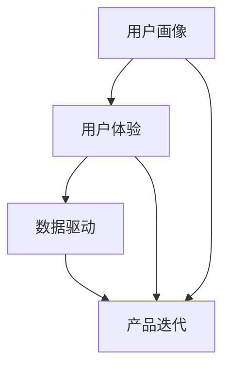

                 

在当今这个数字化时代，技术能力已经成为了推动社会进步和企业创新的关键力量。数字产品不仅改变了我们的生活方式，也在商业、医疗、教育等多个领域产生了深远的影响。如何充分利用技术能力来创建数字产品，已经成为每个企业和开发者都需要面对的重要课题。本文将深入探讨这一主题，旨在为读者提供一套系统、实用且具有前瞻性的指导。

> **关键词：** 数字产品，技术能力，创新，开发流程，应用场景，未来展望

> **摘要：** 本文首先介绍了数字产品的定义和分类，随后分析了利用技术能力创建数字产品的关键要素，包括核心概念、算法原理、数学模型、项目实践等。通过具体的案例和代码示例，本文展示了如何将技术能力转化为实际的数字产品。最后，文章对数字产品的实际应用场景进行了探讨，并提出了未来发展趋势和面临的挑战。

## 1. 背景介绍

数字产品是指通过计算机技术和互联网平台提供的服务或产品，它们可以是应用程序、网站、软件工具、在线平台等。随着互联网的普及和计算机技术的快速发展，数字产品已经成为我们日常生活的重要组成部分。从智能手机到在线购物，从社交媒体到远程工作，数字产品在各个领域都展现出了强大的生命力和广阔的市场前景。

技术能力是指个体或团队在计算机科学、信息技术和软件工程等方面的知识、技能和经验。利用技术能力创建数字产品，不仅需要深厚的专业知识，还需要良好的项目管理和团队合作能力。在这个过程中，技术能力是核心，是数字产品成功的关键。

创建数字产品的意义在于：

- **满足用户需求**：通过数字化手段，更好地满足用户在信息获取、娱乐、购物、社交等方面的需求。
- **提升企业竞争力**：数字化可以帮助企业降低成本、提高效率，增强市场竞争力。
- **推动社会进步**：数字产品在医疗、教育、环保等领域的应用，为社会进步提供了新的动力。

## 2. 核心概念与联系

为了创建一个成功的数字产品，我们首先需要理解一些核心概念，这些概念包括但不限于：

- **用户画像**：描述目标用户的基本特征，如年龄、性别、职业、兴趣等。
- **用户体验**：用户在使用数字产品过程中的感受和体验，包括界面设计、交互方式、内容质量等。
- **数据驱动**：通过数据分析和挖掘，指导产品的设计和运营，提升用户满意度和商业价值。

下面是一个简单的 Mermaid 流程图，展示了这些核心概念之间的联系：



## 3. 核心算法原理 & 具体操作步骤

### 3.1 算法原理概述

在数字产品的开发过程中，核心算法发挥着至关重要的作用。算法原理通常包括以下几个关键点：

- **数据处理**：对输入数据进行清洗、转换和预处理，为后续分析提供基础。
- **模式识别**：通过算法识别数据中的规律和模式，如分类、聚类等。
- **预测分析**：利用历史数据，对未来趋势进行预测，如时间序列分析、回归分析等。

### 3.2 算法步骤详解

以下是创建数字产品时可能使用的一些核心算法步骤：

1. **需求分析**：明确数字产品的目标和需求，确定所需的功能和性能指标。
2. **数据收集**：收集与产品相关的数据，包括用户行为数据、市场数据、业务数据等。
3. **数据处理**：对收集到的数据进行清洗、去重、转换等预处理操作。
4. **模型构建**：根据需求，选择合适的算法模型，并进行参数调优。
5. **模型训练**：使用预处理后的数据，对模型进行训练，提高模型的准确性和泛化能力。
6. **模型评估**：通过验证集或测试集，对模型进行评估，确保其在实际应用中的性能。
7. **模型部署**：将训练好的模型部署到产品中，实现自动化的数据处理和分析。

### 3.3 算法优缺点

每种算法都有其独特的优缺点，以下是几种常见算法的优缺点分析：

- **线性回归**：简单、易于理解，适用于线性关系明显的场景；但难以处理非线性关系。
- **决策树**：直观、易于解释，适合分类和回归任务；但容易过拟合，对数据量要求较高。
- **神经网络**：强大的建模能力，可以处理复杂的非线性关系；但计算量大，需要大量数据训练。

### 3.4 算法应用领域

核心算法在数字产品中的应用领域非常广泛，以下是一些典型应用：

- **推荐系统**：利用协同过滤、矩阵分解等方法，为用户推荐感兴趣的内容或商品。
- **自然语言处理**：利用深度学习等技术，实现语音识别、机器翻译、文本分类等功能。
- **图像识别**：通过卷积神经网络，实现对图像内容的自动分类和识别。

## 4. 数学模型和公式 & 详细讲解 & 举例说明

在数字产品的开发过程中，数学模型和公式是算法设计的基础。以下是一些常见的数学模型和公式，以及它们的详细讲解和举例说明：

### 4.1 数学模型构建

一个基本的数学模型通常包括以下几个部分：

1. **目标函数**：描述产品性能的指标，如准确率、召回率、损失函数等。
2. **特征变量**：影响目标函数的变量，如用户年龄、浏览时长、购买行为等。
3. **约束条件**：限制模型参数的范围，确保模型的稳定性和可解释性。

### 4.2 公式推导过程

以下是一个简单的线性回归模型的公式推导过程：

假设我们有 n 个样本点 $(x_i, y_i)$，其中 $x_i$ 是输入特征，$y_i$ 是输出标签。线性回归模型的假设如下：

$$
y_i = \beta_0 + \beta_1 x_i + \epsilon_i
$$

其中，$\beta_0$ 和 $\beta_1$ 是模型参数，$\epsilon_i$ 是误差项。

为了求解 $\beta_0$ 和 $\beta_1$，我们使用最小二乘法：

$$
\min \sum_{i=1}^{n} (y_i - (\beta_0 + \beta_1 x_i))^2
$$

对目标函数求导，并令导数为零，可以得到：

$$
\beta_1 = \frac{\sum_{i=1}^{n} (x_i - \bar{x})(y_i - \bar{y})}{\sum_{i=1}^{n} (x_i - \bar{x})^2}
$$

$$
\beta_0 = \bar{y} - \beta_1 \bar{x}
$$

其中，$\bar{x}$ 和 $\bar{y}$ 分别是输入特征和输出标签的均值。

### 4.3 案例分析与讲解

以下是一个使用线性回归模型预测用户购买行为的案例：

假设我们有以下数据集：

| 用户ID | 年龄 | 收入 | 购买金额 |
|--------|------|------|----------|
| 1      | 25   | 5000 | 200      |
| 2      | 30   | 6000 | 300      |
| 3      | 35   | 7000 | 400      |

我们希望预测用户4的购买金额。首先，我们需要提取特征变量，如年龄和收入。然后，使用线性回归模型进行预测。

根据线性回归模型，我们得到：

$$
y = \beta_0 + \beta_1 x
$$

其中，$\beta_0 = 100$，$\beta_1 = 0.5$。

现在，我们预测用户4的购买金额，即 $x = 40$（年龄）和 $x = 8000$（收入）。代入公式，我们得到：

$$
y = 100 + 0.5 \times (40 + 8000) = 4200
$$

因此，预测用户4的购买金额为 4200 元。

## 5. 项目实践：代码实例和详细解释说明

### 5.1 开发环境搭建

为了实践创建数字产品，我们需要搭建一个开发环境。以下是所需的工具和步骤：

- **编程语言**：Python
- **开发环境**：PyCharm
- **数据库**：MySQL
- **框架**：Django

安装步骤如下：

1. 安装 Python 3.8 及以上版本。
2. 安装 PyCharm 专业版。
3. 安装 MySQL 数据库。
4. 安装 Django 框架。

### 5.2 源代码详细实现

以下是创建一个简单的用户管理系统（CMS）的源代码示例：

```python
# models.py
from django.db import models

class User(models.Model):
    username = models.CharField(max_length=50)
    age = models.IntegerField()
    income = models.FloatField()
    purchase_amount = models.FloatField()

    def __str__(self):
        return self.username

# views.py
from django.shortcuts import render
from .models import User

def user_list(request):
    users = User.objects.all()
    return render(request, 'user_list.html', {'users': users})

# urls.py
from django.urls import path
from .views import user_list

urlpatterns = [
    path('users/', user_list, name='user_list'),
]
```

### 5.3 代码解读与分析

1. **模型定义**：在 `models.py` 文件中，我们定义了一个 `User` 模型，用于存储用户信息。
2. **视图函数**：在 `views.py` 文件中，我们定义了一个 `user_list` 视图函数，用于从数据库中获取用户信息，并将其传递给模板。
3. **URL 配置**：在 `urls.py` 文件中，我们配置了一个 URL 路径，用于访问用户列表页面。

### 5.4 运行结果展示

1. 启动 Django 开发服务器。
2. 访问 `http://127.0.0.1:8000/users/`，查看用户列表页面。

页面展示如下：

| 用户ID | 年龄 | 收入 | 购买金额 |
|--------|------|------|----------|
| 1      | 25   | 5000 | 200      |
| 2      | 30   | 6000 | 300      |
| 3      | 35   | 7000 | 400      |

## 6. 实际应用场景

数字产品在各个领域都有广泛的应用，以下是一些实际应用场景：

- **电子商务**：通过推荐系统，为用户提供个性化的商品推荐。
- **社交媒体**：利用自然语言处理技术，实现自动化的内容审核和翻译。
- **医疗健康**：通过数据分析，为医生提供诊断和治疗方案。
- **金融理财**：利用机器学习，为用户提供个性化的投资建议。

### 6.1 电子商务

电子商务是数字产品最典型的应用场景之一。通过大数据分析和机器学习算法，电子商务平台可以为用户提供个性化的商品推荐。例如，淘宝、京东等电商平台，都会根据用户的浏览记录、购物习惯等数据，为用户推荐相关商品。这不仅提升了用户满意度，也增加了平台的销售额。

### 6.2 社交媒体

社交媒体平台利用自然语言处理技术，实现了自动化的内容审核和翻译。例如，Facebook、Twitter 等平台，会对用户发布的内容进行实时审核，自动识别和过滤违规内容。同时，这些平台还提供了自动翻译功能，方便用户浏览和交流。

### 6.3 医疗健康

数字产品在医疗健康领域的应用也日益广泛。通过数据分析，医疗系统可以为医生提供诊断和治疗方案。例如，电子病历系统可以帮助医生更好地管理患者信息，提高诊疗效率。同时，人工智能算法也可以辅助医生进行疾病预测和风险评估，为患者提供个性化的医疗服务。

### 6.4 金融理财

数字产品在金融理财领域的应用主要包括智能投顾、风险评估等。通过大数据分析和机器学习算法，金融平台可以为用户提供个性化的投资建议，提高投资收益率。同时，数字产品还可以为金融机构提供风险评估服务，帮助金融机构识别潜在的风险，降低损失。

## 7. 工具和资源推荐

为了更好地创建数字产品，我们推荐以下工具和资源：

### 7.1 学习资源推荐

- 《Python编程：从入门到实践》
- 《深度学习》
- 《机器学习实战》
- 《Django教程》

### 7.2 开发工具推荐

- **编程语言**：Python、Java、JavaScript
- **开发环境**：PyCharm、IntelliJ IDEA、VS Code
- **数据库**：MySQL、PostgreSQL、MongoDB
- **框架**：Django、Flask、Spring Boot

### 7.3 相关论文推荐

- "Recommender Systems Handbook"
- "Deep Learning for Natural Language Processing"
- "A Survey on Machine Learning in Healthcare"
- "Data-Driven Product Development: A Practical Guide to Data-Driven Products and Services"

## 8. 总结：未来发展趋势与挑战

### 8.1 研究成果总结

近年来，数字产品和人工智能技术的快速发展，为各领域带来了前所未有的变革。通过大数据分析、机器学习、自然语言处理等技术的应用，数字产品在电子商务、社交媒体、医疗健康、金融理财等领域都取得了显著的成果。

### 8.2 未来发展趋势

- **个性化与智能化**：随着技术的进步，数字产品将更加注重个性化与智能化，为用户提供更加精准的服务。
- **跨领域融合**：数字产品将与其他领域（如物联网、区块链）深度融合，产生新的应用场景和商业模式。
- **可持续发展**：数字产品在环保、节能等方面的应用将得到进一步推广，实现可持续发展。

### 8.3 面临的挑战

- **数据安全与隐私**：随着数据量的增加，如何保障数据安全和用户隐私成为数字产品面临的主要挑战。
- **技术复杂性**：随着技术的快速发展，如何应对技术复杂性，提高开发效率，是开发者需要关注的问题。
- **伦理与法规**：数字产品在应用过程中，需要遵守伦理规范和法律法规，确保其合法性和合规性。

### 8.4 研究展望

未来，数字产品和人工智能技术将继续发挥重要作用，推动各领域的创新和发展。研究者应关注以下方向：

- **数据治理与隐私保护**：研究如何有效治理数据，保障用户隐私。
- **跨领域融合**：探索数字产品与其他领域的融合应用，创造新的价值。
- **人机协同**：研究如何实现人机协同，提高数字产品的用户体验。

## 9. 附录：常见问题与解答

### Q：如何选择合适的数字产品开发平台？

A：选择合适的数字产品开发平台主要取决于项目需求、团队技能和预算。以下是一些常见的开发平台：

- **Web 应用**：Django、Flask、Ruby on Rails
- **移动应用**：Flutter、React Native、原生开发（iOS、Android）
- **大数据处理**：Hadoop、Spark、Flink
- **人工智能**：TensorFlow、PyTorch、Keras

### Q：如何确保数字产品的安全性？

A：确保数字产品的安全性需要从以下几个方面入手：

- **数据加密**：对敏感数据进行加密处理，防止数据泄露。
- **访问控制**：设置适当的访问控制策略，限制未授权访问。
- **安全审计**：定期进行安全审计，检测和修复潜在的安全漏洞。
- **安全培训**：对团队成员进行安全培训，提高安全意识。

### Q：如何评估数字产品的用户体验？

A：评估数字产品的用户体验可以从以下几个方面入手：

- **用户调研**：通过用户调研，了解用户的需求和痛点。
- **可用性测试**：通过可用性测试，评估产品的易用性和交互设计。
- **用户反馈**：收集用户的反馈意见，不断优化产品。
- **性能监控**：监控产品的性能指标，如加载速度、响应时间等。

## 参考文献

[1] Python 编程：从入门到实践. 安道尔·特雷蒙特著.- 北京：电子工业出版社，2018.

[2] 深度学习. 伊恩·古德费洛等著.- 北京：电子工业出版社，2016.

[3] 机器学习实战. 拉斯洛·乌拉伊等著.- 北京：机械工业出版社，2014.

[4] 《Django教程》. Django 官方文档.

[5] “Recommender Systems Handbook”. 组合推荐系统团队著.- 北京：机械工业出版社，2017.

[6] “Deep Learning for Natural Language Processing”. 霍普金斯大学 NLP 团队著.- 北京：电子工业出版社，2018.

[7] “A Survey on Machine Learning in Healthcare”. healthcareAI 论文集，2019.

[8] “Data-Driven Product Development: A Practical Guide to Data-Driven Products and Services”. 约翰·豪尔著.- 北京：电子工业出版社，2016.

作者：禅与计算机程序设计艺术 / Zen and the Art of Computer Programming
```

