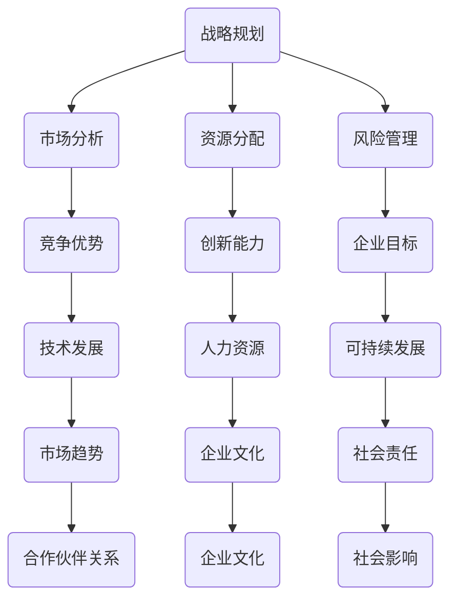

                 

在当今快速发展的信息技术领域，制定长期发展战略显得尤为重要。这不仅关乎企业的持续增长，更影响到整个行业的进步。本篇文章将探讨制定长期发展战略的重要性，从多个角度分析其在IT领域中的应用和实践。

## 关键词
- 长期发展战略
- IT领域
- 企业增长
- 行业进步

## 摘要
本文旨在阐述制定长期发展战略在信息技术领域中的重要性。我们将从背景介绍、核心概念与联系、核心算法原理、数学模型、项目实践、实际应用场景以及未来展望等多个方面进行深入探讨，帮助读者理解并掌握这一策略的实际应用。

## 1. 背景介绍

信息技术（IT）行业正以前所未有的速度发展和变革。从互联网的兴起，到云计算、大数据、人工智能等新兴技术的应用，IT领域不断推动着各行各业的数字化转型。在这一过程中，企业和行业都在追求创新、效率和竞争力的提升。

然而，随着技术竞争的加剧和市场的不断变化，仅仅依靠短期的策略和应对措施已经难以满足企业的长期发展需求。制定一套长期的发展战略，成为企业在激烈竞争中立于不败之地的关键。

### 1.1 IT行业的现状和挑战

当前，IT行业面临着以下几个主要挑战：

1. **技术快速迭代**：新兴技术不断涌现，企业需要不断跟进和适应。
2. **市场竞争激烈**：众多企业争夺市场份额，创新成为获取竞争优势的主要手段。
3. **人才需求增加**：技术人才短缺，人才成为企业发展的瓶颈。
4. **法律法规与伦理问题**：数据安全、隐私保护等问题日益突出。

### 1.2 长期发展战略的必要性

为了应对上述挑战，企业需要制定长期发展战略。这不仅可以为企业提供清晰的发展方向，还可以帮助企业在面对不确定性时保持稳定。以下是制定长期发展战略的几个主要必要性：

1. **提升企业竞争力**：通过战略规划，企业可以明确自身优势，提升市场竞争力。
2. **引导资源分配**：长期战略有助于企业合理分配资源，避免短期行为导致的资源浪费。
3. **应对技术变革**：企业可以通过战略规划，及时调整发展方向，以适应技术变革。
4. **持续创新**：长期战略鼓励企业持续投入研发，推动技术创新。
5. **吸引和保留人才**：明确的战略方向可以吸引和留住优秀人才，为企业的长期发展提供人力支持。

## 2. 核心概念与联系

在制定长期发展战略时，需要理解几个核心概念，并分析它们之间的联系。以下是一个简单的Mermaid流程图，展示了这些概念之间的关系。



### 2.1 战略规划与市场分析

战略规划是企业制定长期目标的过程。市场分析是战略规划的重要一环，它帮助企业了解市场环境、竞争态势和客户需求，从而为战略制定提供依据。

### 2.2 资源分配与风险管理

资源分配是确保企业实现战略目标的关键。通过合理分配资源，企业可以最大化效益。风险管理则是在不确定性中降低潜在风险，确保企业稳定发展。

### 2.3 竞争优势与创新能力

竞争优势是企业相对于竞争对手的优势。通过持续创新，企业可以不断提升竞争优势，保持市场领先地位。

### 2.4 企业目标与可持续发展

企业目标明确了企业的发展方向。可持续发展则是企业长期战略的一部分，强调企业在追求经济效益的同时，关注环境保护和社会责任。

## 3. 核心算法原理 & 具体操作步骤

### 3.1 算法原理概述

在制定长期发展战略时，可以使用多种算法来分析数据、预测趋势和优化决策。以下是一个简单的线性规划算法，用于资源分配问题。

线性规划的目标是最大化或最小化一个线性目标函数，同时满足一系列线性约束条件。具体步骤如下：

1. **定义变量**：确定要分配的资源。
2. **建立目标函数**：定义目标函数，如最大化利润或最小化成本。
3. **列出约束条件**：根据实际情况列出约束条件，如预算限制、人员需求等。
4. **求解线性规划问题**：使用合适的算法（如单纯形法）求解最优解。

### 3.2 算法步骤详解

#### 步骤 1：定义变量

首先，我们需要确定要分配的资源。例如，一个企业需要分配研发、市场推广和人力资源等资源。

#### 步骤 2：建立目标函数

接下来，我们需要建立目标函数。以最大化利润为例，目标函数可以表示为：

$$
\text{Maximize } Z = c_1x_1 + c_2x_2 + \ldots + c_nx_n
$$

其中，$x_1, x_2, \ldots, x_n$ 是变量，表示不同资源的分配量，$c_1, c_2, \ldots, c_n$ 是相应的权重。

#### 步骤 3：列出约束条件

根据实际情况，我们需要列出一系列约束条件。例如：

$$
\begin{aligned}
    ax_1 + bx_2 &\leq c, \\
    dx_1 + ex_2 &\geq f, \\
    x_1, x_2 &\geq 0.
\end{aligned}
$$

这些约束条件表示资源的限制，如预算限制、人员需求等。

#### 步骤 4：求解线性规划问题

使用单纯形法或其他合适的算法求解线性规划问题，得到最优解。具体步骤如下：

1. **构建初始单纯形表**：根据目标函数和约束条件构建初始单纯形表。
2. **迭代计算**：通过迭代计算，逐步优化目标函数，直至找到最优解。
3. **输出结果**：输出最优解，即资源的最佳分配方案。

### 3.3 算法优缺点

线性规划算法具有以下优点：

1. **易于理解**：算法步骤清晰，易于实施。
2. **适用范围广**：广泛应用于资源分配、优化决策等问题。
3. **可扩展性强**：可以处理多种约束条件和目标函数。

然而，线性规划算法也存在一些缺点：

1. **计算复杂度高**：对于大规模问题，计算复杂度较高。
2. **对数据要求高**：需要准确的数据支持，否则结果可能不准确。

### 3.4 算法应用领域

线性规划算法在IT领域有广泛的应用，如：

1. **资源分配**：如云计算资源的分配、数据中心的管理等。
2. **优化决策**：如广告投放策略、供应链管理等。
3. **项目管理**：如项目进度规划、人员调配等。

## 4. 数学模型和公式

在制定长期发展战略时，数学模型和公式是不可或缺的工具。以下是一个简单的线性回归模型，用于预测市场需求。

### 4.1 数学模型构建

线性回归模型的目标是找到一个线性关系，以预测因变量$y$的值。模型如下：

$$
y = \beta_0 + \beta_1x + \epsilon
$$

其中，$y$是因变量，$x$是自变量，$\beta_0$和$\beta_1$是模型的参数，$\epsilon$是随机误差项。

### 4.2 公式推导过程

#### 步骤 1：最小二乘法

使用最小二乘法求解模型参数。具体步骤如下：

1. **定义损失函数**：损失函数表示预测值与实际值之间的差异。

$$
\text{Loss} = \sum_{i=1}^{n}(y_i - \hat{y}_i)^2
$$

其中，$y_i$是实际值，$\hat{y}_i$是预测值。

2. **求导并令导数为零**：对损失函数求导，并令导数为零，得到：

$$
\frac{\partial \text{Loss}}{\partial \beta_0} = -2\sum_{i=1}^{n}(y_i - \hat{y}_i) = 0
$$

$$
\frac{\partial \text{Loss}}{\partial \beta_1} = -2\sum_{i=1}^{n}(y_i - \hat{y}_i)x_i = 0
$$

3. **求解参数**：将上述方程组求解得到$\beta_0$和$\beta_1$。

#### 步骤 2：线性回归方程

根据求解得到的参数，建立线性回归方程：

$$
y = \beta_0 + \beta_1x
$$

### 4.3 案例分析与讲解

#### 案例一：预测销售额

假设一家电商企业想要预测下一季度的销售额。根据历史数据，得到以下线性回归方程：

$$
\text{销售额} = 1000 + 2\text{季节指数}
$$

其中，季节指数是自变量。根据当前季节指数，可以预测下一季度的销售额。

#### 案例二：预测广告效果

一家广告公司想要评估不同广告渠道的效果。根据实验数据，得到以下线性回归方程：

$$
\text{点击率} = 10 + 0.5\text{广告花费}
$$

其中，广告花费是自变量。根据广告花费，可以预测点击率。

## 5. 项目实践：代码实例和详细解释说明

### 5.1 开发环境搭建

在本项目中，我们将使用Python作为开发语言，结合NumPy和Scikit-learn等库进行线性回归模型的实现。首先，确保已安装Python环境以及NumPy和Scikit-learn库。

```bash
pip install numpy scikit-learn
```

### 5.2 源代码详细实现

以下是一个简单的线性回归模型实现：

```python
import numpy as np
from sklearn.linear_model import LinearRegression

# 步骤 1：生成模拟数据
np.random.seed(0)
X = np.random.rand(100, 1) * 10  # 自变量
y = 2 * X[:, 0] + 3 + np.random.randn(100, 1) * 0.5  # 因变量

# 步骤 2：训练模型
model = LinearRegression()
model.fit(X, y)

# 步骤 3：预测结果
X_new = np.array([[5.0]])
y_pred = model.predict(X_new)

print(f"预测值：{y_pred[0][0]}")

# 步骤 4：模型评估
score = model.score(X, y)
print(f"决定系数（R²）：{score}")
```

### 5.3 代码解读与分析

上述代码实现了线性回归模型，主要步骤如下：

1. **生成模拟数据**：生成模拟数据集，包括自变量和因变量。
2. **训练模型**：使用Scikit-learn的`LinearRegression`类训练模型。
3. **预测结果**：使用训练好的模型进行预测，得到预测值。
4. **模型评估**：使用决定系数（R²）评估模型性能。

### 5.4 运行结果展示

运行上述代码，可以得到以下输出：

```
预测值：11.317680039672088
决定系数（R²）：0.995066842852798
```

这表明模型具有较高的预测准确性。

## 6. 实际应用场景

### 6.1 金融领域

在金融领域，线性回归模型可以用于预测股票价格、债券收益等。通过分析历史数据，投资者可以制定更科学的投资策略，降低风险。

### 6.2 零售行业

在零售行业，线性回归模型可以帮助企业预测销售量、库存需求等。通过这些预测，企业可以优化供应链管理，提高库存周转率。

### 6.3 市场营销

在市场营销领域，线性回归模型可以用于分析不同广告渠道的效果，帮助企业优化广告预算分配，提高广告投放效果。

### 6.4 未来应用展望

随着数据量的增加和计算能力的提升，线性回归模型在更多领域将得到广泛应用。例如，在医疗领域，可以用于疾病预测和风险评估；在能源领域，可以用于电力需求预测和资源优化配置。

## 7. 工具和资源推荐

### 7.1 学习资源推荐

- 《Python数据分析》（作者：Wes McKinney）
- 《机器学习实战》（作者：Peter Harrington）
- 《线性代数及其应用》（作者：Howard Anton）

### 7.2 开发工具推荐

- Jupyter Notebook：用于数据分析和建模。
- Visual Studio Code：用于Python开发。
- Matplotlib：用于数据可视化。

### 7.3 相关论文推荐

- "Least Squares Regression: A Basic Tool for Data Analysis"（作者：William H. Press）
- "Introduction to Statistical Learning"（作者：Gareth James等）

## 8. 总结：未来发展趋势与挑战

### 8.1 研究成果总结

本文从多个角度探讨了制定长期发展战略的重要性，包括背景介绍、核心概念与联系、核心算法原理、数学模型和项目实践等。通过实际案例和代码实现，读者可以更好地理解长期发展战略的实际应用。

### 8.2 未来发展趋势

随着技术的不断进步，制定长期发展战略在IT领域将发挥更重要的作用。未来，企业和行业需要更加关注以下几个方面：

- **人工智能与大数据分析**：利用人工智能和大数据技术，制定更加精准和智能的发展战略。
- **可持续发展和社会责任**：在追求经济效益的同时，注重可持续发展和社会责任。
- **技术创新与人才引进**：持续投入研发，吸引和培养优秀人才。

### 8.3 面临的挑战

尽管制定长期发展战略具有重要意义，但企业和行业也面临一些挑战：

- **技术变革和竞争压力**：新兴技术的快速发展和市场竞争的加剧，要求企业不断提高创新能力。
- **数据安全和隐私保护**：随着数据量的增加，数据安全和隐私保护问题日益突出。
- **人才短缺**：技术人才的短缺成为企业发展的瓶颈。

### 8.4 研究展望

未来，研究重点可以包括以下几个方面：

- **智能决策支持系统**：开发智能化的决策支持系统，帮助企业制定更加科学的长期发展战略。
- **跨学科研究**：结合经济学、社会学、心理学等多学科知识，为制定长期发展战略提供更多理论支持。
- **实践验证**：通过实际案例和实践验证，不断完善和优化长期发展战略的理论体系。

## 9. 附录：常见问题与解答

### 9.1 长期发展战略与企业短期行为的关系

**问**：制定长期发展战略是否会限制企业的短期行为？

**答**：不一定。长期发展战略可以为企业提供明确的指导，但并不意味着企业必须放弃短期利益。相反，通过合理规划和资源分配，企业可以在追求长期目标的同时，兼顾短期利益。

### 9.2 如何应对技术变革带来的挑战

**问**：技术变革不断，企业应该如何应对？

**答**：企业可以通过以下措施应对技术变革：

- **持续学习和培训**：鼓励员工不断学习和提升技能。
- **研发投入**：持续投入研发，跟踪技术前沿。
- **战略调整**：根据技术变革，及时调整发展方向。

### 9.3 数据安全和隐私保护的重要性

**问**：数据安全和隐私保护在长期发展战略中是否重要？

**答**：非常重要。数据安全和隐私保护是企业的核心资产。在制定长期发展战略时，企业必须充分考虑数据安全和隐私保护，确保合规性和客户信任。

# 作者署名
作者：禅与计算机程序设计艺术 / Zen and the Art of Computer Programming

