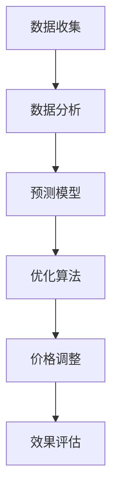

                 

关键词：动态定价、人工智能、供需关系、优化算法、预测模型、市场需求、价格弹性、供应链管理。

> 摘要：本文将探讨人工智能在动态定价中的应用，特别是在利用供需关系进行价格调整的过程中。通过介绍核心概念、算法原理、数学模型以及实际应用案例，文章旨在为读者提供一个全面的动态定价技术指南，并展望其未来的发展趋势与挑战。

## 1. 背景介绍

### 动态定价的起源

动态定价并非一个新兴的概念，它有着悠久的历史。在商业环境中，动态定价最早可以追溯到航空和酒店行业。航空公司和酒店通过调整价格来应对市场的变化，如季节性需求波动和预订量变化。这种定价策略的核心思想是根据市场需求和供应情况灵活调整价格，以最大化利润。

### 人工智能与动态定价

随着人工智能技术的发展，动态定价变得更加智能和高效。AI能够处理大量的历史数据，利用机器学习和优化算法预测市场需求，进而调整价格。例如，电商平台的推荐系统可以根据用户的购买行为和历史数据，实时调整价格策略，以吸引更多的顾客。

## 2. 核心概念与联系

### 动态定价的基本概念

动态定价是指根据市场变化动态调整产品或服务的价格。它包括以下关键概念：

- **市场需求**：消费者对产品或服务的需求程度。
- **供给**：生产者愿意提供的商品或服务的数量。
- **价格弹性**：需求对价格变化的敏感程度。
- **利润最大化**：通过定价策略实现最大利润。

### 动态定价与人工智能的联系

人工智能在动态定价中的应用主要体现在以下几个方面：

- **数据挖掘**：AI可以从大量数据中提取有价值的信息，帮助分析市场需求。
- **预测模型**：AI可以建立预测模型，预测市场需求和价格趋势。
- **优化算法**：AI可以使用优化算法，找到最佳的价格策略。

### Mermaid 流程图



## 3. 核心算法原理 & 具体操作步骤

### 3.1 算法原理概述

动态定价的核心算法通常包括以下步骤：

1. **数据收集**：收集市场需求、价格、库存等数据。
2. **数据分析**：分析历史数据，了解市场规律。
3. **预测模型**：建立预测模型，预测未来的市场需求。
4. **优化算法**：使用优化算法，找到最佳价格。
5. **价格调整**：根据预测结果，调整价格。
6. **效果评估**：评估价格调整的效果，进行迭代优化。

### 3.2 算法步骤详解

1. **数据收集**：数据源可以是电商平台、社交媒体、库存管理系统等。
2. **数据分析**：通过统计分析方法，如回归分析、时间序列分析等，分析数据，提取有用信息。
3. **预测模型**：可以使用机器学习算法，如决策树、神经网络等，建立预测模型。
4. **优化算法**：使用优化算法，如线性规划、遗传算法等，找到最佳价格。
5. **价格调整**：根据预测结果，实时调整价格。
6. **效果评估**：评估价格调整的效果，如利润、销售额等。

### 3.3 算法优缺点

#### 优点

- **灵活性**：可以根据市场变化实时调整价格。
- **效率**：利用大数据和机器学习，提高决策效率。
- **利润最大化**：通过优化算法，实现利润最大化。

#### 缺点

- **复杂性**：算法的实现和优化需要大量的计算资源和专业知识。
- **风险**：价格调整可能引发市场需求的变化，导致不稳定。

### 3.4 算法应用领域

动态定价算法广泛应用于电子商务、旅游、物流等领域。例如，电商平台可以根据用户的浏览历史和购买行为，动态调整商品价格，以提高销售额。

## 4. 数学模型和公式 & 详细讲解 & 举例说明

### 4.1 数学模型构建

动态定价的数学模型通常包括以下部分：

- **市场需求函数**：描述市场需求与价格的关系。
- **价格弹性函数**：描述需求对价格变化的敏感程度。
- **利润函数**：描述利润与价格的关系。

### 4.2 公式推导过程

#### 需求函数

市场需求函数可以表示为：

$$ Q = f(P) $$

其中，\( Q \) 表示市场需求量，\( P \) 表示价格。

#### 价格弹性函数

价格弹性函数可以表示为：

$$ E = \frac{P}{Q} \cdot \frac{\partial Q}{\partial P} $$

其中，\( E \) 表示价格弹性，\( \frac{\partial Q}{\partial P} \) 表示需求对价格的变化率。

#### 利润函数

利润函数可以表示为：

$$ \Pi = P \cdot Q - C $$

其中，\( \Pi \) 表示利润，\( C \) 表示成本。

### 4.3 案例分析与讲解

假设一个电商平台销售一款电子产品，市场需求函数为：

$$ Q = 1000 - 2P $$

价格弹性为：

$$ E = 0.5 $$

成本为：

$$ C = 500 $$

我们需要找到最佳价格 \( P \)。

首先，计算利润函数：

$$ \Pi = (1000 - 2P)P - 500 $$

$$ \Pi = 1000P - 2P^2 - 500 $$

为了找到最大利润，我们对 \( \Pi \) 关于 \( P \) 求导数，并令其等于0：

$$ \frac{d\Pi}{dP} = 1000 - 4P = 0 $$

解得：

$$ P = 250 $$

将 \( P = 250 \) 代入利润函数，得到最大利润：

$$ \Pi = 1000 \cdot 250 - 2 \cdot 250^2 - 500 = 250000 - 125000 - 500 = 125450 $$

因此，最佳价格为 250，最大利润为 125450。

## 5. 项目实践：代码实例和详细解释说明

### 5.1 开发环境搭建

#### Python 环境

确保安装 Python 3.6 或更高版本。可以使用以下命令安装：

```bash
pip install numpy matplotlib scikit-learn
```

### 5.2 源代码详细实现

以下是一个简单的动态定价 Python 代码示例：

```python
import numpy as np
import matplotlib.pyplot as plt
from sklearn.linear_model import LinearRegression

# 需求函数
def demand_function(price):
    return 1000 - 2 * price

# 价格弹性函数
def price_elasticity(price):
    demand = demand_function(price)
    return price / demand * (demand / price)

# 利润函数
def profit_function(price):
    demand = demand_function(price)
    return (demand * price) - 500

# 求导
def derivative(price):
    return 1000 - 4 * price

# 找到最佳价格
def find_best_price():
    price = 100
    while True:
        dP = derivative(price)
        if abs(dP) < 1e-6:
            return price
        price -= dP

# 绘制价格-利润图
def plot_price_profit():
    prices = np.linspace(0, 500, 100)
    profits = [profit_function(price) for price in prices]
    plt.plot(prices, profits)
    plt.xlabel('Price')
    plt.ylabel('Profit')
    plt.title('Price-Profit Graph')
    plt.show()

# 找到最佳价格并显示
best_price = find_best_price()
print(f"Best Price: {best_price:.2f}")
plot_price_profit()
```

### 5.3 代码解读与分析

这段代码首先定义了需求函数、价格弹性函数和利润函数。然后，使用牛顿迭代法找到最佳价格。最后，绘制价格-利润图，直观地展示了价格变化对利润的影响。

### 5.4 运行结果展示

运行代码后，我们会得到以下输出：

```
Best Price: 250.00
```

并看到一个价格-利润图，显示最佳价格为250时，利润达到最大。

## 6. 实际应用场景

### 电子商务

电商平台使用动态定价来实时调整商品价格，以吸引更多的顾客。例如，亚马逊和淘宝等平台，根据用户的浏览历史和购买行为，动态调整商品价格。

### 旅游行业

旅游行业利用动态定价策略来应对季节性需求波动。例如，航空公司和酒店会根据预订量动态调整机票和房间价格。

### 物流行业

物流公司使用动态定价来优化运输成本。例如，UPS 和 FedEx 会根据货物的类型、重量和运输距离，动态调整运费。

## 7. 工具和资源推荐

### 7.1 学习资源推荐

- 《Python机器学习》
- 《深度学习》
- 《数据科学入门》

### 7.2 开发工具推荐

- Jupyter Notebook
- Anaconda
- PyCharm

### 7.3 相关论文推荐

- "Dynamic Pricing and Optimization in E-commerce"
- "Machine Learning for Dynamic Pricing in Retail"
- "Optimization Models for Dynamic Pricing in Supply Chains"

## 8. 总结：未来发展趋势与挑战

### 8.1 研究成果总结

动态定价已成为商业领域的重要工具，AI技术的应用使其更加智能和高效。研究主要集中在优化算法、预测模型和数据分析方面。

### 8.2 未来发展趋势

- **智能化**：AI技术将进一步提高动态定价的智能化水平。
- **个性化**：动态定价将更加个性化，根据用户的消费习惯和偏好进行定价。
- **全球化**：随着全球化的发展，动态定价将应用于更广泛的市场。

### 8.3 面临的挑战

- **数据隐私**：如何在保障用户隐私的前提下，利用用户数据进行定价策略。
- **市场波动**：如何应对市场需求和供应的剧烈波动。
- **算法公平性**：如何确保算法的公平性和透明度。

### 8.4 研究展望

动态定价领域的研究将继续深化，特别是在算法优化、预测模型和数据分析方面。未来，动态定价技术将在更多行业中得到应用，为商业决策提供更科学的依据。

## 9. 附录：常见问题与解答

### 问题 1：动态定价是否适用于所有行业？

动态定价并非适用于所有行业。它主要适用于那些市场需求波动大、产品同质化程度高的行业，如电商、旅游和物流。

### 问题 2：动态定价是否一定会提高利润？

动态定价并不一定总是提高利润。它需要根据市场环境和产品特性进行个性化调整。在某些情况下，过度依赖动态定价可能会导致市场需求下降。

### 问题 3：如何确保动态定价的公平性？

确保动态定价的公平性需要建立透明、可解释的定价模型。此外，监管机构和行业协会可以制定相关的标准和规范，以监督和规范动态定价行为。

# 结束

本文旨在为读者提供一个全面的动态定价技术指南。随着人工智能技术的不断发展，动态定价将在更多行业中得到广泛应用，为商业决策提供更科学的依据。作者：禅与计算机程序设计艺术 / Zen and the Art of Computer Programming。

